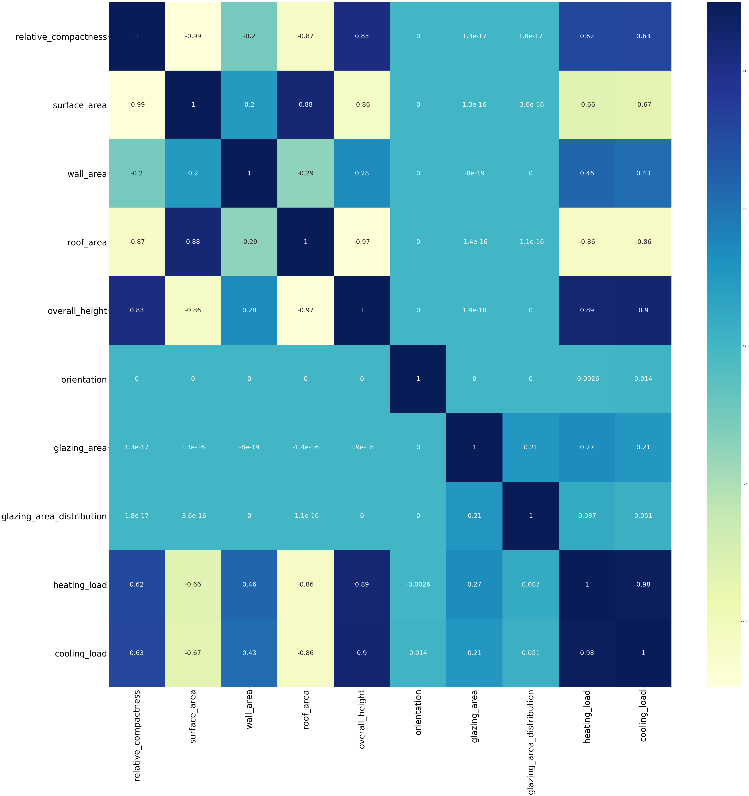

### 1. Importing required libraries


```python
import numpy as np
import pandas as pd
import seaborn as sns

import matplotlib.pyplot as plt
from datetime import datetime, timedelta

from sklearn.preprocessing import MinMaxScaler
from sklearn.model_selection import train_test_split

from sklearn.model_selection import GridSearchCV
from sklearn import cross_validation
from sklearn.linear_model import LinearRegression
from sklearn.linear_model import Ridge
from sklearn.linear_model import Lasso
from sklearn.linear_model import ElasticNet
from sklearn.ensemble import BaggingRegressor
from sklearn.ensemble import RandomForestRegressor
from sklearn.tree import DecisionTreeRegressor
from sklearn.neighbors import KNeighborsRegressor
from sklearn.svm import SVR
import pandas_profiling
from sklearn.metrics import r2_score
import warnings
warnings.filterwarnings('ignore')

%matplotlib inline
```


```python
from keras.models import Sequential
from keras.layers import Dense
from keras.layers import Dropout
from keras.utils import np_utils
from sklearn.model_selection import StratifiedKFold
from keras.constraints import maxnorm
from sklearn.metrics import explained_variance_score
from sklearn.metrics import mean_squared_error
from sklearn.metrics import mean_absolute_error
```

    Using TensorFlow backend.
    

### 2. Setting seed for reporducability


```python
seed = 10
np.random.seed(seed)
```

### 3. Importing data from CSV file


```python
data = pd.read_csv('ENB2012_data.csv')

```


```python
data.shape
```


    (768, 10)


### 4. Renaming columns


```python
data.columns = ['relative_compactness', 'surface_area', 'wall_area', 'roof_area', 'overall_height',
                'orientation', 'glazing_area', 'glazing_area_distribution', 'heating_load', 'cooling_load']
```


```python
data.head()
```


<div>
<style>
    .dataframe thead tr:only-child th {
        text-align: right;
    }

    .dataframe thead th {
        text-align: left;
    }

    .dataframe tbody tr th {
        vertical-align: top;
    }
</style>
<table border="1" class="dataframe">
  <thead>
    <tr style="text-align: right;">
      <th></th>
      <th>relative_compactness</th>
      <th>surface_area</th>
      <th>wall_area</th>
      <th>roof_area</th>
      <th>overall_height</th>
      <th>orientation</th>
      <th>glazing_area</th>
      <th>glazing_area_distribution</th>
      <th>heating_load</th>
      <th>cooling_load</th>
    </tr>
  </thead>
  <tbody>
    <tr>
      <th>0</th>
      <td>0.98</td>
      <td>514.5</td>
      <td>294.0</td>
      <td>110.25</td>
      <td>7.0</td>
      <td>2</td>
      <td>0.0</td>
      <td>0</td>
      <td>15.55</td>
      <td>21.33</td>
    </tr>
    <tr>
      <th>1</th>
      <td>0.98</td>
      <td>514.5</td>
      <td>294.0</td>
      <td>110.25</td>
      <td>7.0</td>
      <td>3</td>
      <td>0.0</td>
      <td>0</td>
      <td>15.55</td>
      <td>21.33</td>
    </tr>
    <tr>
      <th>2</th>
      <td>0.98</td>
      <td>514.5</td>
      <td>294.0</td>
      <td>110.25</td>
      <td>7.0</td>
      <td>4</td>
      <td>0.0</td>
      <td>0</td>
      <td>15.55</td>
      <td>21.33</td>
    </tr>
    <tr>
      <th>3</th>
      <td>0.98</td>
      <td>514.5</td>
      <td>294.0</td>
      <td>110.25</td>
      <td>7.0</td>
      <td>5</td>
      <td>0.0</td>
      <td>0</td>
      <td>15.55</td>
      <td>21.33</td>
    </tr>
    <tr>
      <th>4</th>
      <td>0.90</td>
      <td>563.5</td>
      <td>318.5</td>
      <td>122.50</td>
      <td>7.0</td>
      <td>2</td>
      <td>0.0</td>
      <td>0</td>
      <td>20.84</td>
      <td>28.28</td>
    </tr>
  </tbody>
</table>
</div>


```python
data.info()
```

    <class 'pandas.core.frame.DataFrame'>
    RangeIndex: 768 entries, 0 to 767
    Data columns (total 10 columns):
    relative_compactness         768 non-null float64
    surface_area                 768 non-null float64
    wall_area                    768 non-null float64
    roof_area                    768 non-null float64
    overall_height               768 non-null float64
    orientation                  768 non-null int64
    glazing_area                 768 non-null float64
    glazing_area_distribution    768 non-null int64
    heating_load                 768 non-null float64
    cooling_load                 768 non-null float64
    dtypes: float64(8), int64(2)
    memory usage: 60.1 KB
    

### 5. Checking if there are any missing values


```python
pd.isnull(data).values.any()
```


    False


### 6. Plotting correlations between variables


```python
corr = data.corr()
fig, ax = plt.subplots(figsize=(60, 60))
ax.tick_params(labelsize=40)
sns.heatmap(corr, annot=True,annot_kws={"size": 30},cmap='YlGnBu')
plt.show()
```





#### a. 'overall_height' is highly correlated (positively) with both 'heating_load' and 'cooling_load'
#### b. The second most correlated variable is 'roof_area' (negative correlation)

### 7. Descriptive Analysis


```python
data.describe()
```


<div>
<style>
    .dataframe thead tr:only-child th {
        text-align: right;
    }

    .dataframe thead th {
        text-align: left;
    }

    .dataframe tbody tr th {
        vertical-align: top;
    }
</style>
<table border="1" class="dataframe">
  <thead>
    <tr style="text-align: right;">
      <th></th>
      <th>relative_compactness</th>
      <th>surface_area</th>
      <th>wall_area</th>
      <th>roof_area</th>
      <th>overall_height</th>
      <th>orientation</th>
      <th>glazing_area</th>
      <th>glazing_area_distribution</th>
      <th>heating_load</th>
      <th>cooling_load</th>
    </tr>
  </thead>
  <tbody>
    <tr>
      <th>count</th>
      <td>768.000000</td>
      <td>768.000000</td>
      <td>768.000000</td>
      <td>768.000000</td>
      <td>768.00000</td>
      <td>768.000000</td>
      <td>768.000000</td>
      <td>768.00000</td>
      <td>768.000000</td>
      <td>768.000000</td>
    </tr>
    <tr>
      <th>mean</th>
      <td>0.764167</td>
      <td>671.708333</td>
      <td>318.500000</td>
      <td>176.604167</td>
      <td>5.25000</td>
      <td>3.500000</td>
      <td>0.234375</td>
      <td>2.81250</td>
      <td>22.307201</td>
      <td>24.587760</td>
    </tr>
    <tr>
      <th>std</th>
      <td>0.105777</td>
      <td>88.086116</td>
      <td>43.626481</td>
      <td>45.165950</td>
      <td>1.75114</td>
      <td>1.118763</td>
      <td>0.133221</td>
      <td>1.55096</td>
      <td>10.090196</td>
      <td>9.513306</td>
    </tr>
    <tr>
      <th>min</th>
      <td>0.620000</td>
      <td>514.500000</td>
      <td>245.000000</td>
      <td>110.250000</td>
      <td>3.50000</td>
      <td>2.000000</td>
      <td>0.000000</td>
      <td>0.00000</td>
      <td>6.010000</td>
      <td>10.900000</td>
    </tr>
    <tr>
      <th>25%</th>
      <td>0.682500</td>
      <td>606.375000</td>
      <td>294.000000</td>
      <td>140.875000</td>
      <td>3.50000</td>
      <td>2.750000</td>
      <td>0.100000</td>
      <td>1.75000</td>
      <td>12.992500</td>
      <td>15.620000</td>
    </tr>
    <tr>
      <th>50%</th>
      <td>0.750000</td>
      <td>673.750000</td>
      <td>318.500000</td>
      <td>183.750000</td>
      <td>5.25000</td>
      <td>3.500000</td>
      <td>0.250000</td>
      <td>3.00000</td>
      <td>18.950000</td>
      <td>22.080000</td>
    </tr>
    <tr>
      <th>75%</th>
      <td>0.830000</td>
      <td>741.125000</td>
      <td>343.000000</td>
      <td>220.500000</td>
      <td>7.00000</td>
      <td>4.250000</td>
      <td>0.400000</td>
      <td>4.00000</td>
      <td>31.667500</td>
      <td>33.132500</td>
    </tr>
    <tr>
      <th>max</th>
      <td>0.980000</td>
      <td>808.500000</td>
      <td>416.500000</td>
      <td>220.500000</td>
      <td>7.00000</td>
      <td>5.000000</td>
      <td>0.400000</td>
      <td>5.00000</td>
      <td>43.100000</td>
      <td>48.030000</td>
    </tr>
  </tbody>
</table>
</div>


```python
pandas_profiling.ProfileReport(data)
```


<meta charset="UTF-8">

<style>

        .variablerow {
            border: 1px solid #e1e1e8;
            border-top: hidden;
            padding-top: 2em;
            padding-bottom: 2em;
            padding-left: 1em;
            padding-right: 1em;
        }

        .headerrow {
            border: 1px solid #e1e1e8;
            background-color: #f5f5f5;
            padding: 2em;
        }
        .namecol {
            margin-top: -1em;
            overflow-x: auto;
        }

        .dl-horizontal dt {
            text-align: left;
            padding-right: 1em;
            white-space: normal;
        }

        .dl-horizontal dd {
            margin-left: 0;
        }

        .ignore {
            opacity: 0.4;
        }

        .container.pandas-profiling {
            max-width:975px;
        }

        .col-md-12 {
            padding-left: 2em;
        }

        .indent {
            margin-left: 1em;
        }

        .center-img {
            margin-left: auto !important;
            margin-right: auto !important;
            display: block;
        }

        /* Table example_values */
            table.example_values {
                border: 0;
            }

            .example_values th {
                border: 0;
                padding: 0 ;
                color: #555;
                font-weight: 600;
            }

            .example_values tr, .example_values td{
                border: 0;
                padding: 0;
                color: #555;
            }

        /* STATS */
            table.stats {
                border: 0;
            }

            .stats th {
                border: 0;
                padding: 0 2em 0 0;
                color: #555;
                font-weight: 600;
            }

            .stats tr {
                border: 0;
            }

            .stats td{
                color: #555;
                padding: 1px;
                border: 0;
            }


        /* Sample table */
            table.sample {
                border: 0;
                margin-bottom: 2em;
                margin-left:1em;
            }
            .sample tr {
                border:0;
            }
            .sample td, .sample th{
                padding: 0.5em;
                white-space: nowrap;
                border: none;

            }

            .sample thead {
                border-top: 0;
                border-bottom: 2px solid #ddd;
            }

            .sample td {
                width:100%;
            }


        /* There is no good solution available to make the divs equal height and then center ... */
            .histogram {
                margin-top: 3em;
            }
        /* Freq table */

            table.freq {
                margin-bottom: 2em;
                border: 0;
            }
            table.freq th, table.freq tr, table.freq td {
                border: 0;
                padding: 0;
            }

            .freq thead {
                font-weight: 600;
                white-space: nowrap;
                overflow: hidden;
                text-overflow: ellipsis;

            }

            td.fillremaining{
                width:auto;
                max-width: none;
            }

            td.number, th.number {
                text-align:right ;
            }

        /* Freq mini */
            .freq.mini td{
                width: 50%;
                padding: 1px;
                font-size: 12px;

            }
            table.freq.mini {
                 width:100%;
            }
            .freq.mini th {
                overflow: hidden;
                text-overflow: ellipsis;
                white-space: nowrap;
                max-width: 5em;
                font-weight: 400;
                text-align:right;
                padding-right: 0.5em;
            }

            .missing {
                color: #a94442;
            }
            .alert, .alert > th, .alert > td {
                color: #a94442;
            }


        /* Bars in tables */
            .freq .bar{
                float: left;
                width: 0;
                height: 100%;
                line-height: 20px;
                color: #fff;
                text-align: center;
                background-color: #337ab7;
                border-radius: 3px;
                margin-right: 4px;
            }
            .other .bar {
                background-color: #999;
            }
            .missing .bar{
                background-color: #a94442;
            }
            .tooltip-inner {
                width: 100%;
                white-space: nowrap;
                text-align:left;
            }

            .extrapadding{
                padding: 2em;
            }

            .pp-anchor{

            }

</style>

<div class="container pandas-profiling">
    <div class="row headerrow highlight">
        <h1>Overview</h1>
    </div>
    <div class="row variablerow">
    <div class="col-md-6 namecol">
        <p class="h4">Dataset info</p>
        <table class="stats" style="margin-left: 1em;">
            <tbody>
            <tr>
                <th>Number of variables</th>
                <td>10 </td>
            </tr>
            <tr>
                <th>Number of observations</th>
                <td>768 </td>
            </tr>
            <tr>
                <th>Total Missing (%)</th>
                <td>0.0% </td>
            </tr>
            <tr>
                <th>Total size in memory</th>
                <td>60.1 KiB </td>
            </tr>
            <tr>
                <th>Average record size in memory</th>
                <td>80.1 B </td>
            </tr>
            </tbody>
        </table>
    </div>
    <div class="col-md-6 namecol">
        <p class="h4">Variables types</p>
        <table class="stats" style="margin-left: 1em;">
            <tbody>
            <tr>
                <th>Numeric</th>
                <td>8 </td>
            </tr>
            <tr>
                <th>Categorical</th>
                <td>0 </td>
            </tr>
            <tr>
                <th>Boolean</th>
                <td>1 </td>
            </tr>
            <tr>
                <th>Date</th>
                <td>0 </td>
            </tr>
            <tr>
                <th>Text (Unique)</th>
                <td>0 </td>
            </tr>
            <tr>
                <th>Rejected</th>
                <td>1 </td>
            </tr>
            <tr>
                <th>Unsupported</th>
                <td>0 </td>
            </tr>
            </tbody>
        </table>
    </div>
    <div class="col-md-12" style="padding-left: 1em;">
        
        <p class="h4">Warnings</p>
        <ul class="list-unstyled"><li><a href="#pp_var_cooling_load"><code>cooling_load</code></a> is highly correlated with <a href="#pp_var_heating_load"><code>heating_load</code></a> (ρ = 0.97586) <span class="label label-primary">Rejected</span></li><li><a href="#pp_var_glazing_area"><code>glazing_area</code></a> has 48 / 6.2% zeros <span class="label label-info">Zeros</span></li><li><a href="#pp_var_glazing_area_distribution"><code>glazing_area_distribution</code></a> has 48 / 6.2% zeros <span class="label label-info">Zeros</span></li> </ul>
    </div>
</div>
    <div class="row headerrow highlight">
        <h1>Variables</h1>
    </div>
    <div class="row variablerow ignore">
    <div class="col-md-3 namecol">
        <p class="h4 pp-anchor" id="pp_var_cooling_load"><s>cooling_load</s><br/>
            <small>Highly correlated</small>
        </p>
    </div><div class="col-md-3">
    <p><em>This variable is highly correlated with <a href="#pp_var_heating_load"><code>heating_load</code></a> and should be ignored for analysis</em></p>
</div>
<div class="col-md-6">
    <table class="stats ">
        <tr>
            <th>Correlation</th>
            <td>0.97586</td>
        </tr>
    </table>
</div>
</div><div class="row variablerow">
    <div class="col-md-3 namecol">
        <p class="h4 pp-anchor" id="pp_var_glazing_area">glazing_area<br/>
            <small>Numeric</small>
        </p>
    </div><div class="col-md-6">
    <div class="row">
        <div class="col-sm-6">
            <table class="stats ">
                <tr>
                    <th>Distinct count</th>
                    <td>4</td>
                </tr>
                <tr>
                    <th>Unique (%)</th>
                    <td>0.5%</td>
                </tr>
                <tr class="ignore">
                    <th>Missing (%)</th>
                    <td>0.0%</td>
                </tr>
                <tr class="ignore">
                    <th>Missing (n)</th>
                    <td>0</td>
                </tr>
                <tr class="ignore">
                    <th>Infinite (%)</th>
                    <td>0.0%</td>
                </tr>
                <tr class="ignore">
                    <th>Infinite (n)</th>
                    <td>0</td>
                </tr>
            </table>

        </div>
        <div class="col-sm-6">
            <table class="stats ">

                <tr>
                    <th>Mean</th>
                    <td>0.23438</td>
                </tr>
                <tr>
                    <th>Minimum</th>
                    <td>0</td>
                </tr>
                <tr>
                    <th>Maximum</th>
                    <td>0.4</td>
                </tr>
                <tr class="alert">
                    <th>Zeros (%)</th>
                    <td>6.2%</td>
                </tr>
            </table>
        </div>
    </div>
</div>
<div class="col-md-3 collapse in" id="minihistogram7523360857552916337">
    

</div>
<div class="col-md-12 text-right">
    <a role="button" data-toggle="collapse" data-target="#descriptives7523360857552916337,#minihistogram7523360857552916337"
       aria-expanded="false" aria-controls="collapseExample">
        Toggle details
    </a>
</div>
<div class="row collapse col-md-12" id="descriptives7523360857552916337">
    <ul class="nav nav-tabs" role="tablist">
        <li role="presentation" class="active"><a href="#quantiles7523360857552916337"
                                                  aria-controls="quantiles7523360857552916337" role="tab"
                                                  data-toggle="tab">Statistics</a></li>
        <li role="presentation"><a href="#histogram7523360857552916337" aria-controls="histogram7523360857552916337"
                                   role="tab" data-toggle="tab">Histogram</a></li>
        <li role="presentation"><a href="#common7523360857552916337" aria-controls="common7523360857552916337"
                                   role="tab" data-toggle="tab">Common Values</a></li>
        <li role="presentation"><a href="#extreme7523360857552916337" aria-controls="extreme7523360857552916337"
                                   role="tab" data-toggle="tab">Extreme Values</a></li>

    </ul>

    <div class="tab-content">
        <div role="tabpanel" class="tab-pane active row" id="quantiles7523360857552916337">
            <div class="col-md-4 col-md-offset-1">
                <p class="h4">Quantile statistics</p>
                <table class="stats indent">
                    <tr>
                        <th>Minimum</th>
                        <td>0</td>
                    </tr>
                    <tr>
                        <th>5-th percentile</th>
                        <td>0</td>
                    </tr>
                    <tr>
                        <th>Q1</th>
                        <td>0.1</td>
                    </tr>
                    <tr>
                        <th>Median</th>
                        <td>0.25</td>
                    </tr>
                    <tr>
                        <th>Q3</th>
                        <td>0.4</td>
                    </tr>
                    <tr>
                        <th>95-th percentile</th>
                        <td>0.4</td>
                    </tr>
                    <tr>
                        <th>Maximum</th>
                        <td>0.4</td>
                    </tr>
                    <tr>
                        <th>Range</th>
                        <td>0.4</td>
                    </tr>
                    <tr>
                        <th>Interquartile range</th>
                        <td>0.3</td>
                    </tr>
                </table>
            </div>
            <div class="col-md-4 col-md-offset-2">
                <p class="h4">Descriptive statistics</p>
                <table class="stats indent">
                    <tr>
                        <th>Standard deviation</th>
                        <td>0.13322</td>
                    </tr>
                    <tr>
                        <th>Coef of variation</th>
                        <td>0.56841</td>
                    </tr>
                    <tr>
                        <th>Kurtosis</th>
                        <td>-1.3276</td>
                    </tr>
                    <tr>
                        <th>Mean</th>
                        <td>0.23438</td>
                    </tr>
                    <tr>
                        <th>MAD</th>
                        <td>0.11328</td>
                    </tr>
                    <tr class="">
                        <th>Skewness</th>
                        <td>-0.060254</td>
                    </tr>
                    <tr>
                        <th>Sum</th>
                        <td>180</td>
                    </tr>
                    <tr>
                        <th>Variance</th>
                        <td>0.017748</td>
                    </tr>
                    <tr>
                        <th>Memory size</th>
                        <td>6.1 KiB</td>
                    </tr>
                </table>
            </div>
        </div>
        <div role="tabpanel" class="tab-pane col-md-8 col-md-offset-2" id="histogram7523360857552916337">
            <img src="data:image/png;base64,iVBORw0KGgoAAAANSUhEUgAAAlgAAAGQCAYAAAByNR6YAAAABHNCSVQICAgIfAhkiAAAAAlwSFlzAAAPYQAAD2EBqD%2BnaQAAADl0RVh0U29mdHdhcmUAbWF0cGxvdGxpYiB2ZXJzaW9uIDIuMS4wLCBodHRwOi8vbWF0cGxvdGxpYi5vcmcvpW3flQAAIABJREFUeJzt3Xt8VPWd//H3mMskZpOBEJJJIKQpJd5CqVwKQZGAGEgFarErNCVLXBbrKlgaWBfKtsTWJhRFaUWtUhW8oq5oce1SgiJgQ0QRKoQsRa6hJgQUc0Ecbt/fHz6Yn2MSSOCbzEl4PR%2BP8zBzzne%2B8/nkzJH348yZE5cxxggAAADWXBLsAgAAADoaAhYAAIBlBCwAAADLCFgAAACWEbAAAAAsI2ABAABYRsACAACwjIAFAABgGQELAADAMgIWAACAZQQsAAAAywhYAAAAlhGwAAAALCNgAQAAWEbAAgAAsIyABQAAYBkBCwAAwDICFgAAgGUELAAAAMsIWAAAAJYRsAAAACwjYAEAAFhGwAIAALCMgAUAAGAZAQsAAMAyAhYAAIBlBCwAAADLCFgAAACWEbAAAAAsI2ABAABYRsACAACwjIAFAABgGQELAADAMgIWAACAZQQsAAAAywhYAAAAlhGwAAAALOvQAauoqEgDBgxQdHS04uPjddNNN2nHjh0BYzIzM%2BVyuQKWCRMmBIw5cuSIcnNz5fF45PF4lJubq88%2B%2B6wtWwEAAO2Iyxhjgl1Eaxk1apQmTJigAQMG6OTJk5ozZ462bt2q7du3KyoqStKXASstLU2/%2BtWv/M%2BLjIyUx%2BPxP87OztaBAwf0%2BOOPS5Juu%2B02feMb39Drr7/erDpOnz6tjz/%2BWNHR0XK5XBY7BAAATTHGqK6uTklJSbrkkjY%2Bp2QuItXV1UaSWbt2rX/d0KFDzU9/%2BtMmn7N9%2B3YjyZSWlvrXbdiwwUgy//d//9es162oqDCSWFhYWFhYWIKwVFRUnH94OE%2BhuojU1NRIkmJjYwPWP/fcc3r22WeVkJCg7OxszZ07V9HR0ZKkDRs2yOPxaODAgf7xgwYNksfjUUlJiS677LJzvu6ZuSoqKhQTE2OrHQAAcBa1tbVKTk72/zvcli6agGWMUX5%2Bvq699lqlp6f71//4xz9WamqqvF6vtm3bptmzZ%2Btvf/ubiouLJUlVVVWKj49vMF98fLyqqqoafS2fzyefz%2Bd/XFdXJ0mKiYkhYAEA0MaCcXnORROwpk6dqg8//FDvvPNOwPopU6b4f05PT1evXr3Uv39/ffDBB%2Brbt6%2BkxneMMabJHVZUVKR77rnHYvUAAKA96dDfIjxj2rRpWrFihdasWaPu3bufdWzfvn0VFhamnTt3SpK8Xq8OHjzYYNyhQ4eUkJDQ6ByzZ89WTU2Nf6moqLjwJgAAQLvRoQOWMUZTp07V8uXL9dZbbyk1NfWczykrK9OJEyeUmJgoScrIyFBNTY02btzoH/Puu%2B%2BqpqZGgwcPbnQOt9vt/ziQjwUBALj4dOjbNNxxxx16/vnn9ac//SngYnSPx6PIyEjt2rVLzz33nL73ve8pLi5O27dv14wZMxQZGan33ntPISEhkr68TcPHH3%2Bsxx57TNKXt2lISUlp9m0aamtr5fF4VFNTQ9gCAKCNBPPf3w4dsJq6Ruqpp55SXl6eKioqNHHiRG3btk319fVKTk7WjTfeqLlz5wZ80/DTTz/VXXfdpRUrVkiSxo4dq0WLFqlTp07NqoOABQBA2yNgdXAELAAA2l4w//3t0NdgAQAABAMBCwAAwDICFgAAgGUELAAAAMsIWAAAAJYRsAAAACy7aP4WIdBS/eesDHYJLfL%2Bb0YFuwQ4RHt67/K%2BbV28F4KHM1gAAACWEbAAAAAsI2ABAABYRsACAACwjIAFAABgGQELAADAMgIWAACAZQQsAAAAywhYAAAAlhGwAAAALCNgAQAAWEbAAgAAsIyABQAAYBkBCwAAwDICFgAAgGUELAAAAMsIWAAAAJYRsAAAACwjYAEAAFhGwAIAALCMgAUAAGAZAQsAAMAyAhYAAIBlBCwAAADLCFgAAACWEbAAAAAsI2ABAABYRsACAACwjIAFAABgGQELAADAMgIWAACAZQQsAAAAywhYAAAAlhGwAAAALCNgAQAAWEbAAgAAsIyABQAAYBkBCwAAwDICFgAAgGUELAAAAMsIWAAAAJYRsAAAACwjYAEAAFhGwAIAALCMgAUAAGAZAQsAAMCyDh2wioqKNGDAAEVHRys%2BPl433XSTduzYETDG5/Np2rRpiouLU1RUlMaOHasDBw4EjNm/f7/GjBmjqKgoxcXF6a677tLx48fbshUAANCOdOiAtXbtWt15550qLS1VcXGxTp48qaysLB09etQ/Zvr06Xr11Ve1bNkyvfPOO6qvr9fo0aN16tQpSdKpU6d044036ujRo3rnnXe0bNkyvfLKK5oxY0aw2gIAAA4XGuwCWtPKlSsDHj/11FOKj4/Xpk2bdN1116mmpkZPPPGEnnnmGY0YMUKS9Oyzzyo5OVmrV6/WyJEjtWrVKm3fvl0VFRVKSkqSJC1YsEB5eXn6zW9%2Bo5iYmDbvCwAAOFuHPoP1dTU1NZKk2NhYSdKmTZt04sQJZWVl%2BcckJSUpPT1dJSUlkqQNGzYoPT3dH64kaeTIkfL5fNq0aVOjr%2BPz%2BVRbWxuwAACAi8dFE7CMMcrPz9e1116r9PR0SVJVVZXCw8PVuXPngLEJCQmqqqryj0lISAjY3rlzZ4WHh/vHfF1RUZE8Ho9/SU5OboWOAACAU100AWvq1Kn68MMP9cILL5xzrDFGLpfL//irPzc15qtmz56tmpoa/1JRUXH%2BhQMAgHbnoghY06ZN04oVK7RmzRp1797dv97r9er48eM6cuRIwPjq6mr/WSuv19vgTNWRI0d04sSJBme2znC73YqJiQlYAADAxaNDByxjjKZOnarly5frrbfeUmpqasD2fv36KSwsTMXFxf51lZWV2rZtmwYPHixJysjI0LZt21RZWekfs2rVKrndbvXr169tGgEAAO1Kh/4W4Z133qnnn39ef/rTnxQdHe0/E%2BXxeBQZGSmPx6PJkydrxowZ6tKli2JjYzVz5kz17t3b/63CrKwsXXnllcrNzdV9992nTz/9VDNnztSUKVM4MwUAABrVoQPWo48%2BKknKzMwMWP/UU08pLy9PkvTggw8qNDRUt9xyi44dO6brr79eS5YsUUhIiCQpJCREb7zxhu644w5dc801ioyMVE5Oju6///62bAUAALQjHTpgGWPOOSYiIkIPPfSQHnrooSbH9OjRQ//zP/9jszQAANCBdehrsAAAAIKBgAUAAGAZAQsAAMAyAhYAAIBlBCwAAADLCFgAAACWEbAAAAAsI2ABAABYRsACAACwjIAFAABgGQELAADAMgIWAACAZQQsAAAAywhYAAAAlhGwAAAALCNgAQAAWEbAAgAAsIyABQAAYBkBCwAAwDICFgAAgGUELAAAAMsIWAAAAJYRsAAAACwjYAEAAFhGwAIAALCMgAUAAGAZAQsAAMAyAhYAAIBlBCwAAADLCFgAAACWEbAAAAAsI2ABAABYRsACAACwjIAFAABgGQELAADAMgIWAACAZQQsAAAAywhYAAAAlhGwAAAALCNgAQAAWEbAAgAAsIyABQAAYBkBCwAAwDICFgAAgGUELAAAAMsIWAAAAJYRsAAAACwjYAEAAFhGwAIAALCMgAUAAGAZAQsAAMAyAhYAAIBlHTpgrVu3TmPGjFFSUpJcLpdee%2B21gO15eXlyuVwBy6BBgwLG%2BHw%2BTZs2TXFxcYqKitLYsWN14MCBtmwDAAC0M44NWM8%2B%2B6y%2B%2BOKLC5rj6NGj6tOnjxYtWtTkmFGjRqmystK//PnPfw7YPn36dL366qtatmyZ3nnnHdXX12v06NE6derUBdUGAAA6rtBgF9CU/Px8TZ06VePHj9fkyZP13e9%2Bt8VzZGdnKzs7%2B6xj3G63vF5vo9tqamr0xBNP6JlnntGIESMkfRn8kpOTtXr1ao0cObLFNQEAgI7PsWewPv74Yz355JOqrKzUtddeq6uuukoLFizQoUOHrL7O22%2B/rfj4eKWlpWnKlCmqrq72b9u0aZNOnDihrKws/7qkpCSlp6erpKTEah0AAKDjcGzACg0N1bhx47RixQrt379fkyZN0pNPPqnu3btr3LhxeuONN2SMuaDXyM7O1nPPPae33npLCxYs0Hvvvafhw4fL5/NJkqqqqhQeHq7OnTsHPC8hIUFVVVVNzuvz%2BVRbWxuwAACAi4djA9ZXeb1eXX/99crMzJTL5dL777%2BvnJwc9erVS%2BvXrz/vecePH68bb7xR6enpGjNmjP73f/9Xf//73/XGG2%2Bc9XnGGLlcria3FxUVyePx%2BJfk5OTzrhEAALQ/jg5Yhw8f1sKFC9WnTx9dc801qq6u1muvvaZ9%2B/bpH//4h0aPHq1/%2BZd/sfZ6iYmJSklJ0c6dOyV9GeyOHz%2BuI0eOBIyrrq5WQkJCk/PMnj1bNTU1/qWiosJajQAAwPkcG7B%2B8IMfqFu3bvrDH/6g3NxcVVRU6OWXX9aoUaPkcrn0T//0T7r77ru1b98%2Ba6/5ySefqKKiQomJiZKkfv36KSwsTMXFxf4xlZWV2rZtmwYPHtzkPG63WzExMQELAAC4eDj2W4QxMTFavXq1hgwZ0uSYxMRE/9mmxtTX1%2Bujjz7yP96zZ4%2B2bNmi2NhYxcbGqqCgQDfffLMSExO1d%2B9e/fznP1dcXJx%2B8IMfSJI8Ho8mT56sGTNmqEuXLoqNjdXMmTPVu3dv/7cKAQAAvs6xAWvp0qXnHONyudSzZ88mt7///vsaNmyY/3F%2Bfr4kadKkSXr00Ue1detWPf300/rss8%2BUmJioYcOG6cUXX1R0dLT/OQ8%2B%2BKBCQ0N1yy236NixY7r%2B%2Buu1ZMkShYSEXEB3AACgI3NswPrZz36mnj17aurUqQHrH374Ye3evVsLFiw45xyZmZln/abhX/7yl3POERERoYceekgPPfTQuYsGAACQg6/Bevnllxv82RpJysjI0IsvvhiEigAAAJrHsQHr8OHDDe4/JX15bdbhw4eDUBEAAEDzODZg9ezZs9GP8P7yl78oNTU1CBUBAAA0j2OvwZo%2BfbqmT5%2BuTz75RMOHD5ckvfnmm5o/f77uv//%2BIFcHAADQNMcGrClTpuiLL75QYWGh5s6dK0nq3r27fv/73%2Btf//Vfg1wdAABA0xwbsCRp2rRpmjZtmiorKxUZGalOnToFuyQAAIBzcnTAOuPMndUBAADaA8de5H7o0CHdeuut6tGjhyIiIhQeHh6wAAAAOJVjz2Dl5eVp165d%2Bo//%2BA8lJibK5XIFuyQAAIBmcWzAWrdundatW6err7462KUAAAC0iGM/IuzevTtnrQAAQLvk2ID14IMPavbs2Tpw4ECwSwEAAGgRx35EmJubq7q6OqWkpCgmJkZhYWEB26urq4NUGQAAwNk5NmDNmzcv2CUAAACcF8cGrMmTJwe7BAAAgPPi2GuwJGnv3r0qKChQbm6u/yPBVatWqby8PMiVAQAANM2xAWv9%2BvW66qqrtHbtWr300kuqr6%2BXJH3wwQf65S9/GeTqAAAAmubYgPWf//mfKigo0Jo1awLu3D58%2BHCVlpYGsTIAAICzc2zA%2BvDDD/XDH/6wwfr4%2BHgdOnQoCBUBAAA0j2MDVqdOnVRVVdVg/ZYtW9StW7cgVAQAANA8jg1YEyZM0KxZs3To0CH/Hd3fffddzZw5UxMnTgxydQAAAE1zbMAqLCyU1%2BtVYmKi6uvrdeWVV2rw4MEaMGCAfvGLXwS7PAAAgCY59j5Y4eHhevHFF/X3v/9dH3zwgU6fPq2%2Bffvq8ssvD3ZpAAAAZ%2BXYgHVGWlqa0tLSgl0GAABAszk2YN12221n3f7444%2B3USUAAAAt49iAVVlZGfD4xIkTKisrU11dna677rogVQUAAHBujg1Yr7/%2BeoN1J0%2Be1L//%2B7/riiuuCEJFAAAAzePYbxE2JjQ0VDNnztR9990X7FIAAACa1K4CliTt3r1bJ06cCHYZAAAATXLsR4R33313wGNjjCorK7VixQr9%2BMc/DlJVAAAA5%2BbYgLVhw4aAx5dccom6du2qefPmacqUKUGqCgAA4NwcG7DWr18f7BIAAADOS7u7BgsAAMDpHHsGa8CAAf4/8nwuGzdubOVqAAAAms%2BxAWvYsGF67LHHlJaWpoyMDElSaWmpduzYoZ/85Cdyu91BrhAAAKBxjg1Yn332me68804VFhYGrJ8zZ44OHjyoP/7xj0GqDAAA4Owcew3WSy%2B9pFtvvbXB%2Bry8PL388stBqAgAAKB5HBuw3G63SkpKGqwvKSnh40EAAOBojv2I8K677tLtt9%2BuzZs3a9CgQZK%2BvAZr8eLF%2BvnPfx7k6gAAAJrm2IA1Z84cpaam6ne/%2B52efPJJSdIVV1yhxYsXKycnJ8jVAQAANM2xAUuScnJyCFMAAKDdcew1WJJUW1urJUuW6Je//KWOHDkiSfrb3/6mysrKIFcGAADQNMeewdq2bZtGjBihSy%2B9VBUVFcrLy1Pnzp310ksv6cCBA1q6dGmwSwQAAGiUY89g/exnP1NOTo527dqliIgI//obb7xR69atC2JlAAAAZ%2BfYM1jvvfeeHn300QZ/Lqdbt258RAgAABzNsWewwsPDVV9f32D9zp07FRcXF4SKAAAAmsexAWvs2LH69a9/rZMnT0qSXC6X/vGPf2jWrFkaN25ckKsDAABommMD1oIFC/Txxx/L6/Xq2LFjGj58uL75zW8qIiKiwd8nBAAAcBLHXoPl8XhUUlKi4uJiffDBBzp9%2BrT69u2rkSNHNrguCwAAwEkcGbBOnDih733ve3rkkUeUlZWlrKysYJcEAADQbI78iDAsLEybN2/mTBUAAGiXHBmwJGnixIl66qmngl0GAABAiznyI8IzFi1apNWrV6t///6KiooK2DZ//vwgVQUAAHB2jj2DtWnTJn37299WeHi4PvzwQ23YsMG/lJaWNmuOdevWacyYMUpKSpLL5dJrr70WsN0Yo4KCAiUlJSkyMlKZmZkqKysLGHPkyBHl5ubK4/HI4/EoNzdXn332mbU%2BAQBAx%2BO4M1i7d%2B9Wamqq1q9ff8FzHT16VH369NGtt96qm2%2B%2BucH2%2BfPn64EHHtCSJUuUlpame%2B%2B9VzfccIN27Nih6OhoSVJOTo4OHDiglStXSpJuu%2B025ebm6vXXX7/g%2BgAAQMfkuIDVq1cvVVZWKj4%2BXpI0fvx4/f73v1dCQkKL58rOzlZ2dnaj24wxWrhwoebMmeO/cenSpUuVkJCg559/Xj/5yU9UXl6ulStXqrS0VAMHDpQkLV68WBkZGdqxY4cuu%2Byy8%2BwSAAB0ZI77iNAYE/D4z3/%2Bs44ePWr9dfbs2aOqqqqAW0C43W4NHTpUJSUlkqQNGzbI4/H4w5UkDRo0yH%2BPrqb4fD7V1tYGLAAA4OLhuIDVVqqqqiSpwZmxhIQE/7aqqir/mbSvio%2BP949pTFFRkf%2BaLY/Ho%2BTkZIuVAwAAp3NcwHK5XA3uf9Wa98P6%2BtzGmIB1jb3218d83ezZs1VTU%2BNfKioq7BUMAAAcz3HXYBljlJeXJ7fbLUn64osvdPvttze4TcPy5csv6HW8Xq%2BkL89SJSYm%2BtdXV1f7z2p5vV4dPHiwwXMPHTp01mvC3G63v34AAHDxcdwZrEmTJik%2BPt7/8drEiROVlJQU8JGbx%2BO54NdJTU2V1%2BtVcXGxf93x48e1du1aDR48WJKUkZGhmpoabdy40T/m3XffVU1NjX8MAADA1znuDJbNu7fX19fro48%2B8j/es2ePtmzZotjYWPXo0UPTp09XYWGhevXqpV69eqmwsFCXXnqpcnJyJElXXHGFRo0apSlTpuixxx6T9OVtGkaPHs03CAEAQJMcF7Bsev/99zVs2DD/4/z8fElfniVbsmSJ7r77bh07dkx33HGHjhw5ooEDB2rVqlX%2Be2BJ0nPPPae77rrL/23DsWPHatGiRW3bCAAAaFc6dMDKzMxscNuHr3K5XCooKFBBQUGTY2JjY/Xss8%2B2QnUAAKCjctw1WAAAAO0dAQsAAMAyAhYAAIBlBCwAAADLCFgAAACWEbAAAAAsI2ABAABYRsACAACwjIAFAABgGQELAADAMgIWAACAZQQsAAAAywhYAAAAlhGwAAAALCNgAQAAWEbAAgAAsIyABQAAYBkBCwAAwDICFgAAgGUELAAAAMsIWAAAAJYRsAAAACwjYAEAAFhGwAIAALCMgAUAAGAZAQsAAMAyAhYAAIBlBCwAAADLCFgAAACWEbAAAAAsI2ABAABYRsACAACwjIAFAABgGQELAADAMgIWAACAZQQsAAAAywhYAAAAlhGwAAAALCNgAQAAWEbAAgAAsIyABQAAYBkBCwAAwDICFgAAgGUELAAAAMsIWAAAAJYRsAAAACwjYAEAAFhGwAIAALCMgAUAAGAZAQsAAMAyAhYAAIBlBCwAAADLLvqAVVBQIJfLFbB4vV7/dmOMCgoKlJSUpMjISGVmZqqsrCyIFQMAAKe76AOWJF111VWqrKz0L1u3bvVvmz9/vh544AEtWrRI7733nrxer2644QbV1dUFsWIAAOBkBCxJoaGh8nq9/qVr166Svjx7tXDhQs2ZM0fjxo1Tenq6li5dqs8//1zPP/98kKsGAABORcCStHPnTiUlJSk1NVUTJkzQ7t27JUl79uxRVVWVsrKy/GPdbreGDh2qkpKSYJULAAAcLjTYBQTbwIED9fTTTystLU0HDx7Uvffeq8GDB6usrExVVVWSpISEhIDnJCQkaN%2B%2BfU3O6fP55PP5/I9ra2tbp3gAAOBIF33Ays7O9v/cu3dvZWRkqGfPnlq6dKkGDRokSXK5XAHPMcY0WPdVRUVFuueee1qnYAAA4Hh8RPg1UVFR6t27t3bu3On/NuGZM1lnVFdXNzir9VWzZ89WTU2Nf6moqGjVmgEAgLNc9Gewvs7n86m8vFxDhgxRamqqvF6viouLdfXVV0uSjh8/rrVr1%2Bq3v/1tk3O43W653e42qbf/nJVt8jo2vP%2BbUcEuAQCANnHRB6yZM2dqzJgx6tGjh6qrq3XvvfeqtrZWkyZNksvl0vTp01VYWKhevXqpV69eKiws1KWXXqqcnJxglw4AABzqog9YBw4c0I9%2B9CMdPnxYXbt21aBBg1RaWqqUlBRJ0t13361jx47pjjvu0JEjRzRw4ECtWrVK0dHRQa4cAAA41UUfsJYtW3bW7S6XSwUFBSooKGibggAAQLvHRe4AAACWEbAAAAAsI2ABAABYRsACAACwjIAFAABgGQELAADAMgIWAACAZQQsAAAAywhYAAAAlhGwAAAALCNgAQAAWEbAAgAAsIyABQAAYBkBCwAAwDICFgAAgGUELAAAAMsIWAAAAJYRsAAAACwjYAEAAFhGwAIAALCMgAUAAGAZAQsAAMAyAhYAAIBlBCwAAADLCFgAAACWEbAAAAAsI2ABAABYRsACAACwjIAFAABgGQELAADAMgIWAACAZQQsAAAAywhYAAAAlhGwAAAALCNgAQAAWEbAAgAAsIyABQAAYBkBCwAAwDICFgAAgGUELAAAAMsIWAAAAJYRsAAAACwjYAEAAFhGwAIAALCMgAUAAGAZAQsAAMAyAhYAAIBlBCwAAADLCFgAAACWEbAAAAAsI2ABAABYRsACAACwjIAFAABgGQGrmR555BGlpqYqIiJC/fr10/r164NdEgAAcCgCVjO8%2BOKLmj59uubMmaPNmzdryJAhys7O1v79%2B4NdGgAAcCACVjM88MADmjx5sv7t3/5NV1xxhRYuXKjk5GQ9%2BuijwS4NAAA4UGiwC3C648ePa9OmTZo1a1bA%2BqysLJWUlDT6HJ/PJ5/P539cU1MjSaqtrbVe3ynfUetztpbW6L81taffrdT%2Bfr9oPe3pvcv7tnVd7O%2BFM3MaY6zPfS4ErHM4fPiwTp06pYSEhID1CQkJqqqqavQ5RUVFuueeexqsT05ObpUa2wvPgmBX0LHx%2B0V7xPsWZ7Tme6Gurk4ej6f1XqARBKxmcrlcAY%2BNMQ3WnTF79mzl5%2Bf7H58%2BfVqffvqpunTp0uRzzkdtba2Sk5NVUVGhmJgYa/MGW0ftS%2Bq4vXXUviR6a486al9Sx%2B2ttfoyxqiurk5JSUnW5mwuAtY5xMXFKSQkpMHZqurq6gZntc5wu91yu90B6zp16tRqNcbExHSoA%2B2MjtqX1HF766h9SfTWHnXUvqSO21tr9NXWZ67O4CL3cwgPD1e/fv1UXFwcsL64uFiDBw8OUlUAAMDJOIPVDPn5%2BcrNzVX//v2VkZGhxx9/XPv379ftt98e7NIAAIADhRQUFBQEuwinS09PV5cuXVRYWKj7779fx44d0zPPPKM%2BffoEuzSFhIQoMzNToaEdKyt31L6kjttbR%2B1Lorf2qKP2JXXc3jpaXy4TjO8uAgAAdGBcgwUAAGAZAQsAAMAyAhYAAIBlBCwAAADLCFgO8sgjjyg1NVURERHq16%2Bf1q9ff9bxr7zyiq688kq53W5deeWVevXVVwO2G2NUUFCgpKQkRUZGKjMzU2VlZa3ZQpNs95aXlyeXyxWwDBo0qDVbaFRL%2BiorK9PNN9%2Bsb3zjG3K5XFq4cOEFz9mabPdWUFDQYJ95vd7WbKFJLelt8eLFGjJkiDp37qzOnTtrxIgR2rhxY8AYpxxrtvtyynEmtay35cuXq3///urUqZOioqL0ne98R88880zAmPa4z5rTV3vdZ1%2B1bNkyuVwu3XTTTQHrnbLPms3AEZYtW2bCwsLM4sWLzfbt281Pf/pTExUVZfbt29fo%2BJKSEhMSEmIKCwtNeXm5KSwsNKGhoaa0tNQ/Zt68eSY6Otq88sorZuvWrWb8%2BPEmMTHR1NbWtlVbxpjW6W3SpElm1KhRprKy0r988sknbdWSMablfW3cuNHMnDnTvPDCC8br9ZoHH3zwgudsLa3R29y5c81VV10VsM%2Bqq6tbu5UGWtpbTk6Oefjhh83mzZtNeXm5ufXWW43H4zEHDhzwj3HCsdYafTnhODOm5b2tWbPGLF%2Ba6ZPmAAAG00lEQVS%2B3Gzfvt189NFHZuHChSYkJMSsXLnSP6Y97rPm9NVe99kZe/fuNd26dTNDhgwx3//%2B9wO2OWGftQQByyG%2B%2B93vmttvvz1g3eWXX25mzZrV6PhbbrnFjBo1KmDdyJEjzYQJE4wxxpw%2Bfdp4vV4zb948//YvvvjCeDwe84c//MFy9WdnuzdjvvyfyNcPvrbW0r6%2BKiUlpdEQciFz2tQavc2dO9f06dPHWo3n60J/xydPnjTR0dFm6dKlxhjnHGu2%2BzLGGceZMXaOi6uvvtr813/9lzGm4%2BwzYwL7MqZ977OTJ0%2Baa665xvzxj39s0IdT9llL8BGhAxw/flybNm1SVlZWwPqsrCyVlJQ0%2BpwNGzY0GD9y5Ej/%2BD179qiqqipgjNvt1tChQ5ucszW0Rm9nvP3224qPj1daWpqmTJmi6upqu8Wfxfn0FYw5nVbHzp07lZSUpNTUVE2YMEG7d%2B%2B%2BoPlaykZvn3/%2BuU6cOKHY2FhJzjjWWqOvM4J5nEkX3psxRm%2B%2B%2BaZ27Nih6667TlLH2GeN9XVGe91nv/rVr9S1a1dNnjy5wTYn7LOW6hi3S23nDh8%2BrFOnTjX449EJCQkN/sj0GVVVVWcdf%2Ba/jY3Zt2%2BfrdLPqTV6k6Ts7Gz98z//s1JSUrRnzx794he/0PDhw7Vp06YGf2i7NZxPX8GY00l1DBw4UE8//bTS0tJ08OBB3XvvvRo8eLDKysrUpUuXCy27WWz0NmvWLHXr1k0jRoyQ5IxjrTX6koJ/nEnn31tNTY26desmn8%2BnkJAQPfLII7rhhhskte99dra%2BpPa7z/7617/qiSee0JYtWxrd7oR91lIELAdxuVwBj40xDda1dHxL52wttnsbP368/%2Bf09HT1799fKSkpeuONNzRu3DhLVZ9ba/x%2B2%2Bs%2BO5fs7Gz/z71791ZGRoZ69uyppUuXKj8//7znPR/n29v8%2BfP1wgsv6O2331ZERISVOW2y3ZdTjjOp5b1FR0dry5Ytqq%2Bv15tvvqn8/Hx985vfVGZm5nnP2Rps99Ue91ldXZ0mTpyoxYsXKy4uzsqcTkDAcoC4uDiFhIQ0SPbV1dUN0voZXq/3rOPPfDurqqpKiYmJzZqzNbRGb41JTExUSkqKdu7ceeFFN8P59BWMOZ1cR1RUlHr37t1m%2B0y6sN7uv/9%2BFRYWavXq1fr2t7/tX%2B%2BEY601%2BmpMWx9n0vn3dskll%2Bhb3/qWJOk73/mOysvLVVRUpMzMzHa9z87WV2Pawz7btWuX9u7dqzFjxvjXnT59WpIUGhqqHTt2OGKftRTXYDlAeHi4%2BvXrp%2BLi4oD1xcXFGjx4cKPPycjIaDB%2B1apV/vGpqanyer0BY44fP661a9c2OWdraI3eGvPJJ5%2BooqIi4MBrTefTVzDmdHIdPp9P5eXlbbbPpPPv7b777tOvf/1rrVy5Uv379w/Y5oRjrTX6akxbH2eSvfejMUY%2Bn09S%2B95nX/fVvhrTHvbZ5Zdfrq1bt2rLli3%2BZezYsRo2bJi2bNmi5ORkR%2ByzFmvba%2BrRlDNfaX3iiSfM9u3bzfTp001UVJTZu3evMcaY3NzcgG9f/PWvfzUhISFm3rx5pry83MybN6/R2zR4PB6zfPlys3XrVvOjH/0oqLdpsNVbXV2dmTFjhikpKTF79uwxa9asMRkZGaZbt25B%2BYp1c/vy%2BXxm8%2BbNZvPmzSYxMdHMnDnTbN682ezcubPZc7bn3mbMmGHefvtts3v3blNaWmpGjx5toqOjHd/bb3/7WxMeHm7%2B%2B7//O%2BCr73V1df4xTjjWbPfllOPsfHorLCw0q1atMrt27TLl5eVmwYIFJjQ01CxevNg/pj3us3P11Z732dc19m1IJ%2ByzliBgOcjDDz9sUlJSTHh4uOnbt69Zu3atf9vQoUPNpEmTAsa//PLL5rLLLjNhYWHm8ssvN6%2B88krA9tOnT5u5c%2Bcar9dr3G63ue6668zWrVvbopUGbPb2%2Beefm6ysLNO1a1cTFhZmevToYSZNmmT279/fVu34taSvPXv2GEkNlqFDhzZ7zrZku7cz96wJCwszSUlJZty4caasrKwNO/r/WtJbSkpKo73NnTvXP8Ypx5rNvpx0nBnTst7mzJljvvWtb5mIiAjTuXNnk5GRYZYtWxYwX3vcZ%2Bfqqz3vs69rLGA5ZZ81l8sYY9r2nBkAAEDHxjVYAAAAlhGwAAAALCNgAQAAWEbAAgAAsIyABQAAYBkBCwAAwDICFgAAgGUELAAAAMsIWAAAAJYRsAAAACwjYAEAAFhGwAIAALCMgAUAAGAZAQsAAMAyAhYAAIBlBCwAAADLCFgAAACWEbAAAAAs%2B38XMze9teupZgAAAABJRU5ErkJggg%3D%3D"/>
        </div>
        <div role="tabpanel" class="tab-pane col-md-12" id="common7523360857552916337">
            
<table class="freq table table-hover">
    <thead>
    <tr>
        <td class="fillremaining">Value</td>
        <td class="number">Count</td>
        <td class="number">Frequency (%)</td>
        <td style="min-width:200px">&nbsp;</td>
    </tr>
    </thead>
    <tr class="">
        <td class="fillremaining">0.4</td>
        <td class="number">240</td>
        <td class="number">31.2%</td>
        <td>
            <div class="bar" style="width:100%">&nbsp;</div>
        </td>
</tr><tr class="">
        <td class="fillremaining">0.1</td>
        <td class="number">240</td>
        <td class="number">31.2%</td>
        <td>
            <div class="bar" style="width:100%">&nbsp;</div>
        </td>
</tr><tr class="">
        <td class="fillremaining">0.25</td>
        <td class="number">240</td>
        <td class="number">31.2%</td>
        <td>
            <div class="bar" style="width:100%">&nbsp;</div>
        </td>
</tr><tr class="">
        <td class="fillremaining">0.0</td>
        <td class="number">48</td>
        <td class="number">6.2%</td>
        <td>
            <div class="bar" style="width:20%">&nbsp;</div>
        </td>
</tr>
</table>
        </div>
        <div role="tabpanel" class="tab-pane col-md-12"  id="extreme7523360857552916337">
            <p class="h4">Minimum 5 values</p>
            
<table class="freq table table-hover">
    <thead>
    <tr>
        <td class="fillremaining">Value</td>
        <td class="number">Count</td>
        <td class="number">Frequency (%)</td>
        <td style="min-width:200px">&nbsp;</td>
    </tr>
    </thead>
    <tr class="">
        <td class="fillremaining">0.0</td>
        <td class="number">48</td>
        <td class="number">6.2%</td>
        <td>
            <div class="bar" style="width:20%">&nbsp;</div>
        </td>
</tr><tr class="">
        <td class="fillremaining">0.1</td>
        <td class="number">240</td>
        <td class="number">31.2%</td>
        <td>
            <div class="bar" style="width:100%">&nbsp;</div>
        </td>
</tr><tr class="">
        <td class="fillremaining">0.25</td>
        <td class="number">240</td>
        <td class="number">31.2%</td>
        <td>
            <div class="bar" style="width:100%">&nbsp;</div>
        </td>
</tr><tr class="">
        <td class="fillremaining">0.4</td>
        <td class="number">240</td>
        <td class="number">31.2%</td>
        <td>
            <div class="bar" style="width:100%">&nbsp;</div>
        </td>
</tr>
</table>
            <p class="h4">Maximum 5 values</p>
            
<table class="freq table table-hover">
    <thead>
    <tr>
        <td class="fillremaining">Value</td>
        <td class="number">Count</td>
        <td class="number">Frequency (%)</td>
        <td style="min-width:200px">&nbsp;</td>
    </tr>
    </thead>
    <tr class="">
        <td class="fillremaining">0.0</td>
        <td class="number">48</td>
        <td class="number">6.2%</td>
        <td>
            <div class="bar" style="width:20%">&nbsp;</div>
        </td>
</tr><tr class="">
        <td class="fillremaining">0.1</td>
        <td class="number">240</td>
        <td class="number">31.2%</td>
        <td>
            <div class="bar" style="width:100%">&nbsp;</div>
        </td>
</tr><tr class="">
        <td class="fillremaining">0.25</td>
        <td class="number">240</td>
        <td class="number">31.2%</td>
        <td>
            <div class="bar" style="width:100%">&nbsp;</div>
        </td>
</tr><tr class="">
        <td class="fillremaining">0.4</td>
        <td class="number">240</td>
        <td class="number">31.2%</td>
        <td>
            <div class="bar" style="width:100%">&nbsp;</div>
        </td>
</tr>
</table>
        </div>
    </div>
</div>
</div><div class="row variablerow">
    <div class="col-md-3 namecol">
        <p class="h4 pp-anchor" id="pp_var_glazing_area_distribution">glazing_area_distribution<br/>
            <small>Numeric</small>
        </p>
    </div><div class="col-md-6">
    <div class="row">
        <div class="col-sm-6">
            <table class="stats ">
                <tr>
                    <th>Distinct count</th>
                    <td>6</td>
                </tr>
                <tr>
                    <th>Unique (%)</th>
                    <td>0.8%</td>
                </tr>
                <tr class="ignore">
                    <th>Missing (%)</th>
                    <td>0.0%</td>
                </tr>
                <tr class="ignore">
                    <th>Missing (n)</th>
                    <td>0</td>
                </tr>
                <tr class="ignore">
                    <th>Infinite (%)</th>
                    <td>0.0%</td>
                </tr>
                <tr class="ignore">
                    <th>Infinite (n)</th>
                    <td>0</td>
                </tr>
            </table>

        </div>
        <div class="col-sm-6">
            <table class="stats ">

                <tr>
                    <th>Mean</th>
                    <td>2.8125</td>
                </tr>
                <tr>
                    <th>Minimum</th>
                    <td>0</td>
                </tr>
                <tr>
                    <th>Maximum</th>
                    <td>5</td>
                </tr>
                <tr class="alert">
                    <th>Zeros (%)</th>
                    <td>6.2%</td>
                </tr>
            </table>
        </div>
    </div>
</div>
<div class="col-md-3 collapse in" id="minihistogram3209275204091692939">
    

</div>
<div class="col-md-12 text-right">
    <a role="button" data-toggle="collapse" data-target="#descriptives3209275204091692939,#minihistogram3209275204091692939"
       aria-expanded="false" aria-controls="collapseExample">
        Toggle details
    </a>
</div>
<div class="row collapse col-md-12" id="descriptives3209275204091692939">
    <ul class="nav nav-tabs" role="tablist">
        <li role="presentation" class="active"><a href="#quantiles3209275204091692939"
                                                  aria-controls="quantiles3209275204091692939" role="tab"
                                                  data-toggle="tab">Statistics</a></li>
        <li role="presentation"><a href="#histogram3209275204091692939" aria-controls="histogram3209275204091692939"
                                   role="tab" data-toggle="tab">Histogram</a></li>
        <li role="presentation"><a href="#common3209275204091692939" aria-controls="common3209275204091692939"
                                   role="tab" data-toggle="tab">Common Values</a></li>
        <li role="presentation"><a href="#extreme3209275204091692939" aria-controls="extreme3209275204091692939"
                                   role="tab" data-toggle="tab">Extreme Values</a></li>

    </ul>

    <div class="tab-content">
        <div role="tabpanel" class="tab-pane active row" id="quantiles3209275204091692939">
            <div class="col-md-4 col-md-offset-1">
                <p class="h4">Quantile statistics</p>
                <table class="stats indent">
                    <tr>
                        <th>Minimum</th>
                        <td>0</td>
                    </tr>
                    <tr>
                        <th>5-th percentile</th>
                        <td>0</td>
                    </tr>
                    <tr>
                        <th>Q1</th>
                        <td>1.75</td>
                    </tr>
                    <tr>
                        <th>Median</th>
                        <td>3</td>
                    </tr>
                    <tr>
                        <th>Q3</th>
                        <td>4</td>
                    </tr>
                    <tr>
                        <th>95-th percentile</th>
                        <td>5</td>
                    </tr>
                    <tr>
                        <th>Maximum</th>
                        <td>5</td>
                    </tr>
                    <tr>
                        <th>Range</th>
                        <td>5</td>
                    </tr>
                    <tr>
                        <th>Interquartile range</th>
                        <td>2.25</td>
                    </tr>
                </table>
            </div>
            <div class="col-md-4 col-md-offset-2">
                <p class="h4">Descriptive statistics</p>
                <table class="stats indent">
                    <tr>
                        <th>Standard deviation</th>
                        <td>1.551</td>
                    </tr>
                    <tr>
                        <th>Coef of variation</th>
                        <td>0.55145</td>
                    </tr>
                    <tr>
                        <th>Kurtosis</th>
                        <td>-1.1487</td>
                    </tr>
                    <tr>
                        <th>Mean</th>
                        <td>2.8125</td>
                    </tr>
                    <tr>
                        <th>MAD</th>
                        <td>1.3359</td>
                    </tr>
                    <tr class="">
                        <th>Skewness</th>
                        <td>-0.088689</td>
                    </tr>
                    <tr>
                        <th>Sum</th>
                        <td>2160</td>
                    </tr>
                    <tr>
                        <th>Variance</th>
                        <td>2.4055</td>
                    </tr>
                    <tr>
                        <th>Memory size</th>
                        <td>6.1 KiB</td>
                    </tr>
                </table>
            </div>
        </div>
        <div role="tabpanel" class="tab-pane col-md-8 col-md-offset-2" id="histogram3209275204091692939">
            <img src="data:image/png;base64,iVBORw0KGgoAAAANSUhEUgAAAlgAAAGQCAYAAAByNR6YAAAABHNCSVQICAgIfAhkiAAAAAlwSFlzAAAPYQAAD2EBqD%2BnaQAAADl0RVh0U29mdHdhcmUAbWF0cGxvdGxpYiB2ZXJzaW9uIDIuMS4wLCBodHRwOi8vbWF0cGxvdGxpYi5vcmcvpW3flQAAIABJREFUeJzt3X10VPWB//HPSMgEaDKYYCakBE3dYJEnERASn4JgNMtDXc6utcEpWIqw8tAYEUlZ3dTVRFExShYKbAUqULBboeyujYTVJnhCgARSkcNBVCpBEgLdMCEI4Wl%2Bf7jMr2MIxPU7uXcm79c59xzu996595MrHj7nO9%2BZOHw%2Bn08AAAAw5hqrAwAAAIQbChYAAIBhFCwAAADDKFgAAACGUbAAAAAMo2ABAAAYRsECAAAwjIIFAABgGAULAADAMAoWAACAYRQsAAAAwyhYAAAAhlGwAAAADKNgAQAAGEbBAgAAMIyCBQAAYBgFCwAAwDAKFgAAgGEULAAAAMMoWAAAAIZRsAAAAAyjYAEAABhGwQIAADCMggUAAGAYBQsAAMAwChYAAIBhFCwAAADDKFgAAACGUbAAAAAMo2ABAAAYRsECAAAwjIIFAABgGAULAADAMAoWAACAYRQsAAAAwyhYAAAAhlGwAAAADKNgAQAAGBZhdYCO4OLFizpy5Iiio6PlcDisjgMAQIfg8/l08uRJJSYm6ppr2ndOiYLVDo4cOaKkpCSrYwAA0CHV1NSoV69e7XpPClY7iI6OlvTVf%2BCYmBiL0wAA0DE0NjYqKSnJ/%2B9we6JgtYNLbwvGxMRQsAAAaGdWLM9hkTsAAIBhFCwAAADDKFgAAACGUbAAAAAMo2ABAAAYRsECAAAwjIIFAABgGAULAADAMAoWAACAYRQsAAAAwyhYAAAAhlGwAAAADOOXPQOtGDq/2OoI30jl8/dbHaHNeLbBFUrPl2eLS0Lt78LVMIMFAABgGAULAADAMAoWAACAYWFdsMrKyjRu3DglJibK4XBo48aNrZ47bdo0ORwOFRYWBow3NDTI4/HI5XLJ5XLJ4/HoxIkTwY4OAABCWFgXrFOnTmnQoEEqKiq64nkbN27U9u3blZiY2OJYVlaWqqurVVxcrOLiYlVXV8vj8QQrMgAACANh/SnCzMxMZWZmXvGcL774QjNnztS7776rMWPGBBzbt2%2BfiouLVVFRoeHDh0uSli9frtTUVO3fv1833XRT0LIDAIDQFdYzWFdz8eJFeTwePfnkk%2BrXr1%2BL49u2bZPL5fKXK0kaMWKEXC6XysvL2zMqAAAIIWE9g3U1L774oiIiIjR79uzLHq%2Brq1N8fHyL8fj4eNXV1bV63ebmZjU3N/v3Gxsbv31YAAAQMjrsDFZVVZVee%2B01rVy5Ug6Ho9XzLnfM5/Nd8TUFBQX%2BRfEul0tJSUlGMgMAgNDQYQvW1q1bVV9fr969eysiIkIRERH6/PPP9cQTT%2BiGG26QJCUkJOjo0aMtXnvs2DG53e5Wr52bmyuv1%2BvfampqgvVjAAAAG%2BqwbxF6PB6NHj06YOy%2B%2B%2B6Tx%2BPRI488IklKTU2V1%2BvVjh07dNttt0mStm/fLq/Xq7S0tFav7XQ65XQ6gxceAADYWlgXrKamJn3yySf%2B/YMHD6q6ulqxsbHq3bu34uLiAs7v3LmzEhIS/J8O7Nu3r%2B6//35NnTpVS5culSQ9%2BuijGjt2LJ8gBAAArQrrtwgrKys1ePBgDR48WJKUk5OjwYMH65lnnmnzNdasWaMBAwYoIyNDGRkZGjhwoN58881gRQYAAGEgrGew0tPT5fP52nz%2Bn//85xZjsbGxWr16tcFUAAAg3IX1DBYAAIAVKFgAAACGUbAAAAAMo2ABAAAYRsECAAAwjIIFAABgGAULAADAMAoWAACAYRQsAAAAwyhYAAAAhlGwAAAADKNgAQAAGEbBAgAAMIyCBQAAYBgFCwAAwDAKFgAAgGEULAAAAMMoWAAAAIZRsAAAAAyjYAEAABhGwQIAADCMggUAAGAYBQsAAMAwChYAAIBhFCwAAADDKFgAAACGUbAAAAAMo2ABAAAYRsECAAAwjIIFAABgGAULAADAMAoWAACAYWFdsMrKyjRu3DglJibK4XBo48aN/mPnzp3TU089pQEDBqhbt25KTEzUj3/8Yx05ciTgGg0NDfJ4PHK5XHK5XPJ4PDpx4kR7/ygAACCEhHXBOnXqlAYNGqSioqIWx7788kvt2rVLTz/9tHbt2qW3335bH3/8scaPHx9wXlZWlqqrq1VcXKzi4mJVV1fL4/G0148AAABCUITVAYIpMzNTmZmZlz3mcrlUUlISMLZo0SLddtttOnTokHr37q19%2B/apuLhYFRUVGj58uCRp%2BfLlSk1N1f79%2B3XTTTcF/WcAAAChJ6xnsL4pr9crh8Oh7t27S5K2bdsml8vlL1eSNGLECLlcLpWXl7d6nebmZjU2NgZsAACg46Bg/a8zZ85o3rx5ysrKUkxMjCSprq5O8fHxLc6Nj49XXV1dq9cqKCjwr9lyuVxKSkoKWm4AAGA/FCx9teD9oYce0sWLF7V48eKAYw6Ho8X5Pp/vsuOX5Obmyuv1%2BreamhrjmQEAgH2F9Rqstjh37pwefPBBHTx4UO%2B9955/9kqSEhISdPTo0RavOXbsmNxud6vXdDqdcjqdQckLAADsr0PPYF0qVwcOHNCWLVsUFxcXcDw1NVVer1c7duzwj23fvl1er1dpaWntHRcAAISIsJ7Bampq0ieffOLfP3jwoKqrqxUbG6vExET9/d//vXbt2qX//M//1IULF/zrqmJjYxUZGam%2Bffvq/vvv19SpU7V06VJJ0qOPPqqxY8fyCUIAANCqsC5YlZWVGjlypH8/JydHkjRp0iTl5eVp06ZNkqRbbrkl4HXvv/%2B%2B0tPTJUlr1qzR7NmzlZGRIUkaP378Zb9XCwAA4JKwLljp6eny%2BXytHr/SsUtiY2O1evVqk7EAAECY69BrsAAAAIKBggUAAGAYBQsAAMAwChYAAIBhFCwAAADDKFgAAACGUbAAAAAMo2ABAAAYRsECAAAwjIIFAABgGAULAADAMAoWAACAYRQsAAAAwyhYAAAAhlGwAAAADKNgAQAAGEbBAgAAMIyCBQAAYBgFCwAAwDAKFgAAgGEULAAAAMMoWAAAAIZRsAAAAAyjYAEAABhGwQIAADCMggUAAGAYBQsAAMAwChYAAIBhFCwAAADDKFgAAACGUbAAAAAMC%2BuCVVZWpnHjxikxMVEOh0MbN24MOO7z%2BZSXl6fExER16dJF6enp2rt3b8A5DQ0N8ng8crlccrlc8ng8OnHiRHv%2BGAAAIMSEdcE6deqUBg0apKKiosseX7BggRYuXKiioiLt3LlTCQkJuvfee3Xy5En/OVlZWaqurlZxcbGKi4tVXV0tj8fTXj8CAAAIQRFWBwimzMxMZWZmXvaYz%2BdTYWGh5s%2BfrwkTJkiSVq1aJbfbrbVr12ratGnat2%2BfiouLVVFRoeHDh0uSli9frtTUVO3fv1833XRTu/0sAAAgdIT1DNaVHDx4UHV1dcrIyPCPOZ1O3X333SovL5ckbdu2TS6Xy1%2BuJGnEiBFyuVz%2Bcy6nublZjY2NARsAAOg4OmzBqqurkyS53e6Acbfb7T9WV1en%2BPj4Fq%2BNj4/3n3M5BQUF/jVbLpdLSUlJBpMDAAC767AF6xKHwxGw7/P5Asa%2Bfvxy53xdbm6uvF6vf6upqTEXGAAA2F5Yr8G6koSEBElfzVL17NnTP15fX%2B%2Bf1UpISNDRo0dbvPbYsWMtZr7%2BmtPplNPpNJwYAACEig47g5WcnKyEhASVlJT4x86ePavS0lKlpaVJklJTU%2BX1erVjxw7/Odu3b5fX6/WfAwAA8HVhPYPV1NSkTz75xL9/8OBBVVdXKzY2Vr1791Z2drby8/OVkpKilJQU5efnq2vXrsrKypIk9e3bV/fff7%2BmTp2qpUuXSpIeffRRjR07lk8QAgCAVoV1waqsrNTIkSP9%2Bzk5OZKkSZMmaeXKlZo7d65Onz6txx57TA0NDRo%2BfLg2b96s6Oho/2vWrFmj2bNn%2Bz9tOH78%2BFa/VwsAAEAK84KVnp4un8/X6nGHw6G8vDzl5eW1ek5sbKxWr14dhHQAACBcddg1WAAAAMFCwQIAADCMggUAAGAYBQsAAMAwChYAAIBhFCwAAADDKFgAAACGUbAAAAAMo2ABAAAYRsECAAAwjIIFAABgmG0L1urVq3XmzBmrYwAAAHxjti1YOTk5SkhI0LRp07Rjxw6r4wAAALSZbQvWkSNH9MYbb6i2tlZ33HGH%2BvXrp1deeUXHjh2zOhoAAMAV2bZgRUREaMKECdq0aZMOHTqkSZMm6Y033lCvXr00YcIE/dd//Zd8Pp/VMQEAAFqwbcH6awkJCRo1apTS09PlcDhUWVmprKwspaSkaOvWrVbHAwAACGDrgnX8%2BHEVFhZq0KBBuv3221VfX6%2BNGzfq888/1xdffKGxY8fqxz/%2BsdUxAQAAAkRYHaA1f/d3f6d33nlHycnJ%2BulPf6pJkybpuuuu8x//zne%2Bo7lz5%2Br111%2B3MCUAAEBLti1YMTEx2rJli%2B68885Wz%2BnZs6cOHDjQjqkAAACuzrYFa9WqVVc9x%2BFw6MYbb2yHNAAAAG1n2zVYjz/%2BuIqKilqM/%2Bu//queeOIJCxIBAAC0jW0L1m9/%2B1uNGDGixXhqaqrWr19vQSIAAIC2sW3BOn78uK699toW4zExMTp%2B/LgFiQAAANrGtgXrxhtv1Lvvvtti/N1331VycrIFiQAAANrGtovcs7OzlZ2drb/85S%2B65557JEn//d//rQULFujll1%2B2OB0AAEDrbFuwpk6dqjNnzig/P1///M//LEnq1auXXn/9df3kJz%2BxOB0AAEDrbFuwJGnWrFmaNWuWamtr1aVLF3Xv3t3qSAAAAFdl64J1Sc%2BePa2OAAAA0Ga2XeR%2B7NgxPfLII%2Brdu7eioqIUGRkZsAEAANiVbWewJk%2BerE8//VRPPvmkevbsKYfDYXUkAACANrFtwSorK1NZWZkGDx5sdRQAAIBvxLZvEfbq1atdZq3Onz%2Bvf/qnf1JycrK6dOmi733ve3r22Wd18eJF/zk%2Bn095eXlKTExUly5dlJ6err179wY9GwAACE22LVivvvqqcnNzdfjw4aDe58UXX9Qvf/lLFRUVad%2B%2BfVqwYIFeeuklLVq0yH/OggULtHDhQhUVFWnnzp1KSEjQvffeq5MnTwY1GwAACE22fYvQ4/Ho5MmTuv766xUTE6POnTsHHK%2Bvrzdyn23btukHP/iBxowZI0m64YYb9Jvf/EaVlZWSvpq9Kiws1Pz58zVhwgRJ0qpVq%2BR2u7V27VpNmzbNSA4AABA%2BbFuwXnjhhXa5zx133KFf/vKX%2Bvjjj9WnTx/96U9/0gcffKDCwkJJ0sGDB1VXV6eMjAz/a5xOp%2B6%2B%2B26Vl5dTsAAAQAu2LVhTpkxpl/s89dRT8nq9%2Bv73v69OnTrpwoULev755/WjH/1IklRXVydJcrvdAa9zu936/PPPL3vN5uZmNTc3%2B/cbGxuDlB4AANiRbddgSdKf//xn5eXlyePx%2BN8S3Lx5s/bt22fsHuvXr9fq1au1du1a7dq1S6tWrdLLL7%2BsVatWBZz39QX3Pp%2Bv1UX4BQUFcrlc/i0pKclYXgAAYH%2B2LVhbt25Vv379VFpaqrfeektNTU2SpF27dumZZ54xdp8nn3xS8%2BbN00MPPaQBAwbI4/Ho8ccfV0FBgSQpISFB0v%2Bfybqkvr6%2BxazWJbm5ufJ6vf6tpqbGWF4AAGB/ti1YTz31lPLy8vT%2B%2B%2B8HfHP7Pffco4qKCmP3%2BfLLL3XNNYGPoVOnTv6vaUhOTlZCQoJKSkr8x8%2BePavS0lKlpaVd9ppOp1MxMTEBGwAA6Dhsuwbrww8/1Jo1a1qMx8fH69ixY8buM27cOD3//PPq3bu3%2BvXrp927d2vhwoX6yU9%2BIumrtwazs7OVn5%2BvlJQUpaSkKD8/X127dlVWVpaxHAAAIHzYtmB1795ddXV1Sk5ODhivrq7Wd7/7XWP3WbRokZ5%2B%2Bmk99thjqq%2BvV2JioqZNmxbwNuTcuXN1%2BvRpPfbYY2poaNDw4cO1efNmRUdHG8sBAADCh20L1kMPPaR58%2Bbp3//93/2Lybdv3645c%2Bbo4YcfNnaf6OhoFRYW%2Br%2BW4XIcDofy8vKUl5dn7L4AACB82XYNVn5%2BvhISEtSzZ081NTXp5ptvVlpamoYNG6ann37a6ngAAACtsu0MVmRkpNavX6%2BPP/5Yu3bt0sWLF3Xrrbfq%2B9//vtXRAAAArsi2BeuSPn36qE%2BfPlbHAAAAaDPbFqxHH330iseXLVvWTkkAAAC%2BGdsWrNra2oD9c%2BfOae/evTp58qTuuusui1IBAABcnW0L1n/8x3%2B0GDt//rz%2B8R//UX379rUgEQAAQNvY9lOElxMREaE5c%2BbopZdesjoKAABAq0KqYEnSZ599pnPnzlkdAwAAoFW2fYtw7ty5Afs%2Bn0%2B1tbXatGmTJk6caFEqAACAq7Ntwdq2bVvA/jXXXKPrrrtOL7zwgqZOnWpRKgAAgKuzbcHaunWr1REAAAD%2BT0JuDRYAAIDd2XYGa9iwYf5f8nw1O3bsCHIaAACAtrNtwRo5cqSWLl2qPn36KDU1VZJUUVGh/fv3a9q0aXI6nRYnBAAAuDzbFqwTJ05oxowZys/PDxifP3%2B%2Bjh49qn/7t3%2BzKBkAAMCV2XYN1ltvvaVHHnmkxfjkyZP129/%2B1oJEAAAAbWPbguV0OlVeXt5ivLy8nLcHAQCArdn2LcLZs2dr%2BvTp2r17t0aMGCHpqzVYy5cv189//nOL0wEAALTOtgVr/vz5Sk5O1muvvaY33nhDktS3b18tX75cWVlZFqcDAABonW0LliRlZWVRpgAAQMix7RosSWpsbNTKlSv1zDPPqKGhQZL0pz/9SbW1tRYnAwAAaJ1tZ7A%2B%2BugjjR49Wl27dlVNTY0mT56sa6%2B9Vm%2B99ZYOHz6sVatWWR0RAADgsmw7g/X4448rKytLn376qaKiovzjY8aMUVlZmYXJAAAArsy2M1g7d%2B7UkiVLWvy6nO9%2B97u8RQgAAGzNtjNYkZGRampqajF%2B4MAB9ejRw4JEAAAAbWPbgjV%2B/Hj9y7/8i86fPy9Jcjgc%2BuKLLzRv3jxNmDDB4nQAAACts23BeuWVV3TkyBElJCTo9OnTuueee/S9731PUVFRLX4/IQAAgJ3Ydg2Wy%2BVSeXm5SkpKtGvXLl28eFG33nqr7rvvvhbrsgAAAOzElgXr3Llz%2Btu//VstXrxYGRkZysjIsDoSAABAm9nyLcLOnTtr9%2B7dzFQBAICQZMuCJUkPP/ywVqxYYXUMAACAb8yWbxFeUlRUpC1btmjo0KHq1q1bwLEFCxZYlAoAAODKbDuDVVVVpYEDByoyMlIffvihtm3b5t8qKiqM3uuLL77Qww8/rLi4OHXt2lW33HKLqqqq/Md9Pp/y8vKUmJioLl26KD09XXv37jWaAQAAhA/bzWB99tlnSk5O1tatW9vlfg0NDbr99ts1cuRI/eEPf1B8fLw%2B/fRTde/e3X/OggULtHDhQq1cuVJ9%2BvTRc889p3vvvVf79%2B9XdHR0u%2BQEAAChw3YzWCkpKTp27Jh//4c//KGOHj0atPu9%2BOKLSkpK0ooVK3Tbbbfphhtu0KhRo3TjjTdK%2Bmr2qrCwUPPnz9eECRPUv39/rVq1Sl9%2B%2BaXWrl0btFwAACB02a5g%2BXy%2BgP133nlHp06dCtr9Nm3apKFDh%2Bof/uEfFB8fr8GDB2v58uX%2B4wcPHlRdXV3AV0U4nU7dfffdKi8vv%2Bw1m5ub1djYGLABAICOw3YFq7199tlnWrJkiVJSUvTuu%2B9q%2BvTpmj17tn79619Lkurq6iRJbrc74HVut9t/7OsKCgrkcrn8W1JSUnB/CAAAYCu2K1gOh6PF918F8/uwLn1DfH5%2BvgYPHqxp06Zp6tSpWrJkyRUz%2BHy%2BVnPl5ubK6/X6t5qamqDlBwAA9mO7Re4%2Bn0%2BTJ0%2BW0%2BmUJJ05c0bTp09v8TUNb7/9tpH79ezZUzfffHPAWN%2B%2BffW73/1OkpSQkCDpq5msnj17%2Bs%2Bpr69vMat1idPp9OcHAAAdj%2B0K1qRJkwL2H3744aDe7/bbb9f%2B/fsDxj7%2B%2BGNdf/31kqTk5GQlJCSopKREgwcPliSdPXtWpaWlevHFF4OaDQAAhCbbFaz2/vb2xx9/XGlpacrPz9eDDz6oHTt2aNmyZVq2bJmkr94azM7OVn5%2BvlJSUpSSkqL8/Hx17dpVWVlZ7ZoVAACEBtsVrPY2bNgwbdiwQbm5uXr22WeVnJyswsJCTZw40X/O3Llzdfr0aT322GNqaGjQ8OHDtXnzZr4DCwAAXFaHL1iSNHbsWI0dO7bV4w6HQ3l5ecrLy2u/UAAAIGTZ7lOEAAAAoY6CBQAAYBgFCwAAwDAKFgAAgGEULAAAAMMoWAAAAIZRsAAAAAyjYAEAABhGwQIAADCMggUAAGAYBQsAAMAwChYAAIBhFCwAAADDKFgAAACGUbAAAAAMo2ABAAAYRsECAAAwjIIFAABgWITVAfDtDJ1fbHWENqt8/n6rIwAA0C6YwQIAADCMggUAAGAYBQsAAMAwChYAAIBhFCwAAADDKFgAAACGUbAAAAAMo2ABAAAYRsECAAAwjIIFAABgGAULAADAMAoWAACAYRSsv1JQUCCHw6Hs7Gz/WHNzs2bNmqUePXqoW7duGj9%2BvA4fPmxhSgAAYHcUrP%2B1c%2BdOLVu2TAMHDgwYz87O1oYNG7Ru3Tp98MEHampq0tixY3XhwgWLkgIAALujYElqamrSxIkTtXz5cl177bX%2Bca/Xq1/96ld65ZVXNHr0aA0ePFirV6/Wnj17tGXLFgsTAwAAO6NgSZoxY4bGjBmj0aNHB4xXVVXp3LlzysjI8I8lJiaqf//%2BKi8vb/V6zc3NamxsDNgAAEDHEWF1AKutW7dOVVVVqqysbHGsrq5OkZGRAbNakuR2u1VXV9fqNQsKCvSLX/zCeFYAABAaOvQMVk1NjX72s59pzZo1ioqKavPrfD6fHA5Hq8dzc3Pl9Xr9W01NjYm4AAAgRHToglVVVaX6%2BnoNGTJEERERioiIUGlpqV5//XVFRETI7Xbr7NmzamhoCHhdfX293G53q9d1Op2KiYkJ2AAAQMfRoQvWqFGjtGfPHlVXV/u3oUOHauLEif4/d%2B7cWSUlJf7X1NbW6qOPPlJaWpqFyQEAgJ116DVY0dHR6t%2B/f8BYt27dFBcX5x%2BfMmWKnnjiCcXFxSk2NlZz5szRgAEDWiyIBwAAuKRDF6y2ePXVVxUREaEHH3xQp0%2Bf1qhRo7Ry5Up16tTJ6mgAAMCmKFhf88c//jFgPyoqSosWLdKiRYusCQQAAEJOh16DBQAAEAwULAAAAMMoWAAAAIZRsAAAAAyjYAEAABhGwQIAADCMggUAAGAYBQsAAMAwChYAAIBhFCwAAADDKFgAAACGUbAAAAAMo2ABAAAYRsECAAAwjIIFAABgGAULAADAMAoWAACAYRQsAAAAwyhYAAAAhlGwAAAADKNgAQAAGEbBAgAAMIyCBQAAYBgFCwAAwDAKFgAAgGEULAAAAMMoWAAAAIZRsAAAAAyjYAEAABhGwQIAADCMggUAAGBYhy9YBQUFGjZsmKKjoxUfH68HHnhA%2B/fvDzinublZs2bNUo8ePdStWzeNHz9ehw8ftigxAACwuw5fsEpLSzVjxgxVVFSopKRE58%2BfV0ZGhk6dOuU/Jzs7Wxs2bNC6dev0wQcfqKmpSWPHjtWFCxcsTA4AAOwqwuoAVisuLg7YX7FiheLj41VVVaW77rpLXq9Xv/rVr/Tmm29q9OjRkqTVq1crKSlJW7Zs0X333WdFbAAAYGMdfgbr67xeryQpNjZWklRVVaVz584pIyPDf05iYqL69%2B%2Bv8vJySzICAAB76/AzWH/N5/MpJydHd9xxh/r37y9JqqurU2RkpK699tqAc91ut%2Brq6i57nebmZjU3N/v3GxsbgxcaAADYDjNYf2XmzJn68MMP9Zvf/Oaq5/p8PjkcjsseKygokMvl8m9JSUmmowIAABujYP2vWbNmadOmTXr//ffVq1cv/3hCQoLOnj2rhoaGgPPr6%2Bvldrsve63c3Fx5vV7/VlNTE9TsAADAXjp8wfL5fJo5c6befvttvffee0pOTg44PmTIEHXu3FklJSX%2BsdraWn300UdKS0u77DWdTqdiYmICNgAA0HF0%2BDVYM2bM0Nq1a/X73/9e0dHR/nVVLpdLXbp0kcvl0pQpU/TEE08oLi5OsbGxmjNnjgYMGOD/VCEAAMBf6/AFa8mSJZKk9PT0gPEVK1Zo8uTJkqRXX31VERERevDBB3X69GmNGjVKK1euVKdOndo5LQAACAUdvmD5fL6rnhMVFaVFixZp0aJF7ZAIAACEug6/BgsAAMA0ChYAAIBhFCwAAADDKFgAAACGUbAAAAAMo2ABAAAYRsECAAAwjIIFAABgGAULAADAMAoWAACAYRQsAAAAwyhYAAAAhlGwAAAADKNgAQAAGEbBAgAAMIyCBQAAYBgFCwAAwDAKFgAAgGEULAAAAMMoWAAAAIZRsAAAAAyjYAEAABhGwQIAADCMggUAAGAYBQsAAMAwChYAAIBhFCwAAADDKFgAAACGUbAAAAAMo2ABAAAYRsECAAAwjIIFAABgGAWrjRYvXqzk5GRFRUVpyJAh2rp1q9WRAACATVGw2mD9%2BvXKzs7W/PnztXv3bt15553KzMzUoUOHrI4GAABsiILVBgsXLtSUKVP005/%2BVH379lVhYaGSkpK0ZMkSq6MBAAAbirA6gN2dPXtWVVVVmjdvXsB4RkaGysvLL/ua5uZmNTc3%2B/e9Xq8kqbGx0Xi%2BC82njF8zWILx8wdTKD1bKbSeL882uELp%2BfJscUkw/i5cuqbP5zN%2B7auhYF3F8ePHdeHCBbnd7oBxt9uturq6y76moKBAv/jFL1qMJyUlBSVjqHC9YnWC8MbzDR6ebfDwbHFJMP8unDx5Ui6XK3g3uAwKVhs5HI6AfZ/P12LsktzcXOXk5Pj3L168qP/5n/9RXFxcq68Qbnb7AAAGRElEQVT5v2hsbFRSUpJqamoUExNj7Lrg2QYTzza4eL7Bw7MNnmA9W5/Pp5MnTyoxMdHYNduKgnUVPXr0UKdOnVrMVtXX17eY1brE6XTK6XQGjHXv3j1oGWNiYvifPUh4tsHDsw0unm/w8GyDJxjPtr1nri5hkftVREZGasiQISopKQkYLykpUVpamkWpAACAnTGD1QY5OTnyeDwaOnSoUlNTtWzZMh06dEjTp0%2B3OhoAALChTnl5eXlWh7C7/v37Ky4uTvn5%2BXr55Zd1%2BvRpvfnmmxo0aJDV0dSpUyelp6crIoKubBrPNnh4tsHF8w0enm3whNuzdfis%2BOwiAABAGGMNFgAAgGEULAAAAMMoWAAAAIZRsAAAAAyjYIWoxYsXKzk5WVFRURoyZIi2bt1qdaSwUFZWpnHjxikxMVEOh0MbN260OlLYKCgo0LBhwxQdHa34%2BHg98MAD2r9/v9WxwsKSJUs0cOBA/5c0pqam6g9/%2BIPVscJSQUGBHA6HsrOzrY4SFvLy8uRwOAK2hIQEq2MZQcEKQevXr1d2drbmz5%2Bv3bt3684771RmZqYOHTpkdbSQd%2BrUKQ0aNEhFRUVWRwk7paWlmjFjhioqKlRSUqLz588rIyNDp07xy3O/rV69eumFF15QZWWlKisrdc899%2BgHP/iB9u7da3W0sLJz504tW7ZMAwcOtDpKWOnXr59qa2v92549e6yOZARf0xCChg8frltvvVVLlizxj/Xt21cPPPCACgoKLEwWXhwOhzZs2KAHHnjA6ihh6dixY4qPj1dpaanuuusuq%2BOEndjYWL300kuaMmWK1VHCQlNTk2699VYtXrxYzz33nG655RYVFhZaHSvk5eXlaePGjaqurrY6inHMYIWYs2fPqqqqShkZGQHjGRkZKi8vtygV8M15vV5JXxUBmHPhwgWtW7dOp06dUmpqqtVxwsaMGTM0ZswYjR492uooYefAgQNKTExUcnKyHnroIX322WdWRzIiPL4utQM5fvy4Lly40OIXTbvd7ha/kBqwK5/Pp5ycHN1xxx3q37%2B/1XHCwp49e5SamqozZ87oO9/5jjZs2KCbb77Z6lhhYd26daqqqlJlZaXVUcLO8OHD9etf/1p9%2BvTR0aNH9dxzzyktLU179%2B5VXFyc1fG%2BFQpWiHI4HAH7Pp%2BvxRhgVzNnztSHH36oDz74wOooYeOmm25SdXW1Tpw4od/97neaNGmSSktLKVnfUk1NjX72s59p8%2BbNioqKsjpO2MnMzPT/ecCAAUpNTdWNN96oVatWKScnx8Jk3x4FK8T06NFDnTp1ajFbVV9f32JWC7CjWbNmadOmTSorK1OvXr2sjhM2IiMj9Td/8zeSpKFDh2rnzp167bXXtHTpUouThbaqqirV19dryJAh/rELFy6orKxMRUVFam5uVqdOnSxMGF66deumAQMG6MCBA1ZH%2BdZYgxViIiMjNWTIEJWUlASMl5SUKC0tzaJUwNX5fD7NnDlTb7/9tt577z0lJydbHSms%2BXw%2BNTc3Wx0j5I0aNUp79uxRdXW1fxs6dKgmTpyo6upqypVhzc3N2rdvn3r27Gl1lG%2BNGawQlJOTI4/Ho6FDhyo1NVXLli3ToUOHNH36dKujhbympiZ98skn/v2DBw%2BqurpasbGx6t27t4XJQt%2BMGTO0du1a/f73v1d0dLR/FtblcqlLly4WpwttP//5z5WZmamkpCSdPHlS69at0x//%2BEcVFxdbHS3kRUdHt1gn2K1bN8XFxbF%2B0IA5c%2BZo3Lhx6t27t%2Brr6/Xcc8%2BpsbFRkyZNsjrat0bBCkE//OEP9Ze//EXPPvusamtr1b9/f73zzju6/vrrrY4W8iorKzVy5Ej//qU1AJMmTdLKlSstShUeLn2tSHp6esD4ihUrNHny5PYPFEaOHj0qj8ej2tpauVwuDRw4UMXFxbr33nutjgZc0eHDh/WjH/1Ix48f13XXXacRI0aooqIiLP4943uwAAAADGMNFgAAgGEULAAAAMMoWAAAAIZRsAAAAAyjYAEAABhGwQIAADCMggUAAGAYBQsAAMAwChYAAIBhFCwAAADDKFgAAACGUbAAAAAMo2ABAAAYRsECAAAwjIIFAABgGAULAADAMAoWAACAYRQsAAAAw/4fUtwRnPimvUwAAAAASUVORK5CYII%3D"/>
        </div>
        <div role="tabpanel" class="tab-pane col-md-12" id="common3209275204091692939">
            
<table class="freq table table-hover">
    <thead>
    <tr>
        <td class="fillremaining">Value</td>
        <td class="number">Count</td>
        <td class="number">Frequency (%)</td>
        <td style="min-width:200px">&nbsp;</td>
    </tr>
    </thead>
    <tr class="">
        <td class="fillremaining">5</td>
        <td class="number">144</td>
        <td class="number">18.8%</td>
        <td>
            <div class="bar" style="width:100%">&nbsp;</div>
        </td>
</tr><tr class="">
        <td class="fillremaining">4</td>
        <td class="number">144</td>
        <td class="number">18.8%</td>
        <td>
            <div class="bar" style="width:100%">&nbsp;</div>
        </td>
</tr><tr class="">
        <td class="fillremaining">3</td>
        <td class="number">144</td>
        <td class="number">18.8%</td>
        <td>
            <div class="bar" style="width:100%">&nbsp;</div>
        </td>
</tr><tr class="">
        <td class="fillremaining">2</td>
        <td class="number">144</td>
        <td class="number">18.8%</td>
        <td>
            <div class="bar" style="width:100%">&nbsp;</div>
        </td>
</tr><tr class="">
        <td class="fillremaining">1</td>
        <td class="number">144</td>
        <td class="number">18.8%</td>
        <td>
            <div class="bar" style="width:100%">&nbsp;</div>
        </td>
</tr><tr class="">
        <td class="fillremaining">0</td>
        <td class="number">48</td>
        <td class="number">6.2%</td>
        <td>
            <div class="bar" style="width:34%">&nbsp;</div>
        </td>
</tr>
</table>
        </div>
        <div role="tabpanel" class="tab-pane col-md-12"  id="extreme3209275204091692939">
            <p class="h4">Minimum 5 values</p>
            
<table class="freq table table-hover">
    <thead>
    <tr>
        <td class="fillremaining">Value</td>
        <td class="number">Count</td>
        <td class="number">Frequency (%)</td>
        <td style="min-width:200px">&nbsp;</td>
    </tr>
    </thead>
    <tr class="">
        <td class="fillremaining">0</td>
        <td class="number">48</td>
        <td class="number">6.2%</td>
        <td>
            <div class="bar" style="width:34%">&nbsp;</div>
        </td>
</tr><tr class="">
        <td class="fillremaining">1</td>
        <td class="number">144</td>
        <td class="number">18.8%</td>
        <td>
            <div class="bar" style="width:100%">&nbsp;</div>
        </td>
</tr><tr class="">
        <td class="fillremaining">2</td>
        <td class="number">144</td>
        <td class="number">18.8%</td>
        <td>
            <div class="bar" style="width:100%">&nbsp;</div>
        </td>
</tr><tr class="">
        <td class="fillremaining">3</td>
        <td class="number">144</td>
        <td class="number">18.8%</td>
        <td>
            <div class="bar" style="width:100%">&nbsp;</div>
        </td>
</tr><tr class="">
        <td class="fillremaining">4</td>
        <td class="number">144</td>
        <td class="number">18.8%</td>
        <td>
            <div class="bar" style="width:100%">&nbsp;</div>
        </td>
</tr>
</table>
            <p class="h4">Maximum 5 values</p>
            
<table class="freq table table-hover">
    <thead>
    <tr>
        <td class="fillremaining">Value</td>
        <td class="number">Count</td>
        <td class="number">Frequency (%)</td>
        <td style="min-width:200px">&nbsp;</td>
    </tr>
    </thead>
    <tr class="">
        <td class="fillremaining">1</td>
        <td class="number">144</td>
        <td class="number">18.8%</td>
        <td>
            <div class="bar" style="width:100%">&nbsp;</div>
        </td>
</tr><tr class="">
        <td class="fillremaining">2</td>
        <td class="number">144</td>
        <td class="number">18.8%</td>
        <td>
            <div class="bar" style="width:100%">&nbsp;</div>
        </td>
</tr><tr class="">
        <td class="fillremaining">3</td>
        <td class="number">144</td>
        <td class="number">18.8%</td>
        <td>
            <div class="bar" style="width:100%">&nbsp;</div>
        </td>
</tr><tr class="">
        <td class="fillremaining">4</td>
        <td class="number">144</td>
        <td class="number">18.8%</td>
        <td>
            <div class="bar" style="width:100%">&nbsp;</div>
        </td>
</tr><tr class="">
        <td class="fillremaining">5</td>
        <td class="number">144</td>
        <td class="number">18.8%</td>
        <td>
            <div class="bar" style="width:100%">&nbsp;</div>
        </td>
</tr>
</table>
        </div>
    </div>
</div>
</div><div class="row variablerow">
    <div class="col-md-3 namecol">
        <p class="h4 pp-anchor" id="pp_var_heating_load">heating_load<br/>
            <small>Numeric</small>
        </p>
    </div><div class="col-md-6">
    <div class="row">
        <div class="col-sm-6">
            <table class="stats ">
                <tr>
                    <th>Distinct count</th>
                    <td>586</td>
                </tr>
                <tr>
                    <th>Unique (%)</th>
                    <td>76.3%</td>
                </tr>
                <tr class="ignore">
                    <th>Missing (%)</th>
                    <td>0.0%</td>
                </tr>
                <tr class="ignore">
                    <th>Missing (n)</th>
                    <td>0</td>
                </tr>
                <tr class="ignore">
                    <th>Infinite (%)</th>
                    <td>0.0%</td>
                </tr>
                <tr class="ignore">
                    <th>Infinite (n)</th>
                    <td>0</td>
                </tr>
            </table>

        </div>
        <div class="col-sm-6">
            <table class="stats ">

                <tr>
                    <th>Mean</th>
                    <td>22.307</td>
                </tr>
                <tr>
                    <th>Minimum</th>
                    <td>6.01</td>
                </tr>
                <tr>
                    <th>Maximum</th>
                    <td>43.1</td>
                </tr>
                <tr class="ignore">
                    <th>Zeros (%)</th>
                    <td>0.0%</td>
                </tr>
            </table>
        </div>
    </div>
</div>
<div class="col-md-3 collapse in" id="minihistogram1594766588604474046">
    

</div>
<div class="col-md-12 text-right">
    <a role="button" data-toggle="collapse" data-target="#descriptives1594766588604474046,#minihistogram1594766588604474046"
       aria-expanded="false" aria-controls="collapseExample">
        Toggle details
    </a>
</div>
<div class="row collapse col-md-12" id="descriptives1594766588604474046">
    <ul class="nav nav-tabs" role="tablist">
        <li role="presentation" class="active"><a href="#quantiles1594766588604474046"
                                                  aria-controls="quantiles1594766588604474046" role="tab"
                                                  data-toggle="tab">Statistics</a></li>
        <li role="presentation"><a href="#histogram1594766588604474046" aria-controls="histogram1594766588604474046"
                                   role="tab" data-toggle="tab">Histogram</a></li>
        <li role="presentation"><a href="#common1594766588604474046" aria-controls="common1594766588604474046"
                                   role="tab" data-toggle="tab">Common Values</a></li>
        <li role="presentation"><a href="#extreme1594766588604474046" aria-controls="extreme1594766588604474046"
                                   role="tab" data-toggle="tab">Extreme Values</a></li>

    </ul>

    <div class="tab-content">
        <div role="tabpanel" class="tab-pane active row" id="quantiles1594766588604474046">
            <div class="col-md-4 col-md-offset-1">
                <p class="h4">Quantile statistics</p>
                <table class="stats indent">
                    <tr>
                        <th>Minimum</th>
                        <td>6.01</td>
                    </tr>
                    <tr>
                        <th>5-th percentile</th>
                        <td>10.463</td>
                    </tr>
                    <tr>
                        <th>Q1</th>
                        <td>12.992</td>
                    </tr>
                    <tr>
                        <th>Median</th>
                        <td>18.95</td>
                    </tr>
                    <tr>
                        <th>Q3</th>
                        <td>31.668</td>
                    </tr>
                    <tr>
                        <th>95-th percentile</th>
                        <td>39.86</td>
                    </tr>
                    <tr>
                        <th>Maximum</th>
                        <td>43.1</td>
                    </tr>
                    <tr>
                        <th>Range</th>
                        <td>37.09</td>
                    </tr>
                    <tr>
                        <th>Interquartile range</th>
                        <td>18.675</td>
                    </tr>
                </table>
            </div>
            <div class="col-md-4 col-md-offset-2">
                <p class="h4">Descriptive statistics</p>
                <table class="stats indent">
                    <tr>
                        <th>Standard deviation</th>
                        <td>10.09</td>
                    </tr>
                    <tr>
                        <th>Coef of variation</th>
                        <td>0.45233</td>
                    </tr>
                    <tr>
                        <th>Kurtosis</th>
                        <td>-1.2456</td>
                    </tr>
                    <tr>
                        <th>Mean</th>
                        <td>22.307</td>
                    </tr>
                    <tr>
                        <th>MAD</th>
                        <td>9.1446</td>
                    </tr>
                    <tr class="">
                        <th>Skewness</th>
                        <td>0.36045</td>
                    </tr>
                    <tr>
                        <th>Sum</th>
                        <td>17132</td>
                    </tr>
                    <tr>
                        <th>Variance</th>
                        <td>101.81</td>
                    </tr>
                    <tr>
                        <th>Memory size</th>
                        <td>6.1 KiB</td>
                    </tr>
                </table>
            </div>
        </div>
        <div role="tabpanel" class="tab-pane col-md-8 col-md-offset-2" id="histogram1594766588604474046">
            <img src="data:image/png;base64,iVBORw0KGgoAAAANSUhEUgAAAlgAAAGQCAYAAAByNR6YAAAABHNCSVQICAgIfAhkiAAAAAlwSFlzAAAPYQAAD2EBqD%2BnaQAAADl0RVh0U29mdHdhcmUAbWF0cGxvdGxpYiB2ZXJzaW9uIDIuMS4wLCBodHRwOi8vbWF0cGxvdGxpYi5vcmcvpW3flQAAIABJREFUeJzt3X9YVXWCx/HPTeD6I7iJCBdGJMbFtsRIpFGsSbQiKXXKanI0B8vY2jHL0HUktwnbBHOmplo3t59mk63WM2nu2jhio2iPuQpKKfU4aJSUINoqP0yvpGf/aLzTFfFHfeEcLu/X85zn4XzPuYfPd87M42e%2B93Cvy7IsSwAAADDmArsDAAAABBsKFgAAgGEULAAAAMMoWAAAAIZRsAAAAAyjYAEAABhGwQIAADCMggUAAGAYBQsAAMAwChYAAIBhFCwAAADDKFgAAACGUbAAAAAMo2ABAAAYRsECAAAwjIIFAABgGAULAADAMAoWAACAYRQsAAAAwyhYAAAAhlGwAAAADKNgAQAAGEbBAgAAMIyCBQAAYBgFCwAAwDAKFgAAgGEULAAAAMMoWAAAAIZRsAAAAAyjYAEAABhGwQIAADCMggUAAGAYBQsAAMAwChYAAIBhFCwAAADDKFgAAACGUbAAAAAMo2ABAAAYFmJ3gI7gxIkT2rt3r8LDw%2BVyueyOAwBAh2BZlhoaGhQXF6cLLmjbNSUKVhvYu3ev4uPj7Y4BAECHVFVVpV69erXp76RgtYHw8HBJ397giIgIm9MAANAx1NfXKz4%2B3v/vcFuiYLWBk28LRkREULAAAGhjdjyew0PuAAAAhlGwAAAADKNgAQAAGEbBAgAAMIyCBQAAYBgFCwAAwDAKFgAAgGEULAAAAMMoWAAAAIZRsAAAAAyjYAEAABhGwQIAADCML3tGm0mbtcruCOelZM4IuyMAANopVrAAAAAMo2ABAAAYRsECAAAwjIIFAABgGAULAADAMAoWAACAYRQsAAAAwyhYAAAAhlGwAAAADKNgAQAAGEbBAgAAMIyCBQAAYBgFCwAAwDAKFgAAgGFBXbDWr1%2BvUaNGKS4uTi6XS8uXLw847nK5Trv99re/9Z9z8cUXNzs%2Bc%2BbMtp4KAABoR0LsDtCaDh8%2BrJSUFN1111269dZbmx2vrq4O2P/Tn/6kSZMmNTv3scceU05Ojn//wgsvbJ3AAAAgKAR1wcrKylJWVlaLx71eb8D%2BO%2B%2B8o2HDhunHP/5xwHh4eHizcwEAAFoS1G8Rno99%2B/Zp5cqVmjRpUrNjTzzxhHr06KErrrhCc%2BbM0bFjx2xICAAA2ougXsE6H4sWLVJ4eLjGjBkTMP7ggw8qNTVV3bt31%2BbNm5WXl6fKykq99NJLLV7L5/PJ5/P59%2Bvr61stNwAAcB4K1t%2B88sorGj9%2BvDp37hww/tBDD/l/vvzyy9W9e3fddttt/lWt0yksLNTs2bNbNS8AAHAu3iKUtGHDBu3cuVP33HPPWc8dPHiwJGnXrl0tnpOXl6e6ujr/VlVVZSwrAABwPlawJL388ssaOHCgUlJSznrutm3bJEmxsbEtnuN2u%2BV2u43lAwAA7UtQF6zGxsaAlabKykqVlZUpMjJSvXv3lvTt81FvvfWWnnzyyWav/%2BCDD7Rp0yYNGzZMHo9HW7Zs0UMPPaTRo0f7Xw8AAHCqoC5YJSUlGjZsmH8/NzdXkpSdna1XX31VkrRkyRJZlqVf/OIXzV7vdru1dOlSzZ49Wz6fTwkJCcrJydGMGTPaJD8AAGifXJZlWXaHCHb19fXyeDyqq6tTRESE3XFskzZrld0RzkvJnBF2RwAA/AB2/vvLQ%2B4AAACGUbAAAAAMo2ABAAAYRsECAAAwjIIFAABgGAULAADAMAoWAACAYRQsAAAAwyhYAAAAhlGwAAAADKNgAQAAGEbBAgAAMIyCBQAAYBgFCwAAwDAKFgAAgGEULAAAAMMoWAAAAIZRsAAAAAyjYAEAABhGwQIAADCMggUAAGAYBQsAAMAwChYAAIBhFCwAAADDKFgAAACGUbAAAAAMo2ABAAAYRsECAAAwjIIFAABgGAULAADAsBC7A7Sm9evX67e//a1KS0tVXV2tZcuW6eabb/YfnzhxohYtWhTwmkGDBmnTpk3%2BfZ/Pp%2BnTp%2Bu//uu/dOTIEV177bV67rnn1KtXrzabB%2ByRNmuV3RHOS8mcEXZHAAD8TVCvYB0%2BfFgpKSmaP39%2Bi%2BeMGDFC1dXV/u3dd98NOD516lQtW7ZMS5Ys0fvvv6/GxkaNHDlSx48fb%2B34AACgnQrqFaysrCxlZWWd8Ry32y2v13vaY3V1dXr55Zf1hz/8Qdddd50k6fXXX1d8fLzWrFmjG264wXhmAADQ/gX1Cta5WLdunaKjo9W3b1/l5OSotrbWf6y0tFRNTU3KzMz0j8XFxSk5OVkbN260Iy4AAGgHgnoF62yysrJ0%2B%2B23KyEhQZWVlXrkkUc0fPhwlZaWyu12q6amRmFhYerevXvA62JiYlRTU9PidX0%2Bn3w%2Bn3%2B/vr6%2B1eYAAACcp0MXrDvuuMP/c3JystLS0pSQkKCVK1dqzJgxLb7Osiy5XK4WjxcWFmr27NlGswIAgPajw79F%2BF2xsbFKSEhQRUWFJMnr9erYsWM6ePBgwHm1tbWKiYlp8Tp5eXmqq6vzb1VVVa2aGwAAOAsF6zu%2B%2BuorVVVVKTY2VpI0cOBAhYaGqqioyH9OdXW1duzYoSFDhrR4HbfbrYiIiIANAAB0HEH9FmFjY6N27drl36%2BsrFRZWZkiIyMVGRmp/Px83XrrrYqNjdVnn32mhx9%2BWFFRUbrlllskSR6PR5MmTdK0adPUo0cPRUZGavr06erfv7//rwoBAABOFdQFq6SkRMOGDfPv5%2BbmSpKys7O1YMECbd%2B%2BXa%2B99poOHTqk2NhYDRs2TEuXLlV4eLj/Nb///e8VEhKin//85/4PGn311VfVqVOnNp8PAABoH1yWZVl2hwh29fX18ng8qqur69BvF7a3T0Zvb/gkdwAIZOe/vzyDBQAAYBgFCwAAwDAKFgAAgGEULAAAAMMoWAAAAIZRsAAAAAyjYAEAABhGwQIAADCMggUAAGAYBQsAAMAwChYAAIBhFCwAAADDKFgAAACGUbAAAAAMo2ABAAAYRsECAAAwjIIFAABgGAULAADAMAoWAACAYRQsAAAAwyhYAAAAhlGwAAAADKNgAQAAGEbBAgAAMIyCBQAAYBgFCwAAwDAKFgAAgGEULAAAAMMoWAAAAIZRsAAAAAwL6oK1fv16jRo1SnFxcXK5XFq%2BfLn/WFNTk37961%2Brf//%2B6tatm%2BLi4vTLX/5Se/fuDbjGxRdfLJfLFbDNnDmzracCAADakaAuWIcPH1ZKSormz5/f7NjXX3%2BtrVu36pFHHtHWrVv19ttv669//atGjx7d7NzHHntM1dXV/u1f//Vf2yI%2BAABop0LsDtCasrKylJWVddpjHo9HRUVFAWP//u//rp/85Cfas2ePevfu7R8PDw%2BX1%2Btt1awAACB4BPUK1vmqq6uTy%2BXSRRddFDD%2BxBNPqEePHrriiis0Z84cHTt27IzX8fl8qq%2BvD9gAAEDHEdQrWOfj6NGjmjlzpsaNG6eIiAj/%2BIMPPqjU1FR1795dmzdvVl5eniorK/XSSy%2B1eK3CwkLNnj27LWIDAAAHclmWZdkdoi24XC4tW7ZMN998c7NjTU1Nuv3227Vnzx6tW7cuoGCd6o9//KNuu%2B02HThwQD169DjtOT6fTz6fz79fX1%2Bv%2BPh41dXVnfHawS5t1iq7IwS1kjkj7I4AAI5SX18vj8djy7%2B/HX4Fq6mpST//%2Bc9VWVmpv/zlL2e9AYMHD5Yk7dq1q8WC5Xa75Xa7jWcFAADtQ4cuWCfLVUVFhdauXdtiYfqubdu2SZJiY2NbOx4AAGingrpgNTY2ateuXf79yspKlZWVKTIyUnFxcbrtttu0detW/c///I%2BOHz%2BumpoaSVJkZKTCwsL0wQcfaNOmTRo2bJg8Ho%2B2bNmihx56SKNHjw74K0MAAIDvCuqCVVJSomHDhvn3c3NzJUnZ2dnKz8/XihUrJElXXHFFwOvWrl2rjIwMud1uLV26VLNnz5bP51NCQoJycnI0Y8aMtpsEAABod4K6YGVkZOhMz/Cf7fn%2B1NRUbdq0yXQsAAAQ5PgcLAAAAMMoWAAAAIZRsAAAAAxzbMF6/fXXdfToUbtjAAAAnDfHFqzc3Fx5vV7de%2B%2B92rx5s91xAAAAzpljC9bevXv1yiuvqLq6WldffbX69eunJ598Uvv377c7GgAAwBk5tmCFhIRozJgxWrFihfbs2aPs7Gy98sor6tWrl8aMGaOVK1ee9WMWAAAA7ODYgvVdXq9X1157rTIyMuRyuVRSUqJx48YpKSlJGzZssDseAABAAEcXrAMHDujpp59WSkqKrrrqKtXW1mr58uX6/PPP9eWXX2rkyJH65S9/aXdMAACAAI79JPdbbrlF7777rhITE3XPPfcoOztbPXv29B%2B/8MILNWPGDD377LM2pgQAAGjOsQUrIiJCa9as0U9/%2BtMWz4mNjVVFRUUbpgIAADg7xxasRYsWnfUcl8ulPn36tEEaAACAc%2BfYZ7AeeughzZ8/v9n4f/zHf2jatGk2JAIAADg3ji1Yb731lgYPHtxsPD09XUuXLrUhEQAAwLlxbME6cOCAunfv3mw8IiJCBw4csCERAADAuXFswerTp4/%2B/Oc/Nxv/85//rMTERBsSAQAAnBvHPuQ%2BdepUTZ06VV999ZWGDx8uSXrvvfc0b948/e53v7M5HQAAQMscW7BycnJ09OhRFRQU6NFHH5Uk9erVS88%2B%2B6zuvvtum9MBAAC0zLEFS5KmTJmiKVOmqLq6Wl26dNFFF11kdyQAAICzcnTBOik2NtbuCAAAAOfMsQ%2B579%2B/X3fddZd69%2B6tzp07KywsLGADAABwKseuYE2cOFG7d%2B/Wv/zLvyg2NlYul8vuSAAAAOfEsQVr/fr1Wr9%2BvQYMGGB3FAAAgPPi2LcIe/XqxaoVAABolxxbsH7/%2B98rLy9PX3zxhd1RAAAAzotj3yKcMGGCGhoalJCQoIiICIWGhgYcr62ttSkZAADAmTm2YM2dO9fuCAAAAN%2BLYwvWpEmT7I4AAADwvTj2GSxJ%2Buyzz5Sfn68JEyb43xJcvXq1PvnkE5uTAQAAtMyxBWvDhg3q16%2BfiouL9eabb6qxsVGStHXrVv3mN7%2BxOR0AAEDLHFuwfv3rXys/P19r164N%2BOT24cOHa9OmTed0jfXr12vUqFGKi4uTy%2BXS8uXLA45blqX8/HzFxcWpS5cuysjIUHl5ecA5Bw8e1IQJE%2BTxeOTxeDRhwgQdOnToh08QAAAELccWrI8%2B%2Bki33XZbs/Ho6Gjt37//nK5x%2BPBhpaSkaP78%2Bac9Pm/ePD311FOaP3%2B%2BtmzZIq/Xq%2Buvv14NDQ3%2Bc8aNG6eysjKtWrVKq1atUllZmSZMmPD9JgUAADoExz7kftFFF6mmpkaJiYkB42VlZfrRj350TtfIyspSVlbWaY9ZlqWnn35as2bN0pgxYyRJixYtUkxMjN544w3de%2B%2B9%2BuSTT7Rq1Spt2rRJgwYNkiS9%2BOKLSk9P186dO3XJJZf8gBkCAIBg5dgVrLFjx2rmzJnav3%2B//xPd//d//1fTp0/XnXfe%2BYOvX1lZqZqaGmVmZvrH3G63hg4dqo0bN0qSPvjgA3k8Hn%2B5kqTBgwfL4/H4zzkdn8%2Bn%2Bvr6gA0AAHQcji1YBQUF8nq9io2NVWNjoy677DINGTJEV155pR555JEffP2amhpJUkxMTMB4TEyM/1hNTY2io6ObvTY6Otp/zukUFhb6n9nyeDyKj4//wXkBAED74di3CMPCwrR06VL99a9/1datW3XixAmlpqbqH//xH43%2BnlO/79CyrICx030f4qnnnCovL0%2B5ubn%2B/fr6ekoWAAAdiGML1kl9%2B/ZV3759jV/X6/VK%2BnaVKjY21j9eW1vrX9Xyer3at29fs9fu37%2B/2crXd7ndbrndbsOJAQBAe%2BHYgvVP//RPZzz%2Bwgsv/KDrJyYmyuv1qqioSAMGDJAkHTt2TMXFxXriiSckSenp6aqrq9PmzZv1k5/8RNK3z4HV1dVpyJAhP%2Bj3AwCA4OXYglVdXR2w39TUpPLycjU0NOiaa645p2s0NjZq165d/v3KykqVlZUpMjJSvXv31tSpU1VQUKCkpCQlJSWpoKBAXbt21bhx4yRJl156qUaMGKGcnBw9//zzkr4tfiNHjuQvCAEAQIscW7D%2B%2B7//u9nYN998o3/%2B53/WpZdeek7XKCkp0bBhw/z7J5%2BLys7O1quvvqoZM2boyJEj%2BtWvfqWDBw9q0KBBWr16tcLDw/2vWbx4sR544AH/XxuOHj26xc/VAgAAkCSXZVmW3SHOx86dO5WRkdFshcvJ6uvr5fF4VFdXp4iICLvj2CZt1iq7IwS1kjkj7I4AAI5i57%2B/jv2YhpZ8%2BumnampqsjsGAABAixz7FuGMGTMC9i3LUnV1tVasWKHx48fblAoAAODsHFuwPvjgg4D9Cy64QD179tTcuXOVk5NjUyoAAICzc2zB2rBhg90RAAAAvpd29wwWAACA0zl2BevKK68849fRfNfmzZtbOQ0AAMC5c2zBGjZsmJ5//nn17dtX6enpkqRNmzZp586duvfee/kqGgAA4FiOLViHDh3S5MmTVVBQEDA%2Ba9Ys7du3Ty%2B99JJNyQAAAM7Msc9gvfnmm7rrrruajU%2BcOFFvvfWWDYkAAADOjWMLltvt1saNG5uNb9y4kbcHAQCAozn2LcIHHnhA9913n7Zt26bBgwdL%2BvYZrBdffFEPP/ywzekAAABa5tiCNWvWLCUmJuqZZ57RK6%2B8Ikm69NJL9eKLL2rcuHE2pwMAAGiZYwuWJI0bN44yBQAA2h3HPoMlffst2K%2B%2B%2Bqp%2B85vf6ODBg5KkDz/8UNXV1TYnAwAAaJljV7B27Nih6667Tl27dlVVVZUmTpyo7t27680339QXX3yhRYsW2R0RAADgtBy7gvXQQw9p3Lhx2r17tzp37uwfv%2Bmmm7R%2B/XobkwEAAJyZY1ewtmzZogULFjT7upwf/ehHvEUIAAAczbErWGFhYWpsbGw2XlFRoaioKBsSAQAAnBvHFqzRo0fr3/7t3/TNN99Iklwul7788kvNnDlTY8aMsTkdAABAyxxbsJ588knt3btXXq9XR44c0fDhw/XjH/9YnTt3bvb9hAAAAE7i2GewPB6PNm7cqKKiIm3dulUnTpxQamqqbrjhhmbPZQEAADiJIwtWU1OTbrzxRj333HPKzMxUZmam3ZEAoN1Im7XK7ghBq2TOCLsjoJ1w5FuEoaGh2rZtGytVAACgXXJkwZKkO%2B%2B8UwsXLrQ7BgAAwHlz5FuEJ82fP19r1qxRWlqaunXrFnBs3rx5NqUCAAA4M8cWrNLSUl1%2B%2BeWSpI8%2B%2BijgGG8dAgAAJ3Ncwfr000%2BVmJioDRs22B0FAADge3HcM1hJSUnav3%2B/f/%2BOO%2B7Qvn37bEwEAABwfhxXsCzLCth/9913dfjwYZvSAAAAnD/HFay2dvHFF8vlcjXbJk%2BeLEnKyMhodmzs2LE2pwYAAE7muGewTpaYU8day5YtW3T8%2BHH//o4dO3T99dfr9ttv94/l5OToscce8%2B936dKl1fIAAID2z3EFy7IsTZw4UW63W5J09OhR3Xfffc0%2BpuHtt9828vt69uwZsD937lz16dNHQ4cO9Y917dpVXq/XyO8DAADBz3FvEWZnZys6Oloej0cej0d33nmn4uLi/Psnt9Zw7Ngxvf7667r77rsDVs0WL16sqKgo9evXT9OnT1dDQ0Or/H4AABAcHLeCZeenty9fvlyHDh3SxIkT/WPjx49XYmKivF6vduzYoby8PH344YcqKipq8To%2Bn08%2Bn8%2B/X19f35qxAQCAwziuYNnp5ZdfVlZWluLi4vxjOTk5/p%2BTk5OVlJSktLQ0bd26Vampqae9TmFhoWbPnt3qeQEAgDM57i1Cu3z%2B%2Bedas2aN7rnnnjOel5qaqtDQUFVUVLR4Tl5enurq6vxbVVWV6bgAAMDBWMH6m4ULFyo6Olo33XTTGc8rLy9XU1OTYmNjWzzH7Xb7H9IHAAAdDwVL0okTJ7Rw4UJlZ2crJOTv/5Hs3r1bixcv1o033qioqCh9/PHHmjZtmgYMGKCrrrrKxsQAAMDJKFiS1qxZoz179ujuu%2B8OGA8LC9N7772nZ555Ro2NjYqPj9dNN92kRx99VJ06dbIpLQAAcDoKlqTMzMxmX9EjSfHx8SouLrYhEQAAaM94yB0AAMAwChYAAIBhFCwAAADDKFgAAACGUbAAAAAMo2ABAAAYRsECAAAwjIIFAABgGAULAADAMAoWAACAYRQsAAAAwyhYAAAAhlGwAAAADKNgAQAAGEbBAgAAMIyCBQAAYBgFCwAAwDAKFgAAgGEULAAAAMMoWAAAAIaF2B0AAJwubdYquyPAIdrbfxdK5oywO0KHxQoWAACAYRQsAAAAwyhYAAAAhlGwAAAADKNgAQAAGEbBAgAAMIyCBQAAYBgFCwAAwDAKFgAAgGEdvmDl5%2BfL5XIFbF6v13/csizl5%2BcrLi5OXbp0UUZGhsrLy21MDAAAnK7DFyxJ6tevn6qrq/3b9u3b/cfmzZunp556SvPnz9eWLVvk9Xp1/fXXq6GhwcbEAADAyShYkkJCQuT1ev1bz549JX27evX0009r1qxZGjNmjJKTk7Vo0SJ9/fXXeuONN2xODQAAnIqCJamiokJxcXFKTEzU2LFj9emnn0qSKisrVVNTo8zMTP%2B5brdbQ4cO1caNG%2B2KCwAAHC7E7gB2GzRokF577TX17dtX%2B/bt0%2BOPP64hQ4aovLxcNTU1kqSYmJiA18TExOjzzz9v8Zo%2Bn08%2Bn8%2B/X19f3zrhAQCAI3X4gpWVleX/uX///kpPT1efPn20aNEiDR48WJLkcrkCXmNZVrOx7yosLNTs2bNbJzAAAHA83iI8Rbdu3dS/f39VVFT4/5rw5ErWSbW1tc1Wtb4rLy9PdXV1/q2qqqpVMwMAAGehYJ3C5/Ppk08%2BUWxsrBITE%2BX1elVUVOQ/fuzYMRUXF2vIkCEtXsPtdisiIiJgAwAAHUeHf4tw%2BvTpGjVqlHr37q3a2lo9/vjjqq%2BvV3Z2tlwul6ZOnaqCggIlJSUpKSlJBQUF6tq1q8aNG2d3dAAA4FAdvmB98cUX%2BsUvfqEDBw6oZ8%2BeGjx4sDZt2qSEhARJ0owZM3TkyBH96le/0sGDBzVo0CCtXr1a4eHhNicHAABO1eEL1pIlS8543OVyKT8/X/n5%2BW0TCAAAtHsdvmABABCs0matsjvCOSuZM8LuCEbxkDsAAIBhFCwAAADDKFgAAACGUbAAAAAMo2ABAAAYRsECAAAwjIIFAABgGAULAADAMAoWAACAYRQsAAAAw/iqHCBItKevxACAYMcKFgAAgGEULAAAAMMoWAAAAIZRsAAAAAyjYAEAABhGwQIAADCMggUAAGAYBQsAAMAwChYAAIBhFCwAAADDKFgAAACGUbAAAAAMo2ABAAAYRsECAAAwjIIFAABgGAULAADAMAoWAACAYRQsAAAAwzp8wSosLNSVV16p8PBwRUdH6%2Babb9bOnTsDzsnIyJDL5QrYxo4da1NiAADgdB2%2BYBUXF2vy5MnatGmTioqK9M033ygzM1OHDx8OOC8nJ0fV1dX%2B7fnnn7cpMQAAcLoQuwPYbdWqVQH7CxcuVHR0tEpLS3XNNdf4x7t27Sqv19vW8QAAQDvU4VewTlVXVydJioyMDBhfvHixoqKi1K9fP02fPl0NDQ0tXsPn86m%2Bvj5gAwAAHUeHX8H6LsuylJubq6uvvlrJycn%2B8fHjxysxMVFer1c7duxQXl6ePvzwQxUVFZ32OoWFhZo9e3ZbxQYAAA7jsizLsjuEU0yePFkrV67U%2B%2B%2B/r169erV4XmlpqdLS0lRaWqrU1NRmx30%2Bn3w%2Bn3%2B/vr5e8fHxqqurU0RERKtkbw/SZq06%2B0kAgA6pZM4I49esr6%2BXx%2BOx5d9fVrD%2BZsqUKVqxYoXWr19/xnIlSampqQoNDVVFRcVpC5bb7Zbb7W6tqAAAwOE6fMGyLEtTpkzRsmXLtG7dOiUmJp71NeXl5WpqalJsbGwbJAQAAO1Nhy9YkydP1htvvKF33nlH4eHhqqmpkSR5PB516dJFu3fv1uLFi3XjjTcqKipKH3/8saZNm6YBAwboqquusjk9AABwog7/V4QLFixQXV2dMjIyFBsb69%2BWLl0qSQoLC9N7772nG264QZdccokeeOABZWZmas2aNerUqZPN6QEAgBN1%2BBWssz3jHx8fr%2BLi4jZKAwAAgkGHX8ECAAAwrcOvYLV3fPQBAADOwwoWAACAYRQsAAAAwyhYAAAAhlGwAAAADKNgAQAAGEbBAgAAMIyCBQAAYBgFCwAAwDAKFgAAgGEULAAAAMMoWAAAAIZRsAAAAAyjYAEAABhGwQIAADCMggUAAGAYBQsAAMAwChYAAIBhFCwAAADDKFgAAACGUbAAAAAMo2ABAAAYRsECAAAwjIIFAABgGAULAADAMAoWAACAYRQsAAAAwyhYAAAAhlGwAAAADKNgnaPnnntOiYmJ6ty5swYOHKgNGzbYHQkAADgUBescLF26VFOnTtWsWbO0bds2/fSnP1VWVpb27NljdzQAAOBAFKxz8NRTT2nSpEm65557dOmll%2Brpp59WfHy8FixYYHc0AADgQCF2B3C6Y8eOqbS0VDNnzgwYz8zM1MaNG0/7Gp/PJ5/P59%2Bvq6uTJNXX1xvPd9x32Pg1AQBoa63xb%2BTJa1qWZfzaZ0PBOosDBw7o%2BPHjiomJCRiPiYlRTU3NaV9TWFio2bNnNxuPj49vlYwAALR3nidb79oNDQ3yeDyt9wtOg4J1jlwuV8C%2BZVnNxk7Ky8tTbm6uf//EiRP6v//7P/Xo0aPF10jfNu34%2BHhVVVUpIiLCTHCHYq7Bp6PMU2KuwYq5Bh/LstTQ0KC4uLg2/90UrLOIiopSp06dmq1W1dbWNlvVOsntdsvtdgeMXXTRRef8OyMiIoL6v/DfxVyDT0eZp8RcgxVzDS5tvXJ1Eg81C2PrAAAImUlEQVS5n0VYWJgGDhyooqKigPGioiINGTLEplQAAMDJWME6B7m5uZowYYLS0tKUnp6uF154QXv27NF9991ndzQAAOBAnfLz8/PtDuF0ycnJ6tGjhwoKCvS73/1OR44c0R/%2B8AelpKQY/12dOnVSRkaGQkKCv/sy1%2BDTUeYpMddgxVxhisuy428XAQAAghjPYAEAABhGwQIAADCMggUAAGAYBQsAAMAwCpYD5Ofny%2BVyBWxer9fuWEasX79eo0aNUlxcnFwul5YvXx5w3LIs5efnKy4uTl26dFFGRobKy8ttSvv9nW2eEydObHaPBw8ebFPaH6awsFBXXnmlwsPDFR0drZtvvlk7d%2B4MOMfn82nKlCmKiopSt27dNHr0aH3xxRc2Jf5%2BzmWeGRkZze7r2LFjbUr8/S1YsECXX365/0Mn09PT9ac//cl/PBju50lnm2uw3NPTKSwslMvl0tSpU/1jwXRvnYaC5RD9%2BvVTdXW1f9u%2BfbvdkYw4fPiwUlJSNH/%2B/NMenzdvnp566inNnz9fW7Zskdfr1fXXX6%2BGhoY2TvrDnG2ekjRixIiAe/zuu%2B%2B2YUJziouLNXnyZG3atElFRUX65ptvlJmZqcOH//7F41OnTtWyZcu0ZMkSvf/%2B%2B2psbNTIkSN1/PhxG5Ofn3OZpyTl5OQE3Nfnn3/epsTfX69evTR37lyVlJSopKREw4cP189%2B9jP//9kJhvt50tnmKgXHPT3Vli1b9MILL%2Bjyyy8PGA%2Bme%2Bs4Fmz36KOPWikpKXbHaHWSrGXLlvn3T5w4YXm9Xmvu3Ln%2BsaNHj1oej8f6z//8TzsiGnHqPC3LsrKzs62f/exnNiVqXbW1tZYkq7i42LIsyzp06JAVGhpqLVmyxH/Ol19%2BaV1wwQXWqlWr7Ir5g506T8uyrKFDh1oPPvigjalaT/fu3a2XXnopaO/nd52cq2UF5z1taGiwkpKSrKKiooD5dYR7aydWsByioqJCcXFxSkxM1NixY/Xpp5/aHanVVVZWqqamRpmZmf4xt9utoUOHauPGjTYmax3r1q1TdHS0%2Bvbtq5ycHNXW1todyYi6ujpJUmRkpCSptLRUTU1NAfc1Li5OycnJ7fq%2BnjrPkxYvXqyoqCj169dP06dPb3err6c6fvy4lixZosOHDys9PT1o76fUfK4nBds9nTx5sm666SZdd911AePBfG%2BdgI9vdYBBgwbptddeU9%2B%2BfbVv3z49/vjjGjJkiMrLy9WjRw%2B747Wak1%2BgfeqXZsfExOjzzz%2B3I1KrycrK0u23366EhARVVlbqkUce0fDhw1VaWtrsi8HbE8uylJubq6uvvlrJycmSvr2vYWFh6t69e8C5MTExzb40vb043Twlafz48UpMTJTX69WOHTuUl5enDz/8sNl3l7YH27dvV3p6uo4ePaoLL7xQy5Yt02WXXaaysrKgu58tzVUKrnsqSUuWLFFpaalKSkqaHQvG/606CQXLAbKysvw/9%2B/fX%2Bnp6erTp48WLVqk3NxcG5O1DZfLFbBvWVazsfbujjvu8P%2BcnJystLQ0JSQkaOXKlRozZoyNyX6Y%2B%2B%2B/Xx999JHef//9s57bnu9rS/PMycnx/5ycnKykpCSlpaVp69atSk1NbeuYP8gll1yisrIyHTp0SH/84x%2BVnZ2t4uLiFs9vz/ezpbledtllQXVPq6qq9OCDD2r16tXq3LnzOb%2BuPd9bJ%2BEtQgfq1q2b%2Bvfvr4qKCrujtKqTfyl56v9Tqq2tbbaqFWxiY2OVkJDQru/xlClTtGLFCq1du1a9evXyj3u9Xh07dkwHDx4MOL%2B93teW5nk6qampCg0NbZf3NSwsTP/wD/%2BgtLQ0FRYWKiUlRc8880zQ3U%2Bp5bmeTnu%2Bp6WlpaqtrdXAgQMVEhKikJAQFRcX69lnn1VISIhiYmKC7t46CQXLgXw%2Bnz755BPFxsbaHaVVnVyG/%2B7S%2B7Fjx1RcXKwhQ4bYmKz1ffXVV6qqqmqX99iyLN1///16%2B%2B239Ze//EWJiYkBxwcOHKjQ0NCA%2B1pdXa0dO3a0q/t6tnmeTnl5uZqamtrlfT2VZVny%2BXxBcz/P5ORcT6c939Nrr71W27dvV1lZmX9LS0vT%2BPHj/T8H%2B721E28ROsD06dM1atQo9e7dW7W1tXr88cdVX1%2Bv7Oxsu6P9YI2Njdq1a5d/v7KyUmVlZYqMjFTv3r01depUFRQUKCkpSUlJSSooKFDXrl01btw4G1OfvzPNMzIyUvn5%2Bbr11lsVGxurzz77TA8//LCioqJ0yy232Jj6%2B5k8ebLeeOMNvfPOOwoPD/evQHo8HnXp0kUej0eTJk3StGnT1KNHD0VGRmr69Onq379/s4dsnexs89y9e7cWL16sG2%2B8UVFRUfr44481bdo0DRgwQFdddZXN6c/Pww8/rKysLMXHx6uhoUFLlizRunXrtGrVqqC5nyedaa7BdE8lKTw8POCZQenbd0h69OjhHw%2Bme%2Bs4dv35Iv7ujjvusGJjY63Q0FArLi7OGjNmjFVeXm53LCPWrl1rSWq2ZWdnW5b17Uc1PProo5bX67Xcbrd1zTXXWNu3b7c39Pdwpnl%2B/fXXVmZmptWzZ08rNDTU6t27t5WdnW3t2bPH7tjfy%2BnmKclauHCh/5wjR45Y999/vxUZGWl16dLFGjlyZLub79nmuWfPHuuaa66xIiMjrbCwMKtPnz7WAw88YH311Vf2Bv8e7r77bishIcEKCwuzevbsaV177bXW6tWr/ceD4X6edKa5BtM9bcmpH0MRTPfWaVyWZVltWegAAACCHc9gAQAAGEbBAgAAMIyCBQAAYBgFCwAAwDAKFgAAgGEULAAAAMMoWAAAAIZRsAAAAAyjYAEAABhGwQIAADCMggUAAGAYBQsAAMAwChYAAIBhFCwAAADDKFgAAACGUbAAAAAMo2ABAAAYRsECAAAw7P8BSs0UDn%2B3T%2BsAAAAASUVORK5CYII%3D"/>
        </div>
        <div role="tabpanel" class="tab-pane col-md-12" id="common1594766588604474046">
            
<table class="freq table table-hover">
    <thead>
    <tr>
        <td class="fillremaining">Value</td>
        <td class="number">Count</td>
        <td class="number">Frequency (%)</td>
        <td style="min-width:200px">&nbsp;</td>
    </tr>
    </thead>
    <tr class="">
        <td class="fillremaining">15.16</td>
        <td class="number">6</td>
        <td class="number">0.8%</td>
        <td>
            <div class="bar" style="width:1%">&nbsp;</div>
        </td>
</tr><tr class="">
        <td class="fillremaining">13.0</td>
        <td class="number">5</td>
        <td class="number">0.7%</td>
        <td>
            <div class="bar" style="width:1%">&nbsp;</div>
        </td>
</tr><tr class="">
        <td class="fillremaining">14.6</td>
        <td class="number">4</td>
        <td class="number">0.5%</td>
        <td>
            <div class="bar" style="width:1%">&nbsp;</div>
        </td>
</tr><tr class="">
        <td class="fillremaining">12.93</td>
        <td class="number">4</td>
        <td class="number">0.5%</td>
        <td>
            <div class="bar" style="width:1%">&nbsp;</div>
        </td>
</tr><tr class="">
        <td class="fillremaining">15.23</td>
        <td class="number">4</td>
        <td class="number">0.5%</td>
        <td>
            <div class="bar" style="width:1%">&nbsp;</div>
        </td>
</tr><tr class="">
        <td class="fillremaining">32.31</td>
        <td class="number">4</td>
        <td class="number">0.5%</td>
        <td>
            <div class="bar" style="width:1%">&nbsp;</div>
        </td>
</tr><tr class="">
        <td class="fillremaining">10.68</td>
        <td class="number">4</td>
        <td class="number">0.5%</td>
        <td>
            <div class="bar" style="width:1%">&nbsp;</div>
        </td>
</tr><tr class="">
        <td class="fillremaining">15.55</td>
        <td class="number">4</td>
        <td class="number">0.5%</td>
        <td>
            <div class="bar" style="width:1%">&nbsp;</div>
        </td>
</tr><tr class="">
        <td class="fillremaining">28.15</td>
        <td class="number">4</td>
        <td class="number">0.5%</td>
        <td>
            <div class="bar" style="width:1%">&nbsp;</div>
        </td>
</tr><tr class="">
        <td class="fillremaining">15.09</td>
        <td class="number">4</td>
        <td class="number">0.5%</td>
        <td>
            <div class="bar" style="width:1%">&nbsp;</div>
        </td>
</tr><tr class="other">
        <td class="fillremaining">Other values (576)</td>
        <td class="number">725</td>
        <td class="number">94.4%</td>
        <td>
            <div class="bar" style="width:100%">&nbsp;</div>
        </td>
</tr>
</table>
        </div>
        <div role="tabpanel" class="tab-pane col-md-12"  id="extreme1594766588604474046">
            <p class="h4">Minimum 5 values</p>
            
<table class="freq table table-hover">
    <thead>
    <tr>
        <td class="fillremaining">Value</td>
        <td class="number">Count</td>
        <td class="number">Frequency (%)</td>
        <td style="min-width:200px">&nbsp;</td>
    </tr>
    </thead>
    <tr class="">
        <td class="fillremaining">6.01</td>
        <td class="number">1</td>
        <td class="number">0.1%</td>
        <td>
            <div class="bar" style="width:50%">&nbsp;</div>
        </td>
</tr><tr class="">
        <td class="fillremaining">6.04</td>
        <td class="number">1</td>
        <td class="number">0.1%</td>
        <td>
            <div class="bar" style="width:50%">&nbsp;</div>
        </td>
</tr><tr class="">
        <td class="fillremaining">6.05</td>
        <td class="number">1</td>
        <td class="number">0.1%</td>
        <td>
            <div class="bar" style="width:50%">&nbsp;</div>
        </td>
</tr><tr class="">
        <td class="fillremaining">6.07</td>
        <td class="number">1</td>
        <td class="number">0.1%</td>
        <td>
            <div class="bar" style="width:50%">&nbsp;</div>
        </td>
</tr><tr class="">
        <td class="fillremaining">6.37</td>
        <td class="number">2</td>
        <td class="number">0.3%</td>
        <td>
            <div class="bar" style="width:100%">&nbsp;</div>
        </td>
</tr>
</table>
            <p class="h4">Maximum 5 values</p>
            
<table class="freq table table-hover">
    <thead>
    <tr>
        <td class="fillremaining">Value</td>
        <td class="number">Count</td>
        <td class="number">Frequency (%)</td>
        <td style="min-width:200px">&nbsp;</td>
    </tr>
    </thead>
    <tr class="">
        <td class="fillremaining">42.62</td>
        <td class="number">1</td>
        <td class="number">0.1%</td>
        <td>
            <div class="bar" style="width:100%">&nbsp;</div>
        </td>
</tr><tr class="">
        <td class="fillremaining">42.74</td>
        <td class="number">1</td>
        <td class="number">0.1%</td>
        <td>
            <div class="bar" style="width:100%">&nbsp;</div>
        </td>
</tr><tr class="">
        <td class="fillremaining">42.77</td>
        <td class="number">1</td>
        <td class="number">0.1%</td>
        <td>
            <div class="bar" style="width:100%">&nbsp;</div>
        </td>
</tr><tr class="">
        <td class="fillremaining">42.96</td>
        <td class="number">1</td>
        <td class="number">0.1%</td>
        <td>
            <div class="bar" style="width:100%">&nbsp;</div>
        </td>
</tr><tr class="">
        <td class="fillremaining">43.1</td>
        <td class="number">1</td>
        <td class="number">0.1%</td>
        <td>
            <div class="bar" style="width:100%">&nbsp;</div>
        </td>
</tr>
</table>
        </div>
    </div>
</div>
</div><div class="row variablerow">
    <div class="col-md-3 namecol">
        <p class="h4 pp-anchor" id="pp_var_orientation">orientation<br/>
            <small>Numeric</small>
        </p>
    </div><div class="col-md-6">
    <div class="row">
        <div class="col-sm-6">
            <table class="stats ">
                <tr>
                    <th>Distinct count</th>
                    <td>4</td>
                </tr>
                <tr>
                    <th>Unique (%)</th>
                    <td>0.5%</td>
                </tr>
                <tr class="ignore">
                    <th>Missing (%)</th>
                    <td>0.0%</td>
                </tr>
                <tr class="ignore">
                    <th>Missing (n)</th>
                    <td>0</td>
                </tr>
                <tr class="ignore">
                    <th>Infinite (%)</th>
                    <td>0.0%</td>
                </tr>
                <tr class="ignore">
                    <th>Infinite (n)</th>
                    <td>0</td>
                </tr>
            </table>

        </div>
        <div class="col-sm-6">
            <table class="stats ">

                <tr>
                    <th>Mean</th>
                    <td>3.5</td>
                </tr>
                <tr>
                    <th>Minimum</th>
                    <td>2</td>
                </tr>
                <tr>
                    <th>Maximum</th>
                    <td>5</td>
                </tr>
                <tr class="ignore">
                    <th>Zeros (%)</th>
                    <td>0.0%</td>
                </tr>
            </table>
        </div>
    </div>
</div>
<div class="col-md-3 collapse in" id="minihistogram7669591706739402953">
    

</div>
<div class="col-md-12 text-right">
    <a role="button" data-toggle="collapse" data-target="#descriptives7669591706739402953,#minihistogram7669591706739402953"
       aria-expanded="false" aria-controls="collapseExample">
        Toggle details
    </a>
</div>
<div class="row collapse col-md-12" id="descriptives7669591706739402953">
    <ul class="nav nav-tabs" role="tablist">
        <li role="presentation" class="active"><a href="#quantiles7669591706739402953"
                                                  aria-controls="quantiles7669591706739402953" role="tab"
                                                  data-toggle="tab">Statistics</a></li>
        <li role="presentation"><a href="#histogram7669591706739402953" aria-controls="histogram7669591706739402953"
                                   role="tab" data-toggle="tab">Histogram</a></li>
        <li role="presentation"><a href="#common7669591706739402953" aria-controls="common7669591706739402953"
                                   role="tab" data-toggle="tab">Common Values</a></li>
        <li role="presentation"><a href="#extreme7669591706739402953" aria-controls="extreme7669591706739402953"
                                   role="tab" data-toggle="tab">Extreme Values</a></li>

    </ul>

    <div class="tab-content">
        <div role="tabpanel" class="tab-pane active row" id="quantiles7669591706739402953">
            <div class="col-md-4 col-md-offset-1">
                <p class="h4">Quantile statistics</p>
                <table class="stats indent">
                    <tr>
                        <th>Minimum</th>
                        <td>2</td>
                    </tr>
                    <tr>
                        <th>5-th percentile</th>
                        <td>2</td>
                    </tr>
                    <tr>
                        <th>Q1</th>
                        <td>2.75</td>
                    </tr>
                    <tr>
                        <th>Median</th>
                        <td>3.5</td>
                    </tr>
                    <tr>
                        <th>Q3</th>
                        <td>4.25</td>
                    </tr>
                    <tr>
                        <th>95-th percentile</th>
                        <td>5</td>
                    </tr>
                    <tr>
                        <th>Maximum</th>
                        <td>5</td>
                    </tr>
                    <tr>
                        <th>Range</th>
                        <td>3</td>
                    </tr>
                    <tr>
                        <th>Interquartile range</th>
                        <td>1.5</td>
                    </tr>
                </table>
            </div>
            <div class="col-md-4 col-md-offset-2">
                <p class="h4">Descriptive statistics</p>
                <table class="stats indent">
                    <tr>
                        <th>Standard deviation</th>
                        <td>1.1188</td>
                    </tr>
                    <tr>
                        <th>Coef of variation</th>
                        <td>0.31965</td>
                    </tr>
                    <tr>
                        <th>Kurtosis</th>
                        <td>-1.361</td>
                    </tr>
                    <tr>
                        <th>Mean</th>
                        <td>3.5</td>
                    </tr>
                    <tr>
                        <th>MAD</th>
                        <td>1</td>
                    </tr>
                    <tr class="">
                        <th>Skewness</th>
                        <td>0</td>
                    </tr>
                    <tr>
                        <th>Sum</th>
                        <td>2688</td>
                    </tr>
                    <tr>
                        <th>Variance</th>
                        <td>1.2516</td>
                    </tr>
                    <tr>
                        <th>Memory size</th>
                        <td>6.1 KiB</td>
                    </tr>
                </table>
            </div>
        </div>
        <div role="tabpanel" class="tab-pane col-md-8 col-md-offset-2" id="histogram7669591706739402953">
            <img src="data:image/png;base64,iVBORw0KGgoAAAANSUhEUgAAAlgAAAGQCAYAAAByNR6YAAAABHNCSVQICAgIfAhkiAAAAAlwSFlzAAAPYQAAD2EBqD%2BnaQAAADl0RVh0U29mdHdhcmUAbWF0cGxvdGxpYiB2ZXJzaW9uIDIuMS4wLCBodHRwOi8vbWF0cGxvdGxpYi5vcmcvpW3flQAAIABJREFUeJzt3XtcVWW%2Bx/HvVmB7CUi8sGFEI49Wipq3UbRG1MLIy2mcJh2NwTKqyUuKjiN5KuyUON2m0pOnm5cmTetU5pwaEyvBDlLe8P7yeKHEAtFGAU23aOv80biPW0DQHtgL9uf9eq3Xi/WsZy1%2B6%2Bnp1bdnrb1xWJZlCQAAAMY08HUBAAAA9Q0BCwAAwDACFgAAgGEELAAAAMMIWAAAAIYRsAAAAAwjYAEAABhGwAIAADCMgAUAAGAYAQsAAMAwAhYAAIBhBCwAAADDCFgAAACGEbAAAAAMI2ABAAAYRsACAAAwjIAFAABgGAELAADAMAIWAACAYQQsAAAAwwhYAAAAhhGwAAAADCNgAQAAGEbAAgAAMIyABQAAYBgBCwAAwDACFgAAgGEELAAAAMMIWAAAAIYRsAAAAAwjYAEAABhGwAIAADCMgAUAAGAYAQsAAMAwAhYAAIBhBCwAAADDCFgAAACG1euAlZ6erl69eik4OFitWrXSHXfcoT179nj1cbvdmjhxolq0aKGmTZtq%2BPDhOnTokFefgwcPatiwYWratKlatGihSZMm6cyZM7V5KwAAoA4J8HUBNSkzM1Pjx49Xr169dPbsWc2cOVPx8fHatWuXmjZtKkmaPHmy/va3v2nZsmVq3ry5pk6dqqFDh2rTpk1q2LChzp07pyFDhqhly5b64osv9P333yspKUmWZWnu3LnVquPHH3/Ud999p%2BDgYDkcjpq8ZQAA8E%2BWZam0tFSRkZFq0KCW15QsP1JUVGRJsjIzMy3Lsqzjx49bgYGB1rJlyzx9vv32W6tBgwbWqlWrLMuyrI8//thq0KCB9e2333r6vP3225bT6bSKi4ur9Xvz8/MtSWxsbGxsbGw%2B2PLz8w2mieqp1ytYFysuLpYkhYWFSZI2bdqksrIyxcfHe/pERkYqJiZG2dnZGjx4sNavX6%2BYmBhFRkZ6%2BgwePFhut1ubNm3SgAEDqvy9wcHBkqT8/HyFhISYvCUAAFCJkpISRUVFef47XJv8JmBZlqWUlBTddNNNiomJkSQVFhYqKChIzZo18%2BobHh6uwsJCT5/w8HCv482aNVNQUJCnz8Xcbrfcbrdnv7S0VJIUEhJCwAIAoJb54vWcev2S%2B4UmTJigbdu26e23366yr2VZXv8wKvoHc3GfC6Wnpys0NNSzRUVFXXnhAACgzvGLgDVx4kStXLlSn3/%2BuVq3bu1pd7lcOnPmjI4dO%2BbVv6ioyLNq5XK5yq1UHTt2TGVlZeVWts5LTU1VcXGxZ8vPzzd8RwAAwM7qdcCyLEsTJkzQ%2B%2B%2B/r88%2B%2B0zR0dFex3v06KHAwEBlZGR42goKCrRjxw717dtXkhQbG6sdO3aooKDA02f16tVyOp3q0aNHhb/X6XR6HgfyWBAAAP9Tr9/BGj9%2BvJYuXaoPP/xQwcHBnpWo0NBQNW7cWKGhoRo3bpymTp2q5s2bKywsTNOmTVPnzp11yy23SJLi4%2BPVsWNHJSYm6plnntE//vEPTZs2TcnJyQQnAABQIYdlWZavi6gplb0jtXDhQo0dO1aSdPr0af3xj3/U0qVLderUKQ0aNEgvv/yy13tTBw8e1EMPPaTPPvtMjRs31ujRo/Xss8/K6XRWq46SkhKFhoaquLiYUAYAQC3x5X9/63XAsgsCFgAAtc%2BX//2t1%2B9gAQAA%2BAIBCwAAwDACFgAAgGEELAAAAMMIWAAAAIYRsAAAAAyr11806g96zlzl6xKqbeNTt/m6hHqNuYDzmAs4j7ngO6xgAQAAGEbAAgAAMIyABQAAYBgBCwAAwDACFgAAgGEELAAAAMMIWAAAAIYRsAAAAAwjYAEAABhGwAIAADCMgAUAAGAYAQsAAMAwAhYAAIBhBCwAAADDCFgAAACGEbAAAAAMI2ABAAAYRsACAAAwjIAFAABgGAELAADAMAIWAACAYQQsAAAAw%2Bp1wMrKytKwYcMUGRkph8OhFStWeB13OBwVbs8884ynzzXXXFPu%2BIwZM2r7VgAAQB0S4OsCatLJkyfVtWtX3XPPPfrNb35T7nhBQYHX/t///neNGzeuXN8nnnhCycnJnv2rrrqqZgoGAAD1Qr0OWAkJCUpISKj0uMvl8tr/8MMPNWDAAF177bVe7cHBweX6AgAAVKZePyK8HIcPH9ZHH32kcePGlTv25z//Wc2bN9eNN96op556SmfOnLnktdxut0pKSrw2AADgP%2Br1CtblWLx4sYKDgzVixAiv9ocffljdu3dXs2bN9NVXXyk1NVV5eXl6/fXXK71Wenq6Zs2aVdMlAwAAmyJg/dOCBQs0ZswYNWrUyKt9ypQpnp%2B7dOmiZs2a6c477/SsalUkNTVVKSkpnv2SkhJFRUXVTOEAAMB2CFiS1q1bpz179mj58uVV9u3Tp48kad%2B%2BfZUGLKfTKafTabRGAABQd/AOlqQ33nhDPXr0UNeuXavsu2XLFklSRERETZcFAADqqHq9gnXixAnt27fPs5%2BXl6fc3FyFhYWpTZs2kn56fPfuu%2B/queeeK3f%2B%2BvXrlZOTowEDBig0NFQbNmzQlClTNHz4cM/5AAAAF6vXAWvjxo0aMGCAZ//8e1FJSUlatGiRJGnZsmWyLEu/%2B93vyp3vdDq1fPlyzZo1S263W23btlVycrKmT59eK/UDAIC6qV4HrLi4OFmWdck%2B999/v%2B6///4Kj3Xv3l05OTk1URoAAKjHeAcLAADAMAIWAACAYQQsAAAAwwhYAAAAhhGwAAAADCNgAQAAGEbAAgAAMIyABQAAYBgBCwAAwDACFgAAgGEELAAAAMMIWAAAAIYRsAAAAAwjYAEAABhGwAIAADCMgAUAAGAYAQsAAMAwAhYAAIBhBCwAAADDCFgAAACGEbAAAAAMI2ABAAAYRsACAAAwjIAFAABgGAELAADAMAIWAACAYQQsAAAAwwhYAAAAhtXrgJWVlaVhw4YpMjJSDodDK1as8Do%2BduxYORwOr61Pnz5efdxutyZOnKgWLVqoadOmGj58uA4dOlSbtwEAAOqYeh2wTp48qa5du2revHmV9rnttttUUFDg2T7%2B%2BGOv45MnT9YHH3ygZcuW6YsvvtCJEyc0dOhQnTt3rqbLBwAAdVSArwuoSQkJCUpISLhkH6fTKZfLVeGx4uJivfHGG/rrX/%2BqW265RZL01ltvKSoqSmvWrNHgwYON1wwAAOq%2Ber2CVR1r165Vq1at1KFDByUnJ6uoqMhzbNOmTSorK1N8fLynLTIyUjExMcrOzvZFuQAAoA6o1ytYVUlISNBvf/tbtW3bVnl5eXr00Uc1cOBAbdq0SU6nU4WFhQoKClKzZs28zgsPD1dhYWGl13W73XK73Z79kpKSGrsHAABgP34dsEaOHOn5OSYmRj179lTbtm310UcfacSIEZWeZ1mWHA5HpcfT09M1a9Yso7UCAIC6w%2B8fEV4oIiJCbdu21d69eyVJLpdLZ86c0bFjx7z6FRUVKTw8vNLrpKamqri42LPl5%2BfXaN0AAMBeCFgX%2BP7775Wfn6%2BIiAhJUo8ePRQYGKiMjAxPn4KCAu3YsUN9%2B/at9DpOp1MhISFeGwAA8B/1%2BhHhiRMntG/fPs9%2BXl6ecnNzFRYWprCwMKWlpek3v/mNIiIi9PXXX%2BuRRx5RixYt9Otf/1qSFBoaqnHjxmnq1Klq3ry5wsLCNG3aNHXu3NnzqUIAAICL1euAtXHjRg0YMMCzn5KSIklKSkrS/PnztX37dr355ps6fvy4IiIiNGDAAC1fvlzBwcGec/7yl78oICBAd911l06dOqVBgwZp0aJFatiwYa3fDwAAqBvqdcCKi4uTZVmVHv/kk0%2BqvEajRo00d%2B5czZ0712RpAACgHuMdLAAAAMMIWAAAAIYRsAAAAAwjYAEAABhGwAIAADCMgAUAAGAYAQsAAMAwAhYAAIBhBCwAAADDCFgAAACGEbAAAAAMI2ABAAAYRsACAAAwjIAFAABgGAELAADAMAIWAACAYQQsAAAAwwhYAAAAhhGwAAAADCNgAQAAGEbAAgAAMIyABQAAYBgBCwAAwDACFgAAgGEELAAAAMMIWAAAAIYRsAAAAAwjYAEAABhGwAIAADCsXgesrKwsDRs2TJGRkXI4HFqxYoXnWFlZmf70pz%2Bpc%2BfOatq0qSIjI/X73/9e3333ndc1rrnmGjkcDq9txowZtX0rAACgDqnXAevkyZPq2rWr5s2bV%2B7YDz/8oM2bN%2BvRRx/V5s2b9f777%2Bt///d/NXz48HJ9n3jiCRUUFHi2f/u3f6uN8gEAQB0V4OsCalJCQoISEhIqPBYaGqqMjAyvtrlz5%2BqXv/ylDh48qDZt2njag4OD5XK5arRWAABQf9TrFazLVVxcLIfDoauvvtqr/c9//rOaN2%2BuG2%2B8UU899ZTOnDnjowoBAEBdUK9XsC7H6dOnNWPGDI0ePVohISGe9ocffljdu3dXs2bN9NVXXyk1NVV5eXl6/fXXK72W2%2B2W2%2B327JeUlNRo7QAAwF4IWPrphfdRo0bpxx9/1Msvv%2Bx1bMqUKZ6fu3TpombNmunOO%2B/0rGpVJD09XbNmzarRmgEAgH35/SPCsrIy3XXXXcrLy1NGRobX6lVF%2BvTpI0nat29fpX1SU1NVXFzs2fLz843WDAAA7M2vV7DOh6u9e/fq888/r3RF6kJbtmyRJEVERFTax%2Bl0yul0GqsTAADULfU6YJ04ccJrpSkvL0%2B5ubkKCwtTZGSk7rzzTm3evFn//d//rXPnzqmwsFCSFBYWpqCgIK1fv145OTkaMGCAQkNDtWHDBk2ZMkXDhw/3%2BpQhAADAhWz7iPCtt97S6dOnf9Y1Nm7cqG7duqlbt26SpJSUFHXr1k2PPfaYDh06pJUrV%2BrQoUO68cYbFRER4dmys7Ml/bQStXz5csXFxaljx4567LHHlJycrLfffvtn3x8AAKi/bLuClZKSogkTJmjkyJEaN26cfvnLX172NeLi4mRZVqXHL3VMkrp3766cnJzL/r0AAMC/2XYF67vvvtOCBQtUUFCgm266SZ06ddJzzz2nI0eO%2BLo0AACAS7JtwAoICNCIESO0cuVKHTx4UElJSVqwYIFat26tESNG6KOPPqpyBQoAAMAXbBuwLuRyuTRo0CDFxcXJ4XBo48aNGj16tNq3b69169b5ujwAAAAvtg5YR48e1QsvvKCuXbuqX79%2BKioq0ooVK/TNN9/o22%2B/1dChQ/X73//e12UCAAB4se1L7r/%2B9a/18ccfKzo6Wvfdd5%2BSkpLUsmVLz/GrrrpK06dP10svveTDKgEAAMqzbcAKCQnRmjVrdPPNN1faJyIiQnv37q3FqgAAAKpm24C1ePHiKvs4HA61a9euFqoBAACoPtu%2BgzVlyhTNmzevXPt//Md/aOrUqT6oCAAAoHpsG7Deffddzx9WvlBsbKyWL1/ug4oAAACqx7YB6%2BjRo2rWrFm59pCQEB09etQHFQEAAFSPbQNWu3bt9Mknn5Rr/%2BSTTxQdHe2DigAAAKrHti%2B5T548WZMnT9b333%2BvgQMHSpI%2B/fRTPf3003r22Wd9XB0AAEDlbBuwkpOTdfr0ac2ePVuPP/64JKl169Z66aWXdO%2B99/q4OgAAgMrZNmBJ0sSJEzVx4kQVFBSocePGuvrqq31dEgAAQJVsHbDOi4iI8HUJAAAA1Wbbl9yPHDmie%2B65R23atFGjRo0UFBTktQEAANiVbVewxo4dq/379%2BuPf/yjIiIi5HA4fF0SAABAtdg2YGVlZSkrK0vdunXzdSkAAACXxbaPCFu3bs2qFQAAqJNsG7D%2B8pe/KDU1VYcOHfJ1KQAAAJfFto8IExMTVVpaqrZt2yokJESBgYFex4uKinxUGQAAwKXZNmDNmTPH1yUAAABcEdsGrHHjxvm6BAAAgCti23ewJOnrr79WWlqaEhMTPY8EV69erd27d/u4MgAAgMrZNmCtW7dOnTp1UmZmpt555x2dOHFCkrR582Y99thjPq4OAACgcrYNWH/605%2BUlpamzz//3Oub2wcOHKicnBwfVgYAAHBptg1Y27Zt05133lmuvVWrVjpy5IgPKgIAAKge2wasq6%2B%2BWoWFheXac3Nz9Ytf/MIHFQEAAFSPbQPWqFGjNGPGDB05csTzje5ffvmlpk2bprvvvtvH1QEAAFTOtgFr9uzZcrlcioiI0IkTJ9SxY0f17dtXvXr10qOPPlqta2RlZWnYsGGKjIyUw%2BHQihUrvI5blqW0tDRFRkaqcePGiouL086dO736HDt2TImJiQoNDVVoaKgSExN1/PhxY/cJAADqH9sGrKCgIC1fvly7du3S0qVLtWDBAu3cuVNvv/22AgKq9/VdJ0%2BeVNeuXTVv3rwKjz/99NN6/vnnNW/ePG3YsEEul0u33nqrSktLPX1Gjx6t3NxcrVq1SqtWrVJubq4SExON3CMAAKifbPtFo%2Bd16NBBHTp0uKJzExISlJCQUOExy7L0wgsvaObMmRoxYoQkafHixQoPD9fSpUv1wAMPaPfu3Vq1apVycnLUu3dvSdJrr72m2NhY7dmzR9ddd92V3RQAAKjXbBuw7r///ksef/XVV3/W9fPy8lRYWKj4%2BHhPm9PpVP/%2B/ZWdna0HHnhA69evV2hoqCdcSVKfPn0UGhqq7OzsSgOW2%2B2W2%2B327JeUlPysWgEAQN1i24BVUFDgtV9WVqadO3eqtLRUv/rVr3729c9/QjE8PNyrPTw8XN98842nT6tWrcqd26pVqwo/4Xheenq6Zs2a9bNrBAAAdZNtA9bf/va3cm1nz57VH/7wB91www3Gfs/5TyieZ1mWV9vFxyvqc7HU1FSlpKR49ktKShQVFWWgWgAAUBfY9iX3igQEBGjatGl65plnfva1XC6XJJVbiSoqKvKsarlcLh0%2BfLjcuUeOHCm38nUhp9OpkJAQrw0AAPiPOhWwJOnAgQMqKyv72deJjo6Wy%2BVSRkaGp%2B3MmTPKzMxU3759JUmxsbEqLi7WV1995enz5Zdfqri42NMHAADgYrZ9RDh9%2BnSvfcuyVFBQoJUrV2rMmDHVusaJEye0b98%2Bz35eXp5yc3MVFhamNm3aaPLkyZo9e7bat2%2Bv9u3ba/bs2WrSpIlGjx4tSbrhhht02223KTk5Wa%2B88oqkn16%2BHzp0KJ8gBAAAlbJtwFq/fr3XfoMGDdSyZUvNmTNHycnJ1brGxo0bNWDAAM/%2B%2BfeikpKStGjRIk2fPl2nTp3SQw89pGPHjql3795avXq1goODPecsWbJEkyZN8nzacPjw4ZV%2BrxYAAIBk44C1bt26n32NuLg4WZZV6XGHw6G0tDSlpaVV2icsLExvvfXWz64FAAD4jzr3DhYAAIDd2XYFq1evXpf8KoQLXfgSOgAAgK/ZNmANGDBAr7zyijp06KDY2FhJUk5Ojvbs2aMHHnhATqfTxxUCAABUzLYB6/jx4xo/frxmz57t1T5z5kwdPnxYr7/%2Buo8qAwAAuDTbvoP1zjvv6J577inXPnbsWL377rs%2BqAgAAKB6bBuwnE6nsrOzy7VnZ2fzeBAAANiabR8RTpo0SQ8%2B%2BKC2bNmiPn36SPrpHazXXntNjzzyiI%2BrAwAAqJxtA9bMmTMVHR2tF198UQsWLJD00zerv/baa55vWgcAALAj2wYsSRo9ejRhCgAA1Dm2fQdLkkpKSrRo0SI99thjOnbsmCRp69atKigo8HFlAAAAlbPtCtaOHTt0yy23qEmTJsrPz9fYsWPVrFkzvfPOOzp06JAWL17s6xIBAAAqZNsVrClTpmj06NHav3%2B/GjVq5GkfMmSIsrKyfFgZAADApdl2BWvDhg2aP39%2BuT%2BX84tf/IJHhAAAwNZsu4IVFBSkEydOlGvfu3evWrRo4YOKAAAAqse2AWv48OH693//d509e1aS5HA49O2332rGjBkaMWKEj6sDAAConG0D1nPPPafvvvtOLpdLp06d0sCBA3XttdeqUaNG5f4%2BIQAAgJ3Y9h2s0NBQZWdnKyMjQ5s3b9aPP/6o7t27a/DgweXeywIAALATWwassrIy3X777Xr55ZcVHx%2Bv%2BPh4X5cEAABQbbZ8RBgYGKgtW7awUgUAAOokWwYsSbr77ru1cOFCX5cBAABw2Wz5iPC8efPmac2aNerZs6eaNm3qdezpp5/2UVUAAACXZtuAtWnTJnXp0kWStG3bNq9jPDoEAAB2ZruAdeDAAUVHR2vdunW%2BLgUAAOCK2O4drPbt2%2BvIkSOe/ZEjR%2Brw4cM%2BrAgAAODy2C5gWZbltf/xxx/r5MmTPqoGAADg8tkuYAEAANR1tgtYDoej3EvsvNQOAADqEtu95G5ZlsaOHSun0ylJOn36tB588MFyX9Pw/vvv%2B6I8AACAKtluBSspKUmtWrVSaGioQkNDdffddysyMtKzf34z5ZprrvGsml24jR8/XpIUFxdX7tioUaOM/X4AAFD/2G4Fq7a/vX3Dhg06d%2B6cZ3/Hjh269dZb9dvf/tbTlpycrCeeeMKz37hx41qtEQAA1C22C1i1rWXLll77c%2BbMUbt27dS/f39PW5MmTeRyuWq7NAAAUEfZ7hGhL505c0ZvvfWW7r33Xq8X65csWaIWLVqoU6dOmjZtmkpLS31YJQAAsDu/X8G60IoVK3T8%2BHGNHTvW0zZmzBhFR0fL5XJpx44dSk1N1datW5WRkVHpddxut9xut2e/pKSkJssGAAA2Q8C6wBtvvKGEhARFRkZ62pKTkz0/x8TEqH379urZs6c2b96s7t27V3id9PR0zZo1q8brBQAA9sQjwn/65ptvtGbNGt13332X7Ne9e3cFBgZq7969lfZJTU1VcXGxZ8vPzzddLgAAsDFWsP5p4cKFatWqlYYMGXLJfjt37lRZWZkiIiIq7eN0Oj3f4wUAAPwPAUvSjz/%2BqIULFyopKUkBAf8/JPv379eSJUt0%2B%2B23q0WLFtq1a5emTp2qbt26qV%2B/fj6sGAAA2BkBS9KaNWt08OBB3XvvvV7tQUFB%2BvTTT/Xiiy/qxIkTioqK0pAhQ/T444%2BrYcOGPqoWAADYHQFLUnx8vCzLKtceFRWlzMxMH1QEAADqMl5yBwAAMIyABQAAYBgBCwAAwDACFgAAgGEELAAAAMMIWAAAAIYRsAAAAAwjYAEAABhGwAIAADCMgAUAAGAYAQsAAMAwAhYAAIBhBCwAAADDCFgAAACGEbAAAAAMI2ABAAAYRsACAAAwjIAFAABgGAELAADAMAIWAACAYQQsAAAAwwhYAAAAhhGwAAAADCNgAQAAGEbAAgAAMIyABQAAYBgBCwAAwDACFgAAgGEELAAAAMP8PmClpaXJ4XB4bS6Xy3PcsiylpaUpMjJSjRs3VlxcnHbu3OnDigEAgN35fcCSpE6dOqmgoMCzbd%2B%2B3XPs6aef1vPPP6958%2BZpw4YNcrlcuvXWW1VaWurDigEAgJ0RsCQFBATI5XJ5tpYtW0r6afXqhRde0MyZMzVixAjFxMRo8eLF%2BuGHH7R06VIfVw0AAOyKgCVp7969ioyMVHR0tEaNGqUDBw5IkvLy8lRYWKj4%2BHhPX6fTqf79%2Bys7O9tX5QIAAJsL8HUBvta7d2%2B9%2Beab6tChgw4fPqwnn3xSffv21c6dO1VYWChJCg8P9zonPDxc33zzTaXXdLvdcrvdnv2SkpKaKR4AANiS3weshIQEz8%2BdO3dWbGys2rVrp8WLF6tPnz6SJIfD4XWOZVnl2i6Unp6uWbNm1UzBAADA9nhEeJGmTZuqc%2BfO2rt3r%2BfThOdXss4rKioqt6p1odTUVBUXF3u2/Pz8Gq0ZAADYCwHrIm63W7t371ZERISio6PlcrmUkZHhOX7mzBllZmaqb9%2B%2BlV7D6XQqJCTEawMAAP7D7x8RTps2TcOGDVObNm1UVFSkJ598UiUlJUpKSpLD4dDkyZM1e/ZstW/fXu3bt9fs2bPVpEkTjR492telAwAAm/L7gHXo0CH97ne/09GjR9WyZUv16dNHOTk5atu2rSRp%2BvTpOnXqlB566CEdO3ZMvXv31urVqxUcHOzjygEAgF35fcBatmzZJY87HA6lpaUpLS2tdgoCAAB1Hu9gAQAAGEbAAgAAMIyABQAAYBgBCwAAwDACFgAAgGEELAAAAMMIWAAAAIYRsAAAAAwjYAEAABhGwAIAADCMgAUAAGAYAQsAAMAwAhYAAIBhBCwAAADDCFgAAACGEbAAAAAMI2ABAAAYRsACAAAwjIAFAABgGAELAADAMAIWAACAYQQsAAAAwwhYAAAAhhGwAAAADCNgAQAAGEbAAgAAMIyABQAAYBgBCwAAwDACFgAAgGF%2BH7DS09PVq1cvBQcHq1WrVrrjjju0Z88erz5xcXFyOBxe26hRo3xUMQAAsDu/D1iZmZkaP368cnJylJGRobNnzyo%2BPl4nT5706pecnKyCggLP9sorr/ioYgAAYHcBvi7A11atWuW1v3DhQrVq1UqbNm3Sr371K097kyZN5HK5ars8AABQB/n9CtbFiouLJUlhYWFe7UuWLFGLFi3UqVMnTZs2TaWlpZVew%2B12q6SkxGsDAAD%2Bw%2B9XsC5kWZZSUlJ00003KSYmxtM%2BZswYRUdHy%2BVyaceOHUpNTdXWrVuVkZFR4XXS09M1a9as2iobAADYDAHrAhMmTNC2bdv0xRdfeLUnJyd7fo6JiVH79u3Vs2dPbd68Wd27dy93ndTUVKWkpHj2S0pKFBUVVXOFAwAAWyFg/dPEiRO1cuVKZWVlqXXr1pfs2717dwUGBmrv3r0VBiyn0ymn01lTpQIAAJvz%2B4BlWZYmTpyoDz74QGvXrlV0dHSV5%2BzcuVNlZWWKiIiohQoBAEBd4/cBa/z48Vq6dKk%2B/PBDBQcHq7CwUJIUGhqqxo0ba//%2B/VqyZIluv/12tWjRQrt27dLUqVPVrVs39evXz8fVAwAAO/L7TxHOnz9fxcXFiouLU0REhGdbvny5JCkoKEiffvqpBg/gcLBAAAAKHUlEQVQerOuuu06TJk1SfHy81qxZo4YNG/q4egAAYEd%2Bv4JlWdYlj0dFRSkzM7OWqgEAAPWB369gAQAAmEbAAgAAMIyABQAAYBgBCwAAwDACFgAAgGEELAAAAMMIWAAAAIYRsAAAAAwjYAEAABhGwAIAADCMgAUAAGAYAQsAAMAwAhYAAIBhBCwAAADDCFgAAACGEbAAAAAMI2ABAAAYRsACAAAwjIAFAABgGAELAADAMAIWAACAYQQsAAAAwwhYAAAAhhGwAAAADCNgAQAAGEbAAgAAMIyABQAAYBgBCwAAwDACFgAAgGEErGp6%2BeWXFR0drUaNGqlHjx5at26dr0sCAAA2RcCqhuXLl2vy5MmaOXOmtmzZoptvvlkJCQk6ePCgr0sDAAA2RMCqhueff17jxo3TfffdpxtuuEEvvPCCoqKiNH/%2BfF%2BXBgAAbCjA1wXY3ZkzZ7Rp0ybNmDHDqz0%2BPl7Z2dkVnuN2u%2BV2uz37xcXFkqSSkhLj9Z1znzR%2BzZpSE/eP/8dcwHnMBZzn73Ph/DUtyzJ%2B7aoQsKpw9OhRnTt3TuHh4V7t4eHhKiwsrPCc9PR0zZo1q1x7VFRUjdRYV4Q%2B5%2BsKYBfMBZzHXMB5NTkXSktLFRoaWnO/oAIErGpyOBxe%2B5ZllWs7LzU1VSkpKZ79H3/8Uf/4xz/UvHnzSs%2B5EiUlJYqKilJ%2Bfr5CQkKMXbc%2BYYwujfGpGmNUNcbo0hifqtXUGFmWpdLSUkVGRhq7ZnURsKrQokULNWzYsNxqVVFRUblVrfOcTqecTqdX29VXX11jNYaEhPAvbRUYo0tjfKrGGFWNMbo0xqdqNTFGtb1ydR4vuVchKChIPXr0UEZGhld7RkaG%2Bvbt66OqAACAnbGCVQ0pKSlKTExUz549FRsbq1dffVUHDx7Ugw8%2B6OvSAACADTVMS0tL83URdhcTE6PmzZtr9uzZevbZZ3Xq1Cn99a9/VdeuXX1dmho2bKi4uDgFBJCVK8MYXRrjUzXGqGqM0aUxPlWrb2PksHzx2UUAAIB6jHewAAAADCNgAQAAGEbAAgAAMIyABQAAYBgBy6bS09PVq1cvBQcHq1WrVrrjjju0Z8%2BeKs9777331LFjRzmdTnXs2FEffPBBLVTrG1cyRosWLZLD4Si3nT59upaqrj3z589Xly5dPF/cFxsbq7///e%2BXPMef5o90%2BWPkT/OnIunp6XI4HJo8efIl%2B/nbPLpQdcbI3%2BZRWlpauXt1uVyXPCczM1M9evRQo0aNdO211%2Bo///M/a6lacwhYNpWZmanx48crJydHGRkZOnv2rOLj43XyZOV/uHP9%2BvUaOXKkEhMTtXXrViUmJuquu%2B7Sl19%2BWYuV154rGSPpp28KLigo8NoaNWpUS1XXntatW2vOnDnauHGjNm7cqIEDB%2Bpf//VftXPnzgr7%2B9v8kS5/jCT/mT8X27Bhg1599VV16dLlkv38cR6dV90xkvxvHnXq1MnrXrdv315p37y8PN1%2B%2B%2B26%2BeabtWXLFj3yyCOaNGmS3nvvvVqs2AALdUJRUZElycrMzKy0z1133WXddtttXm2DBw%2B2Ro0aVdPl2UJ1xmjhwoVWaGhoLVZlL82aNbNef/31Co/5%2B/w571Jj5K/zp7S01Grfvr2VkZFh9e/f33r44Ycr7euv8%2Bhyxsjf5tHjjz9ude3atdr9p0%2Bfbl1//fVebQ888IDVp08f06XVKFaw6oji4mJJUlhYWKV91q9fr/j4eK%2B2wYMHKzs7u0Zrs4vqjJEknThxQm3btlXr1q01dOhQbdmypTbK86lz585p2bJlOnnypGJjYyvs4%2B/zpzpjJPnn/Bk/fryGDBmiW265pcq%2B/jqPLmeMJP%2BbR3v37lVkZKSio6M1atQoHThwoNK%2Blc2hjRs3qqysrKZLNaZ%2BfF1qPWdZllJSUnTTTTcpJiam0n6FhYXl/gB1eHh4uT9UXR9Vd4yuv/56LVq0SJ07d1ZJSYlefPFF9evXT1u3blX79u1rseLasX37dsXGxur06dO66qqr9MEHH6hjx44V9vXX%2BXM5Y%2BRv80eSli1bpk2bNmnjxo3V6u%2BP8%2Bhyx8jf5lHv3r315ptvqkOHDjp8%2BLCefPJJ9e3bVzt37lTz5s3L9a9sDp09e1ZHjx5VREREbZX%2BsxCw6oAJEyZo27Zt%2BuKLL6rs63A4vPYtyyrXVh9Vd4z69OmjPn36ePb79eun7t27a%2B7cuXrppZdqusxad9111yk3N1fHjx/Xe%2B%2B9p6SkJGVmZlYaIPxx/lzOGPnb/MnPz9fDDz%2Bs1atXX9b7Qf40j65kjPxtHiUkJHh%2B7ty5s2JjY9WuXTstXrxYKSkpFZ5T0RyqqN3OCFg2N3HiRK1cuVJZWVlq3br1Jfu6XK5y/5dYVFRU7v8E6pvLGaOLNWjQQL169dLevXtrqDrfCgoK0r/8y79Iknr27KkNGzboxRdf1CuvvFKur7/On8sZo4vV9/mzadMmFRUVqUePHp62c%2BfOKSsrS/PmzZPb7VbDhg29zvG3eXQlY3Sx%2Bj6PLta0aVN17ty50vutbA4FBARUuOJlV7yDZVOWZWnChAl6//339dlnnyk6OrrKc2JjY5WRkeHVtnr1avXt27emyvSpKxmjiq6Rm5tbZ5acfy7LsuR2uys85m/zpzKXGqOK%2Btbn%2BTNo0CBt375dubm5nq1nz54aM2aMcnNzKwwO/jaPrmSMLlbf59HF3G63du/eXen9VjaHevbsqcDAwNoo0QyfvFqPKv3hD3%2BwQkNDrbVr11oFBQWe7YcffvD0SUxMtGbMmOHZ/5//%2BR%2BrYcOG1pw5c6zdu3dbc%2BbMsQICAqycnBxf3EKNu5IxSktLs1atWmXt37/f2rJli3XPPfdYAQEB1pdffumLW6hRqampVlZWlpWXl2dt27bNeuSRR6wGDRpYq1evtiyL%2BWNZlz9G/jR/KnPxJ%2BSYR%2BVVNUb%2BNo%2BmTp1qrV271jpw4ICVk5NjDR061AoODra%2B/vpry7Isa8aMGVZiYqKn/4EDB6wmTZpYU6ZMsXbt2mW98cYbVmBgoPVf//VfvrqFK0LAsilJFW4LFy709Onfv7%2BVlJTkdd67775rXXfddVZgYKB1/fXXW%2B%2B9917tFl6LrmSMJk%2BebLVp08YKCgqyWrZsacXHx1vZ2dm1X3wtuPfee622bdt67nXQoEGe4GBZzB/Luvwx8qf5U5mLwwPzqLyqxsjf5tHIkSOtiIgIKzAw0IqMjLRGjBhh7dy503M8KSnJ6t%2B/v9c5a9eutbp162YFBQVZ11xzjTV//vxarvrnc1jWP98cAwAAgBG8gwUAAGAYAQsAAMAwAhYAAIBhBCwAAADDCFgAAACGEbAAAAAMI2ABAAAYRsACAAAwjIAFAABgGAELAADAMAIWAACAYQQsAAAAwwhYAAAAhhGwAAAADCNgAQAAGEbAAgAAMIyABQAAYBgBCwAAwLD/AzIKwHbTSBWoAAAAAElFTkSuQmCC"/>
        </div>
        <div role="tabpanel" class="tab-pane col-md-12" id="common7669591706739402953">
            
<table class="freq table table-hover">
    <thead>
    <tr>
        <td class="fillremaining">Value</td>
        <td class="number">Count</td>
        <td class="number">Frequency (%)</td>
        <td style="min-width:200px">&nbsp;</td>
    </tr>
    </thead>
    <tr class="">
        <td class="fillremaining">5</td>
        <td class="number">192</td>
        <td class="number">25.0%</td>
        <td>
            <div class="bar" style="width:100%">&nbsp;</div>
        </td>
</tr><tr class="">
        <td class="fillremaining">4</td>
        <td class="number">192</td>
        <td class="number">25.0%</td>
        <td>
            <div class="bar" style="width:100%">&nbsp;</div>
        </td>
</tr><tr class="">
        <td class="fillremaining">3</td>
        <td class="number">192</td>
        <td class="number">25.0%</td>
        <td>
            <div class="bar" style="width:100%">&nbsp;</div>
        </td>
</tr><tr class="">
        <td class="fillremaining">2</td>
        <td class="number">192</td>
        <td class="number">25.0%</td>
        <td>
            <div class="bar" style="width:100%">&nbsp;</div>
        </td>
</tr>
</table>
        </div>
        <div role="tabpanel" class="tab-pane col-md-12"  id="extreme7669591706739402953">
            <p class="h4">Minimum 5 values</p>
            
<table class="freq table table-hover">
    <thead>
    <tr>
        <td class="fillremaining">Value</td>
        <td class="number">Count</td>
        <td class="number">Frequency (%)</td>
        <td style="min-width:200px">&nbsp;</td>
    </tr>
    </thead>
    <tr class="">
        <td class="fillremaining">2</td>
        <td class="number">192</td>
        <td class="number">25.0%</td>
        <td>
            <div class="bar" style="width:100%">&nbsp;</div>
        </td>
</tr><tr class="">
        <td class="fillremaining">3</td>
        <td class="number">192</td>
        <td class="number">25.0%</td>
        <td>
            <div class="bar" style="width:100%">&nbsp;</div>
        </td>
</tr><tr class="">
        <td class="fillremaining">4</td>
        <td class="number">192</td>
        <td class="number">25.0%</td>
        <td>
            <div class="bar" style="width:100%">&nbsp;</div>
        </td>
</tr><tr class="">
        <td class="fillremaining">5</td>
        <td class="number">192</td>
        <td class="number">25.0%</td>
        <td>
            <div class="bar" style="width:100%">&nbsp;</div>
        </td>
</tr>
</table>
            <p class="h4">Maximum 5 values</p>
            
<table class="freq table table-hover">
    <thead>
    <tr>
        <td class="fillremaining">Value</td>
        <td class="number">Count</td>
        <td class="number">Frequency (%)</td>
        <td style="min-width:200px">&nbsp;</td>
    </tr>
    </thead>
    <tr class="">
        <td class="fillremaining">2</td>
        <td class="number">192</td>
        <td class="number">25.0%</td>
        <td>
            <div class="bar" style="width:100%">&nbsp;</div>
        </td>
</tr><tr class="">
        <td class="fillremaining">3</td>
        <td class="number">192</td>
        <td class="number">25.0%</td>
        <td>
            <div class="bar" style="width:100%">&nbsp;</div>
        </td>
</tr><tr class="">
        <td class="fillremaining">4</td>
        <td class="number">192</td>
        <td class="number">25.0%</td>
        <td>
            <div class="bar" style="width:100%">&nbsp;</div>
        </td>
</tr><tr class="">
        <td class="fillremaining">5</td>
        <td class="number">192</td>
        <td class="number">25.0%</td>
        <td>
            <div class="bar" style="width:100%">&nbsp;</div>
        </td>
</tr>
</table>
        </div>
    </div>
</div>
</div><div class="row variablerow">
    <div class="col-md-3 namecol">
        <p class="h4 pp-anchor" id="pp_var_overall_height">overall_height<br/>
            <small>Boolean</small>
        </p>
    </div><div class="col-md-6">
    <div class="row">
        <div class="col-sm-6">
            <table class="stats ">
                <tr class="">
                    <th>Distinct count</th>
                    <td>2</td>
                </tr>
                <tr>
                    <th>Unique (%)</th>
                    <td>0.3%</td>
                </tr>
                <tr class="ignore">
                    <th>Missing (%)</th>
                    <td>0.0%</td>
                </tr>
                <tr class="ignore">
                    <th>Missing (n)</th>
                    <td>0</td>
                </tr>
            </table>
        </div>
        <div class="col-sm-6">
            <table class="stats ">
                <tr>
                    <th>Mean</th>
                    <td>5.25</td>
                </tr>
            </table>
        </div>
    </div>
</div>
<div class="col-md-3 collapse in" id="minifreqtable-7878586344396706407">
    <table class="mini freq">
        <tr class="">
    <th>3.5</th>
    <td>
        <div class="bar" style="width:100%" data-toggle="tooltip" data-placement="right" data-html="true"
             data-delay=500 title="Percentage: 50.0%">
            384
        </div>
        
    </td>
</tr><tr class="">
    <th>7.0</th>
    <td>
        <div class="bar" style="width:100%" data-toggle="tooltip" data-placement="right" data-html="true"
             data-delay=500 title="Percentage: 50.0%">
            384
        </div>
        
    </td>
</tr>
    </table>
</div>
<div class="col-md-12 text-right">
    <a role="button" data-toggle="collapse" data-target="#freqtable-7878586344396706407, #minifreqtable-7878586344396706407"
        aria-expanded="true" aria-controls="collapseExample">
        Toggle details
    </a>
</div>
<div class="col-md-12 extrapadding collapse" id="freqtable-7878586344396706407">
    
<table class="freq table table-hover">
    <thead>
    <tr>
        <td class="fillremaining">Value</td>
        <td class="number">Count</td>
        <td class="number">Frequency (%)</td>
        <td style="min-width:200px">&nbsp;</td>
    </tr>
    </thead>
    <tr class="">
        <td class="fillremaining">3.5</td>
        <td class="number">384</td>
        <td class="number">50.0%</td>
        <td>
            <div class="bar" style="width:100%">&nbsp;</div>
        </td>
</tr><tr class="">
        <td class="fillremaining">7.0</td>
        <td class="number">384</td>
        <td class="number">50.0%</td>
        <td>
            <div class="bar" style="width:100%">&nbsp;</div>
        </td>
</tr>
</table>
</div>
</div><div class="row variablerow">
    <div class="col-md-3 namecol">
        <p class="h4 pp-anchor" id="pp_var_relative_compactness">relative_compactness<br/>
            <small>Numeric</small>
        </p>
    </div><div class="col-md-6">
    <div class="row">
        <div class="col-sm-6">
            <table class="stats ">
                <tr>
                    <th>Distinct count</th>
                    <td>12</td>
                </tr>
                <tr>
                    <th>Unique (%)</th>
                    <td>1.6%</td>
                </tr>
                <tr class="ignore">
                    <th>Missing (%)</th>
                    <td>0.0%</td>
                </tr>
                <tr class="ignore">
                    <th>Missing (n)</th>
                    <td>0</td>
                </tr>
                <tr class="ignore">
                    <th>Infinite (%)</th>
                    <td>0.0%</td>
                </tr>
                <tr class="ignore">
                    <th>Infinite (n)</th>
                    <td>0</td>
                </tr>
            </table>

        </div>
        <div class="col-sm-6">
            <table class="stats ">

                <tr>
                    <th>Mean</th>
                    <td>0.76417</td>
                </tr>
                <tr>
                    <th>Minimum</th>
                    <td>0.62</td>
                </tr>
                <tr>
                    <th>Maximum</th>
                    <td>0.98</td>
                </tr>
                <tr class="ignore">
                    <th>Zeros (%)</th>
                    <td>0.0%</td>
                </tr>
            </table>
        </div>
    </div>
</div>
<div class="col-md-3 collapse in" id="minihistogram5467911280398377505">
    

</div>
<div class="col-md-12 text-right">
    <a role="button" data-toggle="collapse" data-target="#descriptives5467911280398377505,#minihistogram5467911280398377505"
       aria-expanded="false" aria-controls="collapseExample">
        Toggle details
    </a>
</div>
<div class="row collapse col-md-12" id="descriptives5467911280398377505">
    <ul class="nav nav-tabs" role="tablist">
        <li role="presentation" class="active"><a href="#quantiles5467911280398377505"
                                                  aria-controls="quantiles5467911280398377505" role="tab"
                                                  data-toggle="tab">Statistics</a></li>
        <li role="presentation"><a href="#histogram5467911280398377505" aria-controls="histogram5467911280398377505"
                                   role="tab" data-toggle="tab">Histogram</a></li>
        <li role="presentation"><a href="#common5467911280398377505" aria-controls="common5467911280398377505"
                                   role="tab" data-toggle="tab">Common Values</a></li>
        <li role="presentation"><a href="#extreme5467911280398377505" aria-controls="extreme5467911280398377505"
                                   role="tab" data-toggle="tab">Extreme Values</a></li>

    </ul>

    <div class="tab-content">
        <div role="tabpanel" class="tab-pane active row" id="quantiles5467911280398377505">
            <div class="col-md-4 col-md-offset-1">
                <p class="h4">Quantile statistics</p>
                <table class="stats indent">
                    <tr>
                        <th>Minimum</th>
                        <td>0.62</td>
                    </tr>
                    <tr>
                        <th>5-th percentile</th>
                        <td>0.62</td>
                    </tr>
                    <tr>
                        <th>Q1</th>
                        <td>0.6825</td>
                    </tr>
                    <tr>
                        <th>Median</th>
                        <td>0.75</td>
                    </tr>
                    <tr>
                        <th>Q3</th>
                        <td>0.83</td>
                    </tr>
                    <tr>
                        <th>95-th percentile</th>
                        <td>0.98</td>
                    </tr>
                    <tr>
                        <th>Maximum</th>
                        <td>0.98</td>
                    </tr>
                    <tr>
                        <th>Range</th>
                        <td>0.36</td>
                    </tr>
                    <tr>
                        <th>Interquartile range</th>
                        <td>0.1475</td>
                    </tr>
                </table>
            </div>
            <div class="col-md-4 col-md-offset-2">
                <p class="h4">Descriptive statistics</p>
                <table class="stats indent">
                    <tr>
                        <th>Standard deviation</th>
                        <td>0.10578</td>
                    </tr>
                    <tr>
                        <th>Coef of variation</th>
                        <td>0.13842</td>
                    </tr>
                    <tr>
                        <th>Kurtosis</th>
                        <td>-0.70657</td>
                    </tr>
                    <tr>
                        <th>Mean</th>
                        <td>0.76417</td>
                    </tr>
                    <tr>
                        <th>MAD</th>
                        <td>0.088194</td>
                    </tr>
                    <tr class="">
                        <th>Skewness</th>
                        <td>0.49551</td>
                    </tr>
                    <tr>
                        <th>Sum</th>
                        <td>586.88</td>
                    </tr>
                    <tr>
                        <th>Variance</th>
                        <td>0.011189</td>
                    </tr>
                    <tr>
                        <th>Memory size</th>
                        <td>6.1 KiB</td>
                    </tr>
                </table>
            </div>
        </div>
        <div role="tabpanel" class="tab-pane col-md-8 col-md-offset-2" id="histogram5467911280398377505">
            <img src="data:image/png;base64,iVBORw0KGgoAAAANSUhEUgAAAlgAAAGQCAYAAAByNR6YAAAABHNCSVQICAgIfAhkiAAAAAlwSFlzAAAPYQAAD2EBqD%2BnaQAAADl0RVh0U29mdHdhcmUAbWF0cGxvdGxpYiB2ZXJzaW9uIDIuMS4wLCBodHRwOi8vbWF0cGxvdGxpYi5vcmcvpW3flQAAIABJREFUeJzt3X10VOW5/vFrTMgEMBkEzBsEGlkgVChFQEikElEjKGLLsohABI8iFEQDWoTDQVKPJhQVaaGgcBBokYIuX0qrJxJU3lYEJEgFygGECFEIAU9IeE2APL8/PJmfYxJIwjOZneT7WWuvxX72nmfue4YhF3vv2XEZY4wAAABgzTWBLgAAAKC%2BIWABAABYRsACAACwjIAFAABgGQELAADAMgIWAACAZQQsAAAAywhYAAAAlhGwAAAALCNgAQAAWEbAAgAAsIyABQAAYBkBCwAAwDICFgAAgGUELAAAAMsIWAAAAJYRsAAAACwjYAEAAFhGwAIAALCMgAUAAGAZAQsAAMAyAhYAAIBlBCwAAADLCFgAAACWEbAAAAAsI2ABAABYRsACAACwjIAFAABgGQELAADAMgIWAACAZQQsAAAAywhYAAAAlhGwAAAALCNgAQAAWEbAAgAAsIyABQAAYBkBCwAAwDICFgAAgGXBgS6gISgtLdWRI0cUFhYml8sV6HIAAGgQjDE6deqUYmJidM01tXtMiYBVC44cOaLY2NhAlwEAQIOUm5ur1q1b1%2BpzErBqQVhYmKTv3%2BDw8PAAVwMAQMNQVFSk2NhY78/h2kTAqgVlpwXDw8MJWAAA1LJAXJ7DRe4AAACWEbAAAAAsI2ABAABYRsACAACwjIAFAABgGQELAADAMgIWAACAZQQsAAAAywhYAAAAlhGwAAAALCNgAQAAWEbAAgAAsIxf9lzH9ZiWEegS6q1tL/YPdAnVUpf%2BLtS11xYAqosjWAAAAJYRsAAAACwjYAEAAFhGwAIAALCMgAUAAGAZAQsAAMAyAhYAAIBlBCwAAADLCFgAAACWEbAAAAAsI2ABAABYRsACAACwjIAFAABgGQELAADAsnodsDZs2KD77rtPMTExcrlcev/9973bLly4oGeffVZdunRR06ZNFRMTo4cfflhHjhzxmaOgoEDJycnyeDzyeDxKTk7WyZMna7sVAABQh9TrgHXmzBl17dpV8%2BbNK7ft7Nmz2r59u6ZPn67t27fr3Xff1b59%2BzRo0CCf/YYNG6YdO3YoIyNDGRkZ2rFjh5KTk2urBQAAUAcFB7oAfxowYIAGDBhQ4TaPx6PMzEyfsblz5%2BqWW27R4cOH1aZNG%2B3Zs0cZGRnavHmzevXqJUlatGiR4uPjtXfvXt14441%2B7wEAANQ99foIVnUVFhbK5XKpWbNmkqTPPvtMHo/HG64kqXfv3vJ4PMrKyqp0nuLiYhUVFfksAACg4SBg/Z/z589rypQpGjZsmMLDwyVJeXl5ioiIKLdvRESE8vLyKp0rPT3de82Wx%2BNRbGys3%2BoGAADOQ8DS9xe8Dx06VKWlpZo/f77PNpfLVW5/Y0yF42WmTp2qwsJC75Kbm2u9ZgAA4Fz1%2Bhqsqrhw4YKGDBminJwcffLJJ96jV5IUFRWlY8eOlXvM8ePHFRkZWemcbrdbbrfbL/UCAADna9BHsMrC1f79%2B7V27Vq1aNHCZ3t8fLwKCwu1detW79iWLVtUWFiohISE2i4XAADUEfX6CNbp06f11VdfeddzcnK0Y8cONW/eXDExMXrggQe0fft2/eMf/9ClS5e811U1b95cISEh6tSpk/r376/Ro0fr9ddflyQ9/vjjGjhwIN8gBAAAlarXAWvbtm26/fbbveuTJk2SJI0cOVKpqalavXq1JOnnP/%2B5z%2BM%2B/fRTJSYmSpLefPNNPfnkk0pKSpIkDRo0qML7agEAAJSp1wErMTFRxphKt19uW5nmzZtr%2BfLlNssCAAD1XIO%2BBgsAAMAfCFgAAACWEbAAAAAsI2ABAABYRsACAACwjIAFAABgGQELAADAMgIWAACAZQQsAAAAywhYAAAAlhGwAAAALCNgAQAAWEbAAgAAsIyABQAAYBkBCwAAwDICFgAAgGUELAAAAMsIWAAAAJYRsAAAACwjYAEAAFhGwAIAALCMgAUAAGAZAQsAAMAyAhYAAIBlBCwAAADLCFgAAACWEbAAAAAsI2ABAABYRsACAACwjIAFAABgGQELAADAMgIWAACAZQQsAAAAywhYAAAAlhGwAAAALCNgAQAAWFavA9aGDRt03333KSYmRi6XS%2B%2B//77PdmOMUlNTFRMTo8aNGysxMVG7d%2B/22aegoEDJycnyeDzyeDxKTk7WyZMna7MNAABQx9TrgHXmzBl17dpV8%2BbNq3D7rFmzNHv2bM2bN0%2Bff/65oqKidNddd%2BnUqVPefYYNG6YdO3YoIyNDGRkZ2rFjh5KTk2urBQAAUAcFB7oAfxowYIAGDBhQ4TZjjObMmaNp06Zp8ODBkqRly5YpMjJSK1as0JgxY7Rnzx5lZGRo8%2BbN6tWrlyRp0aJFio%2BP1969e3XjjTfWWi8AAKDuqNdHsC4nJydHeXl5SkpK8o653W717dtXWVlZkqTPPvtMHo/HG64kqXfv3vJ4PN59AAAAfqxeH8G6nLy8PElSZGSkz3hkZKQOHTrk3SciIqLcYyMiIryPr0hxcbGKi4u960VFRTZKBgAAdUSDPYJVxuVy%2BawbY3zGfry9on1%2BLD093XtRvMfjUWxsrL2CAQCA4zXYgBUVFSVJ5Y5E5efne49qRUVF6dixY%2BUee/z48XJHvn5o6tSpKiws9C65ubkWKwcAAE7XYANWXFycoqKilJmZ6R0rKSnR%2BvXrlZCQIEmKj49XYWGhtm7d6t1ny5YtKiws9O5TEbfbrfDwcJ8FAAA0HPX6GqzTp0/rq6%2B%2B8q7n5ORox44dat68udq0aaOUlBSlpaWpffv2at%2B%2BvdLS0tSkSRMNGzZMktSpUyf1799fo0eP1uuvvy5JevzxxzVw4EC%2BQQgAACpVrwPWtm3bdPvtt3vXJ02aJEkaOXKkli5dqsmTJ%2BvcuXMaN26cCgoK1KtXL61Zs0ZhYWHex7z55pt68sknvd82HDRoUKX31QIAAJDqecBKTEyUMabS7S6XS6mpqUpNTa10n%2BbNm2v58uV%2BqA4AANRXDfYaLAAAAH8hYAEAAFhGwAIAALCMgAUAAGAZAQsAAMAyAhYAAIBlBCwAAADLCFgAAACWEbAAAAAsI2ABAABYRsACAACwjIAFAABgGQELAADAMgIWAACAZQQsAAAAywhYAAAAlhGwAAAALCNgAQAAWEbAAgAAsIyABQAAYBkBCwAAwDICFgAAgGUELAAAAMsIWAAAAJYRsAAAACwjYAEAAFhGwAIAALCMgAUAAGAZAQsAAMAyAhYAAIBlBCwAAADLCFgAAACWEbAAAAAsI2ABAABYRsACAACwjIAFAABgGQELAADAsgYfsC5evKj/%2BI//UFxcnBo3bqwbbrhBzz//vEpLS737GGOUmpqqmJgYNW7cWImJidq9e3cAqwYAAE7m2IC1fPlynT9/3u/P8/vf/16vvfaa5s2bpz179mjWrFl66aWXNHfuXO8%2Bs2bN0uzZszVv3jx9/vnnioqK0l133aVTp075vT4AAFD3ODZgTZo0SVFRURozZoy2bt3qt%2Bf57LPPdP/99%2Bvee%2B/VT37yEz3wwANKSkrStm3bJH1/9GrOnDmaNm2aBg8erM6dO2vZsmU6e/asVqxY4be6AABA3eXYgHXkyBG98cYbOnr0qPr06aObbrpJr7zyio4fP271efr06aOPP/5Y%2B/btkyT985//1KZNm3TPPfdIknJycpSXl6ekpCTvY9xut/r27ausrCyrtQAAgPrBsQErODhYgwcP1urVq3X48GGNHDlSb7zxhlq3bq3Bgwfrgw8%2BkDHmqp/n2Wef1UMPPaSOHTuqUaNG6tatm1JSUvTQQw9JkvLy8iRJkZGRPo%2BLjIz0bvux4uJiFRUV%2BSwAAKDhcGzA%2BqGoqCjdcccdSkxMlMvl0rZt2zRs2DC1b99eGzduvKq5V61apeXLl2vFihXavn27li1bppdfflnLli3z2c/lcvmsG2PKjZVJT0%2BXx%2BPxLrGxsVdVIwAAqFscHbBOnDihOXPmqGvXrrr11luVn5%2Bv999/X4cOHdK3336rgQMH6uGHH76q5/jtb3%2BrKVOmaOjQoerSpYuSk5M1ceJEpaenS/o%2B3Ekqd7QqPz%2B/3FGtMlOnTlVhYaF3yc3NvaoaAQBA3eLYgPWrX/1KrVq10muvvabk5GTl5ubq7bffVv/%2B/eVyuXTttddq8uTJOnTo0FU9z9mzZ3XNNb4vQ1BQkPc2DXFxcYqKilJmZqZ3e0lJidavX6%2BEhIQK53S73QoPD/dZAABAwxEc6AIqEx4errVr1%2BoXv/hFpftER0dr//79V/U89913n1588UW1adNGN910k7744gvNnj1b//Zv/ybp%2B1ODKSkpSktLU/v27dW%2BfXulpaWpSZMmGjZs2FU9NwAAqJ8cG7B%2BfA1URVwul9q1a3dVzzN37lxNnz5d48aNU35%2BvmJiYjRmzBg999xz3n0mT56sc%2BfOady4cSooKFCvXr20Zs0ahYWFXdVzAwCA%2BsllbHwVzw8mTpyodu3a6YknnvAZ/9Of/qSDBw/qlVdeCVBl1VdUVCSPx6PCwkLrpwt7TMuwOh/%2Bv20v9g90CdVSl/4u1LXXFkDd5M%2Bfv1fi2Guw3n77bfXu3bvceHx8vFatWhWAigAAAKrGsQHrxIkTuu6668qNh4eH68SJEwGoCAAAoGocG7DatWunjz76qNz4Rx99pLi4uABUBAAAUDWOvcg9JSVFKSkp%2Bu6779SvXz9J0scff6xZs2bp5ZdfDnB1AAAAlXNswBo9erTOnz%2BvtLQ0zZgxQ5LUunVr/fGPf/TeQgEAAMCJHBuwJGnChAmaMGGCjh49qsaNG6tZs2aBLgkAAOCKHB2wykRHRwe6BAAAgCpz7EXux48f1yOPPKI2bdooNDRUISEhPgsAAIBTOfYI1qhRo3TgwAH99re/VXR0tFwuV6BLAgAAqBLHBqwNGzZow4YN6tatW6BLAQAAqBbHniJs3bo1R60AAECd5NiA9eqrr2rq1Kn65ptvAl0KAABAtTj2FGFycrJOnTqltm3bKjw8XI0aNfLZnp%2BfH6DKAAAALs%2BxAWvmzJmBLgEAAKBGHBuwHn300UCXAAAAUCOOvQZLkr7%2B%2BmulpqYqOTnZe0pwzZo12rNnT4ArAwAAqJxjA9bGjRt10003af369Xrrrbd0%2BvRpSdL27dv13HPPBbg6AACAyjk2YD377LNKTU3Vp59%2B6nPn9n79%2Bmnz5s0BrAwAAODyHBuwvvzySz3wwAPlxiMiInT8%2BPEAVAQAAFA1jg1YzZo1U15eXrnxHTt2qFWrVgGoCAAAoGocG7CGDh2qKVOm6Pjx4947um/ZskXPPPOMRowYEeDqAAAAKufYgJWWlqaoqChFR0fr9OnT%2BulPf6qEhAT17NlT06dPD3R5AAAAlXLsfbBCQkK0atUq7du3T9u3b1dpaaluvvlmdezYMdClAQAAXJZjA1aZDh06qEOHDoEuAwAAoMocG7Aef/zxy25fuHBhLVUCAABQPY4NWEePHvVZv3Dhgnbv3q1Tp07ptttuC1BVAAAAV%2BbYgPX3v/%2B93NjFixf1m9/8Rp06dQpARQAAAFXj2G8RViQ4OFjPPPOMXnrppUCXAgAAUKk6FbAk6eDBg7pw4UKgywAAAKiUY08RTp482WfdGKOjR49q9erVGj58eICqAgAAuDLHBqzPPvvMZ/2aa67R9ddfr5kzZ2r06NEBqgoAAODKHBuwNm7cGOgSAAAAasSxAQsItB7TMgJdQr3Fa4u6atuL/QNdQrXUpc9aXXttr8SxAatnz57eX/J8JVu3bvVzNQAAAFXn2IB1%2B%2B236/XXX1eHDh0UHx8vSdq8ebP27t2rMWPGyO12B7hCAACAijk2YJ08eVLjx49XWlqaz/i0adN07Ngx/dd//VeAKgMAALg8x94H66233tIjjzxSbnzUqFF6%2B%2B23A1ARAABA1Tg2YLndbmVlZZUbz8rKsn568Ntvv9WIESPUokULNWnSRD//%2Bc%2BVnZ3t3W6MUWpqqmJiYtS4cWMlJiZq9%2B7dVmsAAAD1h2NPET755JMaO3asvvjiC/Xu3VvS99dgLVq0SP/%2B7/9u7XkKCgp066236vbbb9d///d/KyIiQgcOHFCzZs28%2B8yaNUuzZ8/W0qVL1aFDB73wwgu66667tHfvXoWFhVmrBQAA1A%2BODVjTpk1TXFyc/vCHP%2BiNN96QJHXq1EmLFi3SsGHDrD3P73//e8XGxmrJkiXesZ/85CfePxtjNGfOHE2bNk2DBw%2BWJC1btkyRkZFasWKFxowZY60WAABQPzj2FKEkDRs2TFu2bFFRUZGKioq0ZcsWq%2BFKklavXq0ePXro17/%2BtSIiItStWzctWrTIuz0nJ0d5eXlKSkryjrndbvXt27fCU5iSVFxc7K25bAEAAA2HowNWUVGRli5dqueee04FBQWSpH/%2B8586evSotec4ePCgFixYoPbt2%2Bujjz7S2LFj9eSTT%2BrPf/6zJCkvL0%2BSFBkZ6fO4yMhI77YfS09Pl8fj8S6xsbHW6gUAAM7n2FOEu3bt0p133qkmTZooNzdXo0aN0nXXXae33npL33zzjZYtW2bleUpLS9WjRw/v7SC6deum3bt3a8GCBXr44Ye9%2B/34pqfGmEpvhDp16lRNmjTJu15UVETIAgCgAXHsEayJEydq2LBhOnDggEJDQ73j9957rzZs2GDteaKjo/XTn/7UZ6xTp046fPiwJCkqKkqSyh2tys/PL3dUq4zb7VZ4eLjPAgAAGg7HBqzPP/9c48aNK3eUqFWrVlZPEd56663au3evz9i%2BffvUtm1bSVJcXJyioqKUmZnp3V5SUqL169crISHBWh0AAKD%2BcOwpwpCQEJ0%2Bfbrc%2BP79%2B9WyZUtrzzNx4kQlJCQoLS1NQ4YM0datW7Vw4UItXLhQ0venBlNSUpSWlqb27durffv2SktLU5MmTaxfcA8AAOoHxwasQYMG6T//8z%2B1atUqSd8HnW%2B//VZTpkzx3i7Bhp49e%2Bq9997T1KlT9fzzzysuLk5z5szR8OHDvftMnjxZ586d07hx41RQUKBevXppzZo13AMLAABUyGWMMYEuoiKFhYXq37%2B/9u/fr5MnTyo2NlZHjhxRz549lZGRoWuvvTbQJVZZUVGRPB6PCgsLrV%2BP1WNahtX5AACV2/Zi/0CXUC116WeEP15bf/78vRLHHsHyeDzKyspSZmamtm/frtLSUt188826%2B%2B67K/32HgAAgBM4MmBduHBB99xzj%2BbPn6%2BkpCSfm3wCAAA4nSO/RdioUSN98cUXHKkCAAB1kiMDliSNGDHC5/cDAgAA1BWOPEVYZt68eVq7dq169Oihpk2b%2BmybNWtWgKoCAAC4PMcGrOzsbP3sZz%2BTJH355Zc%2B2zh1CAAAnMxxAevgwYOKi4vTxo0bA10KAABAjTjuGqz27dvr%2BPHj3vUHH3xQx44dC2BFAAAA1eO4gPXj%2B55%2B%2BOGHOnPmTICqAQAAqD7HBSwAAIC6znEBy%2BVylbuInYvaAQBAXeK4i9yNMRo1apTcbrck6fz58xo7dmy52zS8%2B%2B67gSgPAADgihwXsEaOHOmzPmLEiABVAgAAUDOOC1jcvR0AANR1jrsGCwAAoK4jYAEAAFhGwAIAALCMgAUAAGAZAQsAAMAyAhYAAIBlBCwAAADLCFgAAACWEbAAAAAsI2ABAABYRsACAACwjIAFAABgGQELAADAMgIWAACAZQQsAAAAywhYAAAAlhGwAAAALCNgAQAAWEbAAgAAsIyABQAAYBkBCwAAwDICFgAAgGUErB9IT0%2BXy%2BVSSkqKd6y4uFgTJkxQy5Yt1bRpUw0aNEjffPNNAKsEAABOR8D6P59//rkWLlyon/3sZz7jKSkpeu%2B997Ry5Upt2rRJp0%2Bf1sCBA3Xp0qUAVQoAAJyOgCXp9OnTGj58uBYtWqTrrrvOO15YWKjFixfrlVde0Z133qlu3bpp%2BfLl2rlzp9auXRvAigEAgJMRsCSNHz9e9957r%2B68806f8ezsbF24cEFJSUnesZiYGHXu3FlZWVm1XSYAAKgjggNdQKCtXLlS2dnZ2rZtW7lteXl5CgkJ8TmqJUmRkZHKy8urdM7i4mIVFxd714uKiuwVDAAAHK9BH8HKzc3VU089pTfffFOhoaFVfpwxRi6Xq9Lt6enp8ng83iU2NtZGuQAAoI5o0AErOztb%2Bfn56t69u4KDgxUcHKz169frj3/8o4KDgxUZGamSkhIVFBT4PC4/P1%2BRkZGVzjt16lQVFhZ6l9zcXH%2B3AgAAHKRBnyK84447tHPnTp%2BxRx55RB07dtSzzz6r2NhYNWrUSJmZmRoyZIgk6ejRo9q1a5dmzZpV6bxut1tut9uvtQMAAOdq0AErLCxMnTt39hlr2rSpWrRo4R1/9NFH9fTTT6tFixZq3ry5nnnmGXXp0qXcBfEAAABlGnTAqopXX31VwcHBGjJkiM6dO6c77rhDS5cuVVBQUKBLAwAADkXA%2BpF169b5rIeGhmru3LmaO3duYAoCAAB1ToO%2ByB0AAMAfCFgAAACWEbAAAAAsI2ABAABYRsACAACwjIAFAABgGQELAADAMgIWAACAZQQsAAAAywhYAAAAlhGwAAAALCNgAQAAWEbAAgAAsIyABQAAYBkBCwAAwDICFgAAgGUELAAAAMsIWAAAAJYRsAAAACwjYAEAAFhGwAIAALCMgAUAAGAZAQsAAMAyAhYAAIBlBCwAAADLCFgAAACWEbAAAAAsI2ABAABYRsACAACwjIAFAABgGQELAADAMgIWAACAZQQsAAAAywhYAAAAlhGwAAAALCNgAQAAWEbAAgAAsKzBB6z09HT17NlTYWFhioiI0C9/%2BUvt3bvXZ5/i4mJNmDBBLVu2VNOmTTVo0CB98803AaoYAAA4XYMPWOvXr9f48eO1efNmZWZm6uLFi0pKStKZM2e8%2B6SkpOi9997TypUrtWnTJp0%2BfVoDBw7UpUuXAlg5AABwquBAFxBoGRkZPutLlixRRESEsrOzddttt6mwsFCLFy/WX/7yF915552SpOXLlys2NlZr167V3XffHYiyAQCAgzX4I1g/VlhYKElq3ry5JCk7O1sXLlxQUlKSd5%2BYmBh17txZWVlZFc5RXFysoqIinwUAADQcBKwfMMZo0qRJ6tOnjzp37ixJysvLU0hIiK677jqffSMjI5WXl1fhPOnp6fJ4PN4lNjbW77UDAADnIGD9wBNPPKEvv/xSf/3rX6%2B4rzFGLperwm1Tp05VYWGhd8nNzbVdKgAAcDAC1v%2BZMGGCVq9erU8//VStW7f2jkdFRamkpEQFBQU%2B%2B%2Bfn5ysyMrLCudxut8LDw30WAADQcDT4gGWM0RNPPKF3331Xn3zyieLi4ny2d%2B/eXY0aNVJmZqZ37OjRo9q1a5cSEhJqu1wAAFAHNPhvEY4fP14rVqzQ3/72N4WFhXmvq/J4PGrcuLE8Ho8effRRPf3002rRooWaN2%2BuZ555Rl26dPF%2BqxAAAOCHGnzAWrBggSQpMTHRZ3zJkiUaNWqUJOnVV19VcHCwhgwZonPnzumOO%2B7Q0qVLFRQUVMvVAgCAuqDBByxjzBX3CQ0N1dy5czV37txaqAgAANR1Df4aLAAAANsIWAAAAJYRsAAAACwjYAEAAFhGwAIAALCMgAUAAGAZAQsAAMAyAhYAAIBlBCwAAADLCFgAAACWEbAAAAAsI2ABAABYRsACAACwjIAFAABgGQELAADAMgIWAACAZQQsAAAAywhYAAAAlhGwAAAALCNgAQAAWEbAAgAAsIyABQAAYBkBCwAAwDICFgAAgGUELAAAAMsIWAAAAJYRsAAAACwjYAEAAFhGwAIAALCMgAUAAGAZAQsAAMAyAhYAAIBlBCwAAADLCFgAAACWEbAAAAAsI2ABAABYRsACAACwjIBVRfPnz1dcXJxCQ0PVvXt3bdy4MdAlAQAAhyJgVcGqVauUkpKiadOm6YsvvtAvfvELDRgwQIcPHw50aQAAwIEIWFUwe/ZsPfroo3rsscfUqVMnzZkzR7GxsVqwYEGgSwMAAA4UHOgCnK6kpETZ2dmaMmWKz3hSUpKysrIqfExxcbGKi4u964WFhZKkoqIi6/VdKj5jfU4AQMX88e%2B4P9WlnxH%2BeG3L5jTGWJ/7SghYV3DixAldunRJkZGRPuORkZHKy8ur8DHp6en63e9%2BV248NjbWLzUCAGqH55VAV1B/%2BfO1PXXqlDwej/%2BeoAIErCpyuVw%2B68aYcmNlpk6dqkmTJnnXS0tL9b//%2B79q0aJFpY%2BpD4qKihQbG6vc3FyFh4cHupxa0dB6bmj9SvTcEHpuaP1KDadnY4xOnTqlmJiYWn9uAtYVtGzZUkFBQeWOVuXn55c7qlXG7XbL7Xb7jDVr1sxvNTpNeHh4vf7AVqSh9dzQ%2BpXouSFoaP1KDaPn2j5yVYaL3K8gJCRE3bt3V2Zmps94ZmamEhISAlQVAABwMo5gVcGkSZOUnJysHj16KD4%2BXgsXLtThw4c1duzYQJcGAAAcKCg1NTU10EU4XefOndWiRQulpaXp5Zdf1rlz5/SXv/xFXbt2DXRpjhMUFKTExEQFBzec7N7Qem5o/Ur03BA0tH6lhtlzbXKZQHx3EQAAoB7jGiwAAADLCFgAAACWEbAAAAAsI2ABAABYRsDCZc2fP19xcXEKDQ1V9%2B7dtXHjxsvuf/LkSY0fP17R0dEKDQ1Vp06d9OGHH3q3p6amyuVy%2BSxRUVH%2BbqPKqtNvYmJiuV5cLpfuvfde7z7GGKWmpiomJkaNGzdWYmKidu/eXRutVJntnkeNGlVue%2B/evWujlSqr7t/rOXPm6MYbb1Tjxo0VGxuriRMn6vz581c1Z22y3a/TP8dS9Xq%2BcOGCnn/%2BebVr106hoaHq2rWrMjIyrmrO2ma737rwHjueASqxcuVK06hRI7No0SLzr3/9yzz11FOmadOm5tChQxXuX1xcbHqfVjNMAAAHx0lEQVT06GHuueces2nTJvP111%2BbjRs3mh07dnj3mTFjhrnpppvM0aNHvUt%2Bfn5ttXRZ1e33u%2B%2B%2B8%2Blj165dJigoyCxZssS7z8yZM01YWJh55513zM6dO82DDz5ooqOjTVFRUS11dXn%2B6HnkyJGmf//%2BPvt99913tdTRlVW35%2BXLlxu3223efPNNk5OTYz766CMTHR1tUlJSajxnbfJHv07%2BHBtT/Z4nT55sYmJizAcffGAOHDhg5s%2Bfb0JDQ8327dtrPGdt8ke/Tn%2BP6wICFip1yy23mLFjx/qMdezY0UyZMqXC/RcsWGBuuOEGU1JSUumcM2bMMF27drVapy3V7ffHXn31VRMWFmZOnz5tjDGmtLTUREVFmZkzZ3r3OX/%2BvPF4POa1116zV/hVsN2zMd8HrPvvv99qnTZVt%2Bfx48ebfv36%2BYxNmjTJ9OnTp8Zz1iZ/9Ovkz7Ex1e85OjrazJs3z2fs/vvvN8OHD6/xnLXJH/06/T2uCzhFiAqVlJQoOztbSUlJPuNJSUnKysqq8DGrV69WfHy8xo8fr8jISHXu3FlpaWm6dOmSz3779%2B9XTEyM4uLiNHToUB08eNBvfVRVTfr9scWLF2vo0KFq2rSpJCknJ0d5eXk%2Bc7rdbvXt27fKc/qTP3ous27dOkVERKhDhw4aPXq08vPzrdV9NWrSc58%2BfZSdna2tW7dKkg4ePKgPP/zQe1rUxuvoL/7ot4wTP8dSzXouLi5WaGioz1jjxo21adOmGs9ZW/zRbxmnvsd1BbdvRYVOnDihS5culfuF1pGRkeV%2B8XWZgwcP6pNPPtHw4cP14Ycfav/%2B/Ro/frwuXryo5557TpLUq1cv/fnPf1aHDh107NgxvfDCC0pISNDu3bvVokULv/dVmZr0%2B0Nbt27Vrl27tHjxYu9Y2eMqmvPQoUMWqr46/uhZkgYMGKBf//rXatu2rXJycjR9%2BnT169dP2dnZ5X4Jem2rSc9Dhw7V8ePH1adPHxljdPHiRf3mN7/RlClTajxnbfFHv5JzP8dSzXq%2B%2B%2B67NXv2bN12221q166dPv74Y/3tb3/z/uewvr3HV%2BpXcvZ7XFcQsHBZLpfLZ90YU26sTGlpqSIiIrRw4UIFBQWpe/fuOnLkiF566SVvwBowYIB3/y5duig%2BPl7t2rXTsmXLNGnSJP81UkXV6feHFi9erM6dO%2BuWW26xNmdtsd3zgw8%2B6P1z586d1aNHD7Vt21YffPCBBg8ebKfoq1SdntetW6cXX3xR8%2BfPV69evfTVV1/pqaeeUnR0tKZPn16jOWub7X6d/jmWqtfzH/7wB40ePVodO3aUy%2BVSu3bt9Mgjj2jJkiU1nrO22e63LrzHTscpQlSoZcuWCgoKKvc/oPz8/HL/UyoTHR2tDh06KCgoyDvWqVMn5eXlqaSkpMLHNG3aVF26dNH%2B/fvtFV8DNem3zNmzZ7Vy5Uo99thjPuNl37ipyZy1wR89VyQ6Olpt27YN%2BHss1azn6dOnKzk5WY899pi6dOmiX/3qV0pLS1N6erpKS0uv6nX0N3/0WxGnfI6lmvV8/fXX6/3339eZM2d06NAh/c///I%2BuvfZaxcXF1XjO2uKPfivipPe4riBgoUIhISHq3r27MjMzfcYzMzOVkJBQ4WNuvfVWffXVVz7/CO/bt0/R0dEKCQmp8DHFxcXas2ePoqOj7RVfAzXpt8xbb72l4uJijRgxwmc8Li5OUVFRPnOWlJRo/fr1V5yzNvij54p89913ys3NDfh7LNWs57Nnz%2Bqaa3z/qQwKCpL5/ktCV/U6%2Bps/%2Bq2IUz7H0tX9vQ4NDVWrVq108eJFvfPOO7r//vuvek5/80e/FXHSe1xn1P519agryr76u3jxYvOvf/3LpKSkmKZNm5qvv/7aGGNMcnKyz7dUDh8%2BbK699lrzxBNPmL1795p//OMfJiIiwrzwwgvefZ5%2B%2Bmmzbt06c/DgQbN582YzcOBAExYW5p0zkKrbb5k%2BffqYBx98sMI5Z86caTwej3n33XfNzp07zUMPPeTI2zTY6vnUqVPm6aefNllZWSYnJ8d8%2BumnJj4%2B3rRq1arO9jxjxgwTFhZm/vrXv5qDBw%2BaNWvWmHbt2pkhQ4ZUec5A8ke/Tv4cG1P9njdv3mzeeecdc%2BDAAbNhwwbTr18/ExcXZwoKCqo8ZyD5o1%2Bnv8d1AQELl/WnP/3JtG3b1oSEhJibb77ZrF%2B/3rutb9%2B%2BZuTIkT77Z2VlmV69ehm3221uuOEG8%2BKLL5qLFy96t5fdB6pRo0YmJibGDB482Ozevbu22rmi6va7d%2B9eI8msWbOmwvlKS0vNjBkzTFRUlHG73ea2224zO3fu9GcL1Waz57Nnz5qkpCRz/fXXm0aNGpk2bdqYkSNHmsOHD/u7jWqpTs8XLlwwqamppl27diY0NNTExsaacePG%2BfwwutKcgWa7X6d/jo2pXs/r1q0znTp1Mm6327Ro0cIkJyebb7/9tlpzBprtfuvCe%2Bx0LmMqOeYLAACAGuEaLAAAAMsIWAAAAJYRsAAAACwjYAEAAFhGwAIAALCMgAUAAGAZAQsAAMAyAhYAAIBlBCwAAADLCFgAAACWEbAAAAAsI2ABAABYRsACAACwjIAFAABgGQELAADAMgIWAACAZQQsAAAAywhYAAAAlv0/3RFnszaxZpgAAAAASUVORK5CYII%3D"/>
        </div>
        <div role="tabpanel" class="tab-pane col-md-12" id="common5467911280398377505">
            
<table class="freq table table-hover">
    <thead>
    <tr>
        <td class="fillremaining">Value</td>
        <td class="number">Count</td>
        <td class="number">Frequency (%)</td>
        <td style="min-width:200px">&nbsp;</td>
    </tr>
    </thead>
    <tr class="">
        <td class="fillremaining">0.9</td>
        <td class="number">64</td>
        <td class="number">8.3%</td>
        <td>
            <div class="bar" style="width:50%">&nbsp;</div>
        </td>
</tr><tr class="">
        <td class="fillremaining">0.79</td>
        <td class="number">64</td>
        <td class="number">8.3%</td>
        <td>
            <div class="bar" style="width:50%">&nbsp;</div>
        </td>
</tr><tr class="">
        <td class="fillremaining">0.71</td>
        <td class="number">64</td>
        <td class="number">8.3%</td>
        <td>
            <div class="bar" style="width:50%">&nbsp;</div>
        </td>
</tr><tr class="">
        <td class="fillremaining">0.66</td>
        <td class="number">64</td>
        <td class="number">8.3%</td>
        <td>
            <div class="bar" style="width:50%">&nbsp;</div>
        </td>
</tr><tr class="">
        <td class="fillremaining">0.98</td>
        <td class="number">64</td>
        <td class="number">8.3%</td>
        <td>
            <div class="bar" style="width:50%">&nbsp;</div>
        </td>
</tr><tr class="">
        <td class="fillremaining">0.64</td>
        <td class="number">64</td>
        <td class="number">8.3%</td>
        <td>
            <div class="bar" style="width:50%">&nbsp;</div>
        </td>
</tr><tr class="">
        <td class="fillremaining">0.86</td>
        <td class="number">64</td>
        <td class="number">8.3%</td>
        <td>
            <div class="bar" style="width:50%">&nbsp;</div>
        </td>
</tr><tr class="">
        <td class="fillremaining">0.76</td>
        <td class="number">64</td>
        <td class="number">8.3%</td>
        <td>
            <div class="bar" style="width:50%">&nbsp;</div>
        </td>
</tr><tr class="">
        <td class="fillremaining">0.74</td>
        <td class="number">64</td>
        <td class="number">8.3%</td>
        <td>
            <div class="bar" style="width:50%">&nbsp;</div>
        </td>
</tr><tr class="">
        <td class="fillremaining">0.82</td>
        <td class="number">64</td>
        <td class="number">8.3%</td>
        <td>
            <div class="bar" style="width:50%">&nbsp;</div>
        </td>
</tr><tr class="other">
        <td class="fillremaining">Other values (2)</td>
        <td class="number">128</td>
        <td class="number">16.7%</td>
        <td>
            <div class="bar" style="width:100%">&nbsp;</div>
        </td>
</tr>
</table>
        </div>
        <div role="tabpanel" class="tab-pane col-md-12"  id="extreme5467911280398377505">
            <p class="h4">Minimum 5 values</p>
            
<table class="freq table table-hover">
    <thead>
    <tr>
        <td class="fillremaining">Value</td>
        <td class="number">Count</td>
        <td class="number">Frequency (%)</td>
        <td style="min-width:200px">&nbsp;</td>
    </tr>
    </thead>
    <tr class="">
        <td class="fillremaining">0.62</td>
        <td class="number">64</td>
        <td class="number">8.3%</td>
        <td>
            <div class="bar" style="width:100%">&nbsp;</div>
        </td>
</tr><tr class="">
        <td class="fillremaining">0.64</td>
        <td class="number">64</td>
        <td class="number">8.3%</td>
        <td>
            <div class="bar" style="width:100%">&nbsp;</div>
        </td>
</tr><tr class="">
        <td class="fillremaining">0.66</td>
        <td class="number">64</td>
        <td class="number">8.3%</td>
        <td>
            <div class="bar" style="width:100%">&nbsp;</div>
        </td>
</tr><tr class="">
        <td class="fillremaining">0.69</td>
        <td class="number">64</td>
        <td class="number">8.3%</td>
        <td>
            <div class="bar" style="width:100%">&nbsp;</div>
        </td>
</tr><tr class="">
        <td class="fillremaining">0.71</td>
        <td class="number">64</td>
        <td class="number">8.3%</td>
        <td>
            <div class="bar" style="width:100%">&nbsp;</div>
        </td>
</tr>
</table>
            <p class="h4">Maximum 5 values</p>
            
<table class="freq table table-hover">
    <thead>
    <tr>
        <td class="fillremaining">Value</td>
        <td class="number">Count</td>
        <td class="number">Frequency (%)</td>
        <td style="min-width:200px">&nbsp;</td>
    </tr>
    </thead>
    <tr class="">
        <td class="fillremaining">0.79</td>
        <td class="number">64</td>
        <td class="number">8.3%</td>
        <td>
            <div class="bar" style="width:100%">&nbsp;</div>
        </td>
</tr><tr class="">
        <td class="fillremaining">0.82</td>
        <td class="number">64</td>
        <td class="number">8.3%</td>
        <td>
            <div class="bar" style="width:100%">&nbsp;</div>
        </td>
</tr><tr class="">
        <td class="fillremaining">0.86</td>
        <td class="number">64</td>
        <td class="number">8.3%</td>
        <td>
            <div class="bar" style="width:100%">&nbsp;</div>
        </td>
</tr><tr class="">
        <td class="fillremaining">0.9</td>
        <td class="number">64</td>
        <td class="number">8.3%</td>
        <td>
            <div class="bar" style="width:100%">&nbsp;</div>
        </td>
</tr><tr class="">
        <td class="fillremaining">0.98</td>
        <td class="number">64</td>
        <td class="number">8.3%</td>
        <td>
            <div class="bar" style="width:100%">&nbsp;</div>
        </td>
</tr>
</table>
        </div>
    </div>
</div>
</div><div class="row variablerow">
    <div class="col-md-3 namecol">
        <p class="h4 pp-anchor" id="pp_var_roof_area">roof_area<br/>
            <small>Numeric</small>
        </p>
    </div><div class="col-md-6">
    <div class="row">
        <div class="col-sm-6">
            <table class="stats ">
                <tr>
                    <th>Distinct count</th>
                    <td>4</td>
                </tr>
                <tr>
                    <th>Unique (%)</th>
                    <td>0.5%</td>
                </tr>
                <tr class="ignore">
                    <th>Missing (%)</th>
                    <td>0.0%</td>
                </tr>
                <tr class="ignore">
                    <th>Missing (n)</th>
                    <td>0</td>
                </tr>
                <tr class="ignore">
                    <th>Infinite (%)</th>
                    <td>0.0%</td>
                </tr>
                <tr class="ignore">
                    <th>Infinite (n)</th>
                    <td>0</td>
                </tr>
            </table>

        </div>
        <div class="col-sm-6">
            <table class="stats ">

                <tr>
                    <th>Mean</th>
                    <td>176.6</td>
                </tr>
                <tr>
                    <th>Minimum</th>
                    <td>110.25</td>
                </tr>
                <tr>
                    <th>Maximum</th>
                    <td>220.5</td>
                </tr>
                <tr class="ignore">
                    <th>Zeros (%)</th>
                    <td>0.0%</td>
                </tr>
            </table>
        </div>
    </div>
</div>
<div class="col-md-3 collapse in" id="minihistogram-8212847802239311680">
    

</div>
<div class="col-md-12 text-right">
    <a role="button" data-toggle="collapse" data-target="#descriptives-8212847802239311680,#minihistogram-8212847802239311680"
       aria-expanded="false" aria-controls="collapseExample">
        Toggle details
    </a>
</div>
<div class="row collapse col-md-12" id="descriptives-8212847802239311680">
    <ul class="nav nav-tabs" role="tablist">
        <li role="presentation" class="active"><a href="#quantiles-8212847802239311680"
                                                  aria-controls="quantiles-8212847802239311680" role="tab"
                                                  data-toggle="tab">Statistics</a></li>
        <li role="presentation"><a href="#histogram-8212847802239311680" aria-controls="histogram-8212847802239311680"
                                   role="tab" data-toggle="tab">Histogram</a></li>
        <li role="presentation"><a href="#common-8212847802239311680" aria-controls="common-8212847802239311680"
                                   role="tab" data-toggle="tab">Common Values</a></li>
        <li role="presentation"><a href="#extreme-8212847802239311680" aria-controls="extreme-8212847802239311680"
                                   role="tab" data-toggle="tab">Extreme Values</a></li>

    </ul>

    <div class="tab-content">
        <div role="tabpanel" class="tab-pane active row" id="quantiles-8212847802239311680">
            <div class="col-md-4 col-md-offset-1">
                <p class="h4">Quantile statistics</p>
                <table class="stats indent">
                    <tr>
                        <th>Minimum</th>
                        <td>110.25</td>
                    </tr>
                    <tr>
                        <th>5-th percentile</th>
                        <td>110.25</td>
                    </tr>
                    <tr>
                        <th>Q1</th>
                        <td>140.88</td>
                    </tr>
                    <tr>
                        <th>Median</th>
                        <td>183.75</td>
                    </tr>
                    <tr>
                        <th>Q3</th>
                        <td>220.5</td>
                    </tr>
                    <tr>
                        <th>95-th percentile</th>
                        <td>220.5</td>
                    </tr>
                    <tr>
                        <th>Maximum</th>
                        <td>220.5</td>
                    </tr>
                    <tr>
                        <th>Range</th>
                        <td>110.25</td>
                    </tr>
                    <tr>
                        <th>Interquartile range</th>
                        <td>79.625</td>
                    </tr>
                </table>
            </div>
            <div class="col-md-4 col-md-offset-2">
                <p class="h4">Descriptive statistics</p>
                <table class="stats indent">
                    <tr>
                        <th>Standard deviation</th>
                        <td>45.166</td>
                    </tr>
                    <tr>
                        <th>Coef of variation</th>
                        <td>0.25575</td>
                    </tr>
                    <tr>
                        <th>Kurtosis</th>
                        <td>-1.7769</td>
                    </tr>
                    <tr>
                        <th>Mean</th>
                        <td>176.6</td>
                    </tr>
                    <tr>
                        <th>MAD</th>
                        <td>43.896</td>
                    </tr>
                    <tr class="">
                        <th>Skewness</th>
                        <td>-0.16276</td>
                    </tr>
                    <tr>
                        <th>Sum</th>
                        <td>135630</td>
                    </tr>
                    <tr>
                        <th>Variance</th>
                        <td>2040</td>
                    </tr>
                    <tr>
                        <th>Memory size</th>
                        <td>6.1 KiB</td>
                    </tr>
                </table>
            </div>
        </div>
        <div role="tabpanel" class="tab-pane col-md-8 col-md-offset-2" id="histogram-8212847802239311680">
            <img src="data:image/png;base64,iVBORw0KGgoAAAANSUhEUgAAAlgAAAGQCAYAAAByNR6YAAAABHNCSVQICAgIfAhkiAAAAAlwSFlzAAAPYQAAD2EBqD%2BnaQAAADl0RVh0U29mdHdhcmUAbWF0cGxvdGxpYiB2ZXJzaW9uIDIuMS4wLCBodHRwOi8vbWF0cGxvdGxpYi5vcmcvpW3flQAAIABJREFUeJzt3X9UVXW%2B//HXkR9HJTiJCAeCvNzJHBX15o%2BroFP%2BCjTRyuZmF2O069APBceEmsjbRDOTdMuyH9685Z2yKRtqVmq2NBLL/LEATZQU85qVo6ggZnhA0wPq/v7Rcn87Akq25Rzg%2BVhrr8X%2BfD57n/f%2B2MBrPmeffWyGYRgCAACAZTp4uwAAAIC2hoAFAABgMQIWAACAxQhYAAAAFiNgAQAAWIyABQAAYDECFgAAgMUIWAAAABYjYAEAAFiMgAUAAGAxAhYAAIDFCFgAAAAWI2ABAABYjIAFAABgMQIWAACAxQhYAAAAFiNgAQAAWIyABQAAYDECFgAAgMUIWAAAABYjYAEAAFiMgAUAAGAxAhYAAIDFCFgAAAAWI2ABAABYjIAFAABgMQIWAACAxQhYAAAAFiNgAQAAWIyABQAAYDECFgAAgMUIWAAAABYjYAEAAFiMgAUAAGAxAhYAAIDFCFgAAAAWI2ABAABYrF0FrNzcXNlsNs2ePdtsc7vdysjIUFhYmIKCgjRx4kQdPHjQ47gDBw5owoQJCgoKUlhYmGbNmqW6urqWLh8AALQS/t4uoKV89tlnevXVV9WvXz%2BP9tmzZ%2BuDDz5QXl6eunbtqszMTCUnJ6ukpER%2Bfn46e/asxo8fr27dumnTpk06duyYpk6dKsMw9NJLLzXrtc%2BdO6fDhw8rODhYNpvtSlweAAC4gGEYqq2tVVRUlDp0aOE1JaMdqK2tNXr06GEUFBQYN910k/G73/3OMAzDOH78uBEQEGDk5eWZYw8dOmR06NDByM/PNwzDMFavXm106NDBOHTokDnmb3/7m2G32w2Xy9Ws1y8vLzcksbGxsbGxsXlhKy8vtzBVNE%2B7WMGaOXOmxo8frzFjxujPf/6z2V5SUqL6%2BnolJiaabVFRUYqLi1NhYaGSkpJUVFSkuLg4RUVFmWOSkpLkdrtVUlKikSNHXvL1g4ODJUnl5eUKCQmx8MoAAEBTampqFBMTY/4dbkltPmDl5eWppKREW7dubdBXWVmpwMBAdenSxaM9IiJClZWV5piIiAiP/i5duigwMNAccyG32y23223u19bWSpJCQkIIWAAAtDBv3J7Tpm9yLy8v1%2B9%2B9zstXbpUHTt2bPZxhmF4/GM09g9z4Zgfy83NlcPhMLeYmJifXjwAAGi12nTAKikpUVVVlQYOHCh/f3/5%2B/tr/fr1evHFF%2BXv76%2BIiAjV1dWpurra47iqqipz1crpdDZYqaqurlZ9fX2Dla3zsrOz5XK5zK28vPzKXCAAAPBJbTpgjR49Wjt37lRpaam5DRo0SFOmTDF/DggIUEFBgXlMRUWFysrKlJCQIEmKj49XWVmZKioqzDFr1qyR3W7XwIEDG31du91uvh3I24IAALQ/bfoerODgYMXFxXm0BQUFqWvXrmb79OnTlZmZqa5duyo0NFRZWVnq27evxowZI0lKTExU7969lZqaqmeeeUbfffedsrKylJaWRnACAACNatMBqzkWLFggf39/3XnnnTp16pRGjx6tJUuWyM/PT5Lk5%2BenVatWacaMGRo2bJg6deqklJQUzZ8/38uVAwAAX2UzDMPwdhFtXU1NjRwOh1wuF6teAAC0EG/%2B/W3T92ABAAB4AwELAADAYgQsAAAAixGwAAAALEbAAgAAsBgBCwAAwGLt/jlYAAC0VYPm5nu7hGbb%2BuRYb5dgKVawAAAALEbAAgAAsBgBCwAAwGIELAAAAIsRsAAAACxGwAIAALAYAQsAAMBiBCwAAACLEbAAAAAsRsACAACwGAELAADAYgQsAAAAixGwAAAALEbAAgAAsBgBCwAAwGIELAAAAIsRsAAAACxGwAIAALAYAQsAAMBiBCwAAACLEbAAAAAsRsACAACwWJsOWIsWLVK/fv0UEhKikJAQxcfH68MPPzT7R4wYIZvN5rHdddddHueorq5WamqqHA6HHA6HUlNTdfz48Za%2BFAAA0Iq06YAVHR2tp556Slu3btXWrVs1atQo3Xrrrdq1a5c5Ji0tTRUVFeb2yiuveJwjJSVFpaWlys/PV35%2BvkpLS5WamtrSlwIAAFoRf28XcCVNmDDBY//JJ5/UokWLVFxcrD59%2BkiSOnfuLKfT2ejxu3fvVn5%2BvoqLizVkyBBJ0uLFixUfH689e/aoZ8%2BeV/YCAABAq9SmV7B%2B7OzZs8rLy9PJkycVHx9vti9dulRhYWHq06ePsrKyVFtba/YVFRXJ4XCY4UqShg4dKofDocLCwiZfy%2B12q6amxmMDAADtR5tewZKknTt3Kj4%2BXqdPn9ZVV12l5cuXq3fv3pKkKVOmKDY2Vk6nU2VlZcrOztbnn3%2BugoICSVJlZaXCw8MbnDM8PFyVlZVNvmZubq6eeOKJK3NBAADA57X5gNWzZ0%2BVlpbq%2BPHjeu%2B99zR16lStX79evXv3VlpamjkuLi5OPXr00KBBg7Rt2zYNGDBAkmSz2Rqc0zCMRtvPy87O1pw5c8z9mpoaxcTEWHhVAADAl7X5gBUYGKjrrrtOkjRo0CB99tlneuGFFxrczC5JAwYMUEBAgPbu3asBAwbI6XTqyJEjDcYdPXpUERERTb6m3W6X3W637iIAAECr0m7uwTrPMAy53e5G%2B3bt2qX6%2BnpFRkZKkuLj4%2BVyubRlyxZzzObNm%2BVyuZSQkNAi9QIAgNanTa9gPfrooxo3bpxiYmJUW1urvLw8ffrpp8rPz9fXX3%2BtpUuX6pZbblFYWJi%2B%2BOILZWZm6oYbbtCwYcMkSb169dLYsWOVlpZmrnjde%2B%2B9Sk5O5hOEAACgSW06YB05ckSpqamqqKiQw%2BFQv379lJ%2Bfr5tvvlnl5eX6%2BOOP9cILL%2BjEiROKiYnR%2BPHj9fjjj8vPz888x9KlSzVr1iwlJiZKkiZOnKiFCxd665IAAEArYDMMw/B2EW1dTU2NHA6HXC6XQkJCvF0OAKCdGDQ339slNNvWJ8dafk5v/v1td/dgAQAAXGkELAAAAIsRsAAAACxGwAIAALAYAQsAAMBiBCwAAACLEbAAAAAsRsACAACwGAELAADAYgQsAAAAixGwAAAALEbAAgAAsBgBCwAAwGIELAAAAIsRsAAAACxGwAIAALAYAQsAAMBiBCwAAACLEbAAAAAsRsACAACwGAELAADAYgQsAAAAixGwAAAALEbAAgAAsBgBCwAAwGIELAAAAIsRsAAAACxGwAIAALBYmw5YixYtUr9%2B/RQSEqKQkBDFx8frww8/NPvdbrcyMjIUFhamoKAgTZw4UQcPHvQ4x4EDBzRhwgQFBQUpLCxMs2bNUl1dXUtfCgAAaEXadMCKjo7WU089pa1bt2rr1q0aNWqUbr31Vu3atUuSNHv2bC1fvlx5eXnatGmTTpw4oeTkZJ09e1aSdPbsWY0fP14nT57Upk2blJeXp/fee0%2BZmZnevCwAAODjbIZhGN4uoiWFhobqmWee0a9//Wt169ZNb775piZPnixJOnz4sGJiYrR69WolJSXpww8/VHJyssrLyxUVFSVJysvL07Rp01RVVaWQkJBmvWZNTY0cDodcLlezjwEA4OcaNDff2yU029Ynx1p%2BTm/%2B/W3TK1g/dvbsWeXl5enkyZOKj49XSUmJ6uvrlZiYaI6JiopSXFycCgsLJUlFRUWKi4szw5UkJSUlye12q6SkpMWvAQAAtA7%2B3i7gStu5c6fi4%2BN1%2BvRpXXXVVVq%2BfLl69%2B6t0tJSBQYGqkuXLh7jIyIiVFlZKUmqrKxURESER3%2BXLl0UGBhojmmM2%2B2W2%2B0292tqaiy8IgAA4Ova/ApWz549VVpaquLiYj3wwAOaOnWqvvjiiybHG4Yhm81m7v/456bGXCg3N1cOh8PcYmJift5FAACAVqXNB6zAwEBdd911GjRokHJzc9W/f3%2B98MILcjqdqqurU3V1tcf4qqoqc9XK6XQ2WKmqrq5WfX19g5WtH8vOzpbL5TK38vJy6y8MAAD4rDYfsC5kGIbcbrcGDhyogIAAFRQUmH0VFRUqKytTQkKCJCk%2BPl5lZWWqqKgwx6xZs0Z2u10DBw5s8jXsdrv5aIjzGwAAaD/a9D1Yjz76qMaNG6eYmBjV1tYqLy9Pn376qfLz8%2BVwODR9%2BnRlZmaqa9euCg0NVVZWlvr27asxY8ZIkhITE9W7d2%2BlpqbqmWee0XfffaesrCylpaURmgAAQJPadMA6cuSIUlNTVVFRIYfDoX79%2Bik/P18333yzJGnBggXy9/fXnXfeqVOnTmn06NFasmSJ/Pz8JEl%2Bfn5atWqVZsyYoWHDhqlTp05KSUnR/PnzvXlZAADAx7W752B5A8/BAgB4A8/B4jlYAAAAbQYBCwAAwGIELAAAAIsRsAAAACxGwAIAALAYAQsAAMBiBCwAAACLEbAAAAAsRsACAACwGAELAADAYgQsAAAAixGwAAAALEbAAgAAsBgBCwAAwGIELAAAAIsRsAAAACxGwAIAALAYAQsAAMBiBCwAAACLEbAAAAAsRsACAACwGAELAADAYgQsAAAAixGwAAAALEbAAgAAsBgBCwAAwGIELAAAAIsRsAAAACxGwAIAALBYmw5Yubm5Gjx4sIKDgxUeHq7bbrtNe/bs8RgzYsQI2Ww2j%2B2uu%2B7yGFNdXa3U1FQ5HA45HA6lpqbq%2BPHjLXkpAACgFWnTAWv9%2BvWaOXOmiouLVVBQoDNnzigxMVEnT570GJeWlqaKigpze%2BWVVzz6U1JSVFpaqvz8fOXn56u0tFSpqakteSkAAKAV8fd2AVdSfn6%2Bx/7rr7%2Bu8PBwlZSU6MYbbzTbO3fuLKfT2eg5du/erfz8fBUXF2vIkCGSpMWLFys%2BPl579uxRz549r9wFAACAVqlNr2BdyOVySZJCQ0M92pcuXaqwsDD16dNHWVlZqq2tNfuKiorkcDjMcCVJQ4cOlcPhUGFhYcsUDgAAWpU2vYL1Y4ZhaM6cORo%2BfLji4uLM9ilTpig2NlZOp1NlZWXKzs7W559/roKCAklSZWWlwsPDG5wvPDxclZWVjb6W2%2B2W2%2B0292tqaiy%2BGgAA4MvaTcBKT0/Xjh07tGnTJo/2tLQ08%2Be4uDj16NFDgwYN0rZt2zRgwABJks1ma3A%2BwzAabZd%2BuLn%2BiSeesLB6AADQmrSLtwgzMjK0cuVKrVu3TtHR0RcdO2DAAAUEBGjv3r2SJKfTqSNHjjQYd/ToUUVERDR6juzsbLlcLnMrLy//%2BRcBAABajTYdsAzDUHp6upYtW6ZPPvlEsbGxlzxm165dqq%2BvV2RkpCQpPj5eLpdLW7ZsMcds3rxZLpdLCQkJjZ7DbrcrJCTEYwMAAO1Hm36LcObMmXr77bf1/vvvKzg42LxnyuFwqFOnTvr666%2B1dOlS3XLLLQoLC9MXX3yhzMxM3XDDDRo2bJgkqVevXho7dqzS0tLMxzfce%2B%2B9Sk5O5hOEAACgUT67gvXWW2/p9OnTP%2BscixYtksvl0ogRIxQZGWlu77zzjiQpMDBQH3/8sZKSktSzZ0/NmjVLiYmJWrt2rfz8/MzzLF26VH379lViYqISExPVr18/vfnmmz%2BrNgAA0HbZDMMwvF1EY8LDw1VXV6fJkydr%2BvTp%2Btd//Vdvl3TZampq5HA45HK5eLsQANBiBs3Nv/QgH7H1ybGWn9Obf399dgXr8OHDeu2111RRUaHhw4erT58%2BevbZZ3X06FFvlwYAAHBRPhuw/P39NWnSJK1cuVIHDhzQ1KlT9dprryk6OlqTJk3SqlWr5KOLbwAAoJ3z2YD1Y06nU6NHjza/mHnr1q1KSUlRjx49tHHjRm%2BXBwAA4MGnA9a3336r559/Xv3799ewYcNUVVWlFStWaP/%2B/Tp06JCSk5P1m9/8xttlAgAAePDZxzTcfvvtWr16tWJjY/Xb3/5WU6dOVbdu3cz%2Bq666Sg8//LBefPFFL1YJAADQkM8GrJCQEK1du1a/%2BtWvmhwTGRlpPnEdAADAV/hswHrjjTcuOcZms%2BkXv/hFC1QDAADQfD57D9aDDz6ohQsXNmj/7//%2Bb2VmZnqhIgAAgObx2YD197//XUOHDm3QHh8fbz6JHQAAwBf5bMD69ttv1aVLlwbtISEh%2Bvbbb71QEQAAQPP4bMD6xS9%2BoY8%2B%2BqhB%2B0cffaTY2FgvVAQAANA8PnuT%2B%2BzZszV79mwdO3ZMo0aNkiR9/PHHevrppzV//nwvVwcAANA0nw1YaWlpOn36tObNm6fHH39ckhQdHa0XX3xR//Ef/%2BHl6gAAAJrmswFLkjIyMpSRkaGKigp16tRJV199tbdLAgAAuCSfDljnRUZGersEAACAZvPZm9yPHj2qe%2B65R9dee606duyowMBAjw0AAMBX%2BewK1rRp0/T111/roYceUmRkpGw2m7dLAgAAaBafDVgbNmzQhg0bdMMNN3i7FAAAgJ/EZ98ijI6OZtUKAAC0Sj4bsBYsWKDs7GwdPHjQ26UAAAD8JD77FmFqaqpqa2vVvXt3hYSEKCAgwKO/qqrKS5UBAABcnM8GrKeeesrbJQAAAFwWnw1Y06dP93YJAAAAl8Vn78GSpH/84x/KyclRamqq%2BZbgmjVrtHv3bi9XBgAA0DSfDVgbN25Unz59tH79er377rs6ceKEJGnbtm36wx/%2B4OXqAAAAmuazAev3v/%2B9cnJytG7dOo8nt48aNUrFxcVerAwAAODifDZg7dixQ7/%2B9a8btIeHh%2Bvo0aNeqAgAAKB5fDZgXX311aqsrGzQXlpaqmuuucYLFQEAADSPzwasu%2B66S4888oiOHj1qPtF98%2BbNysrK0t133%2B3l6gAAAJrmswFr3rx5cjqdioyM1IkTJ9S7d28lJCRo8ODBeuyxx5p1jtzcXA0ePFjBwcEKDw/Xbbfdpj179niMcbvdysjIUFhYmIKCgjRx4sQGT48/cOCAJkyYoKCgIIWFhWnWrFmqq6uz7FoBAEDb4rPPwQoMDNQ777yjL7/8Utu2bdO5c%2Bc0YMAA/fKXv2z2OdavX6%2BZM2dq8ODBOnPmjObOnavExER98cUXCgoKkiTNnj1bH3zwgfLy8tS1a1dlZmYqOTlZJSUl8vPz09mzZzV%2B/Hh169ZNmzZt0rFjxzR16lQZhqGXXnrpSl0%2BAABoxWyGYRjeLqKlHD16VOHh4Vq/fr1uvPFGuVwudevWTW%2B%2B%2BaYmT54sSTp8%2BLBiYmK0evVqJSUl6cMPP1RycrLKy8sVFRUlScrLy9O0adNUVVWlkJCQS75uTU2NHA6HXC5Xs8YDAGCFQXPzvV1Cs219cqzl5/Tm31%2BfXcG69957L9r/6quv/uRzulwuSVJoaKgkqaSkRPX19UpMTDTHREVFKS4uToWFhUpKSlJRUZHi4uLMcCVJSUlJcrvdKikp0ciRIxu8jtvtltvtNvdramp%2Bcq0AAKD18tmAVVFR4bFfX1%2BvXbt2qba2VjfeeONPPp9hGJozZ46GDx%2BuuLg4SVJlZaUCAwPVpUsXj7ERERHmJxgrKysVERHh0d%2BlSxcFBgY2%2BilH6Yd7v5544omfXCMAAGgbfDZgffDBBw3azpw5owceeEC9evX6yedLT0/Xjh07tGnTpkuONQzD/OSiJI%2BfmxrzY9nZ2ZozZ465X1NTo5iYmJ9cMwAAaJ189lOEjfH391dWVpaeeeaZn3RcRkaGVq5cqXXr1ik6OtpsdzqdqqurU3V1tcf4qqoqc9XK6XQ2WKmqrq5WfX19g5Wt8%2Bx2u0JCQjw2AADQfrSqgCVJ33zzjerr65s11jAMpaena9myZfrkk08UGxvr0T9w4EAFBASooKDAbKuoqFBZWZkSEhIkSfHx8SorK/N4y3LNmjWy2%2B0aOHCgBVcEAADaGp99i/Dhhx/22DcMQxUVFVq5cqWmTJnSrHPMnDlTb7/9tt5//30FBwebK1EOh0OdOnWSw%2BHQ9OnTlZmZqa5duyo0NFRZWVnq27evxowZI0lKTExU7969lZqaqmeeeUbfffedsrKylJaWxsoUAABolM8GrKKiIo/9Dh06qFu3bnrqqaeUlpbWrHMsWrRIkjRixAiP9tdff13Tpk2TJC1YsED%2B/v668847derUKY0ePVpLliyRn5%2BfJMnPz0%2BrVq3SjBkzNGzYMHXq1EkpKSmaP3/%2Bz7tAAADQZrWr52B5C8/BAgB4A8/B4jlYAH6m9v6LFAB8ic8GrMGDBzf5GIQLbdmy5QpXAwAA0Hw%2BG7BGjhypV155Rddff73i4%2BMlScXFxdqzZ4/uu%2B8%2B2e12L1cIAADQOJ8NWMePH9fMmTM1b948j/a5c%2BfqyJEj%2Bt///V8vVQYAAHBxPvscrHfffVf33HNPg/Zp06bp73//uxcqAgAAaB6fDVh2u12FhYUN2gsLC3l7EAAA%2BDSffYtw1qxZuv/%2B%2B7V9%2B3YNHTpU0g/3YC1evFiPPvqol6sDAABoms8GrLlz5yo2NlYvvPCCXnvtNUlSr169tHjxYqWkpHi5OgAAgKb5bMCSpJSUFMIUAABodXz2HizphyewLlmyRH/4wx9UXV0tSfr88889vngZAADA1/jsClZZWZnGjBmjzp07q7y8XNOmTVOXLl307rvv6uDBg3rjjTe8XSIAAECjfHYF68EHH1RKSoq%2B/vprdezY0WwfP368NmzY4MXKAAAALs5nV7A%2B%2B%2BwzLVq0qMHX5VxzzTW8RQgAAHyaz65gBQYG6sSJEw3a9%2B7dq7CwMC9UBAAA0Dw%2BG7AmTpyoP/3pTzpz5owkyWaz6dChQ3rkkUc0adIkL1cHAADQNJ8NWM8%2B%2B6wOHz4sp9OpU6dOadSoUfrnf/5ndezYscH3EwIAAPgSn70Hy%2BFwqLCwUAUFBdq2bZvOnTunAQMGKCkpqcF9WQAAAL7EJwNWfX29brnlFr388stKTExUYmKit0sCAABoNp98izAgIEDbt29npQoAALRKPhmwJOnuu%2B/W66%2B/7u0yAAAAfjKffIvwvIULF2rt2rUaNGiQgoKCPPqefvppL1UFAABwcT4bsEpKStSvXz9J0o4dOzz6eOsQAAD4Mp8LWN98841iY2O1ceNGb5cCAABwWXzuHqwePXro6NGj5v7kyZN15MgRL1YEAADw0/hcwDIMw2N/9erVOnnypJeqAQAA%2BOl8LmABAAC0dj4XsGw2W4Ob2LmpHQAAtCY%2Bd5O7YRiaNm2a7Ha7JOn06dO6//77GzymYdmyZd4oDwAA4JJ8bgVr6tSpCg8Pl8PhkMPh0N13362oqChz//zWHBs2bNCECRMUFRUlm82mFStWePRPmzbNXDE7vw0dOtRjjNvtVkZGhsLCwhQUFKSJEyfq4MGDll0vAABoe3xuBcvKp7efPHlS/fv31z333KM77rij0TFjx471eM3AwECP/tmzZ%2BuDDz5QXl6eunbtqszMTCUnJ6ukpER%2Bfn6W1QoAANoOnwtYVho3bpzGjRt30TF2u11Op7PRPpfLpb/85S968803NWbMGEnSW2%2B9pZiYGK1du1ZJSUmW1wwAAFo/n3uLsKV9%2BumnCg8P1/XXX6%2B0tDRVVVWZfSUlJaqvr1diYqLZFhUVpbi4OBUWFnqjXAAA0Aq06RWsSxk3bpz%2B7d/%2BTd27d9e%2Bffv02GOPadSoUSopKZHdbldlZaUCAwPVpUsXj%2BMiIiJUWVnZ5Hndbrfcbre5X1NTc8WuAQAA%2BJ52HbAmT55s/hwXF6dBgwape/fuWrVqlSZNmtTkcYZhXPTREbm5uXriiScsrRUAALQe7f4twh%2BLjIxU9%2B7dtXfvXkmS0%2BlUXV2dqqurPcZVVVUpIiKiyfNkZ2fL5XKZW3l5%2BRWtGwAA%2BBYC1o8cO3ZM5eXlioyMlCQNHDhQAQEBKigoMMdUVFSorKxMCQkJTZ7HbrcrJCTEYwMAAO1Hm36L8MSJE/rqq6/M/X379qm0tFShoaEKDQ1VTk6O7rjjDkVGRuof//iHHn30UYWFhen222%2BXJDkcDk2fPl2ZmZnq2rWrQkNDlZWVpb59%2B5qfKgQAALhQmw5YW7du1ciRI839OXPmSPrhYaaLFi3Szp079de//lXHjx9XZGSkRo4cqXfeeUfBwcHmMQsWLJC/v7/uvPNOnTp1SqNHj9aSJUt4BhYAAGhSmw5YI0aMkGEYTfZ/9NFHlzxHx44d9dJLL%2Bmll16ysjQAANCGcQ8WAACAxQhYAAAAFiNgAQAAWIyABQAAYDECFgAAgMUIWAAAABYjYAEAAFiMgAUAAGAxAhYAAIDFCFgAAAAWI2ABAABYrE1/FyF8y6C5%2Bd4u4SfZ%2BuRYb5cAAGilWMECAACwGAELAADAYgQsAAAAixGwAAAALEbAAgAAsBgBCwAAwGIELAAAAIsRsAAAACxGwAIAALAYAQsAAMBiBCwAAACLEbAAAAAsRsACAACwGAELAADAYgQsAAAAixGwAAAALEbAAgAAsFibDlgbNmzQhAkTFBUVJZvNphUrVnj0G4ahnJwcRUVFqVOnThoxYoR27drlMaa6ulqpqalyOBxyOBxKTU3V8ePHW/IyAABAK9OmA9bJkyfVv39/LVy4sNH%2Bp59%2BWs8995wWLlyozz77TE6nUzfffLNqa2vNMSkpKSotLVV%2Bfr7y8/NVWlqq1NTUlroEAADQCvl7u4Arady4cRo3blyjfYZh6Pnnn9fcuXM1adIkSdIbb7yhiIgIvf3227rvvvu0e/du5efnq7i4WEOGDJEkLV68WPHx8dqzZ4969uzZYtcCAABajza9gnUx%2B/btU2VlpRITE802u92um266SYWFhZKkoqIiORwOM1xJ0tChQ%2BVwOMwxAAAAF2rTK1gXU1lZKUmKiIjwaI%2BIiND%2B/fvNMeHh4Q2ODQ8PN49vjNvtltvtNvdramqsKBkAALQS7XYF6zybzeaxbxiGR9uF/Y2NuVBubq55U7zD4VBMTIx1BQMAAJ/XbgOW0%2BmUpAYrUVVVVeaqltPp1JEjRxoce/To0QYrXz%2BWnZ0tl8tlbuXl5RZWDgAAfF27DVixsbHTKvEQAAAP6klEQVRyOp0qKCgw2%2Brq6rR%2B/XolJCRIkuLj4%2BVyubRlyxZzzObNm%2BVyucwxjbHb7QoJCfHYAABA%2B9Gm78E6ceKEvvrqK3N/3759Ki0tVWhoqK699lrNnj1b8%2BbNU48ePdSjRw/NmzdPnTt3VkpKiiSpV69eGjt2rNLS0vTKK69Iku69914lJyfzCUIAANCkNh2wtm7dqpEjR5r7c%2BbMkSRNnTpVS5Ys0cMPP6xTp05pxowZqq6u1pAhQ7RmzRoFBwebxyxdulSzZs0yP204ceLEJp%2BrBQAAILXxgDVixAgZhtFkv81mU05OjnJycpocExoaqrfeeusKVAcAANqqdnsPFgAAwJVCwAIAALAYAQsAAMBiBCwAAACLEbAAAAAsRsACAACwGAELAADAYgQsAAAAixGwAAAALEbAAgAAsBgBCwAAwGIELAAAAIsRsAAAACxGwAIAALAYAQsAAMBiBCwAAACLEbAAAAAsRsACAACwGAELAADAYgQsAAAAixGwAAAALEbAAgAAsJi/twvAzzNobr63SwAAABdgBQsAAMBiBCwAAACLEbAAAAAsRsACAACwGAELAADAYgQsAAAAi7X7gJWTkyObzeaxOZ1Os98wDOXk5CgqKkqdOnXSiBEjtGvXLi9WDAAAfF27D1iS1KdPH1VUVJjbzp07zb6nn35azz33nBYuXKjPPvtMTqdTN998s2pra71YMQAA8GUELEn%2B/v5yOp3m1q1bN0k/rF49//zzmjt3riZNmqS4uDi98cYb%2Bv777/X22297uWoAAOCrCFiS9u7dq6ioKMXGxuquu%2B7SN998I0nat2%2BfKisrlZiYaI612%2B266aabVFhY2OT53G63ampqPDYAANB%2BtPuANWTIEP31r3/VRx99pMWLF6uyslIJCQk6duyYKisrJUkREREex0RERJh9jcnNzZXD4TC3mJiYK3oNAADAt7T7gDVu3Djdcccd6tu3r8aMGaNVq1ZJkt544w1zjM1m8zjGMIwGbT%2BWnZ0tl8tlbuXl5VemeAAA4JPafcC6UFBQkPr27au9e/eanya8cLWqqqqqwarWj9ntdoWEhHhsAACg/SBgXcDtdmv37t2KjIxUbGysnE6nCgoKzP66ujqtX79eCQkJXqwSAAD4Mn9vF%2BBtWVlZmjBhgq699lpVVVXpz3/%2Bs2pqajR16lTZbDbNnj1b8%2BbNU48ePdSjRw/NmzdPnTt3VkpKirdLBwAAPqrdB6yDBw/q3//93/Xtt9%2BqW7duGjp0qIqLi9W9e3dJ0sMPP6xTp05pxowZqq6u1pAhQ7RmzRoFBwd7uXIAAOCr2n3AysvLu2i/zWZTTk6OcnJyWqYgAADQ6nEPFgAAgMUIWAAAABYjYAEAAFiMgAUAAGAxAhYAAIDFCFgAAAAWI2ABAABYjIAFAABgMQIWAACAxQhYAAAAFiNgAQAAWIyABQAAYDECFgAAgMUIWAAAABYjYAEAAFiMgAUAAGAxAhYAAIDFCFgAAAAWI2ABAABYjIAFAABgMQIWAACAxQhYAAAAFiNgAQAAWIyABQAAYDECFgAAgMUIWAAAABYjYAEAAFiMgAUAAGAxAhYAAIDFCFjN9PLLLys2NlYdO3bUwIEDtXHjRm%2BXBAAAfBQBqxneeecdzZ49W3PnztX27dv1q1/9SuPGjdOBAwe8XRoAAPBBBKxmeO655zR9%2BnT99re/Va9evfT8888rJiZGixYt8nZpAADAB/l7uwBfV1dXp5KSEj3yyCMe7YmJiSosLGz0GLfbLbfbbe67XC5JUk1NjeX1nXWftPyc%2BMGV%2BPe6klrTfwutbW6B1qq9/144f07DMCw/96UQsC7h22%2B/1dmzZxUREeHRHhERocrKykaPyc3N1RNPPNGgPSYm5orUiCvD8ay3K2i7mFsAF7qSvxdqa2vlcDiu3As0goDVTDabzWPfMIwGbedlZ2drzpw55v65c%2Bf03XffqWvXrk0e05bU1NQoJiZG5eXlCgkJ8XY5rQ7zd/mYu8vH3F0%2B5u7yXem5MwxDtbW1ioqKsvzcl0LAuoSwsDD5%2Bfk1WK2qqqpqsKp1nt1ul91u92i7%2Buqrr1iNviokJIRfNj8D83f5mLvLx9xdPubu8l3JuWvplavzuMn9EgIDAzVw4EAVFBR4tBcUFCghIcFLVQEAAF/GClYzzJkzR6mpqRo0aJDi4%2BP16quv6sCBA7r//vu9XRoAAPBBfjk5OTneLsLXxcXFqWvXrpo3b57mz5%2BvU6dO6c0331T//v29XZrP8vPz04gRI%2BTvT4a/HMzf5WPuLh9zd/mYu8vXVufOZnjjs4sAAABtGPdgAQAAWIyABQAAYDECFgAAgMUIWAAAABYjYKHZNmzYoAkTJigqKko2m00rVqww%2B%2Brr6/X73/9effv2VVBQkKKiovSb3/xGhw8f9jhHdXW1UlNT5XA45HA4lJqaquPHj7f0pbS4i83dhe677z7ZbDY9//zzHu3MXdNzt3v3bk2cOFEOh0PBwcEaOnSoDhw4YPa73W5lZGQoLCxMQUFBmjhxog4ePNiSl%2BEVl5q7EydOKD09XdHR0erUqZN69erV4Evs2%2Bvc5ebmavDgwQoODlZ4eLhuu%2B027dmzx2NMc%2BbmwIEDmjBhgoKCghQWFqZZs2aprq6uJS%2BlxV1q7r777jtlZGSoZ8%2Be6ty5s6699lrNmjXL/N7e81r73BGw0GwnT55U//79tXDhwgZ933//vbZt26bHHntM27Zt07Jly/Tll19q4sSJHuNSUlJUWlqq/Px85efnq7S0VKmpqS11CV5zsbn7sRUrVmjz5s2Nfq0Dc9f43H399dcaPny4fvnLX%2BrTTz/V559/rscee0wdO3Y0x8yePVvLly9XXl6eNm3apBMnTig5OVlnz55tqcvwikvN3YMPPqj8/Hy99dZb2r17tx588EFlZGTo/fffN8e017lbv369Zs6cqeLiYhUUFOjMmTNKTEzUyZP//8uTLzU3Z8%2Be1fjx43Xy5Elt2rRJeXl5eu%2B995SZmemty2oRl5q7w4cP6/Dhw5o/f7527typJUuWKD8/X9OnTzfP0SbmzgAugyRj%2BfLlFx2zZcsWQ5Kxf/9%2BwzAM44svvjAkGcXFxeaYoqIiQ5Lxf//3f1e0Xl/S1NwdPHjQuOaaa4yysjKje/fuxoIFC8w%2B5u4Hjc3d5MmTjbvvvrvJY44fP24EBAQYeXl5ZtuhQ4eMDh06GPn5%2BVesVl/T2Nz16dPH%2BOMf/%2BjRNmDAAOM///M/DcNg7n6sqqrKkGSsX7/eMIzmzc3q1auNDh06GIcOHTLH/O1vfzPsdrvhcrla9gK86MK5a8y7775rBAYGGvX19YZhtI25YwULV4zL5ZLNZjO/h7GoqEgOh0NDhgwxxwwdOlQOh0OFhYXeKtMnnDt3TqmpqXrooYfUp0%2BfBv3MXePOnTunVatW6frrr1dSUpLCw8M1ZMgQj7fCSkpKVF9fr8TERLMtKipKcXFx7XruJGn48OFauXKlDh06JMMwtG7dOn355ZdKSkqSxNz92Pm3r0JDQyU1b26KiooUFxfnsSKdlJQkt9utkpKSFqzeuy6cu6bGhISEmA8bbQtzR8DCFXH69Gk98sgjSklJMb/As7KyUuHh4Q3GhoeHN/gy7fbmv/7rv%2BTv769Zs2Y12s/cNa6qqkonTpzQU089pbFjx2rNmjW6/fbbNWnSJK1fv17SD3MXGBioLl26eBwbERHRrudOkl588UX17t1b0dHRCgwM1NixY/Xyyy9r%2BPDhkpi78wzD0Jw5czR8%2BHDFxcVJat7cVFZWKiIiwqO/S5cuCgwMbDfz19jcXejYsWP605/%2BpPvuu89sawtz17aeSw%2BfUF9fr7vuukvnzp3Tyy%2B/7NFns9kajDcMo9H29qKkpEQvvPCCtm3bdtF5YO4aOnfunCTp1ltv1YMPPihJ%2Bpd/%2BRcVFhbqf/7nf3TTTTc1eWx7nzvph4BVXFyslStXqnv37tqwYYNmzJihyMhIjRkzpsnj2tvcpaena8eOHdq0adMlx144N%2B39f7eXmruamhqNHz9evXv31uOPP%2B7R19rnjhUsWKq%2Bvl533nmn9u3bp4KCAnP1SpKcTqeOHDnS4JijR482%2BH8q7cnGjRtVVVWla6%2B9Vv7%2B/vL399f%2B/fuVmZmpf/qnf5LE3DUlLCxM/v7%2B6t27t0d7r169zE8ROp1O1dXVqbq62mNMVVVVu567U6dO6dFHH9Vzzz2nCRMmqF%2B/fkpPT9fkyZM1f/58ScydJGVkZGjlypVat26doqOjzfbmzI3T6Wyw2lJdXa36%2Bvp2MX9Nzd15tbW1Gjt2rK666iotX75cAQEBZl9bmDsCFixzPlzt3btXa9euVdeuXT364%2BPj5XK5tGXLFrNt8%2BbNcrlcSkhIaOlyfUZqaqp27Nih0tJSc4uKitJDDz2kjz76SBJz15TAwEANHjy4wcfnv/zyS3Xv3l2SNHDgQAUEBKigoMDsr6ioUFlZWbueu/r6etXX16tDB88/A35%2BfubKYHueO8MwlJ6ermXLlumTTz5RbGysR39z5iY%2BPl5lZWWqqKgwx6xZs0Z2u10DBw5smQvxgkvNnfTDylViYqICAwO1cuVKj0/9Sm1k7rxzbz1ao9raWmP79u3G9u3bDUnGc889Z2zfvt3Yv3%2B/UV9fb0ycONGIjo42SktLjYqKCnNzu93mOcaOHWv069fPKCoqMoqKioy%2BffsaycnJXryqlnGxuWvMhZ8iNAzmrqm5W7ZsmREQEGC8%2Buqrxt69e42XXnrJ8PPzMzZu3Gie4/777zeio6ONtWvXGtu2bTNGjRpl9O/f3zhz5oy3LqtFXGrubrrpJqNPnz7GunXrjG%2B%2B%2BcZ4/fXXjY4dOxovv/yyeY72OncPPPCA4XA4jE8//dTj99n3339vjrnU3Jw5c8aIi4szRo8ebWzbts1Yu3atER0dbaSnp3vrslrEpeaupqbGGDJkiNG3b1/jq6%2B%2B8hjTluaOgIVmW7dunSGpwTZ16lRj3759jfZJMtatW2ee49ixY8aUKVOM4OBgIzg42JgyZYpRXV3tvYtqIRebu8Y0FrCYu6bn7i9/%2BYtx3XXXGR07djT69%2B9vrFixwuMcp06dMtLT043Q0FCjU6dORnJysnHgwIEWvpKWd6m5q6ioMKZNm2ZERUUZHTt2NHr27Gk8%2B%2Byzxrlz58xztNe5a%2Br32euvv26Oac7c7N%2B/3xg/frzRqVMnIzQ01EhPTzdOnz7dwlfTsi41d039dynJ2Ldvn3me1j53NsMwDOvXxQAAANov7sECAACwGAELAADAYgQsAAAAixGwAAAALEbAAgAAsBgBCwAAwGIELAAAAIsRsAAAACxGwAIAALAYAQsAAMBiBCwAAACLEbAAAAAsRsACAACwGAELAADAYgQsAAAAixGwAAAALEbAAgAAsBgBCwAAwGL/DwULhEamhAPDAAAAAElFTkSuQmCC"/>
        </div>
        <div role="tabpanel" class="tab-pane col-md-12" id="common-8212847802239311680">
            
<table class="freq table table-hover">
    <thead>
    <tr>
        <td class="fillremaining">Value</td>
        <td class="number">Count</td>
        <td class="number">Frequency (%)</td>
        <td style="min-width:200px">&nbsp;</td>
    </tr>
    </thead>
    <tr class="">
        <td class="fillremaining">220.5</td>
        <td class="number">384</td>
        <td class="number">50.0%</td>
        <td>
            <div class="bar" style="width:100%">&nbsp;</div>
        </td>
</tr><tr class="">
        <td class="fillremaining">147.0</td>
        <td class="number">192</td>
        <td class="number">25.0%</td>
        <td>
            <div class="bar" style="width:50%">&nbsp;</div>
        </td>
</tr><tr class="">
        <td class="fillremaining">122.5</td>
        <td class="number">128</td>
        <td class="number">16.7%</td>
        <td>
            <div class="bar" style="width:34%">&nbsp;</div>
        </td>
</tr><tr class="">
        <td class="fillremaining">110.25</td>
        <td class="number">64</td>
        <td class="number">8.3%</td>
        <td>
            <div class="bar" style="width:17%">&nbsp;</div>
        </td>
</tr>
</table>
        </div>
        <div role="tabpanel" class="tab-pane col-md-12"  id="extreme-8212847802239311680">
            <p class="h4">Minimum 5 values</p>
            
<table class="freq table table-hover">
    <thead>
    <tr>
        <td class="fillremaining">Value</td>
        <td class="number">Count</td>
        <td class="number">Frequency (%)</td>
        <td style="min-width:200px">&nbsp;</td>
    </tr>
    </thead>
    <tr class="">
        <td class="fillremaining">110.25</td>
        <td class="number">64</td>
        <td class="number">8.3%</td>
        <td>
            <div class="bar" style="width:17%">&nbsp;</div>
        </td>
</tr><tr class="">
        <td class="fillremaining">122.5</td>
        <td class="number">128</td>
        <td class="number">16.7%</td>
        <td>
            <div class="bar" style="width:34%">&nbsp;</div>
        </td>
</tr><tr class="">
        <td class="fillremaining">147.0</td>
        <td class="number">192</td>
        <td class="number">25.0%</td>
        <td>
            <div class="bar" style="width:50%">&nbsp;</div>
        </td>
</tr><tr class="">
        <td class="fillremaining">220.5</td>
        <td class="number">384</td>
        <td class="number">50.0%</td>
        <td>
            <div class="bar" style="width:100%">&nbsp;</div>
        </td>
</tr>
</table>
            <p class="h4">Maximum 5 values</p>
            
<table class="freq table table-hover">
    <thead>
    <tr>
        <td class="fillremaining">Value</td>
        <td class="number">Count</td>
        <td class="number">Frequency (%)</td>
        <td style="min-width:200px">&nbsp;</td>
    </tr>
    </thead>
    <tr class="">
        <td class="fillremaining">110.25</td>
        <td class="number">64</td>
        <td class="number">8.3%</td>
        <td>
            <div class="bar" style="width:17%">&nbsp;</div>
        </td>
</tr><tr class="">
        <td class="fillremaining">122.5</td>
        <td class="number">128</td>
        <td class="number">16.7%</td>
        <td>
            <div class="bar" style="width:34%">&nbsp;</div>
        </td>
</tr><tr class="">
        <td class="fillremaining">147.0</td>
        <td class="number">192</td>
        <td class="number">25.0%</td>
        <td>
            <div class="bar" style="width:50%">&nbsp;</div>
        </td>
</tr><tr class="">
        <td class="fillremaining">220.5</td>
        <td class="number">384</td>
        <td class="number">50.0%</td>
        <td>
            <div class="bar" style="width:100%">&nbsp;</div>
        </td>
</tr>
</table>
        </div>
    </div>
</div>
</div><div class="row variablerow">
    <div class="col-md-3 namecol">
        <p class="h4 pp-anchor" id="pp_var_surface_area">surface_area<br/>
            <small>Numeric</small>
        </p>
    </div><div class="col-md-6">
    <div class="row">
        <div class="col-sm-6">
            <table class="stats ">
                <tr>
                    <th>Distinct count</th>
                    <td>12</td>
                </tr>
                <tr>
                    <th>Unique (%)</th>
                    <td>1.6%</td>
                </tr>
                <tr class="ignore">
                    <th>Missing (%)</th>
                    <td>0.0%</td>
                </tr>
                <tr class="ignore">
                    <th>Missing (n)</th>
                    <td>0</td>
                </tr>
                <tr class="ignore">
                    <th>Infinite (%)</th>
                    <td>0.0%</td>
                </tr>
                <tr class="ignore">
                    <th>Infinite (n)</th>
                    <td>0</td>
                </tr>
            </table>

        </div>
        <div class="col-sm-6">
            <table class="stats ">

                <tr>
                    <th>Mean</th>
                    <td>671.71</td>
                </tr>
                <tr>
                    <th>Minimum</th>
                    <td>514.5</td>
                </tr>
                <tr>
                    <th>Maximum</th>
                    <td>808.5</td>
                </tr>
                <tr class="ignore">
                    <th>Zeros (%)</th>
                    <td>0.0%</td>
                </tr>
            </table>
        </div>
    </div>
</div>
<div class="col-md-3 collapse in" id="minihistogram2848766656344823617">
    

</div>
<div class="col-md-12 text-right">
    <a role="button" data-toggle="collapse" data-target="#descriptives2848766656344823617,#minihistogram2848766656344823617"
       aria-expanded="false" aria-controls="collapseExample">
        Toggle details
    </a>
</div>
<div class="row collapse col-md-12" id="descriptives2848766656344823617">
    <ul class="nav nav-tabs" role="tablist">
        <li role="presentation" class="active"><a href="#quantiles2848766656344823617"
                                                  aria-controls="quantiles2848766656344823617" role="tab"
                                                  data-toggle="tab">Statistics</a></li>
        <li role="presentation"><a href="#histogram2848766656344823617" aria-controls="histogram2848766656344823617"
                                   role="tab" data-toggle="tab">Histogram</a></li>
        <li role="presentation"><a href="#common2848766656344823617" aria-controls="common2848766656344823617"
                                   role="tab" data-toggle="tab">Common Values</a></li>
        <li role="presentation"><a href="#extreme2848766656344823617" aria-controls="extreme2848766656344823617"
                                   role="tab" data-toggle="tab">Extreme Values</a></li>

    </ul>

    <div class="tab-content">
        <div role="tabpanel" class="tab-pane active row" id="quantiles2848766656344823617">
            <div class="col-md-4 col-md-offset-1">
                <p class="h4">Quantile statistics</p>
                <table class="stats indent">
                    <tr>
                        <th>Minimum</th>
                        <td>514.5</td>
                    </tr>
                    <tr>
                        <th>5-th percentile</th>
                        <td>514.5</td>
                    </tr>
                    <tr>
                        <th>Q1</th>
                        <td>606.38</td>
                    </tr>
                    <tr>
                        <th>Median</th>
                        <td>673.75</td>
                    </tr>
                    <tr>
                        <th>Q3</th>
                        <td>741.12</td>
                    </tr>
                    <tr>
                        <th>95-th percentile</th>
                        <td>808.5</td>
                    </tr>
                    <tr>
                        <th>Maximum</th>
                        <td>808.5</td>
                    </tr>
                    <tr>
                        <th>Range</th>
                        <td>294</td>
                    </tr>
                    <tr>
                        <th>Interquartile range</th>
                        <td>134.75</td>
                    </tr>
                </table>
            </div>
            <div class="col-md-4 col-md-offset-2">
                <p class="h4">Descriptive statistics</p>
                <table class="stats indent">
                    <tr>
                        <th>Standard deviation</th>
                        <td>88.086</td>
                    </tr>
                    <tr>
                        <th>Coef of variation</th>
                        <td>0.13114</td>
                    </tr>
                    <tr>
                        <th>Kurtosis</th>
                        <td>-1.0595</td>
                    </tr>
                    <tr>
                        <th>Mean</th>
                        <td>671.71</td>
                    </tr>
                    <tr>
                        <th>MAD</th>
                        <td>75.542</td>
                    </tr>
                    <tr class="">
                        <th>Skewness</th>
                        <td>-0.12513</td>
                    </tr>
                    <tr>
                        <th>Sum</th>
                        <td>515870</td>
                    </tr>
                    <tr>
                        <th>Variance</th>
                        <td>7759.2</td>
                    </tr>
                    <tr>
                        <th>Memory size</th>
                        <td>6.1 KiB</td>
                    </tr>
                </table>
            </div>
        </div>
        <div role="tabpanel" class="tab-pane col-md-8 col-md-offset-2" id="histogram2848766656344823617">
            <img src="data:image/png;base64,iVBORw0KGgoAAAANSUhEUgAAAlgAAAGQCAYAAAByNR6YAAAABHNCSVQICAgIfAhkiAAAAAlwSFlzAAAPYQAAD2EBqD%2BnaQAAADl0RVh0U29mdHdhcmUAbWF0cGxvdGxpYiB2ZXJzaW9uIDIuMS4wLCBodHRwOi8vbWF0cGxvdGxpYi5vcmcvpW3flQAAIABJREFUeJzt3X9UVWW%2Bx/HPUfCIBifRAUTRyIWjiZmpVyEnMYs0zZnrasxfpNWYXn%2BFZv64TsV0J2icMu/ozdKptFHLWmNdZ5qLYpnawp%2BQpV6vWjKCCmJePGgqoDz3D8dzOwJK9cA5wPu11l7L8zzP2fu7nzaHT3vvs3EYY4wAAABgTSNfFwAAAFDfELAAAAAsI2ABAABYRsACAACwjIAFAABgGQELAADAMgIWAACAZQQsAAAAywhYAAAAlhGwAAAALCNgAQAAWEbAAgAAsIyABQAAYBkBCwAAwDICFgAAgGUELAAAAMsIWAAAAJYRsAAAACwjYAEAAFhGwAIAALCMgAUAAGAZAQsAAMAyAhYAAIBlBCwAAADLCFgAAACWEbAAAAAsI2ABAABYRsACAACwjIAFAABgGQELAADAMgIWAACAZQQsAAAAywhYAAAAlhGwAAAALCNgAQAAWEbAAgAAsIyABQAAYBkBCwAAwLIAXxfQEJSXl%2BvEiRMKDg6Ww%2BHwdTkAADQIxhidPXtWkZGRatSods8pEbBqwYkTJxQVFeXrMgAAaJDy8vLUtm3bWt0mAasWBAcHS7ryHzgkJMTH1QAA0DAUFxcrKirK83u4NhGwasHVy4IhISEELAAAapkvbs/hJncAAADLCFgAAACWEbAAAAAsI2ABAABYRsACAACwjIAFAABgGQELAADAMgIWAACAZQQsAAAAywhYAAAAlhGwAAAALCNgAQAAWMYfewaAG%2Bg5L93XJXwvu18Y6OsS4Cfq0rFb345bzmABAABYRsACAACwjIAFAABgGQELAADAMgIWAACAZQQsAAAAywhYAAAAlhGwAAAALCNgAQAAWEbAAgAAsIyABQAAYBkBCwAAwDICFgAAgGUELAAAAMvqdcDasmWLHnzwQUVGRsrhcOjDDz/09JWVlWn27Nnq2rWrmjdvrsjISD3yyCM6ceKE1zqKioqUlJQkl8sll8ulpKQknTlzprZ3BQAA1CH1OmB9%2B%2B236tatmxYvXlyh7/z588rOztYzzzyj7OxsrV27VocOHdLQoUO9xo0aNUp79uxRenq60tPTtWfPHiUlJdXWLgAAgDoowNcF1KRBgwZp0KBBlfa5XC5lZGR4tS1atEj/9E//pNzcXLVr104HDhxQenq6tm/frt69e0uSli1bpri4OB08eFA//elPa3wfAABA3VOvz2B9X263Ww6HQzfffLMkadu2bXK5XJ5wJUl9%2BvSRy%2BVSZmZmlespKSlRcXGx1wIAABoOAtY/XLx4UXPmzNGoUaMUEhIiSSooKFBYWFiFsWFhYSooKKhyXWlpaZ57tlwul6KiomqsbgAA4H8IWLpyw/uIESNUXl6uV1991avP4XBUGG%2BMqbT9qrlz58rtdnuWvLw86zUDAAD/Va/vwaqOsrIyDR8%2BXDk5Ofrkk088Z68kKSIiQidPnqzwnlOnTik8PLzKdTqdTjmdzhqpFwAA%2BL8GfQbrarg6fPiwNm7cqJYtW3r1x8XFye12a%2BfOnZ62HTt2yO12Kz4%2BvrbLBQAAdUS9PoN17tw5ffXVV57XOTk52rNnj0JDQxUZGamHHnpI2dnZ%2Butf/6rLly977qsKDQ1VkyZN1LlzZw0cOFDjx4/X66%2B/Lkl64oknNGTIEL5BCAAAqlSvA9bu3bvVv39/z%2BsZM2ZIksaOHauUlBStW7dOknTHHXd4vW/Tpk1KSEiQJK1atUrTpk1TYmKiJGno0KGVPlcLAADgqnodsBISEmSMqbL/en1XhYaGauXKlTbLAgAA9VyDvgcLAACgJhCwAAAALCNgAQAAWEbAAgAAsIyABQAAYBkBCwAAwDICFgAAgGUELAAAAMsIWAAAAJYRsAAAACwjYAEAAFhGwAIAALCMgAUAAGAZAQsAAMAyAhYAAIBlBCwAAADLCFgAAACWEbAAAAAsI2ABAABYRsACAACwjIAFAABgGQELAADAMgIWAACAZQQsAAAAywhYAAAAlhGwAAAALCNgAQAAWEbAAgAAsIyABQAAYBkBCwAAwDICFgAAgGUELAAAAMsIWAAAAJYRsAAAACwjYAEAAFhGwAIAALCsXgesLVu26MEHH1RkZKQcDoc%2B/PBDr35jjFJSUhQZGamgoCAlJCRo//79XmOKioqUlJQkl8sll8ulpKQknTlzpjZ3AwAA1DH1OmB9%2B%2B236tatmxYvXlxp//z587VgwQItXrxYu3btUkREhO677z6dPXvWM2bUqFHas2eP0tPTlZ6erj179igpKam2dgEAANRBAb4uoCYNGjRIgwYNqrTPGKOFCxdq3rx5GjZsmCRpxYoVCg8P1%2BrVqzVhwgQdOHBA6enp2r59u3r37i1JWrZsmeLi4nTw4EH99Kc/rbV9AQAAdUe9PoN1PTk5OSooKFBiYqKnzel0ql%2B/fsrMzJQkbdu2TS6XyxOuJKlPnz5yuVyeMQAAANeq12ewrqegoECSFB4e7tUeHh6uo0ePesaEhYVVeG9YWJjn/ZUpKSlRSUmJ53VxcbGNkgEAQB3RYM9gXeVwOLxeG2O82q7tr2zMtdLS0jw3xbtcLkVFRdkrGAAA%2BL0GG7AiIiIkqcKZqMLCQs9ZrYiICJ08ebLCe0%2BdOlXhzNd3zZ07V26327Pk5eVZrBwAAPi7BhuwoqOjFRERoYyMDE9baWmpNm/erPj4eElSXFyc3G63du7c6RmzY8cOud1uz5jKOJ1OhYSEeC0AAKDhqNf3YJ07d05fffWV53VOTo727Nmj0NBQtWvXTsnJyUpNTVVMTIxiYmKUmpqqZs2aadSoUZKkzp07a%2BDAgRo/frxef/11SdITTzyhIUOG8A1CAABQpXodsHbv3q3%2B/ft7Xs%2BYMUOSNHbsWC1fvlyzZs3ShQsXNGnSJBUVFal3797asGGDgoODPe9ZtWqVpk2b5vm24dChQ6t8rhYAAIBUzwNWQkKCjDFV9jscDqWkpCglJaXKMaGhoVq5cmUNVAcAAOqrBnsPFgAAQE0hYAEAAFhGwAIAALCMgAUAAGAZAQsAAMAyAhYAAIBlBCwAAADLCFgAAACWEbAAAAAsI2ABAABYRsACAACwjIAFAABgGQELAADAMgIWAACAZQQsAAAAywhYAAAAlhGwAAAALCNgAQAAWEbAAgAAsIyABQAAYBkBCwAAwDICFgAAgGUELAAAAMsIWAAAAJYRsAAAACwjYAEAAFhGwAIAALCMgAUAAGAZAQsAAMAyAhYAAIBlBCwAAADLCFgAAACWEbAAAAAsI2ABAABYRsACAACwjIAFAABgGQELAADAsgYfsC5duqRf//rXio6OVlBQkG699VY9//zzKi8v94wxxiglJUWRkZEKCgpSQkKC9u/f78OqAQCAP/PbgLVy5UpdvHixxrfzu9/9Tq%2B99poWL16sAwcOaP78%2Bfr973%2BvRYsWecbMnz9fCxYs0OLFi7Vr1y5FRETovvvu09mzZ2u8PgAAUPf4bcCaMWOGIiIiNGHCBO3cubPGtrNt2zb9/Oc/1%2BDBg3XLLbfooYceUmJionbv3i3pytmrhQsXat68eRo2bJhiY2O1YsUKnT9/XqtXr66xugAAQN3ltwHrxIkTevPNN5Wfn6%2B%2BffuqS5cuevnll3Xq1Cmr2%2Bnbt68%2B/vhjHTp0SJL0xRdf6LPPPtMDDzwgScrJyVFBQYESExM973E6nerXr58yMzOt1gIAAOoHvw1YAQEBGjZsmNatW6fc3FyNHTtWb775ptq2bathw4bpo48%2BkjHmR29n9uzZGjlypDp16qTAwEB1795dycnJGjlypCSpoKBAkhQeHu71vvDwcE/ftUpKSlRcXOy1AACAhsNvA9Z3RUREaMCAAUpISJDD4dDu3bs1atQoxcTEaOvWrT9q3WvWrNHKlSu1evVqZWdna8WKFXrppZe0YsUKr3EOh8PrtTGmQttVaWlpcrlcniUqKupH1QgAAOoWvw5Y33zzjRYuXKhu3brprrvuUmFhoT788EMdPXpUx48f15AhQ/TII4/8qG08/fTTmjNnjkaMGKGuXbsqKSlJ06dPV1pamqQr4U5ShbNVhYWFFc5qXTV37ly53W7PkpeX96NqBAAAdYvfBqx//ud/Vps2bfTaa68pKSlJeXl5ev/99zVw4EA5HA7ddNNNmjVrlo4ePfqjtnP%2B/Hk1auQ9DY0bN/Y8piE6OloRERHKyMjw9JeWlmrz5s2Kj4%2BvdJ1Op1MhISFeCwAAaDgCfF1AVUJCQrRx40b97Gc/q3JM69atdfjw4R%2B1nQcffFAvvPCC2rVrpy5duujzzz/XggUL9Nhjj0m6cmkwOTlZqampiomJUUxMjFJTU9WsWTONGjXqR20bAADUT34bsK69B6oyDodDHTp0%2BFHbWbRokZ555hlNmjRJhYWFioyM1IQJE/Tss896xsyaNUsXLlzQpEmTVFRUpN69e2vDhg0KDg7%2BUdsGAAD1k8PY%2BCpeDZg%2Bfbo6dOigKVOmeLX/x3/8h44cOaKXX37ZR5V9f8XFxXK5XHK73VwuBOqgnvPSfV3C97L7hYG%2BLgF%2Boi4duzVx3Pry96/f3oP1/vvvq0%2BfPhXa4%2BLitGbNGh9UBAAAUD1%2BG7C%2B%2BeYbtWjRokJ7SEiIvvnmGx9UBAAAUD1%2BG7A6dOig9evXV2hfv369oqOjfVARAABA9fjtTe7JyclKTk7W6dOndc8990iSPv74Y82fP18vvfSSj6sDAAComt8GrPHjx%2BvixYtKTU3Vc889J0lq27at/vCHP3geoQAAAOCP/DZgSdLUqVM1depU5efnKygoSDfffLOvSwIAALghvw5YV7Vu3drXJQAAAFSb397kfurUKT366KNq166dmjZtqiZNmngtAAAA/spvz2CNGzdOX3/9tZ5%2B%2Bmm1bt1aDofD1yUBAABUi98GrC1btmjLli3q3r27r0sBAAD4Xvz2EmHbtm05awUAAOokvw1Yr7zyiubOnatjx475uhQAAIDvxW8vESYlJens2bNq3769QkJCFBgY6NVfWFjoo8oAAACuz28D1osvvujrEgAAAH4Qvw1Yjz/%2BuK9LAAAA%2BEH89h4sSfr73/%2BulJQUJSUleS4JbtiwQQcOHPBxZQAAAFXz24C1detWdenSRZs3b9Z7772nc%2BfOSZKys7P17LPP%2Brg6AACAqvltwJo9e7ZSUlK0adMmrye333PPPdq%2BfbsPKwMAALg%2Bvw1YX375pR566KEK7WFhYTp16pQPKgIAAKgevw1YN998swoKCiq079mzR23atPFBRQAAANXjtwFrxIgRmjNnjk6dOuV5ovuOHTs0c%2BZMjRkzxsfVAQAAVM1vA1ZqaqoiIiLUunVrnTt3Trfddpvi4%2BPVq1cvPfPMM74uDwAAoEp%2B%2BxysJk2aaM2aNTp06JCys7NVXl6uO%2B%2B8U506dfJ1aQAAANfltwHrqo4dO6pjx46%2BLgMAAKDa/DZgPfHEE9ftX7p0aS1VAgAA8P34bcDKz8/3el1WVqb9%2B/fr7Nmzuvvuu31UFQAAwI35bcD6y1/%2BUqHt0qVL%2Bpd/%2BRd17tzZBxUBAABUj99%2Bi7AyAQEBmjlzpn7/%2B9/7uhQAAIAq1amAJUlHjhxRWVmZr8sAAACokt9eIpw1a5bXa2OM8vPztW7dOo0ePdpHVQEAANyY3wasbdu2eb1u1KiRfvKTn%2BjFF1/U%2BPHjfVQVAADAjfltwNq6dauvSwAAAPhB/DZgoXp6zkv3dQkA/AyfC4Dv%2BW3A6tWrl%2BePPN/Izp07a7gaAACA6vPbgNW/f3%2B9/vrr6tixo%2BLi4iRJ27dv18GDBzVhwgQ5nU4fVwgAAFA5vw1YZ86c0eTJk5WamurVPm/ePJ08eVJ//OMffVQZAADA9fntc7Dee%2B89PfrooxXax40bp/fff98HFQEAAFSP3wYsp9OpzMzMCu2ZmZnWLw8eP35cY8aMUcuWLdWsWTPdcccdysrK8vQbY5SSkqLIyEgFBQUpISFB%2B/fvt1oDAACoP/z2EuG0adM0ceJEff755%2BrTp4%2BkK/dgLVu2TP/6r/9qbTtFRUW666671L9/f/3Xf/2XwsLC9PXXX%2Bvmm2/2jJk/f74WLFig5cuXq2PHjvrtb3%2Br%2B%2B67TwcPHlRwcLC1WgAAQP3gtwFr3rx5io6O1r//%2B7/rzTfflCR17txZy5Yt06hRo6xt53e/%2B52ioqL01ltvedpuueUWz7%2BNMVq4cKHmzZunYcOGSZJWrFih8PBwrV69WhMmTLBWCwAAqB/89hKhJI0aNUo7duxQcXGxiouLtWPHDqvhSpLWrVunnj176pe//KXCwsLUvXt3LVu2zNOfk5OjgoICJSYmetqcTqf69etX6SVMSSopKfHUfHUBAAANh18HrOLiYi1fvlzPPvusioqKJElffPGF8vPzrW3jyJEjWrJkiWJiYrR%2B/XpNnDhR06ZN09tvvy1JKigokCSFh4d7vS88PNzTd620tDS5XC7PEhUVZa1eAADg//z2EuG%2Bfft07733qlmzZsrLy9O4cePUokULvffeezp27JhWrFhhZTvl5eXq2bOn53EQ3bt31/79%2B7VkyRI98sgjnnHXPvTUGFPlg1Dnzp2rGTNmeF4XFxcTsgAAaED89gzW9OnTNWrUKH399ddq2rSpp33w4MHasmWLte20bt1at912m1db586dlZubK0mKiIiQpApnqwoLCyuc1brK6XQqJCTEawEAAA2H3wasXbt2adKkSRXOErVp08bqJcK77rpLBw8e9Go7dOiQ2rdvL0mKjo5WRESEMjIyPP2lpaXavHmz4uPjrdUBAADqD7%2B9RNikSROdO3euQvvhw4fVqlUra9uZPn264uPjlZqaquHDh2vnzp1aunSpli5dKunKpcHk5GSlpqYqJiZGMTExSk1NVbNmzazfcA8AAOoHvw1YQ4cO1b/9279pzZo1kq4EnePHj2vOnDmexyXY0KtXL33wwQeaO3eunn/%2BeUVHR2vhwoUaPXq0Z8ysWbN04cIFTZo0SUVFRerdu7c2bNjAM7AAAEClHMYY4%2BsiKuN2uzVw4EAdPnxYZ86cUVRUlE6cOKFevXopPT1dN910k69LrLbi4mK5XC653W7r92P1nJdudX0AAPjC7hcGWl9nTf7%2BvRG/PYPlcrmUmZmpjIwMZWdnq7y8XHfeeafuv//%2BKr%2B9BwAA4A/8MmCVlZXpgQce0KuvvqrExESvh3wCAAD4O7/8FmFgYKA%2B//xzzlQBAIA6yS8DliSNGTPG6%2B8DAgAA1BV%2BeYnwqsWLF2vjxo3q2bOnmjdv7tU3f/58H1UFAABwfX4bsLKysnT77bdLkr788kuvPi4dAgAAf%2BZ3AevIkSOKjo7W1q1bfV0KAADAD%2BJ392DFxMTo1KlTntcPP/ywTp486cOKAAAAvh%2B/C1jXPvf0b3/7m7799lsfVQMAAPD9%2BV3AAgAAqOv8LmA5HI4KN7FzUzsAAKhL/O4md2OMxo0bJ6fTKUm6ePGiJk6cWOExDWvXrvVFeQAAADfkdwFr7NixXq/HjBnjo0oAAAB%2BGL8LWDy9HQAA1HV%2Bdw8WAABAXUfAAgAAsIyABQAAYBkBCwAAwDICFgAAgGUELAAAAMsIWAAAAJYRsAAAACwjYAEAAFhGwAIAALCMgAUAAGAZAQsAAMAyAhYAAIBlBCwAAADLCFgAAACWEbAAAAAsI2ABAABYRsACAACwjIAFAABgGQELAADAMgIWAACAZQQsAAAAywhY35GWliaHw6Hk5GRPW0lJiaZOnapWrVqpefPmGjp0qI4dO%2BbDKgEAgL8jYP3Drl27tHTpUt1%2B%2B%2B1e7cnJyfrggw/07rvv6rPPPtO5c%2Bc0ZMgQXb582UeVAgAAf0fAknTu3DmNHj1ay5YtU4sWLTztbrdbb7zxhl5%2B%2BWXde%2B%2B96t69u1auXKm9e/dq48aNPqwYAAD4MwKWpMmTJ2vw4MG69957vdqzsrJUVlamxMRET1tkZKRiY2OVmZlZ22UCAIA6IsDXBfjau%2B%2B%2Bq6ysLO3evbtCX0FBgZo0aeJ1VkuSwsPDVVBQUOU6S0pKVFJS4nldXFxsr2AAAOD3GvQZrLy8PD355JNatWqVmjZtWu33GWPkcDiq7E9LS5PL5fIsUVFRNsoFAAB1RIMOWFlZWSosLFSPHj0UEBCggIAAbd68WX/4wx8UEBCg8PBwlZaWqqioyOt9hYWFCg8Pr3K9c%2BfOldvt9ix5eXk1vSsAAMCPNOhLhAMGDNDevXu92h599FF16tRJs2fPVlRUlAIDA5WRkaHhw4dLkvLz87Vv3z7Nnz%2B/yvU6nU45nc4arR0AAPivBh2wgoODFRsb69XWvHlztWzZ0tP%2B%2BOOP66mnnlLLli0VGhqqmTNnqmvXrhVuiAcAALiqQQes6njllVcUEBCg4cOH68KFCxowYICWL1%2Buxo0b%2B7o0AADgpxzGGOPrIuq74uJiuVwuud1uhYSEWF13z3npVtcHAIAv7H5hoPV11uTv3xtp0De5AwAA1AQCFgAAgGUELAAAAMsIWAAAAJYRsAAAACwjYAEAAFhGwAIAALCMgAUAAGAZAQsAAMAyAhYAAIBlBCwAAADLCFgAAACWEbAAAAAsI2ABAABYRsACAACwjIAFAABgGQELAADAMgIWAACAZQQsAAAAywhYAAAAlhGwAAAALCNgAQAAWEbAAgAAsIyABQAAYBkBCwAAwDICFgAAgGUELAAAAMsIWAAAAJYRsAAAACwjYAEAAFhGwAIAALCMgAUAAGAZAQsAAMAyAhYAAIBlBCwAAADLCFgAAACWEbAAAAAsa/ABKy0tTb169VJwcLDCwsL0i1/8QgcPHvQaU1JSoqlTp6pVq1Zq3ry5hg4dqmPHjvmoYgAA4O8afMDavHmzJk%2BerO3btysjI0OXLl1SYmKivv32W8%2BY5ORkffDBB3r33Xf12Wef6dy5cxoyZIguX77sw8oBAIC/CvB1Ab6Wnp7u9fqtt95SWFiYsrKydPfdd8vtduuNN97Qn/70J917772SpJUrVyoqKkobN27U/fff74uyAQCAH2vwZ7Cu5Xa7JUmhoaGSpKysLJWVlSkxMdEzJjIyUrGxscrMzKx0HSUlJSouLvZaAABAw0HA%2Bg5jjGbMmKG%2BffsqNjZWklRQUKAmTZqoRYsWXmPDw8NVUFBQ6XrS0tLkcrk8S1RUVI3XDgAA/AcB6zumTJmiL7/8Uu%2B8884Nxxpj5HA4Ku2bO3eu3G63Z8nLy7NdKgAA8GMErH%2BYOnWq1q1bp02bNqlt27ae9oiICJWWlqqoqMhrfGFhocLDwytdl9PpVEhIiNcCAAAajgYfsIwxmjJlitauXatPPvlE0dHRXv09evRQYGCgMjIyPG35%2Bfnat2%2Bf4uPja7tcAABQBzT4bxFOnjxZq1ev1n/%2B538qODjYc1%2BVy%2BVSUFCQXC6XHn/8cT311FNq2bKlQkNDNXPmTHXt2tXzrUIAAIDvavABa8mSJZKkhIQEr/a33npL48aNkyS98sorCggI0PDhw3XhwgUNGDBAy5cvV%2BPGjWu5WgAAUBc0%2BIBljLnhmKZNm2rRokVatGhRLVQEAADqugZ/DxYAAIBtBCwAAADLCFgAAACWEbAAAAAsI2ABAABYRsACAACwjIAFAABgGQELAADAMgIWAACAZQQsAAAAywhYAAAAlhGwAAAALCNgAQAAWEbAAgAAsIyABQAAYBkBCwAAwDICFgAAgGUELAAAAMsIWAAAAJYRsAAAACwjYAEAAFhGwAIAALCMgAUAAGAZAQsAAMAyAhYAAIBlBCwAAADLCFgAAACWEbAAAAAsI2ABAABYRsACAACwjIAFAABgGQELAADAMgIWAACAZQQsAAAAywhYAAAAlhGwAAAALCNgAQAAWEbAqqZXX31V0dHRatq0qXr06KGtW7f6uiQAAOCnCFjVsGbNGiUnJ2vevHn6/PPP9bOf/UyDBg1Sbm6ur0sDAAB%2BiIBVDQsWLNDjjz%2BuX/3qV%2BrcubMWLlyoqKgoLVmyxNelAQAAPxTg6wL8XWlpqbKysjRnzhyv9sTERGVmZlb6npKSEpWUlHheu91uSVJxcbH1%2Bi6XfGt9nQAA1Laa%2BB15dZ3GGOvrvhEC1g188803unz5ssLDw73aw8PDVVBQUOl70tLS9Jvf/KZCe1RUVI3UCABAXed6uebWffbsWblcrprbQCUIWNXkcDi8XhtjKrRdNXfuXM2YMcPz%2BsyZM2rfvr1yc3Nr/T9wXVNcXKyoqCjl5eUpJCTE1%2BX4Leapepin6mGeqod5qj5/mStjjM6ePavIyMha3zYB6wZatWqlxo0bVzhbVVhYWOGs1lVOp1NOp7NCu8vl4oeymkJCQpiramCeqod5qh7mqXqYp%2Brzh7ny1YkNbnK/gSZNmqhHjx7KyMjwas/IyFB8fLyPqgIAAP6MM1jVMGPGDCUlJalnz56Ki4vT0qVLlZubq4kTJ/q6NAAA4Icap6SkpPi6CH8XGxurli1bKjU1VS%2B99JIuXLigP/3pT%2BrWrVu119G4cWMlJCQoIIBMeyPMVfUwT9XDPFUP81Q9zFP1NfS5chhffHcRAACgHuMeLAAAAMsIWAAAAJYRsAAAACwjYAEAAFhGwPqBUlJS5HA4vJaIiAhPvzFGKSkpioyMVFBQkBISErR//36vdRQVFSkpKUkul0sul0tJSUk6c%2BZMbe9KjbrRPI0bN65Cf58%2BfbzWUVJSoqlTp6pVq1Zq3ry5hg4dqmPHjtX2rtSK48ePa8yYMWrZsqWaNWumO%2B64Q1lZWZ5%2BjqsrbjRPHFfSLbfcUmEOHA6HJk%2BeLKl6%2B5%2Bbm6sHH3xQzZs3V6tWrTRt2jSVlpb6YndqzI3mKSEhoULfiBEjvNbREH7mLl26pF//%2BteKjo5WUFCQbr31Vj3//PMqLy/3jOHz6RoGP8hzzz1nunTpYvLz8z1LYWGhp//FF180wcHB5s9//rPZu3evefjhh03r1q38eJuDAAAIkUlEQVRNcXGxZ8zAgQNNbGysyczMNJmZmSY2NtYMGTLEF7tTY240T2PHjjUDBw706j99%2BrTXOiZOnGjatGljMjIyTHZ2tunfv7/p1q2buXTpUm3vTo363//9X9O%2BfXszbtw4s2PHDpOTk2M2btxovvrqK88YjqvqzRPHlTGFhYVe%2B5%2BRkWEkmU2bNhljbrz/ly5dMrGxsaZ///4mOzvbZGRkmMjISDNlyhQf7pV9N5qnfv36mfHjx3uNOXPmjNc66vvPnDHG/Pa3vzUtW7Y0f/3rX01OTo55//33zU033WQWLlzoGcPnkzcC1g/03HPPmW7dulXaV15ebiIiIsyLL77oabt48aJxuVzmtddeM8YY89///d9Gktm%2BfbtnzLZt24wk8z//8z81W3wtut48GXPlF%2BHPf/7zKvvPnDljAgMDzbvvvutpO378uGnUqJFJT0%2B3WquvzZ492/Tt27fKfo6rK240T8ZwXFXmySefNB06dDDl5eXV2v%2B//e1vplGjRub48eOeMe%2B8845xOp3G7XbXev215bvzZMyVgPXkk09WOb4h/MwZY8zgwYPNY4895tU2bNgwM2bMGGMMn0%2BV4RLhj3D48GFFRkYqOjpaI0aM0JEjRyRJOTk5KigoUGJiomes0%2BlUv379lJmZKUnatm2bXC6Xevfu7RnTp08fuVwuz5j6oqp5uurTTz9VWFiYOnbsqPHjx6uwsNDTl5WVpbKyMq%2B5jIyMVGxsbL2bp3Xr1qlnz5765S9/qbCwMHXv3l3Lli3z9HNcXXGjebqK4%2Br/lZaWauXKlXrsscfkcDiqtf/btm1TbGys1x/Jvf/%2B%2B1VSUuJ1ObY%2BuXaerlq1apVatWqlLl26aObMmTp79qynryH8zElS37599fHHH%2BvQoUOSpC%2B%2B%2BEKfffaZHnjgAUl8PlWGgPUD9e7dW2%2B//bbWr1%2BvZcuWqaCgQPHx8Tp9%2BrTnD0Nf%2B8egw8PDPX0FBQUKCwursN6wsLAKf1i6LrvePEnSoEGDtGrVKn3yySd6%2BeWXtWvXLt1zzz0qKSmRdGWemjRpohYtWnit97tzWV8cOXJES5YsUUxMjNavX6%2BJEydq2rRpevvttyWJ4%2BofbjRPEsfVtT788EOdOXNG48aNk1S9/S8oKKhwrLVo0UJNmjSpl3MkVZwnSRo9erTeeecdffrpp3rmmWf05z//WcOGDfP0N4SfOUmaPXu2Ro4cqU6dOikwMFDdu3dXcnKyRo4cKYnPp8o0zOfXWzBo0CDPv7t27aq4uDh16NBBK1as8NxM%2B93/A5Ku3AD43bZr%2BysbU9ddb55mzJihhx9%2B2NMfGxurnj17qn379vroo4%2B8PsSuVd/mSZLKy8vVs2dPpaamSpK6d%2B%2Bu/fv3a8mSJXrkkUc84xr6cVWdeeK48vbGG29o0KBBXmejKtPQjqVrVTZP48eP9/w7NjZWMTEx6tmzp7Kzs3XnnXdKahjztGbNGq1cuVKrV69Wly5dtGfPHiUnJysyMlJjx471jGvon0/fxRksS5o3b66uXbvq8OHDnm/JXZvICwsLPek%2BIiJCJ0%2BerLCeU6dOVfg/gPrku/NUmdatW6t9%2B/ae/oiICJWWlqqoqMhr3Hfnsr5o3bq1brvtNq%2B2zp07Kzc3V5I4rv7hRvNU1Xsa6nF19OhRbdy4Ub/61a88bdXZ/4iIiArHWlFRkcrKyurdHEmVz1Nl7rzzTgUGBnodS/X9Z06Snn76ac2ZM0cjRoxQ165dlZSUpOnTpystLU0Sn0%2BVIWBZUlJSogMHDqh169aKjo5WRESEMjIyPP2lpaXavHmz4uPjJUlxcXFyu93auXOnZ8yOHTvkdrs9Y%2Bqj785TZU6fPq28vDxPf48ePRQYGOg1l/n5%2Bdq3b1%2B9m6e77rpLBw8e9Go7dOiQ2rdvL0kcV/9wo3mqTEM%2Brt566y2FhYVp8ODBnrbq7H9cXJz27dun/Px8z5gNGzbI6XSqR48etbcDtaSyearM/v37VVZW5jmWGsLPnCSdP39ejRp5R4bGjRt7HtPA51MlfHRzfZ331FNPmU8//dQcOXLEbN%2B%2B3QwZMsQEBwebv//978aYK19XdblcZu3atWbv3r1m5MiRlX5d9fbbbzfbtm0z27ZtM127dq13X1e93jydPXvWPPXUUyYzM9Pk5OSYTZs2mbi4ONOmTRuveZo4caJp27at2bhxo8nOzjb33HNPvfo6/VU7d%2B40AQEB5oUXXjCHDx82q1atMs2aNTMrV670jOG4uvE8cVz9v8uXL5t27dqZ2bNnV%2Bi70f5ffUzDgAEDTHZ2ttm4caNp27ZtvXtMgzFVz9NXX31lfvOb35hdu3aZnJwc89FHH5lOnTqZ7t27ex0n9f1nzpgr38xt06aN5zENa9euNa1atTKzZs3yjOHzyRsB6we6%2BnyPwMBAExkZaYYNG2b279/v6S8vLzfPPfeciYiIME6n09x9991m7969Xus4ffq0GT16tAkODjbBwcFm9OjRpqioqLZ3pUZdb57Onz9vEhMTzU9%2B8hMTGBho2rVrZ8aOHWtyc3O91nHhwgUzZcoUExoaaoKCgsyQIUMqjKkv/vKXv5jY2FjjdDpNp06dzNKlS736Oa6uuN48cVz9v/Xr1xtJ5uDBgxX6qrP/R48eNYMHDzZBQUEmNDTUTJkyxVy8eLG2yq81Vc1Tbm6uufvuu01oaKhp0qSJ6dChg5k2bVqFZ6o1hJ%2B54uJi8%2BSTT5p27dqZpk2bmltvvdXMmzfPlJSUeMbw%2BeTNYYwxvj6LBgAAUJ9wDxYAAIBlBCwAAADLCFgAAACWEbAAAAAsI2ABAABYRsACAACwjIAFAABgGQELAADAMgIWAACAZQQsAAAAywhYAAAAlhGwAAAALCNgAQAAWEbAAgAAsIyABQAAYBkBCwAAwDICFgAAgGUELAAAAMv%2BD74Ok2%2Bth0RTAAAAAElFTkSuQmCC"/>
        </div>
        <div role="tabpanel" class="tab-pane col-md-12" id="common2848766656344823617">
            
<table class="freq table table-hover">
    <thead>
    <tr>
        <td class="fillremaining">Value</td>
        <td class="number">Count</td>
        <td class="number">Frequency (%)</td>
        <td style="min-width:200px">&nbsp;</td>
    </tr>
    </thead>
    <tr class="">
        <td class="fillremaining">563.5</td>
        <td class="number">64</td>
        <td class="number">8.3%</td>
        <td>
            <div class="bar" style="width:50%">&nbsp;</div>
        </td>
</tr><tr class="">
        <td class="fillremaining">735.0</td>
        <td class="number">64</td>
        <td class="number">8.3%</td>
        <td>
            <div class="bar" style="width:50%">&nbsp;</div>
        </td>
</tr><tr class="">
        <td class="fillremaining">686.0</td>
        <td class="number">64</td>
        <td class="number">8.3%</td>
        <td>
            <div class="bar" style="width:50%">&nbsp;</div>
        </td>
</tr><tr class="">
        <td class="fillremaining">637.0</td>
        <td class="number">64</td>
        <td class="number">8.3%</td>
        <td>
            <div class="bar" style="width:50%">&nbsp;</div>
        </td>
</tr><tr class="">
        <td class="fillremaining">808.5</td>
        <td class="number">64</td>
        <td class="number">8.3%</td>
        <td>
            <div class="bar" style="width:50%">&nbsp;</div>
        </td>
</tr><tr class="">
        <td class="fillremaining">514.5</td>
        <td class="number">64</td>
        <td class="number">8.3%</td>
        <td>
            <div class="bar" style="width:50%">&nbsp;</div>
        </td>
</tr><tr class="">
        <td class="fillremaining">759.5</td>
        <td class="number">64</td>
        <td class="number">8.3%</td>
        <td>
            <div class="bar" style="width:50%">&nbsp;</div>
        </td>
</tr><tr class="">
        <td class="fillremaining">710.5</td>
        <td class="number">64</td>
        <td class="number">8.3%</td>
        <td>
            <div class="bar" style="width:50%">&nbsp;</div>
        </td>
</tr><tr class="">
        <td class="fillremaining">661.5</td>
        <td class="number">64</td>
        <td class="number">8.3%</td>
        <td>
            <div class="bar" style="width:50%">&nbsp;</div>
        </td>
</tr><tr class="">
        <td class="fillremaining">612.5</td>
        <td class="number">64</td>
        <td class="number">8.3%</td>
        <td>
            <div class="bar" style="width:50%">&nbsp;</div>
        </td>
</tr><tr class="other">
        <td class="fillremaining">Other values (2)</td>
        <td class="number">128</td>
        <td class="number">16.7%</td>
        <td>
            <div class="bar" style="width:100%">&nbsp;</div>
        </td>
</tr>
</table>
        </div>
        <div role="tabpanel" class="tab-pane col-md-12"  id="extreme2848766656344823617">
            <p class="h4">Minimum 5 values</p>
            
<table class="freq table table-hover">
    <thead>
    <tr>
        <td class="fillremaining">Value</td>
        <td class="number">Count</td>
        <td class="number">Frequency (%)</td>
        <td style="min-width:200px">&nbsp;</td>
    </tr>
    </thead>
    <tr class="">
        <td class="fillremaining">514.5</td>
        <td class="number">64</td>
        <td class="number">8.3%</td>
        <td>
            <div class="bar" style="width:100%">&nbsp;</div>
        </td>
</tr><tr class="">
        <td class="fillremaining">563.5</td>
        <td class="number">64</td>
        <td class="number">8.3%</td>
        <td>
            <div class="bar" style="width:100%">&nbsp;</div>
        </td>
</tr><tr class="">
        <td class="fillremaining">588.0</td>
        <td class="number">64</td>
        <td class="number">8.3%</td>
        <td>
            <div class="bar" style="width:100%">&nbsp;</div>
        </td>
</tr><tr class="">
        <td class="fillremaining">612.5</td>
        <td class="number">64</td>
        <td class="number">8.3%</td>
        <td>
            <div class="bar" style="width:100%">&nbsp;</div>
        </td>
</tr><tr class="">
        <td class="fillremaining">637.0</td>
        <td class="number">64</td>
        <td class="number">8.3%</td>
        <td>
            <div class="bar" style="width:100%">&nbsp;</div>
        </td>
</tr>
</table>
            <p class="h4">Maximum 5 values</p>
            
<table class="freq table table-hover">
    <thead>
    <tr>
        <td class="fillremaining">Value</td>
        <td class="number">Count</td>
        <td class="number">Frequency (%)</td>
        <td style="min-width:200px">&nbsp;</td>
    </tr>
    </thead>
    <tr class="">
        <td class="fillremaining">710.5</td>
        <td class="number">64</td>
        <td class="number">8.3%</td>
        <td>
            <div class="bar" style="width:100%">&nbsp;</div>
        </td>
</tr><tr class="">
        <td class="fillremaining">735.0</td>
        <td class="number">64</td>
        <td class="number">8.3%</td>
        <td>
            <div class="bar" style="width:100%">&nbsp;</div>
        </td>
</tr><tr class="">
        <td class="fillremaining">759.5</td>
        <td class="number">64</td>
        <td class="number">8.3%</td>
        <td>
            <div class="bar" style="width:100%">&nbsp;</div>
        </td>
</tr><tr class="">
        <td class="fillremaining">784.0</td>
        <td class="number">64</td>
        <td class="number">8.3%</td>
        <td>
            <div class="bar" style="width:100%">&nbsp;</div>
        </td>
</tr><tr class="">
        <td class="fillremaining">808.5</td>
        <td class="number">64</td>
        <td class="number">8.3%</td>
        <td>
            <div class="bar" style="width:100%">&nbsp;</div>
        </td>
</tr>
</table>
        </div>
    </div>
</div>
</div><div class="row variablerow">
    <div class="col-md-3 namecol">
        <p class="h4 pp-anchor" id="pp_var_wall_area">wall_area<br/>
            <small>Numeric</small>
        </p>
    </div><div class="col-md-6">
    <div class="row">
        <div class="col-sm-6">
            <table class="stats ">
                <tr>
                    <th>Distinct count</th>
                    <td>7</td>
                </tr>
                <tr>
                    <th>Unique (%)</th>
                    <td>0.9%</td>
                </tr>
                <tr class="ignore">
                    <th>Missing (%)</th>
                    <td>0.0%</td>
                </tr>
                <tr class="ignore">
                    <th>Missing (n)</th>
                    <td>0</td>
                </tr>
                <tr class="ignore">
                    <th>Infinite (%)</th>
                    <td>0.0%</td>
                </tr>
                <tr class="ignore">
                    <th>Infinite (n)</th>
                    <td>0</td>
                </tr>
            </table>

        </div>
        <div class="col-sm-6">
            <table class="stats ">

                <tr>
                    <th>Mean</th>
                    <td>318.5</td>
                </tr>
                <tr>
                    <th>Minimum</th>
                    <td>245</td>
                </tr>
                <tr>
                    <th>Maximum</th>
                    <td>416.5</td>
                </tr>
                <tr class="ignore">
                    <th>Zeros (%)</th>
                    <td>0.0%</td>
                </tr>
            </table>
        </div>
    </div>
</div>
<div class="col-md-3 collapse in" id="minihistogram531965192860555210">
    

</div>
<div class="col-md-12 text-right">
    <a role="button" data-toggle="collapse" data-target="#descriptives531965192860555210,#minihistogram531965192860555210"
       aria-expanded="false" aria-controls="collapseExample">
        Toggle details
    </a>
</div>
<div class="row collapse col-md-12" id="descriptives531965192860555210">
    <ul class="nav nav-tabs" role="tablist">
        <li role="presentation" class="active"><a href="#quantiles531965192860555210"
                                                  aria-controls="quantiles531965192860555210" role="tab"
                                                  data-toggle="tab">Statistics</a></li>
        <li role="presentation"><a href="#histogram531965192860555210" aria-controls="histogram531965192860555210"
                                   role="tab" data-toggle="tab">Histogram</a></li>
        <li role="presentation"><a href="#common531965192860555210" aria-controls="common531965192860555210"
                                   role="tab" data-toggle="tab">Common Values</a></li>
        <li role="presentation"><a href="#extreme531965192860555210" aria-controls="extreme531965192860555210"
                                   role="tab" data-toggle="tab">Extreme Values</a></li>

    </ul>

    <div class="tab-content">
        <div role="tabpanel" class="tab-pane active row" id="quantiles531965192860555210">
            <div class="col-md-4 col-md-offset-1">
                <p class="h4">Quantile statistics</p>
                <table class="stats indent">
                    <tr>
                        <th>Minimum</th>
                        <td>245</td>
                    </tr>
                    <tr>
                        <th>5-th percentile</th>
                        <td>245</td>
                    </tr>
                    <tr>
                        <th>Q1</th>
                        <td>294</td>
                    </tr>
                    <tr>
                        <th>Median</th>
                        <td>318.5</td>
                    </tr>
                    <tr>
                        <th>Q3</th>
                        <td>343</td>
                    </tr>
                    <tr>
                        <th>95-th percentile</th>
                        <td>416.5</td>
                    </tr>
                    <tr>
                        <th>Maximum</th>
                        <td>416.5</td>
                    </tr>
                    <tr>
                        <th>Range</th>
                        <td>171.5</td>
                    </tr>
                    <tr>
                        <th>Interquartile range</th>
                        <td>49</td>
                    </tr>
                </table>
            </div>
            <div class="col-md-4 col-md-offset-2">
                <p class="h4">Descriptive statistics</p>
                <table class="stats indent">
                    <tr>
                        <th>Standard deviation</th>
                        <td>43.626</td>
                    </tr>
                    <tr>
                        <th>Coef of variation</th>
                        <td>0.13697</td>
                    </tr>
                    <tr>
                        <th>Kurtosis</th>
                        <td>0.11659</td>
                    </tr>
                    <tr>
                        <th>Mean</th>
                        <td>318.5</td>
                    </tr>
                    <tr>
                        <th>MAD</th>
                        <td>32.667</td>
                    </tr>
                    <tr class="">
                        <th>Skewness</th>
                        <td>0.53342</td>
                    </tr>
                    <tr>
                        <th>Sum</th>
                        <td>244610</td>
                    </tr>
                    <tr>
                        <th>Variance</th>
                        <td>1903.3</td>
                    </tr>
                    <tr>
                        <th>Memory size</th>
                        <td>6.1 KiB</td>
                    </tr>
                </table>
            </div>
        </div>
        <div role="tabpanel" class="tab-pane col-md-8 col-md-offset-2" id="histogram531965192860555210">
            <img src="data:image/png;base64,iVBORw0KGgoAAAANSUhEUgAAAlgAAAGQCAYAAAByNR6YAAAABHNCSVQICAgIfAhkiAAAAAlwSFlzAAAPYQAAD2EBqD%2BnaQAAADl0RVh0U29mdHdhcmUAbWF0cGxvdGxpYiB2ZXJzaW9uIDIuMS4wLCBodHRwOi8vbWF0cGxvdGxpYi5vcmcvpW3flQAAIABJREFUeJzt3X9UVXW%2B//HXUeH4IziBCAcSjWlRt8TfOoo1BVkY%2BWM11kyO5tUyqkk0f00TWY3UJE2/ppm8Nf1Qs0nTWjfLuZmJVloLLQVJsa5XixQNQk0BTY%2Bon%2B8fjefrERCsD5zD4flYa6/F/nw%2BZ/P%2BsNn56rP3OTiMMUYAAACwppW/CwAAAAg2BCwAAADLCFgAAACWEbAAAAAsI2ABAABYRsACAACwjIAFAABgGQELAADAMgIWAACAZQQsAAAAywhYAAAAlhGwAAAALCNgAQAAWEbAAgAAsIyABQAAYBkBCwAAwDICFgAAgGUELAAAAMsIWAAAAJYRsAAAACwjYAEAAFhGwAIAALCMgAUAAGAZAQsAAMAyAhYAAIBlBCwAAADLCFgAAACWEbAAAAAsI2ABAABYRsACAACwjIAFAABgGQELAADAMgIWAACAZQQsAAAAywhYAAAAlhGwAAAALCNgAQAAWBbUASsnJ0f9%2B/dXWFiYoqOjdcMNN2jbtm0%2BYzwejyZNmqSoqCh16NBBI0aM0O7du33G7Nq1S8OHD1eHDh0UFRWlyZMn69ixY005FQAA0Iy08XcBjWnNmjWaOHGi%2Bvfvr%2BPHj2vmzJlKS0vTF198oQ4dOkiSpkyZon/9619avHixOnbsqOnTp2vYsGHKz89X69atdeLECQ0dOlSdOnXSJ598ov3792vcuHEyxujZZ59tUB0nT57Ut99%2Bq7CwMDkcjsacMgAA%2BDdjjKqqqhQXF6dWrZp4Tcm0IOXl5UaSWbNmjTHGmIMHD5qQkBCzePFi75g9e/aYVq1amRUrVhhjjFm%2BfLlp1aqV2bNnj3fM66%2B/bpxOp6moqGjQ9y0pKTGS2NjY2NjY2PywlZSUWEwTDRPUK1hnqqiokCRFRkZKkvLz81VdXa20tDTvmLi4OCUlJSkvL09DhgzRunXrlJSUpLi4OO%2BYIUOGyOPxKD8/X6mpqfV%2B37CwMElSSUmJwsPDbU4JAADUobKyUvHx8d5/h5tSiwlYxhhNmzZNV1xxhZKSkiRJZWVlCg0NVUREhM/YmJgYlZWVecfExMT49EdERCg0NNQ75kwej0cej8e7X1VVJUkKDw8nYAEA0MT88XhOUD/kfrrMzExt3rxZr7/%2Ber1jjTE%2BJ6O2E3PmmNPl5OTI5XJ5t/j4%2BJ9eOAAAaHZaRMCaNGmSli1bpg8//FCdO3f2trvdbh07dkwHDhzwGV9eXu5dtXK73TVWqg4cOKDq6uoaK1unZGVlqaKiwruVlJRYnhEAAAhkQR2wjDHKzMzUW2%2B9pQ8%2B%2BEAJCQk%2B/X379lVISIhyc3O9baWlpSoqKtKgQYMkScnJySoqKlJpaal3zMqVK%2BV0OtW3b99av6/T6fTeDuS2IAAALU9QP4M1ceJELVq0SO%2B8847CwsK8K1Eul0vt2rWTy%2BXShAkTNH36dHXs2FGRkZGaMWOGunfvrmuuuUaSlJaWpssuu0xjx47VE088oe%2B//14zZsxQRkYGwQkAANTKYYwx/i6isdT1jNT8%2BfM1fvx4SdLRo0f1hz/8QYsWLdKRI0c0ePBgPffccz7PTe3atUt33323PvjgA7Vr106jR4/Wk08%2BKafT2aA6Kisr5XK5VFFRQSgDAKCJ%2BPPf36AOWIGCgAUAQNPz57%2B/Qf0MFgAAgD8QsAAAACwjYAEAAFhGwAIAALCMgAUAAGAZAQsAAMCyoP6gUeDn6Ddzhb9LOCcbH73O3yU0GD9bAMGOFSwAAADLCFgAAACWEbAAAAAsI2ABAABYRsACAACwjIAFAABgGQELAADAMgIWAACAZQQsAAAAywhYAAAAlhGwAAAALCNgAQAAWEbAAgAAsIyABQAAYBkBCwAAwDICFgAAgGUELAAAAMsIWAAAAJYRsAAAACwjYAEAAFhGwAIAALCMgAUAAGBZUAestWvXavjw4YqLi5PD4dDbb7/t0%2B9wOGrdnnjiCe%2BYCy%2B8sEb/fffd19RTAQAAzUgbfxfQmA4fPqyePXvq1ltv1Y033lijv7S01Gf/vffe04QJE2qMffjhh5WRkeHdP%2B%2B88xqnYAAAEBSCOmClp6crPT29zn632%2B2z/8477yg1NVW/%2BMUvfNrDwsJqjAUAAKhLUN8iPBffffed3n33XU2YMKFG31/%2B8hd17NhRvXr10qOPPqpjx46d9Vgej0eVlZU%2BGwAAaDmCegXrXCxYsEBhYWEaOXKkT/s999yjPn36KCIiQp999pmysrJUXFysl19%2Buc5j5eTkKDs7u7FLBgAAAYqA9W/z5s3TmDFj1LZtW5/2qVOner/u0aOHIiIidNNNN3lXtWqTlZWladOmefcrKysVHx/fOIUDAICAQ8CS9PHHH2vbtm1asmRJvWMHDhwoSdqxY0edAcvpdMrpdFqtEQAANB88gyVp7ty56tu3r3r27Fnv2E2bNkmSYmNjG7ssAADQTAX1CtahQ4e0Y8cO735xcbEKCwsVGRmpLl26SPrx9t2bb76pp556qsbr161bp/Xr1ys1NVUul0sbNmzQ1KlTNWLECO/rAQAAzhTUAWvjxo1KTU317p96LmrcuHF65ZVXJEmLFy%2BWMUa/%2B93varze6XRqyZIlys7OlsfjUdeuXZWRkaF77723SeoHAADNU1AHrJSUFBljzjrmjjvu0B133FFrX58%2BfbR%2B/frGKA0AAAQxnsECAACwjIAFAABgGQELAADAMgIWAACAZQQsAAAAywhYAAAAlhGwAAAALCNgAQAAWEbAAgAAsIyABQAAYBkBCwAAwDICFgAAgGUELAAAAMsIWAAAAJYRsAAAACwjYAEAAFhGwAIAALCMgAUAAGAZAQsAAMAyAhYAAIBlBCwAAADLCFgAAACWEbAAAAAsI2ABAABYRsACAACwjIAFAABgGQELAADAMgIWAACAZUEdsNauXavhw4crLi5ODodDb7/9tk//%2BPHj5XA4fLaBAwf6jPF4PJo0aZKioqLUoUMHjRgxQrt3727KaQAAgGYmqAPW4cOH1bNnT82ZM6fOMdddd51KS0u92/Lly336p0yZoqVLl2rx4sX65JNPdOjQIQ0bNkwnTpxo7PIBAEAz1cbfBTSm9PR0paenn3WM0%2BmU2%2B2uta%2BiokJz587VP//5T11zzTWSpNdee03x8fFatWqVhgwZYr1mAADQ/AX1ClZDfPTRR4qOjtbFF1%2BsjIwMlZeXe/vy8/NVXV2ttLQ0b1tcXJySkpKUl5fnj3IBAEAzENQrWPVJT0/Xb37zG3Xt2lXFxcV68MEHdfXVVys/P19Op1NlZWUKDQ1VRESEz%2BtiYmJUVlZW53E9Ho88Ho93v7KystHmAAAAAk%2BLDlg333yz9%2BukpCT169dPXbt21bvvvquRI0fW%2BTpjjBwOR539OTk5ys7OtlorAABoPlr8LcLTxcbGqmvXrtq%2Bfbskye1269ixYzpw4IDPuPLycsXExNR5nKysLFVUVHi3kpKSRq0bAAAEFgLWafbv36%2BSkhLFxsZKkvr27auQkBDl5uZ6x5SWlqqoqEiDBg2q8zhOp1Ph4eE%2BGwAAaDmC%2BhbhoUOHtGPHDu9%2BcXGxCgsLFRkZqcjISM2aNUs33nijYmNj9c033%2Bj%2B%2B%2B9XVFSUfv3rX0uSXC6XJkyYoOnTp6tjx46KjIzUjBkz1L17d%2B%2B7CgEAAM4U1AFr48aNSk1N9e5PmzZNkjRu3Dg9//zz2rJli1599VUdPHhQsbGxSk1N1ZIlSxQWFuZ9zV//%2Ble1adNGv/3tb3XkyBENHjxYr7zyilq3bt3k8wEAAM1DUAeslJQUGWPq7H///ffrPUbbtm317LPP6tlnn7VZGgAACGI8gwUAAGAZAQsAAMAyAhYAAIBlBCwAAADLCFgAAACWEbAAAAAsI2ABAABYRsACAACwjIAFAABgGQELAADAMgIWAACAZQQsAAAAywhYAAAAlhGwAAAALCNgAQAAWEbAAgAAsIyABQAAYBkBCwAAwDICFgAAgGUELAAAAMsIWAAAAJYRsAAAACwjYAEAAFhGwAIAALCMgAUAAGAZAQsAAMAyAhYAAIBlBCwAAADLCFgAAACWtfF3AY1p7dq1euKJJ5Sfn6/S0lItXbpUN9xwgySpurpaDzzwgJYvX66vv/5aLpdL11xzjR577DHFxcV5j3HhhRdq586dPsf94x//qMcee6xJ5wLAf/rNXOHvEs7Jxkev83cJQIsX1CtYhw8fVs%2BePTVnzpwafT/88IMKCgr04IMPqqCgQG%2B99Zb%2B7//%2BTyNGjKgx9uGHH1Zpaal3e%2BCBB5qifAAA0EwF9QpWenq60tPTa%2B1zuVzKzc31aXv22Wf1y1/%2BUrt27VKXLl287WFhYXK73Y1aKwAACB5BvYJ1rioqKuRwOHT%2B%2Bef7tP/lL39Rx44d1atXLz366KM6duyYnyoEAADNQVCvYJ2Lo0eP6r777tPo0aMVHh7ubb/nnnvUp08fRURE6LPPPlNWVpaKi4v18ssv13ksj8cjj8fj3a%2BsrGzU2gEAQGAhYOnHB95HjRqlkydP6rnnnvPpmzp1qvfrHj16KCIiQjfddJN3Vas2OTk5ys7ObtSaAQBA4Grxtwirq6v129/%2BVsXFxcrNzfVZvarNwIEDJUk7duyoc0xWVpYqKiq8W0lJidWaAQBAYGvRK1inwtX27dv14Ycf1rkidbpNmzZJkmJjY%2Bsc43Q65XQ6rdUJAACal6AOWIcOHfJZaSouLlZhYaEiIyMVFxenm266SQUFBfqf//kfnThxQmVlZZKkyMhIhYaGat26dVq/fr1SU1Plcrm0YcMGTZ06VSNGjPB5lyEAAMDpAvYW4WuvvaajR4/%2BrGNs3LhRvXv3Vu/evSVJ06ZNU%2B/evfXQQw9p9%2B7dWrZsmXbv3q1evXopNjbWu%2BXl5Un6cSVqyZIlSklJ0WWXXaaHHnpIGRkZev3113/2/AAAQPAK2BWsadOmKTMzUzfffLMmTJigX/7yl%2Bd8jJSUFBlj6uw/W58k9enTR%2BvXrz/n7wsAAFq2gF3B%2BvbbbzVv3jyVlpbqiiuuULdu3fTUU09p7969/i4NAADgrAI2YLVp00YjR47UsmXLtGvXLo0bN07z5s1T586dNXLkSL377rv1rkABAAD4Q8AGrNO53W4NHjxYKSkpcjgc2rhxo0aPHq3ExER9/PHH/i4PAADAR0AHrH379umZZ55Rz549dfnll6u8vFxvv/22du7cqT179mjYsGH6z//8T3%2BXCQAA4CNgH3L/9a9/reXLlyshIUG33367xo0bp06dOnn7zzvvPN177736%2B9//7scqAQAAagrYgBUeHq5Vq1bpV7/6VZ1jYmNjtX379iasCgAAoH4BG7AWLFhQ7xiHw6GLLrqoCaoBAABouIB9Bmvq1KmaM2dOjfb/%2Bq//0vTp0/1QEQAAQMMEbMB68803vX9Y%2BXTJyclasmSJHyoCAABomIANWPv27VNERESN9vDwcO3bt88PFQEAADRMwAasiy66SO%2B//36N9vfff18JCQl%2BqAgAAKBhAvYh9ylTpmjKlCnav3%2B/rr76aknS6tWr9fjjj%2BvJJ5/0c3UAAAB1C9iAlZGRoaNHj2r27Nn605/%2BJEnq3Lmz/v73v%2Bu2227zc3UAAAB1C9iAJUmTJk3SpEmTVFpaqnbt2un888/3d0kAAAD1CuiAdUpsbKy/SwAAAGiwgH3Ife/evbr11lvVpUsXtW3bVqGhoT4bAABAoArYFazx48frq6%2B%2B0h/%2B8AfFxsbK4XD4uyQAAIAGCdiAtXbtWq1du1a9e/f2dykAAADnJGBvEXbu3JlVKwAA0CwFbMD661//qqysLO3evdvfpQAAAJyTgL1FOHbsWFVVValr164KDw9XSEiIT395ebmfKgMAADi7gA1Yjz32mL9LAAAA%2BEkCNmBNmDDB3yUAAAD8JAH7DJYkffPNN5o1a5bGjh3rvSW4cuVKffnll36uDAAAoG4BG7A%2B/vhjdevWTWvWrNEbb7yhQ4cOSZIKCgr00EMP%2Bbk6AACAugVswPrjH/%2BoWbNm6cMPP/T55Parr75a69ev92NlAAAAZxewAWvz5s266aabarRHR0dr7969fqgIAACgYQI2YJ1//vkqKyur0V5YWKgLLrjADxUBAAA0TMAGrFGjRum%2B%2B%2B7T3r17vZ/o/umnn2rGjBm65ZZb/FwdAABA3QI2YM2ePVtut1uxsbE6dOiQLrvsMg0aNEj9%2B/fXgw8%2B2KBjrF27VsOHD1dcXJwcDofefvttn35jjGbNmqW4uDi1a9dOKSkp2rp1q8%2BYAwcOaOzYsXK5XHK5XBo7dqwOHjxobZ4AACD4BGzACg0N1ZIlS/TFF19o0aJFmjdvnrZu3arXX39dbdo07OO7Dh8%2BrJ49e2rOnDm19j/%2B%2BON6%2BumnNWfOHG3YsEFut1vXXnutqqqqvGNGjx6twsJCrVixQitWrFBhYaHGjh1rZY4AACA4BewHjZ5y8cUX6%2BKLL/5Jr01PT1d6enqtfcYYPfPMM5o5c6ZGjhwpSVqwYIFiYmK0aNEi3Xnnnfryyy%2B1YsUKrV%2B/XgMGDJAkvfTSS0pOTta2bdt0ySWX/LRJAQCAoBawAeuOO%2B44a/%2BLL774s45fXFyssrIypaWleducTqeuuuoq5eXl6c4779S6devkcrm84UqSBg4cKJfLpby8vDoDlsfjkcfj8e5XVlb%2BrFoBAEDzErABq7S01Ge/urpaW7duVVVVla688sqfffxT71CMiYnxaY%2BJidHOnTu9Y6Kjo2u8Njo6utZ3OJ6Sk5Oj7Ozsn10jAABongI2YP3rX/%2Bq0Xb8%2BHH9/ve/16WXXmrt%2B5x6h%2BIpxhiftjP7axtzpqysLE2bNs27X1lZqfj4eAvVAgCA5iBgH3KvTZs2bTRjxgw98cQTP/tYbrdbkmqsRJWXl3tXtdxut7777rsar927d2%2BNla/TOZ1OhYeH%2B2wAAKDlaFYBS5K%2B/vprVVdX/%2BzjJCQkyO12Kzc319t27NgxrVmzRoMGDZIkJScnq6KiQp999pl3zKeffqqKigrvGAAAgDMF7C3Ce%2B%2B912ffGKPS0lItW7ZMY8aMadAxDh06pB07dnj3i4uLVVhYqMjISHXp0kVTpkzR7NmzlZiYqMTERM2ePVvt27fX6NGjJUmXXnqprrvuOmVkZOiFF16Q9OPD98OGDeMdhAAAoE4BG7DWrVvns9%2BqVSt16tRJjz32mDIyMhp0jI0bNyo1NdW7f%2Bq5qHHjxumVV17RvffeqyNHjujuu%2B/WgQMHNGDAAK1cuVJhYWHe1yxcuFCTJ0/2vttwxIgRdX6uFgAAgCQ5jDHG30UEu8rKSrlcLlVUVPA8VjPSb%2BYKf5dwTjY%2Bep2/S2iw5vazbW6a0%2B8C0Jj8%2Be9vs3sGCwAAINAF7C3C/v37n/WjEE53%2BkPoAAAA/hawASs1NVUvvPCCLr74YiUnJ0uS1q9fr23btunOO%2B%2BU0%2Bn0c4UAAAC1C9iAdfDgQU2cOFGzZ8/2aZ85c6a%2B%2B%2B47vfzyy36qDAAA4OwC9hmsN954Q7feemuN9vHjx%2BvNN9/0Q0UAAAANE7ABy%2Bl0Ki8vr0Z7Xl4etwcBAEBAC9hbhJMnT9Zdd92lTZs2aeDAgZJ%2BfAbrpZde0v333%2B/n6gAAAOoWsAFr5syZSkhI0N/%2B9jfNmzdP0o%2BfrP7SSy95P2kdAAAgEAVswJKk0aNHE6YAAECzE7DPYEk/fgLrK6%2B8ooceekgHDhyQJH3%2B%2BecqLS31c2UAAAB1C9gVrKKiIl1zzTVq3769SkpKNH78eEVEROiNN97Q7t27tWDBAn%2BXCAAAUKuAXcGaOnWqRo8era%2B%2B%2Bkpt27b1tg8dOlRr1671Y2UAAABnF7ArWBs2bNDzzz9f48/lXHDBBdwiBAAAAS1gV7BCQ0N16NChGu3bt29XVFSUHyoCAABomIANWCNGjNAjjzyi48ePS5IcDof27Nmj%2B%2B67TyNHjvRzdQAAAHUL2ID11FNP6dtvv5Xb7daRI0d09dVX6xe/%2BIXatm1b4%2B8TAgAABJKAfQbL5XIpLy9Pubm5Kigo0MmTJ9WnTx8NGTKkxnNZAAAAgSQgA1Z1dbWuv/56Pffcc0pLS1NaWpq/SwIAAGiwgLxFGBISok2bNrFSBQAAmqWADFiSdMstt2j%2B/Pn%2BLgMAAOCcBeQtwlPmzJmjVatWqV%2B/furQoYNP3%2BOPP%2B6nqgAAAM4uYANWfn6%2BevToIUnavHmzTx%2B3DgEAQCALuID19ddfKyEhQR9//LG/SwEAAPhJAu4ZrMTERO3du9e7f/PNN%2Bu7777zY0UAAADnJuACljHGZ3/58uU6fPiwn6oBAAA4dwEXsAAAAJq7gAtYDoejxkPsPNQOAACak4B7yN0Yo/Hjx8vpdEqSjh49qrvuuqvGxzS89dZb/igPAACgXgG3gjVu3DhFR0fL5XLJ5XLplltuUVxcnHf/1GbLhRde6F01O32bOHGiJCklJaVG36hRo6x9fwAAEHwCbgWrqT%2B9fcOGDTpx4oR3v6ioSNdee61%2B85vfeNsyMjL08MMPe/fbtWvXpDUCAIDmJeACVlPr1KmTz/5jjz2miy66SFdddZW3rX379nK73U1dGgAAaKYC7hahPx07dkyvvfaabrvtNp8H6xcuXKioqCh169ZNM2bMUFVVlR%2BrBAAAga7Fr2Cd7u2339bBgwc1fvx4b9uYMWOUkJAgt9utoqIiZWVl6fPPP1dubm6dx/F4PPJ4PN79ysrKxiwbAAAEGALWaebOnav09HTFxcV52zIyMrxfJyUlKTExUf369VNBQYH69OlT63FycnKUnZ3d6PUCAIDAxC3Cf9u5c6dWrVql22%2B//azj%2BvTpo5CQEG3fvr3OMVlZWaqoqPBuJSUltssFAAABjBWsf5s/f76io6M1dOjQs47bunWrqqurFRsbW%2BcYp9Pp/RwvAADQ8hCwJJ08eVLz58/XuHHj1KbN//%2BRfPXVV1q4cKGuv/56RUVF6YsvvtD06dPVu3dvXX755X6sGAAABDIClqRVq1Zp165duu2223zaQ0NDtXr1av3tb3/ToUOHFB8fr6FDh%2BpPf/qTWrdu7adqAQBAoCNgSUpLS5MxpkZ7fHy81qxZ44eKAABAc8ZD7gAAAJYRsAAAACwjYAEAAFhGwAIAALCMgAUAAGAZAQsAAMAyAhYAAIBlBCwAAADLCFgAAACWEbAAAAAsI2ABAABYxt8ibOb6zVzh7xIA4Cdrbv8N2/jodf4u4Zw0p59vc/vZ1ocVLAAAAMsIWAAAAJYRsAAAACwjYAEAAFhGwAIAALCMgAUAAGAZAQsAAMAyAhYAAIBlBCwAAADLCFgAAACWEbAAAAAsI2ABAABYRsACAACwjIAFAABgGQELAADAMgIWAACAZQQsAAAAy1p8wJo1a5YcDofP5na7vf3GGM2aNUtxcXFq166dUlJStHXrVj9WDAAAAl2LD1iS1K1bN5WWlnq3LVu2ePsef/xxPf3005ozZ442bNggt9uta6%2B9VlVVVX6sGAAABDIClqQ2bdrI7XZ7t06dOkn6cfXqmWee0cyZMzVy5EglJSVpwYIF%2BuGHH7Ro0SI/Vw0AAAIVAUvS9u3bFRcXp4SEBI0aNUpff/21JKm4uFhlZWVKS0vzjnU6nbrqqquUl5fnr3IBAECAa%2BPvAvxtwIABevXVV3XxxRfru%2B%2B%2B05///GcNGjRIW7duVVlZmSQpJibG5zUxMTHauXNnncf0eDzyeDze/crKysYpHgAABKQWH7DS09O9X3fv3l3Jycm66KKLtGDBAg0cOFCS5HA4fF5jjKnRdrqcnBxlZ2c3TsEAACDgcYvwDB06dFD37t21fft277sJT61knVJeXl5jVet0WVlZqqio8G4lJSWNWjMAAAgsBKwzeDweffnll4qNjVVCQoLcbrdyc3O9/ceOHdOaNWs0aNCgOo/hdDoVHh7uswEAgJajxd8inDFjhoYPH64uXbqovLxcf/7zn1VZWalx48bJ4XBoypQpmj17thITE5WYmKjZs2erffv2Gj16tL9LBwAAAarFB6zdu3frd7/7nfbt26dOnTpp4MCBWr9%2Bvbp27SpJuvfee3XkyBHdfffdOnDggAYMGKCVK1cqLCzMz5UDAIBA1eID1uLFi8/a73A4NGvWLM2aNatpCgIAAM0ez2ABAABYRsACAACwjIAFAABgGQELAADAMgIWAACAZQQsAAAAywhYAAAAlhGwAAAALCNgAQAAWEbAAgAAsIyABQAAYBkBCwAAwDICFgAAgGUELAAAAMsIWAAAAJYRsAAAACwjYAEAAFhGwAIAALCMgAUAAGAZAQsAAMAyAhYAAIBlBCwAAADLCFgAAACWEbAAAAAsI2ABAABYRsACAACwjIAFAABgGQELAADAMgIWAACAZS0%2BYOXk5Kh///4KCwtTdHS0brjhBm3bts1nTEpKihwOh882atQoP1UMAAACXYsPWGvWrNHEiRO1fv165ebm6vjx40pLS9Phw4d9xmVkZKi0tNS7vfDCC36qGAAABLo2/i7A31asWOGzP3/%2BfEVHRys/P19XXnmlt719%2B/Zyu91NXR4AAGiGWvwK1pkqKiokSZGRkT7tCxcuVFRUlLp166YZM2aoqqqqzmN4PB5VVlb6bAAAoOVo8StYpzPGaNq0abriiiuUlJTkbR8zZowSEhLkdrtVVFSkrKwsff7558rNza31ODk5OcrOzm6qsgEAQIAhYJ0mMzNTmzdv1ieffOLTnpGR4f06KSlJiYmJ6tevnwoKCtSnT58ax8nKytK0adO8%2B5WVlYqPj2%2B8wgEAQEAhYP3bpEmTtGzZMq1du1adO3c%2B69g%2BffooJCRE27dvrzVgOZ1OOZ3OxioVAAAEuBYfsIwxmjRpkpYuXaqPPvpICQkJ9b5m69atqq6uVmxsbBNUCAAAmpsWH7AmTpyoRYsW6Z133lFYWJjKysokSS6XS%2B3atdNXX33cAz5iAAAMtklEQVSlhQsX6vrrr1dUVJS%2B%2BOILTZ8%2BXb1799bll1/u5%2BoBAEAgavHvInz%2B%2BedVUVGhlJQUxcbGerclS5ZIkkJDQ7V69WoNGTJEl1xyiSZPnqy0tDStWrVKrVu39nP1AAAgELX4FSxjzFn74%2BPjtWbNmiaqBgAABIMWv4IFAABgGwELAADAMgIWAACAZQQsAAAAywhYAAAAlhGwAAAALCNgAQAAWEbAAgAAsIyABQAAYBkBCwAAwDICFgAAgGUELAAAAMsIWAAAAJYRsAAAACwjYAEAAFhGwAIAALCMgAUAAGAZAQsAAMAyAhYAAIBlBCwAAADLCFgAAACWEbAAAAAsI2ABAABYRsACAACwjIAFAABgGQELAADAMgIWAACAZQQsAAAAywhYAAAAlhGwGui5555TQkKC2rZtq759%2B%2Brjjz/2d0kAACBAEbAaYMmSJZoyZYpmzpypTZs26Ve/%2BpXS09O1a9cuf5cGAAACEAGrAZ5%2B%2BmlNmDBBt99%2Buy699FI988wzio%2BP1/PPP%2B/v0gAAQABq4%2B8CAt2xY8eUn5%2Bv%2B%2B67z6c9LS1NeXl5tb7G4/HI4/F49ysqKiRJlZWV1us74Tls/Zhonhrj96ux8HvbuPhdaDzN6WcrNa%2Bfb2P8bE8d0xhj/dj1IWDVY9%2B%2BfTpx4oRiYmJ82mNiYlRWVlbra3JycpSdnV2jPT4%2BvlFqBCTJ9ZS/K0Cg4Heh8fCzbTyN%2BbPdv3%2B/XC5X432DWhCwGsjhcPjsG2NqtJ2SlZWladOmefdPnjyp77//Xh07dqzzNU2lsrJS8fHxKikpUXh4uF9raWotee5Sy55/S567xPxb8vxb8tylH%2B8gdenSRZGRkU3%2BvQlY9YiKilLr1q1rrFaVl5fXWNU6xel0yul0%2BrSdf/75jVbjTxEeHt4iLzapZc9datnzb8lzl5h/S55/S567JLVq1fSPnPOQez1CQ0PVt29f5ebm%2BrTn5uZq0KBBfqoKAAAEMlawGmDatGkaO3as%2BvXrp%2BTkZL344ovatWuX7rrrLn%2BXBgAAAlDrWbNmzfJ3EYEuKSlJHTt21OzZs/Xkk0/qyJEj%2Buc//6mePXv6u7SfpHXr1kpJSVGbNi0vX7fkuUste/4tee4S82/J82/Jc5f8N3%2BH8cd7FwEAAIIYz2ABAABYRsACAACwjIAFAABgGQELAADAMgJWM5eTk6P%2B/fsrLCxM0dHRuuGGG7Rt2zafMSkpKXI4HD7bqFGjfMYcOHBAY8eOlcvlksvl0tixY3Xw4MGmnMpPUt/8v/nmmxpzP7W9%2Beab3nG19f/jH//wx5TOyfPPP68ePXp4P0QwOTlZ7733nrff4/Fo0qRJioqKUocOHTRixAjt3r3b5xi7du3S8OHD1aFDB0VFRWny5Mk6duxYU0/lnJ1t7t9//70mTZqkSy65RO3bt1eXLl00efJk798FPaW5nnep/nMfzNf92eYe7Nd8bXJycuRwODRlyhRvWzBf%2B6c7c%2B4Bde0bNGtDhgwx8%2BfPN0VFRaawsNAMHTrUdOnSxRw6dMg75qqrrjIZGRmmtLTUux08eNDnONddd51JSkoyeXl5Ji8vzyQlJZlhw4Y19XTOWX3zP378uM%2B8S0tLTXZ2tunQoYOpqqryHkeSmT9/vs%2B4H374wV/TarBly5aZd99912zbts1s27bN3H///SYkJMQUFRUZY4y56667zAUXXGByc3NNQUGBSU1NNT179jTHjx83xvz480lKSjKpqammoKDA5Obmmri4OJOZmenPaTXI2ea%2BZcsWM3LkSLNs2TKzY8cOs3r1apOYmGhuvPFGn2M01/NuTP3nPpiv%2B7PNPdiv%2BTN99tln5sILLzQ9evQw99xzj7c9mK/9U2qbeyBd%2BwSsIFNeXm4kmTVr1njbrrrqKp8L70xffPGFkWTWr1/vbVu3bp2RZP73f/%2B3Ueu1rbb5n6lXr17mtttu82mTZJYuXdrY5TWJiIgI8/LLL5uDBw%2BakJAQs3jxYm/fnj17TKtWrcyKFSuMMcYsX77ctGrVyuzZs8c75vXXXzdOp9NUVFQ0ee0/16m51%2BaNN94woaGhprq62tsWTOfdGN/5t6Tr3pizn/tgvearqqpMYmKiyc3N9TnfLeHar2vutfHXtc8twiBzahn0zD9suXDhQkVFRalbt26aMWOGqqqqvH3r1q2Ty%2BXSgAEDvG0DBw6Uy%2BVSXl5e0xRuSV3zPyU/P1%2BFhYWaMGFCjb7MzExFRUWpf//%2B%2Bsc//qGTJ082aq22nThxQosXL9bhw4eVnJys/Px8VVdXKy0tzTsmLi5OSUlJ3vO6bt06JSUlKS4uzjtmyJAh8ng8ys/Pb/I5/FRnzr02FRUVCg8Pr/Fhg839vEt1z78lXPf1nftgvuYnTpyooUOH6pprrvFpbwnXfl1zr42/rv2W%2BbGuQcoYo2nTpumKK65QUlKSt33MmDFKSEiQ2%2B1WUVGRsrKy9Pnnn3v/vmJZWZmio6NrHC86OrrGH7kOZHXN/3Rz587VpZdeWuPvSD7yyCMaPHiw2rVrp9WrV2v69Onat2%2BfHnjggaYo/WfZsmWLkpOTdfToUZ133nlaunSpLrvsMhUWFio0NFQRERE%2B42NiYrzntaysrMYfLY%2BIiFBoaGizOPd1zf1M%2B/fv1yOPPKI777zTp705n3fp7PMP9uu%2Boec%2BGK95SVq8eLHy8/O1cePGGn1lZWVBfe2fbe5n8ue1T8AKIpmZmdq8ebM%2B%2BeQTn/aMjAzv10lJSUpMTFS/fv1UUFCgPn36SPrxgb8zGWNqbQ9Udc3/lCNHjmjRokV68MEHa/SdflH16tVLkvTwww83i//YXnLJJSosLNTBgwf13//93xo3bpzWrFlT5/gzz2tzPvd1zf30f2grKys1dOhQXXbZZfrTn/7k8/rmfN6ls88/2K/7hpz7YL3mS0pKdM8992jlypVq27Ztg18XDNf%2Buczd79d%2Bo96ARJPJzMw0nTt3Nl9//XW9Y0%2BePOlzf37u3LnG5XLVGOdyucy8efOs19oYGjL/V1991YSEhJjy8vJ6j/fJJ58YSaasrMxmmU1i8ODB5o477jCrV682ksz333/v09%2BjRw/z0EMPGWOMefDBB02PHj18%2Br///nsjyXzwwQdNVrMtp%2BZ%2BSmVlpUlOTjaDBw82R44cqff1zfm8G1Nz/qcLxuv%2BdLXNPViv%2BaVLlxpJpnXr1t5NknE4HKZ169Zm1apVQXvt1zf3Uw/xB8K1zzNYzZwxRpmZmXrrrbf0wQcfKCEhod7XbN26VdXV1YqNjZUkJScnq6KiQp999pl3zKeffqqKiooay%2BqB5lzmP3fuXI0YMUKdOnWq97ibNm1S27Ztdf7559sst0kYY%2BTxeNS3b1%2BFhIR4bwlJUmlpqYqKirznNTk5WUVFRSotLfWOWblypZxOp/r27dvktf9cp%2BYu/fh/r2lpaQoNDdWyZcsa9H/6zfm8S77zP1MwXfe1qW3uwXrNDx48WFu2bFFhYaF369evn8aMGeP9Oliv/frm3rp168C59q1FNfjF73//e%2BNyucxHH31U69tNd%2BzYYbKzs82GDRtMcXGxeffdd81//Md/mN69e3uTvjE/vl27R48eZt26dWbdunWme/fuzeLt2vXN/5Tt27cbh8Nh3nvvvRrHWLZsmXnxxRfNli1bzI4dO8xLL71kwsPDzeTJk5tqGj9ZVlaWWbt2rSkuLjabN282999/v2nVqpVZuXKlMebHt2p37tzZrFq1yhQUFJirr7661rdqDx482BQUFJhVq1aZzp07N4u3ap9t7pWVlWbAgAGme/fuZseOHT6/G6fm3pzPuzFnn3%2BwX/f1/d4bE7zXfF3OfCddMF/7Zzp97oF07ROwmjlJtW7z5883xhiza9cuc%2BWVV5rIyEgTGhpqLrroIjN58mSzf/9%2Bn%2BPs37/fjBkzxoSFhZmwsDAzZswYc%2BDAAT/M6NzUN/9TsrKyTOfOnc2JEydqHOO9994zvXr1Muedd55p3769SUpKMs8884zPW3oD1W233Wa6du1qQkNDTadOnczgwYN9/pE5cuSIyczMNJGRkaZdu3Zm2LBhZteuXT7H2Llzpxk6dKhp166diYyMNJmZmebo0aNNPZVzdra5f/jhh3X%2BbhQXFxtjmvd5N%2Bbs8w/2676%2B33tjgvear8uZASuYr/0znT73QLr2HcYYY289DAAAADyDBQAAYBkBCwAAwDICFgAAgGUELAAAAMsIWAAAAJYRsAAAACwjYAEAAFhGwAIAALCMgAUAAGAZAQsAAMAyAhYAAIBlBCwAAADLCFgAAACWEbAAAAAsI2ABAABYRsACAACwjIAFAABgGQELAADAsv8HnjS675I27hMAAAAASUVORK5CYII%3D"/>
        </div>
        <div role="tabpanel" class="tab-pane col-md-12" id="common531965192860555210">
            
<table class="freq table table-hover">
    <thead>
    <tr>
        <td class="fillremaining">Value</td>
        <td class="number">Count</td>
        <td class="number">Frequency (%)</td>
        <td style="min-width:200px">&nbsp;</td>
    </tr>
    </thead>
    <tr class="">
        <td class="fillremaining">318.5</td>
        <td class="number">192</td>
        <td class="number">25.0%</td>
        <td>
            <div class="bar" style="width:100%">&nbsp;</div>
        </td>
</tr><tr class="">
        <td class="fillremaining">294.0</td>
        <td class="number">192</td>
        <td class="number">25.0%</td>
        <td>
            <div class="bar" style="width:100%">&nbsp;</div>
        </td>
</tr><tr class="">
        <td class="fillremaining">343.0</td>
        <td class="number">128</td>
        <td class="number">16.7%</td>
        <td>
            <div class="bar" style="width:67%">&nbsp;</div>
        </td>
</tr><tr class="">
        <td class="fillremaining">367.5</td>
        <td class="number">64</td>
        <td class="number">8.3%</td>
        <td>
            <div class="bar" style="width:34%">&nbsp;</div>
        </td>
</tr><tr class="">
        <td class="fillremaining">245.0</td>
        <td class="number">64</td>
        <td class="number">8.3%</td>
        <td>
            <div class="bar" style="width:34%">&nbsp;</div>
        </td>
</tr><tr class="">
        <td class="fillremaining">269.5</td>
        <td class="number">64</td>
        <td class="number">8.3%</td>
        <td>
            <div class="bar" style="width:34%">&nbsp;</div>
        </td>
</tr><tr class="">
        <td class="fillremaining">416.5</td>
        <td class="number">64</td>
        <td class="number">8.3%</td>
        <td>
            <div class="bar" style="width:34%">&nbsp;</div>
        </td>
</tr>
</table>
        </div>
        <div role="tabpanel" class="tab-pane col-md-12"  id="extreme531965192860555210">
            <p class="h4">Minimum 5 values</p>
            
<table class="freq table table-hover">
    <thead>
    <tr>
        <td class="fillremaining">Value</td>
        <td class="number">Count</td>
        <td class="number">Frequency (%)</td>
        <td style="min-width:200px">&nbsp;</td>
    </tr>
    </thead>
    <tr class="">
        <td class="fillremaining">245.0</td>
        <td class="number">64</td>
        <td class="number">8.3%</td>
        <td>
            <div class="bar" style="width:34%">&nbsp;</div>
        </td>
</tr><tr class="">
        <td class="fillremaining">269.5</td>
        <td class="number">64</td>
        <td class="number">8.3%</td>
        <td>
            <div class="bar" style="width:34%">&nbsp;</div>
        </td>
</tr><tr class="">
        <td class="fillremaining">294.0</td>
        <td class="number">192</td>
        <td class="number">25.0%</td>
        <td>
            <div class="bar" style="width:100%">&nbsp;</div>
        </td>
</tr><tr class="">
        <td class="fillremaining">318.5</td>
        <td class="number">192</td>
        <td class="number">25.0%</td>
        <td>
            <div class="bar" style="width:100%">&nbsp;</div>
        </td>
</tr><tr class="">
        <td class="fillremaining">343.0</td>
        <td class="number">128</td>
        <td class="number">16.7%</td>
        <td>
            <div class="bar" style="width:67%">&nbsp;</div>
        </td>
</tr>
</table>
            <p class="h4">Maximum 5 values</p>
            
<table class="freq table table-hover">
    <thead>
    <tr>
        <td class="fillremaining">Value</td>
        <td class="number">Count</td>
        <td class="number">Frequency (%)</td>
        <td style="min-width:200px">&nbsp;</td>
    </tr>
    </thead>
    <tr class="">
        <td class="fillremaining">294.0</td>
        <td class="number">192</td>
        <td class="number">25.0%</td>
        <td>
            <div class="bar" style="width:100%">&nbsp;</div>
        </td>
</tr><tr class="">
        <td class="fillremaining">318.5</td>
        <td class="number">192</td>
        <td class="number">25.0%</td>
        <td>
            <div class="bar" style="width:100%">&nbsp;</div>
        </td>
</tr><tr class="">
        <td class="fillremaining">343.0</td>
        <td class="number">128</td>
        <td class="number">16.7%</td>
        <td>
            <div class="bar" style="width:67%">&nbsp;</div>
        </td>
</tr><tr class="">
        <td class="fillremaining">367.5</td>
        <td class="number">64</td>
        <td class="number">8.3%</td>
        <td>
            <div class="bar" style="width:34%">&nbsp;</div>
        </td>
</tr><tr class="">
        <td class="fillremaining">416.5</td>
        <td class="number">64</td>
        <td class="number">8.3%</td>
        <td>
            <div class="bar" style="width:34%">&nbsp;</div>
        </td>
</tr>
</table>
        </div>
    </div>
</div>
</div>
    <div class="row headerrow highlight">
        <h1>Correlations</h1>
    </div>
    <div class="row variablerow">
    <img src="data:image/png;base64,iVBORw0KGgoAAAANSUhEUgAAAsoAAAJ/CAYAAABhkfWGAAAABHNCSVQICAgIfAhkiAAAAAlwSFlzAAAPYQAAD2EBqD%2BnaQAAADl0RVh0U29mdHdhcmUAbWF0cGxvdGxpYiB2ZXJzaW9uIDIuMS4wLCBodHRwOi8vbWF0cGxvdGxpYi5vcmcvpW3flQAAIABJREFUeJzs3XlYlPX%2B//HnALK5gYngvoO5BYiSa4qamWumWOZSppWmoGVmlt8sN1yOlbjUMa3MDdMy12Md67ikQOauuZuiqCjiAooszu8Pcn6OjorOTQK%2BHtfFNc69vOYzH1nevPnMPSaz2WxGRERERESsODzsAYiIiIiI5EYqlEVEREREbFChLCIiIiJigwplEREREREbVCiLiIiIiNigQllERERExAYVyiIiIiIiNqhQFhERERGxQYWyiIiIiIgNTg97ACIij4ITJ07QvHnzO%2B4vUKAAhQoVokKFCjRt2pTu3btTqFChf3CEIiJyK5PewlpEJOfdXCj7%2BvreVgSnp6dz/vx5Tp48CUCpUqX4%2BuuvKV%2B%2B/D8%2BVhERyaJCWUTkH3BzoTxnzhyCg4NtHhcTE0P//v1JTk4mICCAhQsX/pPDFBGRm2iNsohILhIcHMxbb70FwLZt29i9e/dDHpGIyKNLhbKISC7TsmVLy7937NjxEEciIvJo04v5RERymcKFC1v%2BnZKSYrXv999/59tvv2Xr1q1cuHCBIkWK4O/vT48ePahfv77NvEuXLrFw4ULWrVvHoUOHSE5Oxs3NjXLlytGsWTN69uxJ0aJFrc7x8/MD4LfffiMiIoK1a9fi4OBAjRo1mD17Nk5OTuzYsYOvv/6avXv3curUKVxcXKhYsSItWrSgW7duNl%2BMmJqaysKFC1m1ahWHDh0iPT0db29vGjRoQO/evalQoYLV8TExMfTs2ZMnnniCefPm8e2337J06VKOHTtGgQIFqFGjBj169KBFixYPMtUiInelQllEJJc5duyY5d8%2BPj6Wf0%2BaNImZM2cCULRoUXx9fUlISGDt2rWsXbuWPn368M4771hl/fXXX7z88sucOnUKJycnypUrR%2BnSpTl58iR79uxhz549rFy5kiVLllCwYMHbxjJw4EC2bduGr68v58%2Bfx8vLCycnJ3766ScGDx5MRkYGnp6eVKlShZSUFHbu3MmOHTtYtmwZCxcutCqWT58%2BzSuvvMKRI0cAqFChAgULFuTw4cNERUWxdOlSIiIiePbZZ28bR3p6On379mXz5s14enpSuXJljh49SnR0NNHR0YwcOZIXX3zRvokXEbmVWUREclxcXJzZ19fX7Ovra46Ojr7rsUOHDjX7%2Bvqaa9SoYT579qzZbDabFyxYYPb19TUHBQWZf/zxR8ux169fN69cudLs7%2B9v9vX1NS9atMgqq3v37mZfX19zaGio%2BcyZM1bn/fDDD%2BZq1aqZfX19zXPnzrU678ZYa9asaY6NjTWbzWZzZmamOSkpyZyZmWlu2LCh2dfX1zxz5kxzRkaG5bzdu3ebn3zySbOvr6/5iy%2B%2BsGzPyMgwd%2BjQwezr62tu1aqV%2Bc8//7Tsu3z5svn999%2B3POft27db9kVHR1vG4u/vb162bJll36VLl8y9evUy%2B/r6muvVq2dOT0%2B/67yKiNwvrVEWEckFUlNT2bt3Lx9%2B%2BCFLly4F4OWXX6Z48eKkpaURGRkJwNixY2nfvr3lPJPJxLPPPmvpJEdGRpKRkQFAYmIiBw8eBGDUqFGUKFHC6ryOHTtSr149APbv329zXK1bt6Zu3boAODg44OHhwfnz5zl79iwAoaGhODo6Wo6vUaMGgwcPpkWLFnh4eFi2/%2Bc//%2BHPP//ExcWFmTNnUq1aNcu%2BQoUKMXr0aBo3bkx6ejqffPKJzbGEhYXRrl07y/3ChQtbnveFCxc4evToHWZXROTBaOmFiMg/rGfPnvc8pkuXLoSHhwNZV784d%2B4cBQsWvOOblrRv355Ro0Zx5swZ9u7dS%2B3atXnssceIjo4mNTUVV1fX287JzMy0LI1ITU21mVunTp3btnl6elK0aFEuXrzIkCFD6NevH0888QQODlm9l9DQUEJDQ63O%2BeWXXwAICQmhbNmyNh/rlVdeYcOGDcTGxnL58mWrtdoAzZo1u%2B2cypUrW/596dIlm7kiIg9KhbKIyD/s1jccMZlMuLi44OHhgZ%2BfHy1atKBKlSqW/Te6wunp6bz00kt3zHV0dOT69escOXKE2rVrW7a7urpy6tQpduzYwfHjx4mLi%2BPw4cP8%2BeefXLlyBYDr16/bzPTy8rL5OEOGDGHEiBGsW7eOdevWUbRoUYKDg2nYsCFNmza1WlsNWLq9NWrUuOP4b%2BzLzMzk2LFj1KxZ02q/t7f3befc/AtAZmbmHbNFRB6ECmURkX/YBx98cMc3HLHl8uXLAKSlpbF169Z7Hn9zZ/XIkSNMmDCBdevWWRXDhQoVIigoiISEBPbt23fHLFudaMjqGpcvX56vvvqKTZs2cfHiRX766Sd%2B%2BuknTCYTTZs2ZeTIkZaCOTk5GeC2LvHNbv7l4darfUDW23zfjVnvnyUiBlOhLCKSy7m5uQFZHdfvv/8%2B2%2BclJibSvXt3EhMTKVWqFKGhoVSvXp1KlSpRpkwZTCYTb7/99l0L5bsJDg4mODiY1NRUtmzZwu%2B//86GDRvYs2cPv/76K6dOnWLp0qWYTCbLFTVuFP223Fzg27oCh4jIP02FsohILlexYkUg61JvGRkZODnd/q3bbDYTExODj48PpUqVwtnZmSVLlpCYmIiHhwdLliyhWLFit5135syZ%2Bx5PWloacXFxJCcn88QTT%2BDq6kqjRo1o1KgRgwcPZuXKlbz11lvs27eP/fv3U61aNSpVqsTevXvZs2fPHXN37doFZC1FKVeu3H2PS0TEaLrqhYhILle3bl0KFy5MSkrKHTvKy5cvp1evXrRu3ZrTp08DcOLECQBKlSpls0g%2BdOgQ27dvB%2B5vfe/69et59tlnee2110hLS7ttf4MGDSz/vpF744V4v/zyC3FxcTZz58yZA4C/vz9FihTJ9nhERHKKCmURkVzO3d2d1157DYAxY8awZMkSq/XG//3vf/nwww%2BBrMu53ejGVqpUCYB9%2B/axZs0ay/Fms5n169fTp08f0tPTAbh69Wq2x9OkSRM8PT25cOEC7777LhcuXLDsS0lJYfz48QCULFmSqlWrAvDMM8/g5%2BfHtWvX6Nu3r9Vyj%2BTkZEaMGMHGjRtxcnJiyJAh2Z8cEZEcpKUXIiJ5QN%2B%2BfYmLi2PRokUMHz6ciRMnUqZMGc6cOUNCQgIAgYGBjB492nJO586dmT9/PseOHSMsLIzSpUvj6enJqVOnSExMpECBAtSrV4/Y2Nj7WoLh7OzMZ599xquvvsqqVatYu3Yt5cqVw8HBgbi4OK5cuYKbmxsRERE4OzsD4OTkxPTp0%2Bnbty9HjhyhQ4cOVu/Md%2BMSdh999BFBQUHGTp6IyANSoSwikgeYTCZGjRpFq1atWLhwIdu3b7e8gYe/vz9t27ala9eulsIUsq4isXjxYmbOnMmvv/7KiRMnOHfuHD4%2BPjRt2pRevXrh7u5OixYt2LdvH/Hx8ZQqVSpb4wkODua7777jq6%2B%2B4o8//uCvv/7CyckJHx8fGjVqRO/evW/LKlOmDEuWLGHBggX85z//4fDhw5w%2BfZqSJUvSuHFjXnrpJSpUqGDktImI2MVk1vV0RERERERuozXKIiIiIiI2qFAWEREREbFBhbKIiIiIiA0qlEVERETkH3f%2B/HlatmxJTEzMHY9Zt24d7dq1w9/fn9atW/Prr79a7Z85cyZNmjTB39%2BfHj16cOTIEUPHqEJZRERERP5Rf/zxB127duX48eN3POavv/5i4MCBhIeHs2XLFgYOHMigQYMsl7P84Ycf%2BPbbb5k1axYxMTHUqFGDsLAwjLxOhQplEREREfnH/PDDDwwZMoTBgwff87igoCBatGiBk5MTzz77LHXr1iUqKgqARYsW0a1bN6pWrYqLiwtvv/028fHxd%2B1Q3y8VyiIiIiKSbQkJCezZs8fq48YbH2VHo0aN%2BPnnn3n22WfvetyhQ4fw9fW12lalShXLO3veur9AgQJUqFDB6p0/7aU3HJH8w2QyPrNiRTh4EKpWhaNHDYl0dDD%2B0uUVK8L%2B/eDnZ9gwAYiONi4LwMUFatWCXbvg2jXjckNDjcu6oWxZ%2BPVXaNYM4uKMyz1aqJZxYQBlysCKFdC2LZw4YVzuzp3GZUne0ru3sXleXhARAcOGwdmzxmZnZBib5%2BUFkybBkCHGjvXbb43Lul858LMxasoUpk6darVtwIABDBw4MFvne3l5Zeu4lJQU3NzcrLa5urpy5cqVbO03ggplkbvx8ABHx6zbXCyPDBNHx6zv2Y6OD3sk91akSNY4ixR52CO5h8KFswZauPDDHsm9mUyQV97jKq%2BMNS%2BM090dHByybnO7vDTWh6hr166EhIRYbctu8Xs/3NzcSE1NtdqWmppKwYIFs7XfCCqURURERPIrB%2BNX2ZYoUYISJUoYnnsrX19f9uzZY7Xt0KFD1KxZE4CqVaty8OBBmjVrBkB6ejp//fXXbcs17KE1yiIiIiKS67Rv357Y2FhWrVpFRkYGq1atIjY2lg4dOgDw/PPPM3fuXPbt28e1a9f417/%2BRfHixQkKCjJsDOooi4iIiORXOdBRzkkBAQF89NFHtG/fnsqVKzNt2jQmTZrE%2B%2B%2B/T%2BnSpYmMjKRixYoAdO7cmcuXL/Pmm29y/vx5atWqxRdffEGBAgUMG48KZRERERF5KPbv3291f9u2bVb3GzduTOPGjW2eazKZ6N27N72NfgHqTVQoi4iIiORXeayjnNuoUBYRERHJr1Qo20WzJyIiIiJigzrKIiIiIvmVOsp2UaEsIiIikl%2BpULaLZk9ERERExAZ1lEVERETyK3WU7aLZExERERGxQR1lERERkfxKHWW7qFAWERERya9UKNsl38/esWPHHvYQ8pzMzEzi4uIe9jBEREREHqo8Vyj36NGDyMjIbB07fvx4ZsyYYbkfEBDAli1bcmpo%2BcbgwYNZunTpwx6GiIiI2MvBwfiPR0i%2BXnqRlJRkdX/btm0PaSR5y63zJiIiIvIoeui/Fpw4cQI/Pz8iIiKoW7cuH330EStXrqRdu3bUqVOHTp06sXHjRpvnJicn88EHH/D000/j7%2B9P48aN%2BfzzzwGYNm0ay5cvZ/ny5bRv3x4APz8/YmJiWLx4MU2aNOH69euWrPnz59OmTRtL7scff8xTTz1F/fr1GTx4MOfOncv2c1q%2BfDlt27YlICCA1q1bs2rVKsu%2B7777jjZt2hAYGEi7du1YtmyZZV%2BPHj2YMmUKL774Iv7%2B/rRv356dO3fy9ttvExgYSEhICP/73/8AiImJoUmTJnz22WcEBwcTHBzMmDFjSEtLu%2BfcAJw/f54hQ4ZQt25dgoODGTx4MBcvXuT9999ny5YtfPHFF7zxxhuW/5/vvvuOkJAQ6tSpwyuvvMLp06ctWZs2baJz584EBQXRpk0bq%2Bd08OBBXnrpJerWrUuzZs149913SU5OBuD333%2BnU6dOBAUF0bJlS8aMGUNGRka251lERETuQR1lu%2BSajnJKSgq//fYba9as4cMPP2TGjBkEBgayfv16Bg4cyKJFi6hatarVOZMmTeLEiRMsXryYwoUL89NPPxEWFkbr1q158803LetsIyIirM579tlnGTt2LJs3b6Zhw4YA/PDDD3Tu3BmA4cOHk5KSwvfff4%2BrqysREREMGDCABQsWYDKZ7vo8YmJiGD58OFOnTqVx48Zs3LiR/v374%2Bvry86dO4mIiGDq1KnUq1eP2NhYBgwYgJubGy1btgQgKiqKb775hnLlytG7d2%2B6devGp59%2BSkREBJMnT2bUqFE0bdoUgDNnznD06FHWrl3LuXPn6Nu3LwULFmTQoEF3nZvy5csTHh5OwYIF%2BemnnyhQoADh4eF89NFHTJ48mePHj1OvXj0GDhzIiRMnAPjf//7H0qVLSUtL45VXXmH69Ol8/PHH7Nu3j379%2BjFx4kSaN2/Ojh076N%2B/P56enjRu3JiPPvqI%2BvXrM3fuXJKSkujVqxffffcdr7zyCkOHDiUsLIznnnuOEydO8OKLLxIUFESrVq3u%2BfmSkJDA2bNnrbZ5VaxICQ%2BPe557X6pVs741QEAOfI/x87O%2BNYq7u7F5rq7Wt0apUcPYPIDKla1vDeP%2BuLF5FSta34rYq3x5Y/NKlrS%2BNZLRzZWcHOvD8ogVtkbLNYVyx44dcXZ2ZtmyZbz44ovUrVsXgGbNmhESEsLChQsZMWKE1TkDBw7E0dGRQoUKcfr0aVxcXICsIqr8Xb7Q3d3dadu2LUuXLqVhw4YcPnyYP//8ky%2B%2B%2BILExETWrFnD6tWreeyxx4CswjkoKIg9e/ZQs2bNuz6PpUuX8vTTT/PUU08B0KRJE%2BbPn4%2B3tzdLliyha9eu1K9fH4D69evTtWtXFi5caCmUW7VqRZUqVQAICgri0qVLtGjRwpL11VdfWR7LZDLx4YcfUqhQIQoVKkSfPn344osvGDRo0F3nxsnJidjYWP7zn//g6ekJZP0yceHChTs%2Br759%2B1KkSBEAQkJCLMtYFi5cSPPmzXn66acBCAwMJDQ0lHnz5tG4cWNcXFzYsGEDlStXpn79%2Bvz44484/P1F6%2BLiwurVq/Hw8KBu3bqsW7fOsu9eoqKimDp1qtW2AeHhDAwPz9b5923%2BfMOicnKV/Lx5ORhuIKOLzxUrjM272WefGZ24yOjALOPH50yu0e7RbMhV8spYjR7nyJHG5t3w%2Bus5k5sT3nzzYY9AcolcUyiXKFECgJMnTxIbG8uCBQss%2BzIzM3nyySdvOycxMZExY8awd%2B9eypQpYylib15ScSddunShZ8%2Bels5xSEgIxYoVY%2BfOnQCEhoZaHe/o6MiJEyfuWSgnJCRQvXp1q221a9cG4Ny5c5QtW9ZqX5kyZfjll18s9z1u6og6OjpStGhRy30HBwfMZrPlftGiRS2FLkDJkiVJSEgA7j43NzqxpUuXtpzr5eWFl5fXHZ9X8eLFLf92cnKyjOPkyZNER0cTFBRk2Z%2BZmUm5cuUA%2BPTTT4mMjOSTTz7hrbfeIjAwkJEjR1K1alW%2B%2BeYbIiMj%2Beijjzh79iyNGzdm5MiR%2BPj43HEcN3Tt2pWQkBCrbV7t2sE339zz3PtSrVpWkdytG%2BzbZ0hkkMNWQ3Ju5ueXVSS/9BLs329crtHT6eqaVSQfPgypqcblvvuucVk3VK6cVSSHh2eN1ygr3EPvfdD9qFgxq0h%2B9104etS43Kgo47JuMJngpu9huVpeGWtOjPOjj4zNK1kyq0j%2B4gs4dcrY7JzoKL/5JkybZuxYR482Lut%2BqaNsl1xTKN9Y0uDj40PHjh157bXXLPvi4%2BNxtfG32vDwcEJCQpg1axZOTk4kJSWxaFH2ujW1atWifPny/PzzzyxfvpzRf38Se3t7A7B69WqrwvHQoUO3Fbm2lCxZkvj4eKtts2fPxt/fnzJlynD8%2BHGrfXFxcVaPc6%2BlHTe7fPkyV69exc3NDcha712qVCng7nNT8u8/KcXHx1OhQgXL81uxYgWDBg3K9uND1v/Xc889x8cff2zZlpCQgNls5vr16%2Bzdu5eBAwcyfPhwTp06xbhx4xg2bBjz58/n0KFDjBw5EicnJ44ePcoHH3zA2LFjmTJlyj0ft0SJEpZfriyMLBJutW8fGPRi0G05%2BD1r/37DhgnAlSvGZd0sNdXY7D17jMu61eHDBucX%2BtPAsJscPQp/5lC2PFpy6rKqp04Zn51Tr2vJibFKnpTrfs0IDQ1lzpw5ls7url276NSpEyts/G318uXLuLq64ujoyPnz5y3Fbnp6OgDOzs5cvnz5jo/VpUsXpkyZgoODA40aNQKyCuWmTZsyZswYkpKSSE9PZ8aMGXTu3JlLly7dc/zPPfccP//8Mxs3buT69ets2LCByMhIChcuTOfOnYmKimLz5s1kZmYSHR1NVFQUzz///H3PE2R1bsePH8%2B1a9c4cuQIs2bNsqyzvtvceHt707BhQyZMmMClS5dITk5m4sSJljXd95q3m3Xu3JkVK1ZYnu9ff/1F9%2B7dmT17Ng4ODowePZpPP/2Ua9euUaxYMVxcXPD09MRkMvHWW28xe/ZsMjIy8PLywsnJyapDLiIiInbSi/nskuue7TPPPMNbb73F8OHDCQwMJDw8nJdffpkePXrcduy4ceNYtWoVgYGBdOrUCW9vb6pXr86BAweArBftbd261fLit1u1a9eOxMREOnXqZLU2dsKECRQpUoSOHTvy5JNPsm7dOr788su7Lk24oU6dOowfP57x48cTFBTEhAkTmDx5MlWrVqV169a89957jB49mqCgIEaOHMnQoUPp2LHjg00WWcsvmjdvTs%2BePXnuuefo06dPtuZm0qRJFCpUiNatW9O8eXOKFSvGR3//ua1jx44sWbKEbt263fPxn3jiCSZPnszkyZOpW7cu3bt3JyQkhLfffhvIWnpx%2BPBhGjVqRIMGDbh8%2BTKjRo3C2dmZGTNmsHbtWoKDgwkJCcHLy4shQ4Y88FyIiIjILVQo28VkNueFRVhyq5iYGHr27Ml%2BIxek5nU58cKbgADYuhUCAw1b0%2BDoYPyXXEAAbNkCQUHGLr2IjjYuC7KuolGjRtZSBiOXXoQavOwXssa5YgW0bWvs0oujhWoZFwbw%2BOOwaFHWJBi59OLvv%2BoZKq%2Bs%2B4W8M9acGGfv3sbmlS%2Bf9QLBkSNz/9KL8uWz1hN/8IGxY/32W%2BOy7pfRVzGBR2pZSq5ZoywiIiIiBnvEOsBGU6F8H3bu3EmvXr3uuL9UqVKsXLnyHxyRiIiIiOQUFcr3oXbt2rnmbbCDg4O17EJERETuTh1lu6hQFhEREcmvVCjbRbMnIiIiImKDOsoiIiIi%2BZU6ynbR7ImIiIiI2KCOsoiIiEh%2BpY6yXVQoi4iIiORXKpTtotkTEREREbFBHWURERGR/EodZbto9kREREREbFBHWURERCS/UkfZLiqURURERPIrFcp20eyJiIiIiNigjrLkG44OZsMzAxxgCxDksJVtBv1amXndZEzQza4HAFvZcj0Qrm8zLtdhi3FZACY3oDo1THvB4aphsUevdzIsy8JcE1jJCnMbuL7bsNiqqccMywKofg1%2BBDpcW8TeVONyD2L819OjzozxX/umHMh94cpXhuZVTIUIYFjqSI5eMTSa9HRj8yqlwiRgSOpojqQYl/u9cVH3Tx1lu2j2RERERERsUEdZREREJL9SR9kuKpRFRERE8isVynbR7ImIiIiI2KCOsoiIiEh%2BpY6yXTR7IiIiIiI2qKMsIiIikl/lwo5yYmIiI0aMIDY2FkdHR9q3b8%2B7776Lk5N1WdqnTx/%2B%2BOMPq21Xrlyha9eufPzxx5w7d46GDRvi7u5u2e/p6ckvv/xi2FhVKIuIiIjkV7mwUB40aBDe3t5s2LCBc%2BfO0a9fP77%2B%2Bmv69OljddyXX35pdX/x4sVMnTqVAQMGALBr1y5Kly5taGF8q9w3eyIiIiKSLx07dozY2Fjeeecd3NzcKFu2LP3792fevHl3Pe/IkSOMGjWKSZMmUaJECSCrUK5Zs2aOjlcdZREREZH8Kgc6ygkJCZw9e9Zqm5eXl6WAvZuDBw/i4eGBt7e3ZVvlypWJj4/n0qVLFClSxOZ5H330ER07diQoKMiybdeuXVy8eJG2bdty7tw5atWqxbvvvkuVKlUe8JndToWyiIiISH6VA4VyVFQUU6dOtdo2YMAABg4ceM9zU1JScHNzs9p24/6VK1dsFspbtmxhx44dTJo0yWp7kSJFqFKlCn379sXZ2ZnPPvuMV155hVWrVlG4cOH7fVo2qVAWERERkWzr2rUrISEhVtu8vLyyda67uztXr1612nbjfsGCBW2eExUVRevWrW97jH/9619W99977z2WLFnCli1baNasWbbGcy8qlEVERETyqxzoKJcoUSJbyyxsqVq1KhcuXODcuXMUL14cgMOHD%2BPj42OzC5yRkcHatWuZNm2a1fbk5GSmTZtG9%2B7dKV26NACZmZlkZGTg6ur6QGOzRS/mExEREZF/RIUKFahTpw5jx44lOTmZuLg4pk%2BfTufOnW0ev3//fq5du0ZgYKDV9kKFCrFp0ybGjx/P5cuXSUlJYdSoUZQpU8ZqHbO9VCiLiIiI5FcODsZ/2GnKlClkZGTQvHlzQkNDady4Mf379wcgICCAZcuWWY6Ni4ujaNGiuLi43JYzffp0rl%2B/TosWLWjcuDFnz55l5syZFChQwO4x3qClFyIiIiL5VS68jnLx4sWZMmWKzX3btm2zuv/MM8/wzDPP2Dy2dOnSt72o0Gi5b/ZERERERHIBFcq52KFDh3jmmWcICAi47ZWdIiIiIveUC5de5CVaepGL/fzzz7i6urJlyxYcHR0f9nBEREREHikqlHNAZGQkixcv5urVq5a3ZixUqBA9e/Zk//79luOGDRsGQEREBJGRkWzbto2LFy8SFxeHn58f27ZtIzMzk6CgIL7//nuuX7/OhAkT2L9/P%2BfPn6dMmTK88847lmsF7tmzh4iICHbv3k3BggXp0qULYWFhmEwmy759%2B/bh6elJt27d6NWrFyaT6Z7P58yZM4wbN46dO3eSmJhI8eLF6devn%2BUVqn5%2BfvTo0YPly5cTEBDA559/zqZNm5g8eTJ//fUX3t7evP7667Rv3x7IuqRLREQEsbGxJCQkULhwYV566SXeeOMNo/8rREREHm2PWAfYaCqUDRYdHU1UVBTff/89Xl5eREVF8f7772dr6cTmzZuZPXs2tWvXxsXFhRkzZhAbG8u3334LwLPPPkvz5s2ZOnUqZrOZSZMmMXLkSJo1a8aFCxfo3bs3PXr0YNasWZw%2BfZoePXrg7e1Ns2bN6NWrF4MHD2b27NkcO3aM/v374%2BrqygsvvHDPcX3wwQd4eHiwcuVKnJ2dmTNnDqNGjaJ169aWi4MfP36c//3vf6Snp7Nv3z769evHxIkTad68OTt27KB///54enrSuHFjJk2axIkTJ1i8eDGFCxfmp59%2BIiwsjNatW1O%2BfPlszbOtt8%2BsWNELD48Hu67jnfj5Wd/a/519AAAgAElEQVQa4nqAgWF/q1bN%2BtYot7x7kt1uXNvSwGtcAlCzprF5AJUrW98apLrB33UrVbK%2BFbFXxYrG5pUqZX1rpIwMY/P%2Bvhyv5TZfUKFsFxXKBnNxceHixYssWrSIZs2a0aVLF7p27UpsbOw9zy1btiz169e/4/4vvvgCb29vzGYzJ0%2BepEiRIpw5cwaAX3/9FRcXF958801MJhPlypXjq6%2B%2Bwt3dnWXLllG5cmVeeuklAKpUqcKrr77K3Llzs1Uojx49moIFC1KgQAHi4%2BMpWLAgqampXLx40VIot23bFjc3N9zc3Jg8eTLNmzfn6aefBiAwMJDQ0FDmzZtH48aNGThwII6OjhQqVIjTp09bLvmSkJCQ7ULZ1ttnDhw4gPDwe7995oOYN8/ItK1GhlmbPz/nso1kdFW3cqWxeTe7wyuzH9SPhqb9f598YnTivf/a9GCxOZSbEwwea049c6OnNCLC2LwbwsJyJjcnDB78sEcguYUKZYMFBAQQGRnJt99%2By5dffomrqys9evS47ULZttzrXW727dtH//79OXv2LJUrV6ZYsWKYzWYAzp49S8mSJa2WUlT6uxg5efIke/bssboA9/Xr17O97jkuLo4JEybw119/UaFCBUsxe/36dZtjP3nyJNHR0VaPl5mZSbly5QBITExkzJgx7N27lzJlylDz727gzXn3YuvtMzt08OLv5rth/PyyiuSXXoKbVs3YZcv1e38u3Ldq1bKK5G7dYN8%2B43LnzjUuC7I6yZUqwZEjkJpqXO477xiXdUPlyllFclgYHD5sWGwHJ2OL%2BkqVsorkwYOzptUoPy41Gxd2g8kE5hzIzQk5MFZzDpTKOTGl771nbF6pUllfRlOmQHy8sdk50VEePDjra%2BrkSeNyJ00yLuu%2BqaNsFxXKBouPj%2Bexxx5j1qxZpKWlsXnzZgYMGMDrr78OQFpaGs7OzgAkJSXh6elpOfdu64XPnDlDeHg4U6dOtRSIa9as4aeffgLAx8eHU6dOYTabLTn//e9/SU5OxsfHh%2BDgYGbNmmXJS0pKIiUl5Z7PJz09nddff5233nqLbt26YTKZ2L17t9XFwG8du4%2BPD8899xwff/yxZVtCQoKlqA8PDyckJIRZs2bh5OREUlISixYtuudYbmbr7TOPHr2viPuyfz/ccmnHB3fdqCAb9u0zcKDA1avGZd0sNdXY7N27jcu61eHDhubvdTYsysqRI7B3b85ky6Mlp76Xxscbn52ebmzeDSdPGvuLp%2BRd%2BjXDYLt27aJPnz7s27cPZ2dnHnvsMQDq1auHk5MTK//%2BE/GmTZuIjo7Odm5KSgqZmZm4/b1m9NChQ5b3PU9LS6Np06ZkZGTw%2Beefk5aWxvHjxxk7dizXrl2jXbt2bN%2B%2BnWXLlpGRkUFCQgJvvPEGEdn4%2B1p6ejqpqam4urpiMpmIj49n4sSJln22dO7cmRUrVrBx40auX7/OX3/9Rffu3Zk9ezYAly9fxtXVFUdHR86fP8/o0aPvmiciIiIPSJeHs8uj9Wz/Aa1ataJ3797069cPf39/wsPDGT58OPXq1WP48OFMnz6dwMBA5s6dS6dOnbKdW6lSJYYOHco777xDnTp1CA8P5/nnn6dAgQIcOHCAIkWKMGvWLDZv3kyjRo3o0aMHL7zwAl27dqV06dJ8%2BeWXREVF0aBBAzp06EClSpWyVSi7u7szduxYpk2bRkBAAD179qRhw4YUL16cAwcO2DzniSeeYPLkyUyePJm6devSvXt3QkJCePvttwEYN24cq1atIjAwkE6dOuHt7U316tXvmCciIiIPSIWyXUxmc15ZMCZydzlxqemAANiyBYKCjFvRkHk9B17SExAAW7dCYKCxSy%2B2bDEuC7KuolG9etYaASOXXtzHL53ZVrNm1osE27QxdOlFVedjhmVB1nT%2B%2BCN06GDs0ouDB7RG%2BVFdo5yN13jfl4oVs14gOGxY7l96UalS1nriIUOMXXrx/ffGZd235583PnPJEuMzcymtURYRERHJrx6xDrDRVCg/4saMGcPixYvvuP/111/XG4GIiIjII0mF8iPu/fff5/3333/YwxAREZGcoI6yXVQoi4iIiORXKpTtotkTEREREbFBHWURERGR/EodZbto9kREREREbFBHWURERCS/UkfZLiqURURERPIrFcp20eyJiIiIiNigjrKIiIhIfqWOsl00eyIiIiIiNqijLCIiIpJfqaNsFxXKIiIiIvmVCmW7aPZERERERGxQR1nyjeho4zPd3bNuv/kGrlwxKNRhi0FBN3Fzy7qdOxeuXjUuNyjIuCyAgADYuhW6d4dt2wyLXbHcbFjWDUWKQBNg/bsruXTJuNyDBdYYFwZQuDDQgB/f3QSXLxsY/LSBWQJgwvjPUzAZnhsVNMnQPEqUAHoR8fg38FiCsdmursbmeXkBLzApaCGUP2tg8EADs%2B6TOsp20eyJiIiIiNigjrKIiIhIfqWOsl1UKIuIiIjkVyqU7aLZExERERGxQR1lERERkfxKHWW7aPZERERERGxQR1lEREQkv1JH2S4qlEVERETyKxXKdtHsiYiIiIjYoI6yiIiISH6ljrJdVCiLiIiI5FcqlO2i2RMRERERsUEdZREREZH8Sh1lu2j2RERERERsUEdZREREJL9SR9kuKpRFRERE8isVynbR7ImIiIjIPyYxMZH%2B/fsTFBREcHAwY8aMISMjw%2Baxffr0oVatWgQEBFg%2B1q9fD0BmZibjx4%2BnQYMGBAQE0K9fPxISEgwdqwrlR8T3339PSEgIADExMfj5%2BT3kEYmIiEiOc3Aw/sNOgwYNwt3dnQ0bNrB48WI2b97M119/bfPY3bt3M2vWLLZt22b5aNKkCQAzZszgt99%2BY8mSJWzYsAFXV1c%2B%2BOADu8d3MxXKIiIiIvKPOHbsGLGxsbzzzju4ublRtmxZ%2Bvfvz7x58247Ni4ujosXL1K9enWbWd999x19%2B/alZMmSFCpUiPfff5/169cTFxdn2Hi1RjkP6NSpE%2B3bt%2Bfll18GoEePHqSmpvLdd98BMHfuXFavXs2rr77Kv//9b44dO8aVK1eoVasWo0ePpkKFCg/82GazmZkzZ7J8%2BXJOnTqFyWSiSZMmjBkzBldXV4YNG8aVK1c4ePAgSUlJLFq0CHd3dyIiIti8eTMmk4mQkBCGDh1KoUKFAFi8eDHz58/n5MmTpKWlUa9ePcaNG0exYsWyPa6EhATOnj1rte3KFS%2BKFy/xwM/VFldX61tDmNwMDPtbjgwUCAgwNq9aNetbgxQpYmgcAH9/ulpuDeNU2Ni8ggWtb0XsVcLY76Pc%2BN5%2BH9/js83Fxdg8T0/r2/wgB9Yo2/oZ7OXlRYlsfO4cPHgQDw8PvL29LdsqV65MfHw8ly5doshN39B37dpFwYIFGTx4MLt27aJ48eK8/PLLdO7cmcuXL3P69Gl8fX0txxcvXpyiRYuyf/9%2BypYta8AzVaGcJ7Rs2ZINGzbw8ssvk5KSwu7du0lPT7d8Qv3yyy80bNiQ8PBwPvvsM0JCQkhKSmLAgAFMmzaNiRMnPvBjr169mjlz5jB37lwqVKjA4cOH6datG8uXL6dLly4AbNiwgaioKHx8fChUqBAvvPACFSpUYM2aNaSnp/Pee%2B/xf//3f0yePJmdO3cyevRo5syZQ%2B3atTl9%2BjS9evVizpw5DBo0KNvjioqKYurUqVbb3nxzAGFhAx/4ud5N5cpGptn%2BzdgQlSoZm7d1q7F5N8yfb2hcE0PTrAUGGp3YwOjALE88kTO5RjOZHvYIsi%2BvjNXocfbqZWzeDe3a5UxuTmjV6mGPwDg5UCjb%2Bhk8YMAABg6898/glJQU3NysG0Y37l%2B5csWqUE5LS8Pf35/BgwdTtWpVYmJiGDhwIAULFiTg70aOu7u7VZarqyspKSkP9LxsUaGcB7Ro0YLp06dz9epVoqOjqV27NhcuXCA6OpoGDRoQGxvL6NGjadu2LeXKlSM5OZnTp0/j6enJmTNn7HrsJk2aEBgYiI%2BPD%2BfPnycpKQkPDw%2BrXH9/f8tvdDt37mTPnj189dVXFPy7w/Xuu%2B/yzDPPMGLECHx9fVmxYgVlypTh4sWLJCQkUKxYsfseZ9euXS1rrm84d86LPXvserq3cXXNKpIPH4bUVGMya5j2GhN0M1fXrCL5yBHjBgrQvbtxWZDVSZ4/H7p1g337DItd/6nxBX2hQllF8tatkJxsXG4Tp03GhUFWJ/mJJ2DHDjDwhwP16xuXdYPJBGaz8bk5Ia%2BMNSfGOWeOsXnFimUVycuXw/nzxmbnREe5VStYswaSkozLfeEF47JyAVs/g728vLJ1rru7O1evXrXaduN%2BwVv%2BMtaxY0c6duxoud%2BoUSM6duzI6tWradCggdW5N6Smpt6WYw8VynlA1apVKVWqFDExMWzYsIGGDRty7tw5Nm3aREZGBn5%2BfpQsWZIZM2awcOFCTCYTvr6%2BJCcn4%2BRk33%2Bx2Wzmk08%2B4ddff6VYsWI8/vjjpKenY77pG/PNf2o5ceIEmZmZPPXUU1Y5zs7OxMXFUa1aNebMmcPy5ctxd3fHz8%2BP5ORkq7zsKFGixG1/4vn9d7hy5QGeZDakphqY7XD13sc8qNRUuGpg/rZtxmXdbN8%2BQ7MvXTIs6jbJyQbnF7hsYNhNUlLgcg5ly6PF4KsGWJw/b3y20cvNbkhKgluWFuRZOdBRtvUzOLuqVq3KhQsXOHfuHMWLFwfg8OHD%2BPj4ULiw9dK0xYsXU7BgQVq3bm3ZlpaWhouLC0WLFsXb25tDhw5ZmnVnz57lwoULVssx7KVCOY9o3rw569evZ/PmzUyePJnExETGjBlDcnIyTz/9NKtXr2bu3LksWLCA8uXLAzBq1CgOHDhg1%2BNOmjSJ%2BPh4fvnlF8sa43a3/PnMdNOf/Xx8fHB1dSUmJgZHR0cg65M6Li6O8uXLM3v2bH777TeWL19u%2BQJ544037BqjiIiI5A0VKlSgTp06jB07lo8//pikpCSmT59O586dbzs2OTmZyZMnU758eapVq8b69etZsWIFs2bNArJewzVjxgxq1aqFp6cnY8eOpV69epQrV86w8eqqF3lEy5YtWbVqFZcuXaJ69erUq1eP%2BPh4/vvf/9KyZUsuX76Mg4MDrq6umM1m1q9fz9KlS0lPT7frcZOTk3FxccHR0ZFr164xe/ZsDhw4cMfc2rVrU758eSIiIkhJSSE1NZWxY8fy8ssvk5mZaelyFyhQgIyMDH788Uc2bNhg9zhFRETEhlx4ebgpU6aQkZFB8%2BbNCQ0NpXHjxvTv3x%2BAgIAAli1bBkCvXr3o3r07AwYMICAggEmTJjF%2B/HiCgoIAePPNN3nqqad46aWXeOqpp7h27Rqffvqp3eO7mTrKeYS/vz9OTk4EBwdjMplwdXUlKCiIhIQEKlWqRJkyZfjjjz9o06YNjo6OVKpUiV69ejFv3jzS0tIe%2BHEHDRrEe%2B%2B9R4MGDXB3d6dOnTp06NDhjp1qJycnvvjiC8aPH8/TTz/NtWvXqF27Nl999RUuLi707t2bAwcO0KxZM1xcXKhevTrdunUjOjr6gccoIiIid5AL35mvePHiTJkyxea%2BbTctyzOZTPTv399SRN%2BqQIECDBkyhCFDhuTIOEGFcp5hMpnYuHGj1bavvvrK8m9nZ2cmTJhw23lhYWFA1p8nOnXqBEBwcDD79%2B/P1uOWLVuWuXPn3nF/RETEbdt8fHz45JNPbB7v4eHB559/nq3HFhEREXmYVCiLiIiI5Fe5sKOcl6hQfoTt3LmTXne5XmapUqVYuXLlPzgiERERkdxDhfIjrHbt2lZrgURERCSfUUfZLiqURURERPIrFcp20eyJiIiIiNigjrKIiIhIfqWOsl00eyIiIiIiNqijLCIiIpJfqaNsFxXKIiIiIvmVCmW7aPZERERERGxQR1lEREQkv1JH2S6aPRERERERG9RRFhEREcmv1FG2iwplERERkfxKhbJdTGaz2fywByFihIoVjc%2BsUQNWrIC2bWHPHmMyj14vb0zQzWrWhJUroU0b2L3bsNgV044ZlgVQpAg0aQLr18OlS8bltm1nMi7shoAA2LoVAgNh2zbDYl2cjf2W6%2B8PMTEQHAzbtxuXey01B340mEyQV37k5JWx5sA4K1cx9uupRg1Ytgzatzfu%2B2hOyamxHj5sXNZ9%2B%2BIL4zNff934zFxKHWURERGR/EodZbto9kREREREbFBHWURERCS/UkfZLiqURURERPIrFcp20eyJiIiIiNigjrKIiIhIfqWOsl00eyIiIiIiNqijLCIiIpJfqaNsFxXKIiIiIvmVCmW7aPZERERERGxQR1lEREQkv1JH2S6aPRERERERG9RRFhEREcmv1FG2iwplERERkfxKhbJdNHsiIiIiIjaooywiIiKSX6mjbBcVyiIiIiL5lQplu2j2HlG///47TZs2JSAggPnz5z/s4YiIiIjkOuooP6J%2B/PFHHn/8cWbMmPGwhyIiIiI5RR1lu6hQziNOnDhB8%2BbNeeWVV1iyZAlt27alevXqfP3115w6dYrSpUvTt29f2rdvD0BqaipTpkxh5cqVXLlyhWrVqvHOO%2B9Qu3ZtwsLCWLt2LQABAQHExMTg7Ox818dfvHgx8%2BfP5%2BTJk6SlpVGvXj3GjRtHsWLFiIyMZNu2bVy8eJG4uDimTZvG448/zuTJk1m7di1paWk8%2BeSTvP/%2B%2BxQvXhyAX375hX//%2B98cO3aMK1euUKtWLUaPHk2FChWyNR8JCQmcPXvWalupUl54epa4z5m9u8qVrW8NYa5pYNjfcmSgUKSIoXEUKmR9a5iAAIMDgWrVrG8N4l/A0Dj8/KxvRexVo4axeZUqWd/mZnlprPLPMJnNZvPDHoTc241COTQ0lBEjRjB//nwiIyOZOnUq9erVIzY2lgEDBhAREUHLli0ZNmwYe/fuJTIykpIlS7JgwQI%2B%2B%2BwzVqxYQalSpRg2bBgAERER93zsnTt30rNnT%2BbMmUPt2rU5ffo0vXr1onXr1gwaNIjIyEimT5/O7NmzqV27Ni4uLrz11lukpKQwYcIEXF1diYiI4ODBgyxYsIAzZ87QsmVLPvvsM0JCQkhKSmLAgAGUKlWKiRMnZms%2Bbjz3m/XvP4Dw8IH3P7kiIiL51fLlxme2a2d8Zi6ljnIe07FjR5ydnfn555/p2rUr9evXB6B%2B/fp07dqVhQsX0qRJE1asWMG0adMoX748AL169WL58uWsWLGC11577b4e09fXlxUrVlCmTBkuXrxIQkICxYoV48yZM5ZjypYtaxlLYmIia9asYfXq1Tz22GMADB8%2BnKCgIPbs2YOvry8rV66kXLlyJCcnc/r0aTw9Pa3y7qVr166EhIRYbXvtNS9%2B/vm%2Bnto9Va4Mn30G4eFw%2BLAxmSvMbYwJulnlyjBlCoSFGTdQYP27Kw3LgqxOcmAgbN0KycnG5TYZFGhc2A3VqsH8%2BdCtG%2BzbZ1hscIGthmVBVid5zhzo2RP27zcuNyY6B3ooJhPkld5MXhlrDoyzfQeToXmVKsGnn8KgQXDkiKHRhsupsS5bZlzWfdPSC7uoUM5jSpTIWlpw7tw5ypYta7WvTJky/PLLL1y8eJH09HTKlClz2/4TJ07c92M6ODgwZ84cli9fjru7O35%2BfiQnJ3PzHyNujAvg5MmTAISGhlrlODo6cuLECWrUqMGKFStYuHAhJpMJX19fkpOTcXLK/qdjiRIlrB4TID4%2B6yMnHD4Me/YYFHZ9t0FBNhw%2BDLuNy790ybAoK8nJBmdv22Zg2C327TM0f/vdVzk9sP37Yfv2nMmWR4th3%2BtuceRIzmUbLS%2BNVXKWCuU8xmTK%2Bk2/TJkyHD9%2B3GpfXFwcXl5eFC9eHBcXF%2BLi4qh805rV48eP39aFzY6vv/6a3377jeXLl1vWGL/xxhs2xwXg7e0NwOrVq/Hy8rJsP3ToEGXLlmX16tXMnTuXBQsWWDreo0aN4sCBA/c9NhEREbkLdZTtotnLozp37kxUVBSbN28mMzOT6OhooqKieP7553FwcOD5559n8uTJHDt2jLS0NL755hsOHTpEmzb3/2f/G93eAgUKkJGRwY8//siGDRtIT0%2B3eby3tzdNmzZlzJgxJCUlkZ6ezowZM%2BjcuTOXLl3i8uXLODg44OrqitlsZv369SxduvSOeSIiIiIPgzrKeVTr1q1JTk5m9OjRxMfH4%2B3tzdChQ%2BnYsSMAQ4cOJTIykpdffpkLFy7g5%2BfHrFmzqFix4n0/Vu/evTlw4ADNmjXDxcWF6tWr061bN6Kjo%2B94zoQJE/jXv/5Fx44dSU5OpmrVqnz55Zd4eXnx3HPP8ccff9CmTRscHR2pVKkSvXr1Yt68eaSlpd3zChwiIiKSTeoo20WFch5RpkwZ9t/ySp0uXbrQpUsXm8e7ubkxdOhQhg4danN/dq52cYOHhweff/75HfcPHHj7lSaKFi3Kxx9/bPN4Z2dnJkyYcNv2sLCwbI9JREREskGFsl1UKIuIiIjIPyYxMZERI0YQGxuLo6Mj7du3591337X5ov4FCxbw9ddfk5CQQIkSJejZsycvvfQSANevX6dOnTqYzWar10r99ttvuLu7GzJWFcqPuMTERFq0aHHXY7bl5BUFREREJOfkwo7yoEGD8Pb2ZsOGDZw7d45%2B/frx9ddf06dPH6vj/vvf/zJ58mRmzpzJE088wfbt23nttdcoXrw4rVq14tChQ6Snp7N169YcW7apQvkR99hjj6kQFhERkX/EsWPHiI2NZf369bi5uVG2bFn69%2B/PxIkTbyuUz5w5Q9%2B%2BffH39wey3k04ODiY33//nVatWrFr1y78/Pxy9LVNKpRFRERE8qsc6CgnJCRw9uxZq21eXl63vb%2BBLQcPHsTDw8NyKVmAypUrEx8fz6VLlyhSpIhl%2B40lFjckJiby%2B%2B%2B/89577wGwa9curl27xvPPP8/JkyepXLkyb7/9NoGBxr0JlQplERERkfwqBwrlqKgopk6darVtwIABNl/cf6uUlBTc3Nystt24f%2BXKFatC%2BWZnz57l9ddfp2bNmrRt2xYAV1dXateuTXh4OEWLFmXevHm8%2BuqrLFu27LY3ZXtQKpRFREREJNu6du162xuY3fwGY3fj7u7O1atXrbbduF%2BwYEGb52zfvp3w8HCCgoIYN26c5UV/w4YNszru1Vdf5fvvv2fdunV07949W%2BO5FxXKIiIiIvlVDnSUS5Qoka1lFrZUrVqVCxcucO7cOcu7/R4%2BfBgfHx8KFy582/GLFy9m9OjRhIWF0bt3b6t9n3zyCa1ataJ69eqWbWlpabi4uDzQ2GzJfS%2BFFBEREZF8qUKFCtSpU4exY8eSnJxMXFwc06dPp3Pnzrcdu2bNGkaOHElkZORtRTLAgQMHGDNmDGfPniUtLY2pU6eSnJxMy5YtDRuvCmURERGR/MrBwfgPO02ZMoWMjAyaN29OaGgojRs3pn///kDWlS2WLVsGwNSpU8nMzCQsLIyAgADLx//93/8BMG7cOMqVK0eHDh0IDg4mNjaWr776Cg8PD7vHeIOWXoiIiIjkV7nwOsrFixdnypQpNvfdfMna5cuX3zXHw8ODcePGGTq2W%2BW%2B2RMRERERyQXUURYRERHJr3JhRzkv0eyJiIiIiNigjrKIiIhIfqWOsl1UKIuIiIjkVyqU7aJCWfKNo4VqGR/q/jiwiBXuoVDoT0Miq6YeMyTnZtWd4Eegg9NK9jobl3uwwBrjwgCcCgMNaOK0CQpcNizWxdlsWNYN/gUgBggusJXtBs7ptTSTcWEA6QHAVmLSAyFt2z0Pz77rBmZJXnI4zZi3/rVIrwmsZll6a0jbbWx2ZqaxeddqAWtYdq0VXN1lYHC8gVnyT1KhLCIiIpJfqaNsF82eiIiIiIgN6iiLiIiI5FfqKNtFhbKIiIhIfqVC2S6aPRERERERG9RRFhEREcmv1FG2i2ZPRERERMQGdZRFRERE8it1lO2iQllEREQkv1KhbBfNnoiIiIiIDeooi4iIiORX6ijbRbMnIiIiImKDOsoiIiIi%2BZU6ynZRoSwiIiKSX6lQtotmT0RERETEBnWU5aG7du0aSUlJ%2BPj4POyhiIiI5C/qKNtFs5fHxcTE4OfnB8CJEyfw8/PjxIkT93Xeg%2BjTpw%2Bff/55to4NCQnh%2B%2B%2B/v%2BP%2Bbt26sWnTpgcei4iIiNyBg4PxH48QdZTlgXz55ZeGZSUlJRmWJSIiImKUR%2BvXAoPt37%2Bfvn37Uq9ePZo0acLIkSO5fPkyISEhREVFWY7LzMykcePGrF69GoBNmzbRuXNngoKCaNOmDcuWLbMcO2zYMMLCwmjdujVPPvkkx48fZ%2BvWrfTs2ZNGjRpRq1YtOnXqxPbt2w15DrNmzaJly5b4%2B/sTFhZGcnKyZd/KlStp164dderUoVOnTmzcuNGyr0ePHkRGRlqe36effkrDhg1p0KABH374IS%2B88IJVF3nPnj288MILBAYG0qZNG2JjYwHo3bs38fHxfPjhh3z88ceGPCcRERH5mzrKdlFH%2BQElJSXRs2dPOnXqRGRkJJcvX2bIkCEMHTqU559/nh9%2B%2BIGuXbsCsHHjRtLS0mjevDn79u2jX79%2BTJw4kebNm7Njxw769%2B%2BPp6cnjRs3BmDDhg1ERUXh4%2BODs7MzXbp0ISwsjBdffJHU1FSGDx/OhAkTmD9/vt3P4%2BTJk6xYsYILFy7QpUsX5s2bx%2Buvv866dev48MMPmTFjBoGBgaxfv56BAweyaNEiqlatapUxa9Ysli1bxjfffEO5cuWIjIxk27ZthIaGWo7ZuHEjM2fOpFSpUowcOZIRI0awZs0aZs%2BeTUhICAMGDKBTp07ZHndCQgJnz5612ubl40MJT0/7JuRWFSta3xqg%2BjXDoiwqVbK%2BNUzhwsbmFSxofWsQf39D4wC4sTLJjhVKtqUHGJtXrZr1rYi9atY0Nq9yZetbI12/bmxelSrWt5R6LcAAACAASURBVPLIU6H8gNauXUuBAgUYMmQIjo6OuLq6MmLECNq0acPIkSOZNm0ax48fp1y5cvzwww906NABZ2dnFi5cSPPmzXn66acBCAwMJDQ0lHnz5lkKZX9/f3x9fYGsbm1UVBTly5fn2rVrnDx5Eg8PD3bt2mXI8xg4cCAuLi54e3tTt25djh8/DsDcuXN58cUXqVu3LgDNmjUjJCSEhQsXMmLECKuMxYsX89prr1Hl728sgwYN4ocffrA6pmvXrpQrVw6AZ5555q5rlrMjKiqKqVOnWm0b0L8/A8PD7cq9o/HjDYv60bCk233yidGJDYwOzPLEE4bGxcQYGmdlzhyjE7caHZjFgF%2Bc/xEm08MeQfbllbEaPc6///ppuFu%2BZ%2Bdq06Y97BEY5xHrABtNhfIDSkxMpFSpUjg6/j/27jyuyjrv//gLEFlcwgTcsFxSSs1EcKufkqjjmOJK4lgumY6Wok46jM00bmhSkWm45zJhmZRZiunYPTk11biV5nq7gLuomFKBcGT9/YGcmyNHPXiuo3J8Px8PHsdzLe/zvQ4In/M53%2Bs6buZlAQEBAJw7d4727dvz%2BeefM3ToULZs2cKnn34KFHVwt23bRkhIiHm//Px8cxEJ4O/vb/63m5sb27dvZ8SIEWRlZfHII49QoUIFCgsLDTmOaiU6sO7u7uTn55vHuWPHDj766COLcbZt27ZUxrlz56hTp47FmGvXrm2xjY%2BPj9XHuV2RkZGEhYVZLPMbPx6%2B/96u3FLq1y8qkv/yFzh%2B3JDIXlc/NiSnpAYNiorkP/0Jjh0zLnfdXww%2BybJSpaIiec8euHLFsNg2fzK%2BoA8MLCqSBw%2BGw4eNy92e29K4MCjqJK9aBQMHwqFDxuX%2B%2BKNxWcVcXMCg310OV17G6ohxPvOMsXkNGxYVyWPGQEqKsdmO6CjPnw%2BjR0NysnG5mzcbl1VWKpTtokL5NtWpU4fU1FTy8/PNxXJxN9bPz49nn32WN998E39/fx599FHzdIWaNWvSp08fi/m4aWlpFoWvS4nuwJ49e4iJiWH16tU0u/Z22PLlyzluUNF2IzVr1qR379788Y9/NC9LTU3F09Oz1La1a9cmNTXVfL%2BwsJBz5845dHz%2B/v4WLygAOH%2B%2B6MsRjh%2BH//1fQ6IOmgyJserYMTh40MDAjAwDw0q4csXQbIOm7Ft1%2BLDB%2BTm7DQwr4dAh2O2gbLm/7N/vmNyUFOOz7Wy63FByMhj0zq2Ub3qZcZtCQ0MBiIuLw2QycfHiRWbOnEnbtm2pU6cOTz/9NFlZWSxZsoRnn33WvF9ERAQbNmzgu%2B%2B%2Bo6CggBMnTvD888%2BzfPlyq4%2BTkZGBq6uruUD96aefSEhIICcnx6HH179/fxISEti7dy8A%2B/bto2/fvmzYsKHUtpGRkebiPScnh/nz55OWlmbzY1WsWJEMRxVkIiIi9zOdzGcXdZRvU5UqVVixYgWxsbHmorlTp05ER0cDUKFCBfr27cvKlSvp1q2beb8nnniC2bNnM3v2bMaNG4eXlxc9evTglVdesfo4Tz31FAMHDuS5556joKCAgIAABg0axNtvv83PP//ssOP7/e9/T1ZWFn/9619JTU3Fx8eHoUOHMmjQoFLbDhkyhIsXLzJgwADc3Nx45plnqFmzJu7u7jY9VkREBO%2B88w779u0jLi7O6EMRERERuS0uhUZNdpX71p49e6hTpw6%2Bvr5A0dSLtm3bMnv2bJ566qk7N5DHHzc%2B87HH4OOPoX9/w6ZeNDIZ/3Zekyawbh306mXs1Iuj8wyeV1elCjz5JPz3v4ZOvfDo2dWwrGItWhSdJNimjbFTL67mGHziVVAQ7NoFLVsaO/XC6LmfUH7m/UL5GasjxlninBlDNGtWdIJgt273/tSLxx8vmk/ctauxUy9KTE%2B84y5dMj6zenXjM%2B9R6iiL3ZKSkjh27Bhz587Fy8uLhGuXCWjhiGt2iYiIiO3us6kSRlOh7IQuXbpE586db7rNbgM7T%2BPHj2f69Ol06dKFnJwcmjZtyrJly6hk8LVyRURERO4kFcpOqHr16oYWwrdSuXJl3nzzzTv2eCIiImIjdZTtomdPRERERMQKdZRFREREnJU6ynZRoSwiIiLirFQo20XPnoiIiIiIFeooi4iIiDgrdZTtomdPRERERMQKdZRFREREnJU6ynZRoSwiIiLirFQo20XPnoiIiIjcMZcuXeLll18mJCSENm3aMHPmTPLy8qxu%2B8033xAeHk6LFi3o1q0b//73vy3Wv/fee3To0IEWLVowaNAgjh07ZuhYVSiLiIiIOCtXV%2BO/7DR%2B/Hi8vb359ttvWbNmDVu3buUf//hHqe1OnDhBVFQU48aN44cffiAqKorx48dz4cIFAD777DNWrlzJsmXL2L59O02bNmXs2LEUFhbaPcZiKpRFRERE5I44efIkO3bs4M9//jNeXl7UrVuXl19%2BmQ8//LDUtp999hkhISF07tyZChUq8Mwzz9CqVSsSExMB%2BPjjjxk4cCCNGjXCw8ODCRMmkJqayvbt2w0br%2BYoi4iIiDgrB8xRTktL4%2BLFixbL/Pz88Pf3v%2BW%2BR48excfHhxo1apiXNWzYkNTUVH777TeqVq1qXp6cnEzjxo0t9n/kkUc4dOiQef2IESPM69zd3alXrx6HDh2ibdu2t3Vs11OhLM5j717HZV979WqEoxj3lpAlF9Z9bnT27wzOu6ZdO0Pjrpoc95xu32Z0doHBedf8%2BKOxeUb/cQ0Kgl27IDgYdu82LrfAQc/nfazw1GnDM12Awo2bjM8tyDc8E4CNGx2TexcU4mJ4ZmJiIvPmzbNYNmbMGKKiom6575UrV/Dy8rJYVnw/KyvLolC2tq2npydZWVk2rTeCCmURERERsVlkZCRhYWEWy/z8/Gza19vbm%2BzsbItlxfcrVapksdzLywuTyWSxzGQymbe71XojqFAWERERcVKOeNPF39/fpmkW1jRq1IhffvmFn3/%2BGV9fXwBSUlKoWbMmVapUsdi2cePGHDhwwGJZcnIyzZo1M2cdPXqUjh07ApCbm8uJEydKTdewh07mExEREZE7ol69egQHB/P666%2BTmZnJ6dOnWbBgAREREaW27dmzJzt27GDjxo3k5eWxceNGduzYQa9evQDo168fH3zwAYcOHeLq1au8/fbb%2BPr6EhISYth4VSiLiIiIOKmCAuO/7PXuu%2B%2BSl5dHp06d6N%2B/P%2B3bt%2Bfll18GICgoiPXr1wNFJ/nNnz%2BfxYsX06pVKxYsWEB8fDz169cHICIigqFDhzJ69Gjatm3LwYMHWbx4Me7u7vYP8hqXQiMvNidyNznqR9nFxXHZRtI4jVdexuqIcTrqZL6WLcvHyXz38ffeESd/OerpdMjJfG5ukG9wrpubsXllcPWq8ZkeHsZn3qvUURYRERERsUIn84mIiIg4KV1B0T7qKIuIiIiIWKGOsoiIiIiTUkfZPiqURURERJyUCmX7aOqFiIiIiIgV6iiLiIiIOCl1lO2jjrKIiIiIiBXqKIuIiIg4KXWU7aNCWURERMRJqVC2j6ZeiNnVq1c5f/68zdufOHHCcYMRERERuctUKJdzw4cPZ9GiRYZkDRw4kP/%2B9782bXvw4EF69Ohhvj958mQmT55syDhERETEGAUFxn/dTzT1opxbunSpYVnp6ek2b5uRkUFubq75/vTp0w0bh4iIiBjjfitsjaaO8j3o8OHDjBgxgtatW9OhQwemTp1KRkYGa9eupW/fvgwbNoyQkBCSkpIYNGgQ8fHxABQWFpKQkEDXrl0JCQlh4MCB7N%2B/35wbFhbG4sWL6d27N0FBQfTu3Ztt27YBMGzYMFJTU5kyZYq56F2zZg19%2B/alTZs2BAUFMXLkSC5fvszp06cZMWIEAEFBQezevZtJkyYxadIk82N98skndO/enZYtWxIeHs769evN6wYNGsTbb7/Nc889R1BQEN26dWPjxo0Of15FREREykId5XtMeno6gwcPpm/fvsTHx5ORkcHEiROJjo6mS5cuHDhwgNjYWBYtWkRBQQEff/yxed9Vq1axYsUKFi5cSMOGDVm3bh0vvPACmzZtwtfXF4BPP/2U9957D39/f6ZNm8bUqVP55z//yfLlywkLC2PMmDH07duXvXv3MmPGDBISEmjevDnnz59nyJAhJCQkMH78eN577z0GDx7M7t27AUhMTDSPY%2B3atcTGxjJv3jxat27Njh07GDNmDF5eXnTp0gWAjz/%2BmBUrVvDII48wf/58Jk%2BeTKdOnfDw8LDpeUpLS%2BPixYsWy/x8ffH397fr%2BReRa4KCjM179FHLWxG5I9RRto8K5XvMV199hbu7OxMnTsTNzQ1PT0/%2B/ve/0717d4KCgnB3d6dXr164upZ%2BM%2BDDDz9k5MiRPHrtD1FERARr1qxh/fr1DBs2zLzs4YcfBiA8PJzPP//c6jgaN27Mhg0bCAgI4NdffyUtLY0HH3yQCxcu3PIYPv30UyIjI2nXrh0A7dq1IzIyktWrV5sL5a5du9KkSRMA%2BvTpw6JFi7h06RK1a9e26XlKTExk3rx5FsvGjB5N1NixNu1fZi4ujsk1msZpvPIyVqPHuWuXsXnFVq1yTK4j3Kffe0cdtUOeTjc3B4Q6MFfKHRXK95jiYtGtxH/SgIAA87/9/PysFskAZ8%2Be5Y033iAuLs68LC8vj2bNmpnvF3eWASpUqEBhYaHVLFdXVxISEkhKSsLb25vAwEAyMzNvuH1JP//8M3Xr1rVYFhAQwJYtWyyOo%2BQ4AArK8LI3MjKSsLAwi2V%2Bvr5gw/jKzMXFMblG0ziNV17G6ohxBgcbm/foo0VF8sCBcOiQcbk//mhcVkn38fe%2B0AGlsqOeTpeCfOND3dwg3%2BDcu1h4q6NsHxXK95g6deqQmppKfn6%2BuVg%2BdeoUADk5Objc5CV5zZo1GTt2LN27dzcvO3XqFD4%2BPmUexz/%2B8Q%2B%2B//57kpKSzMX1qFGjbNo3ICDAPOZip0%2BftiiO7eXv7196mkV5%2BKMmUl5cm1ZluEOHHJctIqWoULaPTua7x4SGhgIQFxeHyWTi4sWLzJw5k7Zt295yWkL//v1ZuHAhKSkpAHz77bd0796dnTt32vTYFStWJCMjA4DMzEwqVKiAu7s7eXl5rFu3jm%2B//dZ8pYviucTF25cUERFBYmIiW7duJT8/n23btpGYmEi/fv1sexJERERE7gHqKN9jqlSpwooVK4iNjTUXzZ06dSI6Otpi6oI1Q4cOpbCwkJdffpm0tDRq1KhhPknOFhEREbzzzjvs27eP1157jSNHjtCxY0c8PDxo0qQJAwcONF8lo3HjxgQHB9O%2BfXvmzp1rkdOtWzcyMzOZMWMGqamp1KhRg%2BjoaHr37n0bz4iIiIjcLnWU7eNSaMukU5HywFE/yvfxXEWHKC/jhPIzVkeM8wbnQty2oKCiEwRbtjR26oWjqoD7%2BHuvOcrONUf55EnjM69dE%2BC%2BoI6yiIiIiJNSR9k%2BKpRFREREnJQKZfvoZD4RERERESvUURYRERFxUuoo20cdZRERERERK9RRFhEREXFS6ijbR4WyiIiIiJNSoWwfTb0QEREREbFCHWURERERJ6WOsn3UURYRERERsUIdZREREREnpY6yfVQoi4iIiDgpFcr20dQLEREREREr1FEWERERcVLqKNtHHWURERERESvUURYRkdIc1Yb68Udj81wd0O8JCoJduyA4GHbvNi532zbjsgC8veHxx2H/fsjKMizW5bffDMsCoEoVaNsWl%2B3bICPD2GwfH2PzvL2haVM4dMjQ55RWrYzLKiN1lO2jQllERETESalQto%2BmXoiIiIiIWKGOsoiIiIiTUkfZPuooi4iIiIhYoY6yiIiIiJNSR9k%2BKpRFREREnJQKZfuoUBYRERGRe0JWVhYxMTFs2bKFvLw8OnXqxJQpU6hUqZLV7Tdv3syCBQs4ffo0Pj4%2B9O3bl5dffhnXa5eO7NatG6mpqeb7AGvWrKFhw4Y2jUeFsoiIiIiTKm8d5ZiYGM6dO8fmzZvJz89n/PjxxMXFMWXKlFLb7t%2B/n%2BjoaObMmUNoaCjHjx9nxIgReHt7M2zYMDIzMzl%2B/DhfffUVderUua3x6GQ%2BEREREbnrsrOzSUpKYuzYsfj4%2BFC9enUmTpzI2rVryc7OLrX92bNnGTBgAB07dsTV1ZWGDRvSpUsXdu7cCRQV0j4%2BPrddJIM6yiIiIiJOyxEd5bS0NC5evGixzM/PD39//1vuazKZuHDhgtV12dnZ5Obm0rhxY/Oyhg0bYjKZOHHiBI899pjF9l27dqVr164W2V9//TXh4eEA7Nu3Dy8vL55//nmOHj1KnTp1iIqKomPHjjYfqwplERERESfliEI5MTGRefPmWSwbM2YMUVFRt9x3z549DB482Oq6cePGAeDt7W1e5uXlBcCVK1dumpuZmcm4cePw9PRk6NChALi4uPD444/zyiuvULt2bf75z38SFRXFBx98QIsWLW45VlChLCIiIiJlEBkZSVhYmMUyPz8/m/Zt06YNhw8ftrru4MGDzJ07l%2BzsbPPJe8VTLipXrnzDzGPHjjF27FiqV69OQkKCedvhw4dbbNezZ082bNjA5s2bVSiLiIiI3O8c0VH29/e3aZpFWdWvXx93d3eSk5N54oknAEhJScHd3Z169epZ3eebb77hlVdeoX///kyYMIEKFf6vtF22bBlNmjShXbt25mU5OTl4eHjYPCadzCciIiIid52XlxfdunUjLi6Oy5cvc/nyZeLi4ujRoweenp6ltv/pp58YPXo0r776Kn/5y18simSAc%2BfOMW3aNE6fPk1eXh5r1qxh9%2B7d9OnTx%2BYxqaMsIiIi4qTK2%2BXhpkyZwhtvvEF4eDi5ubl06tSJv//97%2Bb13bt3Jzw8nFGjRrFo0SLy8vKYOXMmM2fONG8THBzM0qVLiY6OxtXVlYEDB5KRkcEjjzzCkiVLePjhh20ej0thYWGhoUcocrc46kfZxcVx2UbSOI1XXsZ6P4/T1QFvjAYFwa5d0LIl7N5tXO62bcZlAXh7w%2BOPw759kJVlXO5vvxmXBVClCrRtW3T8GRnGZvv4GJvn7Q1Nm8KBA8Y%2Bp61aGZdVRps3G59Z4kITTk9TL%2B6CtWvXlpoEfzsmT57M5MmTDRiRiIiIiFxPUy/KsenTp9/tIYiIiMg9rLxNvbjXqFB2oIMHDxITE8OhQ4d46KGH%2BP3vf88nn3zCmDFjLLZbs2YNq1at4uzZs%2BTk5NC6dWtmzZrFgw8%2BSM%2BePTl9%2BrR529zcXAoKCvjpp5/M3eTY2Fji4%2BM5evQoFStW5Ouvv8bb25tevXoxYcIEoOgi3LNmzWLTpk14eXnRp08f1q9fz6xZs2jTps0tj%2BVmY4yPj2f37t38%2BuuvnD59mvnz5/PYY48xe/ZsvvrqK3Jycmjbti1/%2B9vf8PX1BWDLli0sWbKEkydPkpWVxeOPP86MGTNueFariIiIlJ0KZfuoUHaQzMxMhg8fTmRkJO%2B//z7Hjx9n1KhRuLi4WGy3d%2B9eZsyYQUJCAs2bN%2Bf8%2BfMMGTKEhIQExo8fz/r1683bnjlzhgEDBvDSSy9RsWLFUo/55ZdfEhsbyxtvvMF3333HyJEj6dSpEy1atOD1119n//79rFu3jqpVqzJt2jTOnj1r07HcaowAW7duZfny5TRv3hwPDw9eeeUVrly5wtq1a/H09CQ2NpYxY8bw0UcfceHCBcaNG8fcuXMJCwsjPT2dMWPGMH/%2BfN566y2bxmT1U4F8fR1yuRoRuYcFBRmf%2BeijlrdGKfEhCoYovgqAlasB2MXoeeTFx2308Tsi01HPqZRbKpQdZMuWLbi5uREVFYWrqyuBgYEMHz6cZcuWWWzXuHFjNmzYQEBAAL/%2B%2BitpaWk8%2BOCDpT7eMT09neHDh9OjRw%2Bee%2B45q49Zr149evfuDUBoaCh%2Bfn6cOHGCpk2bsn79euLj46lVqxZQNL95w4YNNh2LLWOsW7eu%2BTqFly5dYvPmzWzatInq1asD8Ne//pWQkBAOHDhA48aN%2BeKLL3jooYfIzMzk/PnzVKtW7YYfaWmN1U8FGj2aqLFjbc4ok%2Bte4NyzNE7jlZex3q/j3LXL2LySVq1yXLaRGjW62yOwTfPmd3sEtmvY8G6PwDDqKNtHhbKDnD9/ntq1a%2BNa4ozsunXrltrO1dWVhIQEkpKS8Pb2JjAwkMzMTEpejMRkMvHSSy/RqFEjoqOjb/iY138qjru7OwUFBfzyyy9kZ2dTp04d87rKlStTrVo1m47FljGW7OQWd6r79%2B9vkePm5saZM2do2rQpGzZsYPXq1bi4uNC4cWMyMzNLXf/wZqx%2BKpCvr2PO/L%2BfryjgCOVlnFB%2Bxno/jzM42Ng8KOokr1oFAwfCoUPG5b7/vnFZUNT1bNQIjh4Fk8m43Ft8VHCZeXsXFcl79xp7JQkouqKGkTw9i4rklBRjn9OmTY3LkjtKhbKD1K5dm9TUVAoLC83TLVJTU0tt949//IPvv/%2BepKQk8/zdUaNGmdcXFBQwYcIECgoKeOuttywKb1tVr14dT09PUlNTadCgAQBZWVmkp6fbtP%2BtxghYTCmpUaMGAJs2bbIo3pOTk6lbty6bNm3igw8%2B4KOPPjJfyzAmJoYjR47YfExWPxWoPBQKImIsIy/fdr1Dh4zNN7pILGYyGZtt9CXcimVlGZ/t5mZsXjGjn9O7SB1l%2B%2BjycA4SFhZGYWEhixYtIicnh2PHjpWadgGYO6nu7u7k5eWxbt06vv32W3Jzc4GiAjI5OZlFixZZ/VQaW7i6uhIREUF8fDwXLlwgOzubWbNmkZ%2Bfb9P%2Btxrj9WrUqMHTTz/NzJkzSU9PJzc3l4ULFxIREcFvv/1GRkYGrq6ueHp6UlhYyH/%2B8x8%2B//zzG%2BaJiIjI7SkoMP7rfqKOsoN4e3uzYMECpk%2BfzuLFi6lXrx5PPfUUW7dutdhu2LBhHDlyhI4dO%2BLh4UGTJk0YOHAg27ZtIzU1lVWrVlG5cmW6du1KXl6eeb/33nuvTOOZMGECMTExPPPMM1SqVInIyEhcXV1xd3e/5b43G%2BONvPnmm7z99tv07t2bzMxMGjVqxNKlS/Hz86NPnz78%2BOOPdO/eHTc3Nxo0aMCQIUP48MMPycnJsXqiooiIiMidpk/mc5D09HSOHTtGcIn5cytXruSLL75g9erVd3w8O3fuJDAwkKpVqwJFXeLg4GA2b97sPJdk0yfzaZxGKy9jvZ/HqU/m0yfzGckJP5nv00%2BNz%2BzXz/jMe5WmXjhIfn4%2BQ4YM4ZtvvgGKLu22atUqOnbseFfGs3z5cmbOnInJZOLq1au8%2B%2B671K9f33mKZBERERGDaeqFg/j6%2BjJnzhzi4uIYP348VatWpU%2BfPrz44ot3ZTxTp05l2rRphIaGkp%2BfT3BwMEuWLOHSpUt07tz5pvvuduTJMiIiIuIw99ucYqOpUHagzp0737IIvVNq1KjBggULrK5TISwiIuKcVCjbR1MvRERERESsUEdZRERExEmpo2wfdZRFRERERKxQR1lERETESamjbB8VyiIiIiJOSoWyfTT1QkRERETECnWURURERJyUOsr2UUdZRERERMQKdZRFREREnJQ6yvZRoSwiIiLipFQo20dTL0RERERErFBHWURERMRJqaNsH3WURURERESsUEdZ5A4rxMUhuS4OyHah0NA8EcNt22Z8prd30e3770NWlnG5bdsalwUQFAS7dsGQIbB7t3G5588blwVQ4Vqp0agR5OUZm138vTKK67X%2BYb16TtOKdZLDuGtUKIuIiIg4KRXK9tHUCxERERERK9RRFhEREXFS6ijbRx1lEREREREr1FEWERERcVLqKNtHhbKIiIiIk1KhbB9NvRARERERsUIdZREREREnpY6yfdRRFhERERGxQh1lERERESeljrJ9VCiLiIiIOCkVyvbR1AsRERERESvUURYRERFxUuoo20cdZRERERERK9RRFhEREXFS6ijbRx1lJ3Py5Mk79lgnTpy4Y48lIiIiZVdQYPyXI2VlZfHqq6/Spk0bgoODiY6O5sqVKzfcfsqUKTRr1oygoCDzV2Jionn9e%2B%2B9R4cOHWjRogWDBg3i2LFjZRqPIYXy2rVrCQsLsztn8uTJTJ482YARlX%2BBgYFs374dgO7du7N%2B/fpb7vPGG2%2BwcOHCG65fv3493bt3B2D79u0EBgbe9vg%2B/PBD/v73v5vv2zpGERERkRuJiYnh3LlzbN68mS%2B//JJz584RFxd3w%2B337dtHTEwMu3fvNn9FRkYC8Nlnn7Fy5UqWLVvG9u3badq0KWPHjqWwsNDm8dxTUy%2BmT59%2Bt4dwT/riiy9s2i49Pf2m63v27EnPnj2NGBKXL1%2B2uG/rGEVEROTOKU9TL7Kzs0lKSiIhIQEfHx8AJk6cyODBg4mOjsbLy8ti%2B5ycHI4cOUKzZs2s5n388ccMHDiQRo0aATBhwgQ%2B/vhjtm/fTtu2bW0aU5k6ygcPHuQPf/gDQUFB9OrVi4ULF1rtJK9Zs4a%2BffvSpk0bgoKCGDlypLmw6tmzp0V7vFmzZjRp0oScnBwmTZrEpEmTAIiPj2fs2LFMnDiRkJAQOnTowNtvv21%2BDJPJxJQpU2jdujWhoaHMmTOHsLAwcxf2Vm42xvj4eIYNG0a/fv1o3bo1O3fuJDMzk%2BnTpxMaGkq7du3405/%2BxM8//2zO27JlCwMGDKBdu3Y88cQTPP/88zZPTcjNzWXWrFm0adOGtm3bsnTpUov1YWFhrF27FoCdO3fSt29fQkJC6NKlCzNnziQvL4/58%2BeTlJREUlKSuRgODAxkxowZtGnThlGjRlnt/C9ZsoTQ0FA6dOjAW2%2B9RU5Ojvk5GDRokNVxfPbZZyxevJgffviBkJCQUmM0mUy8%2BeabhIaG0qpVKwYNGsTevXvNOYGBgaxcuZKuXbsSFBTEgAEDOHz4sE3PlYiIiJRfJpOJkydP36Ep%2BgAAIABJREFU3vArNzeXxo0bm7dv2LAhJpPJak116NAh8vLyePfdd3nyySfp2rUrS5YsoeDaq4Pk5GSLLHd3d%2BrVq8ehQ4dsHq/NHeXMzEyGDx9OZGQk77//PsePH2fUqFG4uLhYbLd3715mzJhBQkICzZs35/z58wwZMoSEhATGjx9v8fb8mTNnGDBgAC%2B99BIVK1Ys9ZhffvklsbGxvPHGG3z33XeMHDmSTp060aJFC15//XX279/PunXrqFq1KtOmTePs2bM2HcutxgiwdetWli9fTvPmzfHw8OCVV17hypUrrF27Fk9PT2JjYxkzZgwfffQRFy5cYNy4ccydO5ewsDDS09MZM2YM8%2BfP56233rrleBYsWMDXX3/NmjVrqF69OlOnTr3httHR0YwdO5Y%2Bffpw5swZ/vCHPxASEsLo0aM5ffo0ALGxsebtT506xddff01ubi7/%2Bte/SuUdOXKEjRs38vPPPzN8%2BHC8vb0ZPXr0Tcdb/Ng7duxg5cqVpdZPnTqVgwcPkpCQQK1atfjoo48YOnQoGzZsoHbt2kBRB/qDDz7A09OTsWPH8uabb7Js2bJbPlfF0tLSuHjxosUyP19f/P39bc4QESfg7W18pqen5a1RgoKMzXv0Uctbo1Qw%2BM1mNzfLWyO5GnyqVXGe0bl3kSM6ylb/Bvv52fQ3eM%2BePQwePNjqunHjxgHgXeL/dXEX2do85YyMDFq3bs2gQYOYPXs2//u//8vo0aNxdXVl%2BPDhXLlypVQX2tPTk6ysrFuOs5jN/xu2bNmCm5sbUVFRuLq6EhgYyPDhw0sVN40bN2bDhg0EBATw66%2B/kpaWxoMPPsiFCxcstktPT2f48OH06NGD5557zupj1qtXj969ewMQGhqKn58fJ06coGnTpqxfv574%2BHhq1aoFFM1v3rBhg03HYssY69atS7t27QC4dOkSmzdvZtOmTVSvXh2Av/71r4SEhHDgwAEaN27MF198wUMPPURmZibnz5%2BnWrVqpY75RtatW8eoUaOoW7cuAK%2B99toN5/t6eHiwadMmfHx8aNWqFd988w2uN/kP3aNHD7y8vEr9oAC4uLgwefJkKlWqRKVKlRg%2BfDjLly%2B/ZaF8M1evXmXDhg3Mnz%2Bfhx9%2BGIAhQ4aQlJTEhg0b%2BOMf/wjAoEGD8PPzA6Bbt24sXry4TI%2BTmJjIvHnzLJaNGT2aqLFjb3vsN3XdC0K7ogxLspJteLiDRmv8QB2nvIz1fh3n448bm1fStbdrDbNrl7F5xVatckyu0a69lV4uWPmbWV45olC2%2Bjd4zBiioqJuuW%2BbNm1u%2BC7ywYMHmTt3LtnZ2VSqVAkomo4BULly5VLbP/XUUzz11FPm%2B82bN2fIkCFs3LiR4cOH4%2BXlhclkstjHZDKZs21hc6F8/vx5ateubVGUFRd2Jbm6upKQkEBSUhLe3t4EBgaSmZlpMXHaZDLx0ksv0ahRI6Kjo2/4mMWFVDF3d3cKCgr45ZdfyM7Opk6dOuZ1lStXplq1ajYdiy1jLPmqqLhT3b9/f4scNzc3zpw5Q9OmTdmwYQOrV6/GxcWFxo0bk5mZSQUbX5WnpaWZC36AqlWr8sADD1jd9v333yc%2BPp5p06Zx8eJF2rdvz9SpU6lZs6bV7W/26q5q1apUrVrVfL9WrVo2F/c38uuvv5Kbm0tAQIDF8oCAAM6cOWO%2B7%2Bvra/53hQoVyjSxHiAyMrLUNBI/X18oY45NXFwMzS10UPFp8DCLMrn3n0%2BHKi9jvZ/HuX%2B/sXlQ1Elu1AiOHoXr/sjaZcgQ47KgqJO8ahUMHAhleCv5lv7nf4zLgqJOso8P/PIL5Ocbm21019/VtahIzs42tsIsQ2FWHlj9G3xdzXY76tevj7u7O8nJyTzxxBMApKSkmKdMXO9f//oXP//8MwMGDDAvy8nJwfPaz0WjRo04evQoHTt2BIqmup44ccJiOsat2Fwo165dm9TUVAoLC83TLVJTU0tt949//IPvv/%2BepKQkczE0atQo8/qCggImTJhAQUEBb7311k27oTdSvXp1PD09SU1NpUGDBkDR5URudTKbrWMELKaU1KhRA4BNmzZZ/CAkJydTt25dNm3axAcffMBHH31k7qLGxMRw5MgRm8ZTs2ZN87SJ4mPJyMgotd3Vq1dJTk5m6tSpVKhQgePHj/Paa6/x%2Buuv8%2B6771rNvn5qTEmZmZlkZWWZ3%2BI4ffq0%2BcWHq6srubm55m2LX6Dciq%2BvLx4eHpw%2BfZqGDRual586dcqQK6MU8/f3L/0ioDwUCiJirDK8hVpmJpOx%2Bbt3G5dV0qFDxmbn5RmXVVJ%2BvvHZjjpT7U5cB%2B0OccRhWP0bbAAvLy%2B6detGXFwcc%2BfOBSAuLo4ePXqYi9%2BSCgsLmTVrFg8//DBt27blp59%2BIiEhgVdffRWAfv36ER8fT4cOHahfvz7vvPMOvr6%2B5vOrbGFzlRoWFkZhYSGLFi0iJyeHY8eOWZ1TWtxJdXd3Jy8vj3Xr1vHtt9%2Bai66YmBiSk5NZtGiR1YO2adCurkRERBAfH8%2BFCxfIzs5m1qxZ5Nv4SvVWY7xejRo1ePrpp5k5cybp6enk5uaycOFCIiIi%2BO2338jIyMDV1RVPT08KCwv5z3/%2Bw%2Beff37DvOs9%2B%2ByzLF26lJSUFK5evUpsbKzVY3FxceGVV15h%2BfLl5OXl4efnR4UKFcyd9IoVK1otsG8kPz%2Bf2NhYsrKySElJYdmyZeZXZQ0bNuTw4cMcPXqUvLw8li5dajGnx8PDo1QXHoq%2BN/369WP27NmcPHmSnJwc3n//fZKTk82XphMREZE7o7xdR3nKlCnUq1eP8PBwfv/73xMQEGBx6eDu3buzaNEiALp06cKrr77K1KlTCQoK4s9//jNRUVH06tULgIiICIYOHcro0aNp27YtBw8eZPHixbi7u9s8Hps7yt7e3ixYsIDp06ezePFi6tWrx1NPPcXWrVstths2bBhHjhyhY8eOeHh40KRJEwYOHMi2bdtITU1l1apVVK5cma5du5JX4pXle%2B%2B9Z/OgoegSHzExMTzzzDNUqlSJyMhIXF1dbTr4m43xRt58803efvttevfuTWZmJo0aNWLp0qX4%2BfnRp08ffvzxR7p3746bmxsNGjRgyJAhfPjhh%2BTk5Fg9UbGkESNGkJ2dzfPPP09eXh79%2B/c3XxalpIoVK7Jw4ULeeOMNFi9ejJubGx06dGDixIkAPPPMM/zpT3/i6aef5uuvv77l8%2BDj44OPjw%2BhoaFUqlSJAQMGmOeLd%2B7cmf/%2B978MHTqUgoICevfuTXBwsHnfjh078tFHHxEcHFzqsaKjo4mPj2fo0KH88ssvBAYGsmzZMurXr3/LMYmIiMj9q3LlysTExBATE2N1/fWXox0wYIDF1IuSXFxcGDZsGMOGDbvt8bgU2jg5ND09nWPHjlkUSytXruSLL75g9erVtz2A27Vz504CAwPNc2wzMzMJDg5m8%2BbNVuexyH3AUVMvNEfZ4NByMp8Wys9Y7%2Bdx7thhbB4UXUnj8cdh3z5jp17YeN1WmwUFFZ0g2LKlsVMvzp83LguKrqJRvTpcumT81Aujr3ri6lo0n/jKFWNbp1WqGJdVRtdmIRhq1izjM%2B9VNk%2B9yM/PZ8iQIXzzzTdA0aXdVq1aZZ4gfactX76cmTNnYjKZuHr1Ku%2B%2B%2By7169dXkSwiIiIihrB56oWvry9z5swhLi6O8ePHU7VqVfr06cOLL77oyPHd0NSpU5k2bRqhoaHk5%2BcTHBzMkiVLuHTpEp07d77pvrsddUKFFStWrLjhiXYA4eHh%2BkRCERERcQgnOSfxrinTVcU7d%2B58yyL0TqlRowYLFiywuu5OFsK38sILL/DCCy/c7WGIiIjIfUiFsn2c56NnREREREQMZPDnVIqIiIjIvUIdZfuooywiIiIiYoU6yiIiIiJOSh1l%2B6hQFhEREXFSKpTto6kXIiIiIiJWqKMsIiIi4qTUUbaPOsoiIiIiIlaooywiIiLipNRRto8KZREREREnpULZPpp6ISIiIiJihTrKIiIiIk5KHWX7qFAW5zFsmPGZDz8MU6fCtGlw8qQhkQOyVhiSU1L9%2BhAbC6%2B%2BCsePG5ebGBJnXBiAvz8MGQIJCZCWZlhsw0V/NiyrWNOmsH499OzlwoEDxuWm5NQ1LgygWTPYtAmeeQb27zcstvDUacOyirkAhbgYm/nbb4bmAVBYWHR75QpkZBiXe/68cVkAFa79Cf%2Bf/4G8PONya9Y0LgsgKAh27YIuXWD3bmOzK1Y0Nq9FC9i%2BHcLC4KefjMu9etW4LLmjVCiLiIiIOCl1lO2jQllERETESalQto9O5hMRERERsUIdZREREREnpY6yfdRRFhERERGxQh1lERERESeljrJ9VCiLiIiIOCkVyvbR1AsRERERESvUURYRERFxUuoo20cdZRERERERK9RRFhEREXFS6ijbR4WyiIiIiJNSoWwfTb0QEREREbFCHWURERERJ6WOsn3UURYRERERsUKFcjl18uTJuz0EERERuccVFBj/dT9RoewgZ86cITAwkDNnzhie/cYbb7Bw4ULz/aCgIH744QfDH%2Bd6kyZNYtKkSQ7JXrt2LWFhYQ7JFhERuV%2BpULaP5iiXQ%2Bnp6Rb3d%2B/efZdGIiIiIuK81FF2sKSkJLp160aLFi0YOnQoFy5cAOC///0vERERhISE0L17d9avX2/eJzMzk9dee43f/e53tGjRgvbt27No0SIA5s%2BfT1JSEklJSfTs2ROAwMBAtm/fDkBYWBiLFy%2Bmd%2B/eBAUF0bt3b7Zt22bOPnjwIH/4wx8ICgqiV69eLFy48LY7uZ988gndu3enZcuWhIeHWxzDhQsXGD9%2BPGFhYTzxxBN06tSJNWvWmNenpKQwaNAggoKCCA8P5%2BDBg7c1BhEREbkxdZTto46ygx04cICPP/6YgoIChg4dyvz58xk4cCAvvfQSb731Fp06dWLPnj28/PLLVKtWjfbt2xMXF8eZM2dYs2YNVapU4csvv2Ts2LF069aN0aNHc/r0aQBiY2OtPuann37Ke%2B%2B9h7%2B/P9OmTWPq1Kn885//JDMzk%2BHDhxMZGcn777/P8ePHGTVqFC4uLmU%2BrrVr1xIbG8u8efNo3bo1O3bsYMyYMXh5edGlSxdee%2B01fHx8%2BOKLL6hYsSIJCQnExMTQrVs3KlasyMiRI%2BnQoQNLly7l1KlTjBgxAldX21%2B3paWlcfHiRYtlflWq4P/gg2U%2BlpuqVcvy1gD1TYZFmdWubXlrGH9/Y/OKvz8Gf5%2BaNjU0DoAGDSxvDZPbzNi8hg0tb%2B83VaoYn%2BntbXlrlAoG/8l1c7O8NUpQkLF5jz5qeWskd3dj8wIDLW/lvqdC2cFGjRpFlWu/yNu3b8/evXtZvXo1nTp14ne/%2Bx0ALVu2pH///nz44Ye0b9%2BeqKgo3NzcqFy5MufPn8fDwwMoKg4ffvjhWz5mRESEebvw8HA%2B//xzALZs2YKbmxtRUVG4uroSGBjI8OHDWbZsWZmP69NPPyUyMpJ27doB0K5dOyIjI1m9ejVdunRhxowZVKpUCXd3d1JTU6lUqRImk4lff/2VM2fOcO7cOaKjo/Hw8KBRo0a88MILvP/%2B%2BzY/fmJiIvPmzbNYNmb0aKLGji3zsdhk5EjDoqy/vDGG8Yc/xOjAIuHhhsatd9AwAebMMTpxk9GBRa77/2Cvsr98tjHX6OC2bQ0OLKF5c8dlG8nHx9i8XbuMzSu2apVjch0hIeFuj8Aw91sH2GgqlB3Mp8QvMHd3d/Lz8zl79izbtm0jJCTEvC4/P5%2BHHnoIgEuXLjFz5kwOHjxIQEAAzZoVdaAKbPxp9/X1Nf%2B7QoUKFBYWAnD%2B/Hlq165t0bmtW7fubR3Xzz//XGrfgIAAtmzZAsDp06d58803OXHiBPXq1TMX7gUFBVy4cIFq1arh6elp3rf42G0VGRlZasqI3%2BLFMHXqbRzNTdSqVVQkL14M584ZEjnJNNWQnJJq1y4qkt99F1JTjcuNfcz2Fy82efDBoiI5KQkuXzYstuenxlfKDRoUFcnjx8OxY8blrs/tZlwYFHWS582DMWMgJcWw2MKNxhf0Li5w7deRcZnbt916o7Ly9i4qkvfuhaws43IbNTIuC4o6yT4%2B8MsvkJ9vXG6XLsZlQVEnedUqGDgQDh0yNtsRHeWEBBg8GA4fNi732vTIu0GFsn1UKN8FNWvWpE%2BfPkyfPt28LC0tzVzQjhs3jrCwMJYtW0aFChVIT0/n448/tvtxa9euTWpqKoWFhebpFqm3WVUFBARw6tQpi2WnT5/Gz8%2BP3NxcRo4cySuvvMLAgQNxcXFh//795jnMtWrV4vLly1y5coVKlSoBRUV8Wfj7%2B%2BN//bSAjIyiL0c4dw4MuiTfcQP/7l4vNRWOHzcwsHqagWElXL4MacZlHzhgWFQpx44ZnJ%2Bz38CwElJSYL%2BDsu9ljvo/D0VFspH5eXnGZZWUn29stqNOED90yPjsihWNzSt2%2BDD89JNjsqVc0cl8d0FERAQbNmzgu%2B%2B%2Bo6CggBMnTvD888%2BzfPlyADIyMvD09MTNzY3Lly8zY8YMAHJzcwGoWLEiGbfxyzssLIzCwkIWLVpETk4Ox44du61pF8XHkJiYyNatW8nPz2fbtm0kJibSr18/cnNzMZlMeHp64uLiQmpqKm%2B99Zb5GIKCgqhfvz4zZswgOzubkydPmo9dREREjKOT%2BeyjQvkueOKJJ5g9ezazZ8%2BmVatWPP/884SFhTFhwgQAZs2axcaNG2nZsiV9%2B/alRo0aNGnShCNHjgDwzDPPsGvXLp5%2B%2BukyPa63tzcLFizgq6%2B%2BonXr1rzyyis89dRTuN/GW1fdunXj1VdfZcaMGYSEhDB16lSio6Pp3bs33t7evP7668yfP5%2BgoCAGDx7MU089ha%2BvL0eOHMHNzY0lS5aQlpbGk08%2ByfDhw%2BnUqVOZxyAiIiI3p0LZPpp64SABAQEcvm5%2BU1RUlPnfTz/99A0L3fbt27Np043nB7Zt25atW7ea75d8nOI5wsXatGljXp%2Benk5ubq7FZdpWrlzJIRvnjF1/lY1nn32WZ5991uq2vXr1olevXhbL/vjHP5r/XadOnVLdbEd9mImIiIjI7VChfB/Jz89nyJAhzJ8/n9DQUM6cOcOqVavo3bv33R6aiIiIOEB56wBnZWURExPDli1byMvLo1OnTkyZMsV8TlNJkydPJikpyWKZyWTiySefZNmyZRQUFBAcHGxxbhbA999/j7eNl39UoXwf8fX1Zc6cOcTFxTF%2B/HiqVq1Knz59ePHFF1mxYgXvvvvuDfcNDw%2B3OPlQRERExGgxMTGcO3eOzZs3k5%2Bfz/jx44mLi2PKlCmltp0%2BfbpFbfLdd98xYcIE8zvUycnJ5ObmsmvXLire5omfKpTvM507d6Zz586llr/wwgu88MILd2FEIiIi4ijlqaOcnZ1NUlISCQkJ5svrTpw4kcGDBxMdHY2Xl9cN9718%2BTITJ07kb3/7G42uXYpx3759BAYG3naRDCqURURERJzWvVYom0wmLly4YHVddnY2ubm5NG7c2LysYcOGmEwmTpw4wWOPPXbD3Li4OJo1a0bPnj3Ny/bt28fVq1fp168fZ8%2BepWHDhkyYMIGWLVvaPF4VyiIiIiJis7S0NC5evGixzM/Pr/TnG1ixZ88eBg8ebHXduHHjACzmDxd3ka9cuXLDzNOnT7N%2B/Xo%2B%2BeQTi%2BWenp40b96ccePG8cADD/Dhhx/y4osvsn79eps/cE2FsoiIiIiTckRHOTExkXnz5lksGzNmjMXVvW6k5NW4rnfw4EHmzp1Ldna2%2BeS97OxsACpXrnzDzE8//ZSgoKBSHefrr6b14osvsnbtWr755huef/75W44VVCiLiIiISBlERkYSFhZmsczPz8/u3Pr16%2BPu7k5ycjJPPPEEACkpKbi7u1OvXr0b7vfll18ybNiwUsvfeecdunbtSpMmTczLcnJy8PDwsHlMKpRFREREnJQjOsr%2B/v42TbMoKy8vL7p160ZcXBxz584FiuYe9%2BjRA09PT6v7pKenk5KSQqtWrUqtO3LkCD/88ANz5szhgQceYMmSJWRmZtKlSxebx6RP5hMRERFxUuXtk/mmTJlCvXr1CA8P5/e//z0BAQFMnjzZvL579%2B4sWrTIfP/MmTMA1KhRo1TWrFmzeOihh%2BjVqxdt2rRhx44drFixwnxFDVuooywiIiIi94TKlSsTExNDTEyM1fVffPGFxf3HH3/8hnOefXx8mDVrll3jUaEsIiIi4qTutcvDlTeaeiEiIiIiYoU6yiIiIiJOSh1l%2B6hQFhEREXFSKpTto6kXIiIiIiJWqKMsIiIi4qTUUbaPCmVxHnl5jsvMyzMsPzfXkBgLJYdpaP4NLvB%2B24o/DcnDw/js8iI/39i84r%2BCBQWGZrsUGDxOADc343PLcD1Um3l7F91WqQJubsbnGsX12pvCnp7GVkMVKxqXBeDu/n%2B3Rmfn5BibV/wLNDfX%2BGwpl1Qoi4iIiDgpdZTto0JZRERExEmpULaPTuYTEREREbFCHWURERERJ6WOsn3UURYRERERsUIdZREREREnpY6yfVQoi4iIiDgpFcr20dQLEREREREr1FEWERERcVLqKNtHHWURERERESvUURYRERFxUuoo20eFsoiIiIiTUqFsH029EBERERGxQh1lERERESeljrJ91FEWEREREbFChXI5NGjQIOLj4wGYPHkykydPdvhjbt%2B%2BncDAQIflBwYGsn37dofli4iI3I8KCoz/up9o6kU5N3369Ls9BBEREblH3W%2BFrdHUUXawAwcOMGjQIIKCgvh//%2B//MXfuXAoLC/nhhx947rnnCAkJISwsjDlz5pCTk2Pe75NPPqF79%2B60bNmS8PBw1q9fbzV/0qRJTJo0CYD4%2BHjGjh3LxIkTCQkJoUOHDrz99tvmbU0mE1OmTKF169aEhoYyZ84cwsLCbquTe/jwYUaMGEHr1q3p0KEDU6dOJSMjA4DCwkKWLFlCeHg4ISEhtGrVigkTJmAymQDIzc1l1qxZtGnThrZt27J06dIyP76IiIiIo6mj7EC//PILw4YNY9CgQSxbtozz588zaNAgatSowcyZM5k4cSIrVqzg3LlzREVFkZmZyWuvvcbatWuJjY1l3rx5tG7dmh07djBmzBi8vLzo0qXLTR/zyy%2B/JDY2ljfeeIPvvvuOkSNH0qlTJ1q0aMHrr7/O/v37WbduHVWrVmXatGmcPXu2zMeVnp7O4MGD6du3L/Hx8WRkZDBx4kSio6NZuHAhmzZtIiEhgQ8%2B%2BIB69eqRkpLCwIEDSUpK4tlnn2XBggV8/fXXrFmzhurVqzN16tQyjyEtLY2LFy9aLPOrUgX/Bx8sc9ZN1apleWuABibDoszq1LG8NYyfn7F51apZ3hqkaVND4wBo0MDy1jBXHzc275FHLG/vN97exmd6elreGsXV4N5UcZ7RuS1aGJtXPG3PEdP3cnONzXv0UctbJ6COsn1UKDvQv//9bzw8PBg9ejQuLi489NBDrFixgvfee4/AwECGDBkCwMMPP8yECRMYO3Ysf/3rX/n000%2BJjIykXbt2ALRr147IyEhWr159y0K5Xr169O7dG4DQ0FD8/Pw4ceIETZs2Zf369cTHx1PrWtE3efJkNmzYUObj%2Buqrr3B3d2fixIm4ubnh6enJ3//%2Bd7p3787Fixfp0KEDLVu2pGbNmly%2BfJn09HR8fHy4cOECAOvWrWPUqFHUrVsXgNdee%2B2GHfMbSUxMZN68eRbLxoweTdTYsWU%2BHpuMHm1YVJxhSaX96U9GJw4wOrBI166Gxq130DAB5swxOnGz0YFF5s93TK7R3NyMzXPEq6RiDRs6LttIXl7G5jnqfJGEBMfkOsKqVXd7BHKPUKHsQBcvXqRWrVq4uLiYlzVo0AB3d3dzkVgsICAAk8nEpUuX%2BPnnn62u37Jlyy0f0%2B%2B6DqC7uzsFBQX88ssvZGdnU6dEy7Fy5cpUu43O3qVLl6hduzZuJf7gBQQEAHD27FkaNmzIO%2B%2B8w7///W8efPBBHnvsMXJzcyksLASKusG1SnRoq1atygMPPFCmMURGRhIWFmaxzG/%2BfHjttTIfz03VqlVUJM%2BfD%2BfOGRI50TTDkJyS6tQpKpLfeQdu402CG4oLWW1cGBR1krt2hc2bIT3dsNieq4yvlBs0KCqSx4%2BHY8eMy11/1dgXCTzySNHP5%2BjRkJxsXO7GjcZlFXNzg/x8YzMPHTI2D4o6yQ0bQkoKmAx8C6hePeOyoKiT7OUF2dnGtg2v%2B91qt8DAoiJ58GA4fNjYbEd0lFetgoEDjf3Z2rXLuKwyUkfZPiqUHahmzZqcO3eOwsJCc7H8r3/9ixo1anDgwAGLbU%2BdOkXFihV54IEHCAgI4NSpUxbrT58%2BXaoILovq1avj6elJamoqDa69l5yVlUX6bRQrderUITU1lfz8fHOxXDxePz8/4uLiSE1NZcuWLVSuXBmA8PBw8/41a9bk9OnT5vtZWVnm%2Bc228vf3x9/f33JhRkbRlyOcOwcnTxoSdeyKITFWnT1rbFHHwxdvvc3tSE%2BHi8ZlX/ffyVDHjhmcn73PwLASkpNhn4Oy72VZWY7LNpmMzXdUxWL0pQh%2B%2Bsm4rJIOHzY%2Bu8S5PYY6dAh273ZM9h2mQtk%2BOpnPgZ5%2B%2Bmny8vJYtGgROTk5nDp1itdffx1fX19SUlJ4//33zctnz55NeHg4FStWJCIigsTERLZu3Up%2Bfj7btm0jMTGRfv363fZYXF1diYiIID4%2BngsXLpCdnc2sWbPIv43uTmhoKABxcXGYTCYuXrzIzJkzadu2LXXq1CEzMxMPDw/c3Ny4evUqy5cv58iRI%2BRee%2BX/7LPPsnTpUlJSUrh69SqxsbG3NQ4RERERR1JH2YGqVq3KsmXLmDVrFitWrMDLy4vnnnuOyMhIGjZsyOzZs4mPj8fT05OyGFHBAAAgAElEQVQePXowfvx4ALp160ZmZiYzZswgNTWVGjVqEB0dbZ57fLsmTJhATEwMzzzzDJUqVSIyMhJXV1fc3d3LlFOlShVWrFhBbGysuWju1KkT0dHRAIwfP55XX32VJ598Em9vb4KDg%2BnVqxdHjhwBYMSIEWRnZ/P888%2BTl5dH//798fHxsevYREREpDR1lO3jUlg8cVSc3s6dOwkMDKRq1aoAZGZmEhwczObNm6ln9Ny5u2HQIOMzH34YZswomvts0NSLvldWGpJTUoMGEBcHEycaO/Vibcd448Kg6CoaAwbA6tWGTr1oOCfKsKxiTZvC%2BvXQs6exUy9SsmsbFwbw%2BONFc767djV26kWJ6VGGccQcZUfM/fT2LvoBOHDA2KkXRl9JwdUVKlWCK1eMrYZ8fY3LgqKraGzfDm3a3PtTL4KCin6mWrY0durFXSy1qlc3PvPSJeMz71WaenEfWb58OTNnzsRkMnH16lXeffdd6tev7xxFsoiIiIjBNPXiPjJ16lSmTZtGaGgo%2Bfn5BAcHs2TJEi5dukTnzp1vuu9uJzmpQURE5H6iqRf2UaF8H6lRowYLFiywuk6FsIiIiIglFcoiIiIiTkodZfuoUBYRERFxUiqU7aOT%2BURERERErFBHWURERMRJqaNsH3WURURERESsUEdZRERExEmpo2wfFcoiIiIiTkqFsn009UJERERExAoVyiIiIiJOqqDA%2BK87ITs7m8jISNauXXvT7fbs2cOzzz5LUFAQYWFhfPLJJxbrP/vsM7p06UKLFi3o27dvmT9gTYWyiIiIiNwzjh49ynPPPcdPP/100%2B1%2B/fVX/vjHP9K7d2927tzJzJkzmTVrFnv37gVg%2B/btxMTEEBsby86dO%2BnZsycvvfQS2dnZNo9FhbKIiIiIkypvHeWtW7cyZMgQ%2BvTpQ%2B3atW%2B67ZdffomPjw/PPfccFSpUoF27doSHh/Phhx8C8Mknn9C9e3eCg4Nxd3dn6NChVKtWjY0bN9o8Hp3MJyIiIuKk7rWT%2BUwmExcuXLC6zs/Pj0cffZR///vfeHh4sGLFiptmHT16lMaNG1sse%2BSRR1izZg0AycnJ9OvXr9T6Q4cO2TxeFcoiIiIiYrO0tDQuXrxosczPzw9/f/9b7rtnzx4GDx5sdd38%2BfPp3LmzzeO4cuUKXl5eFss8PT3Jysqyab0tVCiL81i50vDItLQ0EuPjiRw71qZfALa4%2BWkJtyctLY34%2BESioyMNG2eRKAOzSjyfkcaOM8XYYQL/95wuXWr0c5pqYFaJ53TlSoPHaay0tDQSExMN/97TqpVxWdc46ufUaGlpaSQuX278OK9eNS6LEs9nUtI9/XxCibH%2B85/3/FhtVVhofGZ8fCLz5s2zWDZmzBiiom79y7hNmzYcPnzYkHF4eXmRkZFhscxkMlGpUiXzepPJVGp9tWrVbH4MzVEWuYmLFy8yb968Uq%2Bc7zUap/HKy1g1TuOVl7FqnMYrT2O9m4qvRlHyKzIy8o6Po3Hjxhw9etRiWXJyMo0aNQKgUaNGN11vCxXKIiIiImIzf39//n97dx5XY97/D/x1kpKtFNVpoclyZxeKMUih25axZJdCGmv2JVlSyBSSHypLzQjZh0qGITtxDDM0lsyQ9oNKdU6Lcq7fH%2B4OZ7HMfEef6%2BT9fDw8HuM6577n9TjXma53n%2Bt9vT%2BtW7dW%2BMNiBb5v37548eIFfvjhB5SXlyMpKQlxcXHyvmRXV1fExcUhKSkJ5eXl%2BOGHH5Cbm4u%2Bfft%2B8r%2BDCmVCCCGEEKIRBg4ciPDwcABAgwYNEBkZiZ9//hldunTBsmXLsGzZMnTt2hUA8PXXX2PlypXw8/ODvb09Tpw4gR07dsDAwOCT/33Uo0wIIYQQQngnMTFR5diJEycU/t62bVvs37//vf8f3377Lb799tt/nKGGn5%2Bf3z/%2BXxPyBahTpw7s7e3lDwfwFeX892lKVsr579OUrJTz36dJWcnnJ%2BC4z/E8JCGEEEIIIZqNepQJIYQQQghRgwplQgghhBBC1KBCmRBCCCGEEDWoUCaEEEIIIUQNKpQJIYQQQghRgwplQgghhBBC1KBCmRBCCCGEEDWoUCaEEEIIIUQNKpQJIYQQQghRgwplQgj5BBUVFawjyK1evVrt8UWLFlVxkuqNT%2BecEMKGNusAhPCNTCbD2bNn0bdvX4jFYgQGBsLQ0BDz5s1D3bp1WcdTkJ6eDrFYjMqd6MvLy5GSkgIPDw%2B2wd6Rn5%2BP6OhoiMViyGQyAG9zxsbGMk6nKi0tDVu3blXJ%2B%2BTJEyQlJTHLJRaLce3aNQDAoUOH0KZNG4XXi4qK8Msvv7CI9kGvXr1CXl6e/LOsZGZmxiiRKr6ec3UePXqEoKAgpKamqnymZ8%2BeZZRKkZOTEwQCwQffwzqrSCT66Hvs7OyqIAnhOyqUCVGybt06nDp1Cn379sXKlSshkUjw8uVLBAQE4Pvvv2cdTy4iIgIhISHyCxLHcRAIBGjZsiWvCmUfHx%2BkpqbC0NAQUqkUQqEQly9fxrhx41hHU8vX1xccx6FBgwbIzc1Fq1atcOzYMeafaYMGDbBnzx7k5eXh1atX2Lx5s8Lrurq6mDlzJqN06p08eRIrV65EUVGR/Fjl9/T%2B/fsMkyni6zlXZ8WKFdDT04OXlxe0tfl5CZ81axYA4I8//sDZs2cxceJENG7cGNnZ2YiKikLv3r0ZJwTc3NwAQKGg19fXR1FREWQyGQwMDOS/mJIvHEcIUeDs7MxlZmZyEomEa926NZeamsoVFRVx9vb2rKMp6NmzJ3fq1Cnu3Llz3PLly7n8/Hxu3rx5XHBwMOtoCjp27Mjl5ORwv//%2BOzdjxgyO4zju2LFjnKenJ%2BNk6nXo0IF7%2BfIld%2B/ePc7Ly4vjOI67cOECN3bsWMbJ3po0aRLrCJ%2Bkf//%2BXEhICJeamsplZGQo/OETTTjnlWxtbbmioiLWMT6Ji4sL9%2BeffyocS01N5ZydnRklUrVz505u0aJFXGFhIcdxHCeVSrnly5dz69evZ5yM8AX1KBOiJD8/H2ZmZhCJRDA2NkaTJk2gp6eH169fs46moLCwEM7OzrCxsUFycjIMDAzg6%2BuLhIQE1tEUaGtrw8TEBFZWVnj48CEAYODAgbh37x7jZOrp6elBX18fjRs3RkpKCgCgZ8%2BeePz4MeNkb%2B3atYt1hE%2BSnZ2NmTNnokmTJjA3N1f4wyeacM4rGRsb49WrV6xjfJL09HQ0btxY4ZiJiQmePXvGKJGqXbt2YdWqVahXrx4AoHbt2vD19cXBgwcZJyN8QYUyIUosLS1x7Ngx7N%2B/H927d4dMJkNkZCSaNWvGOpoCY2NjSCQSmJiYICMjAxzHwdDQEAUFBayjKTA3N0dycjLq168PqVSKvLw8FBcXo7S0lHU0tRo3bowLFy6gTp06kMlk8j5wPj3YdfPmTfTv3x9t2rRBy5YtFf7wSevWrfHnn3%2ByjvFRmnDOK40fPx4zZszAyZMnIRKJFP7wTZs2bfD999/LC/uSkhIEBASgU6dOjJO9JZPJkJubq3AsIyMDNWrUYJSI8A0/G5wIYWjJkiVYvHgxatWqBX9/fyQlJWHXrl0IDw9nHU2BnZ0dvL29sWnTJrRq1QobN26Erq4uTExMWEdTMHbsWLi5ueHEiRMYNGgQ3N3doa2tzdsHZby8vODt7Y34%2BHiMGjUKo0ePRo0aNXjRV1nJz88PnTt3xrJly1CzZk3Wcd6rY8eO8PDwQL9%2B/dCwYUOF1/jUT60J57xS5cST27dvKxznW983AKxatQrfffcd9u/fjwYNGiA/Px9fffUVtm/fzjqa3LfffovJkyfD09MTQqEQ6enp2LlzJ0aPHs06GuEJAcf973F5QohalashOjo6jJMokkgk2LBhA2bNmoUXL15gzpw5KCoqwrp16/DNN9%2Bwjqfgzp07sLGxgUAgQFRUFKRSKSZNmgR9fX3W0dQSi8UwMjKCtrY2EhISIJFIMGTIEN58Bzp16gSRSAQtLX7fFKx8YEqZQCDA7t27qzjNh/H9nGuqiooK3Lp1C8%2BePYOpqSk6duzIq%2B9tRUUFtm7ditjYWIjFYgiFQowYMQJTpkz56OQO8mWgQpkQJcXFxTh48CA8PDzw559/wsfHB4aGhvD39%2Bfdaq0mKSgoQHp6Olq1aoWKigreFyD37t1DRkYGevXqhaKiIhgZGbGOJDd69GisX78eFhYWrKNUK3w%2B5%2B/KyclBXFwcMjMzYWxsjEGDBqn0AvNFSUkJCgoKVEZD9u3bl3EyQj4NFcqEKFmyZAnu37%2BP48ePY/z48TAyMoKuri6KiooQFhbGOp6CK1euIDo6Gs%2BePUNERAQiIyMxf/58Xo2NkkqlWLFiBU6cOIFatWrh6NGjmDhxIqKiomBtbc06norc3FzMmDEDycnJqFmzJg4fPgxXV1dERkbC1taWabZjx44BAJKTk3HlyhWMGjUKBgYGCu8ZMmQIi2jvdebMGRw4cACZmZlo1KgRXF1d4eLiwjqWAj6fc2V3796Fh4cHrK2tYWFhgbS0NPz111/YtWsXr3p/AeDIkSMICAhAWVmZwnEjIyNcvnyZUSpFr169QlxcnNo573z7eU/Y4M/VlBCeuHHjBo4ePYqCggLcunUL586dg4GBAbp37846moK4uDgEBgZixIgR8gd5EhMTIRAIeLVDW1BQEIqLi3Hy5EmMHDkSlpaWcHR0xJo1a3g5vWHt2rVo0aIFoqKi0LNnTzRt2hReXl4ICgpCTEwM02zKs5OV2xcEAgGvCuW4uDisWrUKo0aNgpOTE9LS0uDn54fS0lKMGDGCdTw5Pp9zZcHBwZg9ezYmTJggP/bjjz9i/fr1vMsaHh6OOXPmoE6dOhCJRHB3d0dwcDCvWsOWLl2KS5cuoUGDBigvL0ft2rXx6NEjXv13RBhjOJqOEF6qnJd88uRJ%2BbzPsrIyzs7OjmUsFYMGDeJu377NcRzHde7cmeM4jnvy5AnXo0cPlrFU9OjRg3v58iXHcZz8MywpKeHd51mpW7duXHFxMcdxb/O%2BevVK/hmTT%2Bfi4sJdu3ZN4di1a9e4/v37M0qkniadc3t7e668vFzh2KtXr7iOHTsySvR%2B7du352QyGZeens6NGjWK4ziOy8zM5Pr27cs42Vv29vbcX3/9xYlEIm7evHkcx3Hcrl27uNmzZzNORviCVpQJUdK8eXNs27YNFy9ehKOjIyQSCTZt2oTWrVuzjqYgJycH7du3B/B2d6kmTZqguLiYZSwVMplM3o/M/a/T691jfFOzZk2UlpZCT09PnlcqlaJOnTqMk71V2YKhrGbNmjA0NESHDh2gp6dXxalUZWVloUuXLgrH7O3tkZOTwyiReppwzivp6ekhOzsblpaW8mPZ2dm8fDDWyMgI5eXlEAqFePLkCYA3W5crj2NjSSaTwdraGgYGBvKpIePGjUNkZCTjZIQvqFAmRImfnx9WrVqFunXrYubMmbh37x6uX7%2BuctubNSsrK5w9exZ9%2BvSRH7t69SqaNGnCMJWqrl27wt/fHytWrJAX9Js2bYK9vT3jZOo5OTlh4cKFWLZsGQQCAXJzc7F69Wo4ODiwjiZ34MAB/PbbbzAyMoK5uTmys7Px/PlzmJqaoqSkBAKBAJGRkcznKpuamkIkEimca5FIBDMzM4apVGnCOa80YMAAzJo1C/Pnz5f3KIeEhGDAgAGso6lo164dVqxYgeXLl8PKygoxMTGoVauWSl89S6ampkhPT4elpSVyc3NRXFwMLS0tSKVS1tEIT9DDfIR8BMdxvBwTdPXqVUyfPh29e/fGmTNnMHToUMTHx2PDhg28usDn5uZi2rRpuHfvHl6/fo1atWrBysoK4eHhvJwiIpVK4ePjg9OnTwN4s1rv4OCA4OBg%2Be5drPn5%2BaF%2B/fqYM2eOfNTWli1bUFBQAF9fX0RGRuL8%2BfPMR7AdOnQIQUFBGDVqFCwtLZGWloYDBw7Ax8cHw4cPZ5rtXZpwziuVlZVh5cqVOHHiBMrLy6Grq4vhw4dj0aJFqFWrFut4Cp49e4Zly5Zh9erVSEtLw9SpU1FaWorAwEDePNC5fft2REdH4/Dhw9i4cSNycnKgq6uLkpISREdHs45HeIAKZULUuHLlCvbs2QOxWMzbaRIA8ODBA/lEAVNTU7i6uqJdu3asYylIT0%2BHhYUF7t69K8/Zrl073u58dfPmTdja2qKgoAAZGRkwNTWFsbEx61gKunfvjnPnzilsNlJeXg5HR0dcvnwZFRUV6Nq1K27evMkw5RtHjx7F0aNH8eLFC5ibm2PEiBHo168f61gKNOGcK3v16hUKCgrQsGFDXv4ir05FRQXKy8t50Rb0rpMnT8LBwQEymQzBwcGQSCSYM2eOQnsL%2BXJRoUyIkri4OKxduxYjR47Enj178PPPP2P8%2BPHo3bs3r6ZJTJs2DcHBwahbty7rKB/UrVs3nD59mvc5K3Xp0gXnz5/n3cX8Xd27d8fu3bsVxuulpqZi9OjRSEpKgkQiQd%2B%2BfXHt2jWGKTWHJpzz%2BPh4DBo06L396QD/RgMCmjEeEHhz56syo1AoZB2H8Ai/lscI4YHt27cjLCwMHTp0wL59%2B9CoUSNERERgwoQJvCqUb9%2B%2BzdsH4t5lYGAAsVisMYWypaUl7t69y9seagBwdXWFl5cXvvvuO5iZmSErKwu7du3CsGHDkJubi0WLFjFtv/Hz84Ofnx98fHze%2B57AwMAqTPRhmnDOw8PDMWjQoPc%2BK8G30YCAZowHlEgkWLx4Mc6ePQvgzef49ddfY9OmTahfvz7jdIQPqFAmRImmTJMYNGgQvL294eLigkaNGincfrWzs2OYTFHz5s0xcuRIdOjQQeV2Np%2BKpUr6%2BvqYOHEiLCwsYGxsrPC5su75reTt7Y3atWtj586dyM7OhpmZGUaNGgV3d3ckJyfD2toac%2BbMYZZP025UasI5j4%2BPB/BmVro6RUVFVRnnk%2BzYsQNbtmxB165d5cccHBzg7%2B/Pm0J5w4YNkEqlOHHiBCwsLPD06VOsXbsWwcHBCAgIYB2P8AAVyoQo0ZRpEnv27AEAnD9/XuG4QCCQjznig9q1a8PZ2Zl1jE9ma2vLu93YlGlpacHLywteXl4qr7Vr1455n/qqVasAvNlqu/KXznddvHixqiN9kCac80r29va4ceOGynFHR0de9KS/SxPGA547dw5HjhyRb1feokULBAcHY/DgwVQoEwBUKBOiYu7cufJpEmVlZfDz85NPk%2BCTBw8esI7wSfi4avwhM2fOZB3hvbZv3w4vLy9s2bLlve/hU/6JEyfi1q1bCsckEglmz56N27dvM0qlik%2BfmTpPnz7FihUrwHEcJBKJwq58wJvPlI9tApowHrCkpERlskn9%2BvXl21kTQoUyIUq6deuG/fv348CBA%2BjSpQtkMhkiIyOZr9KpU1JSgoKCAvkP9fLycqSkpKBv376Mk7316tUrxMXFQSwWq%2BQMCwtjnE5Vfn4%2BoqOj1eaNjY1lmk0kEsHLywvXr19X%2Bzofph88ffoUAwcOxOvXr8FxnNpZzh07dmSQ7P34fM6BN61fzs7OyM/Px61bt1R6qXV0dODk5MQo3fu5u7tjxowZascD8kX79u0RGhqKBQsWQCAQgOM4hIaGom3btqyjEZ6gqReEaKgjR44gICAAZWVlCseNjIxw%2BfJlRqlULViwAJcuXUKDBg1QXl6O2rVr49GjRxgyZAjWrVvHOp6KqVOnIjU1FYaGhpBIJDAzM8Ply5cxbtw4Xl3g%2Bez%2B/fsoLCyEl5cXduzYofCarq4uWrRowasJE5p0zo8dO8a7h/Y%2BhO/jAVNSUuDm5gYdHR2Ym5sjMzMTAoEAUVFRaNq0Ket4hAdoRZkQJWKxGGFhYUhNTVW5/caXB3uAN0/Bz5kzB3Xq1IFIJIK7uzuCg4PxzTffsI6m4NKlS4iJiUFeXh5iYmKwYcMGREZG4s6dO6yjqSUSiZCQkACxWIzt27djy5YtOH78uPxhKr7466%2B/EBMTg5ycHAQEBODEiRMYP34861gAIF9Fjo%2BP14hZtJpyziu9b0QcHwvoYcOGYdiwYaxjvFeLFi1w6tQpnDlzBnl5eTA3N4eDg4PGTOkhnx8VyoQo8fHxwYsXL%2BDo6KiwoQPfPH/%2BHO7u7sjMzMSRI0fQunVrrF27Fh4eHpgyZQrreHIymQzW1tYwMDCQP2Q4btw4REZGMk6mnra2NkxMTKCnp4eHDx8CAAYOHIigoCDGyd66cuUKZs2aBUdHR1y9ehWlpaXYunUriouL1T7gx0rdunWxefNm3rY0VNKEc15JeTxcQUEBSkpK0KlTJ94Uyp%2ByCs%2BnZxcMDAzg6urKOgbhKSqUCVFy9%2B5dnDp1CoaGhqyjfJCRkRHKy8shFArx5MkTAICZmRlyc3MZJ1NkamqK9PR0WFpaIjc3F8XFxdDS0oJUKmUdTS1zc3MkJyejTZs2kEqlyMvLg7a2NkpLS1lHk9u4cSNCQkLg4OAAOzs7CIVCbN%2B%2BHXPmzOFVoezj4yNvaZBKpRAKhfKWBj7RhHNeSXk8HMdx2LFjB16%2BfMkokWaysbH5aE8/n6YHEXaoUCZESb169TRiI4927dphxYoVWL58OaysrBATE4NatWrBwMCAdTQFLi4uGDt2LA4fPoxevXph2rRp0NXVRZs2bVhHU2vs2LFwc3PDiRMnMGjQILi7u0NbW5tXs6mfPn2Knj17Anj7AF/btm1RUFDAMpYKTWlp0IRz/j4CgQCTJ09Gz549ebMh0t9ZLa7cnKaq8amNjvAcRwhRcOjQIW7mzJnc77//zmVmZir84ROxWMxNmTKFE4vFnEgk4jp16sS1bt2ai42NZR1NRUJCAieVSrmioiJuxYoV3Lx587i0tDTWsd7r999/58rKyrhXr15xERER3MaNG7mXL1%2ByjiXn4uLC3bx5k%2BM4jrOzs%2BM4juPu3LnDDRo0iGUsFfb29hzHcVxBQQHXp08fjuM4rry8nOvWrRvLWGrx/Zx/yKNHj7hvvvmGdYx/xNbWlnWEj9KEjOTzoakXhCixsbGR/3Plah3HcbzbyENZRUUFysvLFaYJVM7d5TsXFxfExcWxjvHJOnbsqDIfuCqdOHECq1atwpgxY7B7925Mnz4d0dHRmDdvHm/6VIE3D3L5%2B/ujTZs26NatG%2BLj46GtrQ1HR0f8%2BuuvrOP9LazPeSU3NzeFloHy8nI8fPgQgwcPZrIy%2B39la2vLq5na6mhCRvL5UOsFIUrOnj3LOsI/oq2tDW1txf%2Bkw8PDNaJQzsjIYB3hb2G9vjBw4EDUrVsXe/fuhZmZGZKSkuDr64v//ve/THMp0%2BSWBmWsz3kl5Z3utLS04OHhobCTqCbhw%2Bzvj9GEjOTzoUKZECWrV69WuxHG%2BPHj5dtGawq%2BXNw/RtMuRHzI6%2BDgAAcHB9YxPsjV1RUtWrRAw4YNsXDhQkRFRUEqlWLy5Mmso/1tfDjnAP93ESSkuqFCmRC8WdGsnE16%2BfJllS2CJRKJfGyUJuHLxZ38u6RSKfbu3Yv09HRUVFQovMansVurV6/GsmXL5H%2BvvLuxaNEiXo5e0wQVFRXYsWMHjh8/DrFYDAsLC4wePZp3k0QIqS6oUCYEb8aqPXr0CHl5eXj9%2BrXKFsG6urpYuXIlo3SEKPLx8cHvv/%2BOzp07825Ci1gsxrVr1wAAhw4dUpluUlRUhF9%2B%2BYVFtGph06ZNOH36NDw9PSEUCpGWlobIyEhIpVKNaLMiRNNQoUwI3vT5hYaGAgCWLVuG1atXM05EyPtdunQJp06dgrGxMesoKho0aIA9e/YgLy8Pr169UtkgQ1dXl9oH/g/i4%2BMRHR2tsONh165dMWXKFI0slDWlPYx8uahQJkTJokWLMH/%2BfEyfPh1NmzZFaGgoMjIy4Ofnhzp16rCORwgaNWqEBg0asI6hlo6ODg4fPgwAmDx5Mnbt2sU4UfXTqFEjhb%2BbmZlBIpEwSvN/M3v2bNYRPoqK%2BS8bFcqEKFm1ahUKCgrkG3cMGjQIwcHBWLt2LdasWcM43d%2BjKT/g%2BZBz//79GD16NMrLyz%2B6dTnrvKNHj8b3338Pb29v1K9fn2mWD6lORTLrc15p3LhxWLFiBVasWIG6deuitLQU33//PcaMGcM6mgonJye1z0nUrFkThoaGcHR0ZP5gp0gkUnu8MmPjxo01dhIS%2BXfQHGVClHTt2hVnz55VWD2WSCTo27evvPdSU6xduxZLly5lHeOj7t69i7Zt2zLN0KlTJ/z666%2BfNC83Ly%2BPyRbnldvuVv7YVleE8GnW940bN%2BDn54fU1FSVQpNPOT%2BlWGJ1zispn3stLS3Uq1cPUqkUFRUVaNCgAe9%2BPoWHh%2BPgwYPw9PSEpaUlMjMzERkZie7du8Pa2hr79u1D//79MWvWLGYZe/fujaysLGhpaaFBgwbIz8%2BHTCaDlpYWXr9%2BDWtra0RERCi0upAvCxXKhCixt7fHmTNnFFbqioqK0L9/f1y%2BfJlhMlUHDx5EdHQ0nj17hp9%2B%2Bgnr1q1DYGAgL1pEKi/sH8KnYsnR0RGtWrXChQsX4OLiovY9rCdK3Lhx46Pvsbe3r4Ikn2bo0KGwsbGBi4uLyoxvPuXUhGLp%2BvXrH/3viU%2BfKfDm/AcFBaF58%2BbyY48fP8aCBQtw9OhRZGRkwM3NDefOnWOWMTQ0FFlZWVixYgXq1KmD4uJiBAYGwszMDBMmTEBoaCjS0tIQHh7OLCNhi1ovCFHSs2dPLF68GD4%2BPhAKhcjOzkZQUBC6d%2B/OOpqCH374ATExMZg8eTKCgoJQp04dPHv2DIGBgbx4GPHHH3/UqPF0wcHB8hGBfPV3CiE%2B7CSXmpqK/fv3Q1dXl2mOjxk8ePBHi6U1a9YwLZaUNxrRBE%2BfPoWVlZXCMUtLSzx58gQAYGFhgcLCQgbJ3jp27BgSEhLkO5rWrl0bS5cuRf/%2B/TFt2jTMnz8fPXr0YJF86SgAACAASURBVJqRsEWFMiFKli5ditmzZ8PZ2Vle6HXr1g3%2B/v6MkymKiYnBtm3b0LRpU6xfvx76%2BvrYvHkzhg4dyjoaAM27sHfu3BmdO3dGUVER85XjfwMfbhZaWVnh2bNnvL9trQnFUuU27%2B/r%2BwX4t6uojY0NIiIiFKacREZGolmzZgCAixcvwtzcnFU8AEBxcTEKCwvl5x54cwfx3YcjNekXfvLvo0KZECWGhoaIjo5GVlYWnj9/DlNTU5iYmLCOpSI/Px9fffUVgLdFkZGRkcoGFKx86IJeiW8XduDNrdicnBzExcUhMzMTjRo1gouLCxo3bsw62t/Ch4t7//794enpCVdXV5VJDUOGDGGUSpUmFEuVo99Y9vP%2BXcuWLcOUKVNw6NAh%2Bd05mUyGsLAw3Lp1CzNmzJCP5WSlX79%2BmDFjBubNmwczMzNkZWVh8%2BbNcHZ2hkQiwerVq9G5c2emGQlbVCgTokZ6ejrEYjE4jkNaWhr%2B%2BusvpKSkwMPDg3U0ORsbGxw4cABjxoyRX8QTEhIU%2BgFZ0qQL%2Brvu3r0LDw8PWFtbw8LCAnfv3sWOHTuwa9cudOrUiXU8jbJ//34Ab%2B5%2BvEsgEPCqUNaEYqmyb/706dMIDg5G3bp1meb5FK1atcKpU6eQmJiInJwcmJubw8nJCXp6enj58iXOnz8PIyMjphmXLl2KNWvWYMaMGSgpKUGtWrXg6uqK%2BfPn448//kBhYSH8/PyYZiRs0cN8hCiJiIhASEiIvPjkOA4CgQAtW7bE0aNHGad7648//oCHhweaNm2K5ORkfP311/jtt9%2Bwc%2BdOtG/fnnW8j6qoqFB5wIsPJkyYgD59%2BmDChAnyYz/%2B%2BCN%2B/vlnlYKPz/jQo6wpysrKsGbNGsTFxaktliIjI%2BHn58eLDV66du2Kixcv8m5HRk1XUVGBly9fwsjIiPndA8IvVCgTosTBwQG%2Bvr7Q0dFBYmIi5s2bh4CAAAiFQixYsIB1PAXPnj1DbGwsMjMzYWpqChcXF5iZmbGOpSAtLQ1bt26FWCyGTCYDAJSXl%2BPJkydISkpinE5Vly5dcOXKFYUivry8HF27dsWvv/7KMNnfw5dCOS8vD7GxscjKyoK3tzdEIhEcHR1Zx1JLE4ql1atXIyMjAy4uLmjUqJFCTjs7O4bJVF2/fh2rVq3i/XjAO3fu4MmTJyoZ%2BXTXg7DDv%2BUcQhgrLCyEs7MzcnJysHnzZhgYGMDX1xeurq68K5TPnz8PFxcXmJiY4Pjx47hy5QpGjBjBOpYCX19fcByHBg0aIDc3F61atcKxY8d41cbyLj09PWRnZys8gJadnQ19fX2GqTTTH3/8gYkTJ8La2hoPHz6Em5sbZs%2BejZUrV2L48OGs4ynQlGJpz549AN78t/8ugUDAq%2BITANatW4f27dtj2bJlvLx7BAAbN27Ejh070KhRI4WMfGsPIuzw85tLCEPGxsaQSCQwMTFBRkYGOI6DoaEhCgoKWEdTsHnzZvz000/ykWF169bF2rVrUVBQAE9PT8bp3kpOTsb58%2BeRlZWFTZs2YdmyZejZs6fK0/B8MWDAAMyaNQvz58%2BHhYUF0tLSEBISggEDBrCO9rfw4WZhYGAglixZgmHDhsHOzg6WlpbYunUrAgMDeVUoa1Kx9ODBA9YRPpkmjAeMjY1FeHg4HBwcWEchPEWFMiFK7Ozs4O3tjU2bNqFVq1bYuHEjdHV1eTf54vDhw9i7d6985bN3795o3rw53N3deVUo6%2BnpQV9fH9ra2khJSQHwdlY1H82ePRt5eXmYPn06ysvLoauri%2BHDh/Pi4cSsrKyPvqey9YYPE0VSUlLw7bffAng7NaJHjx6YM2cOy1gqNKlYGjJkiNp5305OTkhMTGSQ6P00YTygVCpFz549WccgPEaFMiFKlixZgg0bNqCiokI%2BU1kikWDdunWsoymQSCQQCoUKx4RCIYqLixklUq9x48a4cOECHBwcIJPJkJ6eDh0dHd6MsVOmq6uLdevWwd/fHwUFBWjYsCFv%2BlU/NHKv8qHTytvvLLdbrmRoaIjHjx%2Br7MzWsGFDhqlU8b1YSktLQ1hYGADgzz//hI%2BPj8LrEokEpaWlLKJ9kCaMB%2BzVqxfi4uIwePBg1lEIT1GhTIiSunXrYuXKlQDeXOhPnjzJOJF6rVu3xvbt2zF9%2BnT5scjISNjY2DBMpeq7776Dt7c34uPjMWrUKIwePRo1atRA7969WUd7rzNnzuDAgQPyOcqurq7v3da6KvFhlfjvGDt2LL777jtMnToVFRUVSEhIQFhYGEaNGsU6mgK%2BF0uNGzeWb62tjqGhIUJCQqo41cdpwnjAsrIyLFmyBOHh4Sq/wO3evZtRKsInNPWCECUVFRXYtm0bjh8/jufPn0MoFGLkyJGYPHky62gK/vjjD0yaNAl6enowNTVFTk4OKioqsHPnTl4Vy%2BPHj0f37t0xZMgQmJqaIiEhARKJBEOGDOHliKu4uDisWrUKo0aNkvcoHzx4EEuWLOHdg5KaYO/evdi3bx8yMzNhYmKCUaNGwcPDA1paWqyjyXl7e%2BPMmTOwsrLifbG0bds2hV%2BOyf/Nli1b3vsaH5%2BhIFWPCmVClKxduxbnz5%2BHp6cnhEIh0tPTERkZiWHDhvHuAlVQUIDExER5Qd%2BrVy/Uq1ePdSwFe/fuRWJiIm7cuAEbGxv07dsXzs7OsLKyYh1NrcGDB2Pp0qXo2rWr/FhSUhL8/f2RkJDAMNmbTWY%2B1gbCt8kHmkCTiqXXr18jMTERffv2hVgsRmBgIAwNDTFv3jzebELy66%2B/olOnThCJRGpfFwgEzDdwIeRTUaFMiJKuXbvi4MGDClsWP378GO7u7rh06RLDZB9XUVGBlJQUtGrVinUUFRKJBBcvXsS5c%2Bdw5swZWFhYIC4ujnUsFZ07d4ZIJFIoSGUyGTp37sx8LvGNGzc%2B%2Bp7KKSgsbd%2B%2BHV5eXhpVgGqKtWvX4tSpU7hw4QKmTp0KiUQCbW1tGBsbIygoiHU8AG9neL/vzhYfRtn5%2BfnBz89Ppd/7XYGBgVWYiPAV9SgTooTjOJUHTywsLHgxbutd58%2Bfx6pVq%2BRbbVfS1tbG3bt3GSZTJZFIkJSUBJFIhDt37uD169cqnzFfmJqaQiQSKRScIpGIFxu5fKwIzsvLq6IkHyYSieDl5YXr16%2BrfZ0vD0dqYrF04cIFxMTEQCqV4vLlyzhx4gSMjIx41fNf%2BQsln0fZVf7MrHwIlpD3oUKZECXjxo3DsmXLsHLlStSvXx9lZWX4/vvv4erqyjqagvXr18PZ2Rn169fHw4cPMWjQIGzdupV3OUeOHIn79%2B%2BjWbNm6NKlC5YtWwZ7e3vezlZ1d3fHjBkzMGrUKFhaWiItLQ0HDhz4YDFV1e7cuYOgoCCV3Q7z8vKQnJzMOB2wY8cOAMDo0aPRp08f3p5rTSyW8vPzYWZmhvPnz8PY2BhNmjTB69ev8fr1a9bRVPB5lN2qVasAgHfTjAj/UKFMiJIjR45ALBbj5MmT0NfXR1FRkXyUWUREhPx9rG8dpqenY%2BHChcjIyEBSUhKcnZ1hbW2NuXPnws3NjWm2d%2Bnq6qJmzZrQ19dHw4YN0bBhQ94WTsCbVbCZM2fil19%2BwZkzZ2Bubo7Vq1ejX79%2BrKPJ%2Bfv7w9LSEs2bN0d6ejq%2B%2BeYb7N69G/Pnz2cdTcGqVavg7OzMOsZ7VRZLq1evVrtzHB%2B3LLe0tMSxY8fw888/o3v37pDJZIiMjESzZs1YRwOgOaPsPtQWVInagwhAhTIhKoKDg1lH%2BCSGhobQ0tKCmZkZ/vrrLwBAs2bNkJOTwziZoujoaBQXFyMpKQmXLl3C3LlzUVRUhG7duvHys46Li8PVq1fh7u7OOsp7PXr0CHv27EFGRgbWrFmDiRMnwtbWFv7%2B/pg4cSLreHJt27ZFQkKCfNMRvurQoQN8fX0xZswYheNTpkxh3peubMmSJVi8eDFq1aoFf39/JCUlYdeuXQgPD2cdDYDmjLJ7X1tQJU25w0A%2BPyqUCVHCh4ehPsV//vMfhIaGYsaMGTAyMsKFCxdQq1YtXq7W1q5dG9988w1q1KgBLS0tJCQkfPRCxcrw4cMREBCAoUOHolGjRgoXTD70KQNA/fr1UatWLVhaWuLRo0cA3hR7mZmZjJMpevnyJRYvXozly5erbNzCt5nQ27ZtQ3p6OhYtWiQ/xrfnEoA3O4e%2B27ZgYGCAixcv8mrUYuVnaGlpybtJQZWio6NZRyAaggplQpRcuHABq1evRmZmpsqFknW7xbsWLlwIb29vjBw5Et7e3pg%2BfTpkMpnChZ4Pdu/ejYsXL0IkEkEoFKJPnz4ICwtDhw4dWEdTKyoqCgBw4MABAG9WlpR3vWPN2toaMTExGDNmDGrXro379%2B9DR0eHd6tg48ePBwA8f/4cAoEAr1694s0vG%2B/S0dHB/v374enpiczMTAQHB/Pu84yPj8egQYPU9vxW4ssmHpWmT5%2BO9PR0hQeOy8vLkZKSAg8PD7bh3sHXDYYIP9B4OEKU9O7dG87OznBwcFDZFIEPq80hISGYO3cunj59iiZNmsiPP3v2DFKpFF999RXDdKqGDx%2BOvn37ok%2BfPrzpo/yQD63KmpubV2GS97t16xamTZuGQ4cO4dq1a1i9ejVq1KiBMWPGYPHixazjyUkkEixatEhhBfTrr79GaGgo6tevzzCZospxZvn5%2BZg2bRoAICwsDP/9738/aSRfVRg0aBDi4%2BPh5OSk9nWBQMC7VfqIiAiEhITIf%2BGo/IWzZcuWOHr0KON0b9AGQ%2BRjqFAmREmnTp1w48YN1KhRg3UUtTp27Cgf6M%2B3/klSNdLT02FsbIyaNWtCS0sLd%2B7cQVFREb755hvW0RT4%2B/vj8ePHWL58OSwsLPD06VOsXbsWlpaWCAgIYB1PrrJQBt5saTxv3jw8fvwYL168eO%2BmGeTjHBwc4OvrCx0dHSQmJmLevHkICAiAUCjEggULWMcDwO8Nhgg/UKFMiJIFCxZgwIAB7125Ya1///7Q09PDgwcP3ru7Fd%2B23SX/rm7duuH06dO82YntfXr16oUjR47AyMhIfuz58%2BcYPHgwrl27xjCZom%2B//RbHjx%2BX/53jOPj7%2ByMmJoY3s4A/pWC3s7OrgiSfztbWFrdv30ZOTg6mT5%2BOo0ePIi8vD66urszHw1Xi8wZDhB%2BoR5kQJRMmTMDYsWPRrFkzldvDfChAt2zZgtOnTyMlJYUXrSCk6hkYGEAsFvO%2BUC4pKVHZUr1%2B/fry2c988W6RDLxpY1i5ciW8vLwYJVJVOfLx3YKucnylTCaDgYEBr375AABjY2NIJBKYmJggIyMDHMfB0NAQBQUFrKPJ8XmDIcIPVCgTomTFihWwtbVF586dedl%2B0bRpU0ybNg3Xrl3D9OnTVfqoSfXXvHlzjBw5Eh06dICxsbHCa3zaSa59%2B/YIDQ3FggUL5A9FhoaGom3btqyjKcjPz0d0dLTKBi4pKSmIjY1lnO6NypXtXbt2ISUlBcuWLUO9evVQXFyMdevWQV9fn3FCVXZ2dvD29samTZvQqlUrbNy4Ebq6ujAxMWEdTU4TNhgibFHrBSFKbG1tcePGDdSsWZN1lA/q0qULzp8/Dz09PdZRSBXTlC2XU1JS4ObmBh0dHZibmyMzMxMCgQBRUVFo2rQp63hyU6dORWpqKgwNDSGVSiEUCnH58mWMGzeOdwVTt27dkJiYiFq1asmPlZWVoWfPnrwbuSiRSLBhwwbMmjULL168wJw5c1BUVIR169bxqp/%2B6NGjOHr0KF68eAFzc3OMGDGCVxsMEbZoRZkQJS1btkR6ejqsra1ZR/kgS0tL3L17l9ovvkB8KoY/pEWLFjh16hTOnj2L3NxcmJubw8HBgXctIyKRCAkJCRCLxdi%2BfTu2bNmC48ePIz4%2BnnU0FTKZTP5ZVsrIyODl3a%2B6deti5cqVAN5sNMLXh%2BOGDRuGYcOGITc3F/r6%2Bmp3aSRfLvo2EKLk66%2B/xoQJE9CvXz8YGBgovManLU319fUxceJEWFhYwNjYWKF3kQ%2B91OTzunLlCvbs2QOxWIyIiAhERkZi/vz5vLvIGxgYYPjw4axjfJC2tjZMTEygp6eHhw8fAgAGDhyIoKAgxslUffvtt5g8eTI8PT0hFAqRnp6OnTt3YvTo0ayjqXXlyhVER0fj2bNnvPyevnr1CuvXr8ehQ4dQWloKHR0dDB48GMuXL%2BfVJi6EHX58UwnhkRs3buCrr76SXzAr8WnzAeBNi4itrS3rGISBuLg4BAYGYsSIEfI5v4mJiRAIBLzbcEYTmJubIzk5GW3atIFUKkVeXh60tbVRWlrKOpqKhQsXonbt2ggLC4NYLIZQKMTIkSMxZcoU1tFUvPs9rZzawbfvaVhYGK5fv45NmzbJ5yiHhIRg06ZNvMlI2KIeZUII0TAuLi4ICAhAhw4dYGdnB5FIhNTUVEyYMAEXL15kHU/jHD58GGvWrMGJEyfwww8/4Nq1a/JV5vDwcNbx/jY/Pz/4%2BfmxjqER39M%2BffogKioKlpaW8mNpaWkYN24cLl26xDAZ4QtaUSZEDU3Y0lRTHugi/76cnBy0b98ewNs7HU2aNEFxcTHLWBrL1dUVLVq0QMOGDbFw4UJERUVBKpVi0qRJrKP9I7GxsbwolDXhe1pQUAChUKhwTCgU8vJuAmGD5koRoiQuLg5LlixBixYt4ObmhlatWsHPzw%2BHDh1iHe2D8vPzcfLkSdSuXZt1FPKZWVlZqWxXfPXqVYUtzcnf065dO%2Bjo6KBmzZrw8vLC3LlzeTly7VPw5UaxJnxP//Of/2D//v0Kx/bv348WLVowSkT4hlaUCVGyY8cObNmyRWFLUwcHB/j7%2B2PEiBEMkylSt2p89epV7Nu3j0EaUpXmzp2L6dOno3fv3igrK4Ofnx/i4%2BOxYcMG1tE0ipOT00efPVAu9DQBX56nePd7WlpaCj8/P8TFxWHjxo2so8nNmTMHkyZNQmxsrHyO8p9//oldu3axjkZ4gnqUCVGi6Vuadu7cGTdv3mQdg3xmDx48kLcHmZqawtXVFe3atWMdS6P89NNPH3xdIBBgyJAhVZTm39OxY0fe/KzShO/pgQMH8Pvvv0NbWxumpqZo1KgRrxZFCFu0okyIEk3d0rSiogLx8fEwNDRkHYV8ZqdOnULv3r3lM2rJPzN06FAA719ZrlmzJg4ePAhHR0dMnjyZdsH8m549e4aYmBikp6ejvLwcqampWL9%2BPQD%2BjLDcvHkzfvrpJ0RFRclbRdauXYuCggJ4enqyjkd4gAplQpRoypamNjY2Khf3GjVqwNfXl1EiUlXWrFkDPz8/DBkyBK6urrza5U4TjRw5EgcPHoSnpycsLS2RmZmJyMhIdOvWDdbW1ti3bx9KS0sxa9Ys1lE1yuLFi1FQUIAePXrwdqfTw4cPY%2B/evfKpF71790bz5s3h7u5OhTIBQK0XhKilCVua3rhxAxUVFdDW1oZMJsPNmzfRtWtXdO7cmXU08pnJZDJcunQJx44dQ2JiIlq2bAlXV1cMGDCAHub8B4YOHYqgoCA0b95cfuzx48dYsGABjh49ioyMDLi5ueHcuXMMU346W1tb3L59m3UM2Nra4uLFi6hXrx7rKO/VsWNH3LhxQ2EDlPLycnTv3p13W4ITNug%2BEiFqtG/fHuHh4fj5558xc%2BZMhQsoX0gkEixYsAD29va4desWtm/fjsmTJ%2BPgwYOso5HPTEtLCw4ODggJCcHly5cxdOhQbNu2Dd27d2cdTSM9ffoUVlZWCscsLS3x5MkTAICFhQUKCwsZJPt0FRUV8n%2BePXs2wyRvCYVC3rertG7dGtu3b1c4FhkZCRsbG0aJCN9Q6wUhSk6ePIlFixYhJiYGbdq0wW%2B//Yb/9//%2BH0JCQuDg4MA6nlxYWBjmzJkDmUyGPXv2YMuWLTA0NMTcuXMxcuRI1vFIFUhPT8fx48cRFxeH8vJyuLm5sY6kkWxsbBAREaGwRX1kZCSaNWsGALh48SLMzc1ZxVOQlpaGrVu3QiwWQyaTAXizAvrkyRMkJSUBADw8PBgmBLKysgAAgwcPho%2BPD6ZNm6Yyao8vz3wsWbIEkyZNwsGDB2FqaoqcnBxUVFRg586drKMRnqDWC0KUDBw4EEuWLEGPHj3kxy5duoTg4GDExsYyTKaoS5cuuH79Ou7du4dx48ZBJBJBW1ubN7ddyedz6NAhHD16FHfu3EGPHj3g6uoKR0dH1KhRg3U0jXTv3j1MmTIF2traEAqFyM7OhkwmQ1hYGF69egV3d3eEhobCycmJdVS4ubmB4zg0aNAAubm5aNWqFY4dOwYPDw%2BFQp%2Blyucn3i0vKp%2Bn4DgOAoEA9%2B/fZxVPRUFBAc6dO4dnz55BKBSiV69evG4XIVWLCmVClKgbrcRxHOzs7Hg1dq1Xr144cuQIYmJi8Ntvv2Hnzp148OABpk%2BfjsTERNbxyGfUu3dvuLq6Yvjw4cjJyUGjRo1Udhcjf49EIsG5c%2BeQnZ0Nc3NzODk5QU9PDy9fvsTr169hZGTEOiKAN32/58%2BfR1ZWFjZt2oSIiAhcvHgRERER2Lt3L%2Bt4AIDMzMyPvocvK/SEfAy1XhCixNzcHJcuXVJYUb527RpvbhVWGj58OIYMGYLCwkJs3rwZycnJ8PT01Nhtd8mnO378OBYtWoTNmzfLj3399dfYtGkT6tevzzCZ5qpbt67abeoNDAwYpHk/PT096OvrQ1tbGykpKQCAnj17YvHixYyTvUVFMKlOqFAmRImXlxdmzJgBZ2dnmJubIysrC7/88gu%2B//571tEUzJo1C/b29tDV1UWHDh2QnZ0Nf39/ODs7s45GPrONGzeiuLgY8fHxsLCwwNOnT7F27VoEBwcjICCAdTzyGTVu3BgXLlyAg4MDZDIZ0tPToaOjo/AwHyHk30OtF4Socf36dRw7dgzPnz%2BHUCjE0KFD0bFjR9axCAHwtu3m3XaA58%2BfY/Dgwbh27RrDZORzS0xMxNy5cxEfH4%2B4uDjs3bsXNWrUQLdu3bBu3TrW8QipdqhQJuQfcHFxQVxcHOsY5AvVpUsXXLp0CTo6OvJjZWVl6NmzJ81%2B/QKIxWIYGRlBW1sbCQkJkEgkGDJkiML3gRDy7%2BD3gENCeCojI4N1BPIFa9%2B%2BPUJDQ%2BVTBTiOQ2hoKNq2bcs4GakKJiYmSElJwenTp9GnTx/07t2bimRCPhNaUSbkH1A3GYOQqpKSkgI3Nzfo6OjA3NwcmZmZEAgEiIqKou2sq7nc3FzMmDEDycnJqFmzJg4fPgxXV1dERkbC1taWdTxCqh0qlAn5B6hQJqy9fPkSZ8%2BeRW5uLszNzeHg4IC6deuyjkU%2Bs/nz56NOnTrw8fFBz549IRKJEBYWhosXLyImJoZ1PEKqHZp6QQghGsjAwADDhw9nHYNUsaSkJJw5cwZ6enryTTw8PT0RGRnJOBkh1RP1KBNCCCEaombNmigtLQUAeY%2B6VCpFnTp1WMYipNqiQpkQQgjREE5OTli4cCFSU1MhEAiQm5uLVatWwcHBgXU0QqolKpQJ%2BQeotZ8QwsL8%2BfNRu3Zt9OvXD4WFhejevTtKSkqwYMEC1tEIqZboYT5C3uPevXvIyMhAr169UFRUpLC5w927d2kUFyGkyt28eRO2trYoKChARkYGTE1NYWxszDoWIdUWFcqEKKHxS4QQvurSpQvOnz8PPT091lEI%2BSJQ6wUhStauXYsWLVpAJBJBW1sbTZs2hZeXF4KCglhHI4R84SwtLXH37l3WMQj5YtB4OEKU0PglQghf6evrY%2BLEibCwsICxsbH8ZxQA7N69m2EyQqonKpQJUVI5fklPT4/GLxFCeMXW1pZawAipQlQoE6KkcvzSsmXL5OOXVq9eTeOXCCHMzZw5k3UEQr4o9DAfIUqkUil8fHxw%2BvRpAIBAIICDgwOCg4NRr149xukIIV%2By/Px8REdHQywWQyaTAQDKy8uRkpKC2NhYxukIqX6oUCbkPfLy8mj8EiGEV6ZOnYrU1FQYGhpCIpHAzMwMly9fxrhx4%2BDj48M6HiHVDk29IESJi4sLfvzxR2hpaaFdu3ZUJBNCeEMkEuHHH3/EkiVL0LhxY4SHh2PNmjV4/Pgx62iEVEtUKBOiZMyYMThx4gR69uyJOXPm4PLly6wjEUIIAEBbWxsmJiawsrLCw4cPAQADBw7EvXv3GCcjpHqiQpkQJWPHjsXBgwfx008/wdzcHL6%2BvnBycsKWLVtYRyOEfOHMzc2RnJyM%2BvXrQyqVIi8vD8XFxSgtLWUdjZBqiXqUCfmAkpISnD59GqGhocjPz8ft27dZRyKEfMEOHz6MNWvW4MSJE/jhhx9w7do1%2BSpzeHg463iEVDtUKBOixrVr13Ds2DH88ssvsLKywvDhwzF48GCaekEIYe7OnTuwsbGBQCBAVFQUpFIpJk2aBH19fdbRCKl2qFAmRImDgwOkUikGDBiAkSNHok2bNqwjEULIJ%2BvYsSNu3brFOgYh1QJtOEKIEm9vbwwYMAB6enqsoxBCyN9G61%2BE/HuoUCbkf3799Vd06tQJjRs3RnJystr32NnZVXEqQgj5ewQCAesIhFQb1HpByP9U3q60sbFR%2B7pAIMD9%2B/erOBUhhPw91HpByL%2BHVpQJ%2BZ/KC8uDBw8YJyGEEEIIH9AcZUKUDBkyRO1xJyenKk5CCCGEEJZoRZkQAGlpaQgLCwMA/Pnnn/Dx8VF4XSKR0EB/Qggh5AtDK8qEAGjcuDEaNGjw3tcNDQ0REhJShYkIIeSfoUePCPn30MN8hCjZtm0bpk%2BfzjoGIYSoEIlEao/XrFkThoaGaNy4MfLy8mBoaFjFyQipnqhQJkSN9PR0iMVi%2BcpMeXk5UlJS4OHhwTYYIeSL1rt3b2RlZUFLSwsNGjRAfn4%2BZDIZtLS08Pr1a1hbWyMiIgKWlpasoxJSLVChTIiSiIgIhISEyGeRchwHgUCAOtM%2BVQAABxhJREFUli1b4ujRo4zTEUK%2BZKGhocjKysKKFStQp04dFBcXIzAwEGZmZpgwYQJCQ0ORlpaG8PBw1lEJqRaoUCZEiYODA3x9faGjo4PExETMmzcPAQEBEAqFWLBgAet4hJAvmKOjIxISEhR2Di0pKUH//v1x/vx5lJWVoUePHrhx4wbDlIRUH/QwHyFKCgsL4ezsDBsbGyQnJ8PAwAC%2Bvr5ISEhgHY0Q8oUrLi5GYWGhwrGioiJIJBL532lnPkL%2BPVQoE6LE2NgYEokEJiYmyMjIAMdxMDQ0REFBAetohJAvXL9%2B/TBjxgxcvXoVqampuHr1Kry9veHs7AyJRIKVK1eic%2BfOrGMSUm3QHGVClNjZ2cHb2xubNm1Cq1atsHHjRujq6sLExIR1NELIF27p0qVYs2YNZsyYgZKSEtSqVQuurq6YP38%2B/vjjDxQWFsLPz491TEKqDepRJkSJRCLBhg0bMGvWLLx48QJz5sxBUVERAgMD0b17d9bxCCEEFRUVePnyJYyMjKjVgpDPiAplQgghRIPcuXMHT548UdlYZMiQIYwSEVJ9UaFMyP9s2bLlo%2B%2BZOXNmFSQhhBD1Nm7ciB07dqBRo0bQ1n7bPSkQCHD27FmGyQipnqhHmZD/uX79%2Bgdfp9ubhBDWYmNjER4eDgcHB9ZRCPki0IoyIYQQoiHs7Oxw48YN%2BsWdkCpC4%2BEIUeOvv/7C6tWrMXPmTOTn52PPnj2sIxFCCHr16oW4uDjWMQj5YlDrBSFKrly5glmzZsHR0RFXr15FaWkptm7diuLiYnh5ebGORwj5gpWVlWHJkiUIDw9Hw4YNFV7bvXs3o1SEVF9UKBOiZOPGjQgJCYGDgwPs7OwgFAqxfft2zJkzhwplQghTLVq0QIsWLVjHIOSLQYUyIUqePn2Knj17Anj7AF/btm1pZz5CCHM0eYeQqkWFMiFKzMzMcOvWLXTq1El%2B7O7duxAKhQxTEUK%2BZH5%2BfvDz84OPj8973xMYGFiFiQj5MlChTIiSqVOnYtq0aRgzZgzKy8uxY8cOREdHY968eayjEUK%2BUJUDqjiOo4kXhFQhGg9HiJKAgADY2toiNjYWmZmZMDU1xciRI/Hf//6XdTRCyBeuoqJCYaORSr/%2B%2BqvCXTBCyL%2BDCmVClNjb2%2BPq1atqL0aEEMJSmzZt4OvrizFjxigc79ixI27dusUoFSHVF81RJkTJ8OHDERAQgN9%2B%2Bw2ZmZnIysqS/yGEENa2bduGoKAghWO05kXI50FLZoQoiYqKAgAcOHAAwJvJF5V9gffv32cZjRDyhdPR0cH%2B/fvh6emJzMxMBAcHQ0dHh/qWCflMqFAmRMnZs2dZRyCEkPcyNzfHvn37MG3aNEyYMAFhYWHUKkbIZ0I9yoQQQoiGeLcXuaysDPPmzcPjx4/x4sULiEQixukIqX6oR5kQQgjREJaWlvJ/1tXVxZYtW9C1a1cUFRUxTEVI9UUryoQQQoiGy87Opk2RCPkMqKmJEEII0RD5%2BfmIjo6GWCyGTCYDAJSXlyMlJQWxsbGM0xFS/VChTAghhGgIHx8fpKamwtDQEFKpFEKhEJcvX8a4ceNYRyOkWqJCmRBCCNEQIpEICQkJEIvF2L59O7Zs2YLjx48jPj6edTRCqiV6mI8QQgjRENra2jAxMYGVlRUePnwIABg4cCDu3bvHOBkh1RMVyoQQQoiGMDc3R3JyMurXrw%2BpVIq8vDwUFxejtLSUdTRCqiVqvSCEEEI0xNixY%2BHm5oYTJ05g0KBBcHd3h7a2Nuzs7FhHI6RaovFwhBBCiAa5c%2BcObGxsIBAIEBUVBalUikmTJkFfX591NEKqHSqUCSGEEEIIUYNaLwghhBCec3JygkAg%2BOB7zp49W0VpCPlyUKFMCCGE8NysWbM%2B%2BPrHimhCyD9DrReEEEKIhnjfynLNmjVhaGgIR0dHTJ48GVpaNNSKkH8DrSgTQgghGmLkyJE4ePAgPD09YWlpiczMTERGRqJbt26wtrbGvn37UFpa%2BtEVaELIp6EVZUIIIURDDB06FEFBQWjevLn82OPHj7FgwQIcPXoUGRkZcHNzw7lz5ximJKT6oHszhBBCiIZ4%2BvQprKysFI5ZWlriyZMnAAALCwsUFhYySEZI9USFMiGEEKIhbGxsEBERoXAsMjISzZo1AwBcvHgR5ubmLKIRUi1R6wUhhBCiIe7du4cpU6ZAW1sbQqEQ2dnZkMlkCAsLw6tXr%2BDu7o7Q0FA4OTmxjkpItUCFMiGEEKJBJBIJzp07h%2BzsbJibm8PJyQl6enp4%2BfIlXr9%2BDSMjI9YRCak2qFAmhBBCCCFEDepRJoQQQgghRA0qlAkhhBBCCFGDCmVCCCGEEELUoEKZEEIIIYQQNahQJoQQQgghRA0qlAkhhBBCCFGDCmVCCCGEEELUoEKZEEIIIYQQNf4/%2BF/SAjSkiFEAAAAASUVORK5CYII%3D" class="center-img">
    <img src="data:image/png;base64,iVBORw0KGgoAAAANSUhEUgAAAsoAAAJ/CAYAAABhkfWGAAAABHNCSVQICAgIfAhkiAAAAAlwSFlzAAAPYQAAD2EBqD%2BnaQAAADl0RVh0U29mdHdhcmUAbWF0cGxvdGxpYiB2ZXJzaW9uIDIuMS4wLCBodHRwOi8vbWF0cGxvdGxpYi5vcmcvpW3flQAAIABJREFUeJzs3Xt8zvX/x/HHZbMzNsyGOWdEZDPkMDGp5JA0Vo4Ricx0EqpvcpxDKnPIt6jk0ISK4afj16EwhZSaUw5j2MwcZuzk%2Bv2x766viwvj%2Blyxed5vt90u1%2Bfwul6f9%2Bza63rt/fl8TGaz2YyIiIiIiFgpdrsTEBERERG5E6lQFhERERGxQYWyiIiIiIgNKpRFRERERGxQoSwiIiIiYoMKZRERERERG1Qoi4iIiIjYoEJZRERERMQGFcoiIiIiIjY43%2B4EREQKu4SEBJYuXcqmTZs4ceIEmZmZlC5dmpo1a9KqVSvCw8Nxc3O73WmKiMhNMukW1iIit2769OnMnj2bS5cu4eXlReXKlSlevDgpKSkkJSUBUL58eWbOnEndunVvc7YiInIzVCiLiNyiZcuWMWrUKDw8PJg4cSJt27bFycnJsn7//v2MGjWKHTt24OPjw%2BrVqylduvRtzFhERG6G5iiLiNyiDz74AIDhw4fz6KOPWhXJADVq1GD27NmUKVOGtLQ05s%2BffzvSFBGRW6RCWUTkFpw9e5bDhw8DcP/9919zu9KlS/PQQw8BsHPnzn8kNxERMYZO5hMRuQXOzv97%2B/zxxx%2BpU6fONbeNjIykd%2B/elClTxrJsxIgRfPnll4wcOZLQ0FDeffddtm7dSlZWFlWqVOGJJ57gqaeewtXV1WbMrVu38tlnn7Ft2zZOnz5NyZIladCgAb169aJp06Y29zl79iyff/4569atY9%2B%2BfaSnp%2BPu7k7lypVp3bo1vXv3plSpUlb71KpVC4CffvqJ6Ohovv/%2Be4oVK0bdunWZN28eb7zxBl9%2B%2BSXjxo2jUaNGxMTEsHnzZs6dO0dAQABdu3blmWeewWQy8c033/Dpp5/y119/cenSJWrXrs2gQYN48MEHr8r14sWLLFu2jO%2B%2B%2B47du3dz9uxZXFxcqFChAi1atKBv3774%2BflZ7RMWFsbRo0dZvXo1qampfPTRR/z2229kZGQQEBBAu3btePbZZ/H09Lzm90pE5HKaoywicouefvpptm3bhslk4vHHHyc8PJzg4OCrpmDYkl8od%2BnShbVr15KRkUHNmjXJycnh77//BqBhw4bMmTOHEiVKWO07depUPvzwQwBKlSpFQEAAycnJpKSkANC/f39effVVq30OHjzIM888w7Fjx3B2dqZy5cq4u7tz9OhRTp8%2BDUC1atVYtmyZVSGZXygHBwezfft2AgMDOXXqFE2aNOGdd96xOo41a9aQk5NDjRo1SE1NteTz3HPPYTKZmDNnDiVLlqRSpUocOHCAjIwMTCYT//73v2nZsqXlNU%2BdOkWfPn3Ys2cPJpOJypUrU6JECU6cOGGJWaZMGZYvX46/v79lv/xCuW/fvnzyySe4uLhQtWpVzpw5w/HjxwEICgpi4cKFBfoeiYhgFhGRW7Jr1y5zgwYNzIGBgZav4OBg84ABA8xz5swx79ixw5ybm2tz39dee82yT%2BvWrc1//vmnZd22bdvMzZo1MwcGBprffPNNq/0WL15sDgwMNIeEhJi//vpry/JLly6ZV61aZclnyZIlVvv17NnTHBgYaO7WrZv5xIkTVvt9%2BeWX5tq1a5sDAwPNCxYssNovP8f77rvPHB8fbzabzebc3FxzWlraVcfx9NNPm5OTky3bjBgxwhwYGGiuXbu2uVatWua5c%2BdaxuPUqVPmzp07mwMDA809e/a0OTZt27Y1HzhwwGrd%2BvXrzffff785MDDQHB0dbbWudevWllxGjBhhPnv2rOUYFyxYYFn37bff2vyeiIhcSXOURURuUZ06dfjiiy9o2LChZVl6ejrr1q3jnXfeoVu3brRo0YJ3332XCxcu2IxRrFgxZs2axb333mtZFhQUxKRJkwD44osvOHHiBABZWVnExMQAMGHCBDp16mTZx2Qy8dhjj1k6yTExMeTk5ACQmprK3r17ARg7dizlypWz2q9z5840btwYgN27d9vMs127djRq1MiSs7e3t9V6Z2dnpk2bhq%2Bvr2Wb5557DoBLly7x%2BOOP069fP4oVy/u14%2BPjQ%2B/evQH4888/LXFycnL45ZdfMJlMjBw5kqpVq1q9TmhoKI899hgAe/bssZlr7dq1mTBhgqUTbzKZ6NGjh6U7/uuvv9rcT0TkSiqURUTscM8997Bo0SK%2B%2BuorhgwZQlBQEMWLF7esT01N5YMPPqBTp06WP/9f7oEHHqB27dpXLW/RogUBAQFcunSJH3/8EYDt27dz8uRJPD09adOmjc18OnXqRLFixThx4oSlAC1TpgybN2/mt99%2BIzAw8Kp9cnNz8fLyAvLmBtty%2BYcBW2rVqmU1DQKgYsWKln/bmoecX7Cnp6dbljk7O/Pdd9/x22%2B/0apVq6v2MZvNeHh4XDfXVq1aYTKZrlpevXp1AM6dO3fdYxERyaeT%2BUREDHDvvfdy7733EhkZyYULF9i2bRsbN27k66%2B/JjU1lcOHDxMVFUVsbKzVfvXr179mzFq1anHkyBEOHjwIYOkKZ2dn06NHj2vu5%2BTkxKVLl/j777%2Bt4ru5uXHs2DF%2B%2B%2B03Dh8%2BTGJiIvv37%2Bevv/4iIyMDyOv%2B2pLfKb6W8uXLX7XMxcXF8m8fH5%2Br1l9%2BQuSVXF1dSU1NZceOHRw8eJAjR47w999/89dff3HmzJnr5np5x/xy%2BXdHzM3NvfaBiIhcRoWyiIjB3N3dad68Oc2bNycqKopRo0axatUqduzYwa5du6zu0HflVSYul985PXv2LPC/TmhWVhbbtm27YR75%2BwH8/fffTJ48mXXr1lkVmF5eXoSEhJCcnExCQsI1Y93oFtzu7u7XXZ8/5aIgUlJSmDRpEv/3f/9Hdna21WvUq1eP3Nzc606fuLxAt8Wsc9hFpIBUKIuI3IJ//etfbN68mSeeeIJBgwZdczs3NzfGjBnDN998Q3Z2NgcOHLAqlPM7ubbkT0nIv6xcfjFat25dli9fXuBcU1NT6dmzJ6mpqVSoUIFu3bpRp04dqlevTkBAACaTiZdffvm6hfI/JTMzkz59%2BrB//368vb15%2Bumnue%2B%2B%2B6hRowaVK1fGycmJd999V/OMReQfoUJZROQWZGZmcujQIb777rvrFsqQ17X19PTk9OnTV93COn86hS35hes999wD5F2%2BDfIu9ZaTk2Nz6oLZbGbLli34%2B/tToUIFXFxcWLZsGampqXh7e7Ns2TKbt9HOP2Hwdvvuu%2B/Yv38/zs7OxMbGXnUyH2BzrreIiCPoZD4RkVuQf8WJP/7444bd3Y0bN3L69Gm8vb2vuovf%2BvXrLdcGvtyPP/7IsWPHcHFxISwsDIBGjRpRokQJzp8/f83XXLlyJX369KFdu3aWgvLIkSMAVKhQwWaRvG/fPnbs2AHc/vm7%2Bbl6enraLJJPnjzJf/7zH%2BD25yoiRZ8KZRGRW9C8eXMeeeQRAN544w3Gjx9vKfLyZWZmsmzZMoYNGwZAVFTUVXeFy8jIYPDgwRw7dsyybMuWLYwcORLIu1lH/mXOPDw8LJdcGz9%2BPMuWLbOab/zdd9/x1ltvAXmXc6tcuTLwv6s9JCQksHbtWsv2ZrOZ9evX079/f8tc4Gtdxu6fkp/rmTNn%2BPTTT63mE%2B/YsYO%2BfftabpByu3MVkaJPUy9ERG7R1KlT8fDw4KuvvmL%2B/PnMnz%2BfChUqUKZMGTIzMzl48CBZWVkUL16cl19%2Bme7du18Vo2rVqvz111889NBDBAYGkpGRYbnKRYcOHRg4cKDV9gMGDCAxMZElS5YwatQopkyZQkBAACdOnCA5ORnIu4veuHHjLPuEh4ezaNEiDh06xNChQ6lYsSI%2BPj4cO3aM1NRUihcvTuPGjYmPj7/tUzDCwsIICgpi%2B/btTJgwgQ8//BA/Pz9SUlI4ceIEJpOJZs2a8fPPP5OcnIzZbLZ5KTgRESOoUBYRuUUuLi5ER0fTo0cPVq9ezZYtWzhx4gQJCQm4u7tTrVo1WrRoQXh4uKVTeqV69eoxdepUpk%2Bfzq%2B//oqzszONGzfm6aefttxY43Imk4mxY8fyyCOP8Pnnn7Njxw7%2B%2BusvXF1dadCgAR06dCAiIsLqyg9eXl4sXbqUDz/8kB9//JEjR45w8uRJ/P39adWqFX369MHDw4OHHnqIhIQEkpKSqFChgsPG7XqcnJz45JNP%2BOyzz1i1ahWJiYns2bMHX19fHnvsMXr06EHdunVp0qQJp0%2BfZtu2bTe8xrOIyK0ymXWdHBGRf9yIESP48ssv6dixI1OnTr3d6YiIiA2aoywiIiIiYoMKZRERERERG1Qoi4iIiIjYoEJZRERERP5xp06dom3btmzZsuWa26xbt46OHTvSoEED2rVrx48//mi1/sMPP6Rly5Y0aNCAXr168ffffxuaowplEZHbIDo6mt27d%2BtEPhG5K/36669ERERw%2BPDha25z8OBBIiMjiYqK4pdffiEyMpJhw4ZZLmP55Zdf8tlnnzF37ly2bNlC3bp1GTp0KEZep0KFsoiIiIj8Y7788kteeeUVXnzxxRtuFxISwkMPPYSzszOPPfYYjRo1IjY2FoAlS5bQvXt3atasiaurKy%2B//DJJSUnX7VDfLBXKIiIiIlJgycnJ7Nq1y%2Bor/4ZHBdGiRQu%2B/fZbm9eKv9y%2BffsIDAy0WnbPPfeQkJBgc33x4sWpWrWqZb0RdMMRKToccXeuatVg716oWRMOHDAkpAnjL13ugDQB%2BOEH42IBuLnBAw/A5s1w8aJxcfv1My5WvkqV4McfoXVrSEw0Lu4BqhkXDByXqMHz/KQQMfoHytcXoqNhxAhISTE2tpFvJADlysG778KLL8JNFH43tHixcbFulgN%2BN8ZOn86MGTOslg0ZMoTIyMgC7e/r61ug7c6fP4%2B7u7vVMjc3NzIyMgq03ggqlEWux9sbnJzyHu9ghSRNnJ3z3rOdC8E7T8mSeWNasuTtzuQGCk2i5H3zC8s9rgpLroUhTw8PKFYs7/FOV5hyvY0iIiIICwuzWlbQ4vdmuLu7c/GKD0MXL17E09OzQOuNUAh%2BXYmIiIjILSlm/CzbcuXKUa5cOcPjXikwMJBdu3ZZLdu3bx/33XcfADVr1mTv3r20bt0agOzsbA4ePHjVdA17aI6yiIiIiNxxOnXqRHx8PKtXryYnJ4fVq1cTHx/P448/DsCTTz7JggULSEhIIDMzk3feeYeyZcsSEhJiWA7qKIuIiIgUVQ7oKDtSUFAQb7/9Np06daJGjRrMnDmTqVOn8vrrr1OxYkViYmKoVi3vXI/w8HDOnTvHCy%2B8wKlTp6hXrx5z5syhePHihuWjQllEREREbovdu3dbPd%2B%2BfbvV89DQUEJDQ23uazKZ6NevH/0ccUb3f6lQFhERESmqCllH%2BU6jQllERESkqFKhbBeNnoiIiIiIDeooi4iIiBRV6ijbRYWyiIiISFGlQtkuGj0RERERERvUURYREREpqtRRtotGT0RERETEBnWURURERIoqdZTtokJZREREpKhSoWyXIj96hw4dut0pFDq5ubkkJibe7jREREREbqtCVyj36tWLmJiYAm07adIkZs%2BebXkeFBTEL7/84qjUiowXX3yRr7766nanISIiIvYqVsz4r7tIkZ56kZaWZvV8%2B/bttymTwuXKcRMRERG5G932jwVHjhyhVq1aREdH06hRI95%2B%2B21WrVpFx44dadiwIV26dGHjxo02901PT%2BeNN97g4YcfpkGDBoSGhvLBBx8AMHPmTFauXMnKlSvp1KkTALVq1WLLli0sXbqUli1bcunSJUusRYsW0b59e0vcMWPG8OCDD9K0aVNefPFFTp48WeBjWrlyJR06dCAoKIh27dqxevVqy7ovvviC9u3bExwcTMeOHVmxYoVlXa9evZg%2BfTpPP/00DRo0oFOnTuzcuZOXX36Z4OBgwsLC%2BM9//gPAli1baNmyJe%2B//z5NmjShSZMmjB8/nqysrBuODcCpU6d45ZVXaNSoEU2aNOHFF1/kzJkzvP766/zyyy/MmTOH559/3vL9%2BeKLLwgLC6Nhw4b07duX48ePW2L9/PPPhIeHExISQvv27a2Oae/evfTo0YNGjRrRunVrXnvtNdLT0wHYunUrXbp0ISQkhLZt2zJ%2B/HhycnIKPM4iIiJyA%2Boo2%2BWO6SifP3%2Ben376ibVr1/LWW28xe/ZsgoODWb9%2BPZGRkSxZsoSaNWta7TN16lSOHDnC0qVLKVGiBN988w1Dhw6lXbt2vPDCC5Z5ttHR0Vb7PfbYY0yYMIFNmzbRvHlzAL788kvCw8MBGDVqFOfPn2f58uW4ubkRHR3NkCFDWLx4MSaT6brHsWXLFkaNGsWMGTMIDQ1l48aNDB48mMDAQHbu3El0dDQzZsygcePGxMfHM2TIENzd3Wnbti0AsbGxfPrpp1SuXJl%2B/frRvXt33nvvPaKjo5k2bRpjx46lVatWAJw4cYIDBw7w/fffc/LkSQYMGICnpyfDhg277thUqVKFqKgoPD09%2BeabbyhevDhRUVG8/fbbTJs2jcOHD9O4cWMiIyM5cuQIAP/5z3/46quvyMrKom/fvsyaNYsxY8aQkJDAoEGDmDJlCm3atOG3335j8ODB%2BPj4EBoayttvv03Tpk1ZsGABaWlp9OnThy%2B%2B%2BIK%2BffsyfPhwhg4dyhNPPMGRI0d4%2BumnCQkJ4ZFHHrnh/5fk5GRSUlKslvlWq0Y5b%2B8b7ntTate2fjRAkGGR/scBaQLg5WVsPA8P60ej1K1rbDyAGjWsH41jcLKOS1TuVlWqGBuvfHnrRyNlZhobr0IF68ei4C4rbI12xxTKnTt3xsXFhRUrVvD000/TqFEjAFq3bk1YWBiff/45b775ptU%2BkZGRODk54eXlxfHjx3F1dQXyiqgq1/lB9/DwoEOHDnz11Vc0b96c/fv389dffzFnzhxSU1NZu3Yta9asoUyZMkBe4RwSEsKuXbu47777rnscX331FQ8//DAPPvggAC1btmTRokX4%2BfmxbNkyIiIiaNq0KQBNmzYlIiKCzz//3FIoP/LII9xzzz0AhISEcPbsWR566CFLrI8//tjyWiaTibfeegsvLy%2B8vLzo378/c%2BbMYdiwYdcdG2dnZ%2BLj4/m///s/fHx8gLwPE6dPn77mcQ0YMICSJUsCEBYWZpnG8vnnn9OmTRsefvhhAIKDg%2BnWrRsLFy4kNDQUV1dXNmzYQI0aNWjatClff/01xf77Q%2Bvq6sqaNWvw9vamUaNGrFu3zrLuRmJjY5kxY4bVsiFRUURGRRVo/5u2aJFhobYZFulqBqbpUEYXtnFxxsa73PvvGx3RQckan6hj3KDZcEcpLLkanefo0cbGyzdwoGPiOkJk5O3OQO4Qd0yhXK5cOQCOHj1KfHw8ixcvtqzLzc3lgQceuGqf1NRUxo8fz59//klAQICliL18SsW1dO3ald69e1s6x2FhYZQuXZqdO3cC0K1bN6vtnZycOHLkyA0L5eTkZOrUqWO1rH79%2BgCcPHmSSpUqWa0LCAjghx9%2BsDz3vqwj6uTkRKlSpSzPixUrhtlstjwvVaqUpdAFKF%2B%2BPMnJycD1xya/E1uxYkXLvr6%2Bvvj6%2Bl7zuMqWLWv5t7OzsyWPo0ePsnnzZkJCQizrc3NzqVy5MgDvvfceMTExvPvuu7z00ksEBwczevRoatasyaeffkpMTAxvv/02KSkphIaGMnr0aPz9/a%2BZR76IiAjCwsKslvl27AiffnrDfW9K7dp51Wf37pCQYEjIYAeUyg5IE4A5c4yLBXmd5Lp1YdcuyMgwLu7bbxsXK1%2BNGnm1Z1QU7N9vXNw4OhgXDByX6MqVxsXKZzLBZe9hd7TCkqsj8jT6B6p8%2Bbwiec4cOHbM2NiO6ChHRkJMDCQlGRd34kTjYt0sdZTtcscUyvlTGvz9/encuTPPPfecZV1SUhJubm5X7RMVFUVYWBhz587F2dmZtLQ0lixZUqDXq1evHlWqVOHbb79l5cqVjBs3DgA/Pz8A1qxZY1U47tu376oi15by5cuTdMUP17x582jQoAEBAQEcPnzYal1iYqLV69xoasflzp07x4ULF3B3dwfy5ntX%2BO%2Bfi643NuX/%2B%2BevpKQkqlatajm%2BuLg4hg0bVuDXh7zv1xNPPMGYMWMsy5KTkzGbzVy6dIk///yTyMhIRo0axbFjx5g4cSIjRoxg0aJF7Nu3j9GjR%2BPs7MyBAwd44403mDBhAtOnT7/h65YrV87y4criwIGbyv2mJCSAQSeDOvKUUgPTBOC/08kNl5FhbOxdu4yLdaX9%2B42O76BkjU9U7laOuqzqsWPGx7540dh4%2BZKS4OBBx8SWQuWO%2B5jRrVs35s%2Bfb%2Bns/v7773Tp0oU4G39bPXfuHG5ubjg5OXHq1ClLsZudnQ2Ai4sL586du%2BZrde3alenTp1OsWDFatGgB5BXKrVq1Yvz48aSlpZGdnc3s2bMJDw/n7NmzN8z/iSee4Ntvv2Xjxo1cunSJDRs2EBMTQ4kSJQgPDyc2NpZNmzaRm5vL5s2biY2N5cknn7zpcYK8zu2kSZPIzMzk77//Zu7cuZZ51tcbGz8/P5o3b87kyZM5e/Ys6enpTJkyxTKn%2B0bjdrnw8HDi4uIsx3vw4EF69uzJvHnzKFasGOPGjeO9994jMzOT0qVL4%2Brqio%2BPDyaTiZdeeol58%2BaRk5ODr68vzs7OVh1yERERsZNO5rPLHXe0jz76KC%2B99BKjRo0iODiYqKgonnnmGXr16nXVthMnTmT16tUEBwfTpUsX/Pz8qFOnDnv27AHyTtrbtm2b5eS3K3Xs2JHU1FS6dOliNTd28uTJlCxZks6dO/PAAw%2Bwbt06Pvroo%2BtOTcjXsGFDJk2axKRJkwgJCWHy5MlMmzaNmjVr0q5dO0aOHMm4ceMICQlh9OjRDB8%2BnM6dO9/aYJE3/aJNmzb07t2bJ554gv79%2BxdobKZOnYqXlxft2rWjTZs2lC5dmrf/%2B%2Be2zp07s2zZMrp3737D17///vuZNm0a06ZNo1GjRvTs2ZOwsDBefvllIG/qxf79%2B2nRogXNmjXj3LlzjB07FhcXF2bPns33339PkyZNCAsLw9fXl1deeeWWx0JERESuoELZLiazuTBMwpIrbdmyhd69e7N79%2B7bncqdwxEn3gQFwbZtEBxs2JwGE8b/yDkgTQAumz5vCC8vaNQItm41dupFv37GxcpXt27eSYIdOhg7o%2BEA1YwLBo5L9O%2B/jYuVr7DM%2B4XCk6sj8jT6B6pKlbwTBEePvvOnXlStmjefeORIY6deXHbe1T/O6KuYgOOm59yB7pg5yiIiIiJisLusA2w0Fco3YefOnfTp0%2Bea6ytUqMCqVav%2BwYxERERExFFUKN%2BE%2BvXr3zG3wW7SpImmXYiIiMj1qaNsFxXKIiIiIkWVCmW7aPRERERERGxQR1lERESkqFJH2S4aPRERERERG9RRFhERESmq1FG2iwplERERkaJKhbJdNHoiIiIiIjaooywiIiJSVKmjbBeNnoiIiIiIDeooi4iIiBRV6ijbRYWyiIiISFGlQtkuGj0RERERERvUUZYiw4TZ8JhBwDYgmG1sNyimGZNBkS6Xl%2Bk2gsGwTAF%2BMDAWgBfQiEZsBdINi3qAfobF%2Bp%2B6QBxxdAB2GRa1GgcMiwX5WUIH4gzMEg444OdJCoe%2BfGxovCrAaGA0ozlkaGS4aHC8qsBEYCQTOWhg3MUGxrpp6ijbRaMnIiIiImKDOsoiIiIiRZU6ynZRoSwiIiJSVKlQtotGT0RERETEBnWURURERIoqdZTtotETEREREbFBHWURERGRouoO7Cinpqby5ptvEh8fj5OTE506deK1117D2dm6LO3fvz%2B//vqr1bKMjAwiIiIYM2YMJ0%2BepHnz5nh4eFjW%2B/j48MMPxl3aVIWyiIiISFF1BxbKw4YNw8/Pjw0bNnDy5EkGDRrEJ598Qv/%2B/a22%2B%2Bijj6yeL126lBkzZjBkyBAAfv/9dypWrGhoYXylO2/0RERERKRIOnToEPHx8bz66qu4u7tTqVIlBg8ezMKFC6%2B7399//83YsWOZOnUq5cqVA/IK5fvuu8%2Bh%2BaqjLCIiIlJUOaCjnJycTEpKitUyX19fSwF7PXv37sXb2xs/Pz/Lsho1apCUlMTZs2cpWbKkzf3efvttOnfuTEhIiGXZ77//zpkzZ%2BjQoQMnT56kXr16vPbaa9xzzz23eGRXU6EsIiIiUlQ5oFCOjY1lxowZVsuGDBlCZGTkDfc9f/487u7uVsvyn2dkZNgslH/55Rd%2B%2B%2B03pk6darW8ZMmS3HPPPQwYMAAXFxfef/99%2Bvbty%2BrVqylRosTNHpZNKpRFREREpMAiIiIICwuzWubr61ugfT08PLhw4YLVsvznnp6eNveJjY2lXbt2V73GO%2B%2B8Y/V85MiRLFu2jF9%2B%2BYXWrVsXKJ8bUaEsIiIiUlQ5oKNcrly5Ak2zsKVmzZqcPn2akydPUrZsWQD279%2BPv7%2B/zS5wTk4O33//PTNnzrRanp6ezsyZM%2BnZsycVK1YEIDc3l5ycHNzc3G4pN1t0Mp%2BIiIiI/COqVq1Kw4YNmTBhAunp6SQmJjJr1izCw8Ntbr97924yMzMJDg62Wu7l5cXPP//MpEmTOHfuHOfPn2fs2LEEBARYzWO2lwplERERkaKqWDHjv%2Bw0ffp0cnJyaNOmDd26dSM0NJTBgwcDEBQUxIoVKyzbJiYmUqpUKVxdXa%2BKM2vWLC5dusRDDz1EaGgoKSkpfPjhhxQvXtzuHPNp6oWIiIhIUXUHXke5bNmyTJ8%2B3ea67du3Wz1/9NFHefTRR21uW7FixatOKjTanTd6IiIiIiJ3ABXKd7B9%2B/bx6KOPEhQUdNWZnSIiIiI3dAdOvShMNPXiDvbtt9/i5ubGL7/8gpOT0%2B1OR0REROSuokLZAWJiYli6dCkXLlyw3JrRy8uL3r17s3v3bst2I0aMACA6OpqYmBi2b9/OmTNnSExMpFatWmzfvp3c3FxCQkLlHO1PAAAgAElEQVRYvnw5ly5dYvLkyezevZtTp04REBDAq6%2B%2BarlW4K5du4iOjuaPP/7A09OTrl27MnToUEwmk2VdQkICPj4%2BdO/enT59%2BmAymW54PCdOnGDixIns3LmT1NRUypYty6BBgyxnqNaqVYtevXqxcuVKgoKC%2BOCDD/j555%2BZNm0aBw8exM/Pj4EDB9KpUycg75Iu0dHRxMfHk5ycTIkSJejRowfPP/%2B80d8KERGRu9td1gE2mgplg23evJnY2FiWL1%2BOr68vsbGxvP766wWaOrFp0ybmzZtH/fr1cXV1Zfbs2cTHx/PZZ58B8Nhjj9GmTRtmzJiB2Wxm6tSpjB49mtatW3P69Gn69etHr169mDt3LsePH6dXr174%2BfnRunVr%2BvTpw4svvsi8efM4dOgQgwcPxs3NjaeeeuqGeb3xxht4e3uzatUqXFxcmD9/PmPHjqVdu3aWi4MfPnyY//znP2RnZ5OQkMCgQYOYMmUKbdq04bfffmPw4MH4%2BPgQGhrK1KlTOXLkCEuXLqVEiRJ88803DB06lHbt2lGlSpUCjbOt22dWq%2BaLt/etXdfxWmrXtn40RpCRwfI4JlHw8jI2noeH9aNR6tY1Nh5AjRrWjwYxOlMHpSl3sQK%2BDRdY%2BfLWj0bKzDQ2XoUK1o9Fggplu6hQNpirqytnzpxhyZIltG7dmq5duxIREUF8fPwN961UqRJNmza95vo5c%2Bbg5%2BeH2Wzm6NGjlCxZkhMnTgDw448/4urqygsvvIDJZKJy5cp8/PHHeHh4sGLFCmrUqEGPHj0AuOeee3j22WdZsGBBgQrlcePG4enpSfHixUlKSsLT05OLFy9y5swZS6HcoUMH3N3dcXd3Z9q0abRp04aHH34YgODgYLp168bChQsJDQ0lMjISJycnvLy8OH78uOWSL8nJyQUulG3dPjMqaghRUTe%2BfeatWLTIyGjbjAxmzdhEHcfowjYuzth4l3v/fUPDOSpTg9MEbvzXplsL66C4jlBYcjU4z9GjDQ1nMXCgY%2BI6QgHuxCx3CRXKBgsKCiImJobPPvuMjz76CDc3N3r16nXVhbJtudFdbhISEhg8eDApKSnUqFGD0qVLYzabAUhJSaF8%2BfJWUymqV68OwNGjR9m1a5fVBbgvXbpU4HnPiYmJTJ48mYMHD1K1alVLMXvp0iWbuR89epTNmzdbvV5ubi6VK1cGIDU1lfHjx/Pnn38SEBDAfffdd1W8G7F1%2B8yOHX359NMChyiQ2rXzas/u3SEhwZiY27jx/4Wb5ohEAebMMS4W5HWS69aFXbsgI8O4uG%2B/bVysfDVq5FWfUVGwf79hYTsYXCo7KE3iVpqNC5bPZAKzA%2BI6QmHJ1QF5jn7b2MK7fPm8InnOHDh2zNDQDukoR0ZCTAwkJRkXd%2BJE42LdNHWU7aJC2WBJSUmUKVOGuXPnkpWVxaZNmxgyZAgD//tROisrCxcXFwDS0tLw8fGx7Hu9%2BcInTpwgKiqKGTNmWArEtWvX8s033wDg7%2B/PsWPHMJvNljjfffcd6enp%2BPv706RJE%2BbOnWuJl5aWxvnz5294PNnZ2QwcOJCXXnqJ7t27YzKZ%2BOOPP6wuBn5l7v7%2B/jzxxBOMGTPGsiw5OdlS1EdFRREWFsbcuXNxdnYmLS2NJUuW3DCXy9m6feaBAzcV4qYkJMAVl3a0g2GBrmZsopCeblysy2VkGBt71y7jYl1p/35D4zsqU4PTlLvYoUOOiXvsmPGxL140Nl6%2BpCQ4eNAxsaVw0ccMg/3%2B%2B%2B/079%2BfhIQEXFxcKFOmDACNGzfG2dmZVatWAfDzzz%2BzefPmAsc9f/48ubm5uLu7A3mXjsu/73lWVhatWrUiJyeHDz74gKysLA4fPsyECRPIzMykY8eO7NixgxUrVpCTk0NycjLPP/880dHRN3zd7OxsLl68iJubGyaTiaSkJKZMmWJZZ0t4eDhxcXFs3LiRS5cucfDgQXr27Mm8efMAOHfuHG5ubjg5OXHq1CnGjRt33XgiIiJyi3R5OLvcXUf7D3jkkUfo168fgwYNokGDBkRFRTFq1CgaN27MqFGjmDVrFsHBwSxYsIAuXboUOG716tUZPnw4r776Kg0bNiQqKoonn3yS4sWLs2fPHkqWLMncuXPZtGkTLVq0oFevXjz11FNERERQsWJFPvroI2JjY2nWrBmPP/441atXL1Ch7OHhwYQJE5g5cyZBQUH07t2b5s2bU7ZsWfbs2WNzn/vvv59p06Yxbdo0GjVqRM%2BePQkLC%2BPll18GYOLEiaxevZrg4GC6dOmCn58fderUuWY8ERERuUUqlO1iMpsLwyQskRtzxHk3QUGwbRsEBxs3o8HsiJOkHJEowA8/GBcL8q6i0agRbN1q7NSLfv2Mi5Wvbt28kwQ7dDB0TkM1jJ0j5KA0OfC35igXilwdkGfffsa%2BR1WpkneC4OjRd/7Ui6pV8%2BYTjxxp7NSLxYuNi3XTnnzS%2BJjLlhkf8w6lOcoiIiIiRdVd1gE2mgrlu9z48eNZunTpNdcPHDhQNwIRERGRu5IK5bvc66%2B/zuuvv3670xARERFHUEfZLiqURURERIoqFcp20eiJiIiIiNigjrKIiIhIUaWOsl00eiIiIiIiNqijLCIiIlJUqaNsFxXKIiIiIkWVCmW7aPRERERERGxQR1lERESkqFJH2S4aPRERERERG9RRFhERESmq1FG2iwplERERkaJKhbJdNHoiIiIiIjaooyxFxg8/GB/Tyyvvcc4cSE83KmqhSRTCwoyLBRAUBNu2wcCBsH27YWG3bzMbFiufuzvUBhKmxnHhgnFxD1zcZFwwAE9PoD5xE3bC%2BfMGBn7AwFhSmHwcONHYgH5%2BQD9GV54HrieMjV2ihLHxfH2BCCY2iIWKKQYGHmJgrJukjrJdNHoiIiIiIjaooywiIiJSVKmjbBcVyiIiIiJFlQplu2j0RERERERsUEdZREREpKhSR9kuGj0RERERERvUURYREREpqtRRtosKZREREZGiSoWyXTR6IiIiIiI2qKMsIiIiUlSpo2wXFcoiIiIiRZUKZbto9EREREREbFBHWURERKSoUkfZLho9EREREREb1FEWERERKarUUbaLCmURERGRokqFsl00eiIiIiLyj0lNTWXw4MGEhITQpEkTxo8fT05Ojs1t%2B/fvT7169QgKCrJ8rV%2B/HoDc3FwmTZpEs2bNCAoKYtCgQSQnJxuaqwrlu8Ty5csJCwsDYMuWLdSqVes2ZyQiIiIOV6yY8V92GjZsGB4eHmzYsIGlS5eyadMmPvnkE5vb/vHHH8ydO5ft27dbvlq2bAnA7Nmz%2Bemnn1i2bBkbNmzAzc2NN954w%2B78LqdCWURERET%2BEYcOHSI%2BPp5XX30Vd3d3KlWqxODBg1m4cOFV2yYmJnLmzBnq1KljM9YXX3zBgAEDKF%2B%2BPF5eXrz%2B%2BuusX7%2BexMREw/LVHOVCoEuXLnTq1IlnnnkGgF69enHx4kW%2B%2BOILABYsWMCaNWt49tln%2Bfe//82hQ4fIyMigXr16jBs3jqpVq97ya5vNZj788ENWrlzJsWPHMJlMtGzZkvHjx%2BPm5saIESPIyMhg7969pKWlsWTJEjw8PIiOjmbTpk2YTCbCwsIYPnw4Xl5eACxdupRFixZx9OhRsrKyaNy4MRMnTqR06dIFzis5OZmUlBSrZRcv%2BlK2bLlbPlZbPDysH43hZWSwPI5JFIKCjI1Xu7b1o0Hc3Q0NB4Crq/WjYZw8jY2Xf/COGAS5O/n5GRuvTBnrRyN5Gvzz5ONj/VgUOGCOsq3fwb6%2BvpQrd%2BPfwXv37sXb2xu/y/6f1ahRg6SkJM6ePUvJkiUty3///Xc8PT158cUX%2Bf333ylbtizPPPMM4eHhnDt3juPHjxMYGGjZvmzZspQqVYrdu3dTqVIlA45UhXKh0LZtWzZs2MAzzzzD%2BfPn%2BeOPP8jOzrb8h/rhhx9o3rw5UVFRvP/%2B%2B4SFhZGWlsaQIUOYOXMmU6ZMueXXXrNmDfPnz2fBggVUrVqV/fv30717d1auXEnXrl0B2LBhA7Gxsfj7%2B%2BPl5cVTTz1F1apVWbt2LdnZ2YwcOZJ//etfTJs2jZ07dzJu3Djmz59P/fr1OX78OH369GH%2B/PkMGzaswHnFxsYyY8YMq2UvvDCEdu0ib/lYr6duXSOjNTIymDVjE4Vt24yNl2/RIkPDGVt2W6tWzeiI9Y0OmKdmTcfENZrJdLszKLjCkqvRefbrZ2y8fI8/7pi4jvDww7c7A%2BM4oFC29Tt4yJAhREbe%2BHfw%2BfPncb/ig33%2B84yMDKtCOSsriwYNGvDiiy9Ss2ZNtmzZQmRkJJ6engT9t5HjcUWDyM3NjfPnz9/ScdmiQrkQeOihh5g1axYXLlxg8%2BbN1K9fn9OnT7N582aaNWtGfHw848aNo0OHDlSuXJn09HSOHz%2BOj48PJ06csOu1W7ZsSXBwMP7%2B/pw6dYq0tDS8vb2t4jZo0MDyiW7nzp3s2rWLjz/%2BGM//ftJ/7bXXePTRR3nzzTcJDAwkLi6OgIAAzpw5Q3JyMqVLl77pPCMiIixzrvMdPuzL1q12He5VPDzyas9duyAjw5iYjTA4SXBMogADBxoXC/I6yYsWQffukJBgWNiERcYX9K6ueUXygQOQmWlc3NpZO40LBnmd5Jo1Ye9euHDBuLj16hkXK5/JBGaz8XEdobDk6og8P/7Y2HhlyuQVyV9/DampxsZ2REf54Yfhm28gLc24uBERxsW6A9j6Hezr61ugfT08PLhwxXtV/nPPK76fnTt3pnPnzpbnLVq0oHPnzqxZs4ZmzZpZ7Zvv4sWLV8WxhwrlQqBmzZpUqFCBLVu2sGHDBpo3b87Jkyf5%2BeefycnJoVatWpQvX57Zs2fz%2BeefYzKZCAwMJD09HWdn%2B77FZrOZd999lx9//JHSpUtz7733kp2djfmyN%2BbL/9Ry5MgRcnNzefDBB63iuLi4kJiYSO3atZk/fz4rV67Ew8ODWrVqkZ6ebhWvIMqVK3fVn3iSkyE9/RYOsgAyMoyM7aAkwehEYft242JdLiHB0NhG1odXysw0OP5F4zodVi5cAAO7KHIXs7PBck2pqcbHLlHC2Hj50tLgiqkFhZYDOsq2fgcXVM2aNTl9%2BjQnT56kbNmyAOzfvx9/f39KXPH9XLp0KZ6enrRr186yLCsrC1dXV0qVKoWfnx/79u2zNOtSUlI4ffq01XQMe6lQLiTatGnD%2BvXr2bRpE9OmTSM1NZXx48eTnp7Oww8/zJo1a1iwYAGLFy%2BmSpUqAIwdO5Y9e/bY9bpTp04lKSmJH374wTLHuGPHjlbbmC77s5%2B/vz9ubm5s2bIFJycnIO8/dWJiIlWqVGHevHn89NNPrFy50vID8vzzz9uVo4iIiBQOVatWpWHDhkyYMIExY8aQlpbGrFmzCA8Pv2rb9PR0pk2bRpUqVahduzbr168nLi6OuXPnAnnncM2ePZt69erh4%2BPDhAkTaNy4MZUrVzYsX131opBo27Ytq1ev5uzZs9SpU4fGjRuTlJTEd999R9u2bTl37hzFihXDzc0Ns9nM%2BvXr%2Beqrr8jOzrbrddPT03F1dcXJyYnMzEzmzZvHnj17rhm3fv36VKlShejoaM6fP8/FixeZMGECzzzzDLm5uZYud/HixcnJyeHrr79mw4YNducpIiIiNtyBl4ebPn06OTk5tGnThm7duhEaGsrgwYMBCAoKYsWKFQD06dOHnj17MmTIEIKCgpg6dSqTJk0iJCQEgBdeeIEHH3yQHj168OCDD5KZmcl7771nd36XU0e5kGjQoAHOzs40adIEk8mEm5sbISEhJCcnU716dQICAvj1119p3749Tk5OVK9enT59%2BrBw4UKysrJu%2BXWHDRvGyJEjadasGR4eHjRs2JDHH3/8mp1qZ2dn5syZw6RJk3j44YfJzMykfv36fPzxx7i6utKvXz/27NlD69atcXV1pU6dOnTv3p3Nmzffco4iIiJyDXfgnfnKli3L9OnTba7bftm0PJPJxODBgy1F9JWKFy/OK6%2B8wiuvvOKQPEGFcqFhMpnYuHGj1bKPLzvhwsXFhcmTJ1%2B139ChQ4G8P0906dIFgCZNmrB79%2B4CvW6lSpVYsGDBNddHR0dftczf3593333X5vbe3t588MEHBXptERERkdtJhbKIiIhIUXUHdpQLExXKd7GdO3fSp0%2Bfa66vUKECq1at%2BgczEhEREblzqFC%2Bi9WvX99qLpCIiIgUMeoo20WFsoiIiEhRpULZLho9EREREREb1FEWERERKarUUbaLRk9ERERExAZ1lEVERESKKnWU7aJCWURERKSoUqFsF42eiIiIiIgN6iiLiIiIFFXqKNtFoyciIiIiYoM6yiIiIiJFlTrKdlGhLCIiIlJUqVC2i8lsNptvdxIiRqhWzfiYdetCXBx06AC7dhkT8wCFJFFg%2B/IDhsUCcHeH2rUhIQEuXDAublCwybhglqBBsG0bBAfD9u2GhfXxNvYtt359WLcOHnwQdu40Lm7aKQf8ajCZoLD8yiksuTogz4Yhxv481a4NCxdCjx55P/t3Mkfl%2BuuvxsW6aXPmGB9z4EDjY96h1FEWERERKarUUbaLRk9ERERExAZ1lEVERESKKnWU7aJCWURERKSoUqFsF42eiIiIiIgN6iiLiIiIFFXqKNtFoyciIiIiYoM6yiIiIiJFlTrKdlGhLCIiIlJUqVC2i0ZPRERERMQGdZRFREREiip1lO2i0RMRERERsUEdZREREZGiSh1lu6hQFhERESmqVCjbRaMnIiIiImKDOsoiIiIiRZU6ynZRoSwiIiJSVKlQtotG7y61detWWrVqRVBQEIsWLbrd6YiIiIjccdRRvkt9/fXX3HvvvcyePft2pyIiIiKOoo6yXVQoFxJHjhyhTZs29O3bl2XLltGhQwfq1KnDJ598wrFjx6hYsSIDBgygU6dOAFy8eJHp06ezatUqMjIyqF27Nq%2B%2B%2Bir169dn6NChfP/99wAEBQWxZcsWXFxcrvv6S5cuZdGiRRw9epSsrCwaN27MxIkTKV26NDExMWzfvp0zZ86QmJjIzJkzuffee5k2bRrff/89WVlZPPDAA7z%2B%2BuuULVsWgB9%2B%2BIF///vfHDp0iIyMDOrVq8e4ceOoWrVqgcYjOTmZlJQUq2UVKvji41PuJkf2%2BmrUsH40Rl0jg%2BVxTKK4uxsaDldX60fDBAUZHBCoXdv60SD1Sxgajpo1rR9F7GXwf3ny39YL%2BPZ%2BWxWmXOWfYTKbzebbnYTcWH6h3K1bN958800WLVpETEwMM2bMoHHjxsTHxzNkyBCio6Np27YtI0aM4M8//yQmJoby5cuzePFi3n//feLi4qhQoQIjRowAIDo6%2BoavvXPnTnr37s38%2BfOpX78%2Bx48fp0%2BfPrRr145hw4YRExPDrFmzmDdvHvXr18fV1ZWXXnqJ8%2BfPM3nyZNzc3IiOjmbv3r0sXryYEydO0LZtW95//33CwsJIS0tjyJAhVKhQgSlTphRoPPKP/XKDBw8hKiry5gdXRESkqFq50viYHTsaH/MOpY5yIdO5c2dcXFz49ttviYiIoGnTpgA0bdqUiIgIPv/8c1q2bElcXBwzZ86kSpUqAPTp04eVK1cSFxfHc889d1OvGRgYSFxcHAEBAZw5c4bk5GRKly7NiRMnLNtUqlTJkktqaipr165lzZo1lClTBoBRo0YREhLCrl27CAwMZNWqVVSuXJn09HSOHz%2BOj4%2BPVbwbiYiIICwszGrZc8/58u23N3VoN1SjBrz/PkRFwf79xsSMo4MxgS7niESBhKlxhsWCvE5ytWpw4ABkZhoXt3b3YOOCWYLWhkWLoHt3SEgwLOyDJbYZFgvyOskffQT9%2B8PevcbFXfcfB/RQTCYoLL2ZwpKrA/Ls0dNkaLyqVWH8eHj9dTh40NDQhnNUrgsXGhfrpmnqhV1UKBcy5crlTS04efIklSpVsloXEBDADz/8wJkzZ8jOziYgIOCq9UeOHLnp1yxWrBjz589n5cqVeHh4UKtWLdLT07n8jxH5eQEcPXoUgG7dulnFcXJy4siRI9StW5e4uDg%2B//xzTCYTgYGBpKen4%2Bxc8P%2BO5cqVs3pNgKSkvC9H2L8fdu0yKpphga5mbKJcuGBYKCuZmQbH3r7dwGBXSEgwNP5Ob8NCWdm7F3budExsubsY%2BLnQysGDjotttMKUqziWCuVCxmTK%2B6QfEBDA4cOHrdYlJibi6%2BtL2bJlcXV1JTExkRqXzVk9fPjwVV3Ygvjkk0/46aefWLlypWWO8fPPP28zLwA/Pz8A1qxZg6%2Bvr2X5vn37qFSpEmvWrGHBggUsXrzY0vEeO3Yse/bsuencRERE5DrUUbaLRq%2BQCg8PJzY2lk2bNpGbm8vmzZuJjY3lySefpFixYjz55JNMmzaNQ4cOkZWVxaeffsq%2Bffto3779Tb9Wfre3ePHi5OTk8PXXX7Nhwways7Ntbu/n50erVq0YP348aWlpZGdnM3v2bMLDwzl79iznzp2jWLFiuLm5YTabWb9%2BPV999dU144mIiIjcDuooF1Lt2rUjPT2dcePGkZSUhJ%2BfH8OHD6dz584ADB8%2BnJiYGJ555hlOnz5NrVq1mDt3LtWqVbvp1%2BrXrx979uyhdevWuLq6UqdOHbp3787mzZuvuc/kyZN555136Ny5M%2Bnp6dSsWZOPPvoIX19fnnjiCX799Vfat2%2BPk5MT1atXp0%2BfPixcuJCsrKwbXoFDRERECkgdZbuoUC4kAgIC2L17t9Wyrl270rVrV5vbu7u7M3z4cIYPH25zfUGudpHP29ubDz744JrrIyOvvtJEqVKlGDNmjM3tXVxcmDx58lXLhw4dWuCcREREpABUKNtFhbKIiIiI/GNSU1N58803iY%2BPx8nJiU6dOvHaa6/ZPKl/8eLFfPLJJyQnJ1OuXDl69%2B5Njx49ALh06RINGzbEbDZbnSv1008/4eHhYUiuKpTvcqmpqTz00EPX3Wa7I68oICIiIo5zB3aUhw0bhp%2BfHxs2bODkyZMMGjSITz75hP79%2B1tt99133zFt2jQ%2B/PBD7r//fnbs2MFzzz1H2bJleeSRR9i3bx/Z2dls27bNYdM2VSjf5cqUKaNCWERERP4Rhw4dIj4%2BnvXr1%2BPu7k6lSpUYPHgwU6ZMuapQPnHiBAMGDKBBgwZA3t2EmzRpwtatW3nkkUf4/fffqVWrlkPPbVKhLCIiIlJUOaCjnJycTEpKitUyX1/fq%2B5vYMvevXvx9va2XEoWoEaNGiQlJXH27FlKlixpWZ4/xSJfamoqW7duZeTIkQD8/vvvZGZm8uSTT3L06FFq1KjByy%2B/THCwcTehUqEsIiIiUlQ5oFCOjY1lxowZVsuGDBli8%2BT%2BK50/fx53d3erZfnPMzIyrArly6WkpDBw4EDuu%2B8%2BOnTIu8Otm5sb9evXJyoqilKlSrFw4UKeffZZVqxYcdVN2W6VCmURERERKbCIiIirbmB2%2BQ3GrsfDw4MLV9yaNf%2B5p6enzX127NhBVFQUISEhTJw40XLS34gRI6y2e/bZZ1m%2BfDnr1q2jZ8%2BeBcrnRlQoi4iIiBRVDugolytXrkDTLGypWbMmp0%2Bf5uTJk5a7/e7fvx9/f39KlChx1fZLly5l3LhxDB06lH79%2Blmte/fdd3nkkUeoU6eOZVlWVhaurq63lJstd96pkCIiIiJSJFWtWpWGDRsyYcIE0tPTSUxMZNasWYSHh1%2B17dq1axk9ejQxMTFXFckAe/bsYfz48aSkpJCVlcWMGTNIT0%2Bnbdu2huWrQllERESkqCpWzPgvO02fPp2cnBzatGlDt27dCA0NZfDgwUDelS1WrFgBwIwZM8jNzWXo0KEEBQVZvv71r38BMHHiRCpXrszjjz9OkyZNiI%2BP5%2BOPP8bb29vuHPNp6oWIiIhIUXUHXke5bNmyTJ8%2B3ea6yy9Zu3LlyuvG8fb2ZuLEiYbmdqU7b/RERERERO4A6iiLiIiIFFV3YEe5MNHoiYiIiIjYoI6yiIiISFGljrJdVCiLiIiIFFUqlO2iQlmKjANUc0DUukAccXQAdhkSsRoHDIlzubwsoQNxBmWZ58DFTQZGA5w8gfrUztoJF88bFtbH22xYrHz1S8A64MES29hp3JWGSDttMi4YwLkgYBvrzgXD6e033LzgLhkYSwqTX9OqGxvwbF1gJQvPdoQ0I9%2BhHMBhuf5tYCz5J6lQFhERESmq1FG2i0ZPRERERMQGdZRFREREiip1lO2iQllERESkqFKhbBeNnoiIiIiIDeooi4iIiBRV6ijbRaMnIiIiImKDOsoiIiIiRZU6ynZRoSwiIiJSVKlQtotGT0RERETEBnWURURERIoqdZTtotETEREREbFBHWURERGRokodZbuoUBYREREpqlQo20WjJyIiIiJigzrKcttlZmaSlpaGv7//7U5FRESkaFFH2S4avUJuy5Yt1KpVC4AjR45Qq1Ytjhw5clP73Yr%2B/fvzwQcfFGjbsLAwli9ffs313bt35%2Beff77lXEREROQaihUz/usuoo6y3JKPPvrIsFhpaWmGxRIRERExyt31scBgu3fvZsCAATRu3JiWLVsyevRozp07R1hYGLGxsZbtcnNzCQ0NZc2aNQD8/PPPhIeHExISQvv27VmxYoVl2xEjRjB06FDatWvHAw88wOHDh9m2bRu9e/emRYsW1KtXjy5durBjxw5DjmHu3Lm0bduWBg0aMHToUNLT0y3rVq1aRceOHWnYsCFdunRh48aNlnW9evUiJibGcnzvvfcezZs3p1mzZrz11ls89dRTVl3kXbt28dRTTxEcHEz79u2Jj48HoF%2B/fiQlJfHWW28xZswYQ45JRERE/ksdZbuoo3yL0tLS6N27N126dCEmJoZz587xyiuvMHz4cJ588km%2B/PJLIiIiANi4cSNZWVm0adOGhIQEBg0axJQpU2jTpg2//XkYAXkAACAASURBVPYbgwcPxsfHh9DQUAA2bNhAbGws/v7%2BuLi40LVrV4YOHcrTTz/NxYsXGTVqFJMnT2bRokV2H8fRo0eJi4vj9OnTdO3alYULFzJw4EDWrVvHW2%2B9xezZswkODmb9%2BvVERkayZMkSatasaRVj7ty5rFixgk8//ZTKlSsTExPD9u3b6datm2WbjRs38uGHH1KhQgVGjx7Nm2%2B%2Bydq1a5k3bx5hYWEMGTKELl26FDjv5ORkUlJSrJb5VqhAOR8f%2BwbkSjVqWD8aoK5hkf7HAWnm8fQ0Np67u/WjQerXNzQcAPn/za/4726/c0HGxqtd2/pRxF51DX6XctgblAMUplzlH6FC%2BRZ9//33FC9enFdeeQUnJyfc3Nx48803ad/%2B/9m797ioC%2Bz/4y9ABLyFCXjDwkyxbE0Eb%2BtXUdDMFK8oLl4zTUtRNl2%2BuVuKoklFpuI9LxumSZmlWK79Nre2Wi%2BV2kW/3vAuKqZYoNzh9wcy68Sog/OZlPH9fDx4DPO5nDmfEeHMmfP5TA9iY2NZuHAhJ0%2Be5IEHHuDDDz%2Bkd%2B/eVK5cmXXr1hEaGsoTTzwBQMuWLRk4cCBr1qwxFcotWrSgSZMmQEm3Njk5mQcffJDc3FzOnDmDp6cnP/74oyHHERUVhZubG7Vr16ZVq1acPHkSgHfeeYc//elPtGrVCoDOnTsTEhLCunXrePnll81irF%2B/nmeffZaHH34YgOjoaD788EOzbSIiInjggQcAePLJJ286s2yN5ORkFixYYLZs/PPPEzVxok1xb2jePMNCbTYsUlkGpnmNHSpQMLz6/OILQ8OZMXDK6JrdRgcsYcAL59%2BFk9OdzsB6FSVXo/NMSTE2Xqm5c%2B0T1x4qUq63co91gI2mQvk2Xbx4kXr16uHi4mJa5uvrC8DZs2fp0KEDH330ESNGjGDbtm188MEHQEkHd8eOHQQFBZn2KywsNBWRAD4%2BPqbvXVxc2LlzJ6NHj%2Bbq1as8/PDDVKpUieLiYkOOo%2BZ1HVhXV1cKCwtNee7atYt3333XLM%2B2bduWiXH27Fnq169vlnO9evXMtvH09LT4OLcrIiKCkJAQs2Xezz4L/%2B//2RS3jEaNSqrPiRMhNdWQkD3tUCrbIU0ANr/yg3HBoKST3LgxHD4M2dmGhQ2OMr6gb9y4pEgeNaokXaN8kdnSuGBQ0kleuxYiI%2BHAAePifvedcbFKOTmBQb%2B77K6i5GqPPHv1MjZeo0YlhWd0tLG/oOzBXrna68WHNVQo20SF8m2qX78%2BaWlpFBYWmorl0m6st7c3AwYM4LXXXsPHx4emTZuaxhXq1KlD3759zeZx09PTzQpfp%2Bu6A99//z1xcXGsW7eOxx57DICVK1dy7Ngxux5fnTp16NOnD88%2B%2B6xpWVpaGu7u7mW2rVevHmlpaab7xcXFnD171q75%2Bfj4mL2guJZgyZc9pKbCvn2GhDImimUGplniyhUDg10nO9vQ2D8YXM9f7/Bhg%2BNf3mNgsOscOAB77BRb7i2G/hK5juG/oOyoIuUqdqWXGbcpODgYgISEBHJycrhw4QKzZs2ibdu21K9fn06dOnH16lWWLVvGgAEDTPuFh4ezefNmvvrqK4qKijh%2B/DhDhgxh5cqVFh8nMzMTZ2dnU4G6d%2B9ekpKSyMvLs%2BvxDRw4kKSkJH64ViH8%2BOOP9OvXj82by3ZDIyIiTMV7Xl4eCxcuJD093erHqly5MpmZmYblLiIiItfoZD6bqKN8m6pXr86qVauIj483Fc2hoaHExMQAUKlSJfr168fq1avp3r27ab/HH3%2BcOXPmMGfOHCZOnIiHhwc9e/bkhRdesPg47du3JzIyksGDB1NUVISvry9Dhw7ljTfe4Oeff7bb8T355JNcvXqVv/71r6SlpeHp6cmIESMYOnRomW2HDx/OhQsXGDRoEC4uLjz11FPUqVMHV1dXqx4rPDycN998kx9//JGEhASjD0VERETktjgVGzXsKves77//nvr16%2BPl5QWUjF60bduWOXPm0L59%2B98vkYYNjY/ZrBls3gw9exr2NlxDjB%2BbsUOaABxbu924YFByFY3mzUtmGQwcvaj5VDvDYpVq3rzkJMHgYGNHLzIuG3ziVUAA7N4NLVsaO3pRVGRcrFIVZe4XKk6u9sjT6Cs%2BNGtWMqMbFnb3jzPYK9ejR42LVV4XLxofs1Yt42PepdRRFpulpKRw9OhR5s2bh4eHB0lJSUDJ1TtERETkDrrHRiWMpkLZAV28eJEuXbrcdJs9BnaeoqOjmTFjBl27diUvL49mzZqxYsUKqhp9DV4RERGR35EKZQdUq1YtQwvhW6lWrRqvvfba7/Z4IiIiYiV1lG2iZ09ERERExAJ1lEVEREQclTrKNlGhLCIiIuKoVCjbRM%2BeiIiIiIgF6iiLiIiIOCp1lG2iZ09ERERExAJ1lEVEREQclTrKNlGhLCIiIuKoVCjbRM%2BeiIiIiPxuLl68yPPPP09QUBBt2rRh1qxZFBQUWNz2iy%2B%2BICwsjBYtWtC9e3f%2B9a9/ma1/66236NixIy1atGDo0KEcPXrU0FxVKIuIiIg4Kmdn479sFB0dTZUqVfjyyy9Zv34927dv5%2B9//3uZ7Y4fP05UVBQTJ07k22%2B/JSoqiujoaM6fPw/Ahx9%2ByOrVq1mxYgU7d%2B6kWbNmTJgwgeLiYptzLKVCWURERER%2BFydOnGDXrl385S9/wcPDgwYNGvD888%2BzZs2aMtt%2B%2BOGHBAUF0aVLFypVqsRTTz1Fq1atSE5OBuC9994jMjKSxo0b4%2BbmxqRJk0hLS2Pnzp2G5asZZRERERFHZYcZ5fT0dC5cuGC2zNvbGx8fn1vue/jwYTw9Paldu7ZpWaNGjUhLS%2BPXX3%2BlRo0apuVHjhyhSZMmZvs//PDDHDhwwLR%2B9OjRpnWurq74%2Bflx4MAB2rZte1vH9lsqlMVxGDyXZCYlxbBQxzDuLSFzTmxOMTq2Mb9oyvjDHwwNl3HJfs/pF58bHbvI4HjXfPedsfGM/uMaEAC7d0NgIOzZY1zcIjs9n/ew4lTjf5c6AcWbjPs9aopbkG94TAA2bLBP3DugGCfDYyYnJ7NgwQKzZePHjycqKuqW%2B165cgUPDw%2BzZaX3r169alYoW9rW3d2dq1evWrXeCCqURURERMRqERERhISEmC3z9va2at8qVaqQnZ1ttqz0ftWqVc2We3h4kJOTY7YsJyfHtN2t1htBhbKIiIiIg7LHmy4%2BPj5WjVlY0rhxYy5fvszPP/%2BMl5cXAKmpqdSpU4fq1aubbdukSRP27dtntuzIkSM89thjpliHDx%2Bmc%2BfOAOTn53P8%2BPEy4xq20Ml8IiIiIvK78PPzIzAwkFdeeYWsrCxOnTrFokWLCA8PL7Ntr1692LVrF5988gkFBQV88skn7Nq1i969ewPQv39/3nnnHQ4cOEBubi5vvPEGXl5eBAUFGZavCmURERERB1VUZPyXrebPn09BQQGhoaEMHDiQDh068PzzzwMQEBDApk2bgJKT/BYuXMjSpUtp1aoVixYtIjExkYYNGwIQHh7OiBEjGDduHG3btmX//v0sXboUV1dX25O8xqnYyIvNidxJ9vpRdnKyX2wjKU/jVZRc7ZGnvU7ma9myYpzMdw//29vj5C97PZ12OZnP1RXyDY5rYOFWXrm5xsd0czM%2B5t1KHWUREREREQt0Mp%2BIiIiIg9IVFG2jjrKIiIiIiAXqKIuIiIg4KHWUbaNCWURERMRBqVC2jUYvREREREQsUEdZRERExEGpo2wbdZRFRERERCxQR1lERETEQamjbBsVyiIiIiIOSoWybTR6ISa5ubmcO3fO6u2PHz9uv2RERERE7jAVyhXcqFGjWLJkiSGxIiMj%2Bc9//mPVtvv376dnz56m%2B1OnTmXq1KmG5CEiIiLGKCoy/uteotGLCm758uWGxcrIyLB628zMTPLz8033Z8yYYVgeIiIiYox7rbA1mjrKd6GDBw8yevRoWrduTceOHYmNjSUzM5MNGzbQr18/Ro4cSVBQECkpKQwdOpTExEQAiouLSUpKolu3bgQFBREZGclPP/1kihsSEsLSpUvp06cPAQEB9OnThx07dgAwcuRI0tLSmDZtmqnoXb9%2BPf369aNNmzYEBAQwZswYLl26xKlTpxg9ejQAAQEB7NmzhxdffJEXX3zR9Fjvv/8%2BPXr0oGXLloSFhbFp0ybTuqFDh/LGG28wePBgAgIC6N69O5988ondn1cRERGR8lBH%2BS6TkZHBsGHD6NevH4mJiWRmZjJ58mRiYmLo2rUr%2B/btIz4%2BniVLllBUVMR7771n2nft2rWsWrWKxYsX06hRIzZu3MjTTz/Nli1b8PLyAuCDDz7grbfewsfHh%2BnTpxMbG8s//vEPVq5cSUhICOPHj6dfv3788MMPzJw5k6SkJJo3b865c%2BcYPnw4SUlJREdH89ZbbzFs2DD27NkDQHJysimPDRs2EB8fz4IFC2jdujW7du1i/PjxeHh40LVrVwDee%2B89Vq1axcMPP8zChQuZOnUqoaGhuLm5WfU8paenc%2BHCBbNl3l5e%2BPj42PT8i8g1AQHGxmva1PxWRH4X6ijbRoXyXeazzz7D1dWVyZMn4%2BLigru7Oy%2B//DI9evQgICAAV1dXevfujbNz2TcD1qxZw5gxY2h67Q9ReHg469evZ9OmTYwcOdK07MEHHwQgLCyMjz76yGIeTZo0YfPmzfj6%2BvLLL7%2BQnp7O/fffz/nz5295DB988AERERG0a9cOgHbt2hEREcG6detMhXK3bt149NFHAejbty9Llizh4sWL1KtXz6rnKTk5mQULFpgtGz9uHFETJli1f7k5OdknrtGUp/EqSq5G57l7t7HxSq1da5%2B49nCP/tvb66jt8nS6utohqB3jSoWjQvkuU1osuri4mJb5%2Bvqavvf29rZYJAOcOXOGV199lYSEBNOygoICHnvsMdP90s4yQKVKlSguLrYYy9nZmaSkJFJSUqhSpQr%2B/v5kZWXdcPvr/fzzzzRo0MBsma%2BvL9u2bTM7juvzACgqx8veiIgIQkJCzJZ5e3mBFfmVm5OTfeIaTXkar6Lkao88AwONjde0aUmRHBkJBw4YF/e774yLdb17%2BN%2B%2B2A6lsr2eTqeC/FtvVF6urpBvcNw7WHiro2wbFcp3mfr165OWlkZhYaGpWD558iQAeXl5ON3kJXmdOnWYMGECPXr0MC07efIknp6e5c7j73//O19//TUpKSmm4nrs2LFW7evr62vKudSpU6fMimNb%2Bfj4lB2zqAh/1EQqimtjVYY7cMB%2BsUWkDBXKttHJfHeZ4OBgABISEsjJyeHChQvMmjWLtm3b3nIsYeDAgSxevJjU1FQAvvzyS3r06ME333xj1WNXrlyZzMxMALKysqhUqRKurq4UFBSwceNGvvzyS9OVLkpniUu3v154eDjJycls376dwsJCduzYQXJyMv3797fuSRARERG5C6ijfJepXr06q1atIj4%2B3lQ0h4aGEhMTYza6YMmIESMoLi7m%2BeefJz09ndq1a5tOkrNGeHg4b775Jj/%2B%2BCMvvfQShw4donPnzri5ufHoo48SGRlpukpGkyZNCAwMpEOHDsybN88sTvfu3cnKymLmzJmkpaVRu3ZtYmJi6NOnz208IyIiInK71FG2jVOxNUOnIhWBvX6U7%2BFZRbuoKHlCxcnVHnne4FyI2xYQUHKCYMuWxo5e2KsKuIf/7TWj7FgzyidOGB/z2jUB7gnqKIuIiIg4KHWUbaNCWURERMRBqVC2jU7mExERERGxQB1lEREREQeljrJt1FEWEREREbFAHWURERERB6WOsm1UKIuIiIg4KBXKttHohYiIiIiIBeooi4iIiDgodZRto46yiIiIiIgF6iiLiIiIOCh1lG2jQllERETEQalQto1GL0RERERELFBHWURERMRBqaNsG3WURUREREQsUEdZRETKslcb6rvvjI3nbId%2BT0AA7N4NgYGwZ49xcXfvNi4WgIcHNG0KBw9CdrZhYZ2OHjUsFgCenhAaitO2z%2BDyZWNjV6libLwaNaB9e9i1C3791bi43bsbF6uc1FG2jQplEREREQelQtk2Gr0QEREREbFAHWURERERB6WOsm3UURYRERERsUAdZREREREHpY6ybVQoi4iIiDgoFcq2UaEsIiIiIneFq1evEhcXx7Zt2ygoKCA0NJRp06ZRtWpVi9tv3bqVRYsWcerUKTw9PenXrx/PP/88ztcuHdm9e3fS0tJM9wHWr19Po0aNrMpHhbKIiIiIg6poHeW4uDjOnj3L1q1bKSwsJDo6moSEBKZNm1Zm259%2B%2BomYmBjmzp1LcHAwx44dY/To0VSpUoWRI0eSlZXFsWPH%2BOyzz6hfv/5t5aOT%2BURERETkjsvOziYlJYUJEybg6elJrVq1mDx5Mhs2bCDbwofqnDlzhkGDBtG5c2ecnZ1p1KgRXbt25ZtvvgFKCmlPT8/bLpJBHWURERERh2WPjnJ6ejoXLlwwW%2Bbt7Y2Pj88t983JyeH8%2BfMW12VnZ5Ofn0%2BTJk1Myxo1akROTg7Hjx/nkUceMdu%2BW7dudOvWzSz2559/TlhYGAA//vgjHh4eDBkyhMOHD1O/fn2ioqLo3Lmz1ceqQllERETEQdmjUE5OTmbBggVmy8aPH09UVNQt9/3%2B%2B%2B8ZNmyYxXUTJ04EoMp1H03u4eEBwJUrV24aNysri4kTJ%2BLu7s6IESMAcHJy4g9/%2BAMvvPAC9erV4x//%2BAdRUVG88847tGjR4pa5ggplERERESmHiIgIQkJCzJZ5e3tbtW%2BbNm04ePCgxXX79%2B9n3rx5ZGdnm07eKx25qFat2g1jHj16lAkTJlCrVi2SkpJM244aNcpsu169erF582a2bt2qQllERETkXmePjrKPj49VYxbl1bBhQ1xdXTly5AiPP/44AKmpqbi6uuLn52dxny%2B%2B%2BIIXXniBgQMHMmnSJCpV%2Bm9pu2LFCh599FHatWtnWpaXl4ebm5vVOelkPhERERG54zw8POjevTsJCQlcunSJS5cukZCQQM%2BePXF3dy%2Bz/d69exk3bhxTpkzhf//3f82KZICzZ88yffp0Tp06RUFBAevXr2fPnj307dvX6pzUURYRERFxUBXt8nDTpk3j1VdfJSwsjPz8fEJDQ3n55ZdN63v06EFYWBhjx45lyZIlFBQUMGvWLGbNmmXaJjAwkOXLlxMTE4OzszORkZFkZmby8MMPs2zZMh588EGr83EqLi4uNvQIRe4Ue/0oOznZL7aRlKfxKkqu93KeznZ4YzQgAHbvhpYtYc8e4%2BLu3m1cLAAPD2jaFA4cAAuXzrptR48aFwvA0xNCQ%2BGzz%2BDyZWNjX3fSlyFq1ID27eHrr%2BHXX42L2727cbHKaetW42Ned6EJh6fRiztgw4YNZYbgb8fUqVOZOnWqARmJiIiIyG9p9KICmzFjxp1OQURERO5iFW304m6jQtmO9u/fT1xcHAcOHOCBBx7gySef5P3332f8%2BPFm261fv561a9dy5swZ8vLyaN26NbNnz%2Bb%2B%2B%2B%2BnV69enDp1yrRtfn4%2BRUVF7N2719RNjo%2BPJzExkcOHD1O5cmU%2B//xzqlSpQu/evZk0aRJQchHu2bNns2XLFjw8POjbty%2BbNm1i9uzZtGnT5pbHcrMcExMT2bNnD7/88gunTp1i4cKFPPLII8yZM4fPPvuMvLw82rZty9/%2B9je8vLwA2LZtG8uWLePEiRNcvXqVP/zhD8ycOfOGZ7WKiIhI%2BalQto0KZTvJyspi1KhRRERE8Pbbb3Ps2DHGjh2Lk5OT2XY//PADM2fOJCkpiebNm3Pu3DmGDx9OUlIS0dHRbNq0ybTt6dOnGTRoEM899xyVK1cu85iffvop8fHxvPrqq3z11VeMGTOG0NBQWrRowSuvvMJPP/3Exo0bqVGjBtOnT%2BfMmTNWHcutcgTYvn07K1eupHnz5ri5ufHCCy9w5coVNmzYgLu7O/Hx8YwfP553332X8%2BfPM3HiRObNm0dISAgZGRmMHz%2BehQsX8vrrr1uVk8VPBfLyssvlakTkLhYQYHzMpk3Nb41y7YMTDFN6iatyXOrKKp6exsarXt381kgWroRgk2vX7jXdyj1PhbKdbNu2DRcXF6KionB2dsbf359Ro0axYsUKs%2B2aNGnC5s2b8fX15ZdffiE9PZ3777%2B/zMc7ZmRkMGrUKHr27MngwYMtPqafnx99%2BvQBIDg4GG9vb44fP06zZs3YtGkTiYmJ1K1bFyiZb968ebNVx2JNjg0aNDBdp/DixYts3bqVLVu2UKtWLQD%2B%2Bte/EhQUxL59%2B2jSpAkff/wxDzzwAFlZWZw7d46aNWve8CMtLbH4qUDjxhE1YYLVMcrlNy9w7lrK03gVJdd7NU%2BjT5C73tq19ottpIYNjY1n9AuEUq1b2yeuPVj5YRQVgTrKtlGhbCfnzp2jXr16OF93RnaDBg3KbOfs7ExSUhIpKSlUqVIFf39/srKyuP5iJDk5OTz33HM0btyYmJiYGz7mbz8Vx9XVlaKiIi5fvkx2djb169c3ratWrRo1a9a06lisyfH6Tm5pp3rgwIFmcVxcXDh9%2BjTNmjVj8%2BbNrFu3DicnJ5o0aUJWVlaZ6x/ejMVPBfLyss%2BZ//fyFQXsoaLkCRUn13s5z8BAY%2BNBSaG4di1ERpZcUcIoRhfebm4lRfKxY5Cba1xcK99ttFr16iVF8q5dkJlpbGx7dJRbtIC9e%2BEWH5lcLu3bGxdLflcqlO2kXr16pKWlUVxcbBq3SEtLK7Pd3//%2Bd77%2B%2BmtSUlJM87tjx441rS8qKmLSpEkUFRXx%2BuuvmxXe1qpVqxbu7u6kpaXx0EMPAXD16lUyMjKs2v9WOQJmIyW1a9cGYMuWLWbF%2B5EjR2jQoAFbtmzhnXfe4d133zVdyzAuLo5Dhw5ZfUwWPxWoIhQKImIsIy/f9lsHDhgb38hLuF0vN9fY2EZfwq1UZubdf3m4UleuGHt5uDtIHWXb6PJwdhISEkJxcTFLliwhLy%2BPo0ePlhm7AEydVFdXVwoKCti4cSNffvkl%2Bfn5QEkBeeTIEZYsWWLxU2ms4ezsTHh4OImJiZw/f57s7Gxmz55NYWGhVfvfKsffql27Np06dWLWrFlkZGSQn5/P4sWLCQ8P59dffyUzMxNnZ2fc3d0pLi7m3//%2BNx999NEN44mIiMjtKSoy/uteoo6ynVSpUoVFixYxY8YMli5dip%2BfH%2B3bt2f79u1m240cOZJDhw7RuXNn3NzcePTRR4mMjGTHjh2kpaWxdu1aqlWrRrdu3SgoKDDt99Zbb5Urn0mTJhEXF8dTTz1F1apViYiIwNnZGVdX11vue7Mcb%2BS1117jjTfeoE%2BfPmRlZdG4cWOWL1%2BOt7c3ffv25bvvvqNHjx64uLjw0EMPMXz4cNasWUNeXp7FExVFREREfm/6ZD47ycjI4OjRowReNz%2B3evVqPv74Y9atW/e75/PNN9/g7%2B9PjRo1gJIucWBgIFu3bnWcS7Lpk/mUp9EqSq73cp76ZD59Mp%2BRHPCT%2BT74wPiY/fsbH/NupdELOyksLGT48OF88cUXQMml3dauXUvnzp3vSD4rV65k1qxZ5OTkkJuby/z582nYsKHjFMkiIiIiBtPohZ14eXkxd%2B5cEhISiI6OpkaNGvTt25dnnnnmjuQTGxvL9OnTCQ4OprCwkMDAQJYtW8bFixfp0qXLTffdY8%2BTZURERMRu7rWZYqOpULajLl263LII/b3Url2bRYsWWVynQlhERMQxqVC2jUYvREREREQsUEdZRERExEGpo2wbdZRFRERERCxQR1lERETEQamjbBsVyiIiIiIOSoWybTR6ISIiIiJigTrKIiIiIg5KHWXbqKMsIiIiImKBOsoiIiIiDkodZduoUBYRERFxUCqUbaPRCxERERERC9RRFhEREXFQ6ijbRh1lEREREREL1FEWEZGKa/du42N6eJTcrl0L2dnGxW3Z0rhYAAEBJccfGQl79hgX99Il42IBuLiU3LZqBYWFxsauXNnYeM7X%2BoctWzpMK9ZBDuOOUaEsIiIi4qBUKNtGoxciIiIiIhaooywiIiLioNRRto06yiIiIiIiFqijLCIiIuKg1FG2jQplEREREQelQtk2Gr0QEREREbFAHWURERERB6WOsm3UURYRERERsUAdZREREREHpY6ybVQoi4iIiDgoFcq20eiFiIiIiIgF6iiLiIiIOCh1lG2jjrKIiIiIiAXqKIuIiIg4KHWUbaOOsoM5ceLE7/ZYx48f/90eS0RERMqvqMj4L3u6evUqU6ZMoU2bNgQGBhITE8OVK1duuP20adN47LHHCAgIMH0lJyeb1r/11lt07NiRFi1aMHToUI4ePVqufAwplDds2EBISIjNcaZOncrUqVMNyKji8/f3Z%2BfOnQD06NGDTZs23XKfV199lcWLF99w/aZNm%2BjRowcAO3fuxN/f/7bzW7NmDS%2B//LLpvrU5ioiIiNxIXFwcZ8%2BeZevWrXz66aecPXuWhISEG27/448/EhcXx549e0xfERERAHz44YesXr2aFStWsHPnTpo1a8aECRMoLi62Op%2B7avRixowZdzqFu9LHH39s1XYZGRk3Xd%2BrVy969eplREpcunTJ7L61OYqIiMjvpyKNXmRnZ5OSkkJSUhKenp4ATJ48mWHDhhETE4OHh4fZ9nl5eRw6dIjHHnvMYrz33nuPyMhIGjduDMCkSZN477332LlzJ23btrUqp3J1lPfv38%2Bf/vQnAgIC6N27N4sXL7bYSV6/fj39%2BvWjTZs2BAQEMGbMGFNh1atXL7P2%2BGOPPcajjz5KXl4eL774Ii%2B%2B%2BCIAiYmJTJgwgcmTJxMUFETHjh154403TI%2BRk5PDtGnTaN26NcHBwcydO5eQkBBTF/ZWbpZjYmIiI0eOpH///rRu3ZpvvvmGrKwsZsyYQXBwMO3atePPf/4zP//8synetm3bUbHSFwAAIABJREFUGDRoEO3atePxxx9nyJAhVo8m5OfnM3v2bNq0aUPbtm1Zvny52fqQkBA2bNgAwDfffEO/fv0ICgqia9euzJo1i4KCAhYuXEhKSgopKSmmYtjf35%2BZM2fSpk0bxo4da7Hzv2zZMoKDg%2BnYsSOvv/46eXl5pudg6NChFvP48MMPWbp0Kd9%2B%2By1BQUFlcszJyeG1114jODiYVq1aMXToUH744QdTHH9/f1avXk23bt0ICAhg0KBBHDx40KrnSkRERCqunJwcTpw4ccOv/Px8mjRpYtq%2BUaNG5OTkWKypDhw4QEFBAfPnz%2BePf/wj3bp1Y9myZRRde3Vw5MgRs1iurq74%2Bflx4MABq/O1uqOclZXFqFGjiIiI4O233%2BbYsWOMHTsWJycns%2B1%2B%2BOEHZs6cSVJSEs2bN%2BfcuXMMHz6cpKQkoqOjzd6eP336NIMGDeK5556jcuXKZR7z008/JT4%2BnldffZWvvvqKMWPGEBoaSosWLXjllVf46aef2LhxIzVq1GD69OmcOXPGqmO5VY4A27dvZ%2BXKlTRv3hw3NzdeeOEFrly5woYNG3B3dyc%2BPp7x48fz7rvvcv78eSZOnMi8efMICQkhIyOD8ePHs3DhQl5//fVb5rNo0SI%2B//xz1q9fT61atYiNjb3htjExMUyYMIG%2Bffty%2BvRp/vSnPxEUFMS4ceM4deoUAPHx8abtT548yeeff05%2Bfj7//Oc/y8Q7dOgQn3zyCT///DOjRo2iSpUqjBs37qb5lj72rl27WL16dZn1sbGx7N%2B/n6SkJOrWrcu7777LiBEj2Lx5M/Xq1QNKOtDvvPMO7u7uTJgwgddee40VK1bc8rkqlZ6ezoULF8yWeXt54ePjY3UMEXEAv%2BkwGcLNzfzWKAEBxsZr2tT81iguLsbGc3Y2v7VHbKOU1jROTvbJ9w6wR0fZ4t9gb2%2Br/gZ///33DBs2zOK6iRMnAlClShXTstIusqU55czMTFq3bs3QoUOZM2cO//d//8e4ceNwdnZm1KhRXLlypUwX2t3dnatXr94yz1JWF8rbtm3DxcWFqKgonJ2d8ff3Z9SoUWWKmyZNmrB582Z8fX355ZdfSE9P5/777%2Bf8%2BfNm22VkZDBq1Ch69uzJ4MGDLT6mn58fffr0ASA4OBhvb2%2BOHz9Os2bN2LRpE4mJidStWxcomW/evHmzVcdiTY4NGjSgXbt2AFy8eJGtW7eyZcsWatWqBcBf//pXgoKC2LdvH02aNOHjjz/mgQceICsri3PnzlGzZs0yx3wjGzduZOzYsTRo0ACAl1566Ybzvm5ubmzZsgVPT09atWrFF198gfNN/jP37NkTDw%2BPMj8oAE5OTkydOpWqVatStWpVRo0axcqVK29ZKN9Mbm4umzdvZuHChTz44IMADB8%2BnJSUFDZv3syzzz4LwNChQ/H29gage/fuLF26tFyPk5yczIIFC8yWjR83jqgJE24795v6zQvCu5byNF5FyfVezdPoIvF6DRsaG2/3bmPjlVq71j5xjVat2p3OwHru7nc6A8PYo1C2%2BDd4/HiioqJuuW%2BbNm1u%2BC7y/v37mTdvHtnZ2VStWhUoGccAqGbh56d9%2B/a0b9/edL958%2BYMHz6cTz75hFGjRuHh4UFOTo7ZPjk5OabY1rC6UD537hz16tUzK8pKC7vrOTs7k5SUREpKClWqVMHf35%2BsrCyzwemcnByee%2B45GjduTExMzA0fs7SQKuXq6kpRURGXL18mOzub%2BvXrm9ZVq1aNmjVrWnUs1uR4/aui0k71wIEDzeK4uLhw%2BvRpmjVrxubNm1m3bh1OTk40adKErKwsKlWy7ulNT083FfwANWrU4L777rO47dtvv01iYiLTp0/nwoULdOjQgdjYWOrUqWNx%2B5u9uqtRowY1atQw3a9bt67Vxf2N/PLLL%2BTn5%2BPr62u23NfXl9OnT5vue3l5mb6vVKlSuQbrASIiIsqMkXh7eUE541jFyck%2BcY2mPI1XUXK9l/O0x9iWm1tJkXzsGOTmGhc3MtK4WFDyImHt2pK45Xgr%2BZY%2B/9y4WFDSma1WDbKyjK/aXF2NjefkVFIk5%2BQY%2B7Nqj3c%2B7iCLf4N/U7PdjoYNG%2BLq6sqRI0d4/PHHAUhNTTWNTPzWP//5T37%2B%2BWcGDRpkWpaXl4f7tRc6jRs35vDhw3Tu3BkoGXU9fvy42TjGrVhdKNerV4%2B0tDSKi4tN4xZpaWlltvv73//O119/TUpKiqkYGjt2rGl9UVERkyZNoqioiNdff/2m3dAbqVWrFu7u7qSlpfHQQw8BJZcTudXJbNbmCJiNlNSuXRuALVu2mP0gHDlyhAYNGrBlyxbeeecd3n33XVMXNS4ujkOHDlmVT506dUxjE6XHkpmZWWa73Nxcjhw5QmxsLJUqVeLYsWO89NJLvPLKK8yfP99i7N%2BOxlwvKyuLq1evmt7iOHXqlOnFh7OzM/n5%2BaZtS1%2Bg3IqXlxdubm6cOnWKRo0amZafPHnSkCujlPLx8Sn7IqAiFAoiYqxr3Sa7yM01Nv6ePcbFut6BA8bGLiw0Ltb1ioqMj22vMZHi4op1FtxN2OMwLP4NNoCHhwfdu3cnISGBefPmAZCQkEDPnj1Nxe/1iouLmT17Ng8%2B%2BCBt27Zl7969JCUlMWXKFAD69%2B9PYmIiHTt2pGHDhrz55pt4eXmZzq%2ByhtVVakhICMXFxSxZsoS8vDyOHj1qcaa0tJPq6upKQUEBGzdu5MsvvzQVXXFxcRw5coQlS5ZYPGirknZ2Jjw8nMTERM6fP092djazZ8%2Bm0Mr/gLfK8bdq165Np06dmDVrFhkZGeTn57N48WLCw8P59ddfyczMxNnZGXd3d4qLi/n3v//NRx99dMN4vzVgwACWL19Oamoqubm5xMfHWzwWJycnXnjhBVauXElBQQHe3t5UqlTJ1EmvXLmyxQL7RgoLC4mPj%2Bfq1aukpqayYsUK06uyRo0acfDgQQ4fPkxBQQHLly83m%2Blxc3Mr04WHkn%2Bb/v37M2fOHE6cOEFeXh5vv/02R44cMV2aTkRERH4fFe06ytOmTcPPz4%2BwsDCefPJJfH19zS4d3KNHD5YsWQJA165dmTJlCrGxsQQEBPCXv/yFqKgoevfuDUB4eDgjRoxg3LhxtG3blv3797N06VJcy/FOhNUd5SpVqrBo0SJmzJjB0qVL8fPzo3379mzfvt1su5EjR3Lo0CE6d%2B6Mm5sbjz76KJGRkezYsYO0tDTWrl1LtWrV6NatGwUFBab93nrrLauThpJLfMTFxfHUU09RtWpVIiIicHZ2turgb5bjjbz22mu88cYb9OnTh6ysLBo3bszy5cvx9vamb9%2B%2BfPfdd/To0QMXFxceeughhg8fzpo1a8jLy7N4ouL1Ro8eTXZ2NkOGDKGgoICBAweaLotyvcqVK7N48WJeffVVli5diouLCx07dmTy5MkAPPXUU/z5z3%2BmU6dOfG7FW2eenp54enoSHBxM1apVGTRokGlevEuXLvznP/9hxIgRFBUV0adPHwIDA037du7cmXfffZfAwMAyjxUTE0NiYiIjRozg8uXL%2BPv7s2LFChoaPe8nIiIiDqVatWrExcURFxdncf1vL0c7aNAgs9GL6zk5OTFy5EhGjhx52/k4FVs5HJqRkcHRo0fNiqXVq1fz8ccfs27duttO4HZ98803%2BPv7m2Zss7KyCAwMZOvWrRbnWOQeYK/Ri3t5/tMeKkqeUHFyvZfz3LvX2HhQMk/atGnJSIORoxctWxoXC0quorF7d0lcI0cvfnOdfJu5uECNGvDrr8aPXtyiEVVuzs4l//7Z2ca2Tstx8pjRrk0hGGr2bONj3q2sHr0oLCxk%2BPDhfPHFF0DJpd3Wrl1rGpD%2Bva1cuZJZs2aRk5NDbm4u8%2BfPp2HDhiqSRURERMQQVo9eeHl5MXfuXBISEoiOjqZGjRr07duXZ555xp753VBsbCzTp08nODiYwsJCAgMDWbZsGRcvXqRLly433XePvU6osGDVqlU3PNEOICwsTJ9IKCIiInbhIOck3jFWj16I3PU0eqE8jVZRcr2X89TohUYvjOSAoxd/%2BYvxMa34LDWH4RgfOyMiIiIiYjCrRy9EREREpGLR6IVt1FEWEREREbFAHWURERERB6WOsm1UKIuIiIg4KBXKttHohYiIiIiIBeooi4iIiDgodZRto46yiIiIiIgF6iiLiIiIOCh1lG2jQllERETEQalQto1GL0RERERELFBHWURERMRBqaNsGxXK4jhGjjQ%2B5oMPQmwsTJ8OJ04YEvJpVhkS53qlacZOdzIqTQBWNZltXDCA2rVL/p1WrYLz5w0LG7h%2BimGxSjVtCmvWwOAhThw4YFzc7zIeMi4YQLNmkJICvXrBvn2GhS1OPWpYrFJOQDFOxsY8anyeeHqW/ACcOQOXLxsX99Il42IBuLiU3H7%2BORQWGhf3/vuNiwUQEAC7d0OnTrBnj7GxK1c2Nl6LFrBzZ0mue/caFzc317hY8rtSoSwiIiLioNRRto0KZREREREHpULZNjqZT0RERETEAnWURURERByUOsq2UUdZRERERMQCdZRFREREHJQ6yrZRoSwiIiLioFQo20ajFyIiIiIiFqijLCIiIuKg1FG2jTrKIiIiIiIWqKMsIiIi4qDUUbaNCmURERERB6VC2TYavRARERERsUAdZREREREHpY6ybdRRFhERERGxQIVyBXXixIk7nYKIiIjc5YqKjP%2B6l6hQtpPTp0/j7%2B/P6dOnDY/96quvsnjxYtP9gIAAvv32W8Mf57defPFFXnzxRbvE3rBhAyEhIXaJLSIicq9SoWwbzShXQBkZGWb39%2BzZc4cyEREREXFc6ijbWUpKCt27d6dFixaMGDGC8%2BfPA/Cf//yH8PBwgoKC6NGjB5s2bTLtk5WVxUsvvcQTTzxBixYt6NChA0uWLAFg4cKFpKSkkJKSQq9evQDw9/dn586dAISEhLB06VL69OlDQEAAffr0YceOHabY%2B/fv509/%2BhMBAQH07t2bxYsX33Yn9/3336dHjx60bNmSsLAws2M4f/480dHRhISE8PjjjxMaGsr69etN61NTUxk6dCgBAQGEhYWxf//%2B28pBREREbkwdZduoo2xn%2B/bt47333qOoqIgRI0awcOFCIiMjee6553j99dcJDQ3l%2B%2B%2B/5/nnn6dmzZp06NCBhIQETp8%2Bzfr166levTqffvopEyZMoHv37owbN45Tp04BEB8fb/ExP/jgA9566y18fHyYPn06sbGx/OMf/yArK4tRo0YRERHB22%2B/zbFjxxg7dixOTk7lPq4NGzYQHx/PggULaN26Nbt27WL8%2BPF4eHjQtWtXXnrpJTw9Pfn444%2BpXLkySUlJxMXF0b17dypXrsyYMWPo2LEjy5cv5%2BTJk4wePRpnZ%2Btft6Wnp3PhwgWzZd7Vq%2BNz//3lPpabqlvX/NYADxoW6b/skGaJ2rWNjVerlvmtQZo2NTQcAH5%2B5reG%2BbWZsfEaNTK/vdd4ehofs3p181ujuLgYG6/0d2Y5fndaJSDA2Hil/0Ht8R/V1dXYeP7%2B5rdyz1OhbGdjx46l%2BrVfth06dOCHH35g3bp1hIaG8sQTTwDQsmVLBg4cyJo1a%2BjQoQNRUVG4uLhQrVo1zp07h5ubG1BSHD744K3LrPDwcNN2YWFhfPTRRwBs27YNFxcXoqKicHZ2xt/fn1GjRrFixYpyH9cHH3xAREQE7dq1A6Bdu3ZERESwbt06unbtysyZM6latSqurq6kpaVRtWpVcnJy%2BOWXXzh9%2BjRnz54lJiYGNzc3GjduzNNPP83bb79t9eMnJyezYMECs2Xjx40jasKEch%2BLVcaMMSxUrGGRyjIwzWtGGh2wRO/ehoZbY6c0AWbNMjpiitEBS8yda2i48r98tjKu0YFDQw0OeJ3Wre0X20jVqhkbb/duY%2BOVWrvWPnHtISnpTmdgmHutA2w0Fcp25nldt8PV1ZXCwkLOnDnDjh07CAoKMq0rLCzkgQceAODixYvMmjWL/fv34%2Bvry2OPPQZAkZU/7V5eXqbvK1WqRHFxMQDnzp2jXr16Zp3bBg0a3NZx/fzzz2X29fX1Zdu2bQCcOnWK1157jePHj%2BPn52cq3IuKijh//jw1a9bE3d3dtG/psVsrIiKizMiI99KlEBt7G0dzE3XrllSfS5fC2bOGhIy1Q6lshzQBiH1gpXHBoKST3Ls3bNwIFy8aFnbwZ8ZXyn5%2BJUXy3/4Gx48bF3fNr2HGBYOSTvLcuRAdDamphoUt3mR8Qe/kBNd%2BHRkXc9tnxgaEkk5y69awaxdkZhoXt1Ur42JBSSe5WjXIyjK2GurUybhYUNJJXrsWIiPhwAFjY9ujo5yUBMOGwcGDxsW9Nh55J6hQto0K5TugTp069O3blxkzZpiWpaenmwraiRMnEhISwooVK6hUqRIZGRm89957Nj9uvXr1SEtLo7i42DRukZaWdluxfH19OXnypNmyU6dO4e3tTX5%2BPmPGjOGFF14gMjISJycnfvrpJ9MMc926dbl06RJXrlyhatWqQEkRXx4%2BPj74%2BPiYL8zMNPaP2vXOngWDLslnzwv7GZhmCbfzBga7zsWLcN642Eb/7b3e8eMGx8/YZ2Cw66Smwj47xb6bXb5sv9iZmcbGLyw0Ltb1ioqMjW2vE8QPHDA%2BduXKxsYrdfAg7N1rn9hSoehkvjsgPDyczZs389VXX1FUVMTx48cZMmQIK1eWdO8yMzNxd3fHxcWFS5cuMXPmTADy8/MBqFy5Mpm3URCGhIRQXFzMkiVLyMvL4%2BjRo7c1dlF6DMnJyWzfvp3CwkJ27NhBcnIy/fv3Jz8/n5ycHNzd3XFyciItLY3XX3/ddAwBAQE0bNiQmTNnkp2dzYkTJ0zHLiIiIsbRyXy2UaF8Bzz%2B%2BOPMmTOHOXPm0KpVK4YMGUJISAiTJk0CYPbs2XzyySe0bNmSfv36Ubt2bR599FEOHToEwFNPPcXu3bvpVM63x6pUqcKiRYv47LPPaN26NS%2B88ALt27fH9TbeuurevTtTpkxh5syZBAUFERsbS0xMDH369KFKlSq88sorLFy4kICAAIYNG0b79u3x8vLi0KFDuLi4sGzZMtLT0/njH//IqFGjCLXnnKGIiMg9SoWybTR6YSe%2Bvr4c/M18U1RUlOn7Tp063bDQ7dChA1u2bLlh7LZt27J9%2B3bT/esfp3RGuFSbNm1M6zMyMsjPzze7TNvq1as5YOX7yr%2B9ysaAAQMYMGCAxW179%2B5N79%2BcsPXss8%2Bavq9fv36Zbra9PsxERERE5HaoUL6HFBYWMnz4cBYuXEhwcDCnT59m7dq19OnT506nJiIiInZQ0TrAV69eJS4ujm3btlFQUEBoaCjTpk0zndN0valTp5KSYn7icU5ODn/84x9ZsWIFRUVFBAYGmp2bBfD1119TpUoVq/JRoXwP8fLyYu7cuSQkJBAdHU2NGjXo27cvzzzzDKtWrWL%2B/Pk33DcsLMzs5EMRERERo8XFxXH27Fm2bt1KYWEh0dHRJCQkMG3atDLbzpgxw6w2%2Beqrr5g0aZLpHeojR46Qn5/P7t27qXybJ36qUL7HdOnShS5dupRZ/vTTT/P000/fgYxERETEXipSRzk7O5uUlBSSkpJMl9edPHkyw4YNIyYmBg8Pjxvue%2BnSJSZPnszf/vY3GjduDMCPP/6Iv7//bRfJoEJZRERExGHdbYVyTk4O529wedDs7Gzy8/Np0qSJaVmjRo3Iycnh%2BPHjPPLIIzeMm5CQwGOPPUavXr1My3788Udyc3Pp378/Z86coVGjRkyaNImWLVtana8KZRERERGxWnp6OhcuXDBb5u3tXfbzDSz4/vvvGTZsmMV1EydOBDCbHy7tIl%2B5cuWGMU%2BdOsWmTZt4//33zZa7u7vTvHlzJk6cyH333ceaNWt45pln2LRpk9UfuKZCWURERMRB2aOjnJyczIIFC8yWjR8/3uzqXjdy/dW4fmv//v3MmzeP7Oxs08l72dnZAFS7yUe1f/DBBwQEBJTpOP/2alrPPPMMGzZs4IsvvmDIkCG3zBVUKIuIiIhIOURERBASEmK2zNvb2%2Ba4DRs2xNXVlSNHjvD4448DkJqaiqurK35%2Bfjfc79NPP2XkyJFllr/55pt069aNRx991LQsLy8PNzc3q3NSoSwiIiLioOzRUfbx8bFqzKK8PDw86N69OwkJCcybNw8omT3u2bMn7u7uFvfJyMggNTWVVq1alVl36NAhvv32W%2BbOnct9993HsmXLyMrKomvXrlbnpE/mExEREXFQFe2T%2BaZNm4afnx9hYWE8%2BeST%2BPr6MnXqVNP6Hj16sGTJEtP906dPA1C7du0ysWbPns0DDzxA7969adOmDbt27WLVqlWmK2pYQx1lEREREbkrVKtWjbi4OOLi4iyu//jjj83u/%2BEPf7jhzLOnpyezZ8%2B2KR8VyiIiIiIO6m67PFxFo9ELEREREREL1FEWERERcVDqKNtGhbKIiIiIg1KhbBuNXoiIiIiIWKCOsoiIiIiDUkfZNiqUxXHk5BgfMzf3v7cGxbdDlvZIs0T16gYGA659JClVqxofWwzlVJBvfFBXV%2BPjVqlibDyA0g82cHc3Nn7lysbFAnC%2B9qawqyu4uBgX1%2Bg8XV3/e2t07Lw8Y%2BPl5//31ujYUiGpUBYRERFxUOoo20aFsoiIiIiDUqFsG53MJyIiIiJigTrKIiIiIg5KHWXbqKMsIiIiImKBOsoiIiIiDkodZduoUBYRERFxUCqUbaPRCxERERERC9RRFhEREXFQ6ijbRh1lEREREREL1FEWERERcVDqKNtGhbKIiIiIg1KhbBuNXoiIiIiIWKCOsoiIiIiDUkfZNuooi4iIiIhYoEK5Aho6dCiJiYkATJ06lalTp9r9MXfu3Im/v7/d4vv7%2B7Nz5067xRcREbkXFRUZ/3Uv0ehFBTdjxow7nYKIiIjcpe61wtZo6ijb2b59%2Bxg6dCgBAQH8z//8D/PmzaO4uJhvv/2WwYMHExQUREhICHPnziUvL8%2B03/vvv0%2BPHj1o2bIlYWFhbNq0yWL8F198kRdffBGAxMREJkyYwOTJkwkKCqJjx4688cYbpm1zcnKYNm0arVu3Jjg4mLlz5xISEnJbndyDBw8yevRoWrduTceOHYmNjSUzMxOA4uJili1bRlhYGEFBQbRq1YpJkyaRk5MDQH5%2BPrNnz6ZNmza0bduW5cuXl/vxRUREROxNHWU7unz5MiNHjmTo0KGsWLGCc%2BfOMXToUGrXrs2sWbOYPHkyq1at4uzZs0RFRZGVlcVLL73Ehg0biI%2BPZ8GCBbRu3Zpdu3Yxfvx4PDw86Nq1600f89NPPyU%2BPp5XX32Vr776ijFjxhAaGkqLFi145ZVX%2BOmnn9i4cSM1atRg%2BvTpnDlzptzHlZGRwbBhw%2BjXrx%2BJiYlkZmYyefJkYmJiWLx4MVu2bCEpKYl33nkHPz8/UlNTiYyMJCUlhQEDBrBo0SI%2B//xz1q9fT61atYiNjS13Dunp6Vy4cMFsmXeNGvjcf3%2B5Y91UvXrmtwbwMyzSf9khzRLe3sbGq1nT/NYgTZsaGg4APz/zW8P82szYeI0amd/ea2rUMD5m1armt0ZxNrg35eT031sjY7doYVwsgNKxPXuM7%2BXnGxuv9JeJPX6p3CHqKNtGhbId/etf/8LNzY1x48bh5OTEAw88wKpVq3jrrbfw9/dn%2BPDhADz44INMmjSJCRMm8Ne//pUPPviAiIgI2rVrB0C7du2IiIhg3bp1tyyU/fz86NOnDwDBwcF4e3tz/PhxmjVrxqZNm0hMTKRu3bpAyXzz5s2by31cn332Ga6urkyePBkXFxfc3d15%2BeWX6dGjBxcuXKBjx460bNmSOnXqcOnSJTIyMvD09OT8%2BfMAbNy4kbFjx9KgQQMAXnrppRt2zG8kOTmZBQsWmC0bP24cURMmlPt4rBIVZVio2YZFKsvANK%2BJMDpgiSeeMDTcGjulCTBrltERU4wOWGLuXPvENZqrq7Hx2rc3Nt71jC4Y7cXd3dh49jpfJCnJPnHtYe3aO52B3CVUKNvRhQsXqFu3Lk6lr/qBhx56CFdXV1ORWMrX15ecnBwuXrzIzz//bHH9tm3bbvmY3r/pALq6ulJUVMTly5fJzs6mfv36pnXVqlWj5m109i5evEi9evVwcXExyw/gzJkzNGrUiDfffJN//etf3H///TzyyCPk5%2BdTXFwMlHSDS4t1gBo1anDfffeVK4eIiAhCQkLMlnnPnw9TppT7eG6qXr2S6jMxEdLSDAk5xQ6lsh3SBGB2i2TjgkFJJ/mJJ%2BDTTyEjw7CwgzcZXyn7%2BZUUyX/7Gxw/blzcNb%2BGGRcMSjrJc%2BdCdDSkphoXd8MG42KVcnU1vgO4a5ex8aCkk9yiBezdC1euGBe3ZUvjYkFJJ9ndHXJy4NrvV0N06mRcLCjpJCclwbBhcPCgsbHt0VFeuxYiI%2BHAAePi7t5tXKxyUkfZNiqU7ahOnTqcPXuW4uJiU7H8z3/%2Bk9q1a7Nv3z6zbU%2BePEnlypW577778PX15eTJk2brT506VaYILo9atWrh7u5OWloaDz30EABXr14l4zaKlfr165OWlkZhYaGpWC7N19vbm4SEBNLS0ti2bRvVqlUDICzsv8VBnTp1OHXqlOn%2B1atXTfPN1vLx8cHHx8d84a%2B/lnzZQ1qaYdWSMVEsMzDNEvUv3Hqb25GRAReMi23k37PfOn7c4PgZ%2B269ze1ITYV9dop9N7PX/3koKZKNjG90xVI6blFcbGzsvXuNi3W9gweNj33duT2GOnAA9uyxT%2BzfmQpl2%2BhkPjvq1KkTBQUFLFmyhLy8PE6ePMkrr7yCl5cXqampvP3226blc%2BbMISwsjMqVKxMeHk5ycjLbt2%2BnsLCQHTt2kJycTP/%2B/W87F2dnZ8LDw0lMTOT8%2BfNkZ2cze/ZsCgsLyx0rODiNC6m8AAAgAElEQVQYgISEBHJycrhw4QKzZs2ibdu21K9fn6ysLNzc3HBxcSE3N5eVK1dy6NAh8q%2B98h8wYADLly8nNTWV3Nxc4uPjbysPEREREXtSR9mOatSowYoVK5g9ezarVq3Cw8ODwYMHExERQaNGjZgzZw6JiYm4u7vTs2dPoqOjAejevTtZWVnMnDmTtLQ0ateuTUxMjGn2%2BHZNmjSJuLg4nnrqKapWrUpERATOzs64lnNmsHr16qxatYr4%2BHhT0RwaGkpMTAwA0dHRTJkyhT/%2B8Y9UqVKFwMBAevfuzaFDhwAYPXo02dnZDBkyhIKCAgYOHIinp6dNxyYiIiJlqaNsGxXKdvbII4%2BQZOEEhqCgINbe5GSBAQMGMGDAAIvrVq9ebfo%2BPj7e9H2UhTO5rp9r3rdvH1OmTGH27JIZ2aysLObPn8/9Vlwpok2bNhy8brascePGrFixwuK2DRo04J133rlhLGdnZ6Kjo00vDAD%2B8pe/3DIHERERKR8VyrbR6MU9ZOXKlcyaNYucnBxyc3OZP38%2BDRs2xM/w61%2BJiIiIVHzqKN9DYmNjmT59OsHBwRQWFhIYGMiyZcu4ePEiXbp0uem%2BexzkpAYREZF7iTrKtlGhfA%2BpXbs2ixYtsrhOhbCIiIiIORXKIiIiIg5KHWXbqFAWERERcVAqlG2jk/lERERERCxQR1lERETEQamjbBt1lEVERERELFBHWURERMRBqaNsGxXKIiIiIg5KhbJtNHohIiIiImKBCmURERERB1VUZPzX7yE7O5uIiAg2bNhw0%2B2%2B//57BgwYQEBAACEhIbz//vtm6z/88EO6du1KixYt6NevX7k/YE2FsoiIiIjcNQ4fPszgwYPZu3fvTbf75ZdfePbZZ%2BnTpw/ffPMNs2bNYvbs2fzwww8A7Ny5k7i4OOLj4/nmm2/o1asXzz33HNnZ2VbnokJZRERExEFVtI7y9u3bGT58OH379qVevXo33fbTTz/F09OTwYMHU6lSJdq1a0dYWBhr1qwB4P3336dHjx4EBgbi6urKiBEjqFmzJp988onV%2BehkPhEREREHdbedzJeTk8P58%2BctrvP29qZp06b861//ws3NjVWrVt001uHDh2nSpInZsocffpj169cDcOTIEfr3719m/YEDB6zOV4WyiIiIiFgtPT2dCxcumC3z9vbGx8fnlvt%2B//33DBs2zOK6hQsX0qVLF6vzuHLlCh4eHmbL3N3duXr1qlXrraFCWRzHu%2B8aHjI9PZ3kxEQi/vxnq34BWMP4LEvyTExM5s9/jjAszxLjDYx13fMZYWye3xmbJvDf5/TNN41%2BTo8aGOu653TFCoPzNFZ6ejrJycmG/9vTvbtxsa6x18%2Bp0dLT00levtz4PHNzjYvFdc9nSspd/XzCdbn%2B4x93fa7WKi42PmZiYjILFiwwWzZ%2B/HiioqJuuW%2BbNm04ePCgIXl4/P/27jyuxrz/H/jrJCVbG9VpoclyZxeKMUih25axZJcsaazZl2RJIVNIfqgsNSNkbWgzDNnXY5ihscSQ9oNKOielnOv3h7vDWSwzX/pcJ%2B/n49HjMa5z7tvrca6j8z6f6329P3p6KCoqUjhWUlKCWrVqyR8vKSlRedzQ0PCT/w7qUSbkA54%2BfYpNmzapfHPmG8r5%2BWlKVsr5%2BWlKVsr5%2BWlSVpYqplG8%2BzN8%2BPBKz9G0aVPcv39f4diDBw/QpEkTAECTJk0%2B%2BPinoEKZEEIIIYR8MhMTE7Ro0ULhh8UKfK9evfDs2TP89NNPKCsrw%2BXLlxEfHy/vS3Zzc0N8fDwuX76MsrIy/PTTT8jLy0OvXr0%2B%2Be%2BgQpkQQgghhGiEfv36ITw8HABgaGiIyMhI/Prrr%2BjYsSOWLFmCJUuWoFOnTgCAb7/9FsuXL4efnx8cHByQmJiIbdu2wcDA4JP/PupRJoQQQgghvJOcnKxyLDExUeHPrVq1wt69e9/7//H999/j%2B%2B%2B//9cZqvn5%2Bfn96/81IV%2BBWrVqwcHBQX5zAF9Rzs9PU7JSzs9PU7JSzs9Pk7KSL0/AcV/ifkhCCCGEEEI0G/UoE0IIIYQQogYVyoQQQgghhKhBhTIhhBBCCCFqUKFMCCGEEEKIGlQoE0IIIYQQogYVyoQQQgghhKhBhTIhhBBCCCFqUKFMCCGEEEKIGlQoE0IIIYQQogYVyoQQ8gnKy8tZR5BbuXKl2uMLFiyo5CRVG5/OOSGEDW3WAQjhG5lMhpMnT6JXr14Qi8UIDAyEkZER5syZg9q1a7OOpyAjIwNisRgVO9GXlZUhNTUV48aNYxvsHQUFBYiOjoZYLIZMJgPwNmdcXBzjdKrS09OxefNmlbyPHj3C5cuXmeUSi8W4dOkSAODAgQNo2bKlwuNFRUX47bffWET7oFevXiE/P1/%2BWlYwNzdnlEgVX8%2B5Ovfv30dQUBDS0tJUXtOTJ08ySqXI2dkZAoHgg89hnVUkEn30Ofb29pWQhPAdFcqEKFmzZg2OHTuGXr16Yfny5ZBIJHj%2B/DkCAgLw448/so4nFxERgZCQEPkHEsdxEAgEaNasGa8KZR8fH6SlpcHIyAhSqRRCoRDnz5/H6NGjWUdTy9fXFxzHwdDQEHl5eWjevDkOHz7M/DU1NDTErl27kJ%2Bfj1evXmHjxo0Kj%2Bvq6mL69OmM0ql39OhRLF%2B%2BHEVFRfJjFe/TO3fuMEymiK/nXJ1ly5ZBT08PXl5e0Nbm50f4jBkzAAB//fUXTp48ifHjx6NBgwbIyclBVFQUevTowTgh4O7uDgAKBb2%2Bvj6Kioogk8lgYGAg/2JKvnIcIUSBi4sLl5WVxUkkEq5FixZcWloaV1RUxDk4OLCOpqBbt27csWPHuFOnTnFLly7lCgoKuDlz5nDBwcGsoylo164dl5uby/3555/ctGnTOI7juMOHD3Oenp6Mk6nXtm1b7vnz59zt27c5Ly8vjuM47syZM9yoUaMYJ3trwoQJrCN8kj59%2BnAhISFcWloal5mZqfDDJ5pwzivY2dlxRUVFrGN8EldXV%2B7BgwcKx9LS0jgXFxdGiVRt376dW7BgAffixQuO4zhOKpVyS5cu5dauXcs4GeEL6lEmRElBQQHMzc0hEolgYmKChg0bQk9PD69fv2YdTcGLFy/g4uICW1tbpKSkwMDAAL6%2BvkhKSmIdTYG2tjZMTU1hbW2Ne/fuAQD69euH27dvM06mnp6eHvT19dGgQQOkpqYCALp164aHDx8yTvbWjh07WEf4JDk5OZg%2BfToaNmwICwsLhR8%2B0YRzXsHExASvXr1iHeOTZGRkoEGDBgrHTE1N8eTJE0aJVO3YsQMrVqxAnTp1AAA1a9aEr68v9u/fzzgZ4QsqlAlRYmVlhcOHD2Pv3r3o0qULZDIZIiMj0bhxY9bRFJiYmEAikcDU1BSZmZngOA5GRkYoLCxkHU2BhYUFUlJSULduXUilUuTn56O4uBglJSWso6nVoEEDnDlzBrVq1YJMJpP3gfPpxq5r166hT58%2BaNmyJZo1a6bwwyctWrTAgwcPWMf4KE045xXGjBmDadOm4ejRoxCJRAo/fNOyZUv8%2BOOP8sL%2B5cuXCAgIQPv27Rkne0smkyEvL0/hWGZmJqpVq8YoEeEbfjY4EcLQokWLsHDhQtSoUQP%2B/v64fPkyduzYgfDwcNbRFNjb28Pb2xsbNmxA8%2BbNsX79eujq6sLU1JR1NAWjRo2Cu7s7EhMT0b9/f3h4eEBbW5u3N8p4eXnB29sbCQkJGD58OEaMGIFq1arxoq%2Bygp%2BfHzp06IAlS5agevXqrOO8V7t27TBu3Dj07t0b9erVU3iMT/3UmnDOK1RMPLlx44bCcb71fQPAihUr8MMPP2Dv3r0wNDREQUEBvvnmG2zdupV1NLnvv/8eEydOhKenJ4RCITIyMrB9%2B3aMGDGCdTTCEwKO%2B9/t8oQQtSpWQ3R0dBgnUSSRSLBu3TrMmDEDz549w6xZs1BUVIQ1a9bgu%2B%2B%2BYx1Pwc2bN2FrawuBQICoqChIpVJMmDAB%2Bvr6rKOpJRaLYWxsDG1tbSQlJUEikWDgwIG8eQ%2B0b98eIpEIWlr8vihYccOUMoFAgJ07d1Zymg/j%2BznXVOXl5bh%2B/TqePHkCMzMztGvXjlfv2/LycmzevBlxcXEQi8UQCoUYOnQoJk2a9NHJHeTrQIUyIUqKi4uxf/9%2BjBs3Dg8ePICPjw%2BMjIzg7%2B/Pu9VaTVJYWIiMjAw0b94c5eXlvC9Abt%2B%2BjczMTHTv3h1FRUUwNjZmHUluxIgRWLt2LSwtLVlHqVL4fM7flZubi/j4eGRlZcHExAT9%2B/dX6QXmi5cvX6KwsFBlNGSvXr0YJyPk01ChTIiSRYsW4c6dOzhy5AjGjBkDY2Nj6OrqoqioCGFhYazjKbhw4QKio6Px5MkTREREIDIyEnPnzuXV2CipVIply5YhMTERNWrUQGxsLMaPH4%2BoqCjY2NiwjqciLy8P06ZNQ0pKCqpXr46DBw/Czc0NkZGRsLOzY5rt8OHDAICUlBRcuHABw4cPh4GBgcJzBg4cyCLae504cQL79u1DVlYW6tevDzc3N7i6urKOpYDP51zZrVu3MG7cONjY2MDS0hLp6en4%2B%2B%2B/sWPHDl71/gLAoUOHEBAQgNLSUoXjxsbGOH/%2BPKNUil69eoX4%2BHi1c9759vuesMGfT1NCeOLq1auIjY1FYWEhrl%2B/jlOnTsHAwABdunRhHU1BfHw8AgMDMXToUPmNPMnJyRAIBLzaoS0oKAjFxcU4evQohg0bBisrKzg5OWHVqlW8nN6wevVqNG3aFFFRUejWrRsaNWoELy8vBAUFISYmhmk25dnJyu0LAoGAV4VyfHw8VqxYgeHDh8PZ2Rnp6enw8/NDSUkJhg4dyjqeHJ/PubLg4GDMnDkTY8eOlR/7%2BeefsXbtWt5lDQ8Px6xZs1CrVi2IRCJ4eHggODiYV61hixcvxrlz52BoaIiysjLUrFkT9%2B/f59W/I8IYw9F0hPBSxbzko0ePyud9lpaWcvb29ixjqejfvz9348YNjuM4rkOHDhzHcdyjR4%2B4rl27soylomvXrtzz5885juPkr%2BHLly9593pW6Ny5M1dcXMxx3Nu8r169kr/G5NO5urpyly5dUjh26dIlrk%2BfPowSqadJ59zBwYErKytTOPbq1SuuXbt2jBK9X5s2bTiZTMZlZGRww4cP5ziO47KysrhevXoxTvaWg4MD9/fff3MikYibM2cOx3Ect2PHDm7mzJmMkxG%2BoBVlQpQ0adIEW7ZswdmzZ%2BHk5ASJRIINGzagRYsWrKMpyM3NRZs2bQC83V2qYcOGKC4uZhlLhUwmk/cjc//r9Hr3GN9Ur14dJSUl0NPTk%2BeVSqWoVasW42RvVbRgKKtevTqMjIzQtm1b6OnpVXIqVdnZ2ejYsaPCMQcHB%2BTm5jJKpJ4mnPMKenp6yMnJgZWVlfxYTk4OL2%2BMNTY2RllZGYRCIR49egTgzdblyuPYWJLJZLCxsYGBgYF8asjo0aMRGRnJOBnhCyqUCVHi5%2BeHFStWoHbt2pg%2BfTpu376NK1euqFz2Zs3a2honT55Ez5495ccuXryIhg0bMkylqlOnTvD398eyZcvkBf2GDRvg4ODAOJl6zs7OmD9/PpYsWQKBQIC8vDysXLkSjo6OrKPJ7du3D3/88QeMjY1hYWGBnJwcPH36FGZmZnj58iUEAgEiIyOZz1U2MzODSCRSONcikQjm5uYMU6nShHNeoW/fvpgxYwbmzp0r71EOCQlB3759WUdT0bp1ayxbtgxLly6FtbU1YmJiUKNGDZW%2BepbMzMyQkZEBKysr5OXlobi4GFpaWpBKpayjEZ6gm/kI%2BQiO43g5JujixYuYOnUqevTogRMnTmDQoEFISEjAunXrePUBn5eXhylTpuD27dt4/fo1atSoAWtra4SHh/NyiohUKoWPjw%2BOHz8O4M1qvaOjI4KDg%2BW7d7Hm5%2BeHunXrYtasWfJRW5s2bUJhYSF8fX0RGRmJ06dPMx/BduDAAQQFBWH48OGwsrJCeno69u3bBx8fHwwZMoRptndpwjmvUFpaiuXLlyMxMRFlZWXQ1dXFkCFDsGDBAtSoUYN1PAVPnjzBkiVLsHLlSqSnp2Py5MkoKSlBYGAgb27o3Lp1K6Kjo3Hw4EGsX78eubm50NXVxcuXLxEdHc06HuEBKpQJUePChQvYtWsXxGIxb6dJAMDdu3flEwXMzMzg5uaG1q1bs46lICMjA5aWlrh165Y8Z%2BvWrXm789W1a9dgZ2eHwsJCZGZmwszMDCYmJqxjKejSpQtOnTqlsNlIWVkZnJyccP78eZSXl6NTp064du0aw5RvxMbGIjY2Fs%2BePYOFhQWGDh2K3r17s46lQBPOubJXr16hsLAQ9erV4%2BUXeXXKy8tRVlbGi7agdx09ehSOjo6QyWQIDg6GRCLBrFmzFNpbyNeLCmVClMTHx2P16tUYNmwYdu3ahV9//RVjxoxBjx49eDVNYsqUKQgODkbt2rVZR/mgzp074/jx47zPWaFjx444ffo07z7M39WlSxfs3LlTYbxeWloaRowYgcuXL0MikaBXr164dOkSw5SaQxPOeUJCAvr37//e/nSAf6MBAc0YDwi8ufJVkVEoFLKOQ3iEX8tjhPDA1q1bERYWhrZt22LPnj2oX78%2BIiIiMHbsWF4Vyjdu3ODtDXHvMjAwgFgs1phC2crKCrdu3eJtDzUAuLm5wcvLCz/88APMzc2RnZ2NHTt2YPDgwcjLy8OCBQuYtt/4%2BfnBz88PPj4%2B731OYGBgJSb6ME045%2BHh4ejfv/9775Xg22hAQDPGA0okEixcuBAnT54E8OZ1/Pbbb7FhwwbUrVuXcTrCB1QoE6JEU6ZJ9O/fH97e3nB1dUX9%2BvUVLr/a29szTKaoSZMmGDZsGNq2batyOZtPxVIFfX19jB8/HpaWljAxMVF4XVn3/Fbw9vZGzZo1sX37duTk5MDc3BzDhw%2BHh4cHUlJSYGNjg1mzZjHLp2kXKjXhnCckJAB4MytdnaKiosqM80m2bduGTZs2oVOnTvJjjo6O8Pf3502hvG7dOkilUiQmJsLS0hKPHz/G6tWrERwcjICAANbxCA9QoUyIEk2ZJrFr1y4AwOnTpxWOCwQC%2BZgjPqhZsyZcXFxYx/hkdnZ2vNuNTZmWlha8vLzg5eWl8ljr1q2Z96mvWLECwJuttiu%2BdL7r7NmzlR3pgzThnFdwcHDA1atXVY47OTnxoif9XZowHvDUqVM4dOiQfLvypk2bIjg4GAMGDKBCmQCgQpkQFbNnz5ZPkygtLYWfn598mgSf3L17l3WET8LHVeMPmT59OusI77V161Z4eXlh06ZN730On/KPHz8e169fVzgmkUgwc%2BZM3Lhxg1EqVXx6zdR5/Pgxli1bBo7jIJFIFHblA968pnxsE9CE8YAvX75UmWxSt25d%2BXbWhFChTIiSzp07Y%2B/evdi3bx86duwImUyGyMhI5qt06rx8%2BRKFhYXyX%2BplZWVITU1Fr169GCd769WrV4iPj4dYLFbJGRYWxjidqoKCAkRHR6vNGxcXxzSbSCSCl5cXrly5ovZxPkw/ePz4Mfr164fXr1%2BD4zi1s5zbtWvHINn78fmcA29av1xcXFBQUIDr16%2Br9FLr6OjA2dmZUbr38/DwwLRp09SOB%2BSLNm3aIDQ0FPPmzYNAIADHcQgNDUWrVq1YRyM8QVMvCNFQhw4dQkBAAEpLSxWOGxsb4/z584xSqZo3bx7OnTsHQ0NDlJWVoWbNmrh//z4GDhyINWvWsI6nYvLkyUhLS4ORkREkEgnMzc1x/vx5jB49mlcf8Hx2584dvHjxAl5eXti2bZvCY7q6umjatCmvJkxo0jk/fPgw727a%2BxC%2BjwdMTU2Fu7s7dHR0YGFhgaysLAgEAkRFRaFRo0as4xEeoBVlQpSIxWKEhYUhLS1N5fIbX27sAd7cBT9r1izUqlULIpEIHh4eCA4Oxnfffcc6moJz584hJiYG%2Bfn5iImJwbp16xAZGYmbN2%2ByjqaWSCRCUlISxGIxtm7dik2bNuHIkSPym6n44u%2B//0ZMTAxyc3MREBCAxMREjBkzhnUsAJCvIickJGjELFpNOecV3jcijo8F9ODBgzF48GDWMd6radOmOHbsGE6cOIH8/HxYWFjA0dFRY6b0kC%2BPCmVClPj4%2BODZs2dwcnJS2NCBb54%2BfQoPDw9kZWXh0KFDaNGiBVavXo1x48Zh0qRJrOPJyWQy2NjYwMDAQH6T4ejRoxEZGck4mXra2towNTWFnp4e7t27BwDo168fgoKCGCd768KFC5gxYwacnJxw8eJFlJSUYPPmzSguLlZ7gx8rtWvXxsaNG3nb0lBBE855BeXxcIWFhXj58iXat2/Pm0L5U1bh%2BXTvgoGBAdzc3FjHIDxFhTIhSm7duoVjx47ByMiIdZQPMjY2RllZGYRCIR49egQAMDc3R15eHuNkiszMzJCRkQErKyvk5eWhuLgYWlpakEqlrKOpZWFhgZSUFLRs2RJSqRT5%2BfnQ1tZGSUkJ62hy69evR0hICBwdHWFvbw%2BhUIitW7di1qxZvCqUfXx85C0NUqkUQqFQ3tLAJ5pwzisoj4fjOA7btm3D8%2BfPGSXSTLa2th/t6efT9CDCDhXKhCipU6eORmzk0bp1ayxbtgxLly6FtbU1YmJiUKNGDRgYGLCOpsDV1RWjRo3CwYMH0b17d0yZMgW6urpo2bIl62hqjRo1Cu7u7khMTET//v3h4eEBbW1tXs2mfvz4Mbp16wbg7Q18rVq1QmFhIctYKjSlpUETzvn7CAQCTJw4Ed26dePNhkj/ZLW4YnOaysanNjrCcxwhRMGBAwe46dOnc3/%2B%2BSeXlZWl8MMnYrGYmzRpEicWizmRSMS1b9%2Bea9GiBRcXF8c6moqkpCROKpVyRUVF3LJly7g5c%2BZw6enprGO9159//smVlpZyr1694iIiIrj169dzz58/Zx1LztXVlbt27RrHcRxnb2/PcRzH3bx5k%2Bvfvz/LWCocHBw4juO4wsJCrmfPnhzHcVxZWRnXuXNnlrHU4vs5/5D79%2B9z3333HesY/4qdnR3rCB%2BlCRnJl0NTLwhRYmtrK//vitU6juN4t5GHsvLycpSVlSlME6iYu8t3rq6uiI%2BPZx3jk7Vr105lPnBlSkxMxIoVKzBy5Ejs3LkTU6dORXR0NObMmcObPlXgzY1c/v7%2BaNmyJTp37oyEhARoa2vDyckJv//%2BO%2Bt4/wjrc17B3d1doWWgrKwM9%2B7dw4ABA5iszP5f2dnZ8WqmtjqakJF8OdR6QYiSkydPso7wr2hra0NbW/GfdHh4uEYUypmZmawj/COs1xf69euH2rVrY/fu3TA3N8fly5fh6%2BuL//73v0xzKdPklgZlrM95BeWd7rS0tDBu3DiFnUQ1CR9mf3%2BMJmQkXw4VyoQoWblypdqNMMaMGSPfNlpT8OXD/WM07YOID3kdHR3h6OjIOsYHubm5oWnTpqhXrx7mz5%2BPqKgoSKVSTJw4kXW0f4wP5xzg/y6ChFQ1VCgTgjcrmhWzSc%2BfP6%2ByRbBEIpGPjdIkfPlwJ5%2BXVCrF7t27kZGRgfLycoXH%2BDR2a%2BXKlViyZIn8zxVXNxYsWMDL0WuaoLy8HNu2bcORI0cgFothaWmJESNG8G6SCCFVBRXKhODNWLX79%2B8jPz8fr1%2B/VtkiWFdXF8uXL2eUjhBFPj4%2B%2BPPPP9GhQwfeTWgRi8W4dOkSAODAgQMq002Kiorw22%2B/sYhWJWzYsAHHjx%2BHp6cnhEIh0tPTERkZCalUqhFtVoRoGiqUCcGbPr/Q0FAAwJIlS7By5UrGiQh5v3PnzuHYsWMwMTFhHUWFoaEhdu3ahfz8fLx69UplgwxdXV1qH/g/SEhIQHR0tMKOh506dcKkSZM0slDWlPYw8vWiQpkQJQsWLMDcuXMxdepUNGrUCKGhocjMzISfnx9q1arFOh4hqF%2B/PgwNDVnHUEtHRwcHDx4EAEycOBE7duxgnKjqqV%2B/vsKfzc3NIZFIGKX5v5k5cybrCB9FxfzXjQplQpSsWLEChYWF8o07%2Bvfvj%2BDgYKxevRqrVq1inO6f0ZRf8HzIuXfvXowYMQJlZWUf3bqcdd4RI0bgxx9/hLe3N%2BrWrcs0y4dUpSKZ9TmvMHr0aCxbtgzLli1D7dq1UVJSgh9//BEjR45kHU2Fs7Oz2vskqlevDiMjIzg5OTG/sVMkEqk9XpGxQYMGGjsJiXweNEeZECWdOnXCyZMnFVaPJRIJevXqJe%2B91BSrV6/G4sWLWcf4qFu3bqFVq1ZMM7Rv3x6///77J83Lzc/PZ7LFecW2uxW/ttUVIXya9X316lX4%2BfkhLS1NpdDkU85PKZZYnfMKyudeS0sLderUgVQqRXl5OQwNDXn3%2Byk8PBz79%2B%2BHp6cnrKyskJWVhcjISHTp0gU2NjbYs2cP%2BvTpgxkzZjDL2KNHD2RnZ0NLSwuGhoYoKCiATCaDlpYWXr9%2BDRsbG0RERCi0upCvCxXKhChxcHDAiRMnFFbqioqK0KdPH5w/f55hMlX79%2B9HdHQ0njx5gl9%2B%2BQVr1qxBYGAgL1pEKj7YP4RPxZKTkxOaN2%2BOM2fOwNXVVe1zWE%2BUuHr16kef4%2BDgUAlJPs2gQYNga2sLV1dXlRnffMqpCcXSlStXPvrviU%2BvKfDm/AcFBaFJkybyYw8fPsS8efMQGxuLzMxMuLu749SpU8wyhoaGIjs7G8uWLUOtWrVQXFyMwMBAmJubY%2BzYsQgNDUV6ejrCw8OZZSRsUesFIUq6deuGhQsXwsfHB0KhEDk5OQgKCkKXLl1YR1Pw008/ISYmBhMnTkRQUBBq1aqFJ0%2BeIDAwkBc3I/78888aNZ4uODhYPiKQr/5JIcSHneTS0tKwd%2B9e6OrqMs3xMQMGDPhosbRq1SqmxZLyRiOa4PHjx7C2tlY4ZmVlhUePHgEALC0t8eLFC2MKnAQAACAASURBVAbJ3jp8%2BDCSkpLkO5rWrFkTixcvRp8%2BfTBlyhTMnTsXXbt2ZZqRsEWFMiFKFi9ejJkzZ8LFxUVe6HXu3Bn%2B/v6MkymKiYnBli1b0KhRI6xduxb6%2BvrYuHEjBg0axDoaAM37YO/QoQM6dOiAoqIi5ivHnwMfLhZaW1vjyZMnvL9srQnFUsU27%2B/r%2BwX4t6uora0tIiIiFKacREZGonHjxgCAs2fPwsLCglU8AEBxcTFevHghP/fAmyuI794cqUlf%2BMnnR4UyIUqMjIwQHR2N7OxsPH36FGZmZjA1NWUdS0VBQQG%2B%2BeYbAG%2BLImNjY5UNKFj50Ad6Bb59sANvLsXm5uYiPj4eWVlZqF%2B/PlxdXdGgQQPW0f4RPny49%2BnTB56ennBzc1OZ1DBw4EBGqVRpQrFUMfqNZT/vP7VkyRJMmjQJBw4ckF%2Bdk8lkCAsLw/Xr1zFt2jT5WE5WevfujWnTpmHOnDkwNzdHdnY2Nm7cCBcXF0gkEqxcuRIdOnRgmpGwRYUyIWpkZGRALBaD4zikp6fj77//RmpqKsaNG8c6mpytrS327duHkSNHyj/Ek5KSFPoBWdKkD/R33bp1C%2BPGjYONjQ0sLS1x69YtbNu2DTt27ED79u1Zx9Moe/fuBfDm6se7BAIBrwplTSiWKvrmjx8/juDgYNSuXZtpnk/RvHlzHDt2DMnJycjNzYWFhQWcnZ2hp6eH58%2Bf4/Tp0zA2NmaacfHixVi1ahWmTZuGly9fokaNGnBzc8PcuXPx119/4cWLF/Dz82OakbBFN/MRoiQiIgIhISHy4pPjOAgEAjRr1gyxsbGM0731119/Ydy4cWjUqBFSUlLw7bff4o8//sD27dvRpk0b1vE%2Bqry8XOUGLz4YO3YsevbsibFjx8qP/fzzz/j1119VCj4%2B40OPsqYoLS3FqlWrEB8fr7ZYioyMhJ%2BfHy82eOnUqRPOnj3Lux0ZNV15eTmeP38OY2Nj5lcPCL9QoUyIEkdHR/j6%2BkJHRwfJycmYM2cOAgICIBQKMW/ePNbxFDx58gRxcXHIysqCmZkZXF1dYW5uzjqWgvT0dGzevBlisRgymQwAUFZWhkePHuHy5cuM06nq2LEjLly4oFDEl5WVoVOnTvj9998ZJvtn%2BFIo5%2BfnIy4uDtnZ2fD29oZIJIKTkxPrWGppQrG0cuVKZGZmwtXVFfXr11fIaW9vzzCZqitXrmDFihW8Hw948%2BZNPHr0SCUjn656EHb4t5xDCGMvXryAi4sLcnNzsXHjRhgYGMDX1xdubm68K5RPnz4NV1dXmJqa4siRI7hw4QKGDh3KOpYCX19fcBwHQ0ND5OXloXnz5jh8%2BDCv2ljepaenh5ycHIUb0HJycqCvr88wlWb666%2B/MH78eNjY2ODevXtwd3fHzJkzsXz5cgwZMoR1PAWaUizt2rULwJt/%2B%2B8SCAS8Kj4BYM2aNWjTpg2WLFnCy6tHALB%2B/Xps27YN9evXV8jIt/Ygwg4/37mEMGRiYgKJRAJTU1NkZmaC4zgYGRmhsLCQdTQFGzduxC%2B//CIfGVa7dm2sXr0ahYWF8PT0ZJzurZSUFJw%2BfRrZ2dnYsGEDlixZgm7duqncDc8Xffv2xYwZMzB37lxYWloiPT0dISEh6Nu3L%2Bto/wgfLhYGBgZi0aJFGDx4MOzt7WFlZYXNmzcjMDCQV4WyJhVLd%2B/eZR3hk2nCeMC4uDiEh4fD0dGRdRTCU1QoE6LE3t4e3t7e2LBhA5o3b47169dDV1eXd5MvDh48iN27d8tXPnv06IEmTZrAw8ODV4Wynp4e9PX1oa2tjdTUVABvZ1Xz0cyZM5Gfn4%2BpU6eirKwMurq6GDJkCC9uTszOzv7ocypab/gwUSQ1NRXff/89gLdTI7p27YpZs2axjKVCk4qlgQMHqp337ezsjOTkZAaJ3k8TxgNKpVJ069aNdQzCY1QoE6Jk0aJFWLduHcrLy%2BUzlSUSCdasWcM6mgKJRAKhUKhwTCgUori4mFEi9Ro0aIAzZ87A0dERMpkMGRkZ0NHR4c0YO2W6urpYs2YN/P39UVhYiHr16vGmX/VDI/cqbjqtuPzOcrvlCkZGRnj48KHKzmz16tVjmEoV34ul9PR0hIWFAQAePHgAHx8fhcclEglKSkpYRPsgTRgP2L17d8THx2PAgAGsoxCeokKZECW1a9fG8uXLAbz5oD969CjjROq1aNECW7duxdSpU%2BXHIiMjYWtryzCVqh9%2B%2BAHe3t5ISEjA8OHDMWLECFSrVg09evRgHe29Tpw4gX379snnKLu5ub13W%2BvKxIdV4n9i1KhR%2BOGHHzB58mSUl5cjKSkJYWFhGD58OOtoCvheLDVo0EC%2BtbY6RkZGCAkJqeRUH6cJ4wFLS0uxaNEihIeHq3yB27lzJ6NUhE9o6gUhSsrLy7FlyxYcOXIET58%2BhVAoxLBhwzBx4kTW0RT89ddfmDBhAvT09GBmZobc3FyUl5dj%2B/btvCqWx4wZgy5dumDgwIEwMzNDUlISJBIJBg4cyMsRV/Hx8VixYgWGDx8u71Hev38/Fi1axLsbJTXB7t27sWfPHmRlZcHU1BTDhw/HuHHjoKWlxTqanLe3N06cOAFra2veF0tbtmxR%2BHJM/m82bdr03sf4eA8FqXxUKBOiZPXq1Th9%2BjQ8PT0hFAqRkZGByMhIDB48mHcfUIWFhUhOTpYX9N27d0edOnVYx1Kwe/duJCcn4%2BrVq7C1tUWvXr3g4uICa2tr1tHUGjBgABYvXoxOnTrJj12%2BfBn%2B/v5ISkpimOzNJjMfawPh2%2BQDTaBJxdLr16%2BRnJyMXr16QSwWIzAwEEZGRpgzZw5vNiH5/fff0b59e4hEIrWPCwQC5hu4EPKpqFAmREmnTp2wf/9%2BhS2LHz58CA8PD5w7d45hso8rLy9HamoqmjdvzjqKColEgrNnz%2BLUqVM4ceIELC0tER8fzzqWig4dOkAkEikUpDKZDB06dGA%2Bl/jq1asffU7FFBSWtm7dCi8vL40qQDXF6tWrcezYMZw5cwaTJ0%2BGRCKBtrY2TExMEBQUxDoegLczvN93ZYsPo%2Bz8/Pzg5%2Ben0u/9rsDAwEpMRPiKepQJUcJxnMqNJ5aWlrwYt/Wu06dPY8WKFfKttitoa2vj1q1bDJOpkkgkuHz5MkQiEW7evInXr1%2BrvMZ8YWZmBpFIpFBwikQiXmzk8rEiOD8/v5KSfJhIJIKXlxeuXLmi9nG%2B3BypicXSmTNnEBMTA6lUivPnzyMxMRHGxsa86vmv%2BELJ51F2Fb8zK26CJeR9qFAmRMno0aOxZMkSLF%2B%2BHHXr1kVpaSl%2B/PFHuLm5sY6mYO3atXBxcUHdunVx79499O/fH5s3b%2BZdzmHDhuHOnTto3LgxOnbsiCVLlsDBwYG3s1U9PDwwbdo0DB8%2BHFZWVkhPT8e%2Bffs%2BWExVtps3byIoKEhlt8P8/HykpKQwTgds27YNADBixAj07NmTt%2BdaE4ulgoICmJub4/Tp0zAxMUHDhg3x%2BvVrvH79mnU0FXweZbdixQoA4N00I8I/VCgTouTQoUMQi8U4evQo9PX1UVRUJB9lFhERIX8e60uHGRkZmD9/PjIzM3H58mW4uLjAxsYGs2fPhru7O9Ns79LV1UX16tWhr6%2BPevXqoV69erwtnIA3q2DTp0/Hb7/9hhMnTsDCwgIrV65E7969WUeT8/f3h5WVFZo0aYKMjAx899132LlzJ%2BbOncs6moIVK1bAxcWFdYz3qiiWVq5cqXbnOD5uWW5lZYXDhw/j119/RZcuXSCTyRAZGYnGjRuzjgZAc0bZfagtqAK1BxGACmVCVAQHB7OO8EmMjIygpaUFc3Nz/P333wCAxo0bIzc3l3EyRdHR0SguLsbly5dx7tw5zJ49G0VFRejcuTMvX%2Bv4%2BHhcvHgRHh4erKO81/3797Fr1y5kZmZi1apVGD9%2BPOzs7ODv74/x48ezjifXqlUrJCUlyTcd4au2bdvC19cXI0eOVDg%2BadIk5n3pyhYtWoSFCxeiRo0a8Pf3x%2BXLl7Fjxw6Eh4ezjgZAc0bZva8tqIKmXGEgXx4VyoQo4cPNUJ/iP//5D0JDQzFt2jQYGxvjzJkzqFGjBi9Xa2vWrInvvvsO1apVg5aWFpKSkj76QcXKkCFDEBAQgEGDBqF%2B/foKH5h86FMGgLp166JGjRqwsrLC/fv3Abwp9rKyshgnU/T8%2BXMsXLgQS5cuVdm4hW8zobds2YKMjAwsWLBAfoxv9yUAb3YOfbdtwcDAAGfPnuXVqMWK19DKyop3k4IqREdHs45ANAQVyoQoOXPmDFauXImsrCyVD0rW7Rbvmj9/Pry9vTFs2DB4e3tj6tSpkMlkCh/0fLBz506cPXsWIpEIQqEQPXv2RFhYGNq2bcs6mlpRUVEAgH379gF4s7KkvOsdazY2NoiJicHIkSNRs2ZN3LlzBzo6OrxbBRszZgwA4OnTpxAIBHj16hVvvmy8S0dHB3v37oWnpyeysrIQHBzMu9czISEB/fv3V9vzW4Evm3hUmDp1KjIyMhRuOC4rK0NqairGjRvHNtw7%2BLrBEOEHGg9HiJIePXrAxcUFjo6OKpsi8GG1OSQkBLNnz8bjx4/RsGFD%2BfEnT55AKpXim2%2B%2BYZhO1ZAhQ9CrVy/07NmTN32UH/KhVVkLC4tKTPJ%2B169fx5QpU3DgwAFcunQJK1euRLVq1TBy5EgsXLiQdTw5iUSCBQsWKKyAfvvttwgNDUXdunUZJlNUMc6soKAAU6ZMAQCEhYXhv//97yeN5KsM/fv3R0JCApydndU%2BLhAIeLdKHxERgZCQEPkXjoovnM2aNUNsbCzjdG/QBkPkY6hQJkRJ%2B/btcfXqVVSrVo11FLXatWsnH%2BjPt/5JUjkyMjJgYmKC6tWrQ0tLCzdv3kRRURG%2B%2B%2B471tEU%2BPv74%2BHDh1i6dCksLS3x%2BPFjrF69GlZWVggICGAdT66iUAbebGk8Z84cPHz4EM%2BePXvvphnk4xwdHeHr6wsdHR0kJydjzpw5CAgIgFAoxLx581jHA8DvDYYIP1ChTIiSefPmoW/fvu9duWGtT58%2B0NPTw927d9%2B7uxXftt0ln1fnzp1x/Phx3uzE9j7du3fHoUOHYGxsLD/29OlTDBgwAJcuXWKYTNH333%2BPI0eOyP/McRz8/f0RExPDm1nAn1Kw29vbV0KST2dnZ4cbN24gNzcXU6dORWxsLPLz8%2BHm5sZ8PFwFPm8wRPiBepQJUTJ27FiMGjUKjRs3Vrk8zIcCdNOmTTh%2B/DhSU1N50QpCKp%2BBgQHEYjHvC%2BWXL1%2BqbKlet25d%2Bexnvni3SAbetDEsX74cXl5ejBKpqhj5%2BG5BVzG%2BUiaTwcDAgFdfPgDAxMQEEokEpqamyMzMBMdxMDIyQmFhIetocnzeYIjwAxXKhChZtmwZ7Ozs0KFDB162XzRq1AhTpkzBpUuXMHXqVJU%2BalL1NWnSBMOGDUPbtm1hYmKi8BifdpJr06YNQkNDMW/ePPlNkaGhoWjVqhXraAoKCgoQHR2tsoFLamoq4uLiGKd7o2Jle8eOHUhNTcWSJUtQp04dFBcXY82aNdDX12ecUJW9vT28vb2xYcMGNG/eHOvXr4euri5MTU1ZR5PThA2GCFvUekGIEjs7O1y9ehXVq1dnHeWDOnbsiNOnT0NPT491FFLJNGXL5dTUVLi7u0NHRwcWFhbIysqCQCBAVFQUGjVqxDqe3OTJk5GWlgYjIyNIpVIIhUKcP38eo0eP5l3B1LlzZyQnJ6NGjRryY6WlpejWrRvvRi5KJBKsW7cOM2bMwLNnzzBr1iwUFRVhzZo1vOqnj42NRWxsLJ49ewYLCwsMHTqUVxsMEbZoRZkQJc2aNUNGRgZsbGxYR/kgKysr3Lp1i9ovvkJ8KoY/pGnTpjh27BhOnjyJvLw8WFhYwNHRkXctIyKRCElJSRCLxdi6dSs2bdqEI0eOICEhgXU0FTKZTP5aVsjMzOTl1a/atWtj%2BfLlAN5sNMLXm%2BMGDx6MwYMHIy8vD/r6%2Bmp3aSRfL3o3EKLk22%2B/xdixY9G7d28YGBgoPManLU319fUxfvx4WFpawsTERKF3kQ%2B91OTLunDhAnbt2gWxWIyIiAhERkZi7ty5vPuQNzAwwJAhQ1jH%2BCBtbW2YmppCT08P9%2B7dAwD069cPQUFBjJOp%2Bv777zFx4kR4enpCKBQiIyMD27dvx4gRI1hHU%2BvChQuIjo7GkydPePk%2BffXqFdauXYsDBw6gpKQEOjo6GDBgAJYuXcqrTVwIO/x4pxLCI1evXsU333wj/8CswKfNB4A3LSJ2dnasYxAG4uPjERgYiKFDh8rn/CYnJ0MgEPBuwxlNYGFhgZSUFLRs2RJSqRT5%2BfnQ1tZGSUkJ62gq5s%2Bfj5o1ayIsLAxisRhCoRDDhg3DpEmTWEdT8e77tGJqB9/ep2FhYbhy5Qo2bNggn6McEhKCDRs28CYjYYt6lAkhRMO4uroiICAAbdu2hb29PUQiEdLS0jB27FicPXuWdTyNc/DgQaxatQqJiYn46aefcOnSJfkqc3h4OOt4/5ifnx/8/PxYx9CI92nPnj0RFRUFKysr%2BbH09HSMHj0a586dY5iM8AWtKBOihiZsaaopN3SRzy83Nxdt2rQB8PZKR8OGDVFcXMwylsZyc3ND06ZNUa9ePcyfPx9RUVGQSqWYMGEC62j/SlxcHC8KZU14nxYWFkIoFCocEwqFvLyaQNiguVKEKImPj8eiRYvQtGlTuLu7o3nz5vDz88OBAwdYR/uggoICHD16FDVr1mQdhXxh1tbWKtsVX7x4UWFLc/LPtG7dGjo6OqhevTq8vLwwe/ZsXo5c%2BxR8uVCsCe/T//znP9i7d6/Csb1796Jp06aMEhG%2BoRVlQpRs27YNmzZtUtjS1NHREf7%2B/hg6dCjDZIrUrRpfvHgRe/bsYZCGVKbZs2dj6tSp6NGjB0pLS%2BHn54eEhASsW7eOdTSN4uzs/NF7D5QLPU3Al/sp3n2flpSUwM/PD/Hx8Vi/fj3raHKzZs3ChAkTEBcXJ5%2Bj/ODBA%2BzYsYN1NMIT1KNMiBJN39K0Q4cOuHbtGusY5Au7e/euvD3IzMwMbm5uaN26NetYGuWXX3754OMCgQADBw6spDSfT7t27Xjzu0oT3qf79u3Dn3/%2BCW1tbZiZmaF%2B/fq8WhQhbNGKMiFKNHVL0/LyciQkJMDIyIh1FPKFHTt2DD169JDPqCX/zqBBgwC8f2W5evXq2L9/P5ycnDBx4kTaBfMfevLkCWJiYpCRkYGysjKkpaVh7dq1APgzwnLjxo345ZdfEBUVJW8VWb16NQoLC%2BHp6ck6HuEBKpQJUaIpW5ra2tqqfLhXq1YNvr6%2BjBKRyrJq1Sr4%2Bflh4MCBcHNz49Uud5po2LBh2L9/Pzw9PWFlZYWsrCxERkaic%2BfOsLGxwZ49e1BSUoIZM2awjqpRFi5ciMLCQnTt2pW3O50ePHgQu3fvlk%2B96NGjB5o0aQIPDw8qlAkAar0gRC1N2NL06tWrKC8vh7a2NmQyGa5du4ZOnTqhQ4cOrKORL0wmk%2BHcuXM4fPgwkpOT0axZM7i5uaFv3750M%2Be/MGjQIAQFBaFJkybyYw8fPsS8efMQGxuLzMxMuLu749SpUwxTfjo7OzvcuHGDdQzY2dnh7NmzqFOnDuso79WuXTtcvXpVYQOUsrIydOnShXdbghM26DoSIWq0adMG4eHh%2BPXXXzF9%2BnSFD1C%2BkEgkmDdvHhwcHHD9%2BnVs3boVEydOxP79%2B1lHI1%2BYlpYWHB0dERISgvPnz2PQoEHYsmULunTpwjqaRnr8%2BDGsra0VjllZWeHRo0cAAEtLS7x48YJBsk9XXl4u/%2B%2BZM2cyTPKWUCjkfbtKixYtsHXrVoVjkZGRsLW1ZZSI8A21XhCi5OjRo1iwYAFiYmLQsmVL/PHHH/h//%2B//ISQkBI6OjqzjyYWFhWHWrFmQyWTYtWsXNm3aBCMjI8yePRvDhg1jHY9UgoyMDBw5cgTx8fEoKyuDu7s760gaydbWFhEREQpb1EdGRqJx48YAgLNnz8LCwoJVPAXp6enYvHkzxGIxZDIZgDcroI8ePcLly5cBAOPGjWOYEMjOzgYADBgwAD4%2BPpgyZYrKqD2%2B3POxaNEiTJgwAfv374eZmRlyc3NRXl6O7du3s45GeIJaLwhR0q9fPyxatAhdu3aVHzt37hyCg4MRFxfHMJmijh074sqVK7h9%2BzZGjx4NkUgEbW1t3lx2JV/OgQMHEBsbi5s3b6Jr165wc3ODk5MTqlWrxjqaRrp9%2BzYmTZoEbW1tCIVC5OTkQCaTISwsDK9evYKHhwdCQ0Ph7OzMOirc3d3BcRwMDQ2Rl5eH5s2b4/Dhwxg3bpxCoc9Sxf0T75YXFfdTcBwHgUCAO3fusIqnorCwEKdOncKTJ08gFArRvXt3XreLkMpFhTIhStSNVuI4Dvb29rwau9a9e3ccOnQIMTEx%2BOOPP7B9%2B3bcvXsXU6dORXJyMut45Avq0aMH3NzcMGTIEOTm5qJ%2B/foqu4uRf0YikeDUqVPIycmBhYUFnJ2doaenh%2BfPn%2BP169cwNjZmHRHAm77f06dPIzs7Gxs2bEBERATOnj2LiIgI7N69m3U8AEBWVtZHn8OXFXpCPoZaLwhRYmFhgXPnzimsKF%2B6dIk3lworDBkyBAMHDsSLFy%2BwceNGpKSkwNPTU2O33SWf7siRI1iwYAE2btwoP/btt99iw4YNqFu3LsNkmqt27dpqt6k3MDBgkOb99PT0oK%2BvD21tbaSmpgIAunXrhoULFzJO9hYVwaQqoUKZECVeXl6YNm0aXFxcYGFhgezsbPz222/48ccfWUdTMGPGDDg4OEBXVxdt27ZFTk4O/P394eLiwjoa%2BcLWr1%2BP4uJiJCQkwNLSEo8fP8bq1asRHByMgIAA1vHIF9SgQQOcOXMGjo6OkMlkyMjIgI6OjsLNfISQz4daLwhR48qVKzh8%2BDCePn0KoVCIQYMGoV27dqxjEQLgbdvNu%2B0AT58%2BxYABA3Dp0iWGyciXlpycjNmzZyMhIQHx8fHYvXs3qlWrhs6dO2PNmjWs4xFS5VChTMi/4Orqivj4eNYxyFeqY8eOOHfuHHR0dOTHSktL0a1bN5r9%2BhUQi8UwNjaGtrY2kpKSIJFIMHDgQIX3AyHk8%2BD3gENCeCozM5N1BPIVa9OmDUJDQ%2BVTBTiOQ2hoKFq1asU4GakMpqamSE1NxfHjx9GzZ0/06NGDimRCvhBaUSbkX1A3GYOQypKamgp3d3fo6OjAwsICWVlZEAgEiIqKou2sq7i8vDxMmzYNKSkpqF69Og4ePAg3NzdERkbCzs6OdTxCqhwqlAn5F6hQJqw9f/4cJ0%2BeRF5eHiwsLODo6IjatWuzjkW%2BsLlz56JWrVrw8fFBt27dIBKJEBYWhrNnzyImJoZ1PEKqHJp6QQghGsjAwABDhgxhHYNUssuXL%2BPEiRPQ09OTb%2BLh6emJyMhIxskIqZqoR5kQQgjRENWrV0dJSQkAyHvUpVIpatWqxTIWIVUWFcqEEEKIhnB2dsb8%2BfORlpYGgUCAvLw8rFixAo6OjqyjEVIlUaFMyL9Arf2EEBbmzp2LmjVronfv3njx4gW6dOmCly9fYt68eayjEVIl0c18hLzH7du3kZmZie7du6OoqEhhc4dbt27RKC5CSKW7du0a7OzsUFhYiMzMTJiZmcHExIR1LEKqLCqUCVFC45cIIXzVsWNHnD59Gnp6eqyjEPJVoNYLQpSsXr0aTZs2hUgkgra2Nho1agQvLy8EBQWxjkYI%2BcpZWVnh1q1brGMQ8tWg8XCEKKHxS4QQvtLX18f48eNhaWkJExMT%2Be8oANi5cyfDZIRUTVQoE6KkYvySnp4ejV8ihPCKnZ0dtYARUomoUCZEScX4pSVLlsjHL61cuZLGLxFCmJs%2BfTrrCIR8VehmPkKUSKVS%2BPj44Pjx4wAAgUAAR0dHBAcHo06dOozTEUK%2BZgUFBYiOjoZYLIZMJgMAlJWVITU1FXFxcYzTEVL1UKFMyHvk5%2BfT%2BCVCCK9MnjwZaWlpMDIygkQigbm5Oc6fP4/Ro0fDx8eHdTxCqhyaekGIEldXV/z888/Q0tJC69atqUgmhPCGSCTCzz//jEWLFqFBgwYIDw/HqlWr8PDhQ9bRCKmSqFAmRMnIkSORmJiIbt26YdasWTh//jzrSIQQAgDQ1taGqakprK2tce/ePQBAv379cPv2bcbJCKmaqFAmRMmoUaOwf/9%2B/PLLL7CwsICvry%2BcnZ2xadMm1tEIIV85CwsLpKSkoG7dupBKpcjPz0dxcTFKSkpYRyOkSqIeZUI%2B4OXLlzh%2B/DhCQ0NRUFCAGzdusI5ECPmKHTx4EKtWrUJiYiJ%2B%2BuknXLp0Sb7KHB4ezjoeIVUOFcqEqHHp0iUcPnwYv/32G6ytrTFkyBAMGDCApl4QQpi7efMmbG1tIRAIEBUVBalUigkTJkBfX591NEKqHCqUCVHi6OgIqVSKvn37YtiwYWjZsiXrSIQQ8snatWuH69evs45BSJVAG44QosTb2xt9%2B/aFnp4e6yiEEPKP0foXIZ8PFcqE/M/vv/%2BO9u3bo0GDBkhJSVH7HHt7%2B0pORQgh/4xAIGAdgZAqg1ovCPmfisuVtra2ah8XCAS4c%2BdOJacihJB/hlovCPl8aEWZkP%2Bp%2BGC5e/cu4ySEEEII4QOao0yIkoEDB6o97uzsXMlJCCGEEMISrSgTAiA9PR1hYWEAgAcPHsDHx0fhcYlEQgP9CSGEkK8MrSgTAqBBgwYwNDR87%2BNGRkYICQmpxESEEPLv0K1HhHw%2BdDMfIUq2bNmCqVOnso5BCCEqRCKR2uPVq1eHkZERGjRogPz8fBgZGVVyMkKqJiqUCVEjIyMDYrFYvjJTVlaG1NRUjBs3jm0wQshXrUePHsjOzoaWlhYMDQ1RUFAAmUwGLS0t8g7/lAAAB0BJREFUvH79GjY2NoiIiICVlRXrqIRUCVQoE6IkIiICISEh8lmkHMdBIBCgWbNmiI2NZZyOEPI1Cw0NRXZ2NpYtW4ZatWqhuLgYgYGBMDc3x9ixYxEaGor09HSEh4ezjkpIlUCFMiFKHB0d4evrCx0dHSQnJ2POnDkICAiAUCjEvHnzWMcjhHzFnJyckJSUpLBz6MuXL9GnTx%2BcPn0apaWl6Nq1K65evcowJSFVB93MR4iSFy9ewMXFBba2tkhJSYGBgQF8fX2RlJTEOhoh5CtXXFyMFy9eKBwrKiqCRCKR/5l25iPk86FCmRAlJiYmkEgkMDU1RWZmJjiOg5GREQoLC1lHI4R85Xr37o1p06bh4sWLSEtLw8WLF%2BHt7Q0XFxdIJBIsX74cHTp0YB2TkCqD5igTosTe3h7e3t7YsGEDmjdvjvXr10NXVxempqasoxFCvnKLFy/GqlWrMG3aNLx8%2BRI1atSAm5sb5s6di7/%2B%2BgsvXryAn58f65iEVBnUo0yIEolEgnXr1mHGjBl49uwZZs2ahaKiIgQGBqJLly6s4xFCCMrLy/H8%2BXMYGxtTqwUhXxAVyoQQQogGuXnzJh49eqSyscjAgQMZJSKk6qJCmZD/2bRp00efM3369EpIQggh6q1fvx7btm1D/fr1oa39tntSIBDg5MmTDJMRUjVRjzIh/3PlypUPPk6XNwkhrMXFxSE8PByOjo6soxDyVaAVZUIIIURD2Nvb4%2BrVq/TFnZBKQuPhCFHj77//xsqVKzF9%2BnQUFBRg165drCMRQgi6d%2B%2BO%2BPh41jEI%2BWpQ6wUhSi5cuIAZM2bAyckJFy9eRElJCTZv3ozi4mJ4eXmxjkcI%2BYqVlpZi0aJFCA8PR7169RQe27lzJ6NUhFRdVCgTomT9%2BvUICQmBo6Mj7O3tIRQKsXXrVsyaNYsKZUIIU02bNkXTpk1ZxyDkq0GFMiFKHj9%2BjG7dugF4ewNfq1ataGc%2BQghzNHmHkMpFhTIhSszNzXH9%2BnW0b99efuzWrVsQCoUMUxFCvmZ%2Bfn7w8/ODj4/Pe58TGBhYiYkI%2BTpQoUyIksmTJ2PKlCkYOXIkysrKsG3bNkRHR2POnDmsoxFCvlIVA6o4jqOJF4RUIhoPR4iSgIAA2NnZIS4uDllZWTAzM8OwYcPw3//%2Bl3U0QshXrry8XGGjkQq///67wlUwQsjnQYUyIUocHBxw8eJFtR9GhBDCUsuWLeHr64uRI0cqHG/Xrh2uX7/OKBUhVRfNUSZEyZAhQxAQEIA//vgDWVlZyM7Olv8QQghrW7ZsQVBQkMIxWvMi5MugJTNClERFRQEA9u3bB%2BDN5IuKvsA7d%2B6wjEYI%2Bcrp6Ohg79698PT0RFZWFoKDg6Gjo0N9y4R8IVQoE6Lk5MmTrCMQQsh7WVhYYM%2BePZgyZQrGjh2LsLAwahUj5AuhHmVCCCFEQ7zbi1xaWoo5c%2Bbg4cOHePbsGUQiEeN0hFQ91KNMCCGEaAgrKyv5f%2Bvq6mLTpk3o1KkTioqKGKYipOqiFWVCCCFEw%2BXk5NCmSIR8AdTURAghhGiIgoICREdHQywWQyaTAQDKysqQmpqKuLg4xukIqXqoUCaEEEI0hI%2BPD9LS0mBkZASpVAqhUIjz589j9OjRrKMRUiVRoUwIIYRoCJFIhKSkJIjFYmzduhWbNm3CkSNHkJCQwDoaIVUS3cxHCCGEaAhtbW2YmprC2toa9%2B7dAwD069cPt2/fZpyMkKqJCmVCCCFEQ1hYWCAlJQV169aFVCpFfn4%2BiouLUVJSwjoaIVUStV4QQgghGmLUqFFwd3dHYmIi%2BvfvDw8PD2hra8Pe3p51NEKqJBoPRwghhGiQmzdvwtbWFgKBAFFRUZBKpZgwYQL09fVZRyOkyqFCmRBCCCGEEDWo9YIQQgjhOWdnZwgEgg8%2B5%2BTJk5WUhpCvBxXKhBBCCM/NmDHjg49/rIgmhPw71HpBCCGEaIj3rSxXr14dRkZGcHJywsSJE6GlRUOtCPkcaEWZEEII0RDDhg3D/v374enpCSsrK2RlZSEyMhKdO3eGjY0N9uzZg5KSko%2BuQBNCPg2tKBNCCCEaYtCgQQgKCkKTJk3kxx4%2BfIh58%2BYhNjYWmZmZcHd3x6lTpximJKTqoGszhBBCiIZ4/PgxrK2tFY5ZWVnh0aNHAABLS0u8ePGCQTJCqiYqlAkhhBANYWtri4iICIVjkZGRaNy4MQDg7NmzsLCwYBGNkCqJWi8IIYQQDXH79m1MmjQJ2traEAqFyMnJgUwmQ1hYGF69egUPDw%2BEhobC2dmZdVRCqgQqlAkhhBANIpFIcOrUKeTk5MDCwgLOzs7Q09PD8%2BfP8fr1axgbG7OOSEiVQYUyIYQQQgghalCPMiGEEEIIIWpQoUwIIYQQQogaVCgTQgghhBCiBhXKhBBCCCGEqEGFMiGEEEIIIWpQoUwIIYQQQogaVCgTQgghhBCiBhXKhBBCCCGEqPH/AYVCSkgSY4UkAAAAAElFTkSuQmCC" class="center-img">
</div>
    <div class="row headerrow highlight">
        <h1>Sample</h1>
    </div>
    <div class="row variablerow">
    <div class="col-md-12" style="overflow:scroll; width: 100%%; overflow-y: hidden;">
        <table border="1" class="dataframe sample">
  <thead>
    <tr style="text-align: right;">
      <th></th>
      <th>relative_compactness</th>
      <th>surface_area</th>
      <th>wall_area</th>
      <th>roof_area</th>
      <th>overall_height</th>
      <th>orientation</th>
      <th>glazing_area</th>
      <th>glazing_area_distribution</th>
      <th>heating_load</th>
      <th>cooling_load</th>
    </tr>
  </thead>
  <tbody>
    <tr>
      <th>0</th>
      <td>0.98</td>
      <td>514.5</td>
      <td>294.0</td>
      <td>110.25</td>
      <td>7.0</td>
      <td>2</td>
      <td>0.0</td>
      <td>0</td>
      <td>15.55</td>
      <td>21.33</td>
    </tr>
    <tr>
      <th>1</th>
      <td>0.98</td>
      <td>514.5</td>
      <td>294.0</td>
      <td>110.25</td>
      <td>7.0</td>
      <td>3</td>
      <td>0.0</td>
      <td>0</td>
      <td>15.55</td>
      <td>21.33</td>
    </tr>
    <tr>
      <th>2</th>
      <td>0.98</td>
      <td>514.5</td>
      <td>294.0</td>
      <td>110.25</td>
      <td>7.0</td>
      <td>4</td>
      <td>0.0</td>
      <td>0</td>
      <td>15.55</td>
      <td>21.33</td>
    </tr>
    <tr>
      <th>3</th>
      <td>0.98</td>
      <td>514.5</td>
      <td>294.0</td>
      <td>110.25</td>
      <td>7.0</td>
      <td>5</td>
      <td>0.0</td>
      <td>0</td>
      <td>15.55</td>
      <td>21.33</td>
    </tr>
    <tr>
      <th>4</th>
      <td>0.90</td>
      <td>563.5</td>
      <td>318.5</td>
      <td>122.50</td>
      <td>7.0</td>
      <td>2</td>
      <td>0.0</td>
      <td>0</td>
      <td>20.84</td>
      <td>28.28</td>
    </tr>
  </tbody>
</table>
    </div>
</div>
</div>


### 8. Creating X and y datasets


```python
X = data.drop(['heating_load','cooling_load'], axis=1)
y = data[['heating_load','cooling_load']]
```


```python
X.shape
```


    (768, 8)


```python
y.shape
```


    (768, 2)


### 9. Creating Train and Test datasets from X and y datasets


```python
X_train, X_test, y_train, y_test = train_test_split(X, y, random_state=10)
```

### 10. Performing MinMax scaling on the X datasets


```python
scaler = MinMaxScaler()
X_train_scaled = pd.DataFrame(scaler.fit_transform(X_train))
X_test_scaled = pd.DataFrame(scaler.transform(X_test))
```

### 11. Decision Tree Regressor using GridSearch


```python
dt_reg = DecisionTreeRegressor()
param_grid = {'max_depth': [1,2,3,4,5,6,7,8,9,10],'min_samples_leaf': [1,2,3,4,5,6,7,8,9,10]}

gs_dt = GridSearchCV(dt_reg, param_grid, cv = 5, return_train_score=True)
gs_dt.fit(X_train_scaled, y_train)
```


    GridSearchCV(cv=5, error_score='raise',
           estimator=DecisionTreeRegressor(criterion='mse', max_depth=None, max_features=None,
               max_leaf_nodes=None, min_impurity_decrease=0.0,
               min_impurity_split=None, min_samples_leaf=1,
               min_samples_split=2, min_weight_fraction_leaf=0.0,
               presort=False, random_state=None, splitter='best'),
           fit_params=None, iid=True, n_jobs=1,
           param_grid={'max_depth': [1, 2, 3, 4, 5, 6, 7, 8, 9, 10], 'min_samples_leaf': [1, 2, 3, 4, 5, 6, 7, 8, 9, 10]},
           pre_dispatch='2*n_jobs', refit=True, return_train_score=True,
           scoring=None, verbose=0)


```python
gs_dt.best_params_
```


    {'max_depth': 9, 'min_samples_leaf': 7}


```python
# Create decision tree model with best params
dt_reg_best = DecisionTreeRegressor(random_state=15, max_depth=9, min_samples_leaf=7)
# Fit the model
dt_reg_best.fit(X_train_scaled, y_train)
# Predict test data
y_pred1 = dt_reg_best.predict(X_test_scaled)
```

#### 11.1. R2 score of Decision Tree


```python
#R2 score before GridSearch
R2_dt= r2_score(y_test, y_pred1)
R2_dt
```


    0.98069596037245899


### 12. Random Forests using GridSearch


```python
    rf_reg = RandomForestRegressor(random_state=10)

    param_grid = { 
        'n_estimators': [46,47,48,49,50,51,52],
        'min_samples_split': [11,12,13],
        'min_samples_leaf' : [4,5,6],
        'max_depth' : [5,6,7,8,9,10]
    }

    gs_rf = GridSearchCV(rf_reg, param_grid, cv= 5)
    gs_rf.fit(X_train_scaled, y_train)

    gs_rf.best_params_
```


    {'max_depth': 8,
     'min_samples_leaf': 4,
     'min_samples_split': 11,
     'n_estimators': 51}


```python
rf_reg_best = RandomForestRegressor(random_state=10, max_depth=8, min_samples_leaf=4, min_samples_split=11, n_estimators=51)
rf_reg_best.fit(X_train_scaled, y_train)
```


    RandomForestRegressor(bootstrap=True, criterion='mse', max_depth=8,
               max_features='auto', max_leaf_nodes=None,
               min_impurity_decrease=0.0, min_impurity_split=None,
               min_samples_leaf=4, min_samples_split=11,
               min_weight_fraction_leaf=0.0, n_estimators=51, n_jobs=1,
               oob_score=False, random_state=10, verbose=0, warm_start=False)


```python
y_pred2 = rf_reg_best.predict(X_test_scaled)
R2_rf = r2_score(y_test,y_pred2)
R2_rf
```


    0.98180142857684494


### 13. Linear Regressor


```python
lin_reg = LinearRegression()
lin_reg.fit(X_train_scaled,y_train)
```


    LinearRegression(copy_X=True, fit_intercept=True, n_jobs=1, normalize=False)


```python
y_pred3=lin_reg.predict(X_test_scaled)
R2_linreg = r2_score(y_test,y_pred3)
R2_linreg
```


    0.91888711144140856


#### 13.1. Linear Regressor with CrossValidation


```python
# cross validation
from sklearn.model_selection import cross_val_score
scores = cross_val_score(lin_reg,X,y,cv=5)
print("Cross validation scores: {}".format(scores))
print("Average cross-validation scroe: {:.2f}".format(scores.mean()))
```

    Cross validation scores: [ 0.81268522  0.87614028  0.9084094   0.91136949  0.90362651]
    Average cross-validation scroe: 0.88
    

### 14. Ridge Regressor using GridSearch


```python
# finding best alpha by gridsearch
ridge_reg = Ridge()
param_grid = {'alpha': [0.001, 0.01, 0.1, 1, 10, 100]}

gs_ridge = GridSearchCV(ridge_reg, param_grid, cv=5)
gs_ridge.fit(X_train_scaled, y_train)
gs_ridge.best_params_
```


    {'alpha': 0.01}


```python
ridge_reg_best = Ridge(alpha=0.01)
ridge_reg_best.fit(X_train_scaled, y_train)
```


    Ridge(alpha=0.01, copy_X=True, fit_intercept=True, max_iter=None,
       normalize=False, random_state=None, solver='auto', tol=0.001)


```python
y_pred4 = ridge_reg_best.predict(X_test_scaled)
R2_ridge = r2_score(y_test,y_pred4)
R2_ridge
```


    0.91888711144140856


### 15. Lasso Regressor using GridSearch


```python
lasso_reg = Lasso()
param_grid = {'alpha':[0.01,1,2,5,10],
             'max_iter':[1000,10000]}

gs_lasso = GridSearchCV(lasso_reg, param_grid, cv=5)
gs_lasso.fit(X_train_scaled, y_train)
gs_lasso.best_params_
```


    {'alpha': 0.01, 'max_iter': 1000}


```python
lasso_reg_best = Lasso(alpha = 0.01, max_iter = 1000)
lasso_reg_best.fit(X_train_scaled, y_train)
```


    Lasso(alpha=0.01, copy_X=True, fit_intercept=True, max_iter=1000,
       normalize=False, positive=False, precompute=False, random_state=None,
       selection='cyclic', tol=0.0001, warm_start=False)


```python
y_pred5 = lasso_reg_best.predict(X_test_scaled)
R2_lasso = r2_score(y_test,y_pred5)
R2_lasso
```


    0.91516400666557196


### 16. KNN Regressor


```python
from sklearn.neighbors import KNeighborsRegressor
knn_reg = KNeighborsRegressor()

param_grid = {'n_neighbors':[1,2,3,4,5,7,10,11,12,15]}

gs_knn = GridSearchCV(knn_reg, param_grid, cv=5)
gs_knn.fit(X_train_scaled, y_train)
gs_knn.best_params_
```


    {'n_neighbors': 10}


```python
knn_reg_best = KNeighborsRegressor(n_neighbors=10)
knn_reg_best.fit(X_train_scaled, y_train)
```


    KNeighborsRegressor(algorithm='auto', leaf_size=30, metric='minkowski',
              metric_params=None, n_jobs=1, n_neighbors=10, p=2,
              weights='uniform')


```python
y_pred6 = knn_reg_best.predict(X_test_scaled)
R2_knn = r2_score(y_test,y_pred6)
R2_knn
```


    0.93985533958295775


### 17. SVR for Heating Load


```python
X = data.drop(['heating_load','cooling_load'], axis=1)
y1 = data[['heating_load']]
y2 = data[['cooling_load']]
```


```python
X_train, X_test, y1_train, y1_test = train_test_split(X, y1, random_state=0)
X_train, X_test, y2_train, y2_test = train_test_split(X, y2, random_state=0)
```


```python
from sklearn.preprocessing import MinMaxScaler
scaler = MinMaxScaler()
X_train_scaled = pd.DataFrame(scaler.fit_transform(X_train))
X_test_scaled = pd.DataFrame(scaler.transform(X_test))
```


```python
svr = SVR(kernel = 'linear', epsilon = 0.01)
param_grid = {'C': [0.1,1, 10, 100, 1000], 'gamma': [1,0.1,0.01,0.001,0.0001]} 
grid = GridSearchCV(svr,param_grid,cv=5)
grid.fit(X_train_scaled, y1_train)

print('best param:{}'
     .format(grid.best_params_))
print('R-squared  score(train) : {:.3f}'
     .format(grid.best_score_))
```

    best param:{'C': 10, 'gamma': 1}
    R-squared  score(train) : 0.911
    


```python
svr = SVR(kernel = 'poly', epsilon = 0.01, degree=2)
param_grid = {'C': [0.1,1, 10, 100, 1000], 'gamma': [1,0.1,0.01,0.001,0.0001]} 
grid = GridSearchCV(svr,param_grid,cv=5)
grid.fit(X_train_scaled, y1_train)

print('best params:{}'
     .format(grid.best_params_))
print('R-squared  score(train) : {:.3f}'
     .format(grid.best_score_))

```

    best params:{'C': 1000, 'gamma': 1}
    R-squared  score(train) : 0.959
    


```python
# creating SVR model with best parameters
svr = SVR( epsilon = 0.01,kernel='linear', C=10, gamma=1)
svr_rbf = SVR( epsilon = 0.01,kernel='rbf', C=1000, gamma=1)
svr_poly = SVR( epsilon = 0.01,kernel='poly',degree=2, C=1000, gamma=0.1)
```


```python
#calculating score and RME
svr.fit(X_train_scaled, y1_train)

print('R-squared  score(train) : {:.3f}'
     .format(svr.score(X_train_scaled,y1_train)))
print('R-squared  score(test) : {:.3f}'
     .format(svr.score(X_test_scaled,y1_test)))
print('MSE for train data set :', metrics.mean_squared_error(y1_train, svr.predict(X_train_scaled)))
```

    R-squared  score(train) : 0.914
    R-squared  score(test) : 0.901
    MSE for train data set : 8.57998091563
    


```python
svr_rbf.fit(X_train_scaled, y1_train)

print('R-squared  score(train) : {:.3f}'
     .format(svr_rbf.score(X_train_scaled,y1_train)))
print('R-squared  score(test) : {:.3f}'
     .format(svr_rbf.score(X_test_scaled,y1_test)))
print('MSE for train data set :', metrics.mean_squared_error(y1_train, svr_rbf.predict( X_train_scaled)))
```

    R-squared  score(train) : 0.999
    R-squared  score(test) : 0.996
    MSE for train data set : 0.128545801421
    


```python
svr_poly.fit(X_train_scaled, y1_train)

print('R-squared  score(train) : {:.3f}'
     .format(svr_poly.score(X_train_scaled,y1_train)))
print('R-squared  score(test) : {:.3f}'
     .format(svr_poly.score(X_test_scaled,y1_test)))
print('MSE for train data set :', metrics.mean_squared_error(y1_train, svr_poly.predict(X_train_scaled)))
```

    R-squared  score(train) : 0.935
    R-squared  score(test) : 0.924
    MSE for train data set : 6.50210639274
    

### 18. SVR for Cooling Load


```python
svr = SVR(kernel = 'linear', epsilon = 0.01)
param_grid = {'C': [0.1,1, 10, 100, 1000], 'gamma': [1,0.1,0.01,0.001,0.0001]} 
grid = GridSearchCV(svr,param_grid,cv=5)
grid.fit(X_train_scaled, y2_train)

print('best param:{}'
     .format(grid.best_params_))
print('R-squared  score(train) : {:.3f}'
     .format(grid.best_score_))
```

    best param:{'C': 10, 'gamma': 1}
    R-squared  score(train) : 0.872
    


```python
svr = SVR(kernel = 'poly', epsilon = 0.01, degree=2)
param_grid = {'C': [0.1,1, 10, 100, 1000], 'gamma': [1,0.1,0.01,0.001,0.0001]} 
grid = GridSearchCV(svr,param_grid,cv=5)
grid.fit(X_train_scaled, y2_train)

print('best param:{}'
     .format(grid.best_params_))
print('R-squared  score(train) : {:.3f}'
     .format(grid.best_score_))

```

    best param:{'C': 1000, 'gamma': 1}
    R-squared  score(train) : 0.922
    


```python
# creating SVR model with best parameters
svr = SVR( epsilon = 0.01,kernel='linear', C=10, gamma=1)
svr_rbf = SVR( epsilon = 0.01,kernel='rbf', C=1000, gamma=1)
svr_poly = SVR( epsilon = 0.01,kernel='poly',degree=2, C=1000, gamma=1)
```


```python
#calculating score and RME
svr.fit(X_train_scaled, y2_train)

print('R-squared  score(train) : {:.3f}'
     .format(svr.score(X_train_scaled,y2_train)))
print('R-squared  score(test) : {:.3f}'
     .format(svr.score(X_test_scaled,y2_test)))
print('MSE for train data set :', metrics.mean_squared_error(y2_train, svr.predict(X_train_scaled)))
```

    R-squared  score(train) : 0.879
    R-squared  score(test) : 0.883
    MSE for train data set : 10.8772923551
    


```python
svr_rbf.fit(X_train_scaled, y2_train)

print('R-squared  score(train) : {:.3f}'
     .format(svr_rbf.score(X_train_scaled,y2_train)))
print('R-squared  score(test) : {:.3f}'
     .format(svr_rbf.score(X_test_scaled,y2_test)))
print('MSE for train data set :', metrics.mean_squared_error(y2_train, svr_rbf.predict( X_train_scaled)))
```

    R-squared  score(train) : 0.987
    R-squared  score(test) : 0.975
    MSE for train data set : 1.17252702063
    


```python
svr_poly.fit(X_train_scaled, y2_train)

print('R-squared  score(train) : {:.3f}'
     .format(svr_poly.score(X_train_scaled,y2_train)))
print('R-squared  score(test) : {:.3f}'
     .format(svr_poly.score(X_test_scaled,y2_test)))
print('MSE for train data set :', metrics.mean_squared_error(y2_train, svr_poly.predict(X_train_scaled)))
```

    C:\Users\chand\Anaconda3\lib\site-packages\sklearn\utils\validation.py:578: DataConversionWarning: A column-vector y was passed when a 1d array was expected. Please change the shape of y to (n_samples, ), for example using ravel().
      y = column_or_1d(y, warn=True)
    

    R-squared  score(train) : 0.929
    R-squared  score(test) : 0.941
    MSE for train data set : 6.32494758715
    

### From all the above regression models, we can see that "Random Forests" gave highest R-Square value of "0.9818". 

### So, we can use "Random Forests" for predicting Heat and Cool loading factors with 98.18% accuracy

## Classification of Load Efficiencies

### 19. Calculating Total Load


```python
data['total_load'] = data['heating_load']+data['cooling_load']
```

### 20. Classifying total_load into 3 ranges


```python
conditions = [
    (data['total_load'] < 40),
    (data['total_load'] > 40) & (data['total_load'] < 65),
    (data['total_load'] > 65)]
choices = ['low', 'medium', 'high']
data['temp_Range'] = np.select(conditions, choices,default=-1)
data.loc[:,['total_load','temp_Range']]
```


<div>
<style>
    .dataframe thead tr:only-child th {
        text-align: right;
    }

    .dataframe thead th {
        text-align: left;
    }

    .dataframe tbody tr th {
        vertical-align: top;
    }
</style>
<table border="1" class="dataframe">
  <thead>
    <tr style="text-align: right;">
      <th></th>
      <th>total_load</th>
      <th>temp_Range</th>
    </tr>
  </thead>
  <tbody>
    <tr>
      <th>0</th>
      <td>36.88</td>
      <td>low</td>
    </tr>
    <tr>
      <th>1</th>
      <td>36.88</td>
      <td>low</td>
    </tr>
    <tr>
      <th>2</th>
      <td>36.88</td>
      <td>low</td>
    </tr>
    <tr>
      <th>3</th>
      <td>36.88</td>
      <td>low</td>
    </tr>
    <tr>
      <th>4</th>
      <td>49.12</td>
      <td>medium</td>
    </tr>
    <tr>
      <th>5</th>
      <td>46.84</td>
      <td>medium</td>
    </tr>
    <tr>
      <th>6</th>
      <td>45.87</td>
      <td>medium</td>
    </tr>
    <tr>
      <th>7</th>
      <td>49.28</td>
      <td>medium</td>
    </tr>
    <tr>
      <th>8</th>
      <td>46.80</td>
      <td>medium</td>
    </tr>
    <tr>
      <th>9</th>
      <td>41.92</td>
      <td>medium</td>
    </tr>
    <tr>
      <th>10</th>
      <td>42.83</td>
      <td>medium</td>
    </tr>
    <tr>
      <th>11</th>
      <td>46.18</td>
      <td>medium</td>
    </tr>
    <tr>
      <th>12</th>
      <td>40.82</td>
      <td>medium</td>
    </tr>
    <tr>
      <th>13</th>
      <td>38.87</td>
      <td>low</td>
    </tr>
    <tr>
      <th>14</th>
      <td>38.11</td>
      <td>low</td>
    </tr>
    <tr>
      <th>15</th>
      <td>40.91</td>
      <td>medium</td>
    </tr>
    <tr>
      <th>16</th>
      <td>66.25</td>
      <td>high</td>
    </tr>
    <tr>
      <th>17</th>
      <td>61.17</td>
      <td>medium</td>
    </tr>
    <tr>
      <th>18</th>
      <td>60.56</td>
      <td>medium</td>
    </tr>
    <tr>
      <th>19</th>
      <td>68.19</td>
      <td>high</td>
    </tr>
    <tr>
      <th>20</th>
      <td>54.56</td>
      <td>medium</td>
    </tr>
    <tr>
      <th>21</th>
      <td>53.61</td>
      <td>medium</td>
    </tr>
    <tr>
      <th>22</th>
      <td>54.56</td>
      <td>medium</td>
    </tr>
    <tr>
      <th>23</th>
      <td>53.33</td>
      <td>medium</td>
    </tr>
    <tr>
      <th>24</th>
      <td>16.97</td>
      <td>low</td>
    </tr>
    <tr>
      <th>25</th>
      <td>17.24</td>
      <td>low</td>
    </tr>
    <tr>
      <th>26</th>
      <td>16.95</td>
      <td>low</td>
    </tr>
    <tr>
      <th>27</th>
      <td>17.21</td>
      <td>low</td>
    </tr>
    <tr>
      <th>28</th>
      <td>17.64</td>
      <td>low</td>
    </tr>
    <tr>
      <th>29</th>
      <td>18.12</td>
      <td>low</td>
    </tr>
    <tr>
      <th>...</th>
      <td>...</td>
      <td>...</td>
    </tr>
    <tr>
      <th>738</th>
      <td>88.10</td>
      <td>high</td>
    </tr>
    <tr>
      <th>739</th>
      <td>85.66</td>
      <td>high</td>
    </tr>
    <tr>
      <th>740</th>
      <td>78.19</td>
      <td>high</td>
    </tr>
    <tr>
      <th>741</th>
      <td>79.52</td>
      <td>high</td>
    </tr>
    <tr>
      <th>742</th>
      <td>77.10</td>
      <td>high</td>
    </tr>
    <tr>
      <th>743</th>
      <td>78.04</td>
      <td>high</td>
    </tr>
    <tr>
      <th>744</th>
      <td>31.10</td>
      <td>low</td>
    </tr>
    <tr>
      <th>745</th>
      <td>30.81</td>
      <td>low</td>
    </tr>
    <tr>
      <th>746</th>
      <td>31.11</td>
      <td>low</td>
    </tr>
    <tr>
      <th>747</th>
      <td>31.09</td>
      <td>low</td>
    </tr>
    <tr>
      <th>748</th>
      <td>28.02</td>
      <td>low</td>
    </tr>
    <tr>
      <th>749</th>
      <td>27.21</td>
      <td>low</td>
    </tr>
    <tr>
      <th>750</th>
      <td>28.09</td>
      <td>low</td>
    </tr>
    <tr>
      <th>751</th>
      <td>27.73</td>
      <td>low</td>
    </tr>
    <tr>
      <th>752</th>
      <td>30.75</td>
      <td>low</td>
    </tr>
    <tr>
      <th>753</th>
      <td>30.15</td>
      <td>low</td>
    </tr>
    <tr>
      <th>754</th>
      <td>30.91</td>
      <td>low</td>
    </tr>
    <tr>
      <th>755</th>
      <td>30.95</td>
      <td>low</td>
    </tr>
    <tr>
      <th>756</th>
      <td>32.60</td>
      <td>low</td>
    </tr>
    <tr>
      <th>757</th>
      <td>32.71</td>
      <td>low</td>
    </tr>
    <tr>
      <th>758</th>
      <td>32.47</td>
      <td>low</td>
    </tr>
    <tr>
      <th>759</th>
      <td>33.22</td>
      <td>low</td>
    </tr>
    <tr>
      <th>760</th>
      <td>38.51</td>
      <td>low</td>
    </tr>
    <tr>
      <th>761</th>
      <td>38.40</td>
      <td>low</td>
    </tr>
    <tr>
      <th>762</th>
      <td>38.87</td>
      <td>low</td>
    </tr>
    <tr>
      <th>763</th>
      <td>39.28</td>
      <td>low</td>
    </tr>
    <tr>
      <th>764</th>
      <td>33.42</td>
      <td>low</td>
    </tr>
    <tr>
      <th>765</th>
      <td>33.55</td>
      <td>low</td>
    </tr>
    <tr>
      <th>766</th>
      <td>33.09</td>
      <td>low</td>
    </tr>
    <tr>
      <th>767</th>
      <td>32.67</td>
      <td>low</td>
    </tr>
  </tbody>
</table>
<p>768 rows × 2 columns</p>
</div>


```python
X = data.drop(['heating_load','cooling_load','total_load','temp_Range'], axis=1)
y = data[['temp_Range']]
```


```python
X_train, X_test, y_train, y_test = train_test_split(X, y, random_state=0)
```


```python
from sklearn.preprocessing import MinMaxScaler
scaler = MinMaxScaler()
X_train_scaled = pd.DataFrame(scaler.fit_transform(X_train))
X_test_scaled = pd.DataFrame(scaler.transform(X_test))
```


```python
X_train_scaled.describe()
```


<div>
<style>
    .dataframe thead tr:only-child th {
        text-align: right;
    }

    .dataframe thead th {
        text-align: left;
    }

    .dataframe tbody tr th {
        vertical-align: top;
    }
</style>
<table border="1" class="dataframe">
  <thead>
    <tr style="text-align: right;">
      <th></th>
      <th>0</th>
      <th>1</th>
      <th>2</th>
      <th>3</th>
      <th>4</th>
      <th>5</th>
      <th>6</th>
      <th>7</th>
    </tr>
  </thead>
  <tbody>
    <tr>
      <th>count</th>
      <td>576.000000</td>
      <td>576.000000</td>
      <td>576.000000</td>
      <td>576.000000</td>
      <td>576.000000</td>
      <td>576.000000</td>
      <td>576.000000</td>
      <td>576.000000</td>
    </tr>
    <tr>
      <th>mean</th>
      <td>0.392409</td>
      <td>0.543258</td>
      <td>0.430060</td>
      <td>0.612076</td>
      <td>0.487847</td>
      <td>0.492477</td>
      <td>0.592231</td>
      <td>0.561806</td>
    </tr>
    <tr>
      <th>std</th>
      <td>0.291372</td>
      <td>0.298947</td>
      <td>0.251063</td>
      <td>0.408392</td>
      <td>0.500287</td>
      <td>0.370326</td>
      <td>0.333518</td>
      <td>0.307471</td>
    </tr>
    <tr>
      <th>min</th>
      <td>0.000000</td>
      <td>0.000000</td>
      <td>0.000000</td>
      <td>0.000000</td>
      <td>0.000000</td>
      <td>0.000000</td>
      <td>0.000000</td>
      <td>0.000000</td>
    </tr>
    <tr>
      <th>25%</th>
      <td>0.111111</td>
      <td>0.312500</td>
      <td>0.285714</td>
      <td>0.333333</td>
      <td>0.000000</td>
      <td>0.333333</td>
      <td>0.250000</td>
      <td>0.400000</td>
    </tr>
    <tr>
      <th>50%</th>
      <td>0.333333</td>
      <td>0.583333</td>
      <td>0.428571</td>
      <td>1.000000</td>
      <td>0.000000</td>
      <td>0.333333</td>
      <td>0.625000</td>
      <td>0.600000</td>
    </tr>
    <tr>
      <th>75%</th>
      <td>0.583333</td>
      <td>0.833333</td>
      <td>0.571429</td>
      <td>1.000000</td>
      <td>1.000000</td>
      <td>0.666667</td>
      <td>1.000000</td>
      <td>0.800000</td>
    </tr>
    <tr>
      <th>max</th>
      <td>1.000000</td>
      <td>1.000000</td>
      <td>1.000000</td>
      <td>1.000000</td>
      <td>1.000000</td>
      <td>1.000000</td>
      <td>1.000000</td>
      <td>1.000000</td>
    </tr>
  </tbody>
</table>
</div>


### 21. KNN Classification


```python
knn = KNeighborsClassifier()
k = np.arange(10)+1
param_knn= [{'n_neighbors':k}]
knn_clf = GridSearchCV(knn, param_knn, cv=5)
knn_clf.fit(X_train_scaled,y_train)
```


    GridSearchCV(cv=5, error_score='raise',
           estimator=KNeighborsClassifier(algorithm='auto', leaf_size=30, metric='minkowski',
               metric_params=None, n_jobs=1, n_neighbors=5, p=2,
               weights='uniform'),
           fit_params=None, iid=True, n_jobs=1,
           param_grid=[{'n_neighbors': array([ 1,  2,  3,  4,  5,  6,  7,  8,  9, 10])}],
           pre_dispatch='2*n_jobs', refit=True, return_train_score='warn',
           scoring=None, verbose=0)


```python
knn_clf.best_params_
```


    {'n_neighbors': 10}


```python
KNN_best = KNeighborsClassifier(n_neighbors=10).fit(X_train_scaled, y_train)

print('Accuracy of KNN classifier on training set: {:.2f}'
     .format(KNN_best.score(X_train_scaled, y_train)))
print('Accuracy of KNN classifier on test set: {:.2f}'
     .format(KNN_best.score(X_test_scaled, y_test)))
```

    Accuracy of KNN classifier on training set: 0.93
    Accuracy of KNN classifier on test set: 0.93
    

#### 21.1. KNN - Bagging


```python
from sklearn.ensemble import BaggingClassifier

bag_knnclf = BaggingClassifier(KNN_best, n_estimators=100, max_samples=1.0, bootstrap=True, n_jobs=-1, random_state=10)

bag_knnclf.fit(X_train_scaled, y_train)

print('Train score: {0:0.2f}'.format(bag_knnclf.score(X_train_scaled,y_train)))
print('Test score: {0:0.2f}'.format(bag_knnclf.score(X_test_scaled,y_test)))
```

    Train score: 0.92
    Test score: 0.93
    

#### 21.2. KNN - Pasting


```python
past_knnclf = BaggingClassifier(KNN_best, n_estimators=100, max_samples=1.0, bootstrap=False, n_jobs=-1, random_state=10)

past_knnclf.fit(X_train_scaled, y_train)

print('Train score: {0:0.2f}'.format(past_knnclf.score(X_train_scaled,y_train)))
print('Test score: {0:0.2f}'.format(past_knnclf.score(X_test_scaled,y_test)))
```

    Train score: 0.93
    Test score: 0.93
    

### 22. Principal Component Analysis

#### 22.1. Standardizing the data


```python
from sklearn.preprocessing import StandardScaler
X_train_standard = pd.DataFrame(StandardScaler().fit_transform(X_train))
X_test_standard = pd.DataFrame(StandardScaler().fit_transform(X_test))
X_train_standard.describe()
```


<div>
<style>
    .dataframe thead tr:only-child th {
        text-align: right;
    }

    .dataframe thead th {
        text-align: left;
    }

    .dataframe tbody tr th {
        vertical-align: top;
    }
</style>
<table border="1" class="dataframe">
  <thead>
    <tr style="text-align: right;">
      <th></th>
      <th>0</th>
      <th>1</th>
      <th>2</th>
      <th>3</th>
      <th>4</th>
      <th>5</th>
      <th>6</th>
      <th>7</th>
    </tr>
  </thead>
  <tbody>
    <tr>
      <th>count</th>
      <td>5.760000e+02</td>
      <td>5.760000e+02</td>
      <td>5.760000e+02</td>
      <td>5.760000e+02</td>
      <td>5.760000e+02</td>
      <td>5.760000e+02</td>
      <td>5.760000e+02</td>
      <td>5.760000e+02</td>
    </tr>
    <tr>
      <th>mean</th>
      <td>-2.251286e-16</td>
      <td>-2.453670e-16</td>
      <td>3.245288e-16</td>
      <td>3.099373e-16</td>
      <td>1.530412e-16</td>
      <td>1.773273e-16</td>
      <td>2.120218e-16</td>
      <td>3.039621e-16</td>
    </tr>
    <tr>
      <th>std</th>
      <td>1.000869e+00</td>
      <td>1.000869e+00</td>
      <td>1.000869e+00</td>
      <td>1.000869e+00</td>
      <td>1.000869e+00</td>
      <td>1.000869e+00</td>
      <td>1.000869e+00</td>
      <td>1.000869e+00</td>
    </tr>
    <tr>
      <th>min</th>
      <td>-1.347934e+00</td>
      <td>-1.818817e+00</td>
      <td>-1.714447e+00</td>
      <td>-1.500049e+00</td>
      <td>-9.759828e-01</td>
      <td>-1.331003e+00</td>
      <td>-1.777254e+00</td>
      <td>-1.828768e+00</td>
    </tr>
    <tr>
      <th>25%</th>
      <td>-9.662654e-01</td>
      <td>-7.725734e-01</td>
      <td>-5.754372e-01</td>
      <td>-6.831298e-01</td>
      <td>-9.759828e-01</td>
      <td>-4.301125e-01</td>
      <td>-1.027017e+00</td>
      <td>-5.267033e-01</td>
    </tr>
    <tr>
      <th>50%</th>
      <td>-2.029273e-01</td>
      <td>1.341711e-01</td>
      <td>-5.932342e-03</td>
      <td>9.507086e-01</td>
      <td>-9.759828e-01</td>
      <td>-4.301125e-01</td>
      <td>9.833833e-02</td>
      <td>1.243291e-01</td>
    </tr>
    <tr>
      <th>75%</th>
      <td>6.558280e-01</td>
      <td>9.711659e-01</td>
      <td>5.635725e-01</td>
      <td>9.507086e-01</td>
      <td>1.024608e+00</td>
      <td>4.707776e-01</td>
      <td>1.223694e+00</td>
      <td>7.753615e-01</td>
    </tr>
    <tr>
      <th>max</th>
      <td>2.087087e+00</td>
      <td>1.529163e+00</td>
      <td>2.272087e+00</td>
      <td>9.507086e-01</td>
      <td>1.024608e+00</td>
      <td>1.371668e+00</td>
      <td>1.223694e+00</td>
      <td>1.426394e+00</td>
    </tr>
  </tbody>
</table>
</div>


```python
from sklearn.decomposition import PCA

pca = PCA()
pca.fit(X_train_standard)
cumsum = np.cumsum(pca.explained_variance_ratio_)
d = np.argmax(cumsum >= 0.95) + 1
d
```


    5


```python
pca.explained_variance_ratio_.sum()
```


    0.99999999999999989


```python
pca = PCA(n_components=0.95)
X_train_reduced = pca.fit_transform(X_train_standard)
```


```python
pca.n_components_
```


    5


```python
pca = PCA(n_components = 5)
X_train_reduced = pca.fit_transform(X_train_standard)
X_train_recovered = pca.inverse_transform(X_train_reduced)
X_test_reduced = pca.fit_transform(X_test_standard)
X_test_recovered = pca.inverse_transform(X_test_reduced)
```


```python
print("Shape of X_train_standard :" +str(X_train_standard.shape))
print("Shape of X_train_reduced :" +str(X_train_reduced.shape))
print("Shape of X_test_standard :" +str(X_test_standard.shape))
print("Shape of X_test_reduced :" +str(X_test_reduced.shape))
```

    Shape of X_train_standard :(576, 8)
    Shape of X_train_reduced :(576, 5)
    Shape of X_test_standard :(192, 8)
    Shape of X_test_reduced :(192, 5)
    

### 23. PCA - KNN using GridSearch


```python
k = np.arange(10)+1
param_knn= {'n_neighbors':k}
knn_pca_clf = GridSearchCV(knn, param_knn, cv=5)
knn_pca_clf.fit(X_train_scaled,y_train)
```


    GridSearchCV(cv=5, error_score='raise',
           estimator=KNeighborsClassifier(algorithm='auto', leaf_size=30, metric='minkowski',
               metric_params=None, n_jobs=1, n_neighbors=5, p=2,
               weights='uniform'),
           fit_params=None, iid=True, n_jobs=1,
           param_grid={'n_neighbors': array([ 1,  2,  3,  4,  5,  6,  7,  8,  9, 10])},
           pre_dispatch='2*n_jobs', refit=True, return_train_score='warn',
           scoring=None, verbose=0)


```python
knn_pca_clf.best_params_
```


    {'n_neighbors': 10}


```python
knn_pca_clf_best = KNeighborsClassifier(n_neighbors=10).fit(X_train_scaled, y_train)

print('Accuracy of KNN classifier on training set: {:.2f}'
     .format(knn_pca_clf_best.score(X_train_scaled, y_train)))
print('Accuracy of KNN classifier on test set: {:.2f}'
     .format(knn_pca_clf_best.score(X_test_scaled, y_test)))
```

    Accuracy of KNN classifier on training set: 0.93
    Accuracy of KNN classifier on test set: 0.93
    

### 24. Logistic Regression


```python
from sklearn.linear_model import LogisticRegression
logit = LogisticRegression()
param_grid = {'C': [0.001, 0.01, 0.1, 1, 10, 100, 1000],'penalty':['l1', 'l2'] }
```


```python
logit_clf = GridSearchCV(logit, param_grid,cv=5)
logit_clf.fit(X_train_scaled,y_train)
logit_clf.best_params_
```


    {'C': 0.1, 'penalty': 'l1'}


```python
logit_clf_best = LogisticRegression(C=0.1, penalty = 'l1')
logit_clf_best.fit(X_train_scaled,y_train)

print('Accuracy of logistic regression on training set: {:.2f}'
     .format(logit_clf_best.score(X_train_scaled, y_train)))
print('Accuracy of logistic regression on test set: {:.2f}'
     .format(logit_clf_best.score(X_test_scaled, y_test)))
```

    Accuracy of logistic regression on training set: 0.92
    Accuracy of logistic regression on test set: 0.94
    

#### 24.1. Logistic Regression - Bagging


```python
bag_logitclf = BaggingClassifier(logit_clf_best, n_estimators=100, max_samples=1.0, bootstrap=True, n_jobs=-1, random_state=10)

bag_logitclf.fit(X_train_scaled, y_train)

print('Train score: {0:0.2f}'.format(bag_logitclf.score(X_train_scaled,y_train)))
print('Test score: {0:0.2f}'.format(bag_logitclf.score(X_test_scaled,y_test)))
```

    Train score: 0.89
    Test score: 0.92
    

#### 24.2. Logistic Regression - Pasting


```python
past_logitclf = BaggingClassifier(logit_clf_best, n_estimators=100, max_samples=1.0, bootstrap=False, n_jobs=-1, random_state=10)

past_logitclf.fit(X_train_scaled, y_train)

print('Train score: {0:0.2f}'.format(past_logitclf.score(X_train_scaled,y_train)))
print('Test score: {0:0.2f}'.format(past_logitclf.score(X_test_scaled,y_test)))
```

    Train score: 0.92
    Test score: 0.94
    

#### 24.3. Logistic Regression - AdaBoosting


```python
from sklearn.ensemble import AdaBoostClassifier

adaboost_logitclf = AdaBoostClassifier(base_estimator = logit_clf_best)

param_grid = {'learning_rate': [0.1,0.2,0.3,0.4,0.5,0.6,0.7,0.8,0.9,1.0]}
GridSearch_logit = GridSearchCV(adaboost_logitclf, param_grid,cv=5)
GridSearch_logit.fit(X_train_scaled,y_train)
```


    GridSearchCV(cv=5, error_score='raise',
           estimator=AdaBoostClassifier(algorithm='SAMME.R',
              base_estimator=LogisticRegression(C=0.1, class_weight=None, dual=False, fit_intercept=True,
              intercept_scaling=1, max_iter=100, multi_class='ovr', n_jobs=1,
              penalty='l1', random_state=None, solver='liblinear', tol=0.0001,
              verbose=0, warm_start=False),
              learning_rate=1.0, n_estimators=50, random_state=None),
           fit_params=None, iid=True, n_jobs=1,
           param_grid={'learning_rate': [0.1, 0.2, 0.3, 0.4, 0.5, 0.6, 0.7, 0.8, 0.9, 1.0]},
           pre_dispatch='2*n_jobs', refit=True, return_train_score='warn',
           scoring=None, verbose=0)


```python
GridSearch_logit.best_params_
```


    {'learning_rate': 0.1}


```python
adaboost_logitclf_best = AdaBoostClassifier(base_estimator = logit_clf_best, learning_rate = 0.1)
adaboost_logitclf_best.fit(X_train_scaled,y_train)

print('Train score: {0:0.2f}'.format(adaboost_logitclf_best.score(X_train_scaled, y_train)))
print('Test score: {0:0.2f}'.format(adaboost_logitclf_best.score(X_test_scaled, y_test)))
```

    Train score: 0.24
    Test score: 0.26
    

### 25. Linear SVM


```python
from sklearn.svm import SVC
LinSVC = SVC(kernel='linear')
LinSVM_params = {'C':[0.001, 0.01, 0.1, 1, 10, 100, 1000]}
```


```python
LinSVC_clf = GridSearchCV(LinSVC, LinSVM_params,cv=5)
LinSVC_clf.fit(X_train_scaled,y_train)
```


    GridSearchCV(cv=5, error_score='raise',
           estimator=SVC(C=1.0, cache_size=200, class_weight=None, coef0=0.0,
      decision_function_shape='ovr', degree=3, gamma='auto', kernel='linear',
      max_iter=-1, probability=False, random_state=None, shrinking=True,
      tol=0.001, verbose=False),
           fit_params=None, iid=True, n_jobs=1,
           param_grid={'C': [0.001, 0.01, 0.1, 1, 10, 100, 1000]},
           pre_dispatch='2*n_jobs', refit=True, return_train_score='warn',
           scoring=None, verbose=0)


```python
LinSVC_clf.best_params_
```


    {'C': 1000}


```python
print('Accuracy of linear SVM on training set: {:.2f}'
     .format(LinSVC_clf.score(X_train_scaled, y_train)))
print('Accuracy of linear SVM on test set: {:.2f}'
     .format(LinSVC_clf.score(X_test_scaled, y_test)))
```

    Accuracy of linear SVM on training set: 0.95
    Accuracy of linear SVM on test set: 0.95
    


```python
from sklearn.metrics import confusion_matrix
LinSVC_best = SVC(kernel='linear',C=1).fit(X_train_scaled, y_train)
LinSVC_predicted = LinSVC_best.predict(X_test_scaled)
confusion = confusion_matrix(y_test, LinSVC_predicted)

print('Linear SVM \n', confusion)
```

    Linear SVM 
     [[43  0  7]
     [ 0 87  3]
     [ 6  2 44]]
    


```python
from sklearn.metrics import classification_report
print(classification_report(y_test, LinSVC_predicted))
```

                 precision    recall  f1-score   support
    
           high       0.88      0.86      0.87        50
            low       0.98      0.97      0.97        90
         medium       0.81      0.85      0.83        52
    
    avg / total       0.91      0.91      0.91       192
    
    

#### 25.1. Linear SVM - Bagging


```python
bag_LinSVC = BaggingClassifier(LinSVC_best, n_estimators=100, max_samples=1.0, bootstrap=True, n_jobs=-1, random_state=10)

bag_LinSVC.fit(X_train_scaled, y_train)

print('Train score: {0:0.2f}'.format(bag_LinSVC.score(X_train_scaled,y_train)))
print('Test score: {0:0.2f}'.format(bag_LinSVC.score(X_test_scaled,y_test)))
```

    Train score: 0.89
    Test score: 0.91
    

#### 25.2. Linear SVM - Pasting


```python
past_LinSVC = BaggingClassifier(LinSVC_best, n_estimators=100, max_samples=1.0, bootstrap=False, n_jobs=-1, random_state=10)

past_LinSVC.fit(X_train_scaled, y_train)

print('Train score: {0:0.2f}'.format(past_logitclf.score(X_train_scaled,y_train)))
print('Test score: {0:0.2f}'.format(past_logitclf.score(X_test_scaled,y_test)))
```

    Train score: 0.92
    Test score: 0.94
    

### 26. Kernelized SVM


```python
KernelSVC = SVC()
kernelSVC_params = {'C':[0.001, 0.01, 0.1, 1, 10, 100, 1000],'gamma':[1,0.1,0.001,0.0001], 'kernel':['rbf','poly']}
```


```python
KernelSVC_clf = GridSearchCV(KernelSVC, kernelSVC_params,cv=5)
KernelSVC_clf.fit(X_train_scaled,y_train)
```


    GridSearchCV(cv=5, error_score='raise',
           estimator=SVC(C=1.0, cache_size=200, class_weight=None, coef0=0.0,
      decision_function_shape='ovr', degree=3, gamma='auto', kernel='rbf',
      max_iter=-1, probability=False, random_state=None, shrinking=True,
      tol=0.001, verbose=False),
           fit_params=None, iid=True, n_jobs=1,
           param_grid={'C': [0.001, 0.01, 0.1, 1, 10, 100, 1000], 'gamma': [1, 0.1, 0.001, 0.0001], 'kernel': ['rbf', 'poly']},
           pre_dispatch='2*n_jobs', refit=True, return_train_score='warn',
           scoring=None, verbose=0)


```python
KernelSVC_clf.best_params_
```


    {'C': 1000, 'gamma': 0.1, 'kernel': 'rbf'}


```python
print('Accuracy of Kernelized SVM on training set: {:.2f}'
     .format(KernelSVC_clf.score(X_train_scaled, y_train)))
print('Accuracy of Kernelized SVM on test set: {:.2f}'
     .format(KernelSVC_clf.score(X_test_scaled, y_test)))
```

    Accuracy of Kernelized SVM on training set: 0.96
    Accuracy of Kernelized SVM on test set: 0.96
    


```python
KernelSVC_best = SVC(kernel='rbf',C=1000,gamma=0.1).fit(X_train_scaled, y_train)
KernelSVC_predicted = KernelSVC_best.predict(X_test_scaled)
confusion = confusion_matrix(y_test, KernelSVC_predicted)

print('Kernelized SVM \n', confusion)
```

    Kernelized SVM 
     [[48  0  2]
     [ 0 89  1]
     [ 2  2 48]]
    


```python
print(classification_report(y_test, KernelSVC_predicted))
```

                 precision    recall  f1-score   support
    
           high       0.96      0.96      0.96        50
            low       0.98      0.99      0.98        90
         medium       0.94      0.92      0.93        52
    
    avg / total       0.96      0.96      0.96       192
    
    

#### 26.1. Kernelized SVM - Bagging


```python
bag_KernelSVC = BaggingClassifier(KernelSVC_best, n_estimators=100, max_samples=1.0, bootstrap=True, n_jobs=-1, random_state=10)

bag_KernelSVC.fit(X_train_scaled, y_train)

print('Train score: {0:0.2f}'.format(bag_logitclf.score(X_train_scaled,y_train)))
print('Test score: {0:0.2f}'.format(bag_logitclf.score(X_test_scaled,y_test)))
```

    Train score: 0.89
    Test score: 0.92
    

#### 26.2. Kernelized SVM - Pasting


```python
past_KernelSVC = BaggingClassifier(KernelSVC_best, n_estimators=100, max_samples=1.0, bootstrap=False, n_jobs=-1, random_state=10)

past_KernelSVC.fit(X_train_scaled, y_train)

print('Train score: {0:0.2f}'.format(past_logitclf.score(X_train_scaled,y_train)))
print('Test score: {0:0.2f}'.format(past_logitclf.score(X_test_scaled,y_test)))
```

    Train score: 0.92
    Test score: 0.94
    

### 27. Decision Trees


```python
from sklearn.tree import DecisionTreeClassifier

dt_clf = DecisionTreeClassifier()
param_grid = {'max_depth': [5, 10, 20, 50, 100]}

grid_search = GridSearchCV(dt_clf, param_grid, cv = 5, return_train_score=True)
grid_search.fit(X_train_scaled, y_train)
```


    GridSearchCV(cv=5, error_score='raise',
           estimator=DecisionTreeClassifier(class_weight=None, criterion='gini', max_depth=None,
                max_features=None, max_leaf_nodes=None,
                min_impurity_decrease=0.0, min_impurity_split=None,
                min_samples_leaf=1, min_samples_split=2,
                min_weight_fraction_leaf=0.0, presort=False, random_state=None,
                splitter='best'),
           fit_params=None, iid=True, n_jobs=1,
           param_grid={'max_depth': [5, 10, 20, 50, 100]},
           pre_dispatch='2*n_jobs', refit=True, return_train_score=True,
           scoring=None, verbose=0)


```python
grid_search.best_params_
```


    {'max_depth': 100}


```python
grid_search.best_score_
```


    0.95486111111111116


```python
dt_clf_best = DecisionTreeClassifier(max_depth = 10)
dt_clf_best.fit(X_train_scaled,y_train)

print('Train score: {0:0.5f}'.format(dt_clf_best.score(X_train_scaled, y_train)))
print('Test score: {0:0.5f}'.format(dt_clf_best.score(X_test_scaled, y_test)))
```

    Train score: 0.99306
    Test score: 0.98438
    


```python
dt_predicted = dt_clf_best.predict(X_test_scaled)
confusion = confusion_matrix(y_test, dt_predicted)

print('Decision Tree \n', confusion)
```

    Decision Tree 
     [[49  0  1]
     [ 0 90  0]
     [ 2  0 50]]
    


```python
print(classification_report(y_test, dt_predicted))
```

                 precision    recall  f1-score   support
    
           high       0.96      0.98      0.97        50
            low       1.00      1.00      1.00        90
         medium       0.98      0.96      0.97        52
    
    avg / total       0.98      0.98      0.98       192
    
    

#### 27.1. Decision Trees - Bagging


```python
bag_dtclf = BaggingClassifier(dt_clf_best, n_estimators=100, max_samples=1.0, bootstrap=True, n_jobs=-1, random_state=10)

bag_dtclf.fit(X_train_scaled, y_train)

print('Train score: {0:0.2f}'.format(bag_dtclf.score(X_train_scaled,y_train)))
print('Test score: {0:0.2f}'.format(bag_dtclf.score(X_test_scaled,y_test)))
```

    Train score: 1.00
    Test score: 0.98
    

#### 27.2. Decision Trees - Pasting


```python
past_dtclf = BaggingClassifier(dt_clf_best, n_estimators=100, max_samples=1.0, bootstrap=False, n_jobs=-1, random_state=10)

past_dtclf.fit(X_train_scaled, y_train)

print('Train score: {0:0.2f}'.format(past_dtclf.score(X_train_scaled,y_train)))
print('Test score: {0:0.2f}'.format(past_dtclf.score(X_test_scaled,y_test)))
```

    Train score: 0.99
    Test score: 0.98
    

#### 27.3. Decision Trees - AdaBoost


```python
adaboost_dtclf = AdaBoostClassifier(base_estimator = dt_clf_best)
param_grid = {'learning_rate': [0.1,0.2,0.3,0.4,0.5,0.6,0.7,0.8,0.9,1.0]}

GridSearch_dtclf = GridSearchCV(adaboost_dtclf, param_grid,cv=5)
GridSearch_dtclf.fit(X_train_scaled,y_train)
```


    GridSearchCV(cv=5, error_score='raise',
           estimator=AdaBoostClassifier(algorithm='SAMME.R',
              base_estimator=DecisionTreeClassifier(class_weight=None, criterion='gini', max_depth=10,
                max_features=None, max_leaf_nodes=None,
                min_impurity_decrease=0.0, min_impurity_split=None,
                min_samples_leaf=1, min_samples_split=2,
                min_weight_fraction_leaf=0.0, presort=False, random_state=None,
                splitter='best'),
              learning_rate=1.0, n_estimators=50, random_state=None),
           fit_params=None, iid=True, n_jobs=1,
           param_grid={'learning_rate': [0.1, 0.2, 0.3, 0.4, 0.5, 0.6, 0.7, 0.8, 0.9, 1.0]},
           pre_dispatch='2*n_jobs', refit=True, return_train_score='warn',
           scoring=None, verbose=0)


```python
GridSearch_dtclf.best_params_
```


    {'learning_rate': 0.1}


```python
adaboost_dtclf_best = AdaBoostClassifier(dt_clf_best,learning_rate=0.1)
adaboost_dtclf_best.fit(X_train_scaled, y_train)

print('Train score: {0:0.5f}'.format(adaboost_dtclf_best.score(X_train_scaled, y_train)))
print('Test score: {0:0.5f}'.format(adaboost_dtclf_best.score(X_test_scaled, y_test)))
```

    Train score: 1.00000
    Test score: 0.97917
    

#### 27.4. Gradient Boost


```python
from sklearn.ensemble import GradientBoostingClassifier

gb_dtclf = GradientBoostingClassifier()
param_grid = {'learning_rate': [0.1,0.2,0.3,0.4,0.5,0.6,0.7,0.8,0.9,1.0]}

GridSearch_gb_dtclf = GridSearchCV(gb_dtclf, param_grid,cv=5)
GridSearch_gb_dtclf.fit(X_train_scaled,y_train)

GridSearch_gb_dtclf.best_params_
```


    {'learning_rate': 0.1}


```python
gb_dtclf_best = GradientBoostingClassifier(learning_rate=0.1)
gb_dtclf_best.fit(X_train,y_train)

print('Train score: {0:0.2f}'.format(gb_dtclf_best.score(X_train, y_train)))
print('Test score: {0:0.2f}'.format(gb_dtclf_best.score(X_test, y_test)))
print('Feature Importance: '.format(gb_dtclf_best.feature_importances_))
```

    Train score: 0.99
    Test score: 0.97
    Feature Importance: 
    

### 28. Random Forests


```python
from sklearn.ensemble import RandomForestClassifier

rf_clf = RandomForestClassifier(random_state=42)

param_grid = { 
    'n_estimators': [100],
    'max_features': ['auto', 'sqrt', 'log2'],
    'max_depth' : [1,2,3,4,5,6,7,8,9,10,11,12,13,14,15,20],
    'criterion' :['gini', 'entropy']
}

gs_rf_clf = GridSearchCV(estimator=rf_clf, param_grid=param_grid, cv= 5)
gs_rf_clf.fit(X_train_scaled, y_train)

gs_rf_clf.best_params_
```


    {'criterion': 'entropy',
     'max_depth': 5,
     'max_features': 'log2',
     'n_estimators': 100}


```python
rf_clf_best = RandomForestClassifier(random_state=0, max_features='auto', n_estimators= 100, max_depth=6, criterion='entropy')
rf_clf_best.fit(X_train_scaled, y_train)

print('Train score: {0:0.5f}'.format(rf_clf_best.score(X_train_scaled, y_train)))
print('Test score: {0:0.5f}'.format(rf_clf_best.score(X_test_scaled, y_test)))
```

    Train score: 0.97917
    Test score: 0.97396
    


```python
rf_predicted = rf_clf_best.predict(X_test_scaled)
confusion = confusion_matrix(y_test, rf_predicted)

print('Decision Tree \n', confusion)
```

    Decision Tree 
     [[48  0  2]
     [ 0 89  1]
     [ 2  0 50]]
    


```python
print(classification_report(y_test, rf_predicted))
```

                 precision    recall  f1-score   support
    
           high       0.96      0.96      0.96        50
            low       1.00      0.99      0.99        90
         medium       0.94      0.96      0.95        52
    
    avg / total       0.97      0.97      0.97       192
    
    

#### 28.1. Random Forests - Bagging


```python
bag_rfclf = BaggingClassifier(rf_clf_best, n_estimators=100, max_samples=1.0, bootstrap=True, n_jobs=-1, random_state=10)

bag_rfclf.fit(X_train_scaled, y_train)

print('Train score: {0:0.5f}'.format(bag_rfclf.score(X_train_scaled,y_train)))
print('Test score: {0:0.5f}'.format(bag_rfclf.score(X_test_scaled,y_test)))
```

    Train score: 0.97743
    Test score: 0.96354
    

#### 28.2. Random Forests - Pasting


```python
from sklearn.ensemble import BaggingClassifier

past_rfclf = BaggingClassifier(rf_clf_best, n_estimators=100, max_samples=1.0, bootstrap=False, n_jobs=-1, random_state=10)

past_rfclf.fit(X_train_scaled, y_train)

print('Train score: {0:0.5f}'.format(past_rfclf.score(X_train_scaled,y_train)))
print('Test score: {0:0.5f}'.format(past_rfclf.score(X_test_scaled,y_test)))
```

    Train score: 0.97917
    Test score: 0.97396
    

#### 28.3. Rando Forests - AdaBoost


```python
from sklearn.ensemble import AdaBoostClassifier

adaboost_rfclf = AdaBoostClassifier(base_estimator = rf_clf_best, learning_rate = 0.5)
adaboost_rfclf.fit(X_train_scaled, y_train)

print('Train score: {0:0.5f}'.format(adaboost_rfclf.score(X_train_scaled, y_train)))
print('Test score: {0:0.5f}'.format(adaboost_rfclf.score(X_test_scaled, y_test)))
```

    Train score: 0.92882
    Test score: 0.96354
    

### 29. Ensembles


```python
from sklearn.ensemble import VotingClassifier

voting_clf = VotingClassifier(estimators=[('knn', past_knnclf), ('lr', logit_clf_best), ('dt',bag_dtclf), ('rf',rf_clf_best), ('svc', KernelSVC_clf)], voting='hard')
voting_clf.fit(X_train_scaled, y_train)
```


    VotingClassifier(estimators=[('knn', BaggingClassifier(base_estimator=KNeighborsClassifier(algorithm='auto', leaf_size=30, metric='minkowski',
               metric_params=None, n_jobs=1, n_neighbors=10, p=2,
               weights='uniform'),
             bootstrap=False, bootstrap_features=False, max_features=1.0,
             ma...   pre_dispatch='2*n_jobs', refit=True, return_train_score='warn',
           scoring=None, verbose=0))],
             flatten_transform=None, n_jobs=1, voting='hard', weights=None)


```python
from sklearn.metrics import accuracy_score

for clf in (past_knnclf, logit_clf_best, bag_dtclf, rf_clf_best, KernelSVC_clf, voting_clf):
    clf.fit(X_train_scaled, y_train)
    y_pred = clf.predict(X_test_scaled)
    print(clf.__class__.__name__, accuracy_score(y_test, y_pred))
```

    BaggingClassifier 0.927083333333
    LogisticRegression 0.9375
    BaggingClassifier 0.979166666667
    RandomForestClassifier 0.973958333333
    GridSearchCV 0.963541666667
    VotingClassifier 0.963541666667
    

### 30. Deep Learning - Neural Networks


```python
y_final_train = pd.get_dummies(data=y_train['temp_Range'])
y_final_test = pd.get_dummies(data=y_test['temp_Range'])
```


```python
y_final_train.head()
```


<div>
<style>
    .dataframe thead tr:only-child th {
        text-align: right;
    }

    .dataframe thead th {
        text-align: left;
    }

    .dataframe tbody tr th {
        vertical-align: top;
    }
</style>
<table border="1" class="dataframe">
  <thead>
    <tr style="text-align: right;">
      <th></th>
      <th>high</th>
      <th>low</th>
      <th>medium</th>
    </tr>
  </thead>
  <tbody>
    <tr>
      <th>762</th>
      <td>0</td>
      <td>1</td>
      <td>0</td>
    </tr>
    <tr>
      <th>127</th>
      <td>0</td>
      <td>1</td>
      <td>0</td>
    </tr>
    <tr>
      <th>564</th>
      <td>0</td>
      <td>1</td>
      <td>0</td>
    </tr>
    <tr>
      <th>375</th>
      <td>0</td>
      <td>1</td>
      <td>0</td>
    </tr>
    <tr>
      <th>663</th>
      <td>0</td>
      <td>1</td>
      <td>0</td>
    </tr>
  </tbody>
</table>
</div>


```python
model=Sequential()
model.add(Dense(8,activation='relu',input_dim=8))
model.add(Dense(12,activation='relu'))
model.add(Dense(6,activation='sigmoid'))
model.add(Dense(3,activation='sigmoid'))
```


```python
model.compile(optimizer='adam',loss='binary_crossentropy',metrics=['accuracy'])
```


```python
model.fit(X_train_scaled,y_final_train,epochs=1000,batch_size=32)
```

    Epoch 1/1000
    576/576 [==============================] - 1s 950us/step - loss: 0.6197 - acc: 0.6910
    Epoch 2/1000
    576/576 [==============================] - 0s 54us/step - loss: 0.6016 - acc: 0.7297
    Epoch 3/1000
    576/576 [==============================] - 0s 54us/step - loss: 0.5839 - acc: 0.8113
    Epoch 4/1000
    576/576 [==============================] - 0s 54us/step - loss: 0.5667 - acc: 0.8247
    Epoch 5/1000
    576/576 [==============================] - 0s 54us/step - loss: 0.5485 - acc: 0.8247
    Epoch 6/1000
    576/576 [==============================] - 0s 54us/step - loss: 0.5303 - acc: 0.8247
    Epoch 7/1000
    576/576 [==============================] - 0s 54us/step - loss: 0.5124 - acc: 0.8247
    Epoch 8/1000
    576/576 [==============================] - 0s 27us/step - loss: 0.4947 - acc: 0.8247
    Epoch 9/1000
    576/576 [==============================] - 0s 81us/step - loss: 0.4780 - acc: 0.8247
    Epoch 10/1000
    576/576 [==============================] - 0s 54us/step - loss: 0.4622 - acc: 0.8247
    Epoch 11/1000
    576/576 [==============================] - 0s 81us/step - loss: 0.4479 - acc: 0.8247
    Epoch 12/1000
    576/576 [==============================] - 0s 54us/step - loss: 0.4353 - acc: 0.8247
    Epoch 13/1000
    576/576 [==============================] - 0s 81us/step - loss: 0.4239 - acc: 0.8247
    Epoch 14/1000
    576/576 [==============================] - 0s 54us/step - loss: 0.4137 - acc: 0.8247
    Epoch 15/1000
    576/576 [==============================] - 0s 54us/step - loss: 0.4046 - acc: 0.8247
    Epoch 16/1000
    576/576 [==============================] - 0s 81us/step - loss: 0.3966 - acc: 0.8247
    Epoch 17/1000
    576/576 [==============================] - 0s 54us/step - loss: 0.3893 - acc: 0.8247
    Epoch 18/1000
    576/576 [==============================] - 0s 54us/step - loss: 0.3829 - acc: 0.8247
    Epoch 19/1000
    576/576 [==============================] - 0s 54us/step - loss: 0.3770 - acc: 0.8247
    Epoch 20/1000
    576/576 [==============================] - 0s 54us/step - loss: 0.3717 - acc: 0.8247
    Epoch 21/1000
    576/576 [==============================] - 0s 81us/step - loss: 0.3670 - acc: 0.8247
    Epoch 22/1000
    576/576 [==============================] - 0s 54us/step - loss: 0.3625 - acc: 0.8247
    Epoch 23/1000
    576/576 [==============================] - 0s 54us/step - loss: 0.3585 - acc: 0.8247
    Epoch 24/1000
    576/576 [==============================] - 0s 54us/step - loss: 0.3548 - acc: 0.8247
    Epoch 25/1000
    576/576 [==============================] - 0s 54us/step - loss: 0.3514 - acc: 0.8247
    Epoch 26/1000
    576/576 [==============================] - 0s 54us/step - loss: 0.3482 - acc: 0.8247
    Epoch 27/1000
    576/576 [==============================] - 0s 54us/step - loss: 0.3453 - acc: 0.8247
    Epoch 28/1000
    576/576 [==============================] - 0s 109us/step - loss: 0.3426 - acc: 0.8247
    Epoch 29/1000
    576/576 [==============================] - 0s 81us/step - loss: 0.3403 - acc: 0.8247
    Epoch 30/1000
    576/576 [==============================] - 0s 54us/step - loss: 0.3378 - acc: 0.8247
    Epoch 31/1000
    576/576 [==============================] - 0s 109us/step - loss: 0.3356 - acc: 0.8247
    Epoch 32/1000
    576/576 [==============================] - 0s 81us/step - loss: 0.3336 - acc: 0.8247
    Epoch 33/1000
    576/576 [==============================] - 0s 54us/step - loss: 0.3317 - acc: 0.8247
    Epoch 34/1000
    576/576 [==============================] - 0s 54us/step - loss: 0.3299 - acc: 0.8247
    Epoch 35/1000
    576/576 [==============================] - 0s 81us/step - loss: 0.3281 - acc: 0.8247
    Epoch 36/1000
    576/576 [==============================] - 0s 81us/step - loss: 0.3266 - acc: 0.8247
    Epoch 37/1000
    576/576 [==============================] - 0s 54us/step - loss: 0.3251 - acc: 0.8247
    Epoch 38/1000
    576/576 [==============================] - 0s 54us/step - loss: 0.3237 - acc: 0.8247
    Epoch 39/1000
    576/576 [==============================] - 0s 54us/step - loss: 0.3223 - acc: 0.8247
    Epoch 40/1000
    576/576 [==============================] - 0s 54us/step - loss: 0.3210 - acc: 0.8247
    Epoch 41/1000
    576/576 [==============================] - 0s 109us/step - loss: 0.3199 - acc: 0.8247
    Epoch 42/1000
    576/576 [==============================] - 0s 136us/step - loss: 0.3188 - acc: 0.8247
    Epoch 43/1000
    576/576 [==============================] - 0s 109us/step - loss: 0.3176 - acc: 0.8247
    Epoch 44/1000
    576/576 [==============================] - 0s 81us/step - loss: 0.3166 - acc: 0.8247
    Epoch 45/1000
    576/576 [==============================] - 0s 81us/step - loss: 0.3156 - acc: 0.8247
    Epoch 46/1000
    576/576 [==============================] - 0s 81us/step - loss: 0.3147 - acc: 0.8247
    Epoch 47/1000
    576/576 [==============================] - 0s 54us/step - loss: 0.3138 - acc: 0.8247
    Epoch 48/1000
    576/576 [==============================] - 0s 54us/step - loss: 0.3129 - acc: 0.8247
    Epoch 49/1000
    576/576 [==============================] - 0s 81us/step - loss: 0.3121 - acc: 0.8247
    Epoch 50/1000
    576/576 [==============================] - 0s 81us/step - loss: 0.3113 - acc: 0.8247
    Epoch 51/1000
    576/576 [==============================] - 0s 81us/step - loss: 0.3106 - acc: 0.8247
    Epoch 52/1000
    576/576 [==============================] - 0s 54us/step - loss: 0.3099 - acc: 0.8247
    Epoch 53/1000
    576/576 [==============================] - 0s 81us/step - loss: 0.3092 - acc: 0.8247
    Epoch 54/1000
    576/576 [==============================] - 0s 81us/step - loss: 0.3085 - acc: 0.8247
    Epoch 55/1000
    576/576 [==============================] - 0s 54us/step - loss: 0.3080 - acc: 0.8247
    Epoch 56/1000
    576/576 [==============================] - 0s 81us/step - loss: 0.3074 - acc: 0.8247
    Epoch 57/1000
    576/576 [==============================] - 0s 54us/step - loss: 0.3068 - acc: 0.8247
    Epoch 58/1000
    576/576 [==============================] - 0s 54us/step - loss: 0.3062 - acc: 0.8247
    Epoch 59/1000
    576/576 [==============================] - 0s 54us/step - loss: 0.3057 - acc: 0.8247
    Epoch 60/1000
    576/576 [==============================] - 0s 54us/step - loss: 0.3052 - acc: 0.8247
    Epoch 61/1000
    576/576 [==============================] - 0s 81us/step - loss: 0.3047 - acc: 0.8247
    Epoch 62/1000
    576/576 [==============================] - 0s 109us/step - loss: 0.3042 - acc: 0.8247
    Epoch 63/1000
    576/576 [==============================] - 0s 109us/step - loss: 0.3038 - acc: 0.8247
    Epoch 64/1000
    576/576 [==============================] - 0s 81us/step - loss: 0.3034 - acc: 0.8247
    Epoch 65/1000
    576/576 [==============================] - 0s 81us/step - loss: 0.3029 - acc: 0.8247
    Epoch 66/1000
    576/576 [==============================] - 0s 54us/step - loss: 0.3025 - acc: 0.8247
    Epoch 67/1000
    576/576 [==============================] - 0s 81us/step - loss: 0.3022 - acc: 0.8247
    Epoch 68/1000
    576/576 [==============================] - 0s 54us/step - loss: 0.3018 - acc: 0.8247
    Epoch 69/1000
    576/576 [==============================] - 0s 54us/step - loss: 0.3015 - acc: 0.8247
    Epoch 70/1000
    576/576 [==============================] - 0s 54us/step - loss: 0.3011 - acc: 0.8247
    Epoch 71/1000
    576/576 [==============================] - 0s 54us/step - loss: 0.3007 - acc: 0.8247
    Epoch 72/1000
    576/576 [==============================] - 0s 54us/step - loss: 0.3004 - acc: 0.8247
    Epoch 73/1000
    576/576 [==============================] - 0s 81us/step - loss: 0.3001 - acc: 0.8247
    Epoch 74/1000
    576/576 [==============================] - 0s 27us/step - loss: 0.2998 - acc: 0.8247
    Epoch 75/1000
    576/576 [==============================] - 0s 54us/step - loss: 0.2995 - acc: 0.8247
    Epoch 76/1000
    576/576 [==============================] - 0s 54us/step - loss: 0.2992 - acc: 0.8247
    Epoch 77/1000
    576/576 [==============================] - 0s 54us/step - loss: 0.2990 - acc: 0.8247
    Epoch 78/1000
    576/576 [==============================] - 0s 54us/step - loss: 0.2987 - acc: 0.8247
    Epoch 79/1000
    576/576 [==============================] - 0s 54us/step - loss: 0.2985 - acc: 0.8247
    Epoch 80/1000
    576/576 [==============================] - 0s 54us/step - loss: 0.2982 - acc: 0.8247
    Epoch 81/1000
    576/576 [==============================] - 0s 54us/step - loss: 0.2980 - acc: 0.8247
    Epoch 82/1000
    576/576 [==============================] - 0s 54us/step - loss: 0.2978 - acc: 0.8247
    Epoch 83/1000
    576/576 [==============================] - 0s 54us/step - loss: 0.2975 - acc: 0.8247
    Epoch 84/1000
    576/576 [==============================] - 0s 54us/step - loss: 0.2973 - acc: 0.8247
    Epoch 85/1000
    576/576 [==============================] - 0s 54us/step - loss: 0.2971 - acc: 0.8247
    Epoch 86/1000
    576/576 [==============================] - 0s 54us/step - loss: 0.2969 - acc: 0.8247
    Epoch 87/1000
    576/576 [==============================] - 0s 54us/step - loss: 0.2967 - acc: 0.8247
    Epoch 88/1000
    576/576 [==============================] - 0s 54us/step - loss: 0.2965 - acc: 0.8247
    Epoch 89/1000
    576/576 [==============================] - 0s 27us/step - loss: 0.2963 - acc: 0.8247
    Epoch 90/1000
    576/576 [==============================] - 0s 27us/step - loss: 0.2961 - acc: 0.8247
    Epoch 91/1000
    576/576 [==============================] - 0s 54us/step - loss: 0.2960 - acc: 0.8247
    Epoch 92/1000
    576/576 [==============================] - 0s 54us/step - loss: 0.2958 - acc: 0.8247
    Epoch 93/1000
    576/576 [==============================] - 0s 54us/step - loss: 0.2956 - acc: 0.8247
    Epoch 94/1000
    576/576 [==============================] - 0s 54us/step - loss: 0.2955 - acc: 0.8247
    Epoch 95/1000
    576/576 [==============================] - 0s 54us/step - loss: 0.2953 - acc: 0.8247
    Epoch 96/1000
    576/576 [==============================] - 0s 54us/step - loss: 0.2953 - acc: 0.8247
    Epoch 97/1000
    576/576 [==============================] - 0s 54us/step - loss: 0.2950 - acc: 0.8247
    Epoch 98/1000
    576/576 [==============================] - 0s 27us/step - loss: 0.2949 - acc: 0.8247
    Epoch 99/1000
    576/576 [==============================] - 0s 54us/step - loss: 0.2947 - acc: 0.8247
    Epoch 100/1000
    576/576 [==============================] - 0s 54us/step - loss: 0.2946 - acc: 0.8247
    Epoch 101/1000
    576/576 [==============================] - 0s 54us/step - loss: 0.2945 - acc: 0.8247
    Epoch 102/1000
    576/576 [==============================] - 0s 54us/step - loss: 0.2943 - acc: 0.8247
    Epoch 103/1000
    576/576 [==============================] - 0s 54us/step - loss: 0.2942 - acc: 0.8247
    Epoch 104/1000
    576/576 [==============================] - 0s 27us/step - loss: 0.2941 - acc: 0.8247
    Epoch 105/1000
    576/576 [==============================] - 0s 27us/step - loss: 0.2940 - acc: 0.8247
    Epoch 106/1000
    576/576 [==============================] - 0s 81us/step - loss: 0.2937 - acc: 0.8247
    Epoch 107/1000
    576/576 [==============================] - 0s 54us/step - loss: 0.2936 - acc: 0.8247
    Epoch 108/1000
    576/576 [==============================] - 0s 81us/step - loss: 0.2934 - acc: 0.8247
    Epoch 109/1000
    576/576 [==============================] - 0s 54us/step - loss: 0.2927 - acc: 0.8247
    Epoch 110/1000
    576/576 [==============================] - 0s 54us/step - loss: 0.2917 - acc: 0.8247
    Epoch 111/1000
    576/576 [==============================] - 0s 81us/step - loss: 0.2911 - acc: 0.8247
    Epoch 112/1000
    576/576 [==============================] - 0s 54us/step - loss: 0.2909 - acc: 0.8247
    Epoch 113/1000
    576/576 [==============================] - 0s 54us/step - loss: 0.2903 - acc: 0.8247
    Epoch 114/1000
    576/576 [==============================] - 0s 54us/step - loss: 0.2905 - acc: 0.8247
    Epoch 115/1000
    576/576 [==============================] - 0s 81us/step - loss: 0.2892 - acc: 0.8247
    Epoch 116/1000
    576/576 [==============================] - 0s 54us/step - loss: 0.2885 - acc: 0.8247
    Epoch 117/1000
    576/576 [==============================] - 0s 54us/step - loss: 0.2877 - acc: 0.8247
    Epoch 118/1000
    576/576 [==============================] - 0s 54us/step - loss: 0.2878 - acc: 0.8247
    Epoch 119/1000
    576/576 [==============================] - 0s 54us/step - loss: 0.2866 - acc: 0.8247
    Epoch 120/1000
    576/576 [==============================] - 0s 54us/step - loss: 0.2868 - acc: 0.8247
    Epoch 121/1000
    576/576 [==============================] - 0s 54us/step - loss: 0.2859 - acc: 0.8247
    Epoch 122/1000
    576/576 [==============================] - 0s 54us/step - loss: 0.2865 - acc: 0.8247
    Epoch 123/1000
    576/576 [==============================] - 0s 81us/step - loss: 0.2855 - acc: 0.8247
    Epoch 124/1000
    576/576 [==============================] - 0s 54us/step - loss: 0.2855 - acc: 0.8247
    Epoch 125/1000
    576/576 [==============================] - 0s 136us/step - loss: 0.2851 - acc: 0.8247
    Epoch 126/1000
    576/576 [==============================] - 0s 81us/step - loss: 0.2836 - acc: 0.8247
    Epoch 127/1000
    576/576 [==============================] - 0s 163us/step - loss: 0.2832 - acc: 0.8247
    Epoch 128/1000
    576/576 [==============================] - 0s 81us/step - loss: 0.2828 - acc: 0.8247
    Epoch 129/1000
    576/576 [==============================] - 0s 81us/step - loss: 0.2834 - acc: 0.8235
    Epoch 130/1000
    576/576 [==============================] - 0s 109us/step - loss: 0.2834 - acc: 0.8247
    Epoch 131/1000
    576/576 [==============================] - 0s 109us/step - loss: 0.2824 - acc: 0.8247
    Epoch 132/1000
    576/576 [==============================] - 0s 109us/step - loss: 0.2811 - acc: 0.8247
    Epoch 133/1000
    576/576 [==============================] - 0s 81us/step - loss: 0.2813 - acc: 0.8247
    Epoch 134/1000
    576/576 [==============================] - 0s 109us/step - loss: 0.2813 - acc: 0.8247
    Epoch 135/1000
    576/576 [==============================] - 0s 54us/step - loss: 0.2803 - acc: 0.8247
    Epoch 136/1000
    576/576 [==============================] - 0s 54us/step - loss: 0.2800 - acc: 0.8241
    Epoch 137/1000
    576/576 [==============================] - 0s 81us/step - loss: 0.2808 - acc: 0.8235
    Epoch 138/1000
    576/576 [==============================] - 0s 54us/step - loss: 0.2810 - acc: 0.8247
    Epoch 139/1000
    576/576 [==============================] - 0s 54us/step - loss: 0.2793 - acc: 0.8235
    Epoch 140/1000
    576/576 [==============================] - 0s 54us/step - loss: 0.2803 - acc: 0.8247
    Epoch 141/1000
    576/576 [==============================] - 0s 54us/step - loss: 0.2784 - acc: 0.8235
    Epoch 142/1000
    576/576 [==============================] - 0s 54us/step - loss: 0.2783 - acc: 0.8235
    Epoch 143/1000
    576/576 [==============================] - 0s 54us/step - loss: 0.2780 - acc: 0.8235
    Epoch 144/1000
    576/576 [==============================] - 0s 54us/step - loss: 0.2777 - acc: 0.8235
    Epoch 145/1000
    576/576 [==============================] - 0s 81us/step - loss: 0.2784 - acc: 0.8241
    Epoch 146/1000
    576/576 [==============================] - 0s 81us/step - loss: 0.2767 - acc: 0.8275
    Epoch 147/1000
    576/576 [==============================] - 0s 109us/step - loss: 0.2764 - acc: 0.8252
    Epoch 148/1000
    576/576 [==============================] - 0s 109us/step - loss: 0.2758 - acc: 0.8241
    Epoch 149/1000
    576/576 [==============================] - 0s 81us/step - loss: 0.2753 - acc: 0.8299
    Epoch 150/1000
    576/576 [==============================] - 0s 81us/step - loss: 0.2747 - acc: 0.8362
    Epoch 151/1000
    576/576 [==============================] - 0s 81us/step - loss: 0.2740 - acc: 0.8380
    Epoch 152/1000
    576/576 [==============================] - 0s 54us/step - loss: 0.2725 - acc: 0.8380
    Epoch 153/1000
    576/576 [==============================] - 0s 54us/step - loss: 0.2714 - acc: 0.8270
    Epoch 154/1000
    576/576 [==============================] - 0s 54us/step - loss: 0.2705 - acc: 0.8235
    Epoch 155/1000
    576/576 [==============================] - 0s 81us/step - loss: 0.2694 - acc: 0.8229
    Epoch 156/1000
    576/576 [==============================] - 0s 54us/step - loss: 0.2690 - acc: 0.8264
    Epoch 157/1000
    576/576 [==============================] - 0s 81us/step - loss: 0.2673 - acc: 0.8229
    Epoch 158/1000
    576/576 [==============================] - 0s 54us/step - loss: 0.2665 - acc: 0.8247
    Epoch 159/1000
    576/576 [==============================] - 0s 54us/step - loss: 0.2650 - acc: 0.8229
    Epoch 160/1000
    576/576 [==============================] - 0s 81us/step - loss: 0.2652 - acc: 0.8189
    Epoch 161/1000
    576/576 [==============================] - 0s 81us/step - loss: 0.2628 - acc: 0.8258
    Epoch 162/1000
    576/576 [==============================] - 0s 81us/step - loss: 0.2618 - acc: 0.8247
    Epoch 163/1000
    576/576 [==============================] - 0s 81us/step - loss: 0.2614 - acc: 0.8200
    Epoch 164/1000
    576/576 [==============================] - 0s 81us/step - loss: 0.2601 - acc: 0.8252
    Epoch 165/1000
    576/576 [==============================] - 0s 81us/step - loss: 0.2589 - acc: 0.8247
    Epoch 166/1000
    576/576 [==============================] - 0s 54us/step - loss: 0.2573 - acc: 0.8247
    Epoch 167/1000
    576/576 [==============================] - 0s 54us/step - loss: 0.2557 - acc: 0.8229
    Epoch 168/1000
    576/576 [==============================] - 0s 54us/step - loss: 0.2551 - acc: 0.8223
    Epoch 169/1000
    576/576 [==============================] - 0s 54us/step - loss: 0.2533 - acc: 0.8275
    Epoch 170/1000
    576/576 [==============================] - 0s 54us/step - loss: 0.2526 - acc: 0.8438
    Epoch 171/1000
    576/576 [==============================] - 0s 54us/step - loss: 0.2513 - acc: 0.8501
    Epoch 172/1000
    576/576 [==============================] - 0s 54us/step - loss: 0.2501 - acc: 0.8808
    Epoch 173/1000
    576/576 [==============================] - 0s 54us/step - loss: 0.2488 - acc: 0.8964
    Epoch 174/1000
    576/576 [==============================] - 0s 54us/step - loss: 0.2478 - acc: 0.8947
    Epoch 175/1000
    576/576 [==============================] - 0s 54us/step - loss: 0.2461 - acc: 0.9005
    Epoch 176/1000
    576/576 [==============================] - 0s 54us/step - loss: 0.2456 - acc: 0.9022
    Epoch 177/1000
    576/576 [==============================] - 0s 54us/step - loss: 0.2446 - acc: 0.9034
    Epoch 178/1000
    576/576 [==============================] - 0s 54us/step - loss: 0.2436 - acc: 0.9051
    Epoch 179/1000
    576/576 [==============================] - 0s 81us/step - loss: 0.2443 - acc: 0.9115
    Epoch 180/1000
    576/576 [==============================] - 0s 54us/step - loss: 0.2424 - acc: 0.9068
    Epoch 181/1000
    576/576 [==============================] - 0s 27us/step - loss: 0.2398 - acc: 0.9172
    Epoch 182/1000
    576/576 [==============================] - 0s 27us/step - loss: 0.2397 - acc: 0.9155
    Epoch 183/1000
    576/576 [==============================] - 0s 54us/step - loss: 0.2386 - acc: 0.9161
    Epoch 184/1000
    576/576 [==============================] - 0s 54us/step - loss: 0.2377 - acc: 0.9201
    Epoch 185/1000
    576/576 [==============================] - 0s 54us/step - loss: 0.2371 - acc: 0.9196
    Epoch 186/1000
    576/576 [==============================] - 0s 54us/step - loss: 0.2360 - acc: 0.9219
    Epoch 187/1000
    576/576 [==============================] - 0s 54us/step - loss: 0.2348 - acc: 0.9242
    Epoch 188/1000
    576/576 [==============================] - 0s 54us/step - loss: 0.2341 - acc: 0.9213
    Epoch 189/1000
    576/576 [==============================] - 0s 54us/step - loss: 0.2331 - acc: 0.9225
    Epoch 190/1000
    576/576 [==============================] - 0s 54us/step - loss: 0.2325 - acc: 0.9230
    Epoch 191/1000
    576/576 [==============================] - 0s 54us/step - loss: 0.2312 - acc: 0.9248
    Epoch 192/1000
    576/576 [==============================] - 0s 54us/step - loss: 0.2305 - acc: 0.9230
    Epoch 193/1000
    576/576 [==============================] - 0s 54us/step - loss: 0.2298 - acc: 0.9236
    Epoch 194/1000
    576/576 [==============================] - 0s 54us/step - loss: 0.2293 - acc: 0.9253
    Epoch 195/1000
    576/576 [==============================] - 0s 54us/step - loss: 0.2281 - acc: 0.9230
    Epoch 196/1000
    576/576 [==============================] - 0s 54us/step - loss: 0.2277 - acc: 0.9242
    Epoch 197/1000
    576/576 [==============================] - 0s 54us/step - loss: 0.2270 - acc: 0.9225
    Epoch 198/1000
    576/576 [==============================] - 0s 54us/step - loss: 0.2260 - acc: 0.9253
    Epoch 199/1000
    576/576 [==============================] - 0s 54us/step - loss: 0.2251 - acc: 0.9236
    Epoch 200/1000
    576/576 [==============================] - 0s 54us/step - loss: 0.2243 - acc: 0.9259
    Epoch 201/1000
    576/576 [==============================] - 0s 54us/step - loss: 0.2238 - acc: 0.9248
    Epoch 202/1000
    576/576 [==============================] - 0s 54us/step - loss: 0.2225 - acc: 0.9265
    Epoch 203/1000
    576/576 [==============================] - 0s 27us/step - loss: 0.2216 - acc: 0.9253
    Epoch 204/1000
    576/576 [==============================] - 0s 54us/step - loss: 0.2218 - acc: 0.9282
    Epoch 205/1000
    576/576 [==============================] - 0s 54us/step - loss: 0.2213 - acc: 0.9288
    Epoch 206/1000
    576/576 [==============================] - 0s 54us/step - loss: 0.2198 - acc: 0.9282
    Epoch 207/1000
    576/576 [==============================] - 0s 54us/step - loss: 0.2195 - acc: 0.9271
    Epoch 208/1000
    576/576 [==============================] - 0s 27us/step - loss: 0.2182 - acc: 0.9277
    Epoch 209/1000
    576/576 [==============================] - 0s 54us/step - loss: 0.2178 - acc: 0.9294
    Epoch 210/1000
    576/576 [==============================] - 0s 54us/step - loss: 0.2178 - acc: 0.9242
    Epoch 211/1000
    576/576 [==============================] - 0s 54us/step - loss: 0.2170 - acc: 0.9248
    Epoch 212/1000
    576/576 [==============================] - 0s 27us/step - loss: 0.2171 - acc: 0.9265
    Epoch 213/1000
    576/576 [==============================] - 0s 54us/step - loss: 0.2166 - acc: 0.9248
    Epoch 214/1000
    576/576 [==============================] - 0s 54us/step - loss: 0.2154 - acc: 0.9277
    Epoch 215/1000
    576/576 [==============================] - 0s 81us/step - loss: 0.2155 - acc: 0.9213
    Epoch 216/1000
    576/576 [==============================] - 0s 27us/step - loss: 0.2128 - acc: 0.9294
    Epoch 217/1000
    576/576 [==============================] - 0s 54us/step - loss: 0.2125 - acc: 0.9277
    Epoch 218/1000
    576/576 [==============================] - 0s 54us/step - loss: 0.2118 - acc: 0.9253
    Epoch 219/1000
    576/576 [==============================] - 0s 27us/step - loss: 0.2112 - acc: 0.9265
    Epoch 220/1000
    576/576 [==============================] - 0s 54us/step - loss: 0.2099 - acc: 0.9294
    Epoch 221/1000
    576/576 [==============================] - 0s 54us/step - loss: 0.2104 - acc: 0.9259
    Epoch 222/1000
    576/576 [==============================] - 0s 54us/step - loss: 0.2102 - acc: 0.9282
    Epoch 223/1000
    576/576 [==============================] - 0s 27us/step - loss: 0.2089 - acc: 0.9300
    Epoch 224/1000
    576/576 [==============================] - 0s 54us/step - loss: 0.2077 - acc: 0.9271
    Epoch 225/1000
    576/576 [==============================] - 0s 54us/step - loss: 0.2078 - acc: 0.9288
    Epoch 226/1000
    576/576 [==============================] - 0s 81us/step - loss: 0.2073 - acc: 0.9288
    Epoch 227/1000
    576/576 [==============================] - 0s 81us/step - loss: 0.2062 - acc: 0.9282
    Epoch 228/1000
    576/576 [==============================] - 0s 54us/step - loss: 0.2059 - acc: 0.9265
    Epoch 229/1000
    576/576 [==============================] - 0s 54us/step - loss: 0.2053 - acc: 0.9306
    Epoch 230/1000
    576/576 [==============================] - ETA: 0s - loss: 0.1951 - acc: 0.916 - 0s 81us/step - loss: 0.2043 - acc: 0.9294
    Epoch 231/1000
    576/576 [==============================] - 0s 54us/step - loss: 0.2045 - acc: 0.9288
    Epoch 232/1000
    576/576 [==============================] - 0s 81us/step - loss: 0.2036 - acc: 0.9288
    Epoch 233/1000
    576/576 [==============================] - 0s 81us/step - loss: 0.2031 - acc: 0.9300
    Epoch 234/1000
    576/576 [==============================] - 0s 54us/step - loss: 0.2023 - acc: 0.9306
    Epoch 235/1000
    576/576 [==============================] - 0s 27us/step - loss: 0.2018 - acc: 0.9306
    Epoch 236/1000
    576/576 [==============================] - 0s 27us/step - loss: 0.2025 - acc: 0.9288
    Epoch 237/1000
    576/576 [==============================] - 0s 54us/step - loss: 0.2016 - acc: 0.9294
    Epoch 238/1000
    576/576 [==============================] - 0s 54us/step - loss: 0.2006 - acc: 0.9317
    Epoch 239/1000
    576/576 [==============================] - 0s 54us/step - loss: 0.1995 - acc: 0.9329
    Epoch 240/1000
    576/576 [==============================] - 0s 54us/step - loss: 0.1995 - acc: 0.9323
    Epoch 241/1000
    576/576 [==============================] - 0s 27us/step - loss: 0.2000 - acc: 0.9277
    Epoch 242/1000
    576/576 [==============================] - 0s 54us/step - loss: 0.1980 - acc: 0.9317
    Epoch 243/1000
    576/576 [==============================] - 0s 27us/step - loss: 0.1972 - acc: 0.9306
    Epoch 244/1000
    576/576 [==============================] - 0s 27us/step - loss: 0.1968 - acc: 0.9317
    Epoch 245/1000
    576/576 [==============================] - 0s 54us/step - loss: 0.1966 - acc: 0.9317
    Epoch 246/1000
    576/576 [==============================] - 0s 54us/step - loss: 0.1968 - acc: 0.9294
    Epoch 247/1000
    576/576 [==============================] - 0s 54us/step - loss: 0.1959 - acc: 0.9340
    Epoch 248/1000
    576/576 [==============================] - 0s 54us/step - loss: 0.1950 - acc: 0.9323
    Epoch 249/1000
    576/576 [==============================] - 0s 54us/step - loss: 0.1946 - acc: 0.9311
    Epoch 250/1000
    576/576 [==============================] - 0s 54us/step - loss: 0.1939 - acc: 0.9288
    Epoch 251/1000
    576/576 [==============================] - 0s 54us/step - loss: 0.1936 - acc: 0.9352
    Epoch 252/1000
    576/576 [==============================] - 0s 81us/step - loss: 0.1941 - acc: 0.9288
    Epoch 253/1000
    576/576 [==============================] - 0s 136us/step - loss: 0.1923 - acc: 0.9369
    Epoch 254/1000
    576/576 [==============================] - 0s 81us/step - loss: 0.1916 - acc: 0.9317
    Epoch 255/1000
    576/576 [==============================] - 0s 81us/step - loss: 0.1912 - acc: 0.9352
    Epoch 256/1000
    576/576 [==============================] - 0s 81us/step - loss: 0.1903 - acc: 0.9334
    Epoch 257/1000
    576/576 [==============================] - 0s 81us/step - loss: 0.1901 - acc: 0.9311
    Epoch 258/1000
    576/576 [==============================] - 0s 81us/step - loss: 0.1901 - acc: 0.9329
    Epoch 259/1000
    576/576 [==============================] - 0s 27us/step - loss: 0.1899 - acc: 0.9306
    Epoch 260/1000
    576/576 [==============================] - 0s 27us/step - loss: 0.1925 - acc: 0.9323
    Epoch 261/1000
    576/576 [==============================] - 0s 54us/step - loss: 0.1892 - acc: 0.9300
    Epoch 262/1000
    576/576 [==============================] - 0s 54us/step - loss: 0.1878 - acc: 0.9323
    Epoch 263/1000
    576/576 [==============================] - 0s 81us/step - loss: 0.1873 - acc: 0.9300
    Epoch 264/1000
    576/576 [==============================] - 0s 54us/step - loss: 0.1858 - acc: 0.9329
    Epoch 265/1000
    576/576 [==============================] - 0s 27us/step - loss: 0.1861 - acc: 0.9358
    Epoch 266/1000
    576/576 [==============================] - 0s 54us/step - loss: 0.1851 - acc: 0.9329
    Epoch 267/1000
    576/576 [==============================] - 0s 54us/step - loss: 0.1845 - acc: 0.9363
    Epoch 268/1000
    576/576 [==============================] - 0s 54us/step - loss: 0.1839 - acc: 0.9358
    Epoch 269/1000
    576/576 [==============================] - 0s 54us/step - loss: 0.1834 - acc: 0.9363
    Epoch 270/1000
    576/576 [==============================] - 0s 109us/step - loss: 0.1830 - acc: 0.9352
    Epoch 271/1000
    576/576 [==============================] - 0s 136us/step - loss: 0.1823 - acc: 0.9358
    Epoch 272/1000
    576/576 [==============================] - 0s 54us/step - loss: 0.1833 - acc: 0.9346
    Epoch 273/1000
    576/576 [==============================] - 0s 81us/step - loss: 0.1818 - acc: 0.9358
    Epoch 274/1000
    576/576 [==============================] - 0s 54us/step - loss: 0.1812 - acc: 0.9358
    Epoch 275/1000
    576/576 [==============================] - 0s 81us/step - loss: 0.1806 - acc: 0.9358
    Epoch 276/1000
    576/576 [==============================] - 0s 109us/step - loss: 0.1807 - acc: 0.9363
    Epoch 277/1000
    576/576 [==============================] - 0s 81us/step - loss: 0.1799 - acc: 0.9363
    Epoch 278/1000
    576/576 [==============================] - 0s 81us/step - loss: 0.1797 - acc: 0.9363
    Epoch 279/1000
    576/576 [==============================] - 0s 54us/step - loss: 0.1792 - acc: 0.9340
    Epoch 280/1000
    576/576 [==============================] - 0s 54us/step - loss: 0.1791 - acc: 0.9381
    Epoch 281/1000
    576/576 [==============================] - 0s 54us/step - loss: 0.1779 - acc: 0.9387
    Epoch 282/1000
    576/576 [==============================] - 0s 27us/step - loss: 0.1779 - acc: 0.9363
    Epoch 283/1000
    576/576 [==============================] - 0s 81us/step - loss: 0.1770 - acc: 0.9392
    Epoch 284/1000
    576/576 [==============================] - 0s 54us/step - loss: 0.1767 - acc: 0.9392
    Epoch 285/1000
    576/576 [==============================] - 0s 27us/step - loss: 0.1764 - acc: 0.9352
    Epoch 286/1000
    576/576 [==============================] - 0s 81us/step - loss: 0.1750 - acc: 0.9375
    Epoch 287/1000
    576/576 [==============================] - 0s 27us/step - loss: 0.1752 - acc: 0.9369
    Epoch 288/1000
    576/576 [==============================] - 0s 54us/step - loss: 0.1741 - acc: 0.9404
    Epoch 289/1000
    576/576 [==============================] - 0s 54us/step - loss: 0.1741 - acc: 0.9398
    Epoch 290/1000
    576/576 [==============================] - 0s 54us/step - loss: 0.1729 - acc: 0.9398
    Epoch 291/1000
    576/576 [==============================] - 0s 54us/step - loss: 0.1736 - acc: 0.9363
    Epoch 292/1000
    576/576 [==============================] - 0s 54us/step - loss: 0.1732 - acc: 0.9404
    Epoch 293/1000
    576/576 [==============================] - 0s 54us/step - loss: 0.1719 - acc: 0.9381
    Epoch 294/1000
    576/576 [==============================] - 0s 81us/step - loss: 0.1717 - acc: 0.9369
    Epoch 295/1000
    576/576 [==============================] - 0s 54us/step - loss: 0.1714 - acc: 0.9398
    Epoch 296/1000
    576/576 [==============================] - 0s 54us/step - loss: 0.1705 - acc: 0.9387
    Epoch 297/1000
    576/576 [==============================] - 0s 54us/step - loss: 0.1701 - acc: 0.9398
    Epoch 298/1000
    576/576 [==============================] - 0s 54us/step - loss: 0.1700 - acc: 0.9404
    Epoch 299/1000
    576/576 [==============================] - 0s 54us/step - loss: 0.1690 - acc: 0.9398
    Epoch 300/1000
    576/576 [==============================] - 0s 54us/step - loss: 0.1689 - acc: 0.9392
    Epoch 301/1000
    576/576 [==============================] - 0s 27us/step - loss: 0.1686 - acc: 0.9421
    Epoch 302/1000
    576/576 [==============================] - 0s 27us/step - loss: 0.1679 - acc: 0.9427
    Epoch 303/1000
    576/576 [==============================] - 0s 54us/step - loss: 0.1673 - acc: 0.9404
    Epoch 304/1000
    576/576 [==============================] - 0s 54us/step - loss: 0.1674 - acc: 0.9410
    Epoch 305/1000
    576/576 [==============================] - 0s 54us/step - loss: 0.1660 - acc: 0.9427
    Epoch 306/1000
    576/576 [==============================] - 0s 54us/step - loss: 0.1653 - acc: 0.9421
    Epoch 307/1000
    576/576 [==============================] - 0s 54us/step - loss: 0.1649 - acc: 0.9421
    Epoch 308/1000
    576/576 [==============================] - 0s 54us/step - loss: 0.1643 - acc: 0.9433
    Epoch 309/1000
    576/576 [==============================] - ETA: 0s - loss: 0.1586 - acc: 0.958 - 0s 54us/step - loss: 0.1637 - acc: 0.9456
    Epoch 310/1000
    576/576 [==============================] - 0s 54us/step - loss: 0.1639 - acc: 0.9398
    Epoch 311/1000
    576/576 [==============================] - 0s 54us/step - loss: 0.1632 - acc: 0.9433
    Epoch 312/1000
    576/576 [==============================] - 0s 54us/step - loss: 0.1601 - acc: 0.9439
    Epoch 313/1000
    576/576 [==============================] - 0s 54us/step - loss: 0.1594 - acc: 0.9444
    Epoch 314/1000
    576/576 [==============================] - 0s 54us/step - loss: 0.1581 - acc: 0.9450
    Epoch 315/1000
    576/576 [==============================] - 0s 27us/step - loss: 0.1557 - acc: 0.9491
    Epoch 316/1000
    576/576 [==============================] - 0s 81us/step - loss: 0.1566 - acc: 0.9479
    Epoch 317/1000
    576/576 [==============================] - 0s 54us/step - loss: 0.1539 - acc: 0.9502
    Epoch 318/1000
    576/576 [==============================] - 0s 54us/step - loss: 0.1525 - acc: 0.9525
    Epoch 319/1000
    576/576 [==============================] - 0s 54us/step - loss: 0.1518 - acc: 0.9537
    Epoch 320/1000
    576/576 [==============================] - 0s 54us/step - loss: 0.1507 - acc: 0.9531
    Epoch 321/1000
    576/576 [==============================] - 0s 54us/step - loss: 0.1500 - acc: 0.9554
    Epoch 322/1000
    576/576 [==============================] - 0s 27us/step - loss: 0.1494 - acc: 0.9549
    Epoch 323/1000
    576/576 [==============================] - 0s 54us/step - loss: 0.1485 - acc: 0.9554
    Epoch 324/1000
    576/576 [==============================] - 0s 54us/step - loss: 0.1472 - acc: 0.9572
    Epoch 325/1000
    576/576 [==============================] - 0s 54us/step - loss: 0.1463 - acc: 0.9560
    Epoch 326/1000
    576/576 [==============================] - 0s 54us/step - loss: 0.1462 - acc: 0.9554
    Epoch 327/1000
    576/576 [==============================] - 0s 54us/step - loss: 0.1462 - acc: 0.9595
    Epoch 328/1000
    576/576 [==============================] - 0s 54us/step - loss: 0.1451 - acc: 0.9560
    Epoch 329/1000
    576/576 [==============================] - 0s 54us/step - loss: 0.1436 - acc: 0.9595
    Epoch 330/1000
    576/576 [==============================] - 0s 54us/step - loss: 0.1426 - acc: 0.9589
    Epoch 331/1000
    576/576 [==============================] - 0s 54us/step - loss: 0.1420 - acc: 0.9618
    Epoch 332/1000
    576/576 [==============================] - 0s 54us/step - loss: 0.1418 - acc: 0.9583
    Epoch 333/1000
    576/576 [==============================] - 0s 54us/step - loss: 0.1410 - acc: 0.9618
    Epoch 334/1000
    576/576 [==============================] - 0s 54us/step - loss: 0.1399 - acc: 0.9612
    Epoch 335/1000
    576/576 [==============================] - 0s 54us/step - loss: 0.1393 - acc: 0.9635
    Epoch 336/1000
    576/576 [==============================] - 0s 54us/step - loss: 0.1386 - acc: 0.9612
    Epoch 337/1000
    576/576 [==============================] - 0s 27us/step - loss: 0.1380 - acc: 0.9635
    Epoch 338/1000
    576/576 [==============================] - 0s 54us/step - loss: 0.1370 - acc: 0.9618
    Epoch 339/1000
    576/576 [==============================] - 0s 54us/step - loss: 0.1367 - acc: 0.9630
    Epoch 340/1000
    576/576 [==============================] - 0s 54us/step - loss: 0.1365 - acc: 0.9630
    Epoch 341/1000
    576/576 [==============================] - 0s 81us/step - loss: 0.1367 - acc: 0.9618
    Epoch 342/1000
    576/576 [==============================] - 0s 54us/step - loss: 0.1349 - acc: 0.9641
    Epoch 343/1000
    576/576 [==============================] - 0s 54us/step - loss: 0.1341 - acc: 0.9624
    Epoch 344/1000
    576/576 [==============================] - 0s 81us/step - loss: 0.1334 - acc: 0.9641
    Epoch 345/1000
    576/576 [==============================] - 0s 54us/step - loss: 0.1328 - acc: 0.9647
    Epoch 346/1000
    576/576 [==============================] - 0s 27us/step - loss: 0.1331 - acc: 0.9635
    Epoch 347/1000
    576/576 [==============================] - 0s 54us/step - loss: 0.1322 - acc: 0.9647
    Epoch 348/1000
    576/576 [==============================] - 0s 54us/step - loss: 0.1311 - acc: 0.9647
    Epoch 349/1000
    576/576 [==============================] - 0s 54us/step - loss: 0.1310 - acc: 0.9647
    Epoch 350/1000
    576/576 [==============================] - 0s 54us/step - loss: 0.1302 - acc: 0.9641
    Epoch 351/1000
    576/576 [==============================] - 0s 54us/step - loss: 0.1304 - acc: 0.9670
    Epoch 352/1000
    576/576 [==============================] - 0s 54us/step - loss: 0.1296 - acc: 0.9641
    Epoch 353/1000
    576/576 [==============================] - 0s 27us/step - loss: 0.1290 - acc: 0.9659
    Epoch 354/1000
    576/576 [==============================] - 0s 54us/step - loss: 0.1282 - acc: 0.9647
    Epoch 355/1000
    576/576 [==============================] - 0s 54us/step - loss: 0.1280 - acc: 0.9664
    Epoch 356/1000
    576/576 [==============================] - 0s 54us/step - loss: 0.1272 - acc: 0.9664
    Epoch 357/1000
    576/576 [==============================] - 0s 54us/step - loss: 0.1267 - acc: 0.9670
    Epoch 358/1000
    576/576 [==============================] - 0s 54us/step - loss: 0.1266 - acc: 0.9664
    Epoch 359/1000
    576/576 [==============================] - 0s 54us/step - loss: 0.1263 - acc: 0.9664
    Epoch 360/1000
    576/576 [==============================] - 0s 54us/step - loss: 0.1257 - acc: 0.9670
    Epoch 361/1000
    576/576 [==============================] - 0s 54us/step - loss: 0.1251 - acc: 0.9670
    Epoch 362/1000
    576/576 [==============================] - 0s 54us/step - loss: 0.1251 - acc: 0.9664
    Epoch 363/1000
    576/576 [==============================] - 0s 54us/step - loss: 0.1240 - acc: 0.9670
    Epoch 364/1000
    576/576 [==============================] - 0s 54us/step - loss: 0.1240 - acc: 0.9653
    Epoch 365/1000
    576/576 [==============================] - 0s 81us/step - loss: 0.1243 - acc: 0.9670
    Epoch 366/1000
    576/576 [==============================] - 0s 54us/step - loss: 0.1227 - acc: 0.9676
    Epoch 367/1000
    576/576 [==============================] - 0s 54us/step - loss: 0.1226 - acc: 0.9670
    Epoch 368/1000
    576/576 [==============================] - 0s 81us/step - loss: 0.1223 - acc: 0.9670
    Epoch 369/1000
    576/576 [==============================] - 0s 54us/step - loss: 0.1215 - acc: 0.9670
    Epoch 370/1000
    576/576 [==============================] - 0s 54us/step - loss: 0.1212 - acc: 0.9670
    Epoch 371/1000
    576/576 [==============================] - 0s 54us/step - loss: 0.1210 - acc: 0.9670
    Epoch 372/1000
    576/576 [==============================] - 0s 54us/step - loss: 0.1203 - acc: 0.9676
    Epoch 373/1000
    576/576 [==============================] - 0s 54us/step - loss: 0.1203 - acc: 0.9670
    Epoch 374/1000
    576/576 [==============================] - 0s 54us/step - loss: 0.1200 - acc: 0.9676
    Epoch 375/1000
    576/576 [==============================] - 0s 54us/step - loss: 0.1195 - acc: 0.9670
    Epoch 376/1000
    576/576 [==============================] - 0s 54us/step - loss: 0.1191 - acc: 0.9664
    Epoch 377/1000
    576/576 [==============================] - 0s 54us/step - loss: 0.1188 - acc: 0.9676
    Epoch 378/1000
    576/576 [==============================] - 0s 54us/step - loss: 0.1188 - acc: 0.9676
    Epoch 379/1000
    576/576 [==============================] - 0s 27us/step - loss: 0.1181 - acc: 0.9682
    Epoch 380/1000
    576/576 [==============================] - 0s 54us/step - loss: 0.1179 - acc: 0.9676
    Epoch 381/1000
    576/576 [==============================] - 0s 81us/step - loss: 0.1174 - acc: 0.9676
    Epoch 382/1000
    576/576 [==============================] - 0s 54us/step - loss: 0.1188 - acc: 0.9676
    Epoch 383/1000
    576/576 [==============================] - 0s 81us/step - loss: 0.1172 - acc: 0.9676
    Epoch 384/1000
    576/576 [==============================] - 0s 54us/step - loss: 0.1164 - acc: 0.9676
    Epoch 385/1000
    576/576 [==============================] - 0s 54us/step - loss: 0.1157 - acc: 0.9682
    Epoch 386/1000
    576/576 [==============================] - 0s 54us/step - loss: 0.1154 - acc: 0.9682
    Epoch 387/1000
    576/576 [==============================] - 0s 54us/step - loss: 0.1153 - acc: 0.9682
    Epoch 388/1000
    576/576 [==============================] - 0s 54us/step - loss: 0.1150 - acc: 0.9682
    Epoch 389/1000
    576/576 [==============================] - 0s 54us/step - loss: 0.1147 - acc: 0.9688
    Epoch 390/1000
    576/576 [==============================] - 0s 54us/step - loss: 0.1142 - acc: 0.9676
    Epoch 391/1000
    576/576 [==============================] - 0s 54us/step - loss: 0.1140 - acc: 0.9687
    Epoch 392/1000
    576/576 [==============================] - 0s 54us/step - loss: 0.1150 - acc: 0.9670
    Epoch 393/1000
    576/576 [==============================] - 0s 54us/step - loss: 0.1137 - acc: 0.9687
    Epoch 394/1000
    576/576 [==============================] - 0s 54us/step - loss: 0.1129 - acc: 0.9682
    Epoch 395/1000
    576/576 [==============================] - 0s 81us/step - loss: 0.1135 - acc: 0.9670
    Epoch 396/1000
    576/576 [==============================] - 0s 54us/step - loss: 0.1127 - acc: 0.9687
    Epoch 397/1000
    576/576 [==============================] - 0s 27us/step - loss: 0.1134 - acc: 0.9682
    Epoch 398/1000
    576/576 [==============================] - 0s 27us/step - loss: 0.1122 - acc: 0.9688
    Epoch 399/1000
    576/576 [==============================] - 0s 54us/step - loss: 0.1128 - acc: 0.9688
    Epoch 400/1000
    576/576 [==============================] - 0s 54us/step - loss: 0.1117 - acc: 0.9687
    Epoch 401/1000
    576/576 [==============================] - 0s 54us/step - loss: 0.1111 - acc: 0.9688
    Epoch 402/1000
    576/576 [==============================] - 0s 54us/step - loss: 0.1109 - acc: 0.9693
    Epoch 403/1000
    576/576 [==============================] - 0s 54us/step - loss: 0.1110 - acc: 0.9682
    Epoch 404/1000
    576/576 [==============================] - 0s 54us/step - loss: 0.1101 - acc: 0.9693
    Epoch 405/1000
    576/576 [==============================] - 0s 54us/step - loss: 0.1101 - acc: 0.9688
    Epoch 406/1000
    576/576 [==============================] - 0s 81us/step - loss: 0.1121 - acc: 0.9688
    Epoch 407/1000
    576/576 [==============================] - 0s 54us/step - loss: 0.1103 - acc: 0.9693
    Epoch 408/1000
    576/576 [==============================] - 0s 54us/step - loss: 0.1094 - acc: 0.9693
    Epoch 409/1000
    576/576 [==============================] - 0s 54us/step - loss: 0.1089 - acc: 0.9693
    Epoch 410/1000
    576/576 [==============================] - 0s 54us/step - loss: 0.1087 - acc: 0.9699
    Epoch 411/1000
    576/576 [==============================] - 0s 81us/step - loss: 0.1085 - acc: 0.9682
    Epoch 412/1000
    576/576 [==============================] - 0s 81us/step - loss: 0.1084 - acc: 0.9693
    Epoch 413/1000
    576/576 [==============================] - 0s 81us/step - loss: 0.1082 - acc: 0.9693
    Epoch 414/1000
    576/576 [==============================] - 0s 54us/step - loss: 0.1080 - acc: 0.9693
    Epoch 415/1000
    576/576 [==============================] - 0s 81us/step - loss: 0.1081 - acc: 0.9693
    Epoch 416/1000
    576/576 [==============================] - 0s 81us/step - loss: 0.1071 - acc: 0.9705
    Epoch 417/1000
    576/576 [==============================] - 0s 81us/step - loss: 0.1073 - acc: 0.9693
    Epoch 418/1000
    576/576 [==============================] - 0s 81us/step - loss: 0.1086 - acc: 0.9688
    Epoch 419/1000
    576/576 [==============================] - 0s 81us/step - loss: 0.1077 - acc: 0.9699
    Epoch 420/1000
    576/576 [==============================] - 0s 54us/step - loss: 0.1065 - acc: 0.9693
    Epoch 421/1000
    576/576 [==============================] - 0s 54us/step - loss: 0.1061 - acc: 0.9693
    Epoch 422/1000
    576/576 [==============================] - 0s 27us/step - loss: 0.1059 - acc: 0.9699
    Epoch 423/1000
    576/576 [==============================] - 0s 54us/step - loss: 0.1055 - acc: 0.9705
    Epoch 424/1000
    576/576 [==============================] - 0s 54us/step - loss: 0.1060 - acc: 0.9693
    Epoch 425/1000
    576/576 [==============================] - 0s 54us/step - loss: 0.1058 - acc: 0.9693
    Epoch 426/1000
    576/576 [==============================] - 0s 54us/step - loss: 0.1057 - acc: 0.9693
    Epoch 427/1000
    576/576 [==============================] - 0s 54us/step - loss: 0.1047 - acc: 0.9693
    Epoch 428/1000
    576/576 [==============================] - 0s 54us/step - loss: 0.1048 - acc: 0.9699
    Epoch 429/1000
    576/576 [==============================] - 0s 54us/step - loss: 0.1051 - acc: 0.9693
    Epoch 430/1000
    576/576 [==============================] - 0s 81us/step - loss: 0.1051 - acc: 0.9688
    Epoch 431/1000
    576/576 [==============================] - 0s 54us/step - loss: 0.1047 - acc: 0.9699
    Epoch 432/1000
    576/576 [==============================] - 0s 54us/step - loss: 0.1040 - acc: 0.9699
    Epoch 433/1000
    576/576 [==============================] - 0s 81us/step - loss: 0.1039 - acc: 0.9705
    Epoch 434/1000
    576/576 [==============================] - 0s 54us/step - loss: 0.1033 - acc: 0.9693
    Epoch 435/1000
    576/576 [==============================] - 0s 54us/step - loss: 0.1038 - acc: 0.9705
    Epoch 436/1000
    576/576 [==============================] - 0s 27us/step - loss: 0.1029 - acc: 0.9705
    Epoch 437/1000
    576/576 [==============================] - 0s 54us/step - loss: 0.1028 - acc: 0.9705
    Epoch 438/1000
    576/576 [==============================] - 0s 54us/step - loss: 0.1029 - acc: 0.9693
    Epoch 439/1000
    576/576 [==============================] - 0s 81us/step - loss: 0.1032 - acc: 0.9693
    Epoch 440/1000
    576/576 [==============================] - 0s 54us/step - loss: 0.1025 - acc: 0.9699
    Epoch 441/1000
    576/576 [==============================] - 0s 54us/step - loss: 0.1019 - acc: 0.9711
    Epoch 442/1000
    576/576 [==============================] - 0s 81us/step - loss: 0.1020 - acc: 0.9705
    Epoch 443/1000
    576/576 [==============================] - 0s 54us/step - loss: 0.1017 - acc: 0.9711
    Epoch 444/1000
    576/576 [==============================] - 0s 54us/step - loss: 0.1014 - acc: 0.9711
    Epoch 445/1000
    576/576 [==============================] - 0s 81us/step - loss: 0.1015 - acc: 0.9711
    Epoch 446/1000
    576/576 [==============================] - 0s 54us/step - loss: 0.1015 - acc: 0.9711
    Epoch 447/1000
    576/576 [==============================] - 0s 54us/step - loss: 0.1008 - acc: 0.9711
    Epoch 448/1000
    576/576 [==============================] - 0s 81us/step - loss: 0.1007 - acc: 0.9705
    Epoch 449/1000
    576/576 [==============================] - 0s 54us/step - loss: 0.1011 - acc: 0.9705
    Epoch 450/1000
    576/576 [==============================] - 0s 54us/step - loss: 0.1012 - acc: 0.9705
    Epoch 451/1000
    576/576 [==============================] - 0s 54us/step - loss: 0.1005 - acc: 0.9705
    Epoch 452/1000
    576/576 [==============================] - 0s 54us/step - loss: 0.0999 - acc: 0.9711
    Epoch 453/1000
    576/576 [==============================] - 0s 54us/step - loss: 0.1001 - acc: 0.9716
    Epoch 454/1000
    576/576 [==============================] - 0s 54us/step - loss: 0.0995 - acc: 0.9711
    Epoch 455/1000
    576/576 [==============================] - 0s 54us/step - loss: 0.0998 - acc: 0.9711
    Epoch 456/1000
    576/576 [==============================] - 0s 54us/step - loss: 0.0994 - acc: 0.9711
    Epoch 457/1000
    576/576 [==============================] - 0s 54us/step - loss: 0.0994 - acc: 0.9716
    Epoch 458/1000
    576/576 [==============================] - 0s 54us/step - loss: 0.0992 - acc: 0.9711
    Epoch 459/1000
    576/576 [==============================] - 0s 54us/step - loss: 0.0996 - acc: 0.9711
    Epoch 460/1000
    576/576 [==============================] - 0s 54us/step - loss: 0.0989 - acc: 0.9705
    Epoch 461/1000
    576/576 [==============================] - 0s 81us/step - loss: 0.0986 - acc: 0.9722
    Epoch 462/1000
    576/576 [==============================] - 0s 81us/step - loss: 0.0983 - acc: 0.9716
    Epoch 463/1000
    576/576 [==============================] - 0s 81us/step - loss: 0.0985 - acc: 0.9711
    Epoch 464/1000
    576/576 [==============================] - 0s 54us/step - loss: 0.0983 - acc: 0.9711
    Epoch 465/1000
    576/576 [==============================] - 0s 54us/step - loss: 0.0981 - acc: 0.9711
    Epoch 466/1000
    576/576 [==============================] - 0s 54us/step - loss: 0.0979 - acc: 0.9716
    Epoch 467/1000
    576/576 [==============================] - 0s 54us/step - loss: 0.0974 - acc: 0.9711
    Epoch 468/1000
    576/576 [==============================] - 0s 54us/step - loss: 0.0980 - acc: 0.9711
    Epoch 469/1000
    576/576 [==============================] - 0s 54us/step - loss: 0.0981 - acc: 0.9711
    Epoch 470/1000
    576/576 [==============================] - 0s 54us/step - loss: 0.0972 - acc: 0.9716
    Epoch 471/1000
    576/576 [==============================] - 0s 54us/step - loss: 0.0975 - acc: 0.9716
    Epoch 472/1000
    576/576 [==============================] - 0s 54us/step - loss: 0.0968 - acc: 0.9722
    Epoch 473/1000
    576/576 [==============================] - 0s 54us/step - loss: 0.0973 - acc: 0.9716
    Epoch 474/1000
    576/576 [==============================] - 0s 54us/step - loss: 0.0973 - acc: 0.9716
    Epoch 475/1000
    576/576 [==============================] - 0s 54us/step - loss: 0.0963 - acc: 0.9716
    Epoch 476/1000
    576/576 [==============================] - 0s 54us/step - loss: 0.0967 - acc: 0.9722
    Epoch 477/1000
    576/576 [==============================] - 0s 81us/step - loss: 0.0961 - acc: 0.9722
    Epoch 478/1000
    576/576 [==============================] - 0s 54us/step - loss: 0.0959 - acc: 0.9711
    Epoch 479/1000
    576/576 [==============================] - 0s 81us/step - loss: 0.0956 - acc: 0.9716
    Epoch 480/1000
    576/576 [==============================] - 0s 54us/step - loss: 0.0961 - acc: 0.9711
    Epoch 481/1000
    576/576 [==============================] - 0s 54us/step - loss: 0.0956 - acc: 0.9716
    Epoch 482/1000
    576/576 [==============================] - 0s 54us/step - loss: 0.0956 - acc: 0.9722
    Epoch 483/1000
    576/576 [==============================] - 0s 54us/step - loss: 0.0951 - acc: 0.9722
    Epoch 484/1000
    576/576 [==============================] - 0s 54us/step - loss: 0.0950 - acc: 0.9716
    Epoch 485/1000
    576/576 [==============================] - 0s 54us/step - loss: 0.0950 - acc: 0.9722
    Epoch 486/1000
    576/576 [==============================] - 0s 54us/step - loss: 0.0952 - acc: 0.9740
    Epoch 487/1000
    576/576 [==============================] - 0s 27us/step - loss: 0.0950 - acc: 0.9722
    Epoch 488/1000
    576/576 [==============================] - 0s 54us/step - loss: 0.0946 - acc: 0.9728
    Epoch 489/1000
    576/576 [==============================] - ETA: 0s - loss: 0.0821 - acc: 0.979 - 0s 27us/step - loss: 0.0957 - acc: 0.9728
    Epoch 490/1000
    576/576 [==============================] - 0s 54us/step - loss: 0.0946 - acc: 0.9722
    Epoch 491/1000
    576/576 [==============================] - 0s 54us/step - loss: 0.0944 - acc: 0.9734
    Epoch 492/1000
    576/576 [==============================] - 0s 54us/step - loss: 0.0940 - acc: 0.9722
    Epoch 493/1000
    576/576 [==============================] - 0s 54us/step - loss: 0.0943 - acc: 0.9722
    Epoch 494/1000
    576/576 [==============================] - 0s 54us/step - loss: 0.0938 - acc: 0.9728
    Epoch 495/1000
    576/576 [==============================] - 0s 81us/step - loss: 0.0935 - acc: 0.9728
    Epoch 496/1000
    576/576 [==============================] - 0s 81us/step - loss: 0.0936 - acc: 0.9716
    Epoch 497/1000
    576/576 [==============================] - 0s 54us/step - loss: 0.0934 - acc: 0.9734
    Epoch 498/1000
    576/576 [==============================] - 0s 81us/step - loss: 0.0935 - acc: 0.9734
    Epoch 499/1000
    576/576 [==============================] - 0s 54us/step - loss: 0.0937 - acc: 0.9705
    Epoch 500/1000
    576/576 [==============================] - 0s 81us/step - loss: 0.0943 - acc: 0.9716
    Epoch 501/1000
    576/576 [==============================] - 0s 54us/step - loss: 0.0935 - acc: 0.9740
    Epoch 502/1000
    576/576 [==============================] - 0s 54us/step - loss: 0.0927 - acc: 0.9722
    Epoch 503/1000
    576/576 [==============================] - 0s 54us/step - loss: 0.0928 - acc: 0.9745
    Epoch 504/1000
    576/576 [==============================] - 0s 54us/step - loss: 0.0923 - acc: 0.9734
    Epoch 505/1000
    576/576 [==============================] - 0s 54us/step - loss: 0.0924 - acc: 0.9728
    Epoch 506/1000
    576/576 [==============================] - 0s 56us/step - loss: 0.0922 - acc: 0.9745
    Epoch 507/1000
    576/576 [==============================] - 0s 54us/step - loss: 0.0923 - acc: 0.9728
    Epoch 508/1000
    576/576 [==============================] - 0s 54us/step - loss: 0.0924 - acc: 0.9722
    Epoch 509/1000
    576/576 [==============================] - 0s 49us/step - loss: 0.0923 - acc: 0.9734
    Epoch 510/1000
    576/576 [==============================] - 0s 54us/step - loss: 0.0919 - acc: 0.9740
    Epoch 511/1000
    576/576 [==============================] - 0s 81us/step - loss: 0.0918 - acc: 0.9734
    Epoch 512/1000
    576/576 [==============================] - 0s 54us/step - loss: 0.0919 - acc: 0.9734
    Epoch 513/1000
    576/576 [==============================] - 0s 81us/step - loss: 0.0915 - acc: 0.9728
    Epoch 514/1000
    576/576 [==============================] - 0s 54us/step - loss: 0.0913 - acc: 0.9734
    Epoch 515/1000
    576/576 [==============================] - 0s 54us/step - loss: 0.0920 - acc: 0.9734
    Epoch 516/1000
    576/576 [==============================] - 0s 54us/step - loss: 0.0923 - acc: 0.9716
    Epoch 517/1000
    576/576 [==============================] - 0s 81us/step - loss: 0.0913 - acc: 0.9740
    Epoch 518/1000
    576/576 [==============================] - 0s 54us/step - loss: 0.0909 - acc: 0.9745
    Epoch 519/1000
    576/576 [==============================] - 0s 81us/step - loss: 0.0914 - acc: 0.9722
    Epoch 520/1000
    576/576 [==============================] - 0s 54us/step - loss: 0.0914 - acc: 0.9734
    Epoch 521/1000
    576/576 [==============================] - 0s 81us/step - loss: 0.0909 - acc: 0.9734
    Epoch 522/1000
    576/576 [==============================] - 0s 81us/step - loss: 0.0909 - acc: 0.9740
    Epoch 523/1000
    576/576 [==============================] - 0s 81us/step - loss: 0.0904 - acc: 0.9745
    Epoch 524/1000
    576/576 [==============================] - 0s 54us/step - loss: 0.0913 - acc: 0.9728
    Epoch 525/1000
    576/576 [==============================] - 0s 81us/step - loss: 0.0917 - acc: 0.9728
    Epoch 526/1000
    576/576 [==============================] - 0s 54us/step - loss: 0.0910 - acc: 0.9734
    Epoch 527/1000
    576/576 [==============================] - 0s 54us/step - loss: 0.0905 - acc: 0.9740
    Epoch 528/1000
    576/576 [==============================] - 0s 54us/step - loss: 0.0899 - acc: 0.9745
    Epoch 529/1000
    576/576 [==============================] - 0s 54us/step - loss: 0.0895 - acc: 0.9740
    Epoch 530/1000
    576/576 [==============================] - 0s 54us/step - loss: 0.0899 - acc: 0.9734
    Epoch 531/1000
    576/576 [==============================] - 0s 54us/step - loss: 0.0896 - acc: 0.9745
    Epoch 532/1000
    576/576 [==============================] - 0s 54us/step - loss: 0.0893 - acc: 0.9740
    Epoch 533/1000
    576/576 [==============================] - 0s 54us/step - loss: 0.0900 - acc: 0.9740
    Epoch 534/1000
    576/576 [==============================] - 0s 81us/step - loss: 0.0892 - acc: 0.9745
    Epoch 535/1000
    576/576 [==============================] - 0s 54us/step - loss: 0.0897 - acc: 0.9740
    Epoch 536/1000
    576/576 [==============================] - 0s 81us/step - loss: 0.0896 - acc: 0.9751
    Epoch 537/1000
    576/576 [==============================] - 0s 54us/step - loss: 0.0891 - acc: 0.9740
    Epoch 538/1000
    576/576 [==============================] - 0s 81us/step - loss: 0.0885 - acc: 0.9740
    Epoch 539/1000
    576/576 [==============================] - 0s 54us/step - loss: 0.0887 - acc: 0.9734
    Epoch 540/1000
    576/576 [==============================] - 0s 54us/step - loss: 0.0889 - acc: 0.9734
    Epoch 541/1000
    576/576 [==============================] - 0s 54us/step - loss: 0.0889 - acc: 0.9734
    Epoch 542/1000
    576/576 [==============================] - 0s 54us/step - loss: 0.0889 - acc: 0.9740
    Epoch 543/1000
    576/576 [==============================] - 0s 54us/step - loss: 0.0892 - acc: 0.9745
    Epoch 544/1000
    576/576 [==============================] - 0s 81us/step - loss: 0.0886 - acc: 0.9751
    Epoch 545/1000
    576/576 [==============================] - 0s 54us/step - loss: 0.0881 - acc: 0.9751
    Epoch 546/1000
    576/576 [==============================] - 0s 54us/step - loss: 0.0878 - acc: 0.9734
    Epoch 547/1000
    576/576 [==============================] - 0s 81us/step - loss: 0.0878 - acc: 0.9740
    Epoch 548/1000
    576/576 [==============================] - 0s 54us/step - loss: 0.0879 - acc: 0.9734
    Epoch 549/1000
    576/576 [==============================] - 0s 81us/step - loss: 0.0881 - acc: 0.9757
    Epoch 550/1000
    576/576 [==============================] - 0s 54us/step - loss: 0.0879 - acc: 0.9734
    Epoch 551/1000
    576/576 [==============================] - 0s 54us/step - loss: 0.0874 - acc: 0.9745
    Epoch 552/1000
    576/576 [==============================] - 0s 54us/step - loss: 0.0872 - acc: 0.9751
    Epoch 553/1000
    576/576 [==============================] - 0s 54us/step - loss: 0.0877 - acc: 0.9745
    Epoch 554/1000
    576/576 [==============================] - 0s 54us/step - loss: 0.0870 - acc: 0.9745
    Epoch 555/1000
    576/576 [==============================] - 0s 54us/step - loss: 0.0874 - acc: 0.9740
    Epoch 556/1000
    576/576 [==============================] - 0s 54us/step - loss: 0.0872 - acc: 0.9745
    Epoch 557/1000
    576/576 [==============================] - 0s 54us/step - loss: 0.0872 - acc: 0.9734
    Epoch 558/1000
    576/576 [==============================] - 0s 27us/step - loss: 0.0871 - acc: 0.9740
    Epoch 559/1000
    576/576 [==============================] - 0s 27us/step - loss: 0.0866 - acc: 0.9751
    Epoch 560/1000
    576/576 [==============================] - 0s 54us/step - loss: 0.0873 - acc: 0.9728
    Epoch 561/1000
    576/576 [==============================] - 0s 54us/step - loss: 0.0870 - acc: 0.9734
    Epoch 562/1000
    576/576 [==============================] - 0s 54us/step - loss: 0.0865 - acc: 0.9740
    Epoch 563/1000
    576/576 [==============================] - 0s 54us/step - loss: 0.0876 - acc: 0.9745
    Epoch 564/1000
    576/576 [==============================] - 0s 81us/step - loss: 0.0867 - acc: 0.9740
    Epoch 565/1000
    576/576 [==============================] - 0s 54us/step - loss: 0.0867 - acc: 0.9740
    Epoch 566/1000
    576/576 [==============================] - 0s 54us/step - loss: 0.0864 - acc: 0.9740
    Epoch 567/1000
    576/576 [==============================] - 0s 54us/step - loss: 0.0861 - acc: 0.9740
    Epoch 568/1000
    576/576 [==============================] - 0s 54us/step - loss: 0.0864 - acc: 0.9740
    Epoch 569/1000
    576/576 [==============================] - 0s 54us/step - loss: 0.0863 - acc: 0.9751
    Epoch 570/1000
    576/576 [==============================] - 0s 76us/step - loss: 0.0861 - acc: 0.9751
    Epoch 571/1000
    576/576 [==============================] - 0s 55us/step - loss: 0.0857 - acc: 0.9740
    Epoch 572/1000
    576/576 [==============================] - 0s 54us/step - loss: 0.0858 - acc: 0.9751
    Epoch 573/1000
    576/576 [==============================] - 0s 81us/step - loss: 0.0858 - acc: 0.9734
    Epoch 574/1000
    576/576 [==============================] - 0s 81us/step - loss: 0.0858 - acc: 0.9745
    Epoch 575/1000
    576/576 [==============================] - 0s 54us/step - loss: 0.0853 - acc: 0.9745
    Epoch 576/1000
    576/576 [==============================] - 0s 54us/step - loss: 0.0862 - acc: 0.9740
    Epoch 577/1000
    576/576 [==============================] - 0s 54us/step - loss: 0.0863 - acc: 0.9740
    Epoch 578/1000
    576/576 [==============================] - 0s 27us/step - loss: 0.0863 - acc: 0.9740
    Epoch 579/1000
    576/576 [==============================] - 0s 54us/step - loss: 0.0856 - acc: 0.9740
    Epoch 580/1000
    576/576 [==============================] - 0s 81us/step - loss: 0.0851 - acc: 0.9740
    Epoch 581/1000
    576/576 [==============================] - 0s 81us/step - loss: 0.0849 - acc: 0.9745
    Epoch 582/1000
    576/576 [==============================] - 0s 54us/step - loss: 0.0852 - acc: 0.9734
    Epoch 583/1000
    576/576 [==============================] - 0s 81us/step - loss: 0.0849 - acc: 0.9745
    Epoch 584/1000
    576/576 [==============================] - 0s 54us/step - loss: 0.0849 - acc: 0.9745
    Epoch 585/1000
    576/576 [==============================] - 0s 54us/step - loss: 0.0850 - acc: 0.9745
    Epoch 586/1000
    576/576 [==============================] - 0s 54us/step - loss: 0.0848 - acc: 0.9745
    Epoch 587/1000
    576/576 [==============================] - 0s 54us/step - loss: 0.0843 - acc: 0.9745
    Epoch 588/1000
    576/576 [==============================] - 0s 54us/step - loss: 0.0847 - acc: 0.9740
    Epoch 589/1000
    576/576 [==============================] - 0s 54us/step - loss: 0.0848 - acc: 0.9740
    Epoch 590/1000
    576/576 [==============================] - 0s 54us/step - loss: 0.0844 - acc: 0.9751
    Epoch 591/1000
    576/576 [==============================] - 0s 54us/step - loss: 0.0847 - acc: 0.9751
    Epoch 592/1000
    576/576 [==============================] - 0s 54us/step - loss: 0.0843 - acc: 0.9745
    Epoch 593/1000
    576/576 [==============================] - 0s 54us/step - loss: 0.0852 - acc: 0.9745
    Epoch 594/1000
    576/576 [==============================] - 0s 54us/step - loss: 0.0843 - acc: 0.9734
    Epoch 595/1000
    576/576 [==============================] - 0s 81us/step - loss: 0.0844 - acc: 0.9740
    Epoch 596/1000
    576/576 [==============================] - 0s 54us/step - loss: 0.0838 - acc: 0.9740
    Epoch 597/1000
    576/576 [==============================] - 0s 54us/step - loss: 0.0840 - acc: 0.9734
    Epoch 598/1000
    576/576 [==============================] - 0s 54us/step - loss: 0.0836 - acc: 0.9740
    Epoch 599/1000
    576/576 [==============================] - 0s 54us/step - loss: 0.0838 - acc: 0.9751
    Epoch 600/1000
    576/576 [==============================] - 0s 27us/step - loss: 0.0839 - acc: 0.9745
    Epoch 601/1000
    576/576 [==============================] - 0s 54us/step - loss: 0.0839 - acc: 0.9734
    Epoch 602/1000
    576/576 [==============================] - 0s 81us/step - loss: 0.0837 - acc: 0.9745
    Epoch 603/1000
    576/576 [==============================] - 0s 81us/step - loss: 0.0844 - acc: 0.9745
    Epoch 604/1000
    576/576 [==============================] - 0s 54us/step - loss: 0.0836 - acc: 0.9740
    Epoch 605/1000
    576/576 [==============================] - 0s 54us/step - loss: 0.0834 - acc: 0.9745
    Epoch 606/1000
    576/576 [==============================] - 0s 54us/step - loss: 0.0839 - acc: 0.9745
    Epoch 607/1000
    576/576 [==============================] - 0s 54us/step - loss: 0.0834 - acc: 0.9740
    Epoch 608/1000
    576/576 [==============================] - 0s 54us/step - loss: 0.0832 - acc: 0.9728
    Epoch 609/1000
    576/576 [==============================] - 0s 54us/step - loss: 0.0831 - acc: 0.9740
    Epoch 610/1000
    576/576 [==============================] - 0s 81us/step - loss: 0.0833 - acc: 0.9745
    Epoch 611/1000
    576/576 [==============================] - 0s 81us/step - loss: 0.0828 - acc: 0.9740
    Epoch 612/1000
    576/576 [==============================] - 0s 54us/step - loss: 0.0828 - acc: 0.9740
    Epoch 613/1000
    576/576 [==============================] - 0s 54us/step - loss: 0.0832 - acc: 0.9734
    Epoch 614/1000
    576/576 [==============================] - 0s 54us/step - loss: 0.0829 - acc: 0.9740
    Epoch 615/1000
    576/576 [==============================] - 0s 54us/step - loss: 0.0824 - acc: 0.9757
    Epoch 616/1000
    576/576 [==============================] - 0s 27us/step - loss: 0.0831 - acc: 0.9740
    Epoch 617/1000
    576/576 [==============================] - 0s 54us/step - loss: 0.0829 - acc: 0.9745
    Epoch 618/1000
    576/576 [==============================] - 0s 54us/step - loss: 0.0825 - acc: 0.9745
    Epoch 619/1000
    576/576 [==============================] - 0s 27us/step - loss: 0.0824 - acc: 0.9734
    Epoch 620/1000
    576/576 [==============================] - 0s 81us/step - loss: 0.0844 - acc: 0.9734
    Epoch 621/1000
    576/576 [==============================] - 0s 27us/step - loss: 0.0828 - acc: 0.9757
    Epoch 622/1000
    576/576 [==============================] - 0s 27us/step - loss: 0.0833 - acc: 0.9734
    Epoch 623/1000
    576/576 [==============================] - 0s 54us/step - loss: 0.0830 - acc: 0.9740
    Epoch 624/1000
    576/576 [==============================] - 0s 54us/step - loss: 0.0821 - acc: 0.9740
    Epoch 625/1000
    576/576 [==============================] - 0s 54us/step - loss: 0.0825 - acc: 0.9745
    Epoch 626/1000
    576/576 [==============================] - 0s 27us/step - loss: 0.0820 - acc: 0.9740
    Epoch 627/1000
    576/576 [==============================] - 0s 54us/step - loss: 0.0822 - acc: 0.9740
    Epoch 628/1000
    576/576 [==============================] - 0s 54us/step - loss: 0.0820 - acc: 0.9734
    Epoch 629/1000
    576/576 [==============================] - 0s 54us/step - loss: 0.0820 - acc: 0.9740
    Epoch 630/1000
    576/576 [==============================] - 0s 54us/step - loss: 0.0816 - acc: 0.9740
    Epoch 631/1000
    576/576 [==============================] - 0s 54us/step - loss: 0.0816 - acc: 0.9745
    Epoch 632/1000
    576/576 [==============================] - 0s 54us/step - loss: 0.0821 - acc: 0.9734
    Epoch 633/1000
    576/576 [==============================] - 0s 54us/step - loss: 0.0815 - acc: 0.9740
    Epoch 634/1000
    576/576 [==============================] - 0s 54us/step - loss: 0.0824 - acc: 0.9740
    Epoch 635/1000
    576/576 [==============================] - 0s 54us/step - loss: 0.0816 - acc: 0.9734
    Epoch 636/1000
    576/576 [==============================] - 0s 54us/step - loss: 0.0816 - acc: 0.9734
    Epoch 637/1000
    576/576 [==============================] - 0s 54us/step - loss: 0.0819 - acc: 0.9734
    Epoch 638/1000
    576/576 [==============================] - 0s 27us/step - loss: 0.0821 - acc: 0.9740
    Epoch 639/1000
    576/576 [==============================] - 0s 27us/step - loss: 0.0816 - acc: 0.9740
    Epoch 640/1000
    576/576 [==============================] - 0s 54us/step - loss: 0.0813 - acc: 0.9728
    Epoch 641/1000
    576/576 [==============================] - 0s 54us/step - loss: 0.0811 - acc: 0.9745
    Epoch 642/1000
    576/576 [==============================] - 0s 54us/step - loss: 0.0811 - acc: 0.9728
    Epoch 643/1000
    576/576 [==============================] - 0s 54us/step - loss: 0.0809 - acc: 0.9740
    Epoch 644/1000
    576/576 [==============================] - 0s 54us/step - loss: 0.0817 - acc: 0.9751
    Epoch 645/1000
    576/576 [==============================] - 0s 54us/step - loss: 0.0826 - acc: 0.9734
    Epoch 646/1000
    576/576 [==============================] - 0s 54us/step - loss: 0.0823 - acc: 0.9751
    Epoch 647/1000
    576/576 [==============================] - 0s 54us/step - loss: 0.0813 - acc: 0.9745
    Epoch 648/1000
    576/576 [==============================] - 0s 54us/step - loss: 0.0811 - acc: 0.9734
    Epoch 649/1000
    576/576 [==============================] - 0s 54us/step - loss: 0.0810 - acc: 0.9740
    Epoch 650/1000
    576/576 [==============================] - 0s 27us/step - loss: 0.0810 - acc: 0.9728
    Epoch 651/1000
    576/576 [==============================] - 0s 27us/step - loss: 0.0807 - acc: 0.9745
    Epoch 652/1000
    576/576 [==============================] - 0s 54us/step - loss: 0.0813 - acc: 0.9763
    Epoch 653/1000
    576/576 [==============================] - 0s 54us/step - loss: 0.0812 - acc: 0.9745
    Epoch 654/1000
    576/576 [==============================] - 0s 54us/step - loss: 0.0804 - acc: 0.9740
    Epoch 655/1000
    576/576 [==============================] - 0s 54us/step - loss: 0.0808 - acc: 0.9734
    Epoch 656/1000
    576/576 [==============================] - 0s 54us/step - loss: 0.0806 - acc: 0.9734
    Epoch 657/1000
    576/576 [==============================] - 0s 54us/step - loss: 0.0805 - acc: 0.9751
    Epoch 658/1000
    576/576 [==============================] - 0s 54us/step - loss: 0.0809 - acc: 0.9734
    Epoch 659/1000
    576/576 [==============================] - 0s 27us/step - loss: 0.0803 - acc: 0.9745
    Epoch 660/1000
    576/576 [==============================] - 0s 27us/step - loss: 0.0807 - acc: 0.9745
    Epoch 661/1000
    576/576 [==============================] - 0s 54us/step - loss: 0.0805 - acc: 0.9740
    Epoch 662/1000
    576/576 [==============================] - 0s 54us/step - loss: 0.0801 - acc: 0.9734
    Epoch 663/1000
    576/576 [==============================] - 0s 54us/step - loss: 0.0802 - acc: 0.9740
    Epoch 664/1000
    576/576 [==============================] - 0s 54us/step - loss: 0.0804 - acc: 0.9740
    Epoch 665/1000
    576/576 [==============================] - 0s 54us/step - loss: 0.0802 - acc: 0.9751
    Epoch 666/1000
    576/576 [==============================] - 0s 54us/step - loss: 0.0802 - acc: 0.9734
    Epoch 667/1000
    576/576 [==============================] - 0s 27us/step - loss: 0.0799 - acc: 0.9751
    Epoch 668/1000
    576/576 [==============================] - 0s 54us/step - loss: 0.0797 - acc: 0.9734
    Epoch 669/1000
    576/576 [==============================] - 0s 81us/step - loss: 0.0798 - acc: 0.9734
    Epoch 670/1000
    576/576 [==============================] - 0s 54us/step - loss: 0.0799 - acc: 0.9740
    Epoch 671/1000
    576/576 [==============================] - 0s 54us/step - loss: 0.0813 - acc: 0.9740
    Epoch 672/1000
    576/576 [==============================] - 0s 81us/step - loss: 0.0796 - acc: 0.9728
    Epoch 673/1000
    576/576 [==============================] - 0s 27us/step - loss: 0.0798 - acc: 0.9734
    Epoch 674/1000
    576/576 [==============================] - 0s 27us/step - loss: 0.0798 - acc: 0.9740
    Epoch 675/1000
    576/576 [==============================] - 0s 81us/step - loss: 0.0794 - acc: 0.9751
    Epoch 676/1000
    576/576 [==============================] - 0s 54us/step - loss: 0.0807 - acc: 0.9722
    Epoch 677/1000
    576/576 [==============================] - 0s 54us/step - loss: 0.0806 - acc: 0.9774
    Epoch 678/1000
    576/576 [==============================] - 0s 54us/step - loss: 0.0796 - acc: 0.9734
    Epoch 679/1000
    576/576 [==============================] - 0s 54us/step - loss: 0.0800 - acc: 0.9734
    Epoch 680/1000
    576/576 [==============================] - 0s 54us/step - loss: 0.0800 - acc: 0.9740
    Epoch 681/1000
    576/576 [==============================] - 0s 81us/step - loss: 0.0796 - acc: 0.9745
    Epoch 682/1000
    576/576 [==============================] - 0s 54us/step - loss: 0.0793 - acc: 0.9734
    Epoch 683/1000
    576/576 [==============================] - 0s 54us/step - loss: 0.0792 - acc: 0.9734
    Epoch 684/1000
    576/576 [==============================] - 0s 54us/step - loss: 0.0809 - acc: 0.9722
    Epoch 685/1000
    576/576 [==============================] - 0s 54us/step - loss: 0.0797 - acc: 0.9751
    Epoch 686/1000
    576/576 [==============================] - 0s 27us/step - loss: 0.0795 - acc: 0.9751
    Epoch 687/1000
    576/576 [==============================] - 0s 27us/step - loss: 0.0791 - acc: 0.9734
    Epoch 688/1000
    576/576 [==============================] - 0s 54us/step - loss: 0.0792 - acc: 0.9734
    Epoch 689/1000
    576/576 [==============================] - 0s 54us/step - loss: 0.0789 - acc: 0.9751
    Epoch 690/1000
    576/576 [==============================] - 0s 54us/step - loss: 0.0789 - acc: 0.9734
    Epoch 691/1000
    576/576 [==============================] - 0s 54us/step - loss: 0.0790 - acc: 0.9734
    Epoch 692/1000
    576/576 [==============================] - 0s 54us/step - loss: 0.0794 - acc: 0.9734
    Epoch 693/1000
    576/576 [==============================] - 0s 54us/step - loss: 0.0789 - acc: 0.9740
    Epoch 694/1000
    576/576 [==============================] - 0s 81us/step - loss: 0.0789 - acc: 0.9734
    Epoch 695/1000
    576/576 [==============================] - 0s 54us/step - loss: 0.0785 - acc: 0.9734
    Epoch 696/1000
    576/576 [==============================] - 0s 54us/step - loss: 0.0787 - acc: 0.9751
    Epoch 697/1000
    576/576 [==============================] - 0s 81us/step - loss: 0.0798 - acc: 0.9740
    Epoch 698/1000
    576/576 [==============================] - 0s 81us/step - loss: 0.0789 - acc: 0.9757
    Epoch 699/1000
    576/576 [==============================] - 0s 54us/step - loss: 0.0786 - acc: 0.9751
    Epoch 700/1000
    576/576 [==============================] - 0s 81us/step - loss: 0.0784 - acc: 0.9734
    Epoch 701/1000
    576/576 [==============================] - 0s 27us/step - loss: 0.0784 - acc: 0.9740
    Epoch 702/1000
    576/576 [==============================] - 0s 54us/step - loss: 0.0785 - acc: 0.9734
    Epoch 703/1000
    576/576 [==============================] - 0s 27us/step - loss: 0.0785 - acc: 0.9734
    Epoch 704/1000
    576/576 [==============================] - 0s 54us/step - loss: 0.0789 - acc: 0.9740
    Epoch 705/1000
    576/576 [==============================] - 0s 54us/step - loss: 0.0784 - acc: 0.9734
    Epoch 706/1000
    576/576 [==============================] - 0s 54us/step - loss: 0.0786 - acc: 0.9734
    Epoch 707/1000
    576/576 [==============================] - 0s 54us/step - loss: 0.0784 - acc: 0.9751
    Epoch 708/1000
    576/576 [==============================] - 0s 54us/step - loss: 0.0784 - acc: 0.9763
    Epoch 709/1000
    576/576 [==============================] - 0s 54us/step - loss: 0.0782 - acc: 0.9734
    Epoch 710/1000
    576/576 [==============================] - 0s 54us/step - loss: 0.0792 - acc: 0.9728
    Epoch 711/1000
    576/576 [==============================] - 0s 54us/step - loss: 0.0783 - acc: 0.9745
    Epoch 712/1000
    576/576 [==============================] - 0s 81us/step - loss: 0.0783 - acc: 0.9740
    Epoch 713/1000
    576/576 [==============================] - 0s 81us/step - loss: 0.0784 - acc: 0.9734
    Epoch 714/1000
    576/576 [==============================] - 0s 54us/step - loss: 0.0780 - acc: 0.9745
    Epoch 715/1000
    576/576 [==============================] - 0s 81us/step - loss: 0.0779 - acc: 0.9751
    Epoch 716/1000
    576/576 [==============================] - 0s 54us/step - loss: 0.0782 - acc: 0.9734
    Epoch 717/1000
    576/576 [==============================] - 0s 81us/step - loss: 0.0782 - acc: 0.9740
    Epoch 718/1000
    576/576 [==============================] - 0s 54us/step - loss: 0.0787 - acc: 0.9740
    Epoch 719/1000
    576/576 [==============================] - 0s 54us/step - loss: 0.0790 - acc: 0.9745
    Epoch 720/1000
    576/576 [==============================] - 0s 54us/step - loss: 0.0793 - acc: 0.9763
    Epoch 721/1000
    576/576 [==============================] - 0s 54us/step - loss: 0.0785 - acc: 0.9740
    Epoch 722/1000
    576/576 [==============================] - 0s 54us/step - loss: 0.0779 - acc: 0.9734
    Epoch 723/1000
    576/576 [==============================] - 0s 81us/step - loss: 0.0786 - acc: 0.9751
    Epoch 724/1000
    576/576 [==============================] - 0s 81us/step - loss: 0.0779 - acc: 0.9757
    Epoch 725/1000
    576/576 [==============================] - 0s 54us/step - loss: 0.0779 - acc: 0.9769
    Epoch 726/1000
    576/576 [==============================] - 0s 81us/step - loss: 0.0781 - acc: 0.9734
    Epoch 727/1000
    576/576 [==============================] - 0s 81us/step - loss: 0.0773 - acc: 0.9734
    Epoch 728/1000
    576/576 [==============================] - 0s 81us/step - loss: 0.0780 - acc: 0.9774
    Epoch 729/1000
    576/576 [==============================] - 0s 81us/step - loss: 0.0786 - acc: 0.9745
    Epoch 730/1000
    576/576 [==============================] - 0s 81us/step - loss: 0.0800 - acc: 0.9740
    Epoch 731/1000
    576/576 [==============================] - 0s 109us/step - loss: 0.0773 - acc: 0.9740
    Epoch 732/1000
    576/576 [==============================] - 0s 54us/step - loss: 0.0778 - acc: 0.9740
    Epoch 733/1000
    576/576 [==============================] - 0s 54us/step - loss: 0.0774 - acc: 0.9740
    Epoch 734/1000
    576/576 [==============================] - 0s 54us/step - loss: 0.0779 - acc: 0.9734
    Epoch 735/1000
    576/576 [==============================] - 0s 54us/step - loss: 0.0785 - acc: 0.9745
    Epoch 736/1000
    576/576 [==============================] - 0s 54us/step - loss: 0.0782 - acc: 0.9769
    Epoch 737/1000
    576/576 [==============================] - 0s 54us/step - loss: 0.0795 - acc: 0.9745
    Epoch 738/1000
    576/576 [==============================] - 0s 81us/step - loss: 0.0779 - acc: 0.9757
    Epoch 739/1000
    576/576 [==============================] - 0s 81us/step - loss: 0.0775 - acc: 0.9780
    Epoch 740/1000
    576/576 [==============================] - 0s 54us/step - loss: 0.0778 - acc: 0.9734
    Epoch 741/1000
    576/576 [==============================] - 0s 81us/step - loss: 0.0786 - acc: 0.9751
    Epoch 742/1000
    576/576 [==============================] - 0s 81us/step - loss: 0.0792 - acc: 0.9734
    Epoch 743/1000
    576/576 [==============================] - 0s 54us/step - loss: 0.0780 - acc: 0.9757
    Epoch 744/1000
    576/576 [==============================] - 0s 54us/step - loss: 0.0776 - acc: 0.9774
    Epoch 745/1000
    576/576 [==============================] - 0s 54us/step - loss: 0.0770 - acc: 0.9734
    Epoch 746/1000
    576/576 [==============================] - 0s 54us/step - loss: 0.0773 - acc: 0.9734
    Epoch 747/1000
    576/576 [==============================] - 0s 81us/step - loss: 0.0770 - acc: 0.9745
    Epoch 748/1000
    576/576 [==============================] - 0s 54us/step - loss: 0.0768 - acc: 0.9757
    Epoch 749/1000
    576/576 [==============================] - 0s 54us/step - loss: 0.0770 - acc: 0.9740
    Epoch 750/1000
    576/576 [==============================] - 0s 54us/step - loss: 0.0776 - acc: 0.9751
    Epoch 751/1000
    576/576 [==============================] - 0s 54us/step - loss: 0.0770 - acc: 0.9734
    Epoch 752/1000
    576/576 [==============================] - 0s 109us/step - loss: 0.0773 - acc: 0.9745
    Epoch 753/1000
    576/576 [==============================] - 0s 27us/step - loss: 0.0772 - acc: 0.9734
    Epoch 754/1000
    576/576 [==============================] - 0s 27us/step - loss: 0.0767 - acc: 0.9745
    Epoch 755/1000
    576/576 [==============================] - 0s 54us/step - loss: 0.0769 - acc: 0.9757
    Epoch 756/1000
    576/576 [==============================] - 0s 81us/step - loss: 0.0771 - acc: 0.9734
    Epoch 757/1000
    576/576 [==============================] - 0s 54us/step - loss: 0.0770 - acc: 0.9780
    Epoch 758/1000
    576/576 [==============================] - 0s 81us/step - loss: 0.0767 - acc: 0.9740
    Epoch 759/1000
    576/576 [==============================] - 0s 54us/step - loss: 0.0773 - acc: 0.9734
    Epoch 760/1000
    576/576 [==============================] - 0s 54us/step - loss: 0.0777 - acc: 0.9763
    Epoch 761/1000
    576/576 [==============================] - 0s 54us/step - loss: 0.0774 - acc: 0.9734
    Epoch 762/1000
    576/576 [==============================] - 0s 54us/step - loss: 0.0766 - acc: 0.9751
    Epoch 763/1000
    576/576 [==============================] - 0s 27us/step - loss: 0.0770 - acc: 0.9774
    Epoch 764/1000
    576/576 [==============================] - 0s 54us/step - loss: 0.0775 - acc: 0.9734
    Epoch 765/1000
    576/576 [==============================] - 0s 81us/step - loss: 0.0772 - acc: 0.9757
    Epoch 766/1000
    576/576 [==============================] - 0s 54us/step - loss: 0.0776 - acc: 0.9728
    Epoch 767/1000
    576/576 [==============================] - 0s 27us/step - loss: 0.0769 - acc: 0.9757
    Epoch 768/1000
    576/576 [==============================] - 0s 54us/step - loss: 0.0777 - acc: 0.9734
    Epoch 769/1000
    576/576 [==============================] - 0s 54us/step - loss: 0.0770 - acc: 0.9780
    Epoch 770/1000
    576/576 [==============================] - 0s 81us/step - loss: 0.0772 - acc: 0.9751
    Epoch 771/1000
    576/576 [==============================] - 0s 27us/step - loss: 0.0772 - acc: 0.9769
    Epoch 772/1000
    576/576 [==============================] - 0s 27us/step - loss: 0.0771 - acc: 0.9751
    Epoch 773/1000
    576/576 [==============================] - 0s 54us/step - loss: 0.0782 - acc: 0.9745
    Epoch 774/1000
    576/576 [==============================] - 0s 54us/step - loss: 0.0764 - acc: 0.9734
    Epoch 775/1000
    576/576 [==============================] - 0s 54us/step - loss: 0.0766 - acc: 0.9734
    Epoch 776/1000
    576/576 [==============================] - 0s 27us/step - loss: 0.0763 - acc: 0.9757
    Epoch 777/1000
    576/576 [==============================] - 0s 54us/step - loss: 0.0765 - acc: 0.9763
    Epoch 778/1000
    576/576 [==============================] - 0s 54us/step - loss: 0.0761 - acc: 0.9734
    Epoch 779/1000
    576/576 [==============================] - 0s 54us/step - loss: 0.0769 - acc: 0.9734
    Epoch 780/1000
    576/576 [==============================] - 0s 54us/step - loss: 0.0776 - acc: 0.9757
    Epoch 781/1000
    576/576 [==============================] - 0s 27us/step - loss: 0.0771 - acc: 0.9734
    Epoch 782/1000
    576/576 [==============================] - 0s 54us/step - loss: 0.0760 - acc: 0.9734
    Epoch 783/1000
    576/576 [==============================] - 0s 54us/step - loss: 0.0760 - acc: 0.9774
    Epoch 784/1000
    576/576 [==============================] - 0s 54us/step - loss: 0.0760 - acc: 0.9769
    Epoch 785/1000
    576/576 [==============================] - 0s 54us/step - loss: 0.0765 - acc: 0.9734
    Epoch 786/1000
    576/576 [==============================] - 0s 54us/step - loss: 0.0760 - acc: 0.9751
    Epoch 787/1000
    576/576 [==============================] - 0s 54us/step - loss: 0.0757 - acc: 0.9769
    Epoch 788/1000
    576/576 [==============================] - 0s 54us/step - loss: 0.0764 - acc: 0.9734
    Epoch 789/1000
    576/576 [==============================] - 0s 54us/step - loss: 0.0763 - acc: 0.9740
    Epoch 790/1000
    576/576 [==============================] - 0s 54us/step - loss: 0.0765 - acc: 0.9734
    Epoch 791/1000
    576/576 [==============================] - 0s 81us/step - loss: 0.0762 - acc: 0.9734
    Epoch 792/1000
    576/576 [==============================] - 0s 54us/step - loss: 0.0764 - acc: 0.9769
    Epoch 793/1000
    576/576 [==============================] - 0s 54us/step - loss: 0.0765 - acc: 0.9740
    Epoch 794/1000
    576/576 [==============================] - 0s 54us/step - loss: 0.0765 - acc: 0.9780
    Epoch 795/1000
    576/576 [==============================] - 0s 54us/step - loss: 0.0762 - acc: 0.9745
    Epoch 796/1000
    576/576 [==============================] - 0s 54us/step - loss: 0.0762 - acc: 0.9757
    Epoch 797/1000
    576/576 [==============================] - 0s 54us/step - loss: 0.0759 - acc: 0.9769
    Epoch 798/1000
    576/576 [==============================] - 0s 54us/step - loss: 0.0758 - acc: 0.9734
    Epoch 799/1000
    576/576 [==============================] - 0s 54us/step - loss: 0.0759 - acc: 0.9745
    Epoch 800/1000
    576/576 [==============================] - 0s 54us/step - loss: 0.0758 - acc: 0.9763
    Epoch 801/1000
    576/576 [==============================] - 0s 54us/step - loss: 0.0757 - acc: 0.9740
    Epoch 802/1000
    576/576 [==============================] - 0s 54us/step - loss: 0.0754 - acc: 0.9740
    Epoch 803/1000
    576/576 [==============================] - 0s 54us/step - loss: 0.0756 - acc: 0.9769
    Epoch 804/1000
    576/576 [==============================] - 0s 54us/step - loss: 0.0754 - acc: 0.9745
    Epoch 805/1000
    576/576 [==============================] - 0s 54us/step - loss: 0.0757 - acc: 0.9734
    Epoch 806/1000
    576/576 [==============================] - 0s 81us/step - loss: 0.0753 - acc: 0.9740
    Epoch 807/1000
    576/576 [==============================] - 0s 27us/step - loss: 0.0755 - acc: 0.9734
    Epoch 808/1000
    576/576 [==============================] - 0s 54us/step - loss: 0.0755 - acc: 0.9734
    Epoch 809/1000
    576/576 [==============================] - 0s 54us/step - loss: 0.0761 - acc: 0.9745
    Epoch 810/1000
    576/576 [==============================] - 0s 54us/step - loss: 0.0755 - acc: 0.9780
    Epoch 811/1000
    576/576 [==============================] - 0s 54us/step - loss: 0.0757 - acc: 0.9734
    Epoch 812/1000
    576/576 [==============================] - 0s 81us/step - loss: 0.0757 - acc: 0.9774
    Epoch 813/1000
    576/576 [==============================] - 0s 54us/step - loss: 0.0760 - acc: 0.9740
    Epoch 814/1000
    576/576 [==============================] - 0s 54us/step - loss: 0.0764 - acc: 0.9734
    Epoch 815/1000
    576/576 [==============================] - 0s 54us/step - loss: 0.0752 - acc: 0.9740
    Epoch 816/1000
    576/576 [==============================] - 0s 54us/step - loss: 0.0756 - acc: 0.9774
    Epoch 817/1000
    576/576 [==============================] - 0s 54us/step - loss: 0.0754 - acc: 0.9740
    Epoch 818/1000
    576/576 [==============================] - 0s 81us/step - loss: 0.0752 - acc: 0.9734
    Epoch 819/1000
    576/576 [==============================] - 0s 27us/step - loss: 0.0753 - acc: 0.9740
    Epoch 820/1000
    576/576 [==============================] - 0s 54us/step - loss: 0.0756 - acc: 0.9745
    Epoch 821/1000
    576/576 [==============================] - 0s 54us/step - loss: 0.0751 - acc: 0.9734
    Epoch 822/1000
    576/576 [==============================] - 0s 54us/step - loss: 0.0756 - acc: 0.9757
    Epoch 823/1000
    576/576 [==============================] - 0s 54us/step - loss: 0.0751 - acc: 0.9745
    Epoch 824/1000
    576/576 [==============================] - 0s 54us/step - loss: 0.0759 - acc: 0.9745
    Epoch 825/1000
    576/576 [==============================] - 0s 54us/step - loss: 0.0751 - acc: 0.9740
    Epoch 826/1000
    576/576 [==============================] - 0s 54us/step - loss: 0.0751 - acc: 0.9734
    Epoch 827/1000
    576/576 [==============================] - 0s 54us/step - loss: 0.0754 - acc: 0.9763
    Epoch 828/1000
    576/576 [==============================] - 0s 54us/step - loss: 0.0768 - acc: 0.9722
    Epoch 829/1000
    576/576 [==============================] - 0s 54us/step - loss: 0.0757 - acc: 0.9774
    Epoch 830/1000
    576/576 [==============================] - 0s 54us/step - loss: 0.0748 - acc: 0.9763
    Epoch 831/1000
    576/576 [==============================] - 0s 54us/step - loss: 0.0751 - acc: 0.9734
    Epoch 832/1000
    576/576 [==============================] - 0s 27us/step - loss: 0.0750 - acc: 0.9734
    Epoch 833/1000
    576/576 [==============================] - 0s 27us/step - loss: 0.0747 - acc: 0.9780
    Epoch 834/1000
    576/576 [==============================] - 0s 54us/step - loss: 0.0767 - acc: 0.9722
    Epoch 835/1000
    576/576 [==============================] - 0s 54us/step - loss: 0.0757 - acc: 0.9780
    Epoch 836/1000
    576/576 [==============================] - 0s 54us/step - loss: 0.0748 - acc: 0.9757
    Epoch 837/1000
    576/576 [==============================] - 0s 54us/step - loss: 0.0755 - acc: 0.9734
    Epoch 838/1000
    576/576 [==============================] - 0s 54us/step - loss: 0.0749 - acc: 0.9751
    Epoch 839/1000
    576/576 [==============================] - 0s 54us/step - loss: 0.0749 - acc: 0.9740
    Epoch 840/1000
    576/576 [==============================] - 0s 81us/step - loss: 0.0746 - acc: 0.9734
    Epoch 841/1000
    576/576 [==============================] - 0s 54us/step - loss: 0.0751 - acc: 0.9757
    Epoch 842/1000
    576/576 [==============================] - 0s 54us/step - loss: 0.0754 - acc: 0.9740
    Epoch 843/1000
    576/576 [==============================] - 0s 54us/step - loss: 0.0748 - acc: 0.9780
    Epoch 844/1000
    576/576 [==============================] - 0s 54us/step - loss: 0.0745 - acc: 0.9769
    Epoch 845/1000
    576/576 [==============================] - 0s 81us/step - loss: 0.0745 - acc: 0.9734
    Epoch 846/1000
    576/576 [==============================] - 0s 27us/step - loss: 0.0752 - acc: 0.9757
    Epoch 847/1000
    576/576 [==============================] - 0s 27us/step - loss: 0.0744 - acc: 0.9774
    Epoch 848/1000
    576/576 [==============================] - 0s 54us/step - loss: 0.0749 - acc: 0.9734
    Epoch 849/1000
    576/576 [==============================] - 0s 54us/step - loss: 0.0746 - acc: 0.9734
    Epoch 850/1000
    576/576 [==============================] - 0s 54us/step - loss: 0.0746 - acc: 0.9734
    Epoch 851/1000
    576/576 [==============================] - 0s 81us/step - loss: 0.0764 - acc: 0.9722
    Epoch 852/1000
    576/576 [==============================] - 0s 54us/step - loss: 0.0759 - acc: 0.9745
    Epoch 853/1000
    576/576 [==============================] - 0s 81us/step - loss: 0.0750 - acc: 0.9769
    Epoch 854/1000
    576/576 [==============================] - 0s 54us/step - loss: 0.0746 - acc: 0.9734
    Epoch 855/1000
    576/576 [==============================] - 0s 54us/step - loss: 0.0751 - acc: 0.9740
    Epoch 856/1000
    576/576 [==============================] - 0s 54us/step - loss: 0.0753 - acc: 0.9780
    Epoch 857/1000
    576/576 [==============================] - 0s 54us/step - loss: 0.0745 - acc: 0.9757
    Epoch 858/1000
    576/576 [==============================] - 0s 54us/step - loss: 0.0743 - acc: 0.9751
    Epoch 859/1000
    576/576 [==============================] - 0s 54us/step - loss: 0.0746 - acc: 0.9734
    Epoch 860/1000
    576/576 [==============================] - 0s 54us/step - loss: 0.0741 - acc: 0.9757
    Epoch 861/1000
    576/576 [==============================] - 0s 54us/step - loss: 0.0740 - acc: 0.9751
    Epoch 862/1000
    576/576 [==============================] - 0s 54us/step - loss: 0.0744 - acc: 0.9745
    Epoch 863/1000
    576/576 [==============================] - 0s 54us/step - loss: 0.0743 - acc: 0.9745
    Epoch 864/1000
    576/576 [==============================] - 0s 54us/step - loss: 0.0744 - acc: 0.9757
    Epoch 865/1000
    576/576 [==============================] - 0s 54us/step - loss: 0.0744 - acc: 0.9734
    Epoch 866/1000
    576/576 [==============================] - 0s 54us/step - loss: 0.0741 - acc: 0.9769
    Epoch 867/1000
    576/576 [==============================] - 0s 54us/step - loss: 0.0743 - acc: 0.9745
    Epoch 868/1000
    576/576 [==============================] - 0s 54us/step - loss: 0.0740 - acc: 0.9734
    Epoch 869/1000
    576/576 [==============================] - 0s 27us/step - loss: 0.0742 - acc: 0.9769
    Epoch 870/1000
    576/576 [==============================] - 0s 54us/step - loss: 0.0745 - acc: 0.9745
    Epoch 871/1000
    576/576 [==============================] - 0s 81us/step - loss: 0.0749 - acc: 0.9734
    Epoch 872/1000
    576/576 [==============================] - 0s 54us/step - loss: 0.0746 - acc: 0.9769
    Epoch 873/1000
    576/576 [==============================] - 0s 54us/step - loss: 0.0745 - acc: 0.9780
    Epoch 874/1000
    576/576 [==============================] - 0s 54us/step - loss: 0.0741 - acc: 0.9734
    Epoch 875/1000
    576/576 [==============================] - 0s 54us/step - loss: 0.0741 - acc: 0.9751
    Epoch 876/1000
    576/576 [==============================] - 0s 54us/step - loss: 0.0740 - acc: 0.9774
    Epoch 877/1000
    576/576 [==============================] - 0s 54us/step - loss: 0.0734 - acc: 0.9757
    Epoch 878/1000
    576/576 [==============================] - 0s 54us/step - loss: 0.0744 - acc: 0.9757
    Epoch 879/1000
    576/576 [==============================] - 0s 54us/step - loss: 0.0741 - acc: 0.9734
    Epoch 880/1000
    576/576 [==============================] - 0s 54us/step - loss: 0.0740 - acc: 0.9734
    Epoch 881/1000
    576/576 [==============================] - 0s 81us/step - loss: 0.0741 - acc: 0.9780
    Epoch 882/1000
    576/576 [==============================] - 0s 54us/step - loss: 0.0738 - acc: 0.9763
    Epoch 883/1000
    576/576 [==============================] - 0s 54us/step - loss: 0.0739 - acc: 0.9751
    Epoch 884/1000
    576/576 [==============================] - 0s 54us/step - loss: 0.0741 - acc: 0.9745
    Epoch 885/1000
    576/576 [==============================] - 0s 54us/step - loss: 0.0735 - acc: 0.9757
    Epoch 886/1000
    576/576 [==============================] - 0s 54us/step - loss: 0.0745 - acc: 0.9734
    Epoch 887/1000
    576/576 [==============================] - 0s 54us/step - loss: 0.0741 - acc: 0.9780
    Epoch 888/1000
    576/576 [==============================] - 0s 54us/step - loss: 0.0763 - acc: 0.9734
    Epoch 889/1000
    576/576 [==============================] - 0s 54us/step - loss: 0.0752 - acc: 0.9757
    Epoch 890/1000
    576/576 [==============================] - 0s 27us/step - loss: 0.0755 - acc: 0.9734
    Epoch 891/1000
    576/576 [==============================] - 0s 54us/step - loss: 0.0750 - acc: 0.9769
    Epoch 892/1000
    576/576 [==============================] - 0s 54us/step - loss: 0.0743 - acc: 0.9745
    Epoch 893/1000
    576/576 [==============================] - 0s 27us/step - loss: 0.0737 - acc: 0.9745
    Epoch 894/1000
    576/576 [==============================] - 0s 54us/step - loss: 0.0733 - acc: 0.9774
    Epoch 895/1000
    576/576 [==============================] - 0s 109us/step - loss: 0.0745 - acc: 0.9734
    Epoch 896/1000
    576/576 [==============================] - 0s 81us/step - loss: 0.0735 - acc: 0.9745
    Epoch 897/1000
    576/576 [==============================] - 0s 109us/step - loss: 0.0733 - acc: 0.9769
    Epoch 898/1000
    576/576 [==============================] - 0s 81us/step - loss: 0.0733 - acc: 0.9740
    Epoch 899/1000
    576/576 [==============================] - 0s 81us/step - loss: 0.0739 - acc: 0.9745
    Epoch 900/1000
    576/576 [==============================] - 0s 54us/step - loss: 0.0731 - acc: 0.9740
    Epoch 901/1000
    576/576 [==============================] - 0s 81us/step - loss: 0.0735 - acc: 0.9734
    Epoch 902/1000
    576/576 [==============================] - 0s 109us/step - loss: 0.0732 - acc: 0.9757
    Epoch 903/1000
    576/576 [==============================] - 0s 54us/step - loss: 0.0736 - acc: 0.9745
    Epoch 904/1000
    576/576 [==============================] - 0s 81us/step - loss: 0.0730 - acc: 0.9745
    Epoch 905/1000
    576/576 [==============================] - 0s 81us/step - loss: 0.0747 - acc: 0.9757
    Epoch 906/1000
    576/576 [==============================] - 0s 81us/step - loss: 0.0735 - acc: 0.9734
    Epoch 907/1000
    576/576 [==============================] - 0s 81us/step - loss: 0.0738 - acc: 0.9757
    Epoch 908/1000
    576/576 [==============================] - 0s 81us/step - loss: 0.0731 - acc: 0.9763
    Epoch 909/1000
    576/576 [==============================] - 0s 81us/step - loss: 0.0734 - acc: 0.9734
    Epoch 910/1000
    576/576 [==============================] - 0s 81us/step - loss: 0.0736 - acc: 0.9769
    Epoch 911/1000
    576/576 [==============================] - 0s 81us/step - loss: 0.0758 - acc: 0.9722
    Epoch 912/1000
    576/576 [==============================] - 0s 54us/step - loss: 0.0745 - acc: 0.9763
    Epoch 913/1000
    576/576 [==============================] - 0s 54us/step - loss: 0.0732 - acc: 0.9757
    Epoch 914/1000
    576/576 [==============================] - 0s 54us/step - loss: 0.0730 - acc: 0.9734
    Epoch 915/1000
    576/576 [==============================] - 0s 81us/step - loss: 0.0731 - acc: 0.9780
    Epoch 916/1000
    576/576 [==============================] - 0s 54us/step - loss: 0.0731 - acc: 0.9751
    Epoch 917/1000
    576/576 [==============================] - 0s 54us/step - loss: 0.0733 - acc: 0.9780
    Epoch 918/1000
    576/576 [==============================] - 0s 81us/step - loss: 0.0735 - acc: 0.9734
    Epoch 919/1000
    576/576 [==============================] - 0s 27us/step - loss: 0.0729 - acc: 0.9745
    Epoch 920/1000
    576/576 [==============================] - 0s 27us/step - loss: 0.0733 - acc: 0.9780
    Epoch 921/1000
    576/576 [==============================] - 0s 81us/step - loss: 0.0736 - acc: 0.9734
    Epoch 922/1000
    576/576 [==============================] - 0s 54us/step - loss: 0.0726 - acc: 0.9734
    Epoch 923/1000
    576/576 [==============================] - 0s 54us/step - loss: 0.0734 - acc: 0.9780
    Epoch 924/1000
    576/576 [==============================] - 0s 54us/step - loss: 0.0724 - acc: 0.9780
    Epoch 925/1000
    576/576 [==============================] - 0s 54us/step - loss: 0.0742 - acc: 0.9722
    Epoch 926/1000
    576/576 [==============================] - 0s 54us/step - loss: 0.0739 - acc: 0.9774
    Epoch 927/1000
    576/576 [==============================] - 0s 27us/step - loss: 0.0735 - acc: 0.9769
    Epoch 928/1000
    576/576 [==============================] - 0s 81us/step - loss: 0.0729 - acc: 0.9763
    Epoch 929/1000
    576/576 [==============================] - 0s 54us/step - loss: 0.0733 - acc: 0.9734
    Epoch 930/1000
    576/576 [==============================] - 0s 54us/step - loss: 0.0723 - acc: 0.9745
    Epoch 931/1000
    576/576 [==============================] - 0s 54us/step - loss: 0.0730 - acc: 0.9769
    Epoch 932/1000
    576/576 [==============================] - 0s 54us/step - loss: 0.0724 - acc: 0.9734
    Epoch 933/1000
    576/576 [==============================] - 0s 54us/step - loss: 0.0728 - acc: 0.9734
    Epoch 934/1000
    576/576 [==============================] - 0s 54us/step - loss: 0.0724 - acc: 0.9757
    Epoch 935/1000
    576/576 [==============================] - 0s 81us/step - loss: 0.0726 - acc: 0.9734
    Epoch 936/1000
    576/576 [==============================] - 0s 54us/step - loss: 0.0723 - acc: 0.9734
    Epoch 937/1000
    576/576 [==============================] - 0s 54us/step - loss: 0.0726 - acc: 0.9769
    Epoch 938/1000
    576/576 [==============================] - 0s 54us/step - loss: 0.0726 - acc: 0.9757
    Epoch 939/1000
    576/576 [==============================] - 0s 54us/step - loss: 0.0727 - acc: 0.9734
    Epoch 940/1000
    576/576 [==============================] - 0s 27us/step - loss: 0.0725 - acc: 0.9745
    Epoch 941/1000
    576/576 [==============================] - 0s 27us/step - loss: 0.0727 - acc: 0.9769
    Epoch 942/1000
    576/576 [==============================] - 0s 54us/step - loss: 0.0730 - acc: 0.9734
    Epoch 943/1000
    576/576 [==============================] - 0s 54us/step - loss: 0.0721 - acc: 0.9745
    Epoch 944/1000
    576/576 [==============================] - 0s 27us/step - loss: 0.0726 - acc: 0.9745
    Epoch 945/1000
    576/576 [==============================] - 0s 54us/step - loss: 0.0723 - acc: 0.9734
    Epoch 946/1000
    576/576 [==============================] - 0s 27us/step - loss: 0.0722 - acc: 0.9745
    Epoch 947/1000
    576/576 [==============================] - 0s 27us/step - loss: 0.0723 - acc: 0.9769
    Epoch 948/1000
    576/576 [==============================] - 0s 27us/step - loss: 0.0724 - acc: 0.9734
    Epoch 949/1000
    576/576 [==============================] - 0s 54us/step - loss: 0.0720 - acc: 0.9763
    Epoch 950/1000
    576/576 [==============================] - 0s 54us/step - loss: 0.0722 - acc: 0.9769
    Epoch 951/1000
    576/576 [==============================] - 0s 54us/step - loss: 0.0721 - acc: 0.9734
    Epoch 952/1000
    576/576 [==============================] - 0s 54us/step - loss: 0.0728 - acc: 0.9780
    Epoch 953/1000
    576/576 [==============================] - 0s 54us/step - loss: 0.0718 - acc: 0.9757
    Epoch 954/1000
    576/576 [==============================] - 0s 54us/step - loss: 0.0739 - acc: 0.9734
    Epoch 955/1000
    576/576 [==============================] - 0s 54us/step - loss: 0.0721 - acc: 0.9780
    Epoch 956/1000
    576/576 [==============================] - 0s 54us/step - loss: 0.0722 - acc: 0.9780
    Epoch 957/1000
    576/576 [==============================] - 0s 54us/step - loss: 0.0724 - acc: 0.9734
    Epoch 958/1000
    576/576 [==============================] - 0s 54us/step - loss: 0.0725 - acc: 0.9757
    Epoch 959/1000
    576/576 [==============================] - 0s 54us/step - loss: 0.0720 - acc: 0.9745
    Epoch 960/1000
    576/576 [==============================] - 0s 54us/step - loss: 0.0719 - acc: 0.9734
    Epoch 961/1000
    576/576 [==============================] - 0s 54us/step - loss: 0.0732 - acc: 0.9769
    Epoch 962/1000
    576/576 [==============================] - 0s 54us/step - loss: 0.0726 - acc: 0.9745
    Epoch 963/1000
    576/576 [==============================] - 0s 54us/step - loss: 0.0724 - acc: 0.9740
    Epoch 964/1000
    576/576 [==============================] - 0s 81us/step - loss: 0.0723 - acc: 0.9734
    Epoch 965/1000
    576/576 [==============================] - 0s 27us/step - loss: 0.0719 - acc: 0.9774
    Epoch 966/1000
    576/576 [==============================] - 0s 27us/step - loss: 0.0721 - acc: 0.9734
    Epoch 967/1000
    576/576 [==============================] - 0s 54us/step - loss: 0.0722 - acc: 0.9745
    Epoch 968/1000
    576/576 [==============================] - 0s 54us/step - loss: 0.0720 - acc: 0.9734
    Epoch 969/1000
    576/576 [==============================] - 0s 54us/step - loss: 0.0722 - acc: 0.9769
    Epoch 970/1000
    576/576 [==============================] - 0s 54us/step - loss: 0.0720 - acc: 0.9769
    Epoch 971/1000
    576/576 [==============================] - 0s 54us/step - loss: 0.0721 - acc: 0.9734
    Epoch 972/1000
    576/576 [==============================] - 0s 54us/step - loss: 0.0723 - acc: 0.9734
    Epoch 973/1000
    576/576 [==============================] - 0s 54us/step - loss: 0.0725 - acc: 0.9734
    Epoch 974/1000
    576/576 [==============================] - 0s 54us/step - loss: 0.0718 - acc: 0.9780
    Epoch 975/1000
    576/576 [==============================] - 0s 54us/step - loss: 0.0716 - acc: 0.9734
    Epoch 976/1000
    576/576 [==============================] - 0s 54us/step - loss: 0.0715 - acc: 0.9740
    Epoch 977/1000
    576/576 [==============================] - 0s 27us/step - loss: 0.0720 - acc: 0.9780
    Epoch 978/1000
    576/576 [==============================] - 0s 27us/step - loss: 0.0719 - acc: 0.9757
    Epoch 979/1000
    576/576 [==============================] - 0s 27us/step - loss: 0.0718 - acc: 0.9745
    Epoch 980/1000
    576/576 [==============================] - 0s 54us/step - loss: 0.0716 - acc: 0.9734
    Epoch 981/1000
    576/576 [==============================] - 0s 54us/step - loss: 0.0715 - acc: 0.9745
    Epoch 982/1000
    576/576 [==============================] - 0s 54us/step - loss: 0.0722 - acc: 0.9734
    Epoch 983/1000
    576/576 [==============================] - 0s 54us/step - loss: 0.0722 - acc: 0.9774
    Epoch 984/1000
    576/576 [==============================] - 0s 54us/step - loss: 0.0713 - acc: 0.9757
    Epoch 985/1000
    576/576 [==============================] - 0s 54us/step - loss: 0.0724 - acc: 0.9734
    Epoch 986/1000
    576/576 [==============================] - 0s 54us/step - loss: 0.0719 - acc: 0.9769
    Epoch 987/1000
    576/576 [==============================] - 0s 27us/step - loss: 0.0715 - acc: 0.9734
    Epoch 988/1000
    576/576 [==============================] - 0s 27us/step - loss: 0.0721 - acc: 0.9780
    Epoch 989/1000
    576/576 [==============================] - 0s 54us/step - loss: 0.0718 - acc: 0.9745
    Epoch 990/1000
    576/576 [==============================] - 0s 54us/step - loss: 0.0718 - acc: 0.9740
    Epoch 991/1000
    576/576 [==============================] - 0s 54us/step - loss: 0.0715 - acc: 0.9734
    Epoch 992/1000
    576/576 [==============================] - 0s 54us/step - loss: 0.0717 - acc: 0.9769
    Epoch 993/1000
    576/576 [==============================] - 0s 54us/step - loss: 0.0723 - acc: 0.9745
    Epoch 994/1000
    576/576 [==============================] - 0s 54us/step - loss: 0.0719 - acc: 0.9757
    Epoch 995/1000
    576/576 [==============================] - 0s 27us/step - loss: 0.0719 - acc: 0.9734
    Epoch 996/1000
    576/576 [==============================] - 0s 54us/step - loss: 0.0713 - acc: 0.9734
    Epoch 997/1000
    576/576 [==============================] - 0s 54us/step - loss: 0.0713 - acc: 0.9774
    Epoch 998/1000
    576/576 [==============================] - 0s 54us/step - loss: 0.0715 - acc: 0.9757
    Epoch 999/1000
    576/576 [==============================] - 0s 54us/step - loss: 0.0718 - acc: 0.9734
    Epoch 1000/1000
    576/576 [==============================] - 0s 54us/step - loss: 0.0721 - acc: 0.9774
    


    <keras.callbacks.History at 0x2bcb70204e0>


```python
scores = model.evaluate(X_test_scaled, y_final_test)
print("\n%s: %.2f%%" % (model.metrics_names[1], scores[1]*100))
```

    192/192 [==============================] - 0s 1ms/step
    
    acc: 98.26%
    

### For classification of efficiencies based on total load, Neural Networks is the best model with accuracy score of 98.26%
